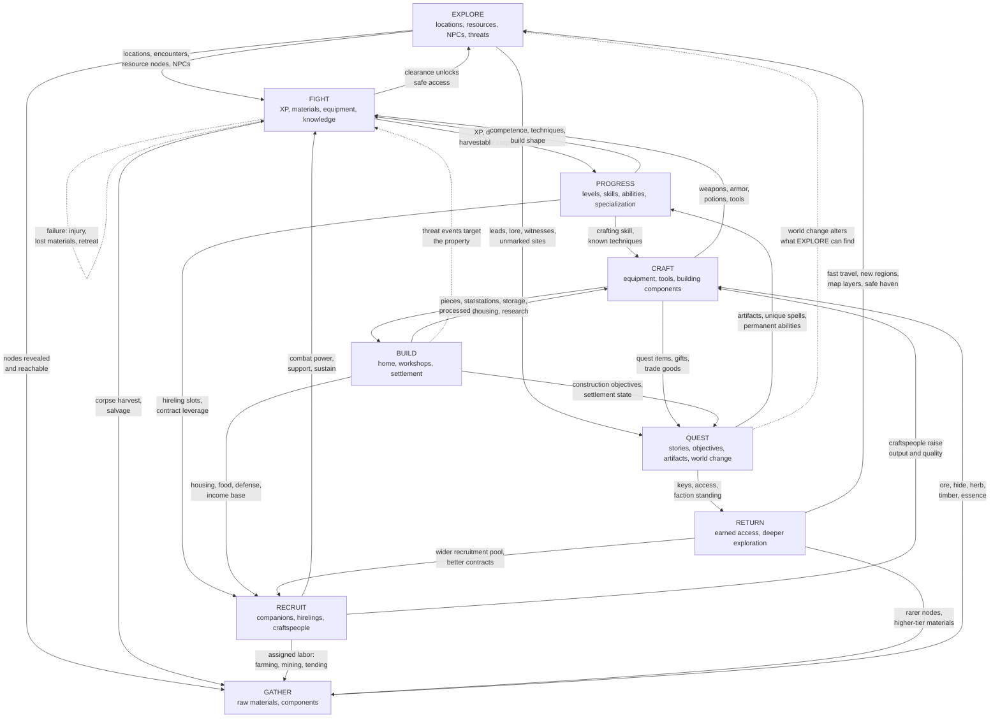

# GAMEPLAY_LOOPS.md — Phase 0 Gameplay Loop Definition

**Project:** Otherreach (codename UNNAMED) — full-body third-person with seamless first-person zoom, solo-first, open-world fantasy RPG
**Phase:** 0 — Vision and Architecture
**Authority:** `PROJECT_CHARTER.md` is the authoritative creative vision. `DECISIONS.md` records settled architecture as `D-01`..`D-12`; this file never contradicts a decision.
**Audience:** another AI coding session implementing Phase 1 from these documents alone.
**Produced for:** `PHASE_0.md` STEP 2 (define the major interconnected loops; explain where rewards enter and leave; identify exploitable circular economies and progression shortcuts).

## 0. How these loops are defined

Each loop below is specified with the same six fields, because a loop is only implementable if all six are answerable:

- **Verbs** — the player actions the loop is made of (these become input commands, `D-02`).
- **Inputs** — what must be true or held before the loop can be run at all.
- **Outputs** — what the loop produces, as *world state*, not as a feeling.
- **Reward entry points** — where value enters the loop.
- **Drains** — where value leaves the loop. **A loop with no drain is an exploit**, so every loop here has at least one.
- **Handoffs** — the specific edges where this loop hands value to another. These are what satisfy the charter's requirement that loops "reinforce one another rather than become isolated minigames."

Three conventions used throughout:

- Loop names are capitalized (`EXPLORE`, `CRAFT`) and refer to the loop; `D-xx` refers to a settled decision.
- **No-universal-scaling** (`D-06`, charter pillar 1) is assumed everywhere: nothing in this document scales to player level. Encounter power is authored per region and is a property of *place*, not of the player.
- All three timescales (moment-to-moment, session, long-term) are defined separately in §11 because they are routinely conflated. A loop can be healthy at one scale and broken at another, and the fixes are different.

Reference defaults recorded as assumptions, not requirements: the charter mandates an original setting and `DECISIONS.md` leaves tone open with a documented default of **melancholic, ancient, low-magic-feeling high fantasy**. Nothing in this document depends on that choice; where flavor is needed for a concrete example, that default is used and labeled.

## 1. Loop map

Solid arrows are the primary handoffs that make the loops one system. Dashed arrows are the secondary/return edges that close the circuit. Every arrow carries something the destination loop *cannot produce for itself*, which is the anti-isolation test from §12.

Reading the map: the strong edges form one cycle — `EXPLORE → GATHER → CRAFT → FIGHT → PROGRESS → FIGHT` — and a second — `EXPLORE → QUEST → RETURN → EXPLORE`. `BUILD` and `RECRUIT` sit *inside* both rather than beside them, and their edges only work in the direction shown. §12 states the anti-isolation invariants that this graph must satisfy; §13 lists the exceptions and shortcuts we explicitly permit.

## 2. EXPLORE

- **Verbs** — travel, look, climb, enter, inspect, listen, read, taste-risk, retreat.
- **Inputs** — a reachable frontier; a route or a direction rather than a marker; consumables and light; enough power to survive the *first* encounter of a region.
- **Outputs** — discovered locations, revealed resource nodes, met NPCs, identified threats, map knowledge, cartographic detail, fast-travel nodes, shortcuts and one-way doors, and lore objects that are themselves quest seeds.
- **Reward entry points** — discovery XP (charter: "exploration itself should generate experience, discoveries, resources, lore and opportunities"); map layers granted by purchased maps, cartography skill, NPC information, or magical discovery; caches and unguarded loot; unmarked dungeons with no quest attached, which the charter explicitly requires ("sometimes the reason for entering a mysterious door should simply be curiosity").
- **Drains** — time, consumables, durability, and **safety**: distance from a haven raises the cost of every mistake. Danger is a drain in the correct sense — the currency exploration spends is the player's margin for error.
- **Handoffs** — to `GATHER` (nodes become reachable), `FIGHT` (encounters become available), `QUEST` (leads and witnesses become available), `BUILD` (sites become known and legal to build on), `RECRUIT` (candidates are met, not bought from a menu).
- **Design constraint** — exploration must never be reduced to marker-following (charter pillar 3). Discovery is what `EXPLORE` outputs; the UI is not permitted to output it for the player. This is an implementation constraint on the quest and map systems, not a stylistic preference.

## 3. FIGHT

- **Verbs** — approach, prepare, block, dodge, strike, cast, use, retreat, harvest.
- **Inputs** — a threat; equipment (`CRAFT`); abilities and competence (`PROGRESS`); consumables (`CRAFT`); optionally companions (`RECRUIT`); knowledge of the specific enemy family (`EXPLORE`, `FIGHT` repeats).
- **Outputs** — XP; **coin** (the primary currency faucet, from loot tables and bounties); dropped and salvageable equipment; harvestable materials from corpses (hide, bone, essence, reagents); faction and reputation consequences; **knowledge**, which is a first-class output — the player's own learning about tells, resistances, and positioning, plus in-world knowledge such as a bestiary entry or a faction's response to the kill.
- **Reward entry points** — XP on kill; loot tables; rare and roaming spawns; bosses; and knowledge that converts future fights in the same family from dangerous to routine. The charter's "avoid turning high-level enemies into enormous HP sponges" is a **reward-shape** requirement: power growth must reduce fight *duration and risk*, not merely raise a damage number against a raised health number.
- **Drains** — health, stamina/spell resources, consumables, durability, injuries from a meaningful death system (charter §23), faction standing with the killed party's allies, and time. Failure is a drain with consequences rather than a reload (charter §22).
- **Handoffs** — to `PROGRESS` (XP), `GATHER` (corpse harvest), `EXPLORE` (clearing a route makes it traversable and discoverable), `QUEST` (kill objectives and the evidence they leave), `RECRUIT` (a rescued or impressed NPC).
- **Anti-sponge rule** — because nothing scales to the player (§14), enemy durability is a fixed authored property. The corollary is enforced at content authoring: a higher-tier enemy is more *dangerous* (damage, reach, speed, abilities, group composition), not merely longer to kill.

## 4. PROGRESS

- **Verbs** — spend, choose, train, practice, commit, specialize, decline.
- **Inputs** — XP (`FIGHT`, `EXPLORE`, `QUEST`, `CRAFT`); trainers and facilities (`BUILD`); teachers and faction access (`RECRUIT`, `QUEST`); practice with a specific weapon or school (`FIGHT`).
- **Outputs** — character level, attribute points, skill levels (weapon, magic, crafting, world, social), known techniques and formulas, reputation. Per `D-09` (amended 2026-09-23) these are **orthogonal axes with distinct questions**: level grants *breadth*, attributes *shape*, skills *competence*, techniques *capability*, reputation *access* (`PROGRESSION.md` §1).
- **Reward entry points** — XP awards; level-up events (attribute points); techniques and formulas learned from teachers, books, quests, study and discovery; skill thresholds that open new techniques rather than only raising damage.
- **Drains** — opportunity cost is the primary drain and must be real: the charter forbids "fake choices where every character eventually unlocks everything." Additional drains: attribute respec cost, the limited mastery designations (`PROGRESSION.md` §4.3), time and access to teachers, gear requirements, and the fact that specializing closes routes as well as opening them.
- **Handoffs** — to `FIGHT` (competence and capability), `CRAFT` (crafting skill and known techniques), `RECRUIT` (slots and contract leverage), `EXPLORE` (survivability at range from safety), `GATHER` (yield and rare-node access).
- **`D-09` enforcement** — a character cannot convert one axis into another, and the review test is falsifiable: if two axes always move together in playtest, they are one axis and must be merged. This test is run against real progression data, not argued on paper.

## 5. GATHER

- **Verbs** — survey, harvest, mine, fell, skin, fish, pick, dig, refine, carry, bank.
- **Inputs** — a known node (`EXPLORE`); a tool of sufficient tier (`CRAFT`); the profession or skill to extract it well (`PROGRESS`); carrying capacity and a route home.
- **Outputs** — raw and refined materials with **properties, not just tiers** — the charter requires iron, silver, star-metal, enchanted wood, and dragon bone to produce meaningfully different items. Also: node depletion state, discovered deposits, and refined intermediates.
- **Reward entry points** — node yield; rare and quality variants; profession skill from harvesting; regional specificity (a material exists in one region, which makes geography matter); and settlement-based production once `BUILD` and `RECRUIT` are running.
- **Drains** — tool durability and consumption, **node depletion and respawn timers** (the primary drain and the primary anti-farm guard), carry weight and travel time, and the opportunity cost of a gathering trip versus a fighting trip.
- **Handoffs** — to `CRAFT` (the main consumer), `BUILD` (stone, timber, processed components), `QUEST` (delivery and crafting objectives), and `FIGHT` (potions, ammunition, oils, reagents).
- **Design constraint** — `GATHER` must not be a self-sufficient moneymaker. Materials are worth most as *inputs* and least as vendor trash, or §13's first two exploits open. Yield is deliberately higher than vendor value.

## 6. CRAFT

- **Verbs** — learn a recipe, choose materials, place at a station, attempt, experiment, refine, enchant, augment, repair, fail.
- **Inputs** — materials (`GATHER`); a recipe or the knowledge to discover one (`QUEST`, `EXPLORE`, trainers); a station (`BUILD`); crafting skill and known craft techniques (`PROGRESS`); tooling; optional craftspeople (`RECRUIT`).
- **Outputs** — equipment, tools, building components, potions, scrolls, ammunition, enchantments, processed goods, and **discovered recipes** as first-class rewards. Outputs carry quality levels and craftsmanship so that two items of the same definition differ.
- **Reward entry points** — successful crafts; quality rolls driven by material properties, complexity and crafting skill; experimental discovery of new recipes; the charter's requirement that "crafting should not become irrelevant once dungeon loot appears," satisfied by letting master craftsmen reach equipment that competes with and eventually exceeds ordinary loot; and artifact-level crafting at the top of the discipline (charter §12).
- **Drains** — material consumption including **loss on failure**; station time; tool wear; and the fact that the value of a craft is capped by its inputs plus a margin (§13 exploit 3). Crafting is where materials are *destroyed*, which is what keeps `GATHER` honest.
- **Handoffs** — to `FIGHT` (equipment and consumables), `BUILD` (components and stations), `QUEST` (crafted deliverables and artifact steps), `GATHER` (better tools raise yield: a direct positive feedback edge), and `RECRUIT` (equipping companions).
- **Phase note** — one profession and a handful of recipes in Phase 1. The charter's full profession list is deliberately **not** enumerated here as a build target; `PHASE_0.md` forbids generating hundreds of recipes.

## 7. BUILD

- **Verbs** — claim a site, place a piece, snap, rotate, socket, assign, station, store, repair, upgrade, expand, defend.
- **Inputs** — materials and components (`GATHER`, `CRAFT`); a legal site (`EXPLORE`); labor (`RECRUIT`); and something worth protecting, which is the emotional input the loop actually runs on.
- **Outputs** — crafting stations; storage; food production; defenses; research; magical functions; hireling housing; merchants; resource processing; training facilities; and settlement state (population, services, growth).
- **Reward entry points** — capability, not currency: the home *enables* other loops rather than paying out. A workshop raises `CRAFT`'s ceiling; a garden enables food production; a library enables research; a trophy room is prestige. This is the charter's "building should integrate with gameplay rather than be purely decorative."
- **Drains** — the largest material sink in the game, deliberately: materials spent on building are materials not spent on gear, which is a genuine player decision. Also upkeep and repair, staff wages and food, and the risk of loss to `FIGHT` (charter §14: property threats).
- **Handoffs** — to `CRAFT` (stations and quality), `RECRUIT` (housing, food, wages), `QUEST` (construction objectives and settlement world-change), `GATHER` (assigned production), and back to `FIGHT` as a target that can be attacked.
- **Anti-annoyance constraint (charter §14, hard requirement)** — attacks on the player's property must not be frequent enough to make building annoying, and players who dislike base defense must be able to **greatly reduce or disable** its frequency. This is an options requirement, not a difficulty setting, and it must exist in the same phase `BUILD` ships.
- **`D-08` constraint** — socket/snap assembly only. No structural simulation, no collapse, no load-bearing calculation. This is what guarantees that player-built structures stay navigable for NPCs and companions and remain cheap to persist (`RK-06`).

## 8. RECRUIT

- **Verbs** — find, court, hire, negotiate, equip, instruct, promote, dismiss, trust.
- **Inputs** — money and standing (`FIGHT`, `QUEST`); housing and food (`BUILD`); reputation and faction access (`PROGRESS`, `QUEST`); and **encountering** the candidate in the world (`EXPLORE`) — recruitment is a payoff for exploration, not a shop menu.
- **Outputs** — combat companions; labor hirelings (fighter, archer, healer, mage, scout, hunter, craftsman, farmer, merchant, guard, steward); assigned workers; and relationships with morale, loyalty, opinion, and personal history.
- **Reward entry points** — capability and coverage: a companion covers a weakness the player's build cannot (charter §2, solo-first without required parties); a craftsman raises `CRAFT` output; a farmer converts `BUILD` land into food; a merchant raises prices obtainable. Relationship progression is itself a reward channel and the charter's stated answer to loneliness.
- **Drains** — ongoing wages, food, and housing; equipment cost; **morale and loyalty loss** from mistreatment, dangerous orders, or deaths; the risk of losing or alienating a companion permanently, which is a consequence the charter wants (failure that creates consequences rather than reloads); and the opportunity cost of a slot.
- **Handoffs** — to `FIGHT` (party power), `GATHER` (assigned labor raises yield), `CRAFT` (craftspeople), `BUILD` (guards, stewards, population), `QUEST` (companion personal quests and faction objectives).
- **Solo-first constraint** — the charter forbids designing content around mandatory parties. Therefore no objective may *require* a companion; companions must be an accelerant and a safety margin, never a key. This is an authoring rule for `QUEST` and a hard requirement on the party-slot design.
- **Phase note** — Phase 1 ships exactly **one** companion with a minimal behaviour set, and `RK-05`'s reliability metrics (stuck events, path failures, friendly-fire incidents, time-to-kill ratio versus solo) are **measured** here but are **not** a Phase-1 exit gate: `PROTOTYPE.md` explicitly defers companion AI *quality* to the vertical slice, and Phase 1 must not be blocked on a quality bar that only real content can meet. What Phase 1 must prove is that one companion can be recruited, follow, fight, and survive a save/load cycle. Personality, dialogue trees, and personal quests are Phase 2 and must not be built on unreliable pathing.

## 9. QUEST

- **Verbs** — hear, read, ask, investigate, follow, choose, deliver, build, craft, kill, decide, fail, refuse.
- **Inputs** — leads (`EXPLORE`, dialogue, books, tavern rumor — the charter's "I heard an NPC mention something strange in a tavern"); materials and crafted goods (`GATHER`, `CRAFT`); access (`RETURN`); standing (`PROGRESS`); and for artifact chains, knowledge obtained in the world.
- **Outputs** — story state; world change; artifacts, unique spells, permanent abilities, titles, access to new areas, mounts, property, crafting stations, companions (charter §9); faction and relationship consequences; and **new leads**, which is what makes quests a loop rather than a list.
- **Reward entry points** — per `D-07`, a quest is a YAML graph of objectives, each satisfied when a predicate over world state becomes true. Rewards enter at objective satisfaction, at branch resolution, and at chain completion. Per the charter, epic rewards "should usually involve STORIES, not random drops," so the primary reward entry is narrative and capability, with loot secondary.
- **Drains** — time; consumables and travel; **failure states** (charter §22: the player should be able to fail quests, anger people, and lose opportunities); irreversible choices; reputation cost with the faction the player acted against; and the accepted risk that a long artifact chain is abandoned — which must be a legal outcome, not a soft-lock.
- **Handoffs** — to `PROGRESS` (artifact and ability rewards), `RETURN` (access), `EXPLORE` (world change alters what can be found, and completed objectives reveal new sites), `RECRUIT` (companion quests), `BUILD` (construction objectives), `CRAFT` (knowledge and recipes).
- **Phase note** — one quest in Phase 1, at minimum. The moment-to-moment quest experience must be validated before `D-07`'s predicate framework is expanded; `RK-04` explicitly validates expressiveness on paper **before** quest engine code is written.
- **`D-07` constraint** — the engine evaluates predicates; it does not contain per-quest logic. A per-quest code workaround is a design defect to fix in the objective schema, not to absorb into a script.

## 10. RETURN

`RETURN` is the loop that closes the circuit and the one most often left implicit. It is the mechanism by which accomplishment converts into *reach*, so the player's second hour covers more ground than their first without the world being made easier.

- **Verbs** — recall, fast-travel, unlock, chart, open, cross, gain passage, establish an anchor.
- **Inputs** — accomplishments: discovered teleportation stones, mage portals, caravan routes, boats, mounts, settlement travel networks, recall spells, and player-created anchors (charter §3); faction standing and permissions; keys and access earned in `QUEST`.
- **Outputs** — earned fast travel; map layers and cartographic detail; new regions opened; safe havens and forward operating bases (`BUILD`); shortcuts and one-way doors made permanent; and the ability to bring companions, mounts, and supplies to places that previously required traveling light.
- **Reward entry points** — access itself is the reward, per the charter's "fast travel should exist but should generally be EARNED." Additional entries: safe-haven services, deeper map knowledge that reveals *where not to go yet*, and reduced travel cost that raises the value of every other loop's output by reducing the time to realize it.
- **Drains** — access can be lost (faction standing collapses, a settlement falls, an anchor is destroyed); anchors and portals cost materials and upkeep; and the largest drain is **the world's fixed danger**, because returning to a previously lethal region does not make it easier to *reach* — it makes it survivable to *stay* in.
- **Handoffs** — to `EXPLORE` (the primary edge: wider radius, higher stakes), `GATHER` (rarer node tiers become reachable and worth hauling), `RECRUIT` (a wider pool and better contracts), `BUILD` (remote and higher-value sites become viable), `QUEST` (access gates open).
- **Design constraint** — `RETURN` must not be implemented as "the map opens up." It is earned per-node and per-permission, so the player's mental map of *what they have earned* stays legible. This is a direct `EXPLORE`-pillar requirement.

## 11. Three timescales (do not conflate)

The single most common failure in this kind of design is tuning one timescale's loop and calling the game healthy. They are separately specified, separately measured, and separately owned.

### 11.1 Moment-to-moment loop — **seconds to ~90 seconds**

> perceive → decide → commit → resolve → re-evaluate

- **Perceive** — read the situation: what is ahead, what it wants, what it is weak to, what retreat costs.
- **Decide** — engage, prepare, circumvent, or leave. This is where no-scaling pays off: the *decision* is real because leaving is genuinely available and genuinely correct at low power (charter pillar 1: "a level 5 player who wanders into an ancient cursed valley … should realize: *I should not be here yet*").
- **Commit** — swing, cast, harvest, place a piece, buy, open a dialogue option.
- **Resolve** — damage, yield, quality roll, placement validity, dialogue response.
- **Re-evaluate** — the state changed; the next decision is different.
- **Design target** — combat is "readable rather than hyper-fast" (charter §7), which means the moment loop is allowed to be slower than a modern action RPG and must not be tuned for twitch. The measurable property: *a competent player can explain why they lost a fight after losing it.* If they cannot, the moment loop is unreadable and the FIGHT loop's knowledge output has failed.
- **Failure symptom at this scale** — the loop is repetitive because commit and resolve are decoupled (the player's input does not visibly change the outcome), not because the content is thin.

### 11.2 Session loop — **30–120 minutes**

> prepare → depart → travel/discover → execute (dungeon / hunt / build / craft) → extract → deposit → close

1. **Prepare** (5–15 min) — repair, restock potions and ammunition, craft or enchant, re-spec nothing, pick a companion and instructions, choose materials to carry, decide the session's goal. Preparation is playing, not overhead: it is where `CRAFT`, `BUILD`, `RECRUIT`, and `PROGRESS` all express themselves.
2. **Depart and travel** (5–20 min) — the route is part of the session. Earned fast travel (`RETURN`) compresses this, which is *why* it is worth earning.
3. **Execute** (15–60 min) — one primary activity: a dungeon, a hunt for a specific material, a construction push, a quest stage, or a deliberate grind (charter §11).
4. **Extract** (5–15 min) — carry the yield home under risk. The distance from safety is what makes the yield feel earned, and it is the drain that gives `EXPLORE` its cost.
5. **Deposit** (5–10 min) — bank materials, vendor surplus, hand in a quest, assign a craftsman, start a build, log a discovery.
6. **Close** — the player either saves and stops, or finds one more thread. Producing that second option reliably is a *content* requirement (unfinished business that is legible), not a mechanical one.

- **Design target** — a session must be completable at any of 30, 60, or 120 minutes with a *satisfying* deposit step. This is a direct argument against long, unsavable engagements, and it constrains dungeon length and death penalty severity (charter §23: death must matter but not be infuriating).
- **Failure symptom at this scale** — sessions end without a deposit step (the player quits mid-dungeon and loses the yield), or the prepare and deposit phases are so thin that the 30-minute session has no shape.

### 11.3 Long-term loop — **dozens of hours**

> accumulate capability → unlock access → transform home and relationships → change the world → repeat at higher stakes

- **Capability accumulation** — the orthogonal axes of `D-09` climb at different rates, so the character has a *shape* rather than a number. The charter's long list of possible identities (battlemage, necromancer, landowner, founder, master craftsman) are all different points in this space, not different classes.
- **Access unlocking** — `RETURN` converts power into reach; `QUEST` converts reach into artifacts and permanent abilities; `BUILD` converts wealth into self-sufficiency.
- **Home and settlement transformation** — the charter's campfire → camp → shelter → cottage → home → workshop → estate → fortified homestead → settlement progression is a long-term loop in its own right, and it is the clearest expression of "I started as nobody."
- **Relationship arcs** — companion stories and faction standing change over dozens of hours (charter §2, §20). This is the axis that replaces the social role other players held.
- **World change** — persisting consequences of the player's actions (`D-05` deltas over the deterministic baseline), which is what makes a long loop feel like it happened in a *place*.
- **Endgame continuation** — the charter requires that the game "should not simply 'end' when the main plot finishes": legendary quests, artifact crafting, superbosses, settlement expansion, mastery progression, collecting.
- **Failure symptom at this scale** — the player runs out of *new questions* rather than new content: no build decision remains interesting, no region remains unvisited, and no relationship remains unresolved. The charter's tie-break for new content is whether it creates a story like the ones in its CREATIVE DIRECTIVE section.

## 12. Handoffs that prevent isolated minigames

The charter requires loops to reinforce one another. That is only true if each loop consumes something it cannot produce. These are the specific invariants an implementation session must not break:

1. **`GATHER` cannot feed itself into `CRAFT` without `EXPLORE`.** The best materials are behind geography and danger, not behind time. If every material is available near a settlement, `EXPLORE` has no claim on `CRAFT` and the game becomes a farming simulator with combat attached.
2. **`CRAFT` cannot be the sole source of `FIGHT` power, and `FIGHT` cannot be the sole source of `CRAFT` inputs.** The charter requires that crafting remain relevant once dungeon loot appears *and* that loot remain exciting. Both directions must exist: craftable goods that compete with loot drops, and loot/reagents that only fighting yields.
3. **`FIGHT` must be the primary source of XP, but not the only one.** Exploration, quests, and crafting all grant progress (charter §3, §12), so a session spent building or exploring is not punished. But combat must remain the densest XP source or the combat pillar is decorative.
4. **`BUILD` must pay out in capability, not currency, or `BUILD` becomes a money printer.** Stations, storage, housing, production, and research *enable* other loops. Rent and passive income are capped deliberately (§13 exploit 6).
5. **`RECRUIT` must never be required by content and never be a substitute for the player.** Solo-first means companions accelerate and protect; they do not open doors the player cannot open.
6. **`QUEST` must be discoverable in the world, not dispensed by a marker.** `EXPLORE → QUEST` is the edge that makes the world the primary character. A quest UI that reveals all leads converts the game into a theme-park RPG, which the charter explicitly forbids.
7. **`RETURN` must be earned per node, not unlocked globally.** Otherwise it collapses `EXPLORE`'s travel cost and the whole economics of extraction.
8. **`PROGRESS` must not be convertible into `CRAFT` output, or into `RETURN` access, without the respective loop's inputs.** No buying crafting skill with gold alone; no buying fast travel with level. `D-09` states this: a character cannot convert one axis into another.

## 13. Exploitable circular economies and progression shortcuts

Each exploit is stated with the intended guard and the cheapest place to catch it. Guard values are tuning parameters owned by `PROFESSION`/`ECONOMY` content, but the *shape* of each guard is architectural and belongs to Phase 1–2.

| # | Exploit | Why it happens | Intended guard | Where it is caught cheaply |
|---|---|---|---|---|
| **E-1** | **Buy-low / sell-high across regions.** Buy a material cheap in the mining settlement, sell it dear in the city; repeat on a caravan route with earned fast travel. | Regional price differentiation is required by the charter (a sword in a mining settlement should differ from rare magical equipment in a city), so a price differential is designed in — the exploit is that arbitrage has no cost. | Arbitrage is limited by **carry capacity, travel cost, and merchant liquidity**, not by forbidding it. Buying in quantity raises the local price and drains the merchant's cash reserve, so the loop self-limits: the second run is worse than the first. Merchant stock and prices respond to local supply, faction standing, and time. | Phase 2 economy simulation harness: run the loop 100 times against the price model and assert gold-per-hour stays below the intended `FIGHT` earning rate. This is a pure domain-layer test with no engine and no UI. |
| **E-2** | **A farmable resource vendored faster than intended.** One node type has high yield, low danger, short respawn, and a vendor willing to buy unlimited quantity. | Every input to this is individually reasonable — the charter *wants* useful grinding (charter §11) — but the combination makes `GATHER` the best gold-per-hour in the game, which inverts the intended priority of `FIGHT` and `EXPLORE`. | Materials are worth most as **inputs** and least as vendor trash: vendor price for raw materials is set below the value they create in `CRAFT`, and vendors buy limited quantity per restock. Node depletion and respawn timers are the primary pacing lever, and their values are `GATHER` content tuning rather than an architectural guarantee. | Phase 1: instrument gold-per-hour and XP-per-hour per activity in a telemetry log, and compare `GATHER`-only sessions against `FIGHT` sessions. Two numbers, no theory. |
| **E-3** | **A recipe whose output's vendor value exceeds its inputs' cost.** A money printer reached through the crafting table. | This is the classic crafting-economy failure and it appears *by accident* whenever recipes and prices are authored separately by different sessions. | A hard invariant, checked in CI for **every** recipe in the content set: `vendor_value(output) ≤ Σ(market_cost(inputs)) × margin`, with `margin < 1.0`. Crafted goods also have no guaranteed buyer at that price. | This is a unit test over content, not over gameplay: enumerate every `RecipeDefinition`, resolve its inputs against the price model, and assert the invariant. It costs nothing and runs on every content commit. Build it as soon as `D-03`'s validator exists. |
| **E-4** | **Infinite or too-fast respawn exploited for XP.** Camp a spawn point, or abuse a population that refreshes while the player stands in it. | Respawn is required for a living world (charter §18 world events, §16 ecology), and the charter permits deliberate grinding — so the risk is *rate*, not existence. | Spawn populations are bounded per region and per cell with a cooldown; XP diminishes steeply for repeated kills of the same definition in a short window; high-value spawns are placed away from safe rest points. Deliberately, ordinary wildlife farming is **permitted** as the charter intends — the guard targets degenerate rates, not the activity. | Phase 1: a headless soak that simulates 8 hours of in-game time at a single camp point with a fixed kill rate, and reports XP/hour. One script, one number, and it distinguishes "useful grinding" from "broken." |
| **E-5** | **A companion that trivializes combat.** One cheap hireling solos content the player cannot, converting `RECRUIT` into a difficulty bypass and hollowing out `FIGHT`. | Companions are required to be genuinely helpful (charter §15) and to cover the roles other players filled (charter §2). Helpfulness and trivialization are separated only by a power budget. | Companion power is budgeted **below a same-level player on every axis**; companions cannot out-scale the player; their power is gated by cost, upkeep, morale, housing, and equipment — all of which are `BUILD`/`GATHER`/`CRAFT` sinks. Companions can die, refuse dangerous orders, or leave when mistreated, which makes them a liability as well as an asset. | Phase 1 instrumentation from `RK-05`: measure time-to-kill ratio of solo versus with one companion against a benchmark enemy, and set an explicit ceiling on the ratio as an acceptance criterion. |
| **E-6** | **`BUILD` as a passive income engine.** Farms, merchant stalls, or rent generate materials or gold faster than the player can earn them actively — including offline, via `D-06`'s abstract tiers. | `D-06` abstract simulation advances schedules and coarse state while the player is away, which is exactly the mechanism that can mint resources without play. | Settlement production is capped by **staffing, land, inputs, and upkeep**, and it produces *materials and services* more than gold. Produced goods still require deposit, transport, and sale subject to E-1's liquidity limits. Offline advancement is explicitly restricted by `D-06` to schedules and coarse position — production is not advanced abstractly without staffing and inputs. | Phase 2, and it is cheap because it is a domain-layer simulation: advance the clock 30 in-game days with the player absent and assert settlement output stays under a stated ceiling. |
| **E-7** | **Progression shortcut: buying power with gold, or buying `RETURN` access with level.** Skips the loop that is supposed to produce the capability. | Wealth from any loop is fungible, so the natural player behaviour is to convert it into whatever axis is cheapest — which collapses `D-09`'s orthogonal axes into one. | `D-09`'s rule is absolute: a character cannot convert one axis into another. Gold buys **goods and services** (equipment, crafting fees, teachers' fees, hireling wages, building materials), never **rank** — not skill, not reputation, not fast-travel permission. A teacher's fee buys access to knowledge; the knowledge still needs skill (`PROGRESSION.md` §4.4). Reputation and access are earned through deeds and faction relationship, never purchase. | Content review checklist against `D-09`, plus a Phase-2 grep-level test: no content definition may grant skill, level XP or a reputation rank in exchange for currency. Cheap, and it prevents the drift before it exists in data. |
| **E-8** | **Respec or multi-build abuse.** Rotate builds freely to trivialize content that requires commitment. | The charter requires meaningful specialization *and* permits hybrids, and it forbids fake choices — full freedom to respec is a fake choice with extra steps. | Respec is possible but costs, is gated behind access, or is scarce in a way that makes commitment legible. The charter's `D-09` revisit test applies: if players routinely respec per-encounter, builds are not decisions. | Playtest telemetry: count respecs per session in the vertical slice. A single number decides whether the cost is right. |
| **E-9** | **`QUEST` reward farming by re-acquiring a repeatable objective's payout.** | Repeatable objectives are needed for factions and world events (charter §18, §20), so a repeatable predicate exists by design. | Repeatable objectives pay diminishing or non-material rewards, and their payouts are tracked per objective instance. Substitution risk: a repeatable objective that pays materials competes with `GATHER` and must be priced accordingly. | CI content check: every repeatable objective declaration must include a diminishing-reward policy or be flagged as a validation error at load (`D-03`'s validator already reports these with file and line). |
| **E-10** | **Money becomes meaningless: the coin supply grows without bound because every guard regulates the *rate* of earning rather than the *stock* outstanding.** | `E-1`..`E-6` all bound throughput (liquidity, respawn, staffing, margins). None of them bounds total wealth. Since `E-7` forbids buying *rank* with gold, wealth can only convert into **equipment** — and `AX-EQP` is the one axis the non-conversion law deliberately exempts because it is "immediate and losable" (`PROGRESSION.md` §11.3). Unbounded gold therefore launders into unbounded power through the single legal channel. | **A faucet and a sink, both stated, plus a stock ceiling.** Faucets: combat loot tables and bounties (primary — coin is a `FIGHT` output), quest rewards, and material sales to merchants. Sinks, in ascending phase order: **repair and durability** (Phase 1), crafting fees and hireling wages (Phase 2), construction materials and property upkeep (Phase 2+), and fast-travel/portal upkeep (Phase 2+). The architectural rule is that a **sink must be non-discretionary** — a player who ignores it degrades — because a purely optional sink is not a sink. Measured ceiling: total coin outstanding must stay within a stated band per character level, and if it does not, the response is a sink, never a price increase on essentials. | Phase 1: the telemetry skeleton already records per-activity gold-per-hour; add **total coin held at each level-up** and assert it stays inside the band. That is one number per level, and it is the only cheap way to see the supply problem before Phase 3. Domain-layer test, no engine. |

**Explicitly *not* treated as exploits** (they are intended play, and guards must not accidentally forbid them): deliberate grinding for XP, hides, rare drops, mastery practice, or reputation (charter §11); selling surplus gathered materials; using a strong companion well; and out-levelling content through skill rather than stats.

## 14. Interaction with the no-universal-level-scaling rule

The charter is unambiguous: **do not globally scale every creature to the player's level**, and a level 5 player who wanders into a level-40 region should realize "I should not be here yet." Everything above depends on how this plays out mechanically, so it is stated explicitly for the implementing session.

**What is fixed (authored, never player-relative):**

- **Encounter power** is a property of *place*, authored per region and per dungeon, not per player level. There is no level-matching table anywhere in the codebase, and adding one would violate the charter.
- **Quest difficulty** is fixed by content, not by the player's level. A quest offered to a level 5 player is not silently weakened if they attempt it at level 40; it simply becomes easy.
- **Reward tier** is fixed by location and difficulty, not by level. This is why a rare weapon found at level 15 can remain useful at level 25 (charter §8) — item value is a property of the item.
- **Loot** is drawn from region- and source-appropriate tables (`D-03` `LootTableDefinition`), never from level-banded tables. This is the single most tempting place to reintroduce scaling by accident; it is forbidden.

**What changes is the player, along several independent axes (`D-09`):**

- **Raw power** — level, attributes, equipment, weapon and magic skill.
- **Capability** — new abilities that change *options* (crowd control, ranged answers, escape, healing, summoning, traversal), not just numbers.
- **Competence** — the player's own learned knowledge of tells, resistances, and positioning. This is a real progression axis even though it is not a stat, and it is why returning to a region should feel dramatically different even at the same character level.
- **Preparation** — consumables, oils, resistances, companion composition, and environmental advantages (charter §2 lists exactly these as the intended answer to difficulty).

**Consequences the loops must be designed around:**

1. **"Dangerous places you can enter too early" must remain meaningful.** This requires that (a) no hard gate blocks entry — the charter wants the *realization*, not a locked door — and (b) the danger must be *legible before commitment*, so the player can retreat. Legibility is what makes it a decision rather than a trap. World design must telegraph tier through visible, readable signals; this is a `WORLD_ARCHITECTURE.md` obligation this loop model depends on.
2. **Returning later must feel like progression.** `RETURN` exists precisely to make this pay off: the player who reaches a lethal region at level 5 and returns at level 25 should find the *same* fixed threats now survivable, plus materials and secrets that were previously inaccessible. Nothing about the region changed; the player did. If the region were scaled, this payoff would be destroyed.
3. **The one-way ratchet must be bounded.** Because the world is fixed and the player grows, old regions eventually become trivial. This is accepted, and the intended guards are: high-tier spawns placed sparsely in already-cleared regions, world events (charter §18) that push dangerous forces into familiar ground, and rare roaming bosses (charter §18) that prefer low-traffic areas. These escalate *locally* and *temporarily*, without changing any baseline power value — which keeps them compatible with `D-05`'s deterministic baseline and `RK-01`. Escalation must be expressed as a spawn/event delta, never as a change to a definition.
4. **Reward relevance decays with region, so the reward curve must lead the player outward.** Because `CRAFT` can eventually produce equipment competing with ordinary loot (charter §12), `FIGHT`'s reward relevance in old regions declines on purpose. This is the mechanism that pushes the player toward `RETURN` rather than farming. It must not be "fixed" by adding scaling.
5. **No scaling means no level-gated content, which raises the content-authoring bar.** A region must be honest about its tier in its visual language and its creature behaviour. This is the strongest argument for handcrafting frontier regions rather than procedurally filling them (charter PROCEDURAL GENERATION: major locations receive intentional design; procedural assists vegetation, resources, minor encounters, loot variation).

## 15. Phase assignment

Consistent with `PHASE_0.md` STEPs 15–16, the charter's DEVELOPMENT PHASES, and `D-12`'s region-by-region scope rule. **Phase 1 proves only the core loop.** Anything in the Deferred column is deferred deliberately, and building a deferred loop during Phase 1 counts as a scope failure (`RK-10`).

| Loop | Phase 1 — Prototype (prove the core loop) | Phase 2 — Vertical slice (prove it is fun) | Deferred (Phase 3+) |
|---|---|---|---|
| **EXPLORE** | One small wilderness region plus one small settlement; discovery without markers; no fast travel at all (the region is walked). | One meaningful region; multiple wilderness areas; cartography and map layers; earned fast travel as discovered nodes; 2–4 dungeons; secrets and unmarked sites. | Additional regions; mounts; boats; caravan routes; player-created teleport anchors; regional map markets. |
| **FIGHT** | Melee, ranged, and basic magic; several enemies; health and death; readable combat; no sponge design. | 10+ enemy archetypes across families; multiple weapons; several magic schools; one boss; status effects, resistances, damage types in full. | Rare roaming bosses; ecology behaviours; large-scale faction battles; apex creatures. |
| **PROGRESS** | XP, levels, basic skills, one weapon skill; a first real build decision (free attribute spend). | Many disciplines and technique webs; multiple builds; weapon and magic skills; reputation; factions. | Mastery of designated disciplines past the normal cap; Great Works and legacy (no prestige ladders); transformation abilities. |
| **GATHER** | Harvesting from nodes and corpses with depletion; two or three material families with distinct properties. | Multiple professions' material sets; regional specificity; assigned labor. | Farming, fishing, hunting as full professions; settlement-scale production chains. |
| **CRAFT** | Exactly one profession and a small recipe set — enough to prove materials in, better equipment out, with quality. | Several professions; crafting progression; enchanting; one epic-equipment path. | Artifact-level crafting; full augmentation; experimental discovery at scale. |
| **BUILD** | **Not in Phase 1.** A campfire/rest point is the only exception, if needed for the save/load proof. | Basic building: foundations, walls, a station, storage, one upgrade tier; property threats with the charter-mandated frequency reduction/skip option. (M7 reconciliation (2026-09-24): M7 ships basic building without property threats or the attack-frequency option; both move to M10 with home defense, per `ROADMAP.md` M10) | Settlement growth; NPC assignment at scale; defenses; estate and fortified homestead tiers. |
| **RECRUIT** | **Exactly one companion**, introduced through the world rather than a menu, with a **minimal** behaviour set (follow/wait, catch-up, death) — no personality content, no personal quest. `RK-05`'s quality metrics are *measured* here but are not a Phase-1 exit gate: `PROTOTYPE.md` explicitly defers companion AI *quality* to the vertical slice. | One recruitable companion with dialogue; hirelings for one or two roles; companion equipment and instructions; relationship state that changes. | Companion personal storylines; relationship networks between companions; companions as settlers and merchants. |
| **QUEST** | At least one quest with a real purpose and a non-kill objective; the `RK-04` expressiveness spike completed on paper **first**. | One substantial multi-stage quest; faction and reputation consequences; failing a quest as a legal outcome. | Long artifact chains (dozens of hours); hidden and timed objectives at scale; world-state branching. |
| **RETURN** | **Not in Phase 1.** No teleport network exists in a single walkable region. | Discovered teleportation stones; faction-gated access; a second dungeon tier unlocked by accomplishment. | Recall spells; settlement travel networks; portals with upkeep; cross-region logistics. |
| **Economy / E-1..E-10 guards** | Only the guards that are unit-testable at zero content volume: E-3 (recipe-vs-input invariant), the `D-09` no-rank-for-gold check, and **E-10's coin-stock band** (one number per level-up, asserting total coin outstanding stays inside its band). | Live price model; merchant liquidity; non-discretionary repair sink; telemetry for E-1, E-2, E-4, E-5; respec cost decision. | Full regional economy simulation; settlement markets; trade skills and merchant reputation. |
| **Companions, factions, settlement simulation, base defense at frequency, world events, epic quests, endgame** | **Explicitly out of scope.** | Factions, reputation, and one major quest only. | Everything else, in the order `ROADMAP.md` and `D-12` dictate — one region completely before a second. |

**Phase 1's definition of done, stated as loops:** the player can `EXPLORE` a region, `FIGHT` and survive or not, gain XP and see `PROGRESS`, `GATHER` materials, `CRAFT` something better than they started with, complete one real `QUEST`, do all of it alongside one reliable companion, and save and reload the result. Nothing else. `BUILD` and `RETURN` are deliberately absent because a single small region cannot contain meaningful versions of either, and pretending otherwise is the scope failure `RK-10` warns about.

*Assumptions recorded by this document:* (a) the charter's tone default from `DECISIONS.md` (melancholic, ancient, low-magic-feeling high fantasy) is used for examples only and constrains no loop structure; (b) `BUILD` and `RETURN` are excluded from Phase 1 on the grounds that a walkable single region cannot exercise them — if the owner requires either in Phase 1, the region size and Phase-1 timeline change, and that is a scope decision for the owner, not an implementation detail; (c) economy guard values (margins, respawn timers, XP decay windows, companion power ratios) are tuning parameters belonging to `ECONOMY`/`PROFESSION` content and are intentionally not numbered here, but the *shape* of each guard is architectural; (d) `PROTOTYPE.md`, `VERTICAL_SLICE.md`, and `ROADMAP.md` own the detailed Phase-1/Phase-2 content lists, and this document's phase table is the loop-level summary that those must not contradict.
