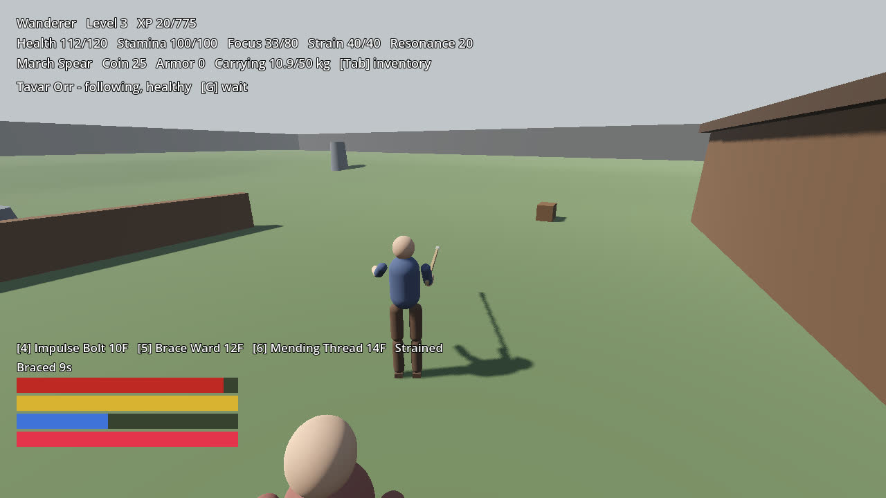
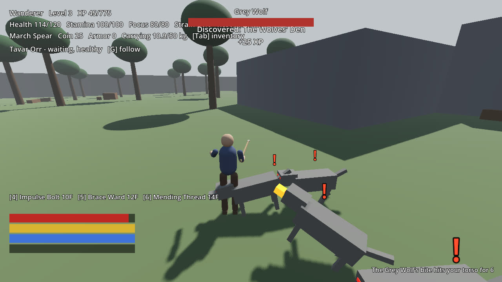
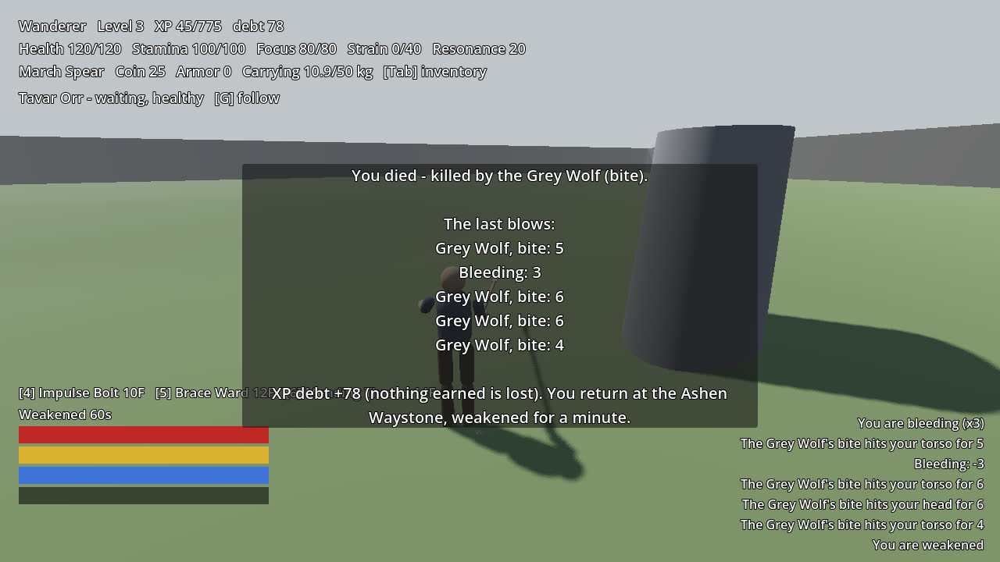

# The relaunch: load, compare, and a death (C17)

Content 0.3.0 (sha256:9600e5f4c7064aa9fde5d6b09360df15157bef4edf7d178e8961e44ac2193e75), world seed 0x0A5E202609240001, 50 ms ticks, one a frame. Game time is world ticks as minutes and seconds.

| Game time | Tick | What happened |
|---|---|---|
| 6:04 | 7295 | Start: (48.2, 136.9), level 3, carrying Rough Arrow x18, Minor Salve x2, Ashbloom x2, Raw Iron Ore x1, Water Flask x1, Hunting Bow x1, March Spear x1, Rusted Sword x1 |
| 6:04 | 7295 | Loaded: 412 fields compared, 0 differences (state_diff.txt); state digest `sha256:f1c2f126ed51ed9477c52dd618681516545abcd675e625e237f5dd0477a4fef0` |
| 6:04 | 7295 | **Relaunched and loaded the acceptance save**  |
| 6:05 | 7302 | **Tavar told to wait** |
| 6:05 | 7302 | Tavar Orr: wait |
| 6:28 | 7769 | Discovered: The Wolves' Den |
| 6:30 | 7802 | **To the wolves' den**  |
| 6:38 | 7964 | The character died: ability.creature.wolf_bite (Grey Wolf); XP debt added 78 |
| 6:38 | 7964 | Returned at the Ashen Waystone: (30.0, 158.0) |
| 6:38 | 7965 | **Stood against the pack until it killed the character**  |
| 6:38 | 7972 | Deaths 1; XP debt 0 before, 78 added by the death, 78 now: the penalty applied exactly once |
| 6:38 | 7972 | **Back at the Ashen Waystone, the debt owed once (C17)**  |
| 6:38 | 7979 | Finished: every beat happened. |
