# The owner's M6 playtest delta, shown

Content 0.3.0 (sha256:f40a9d5c0277c2e3a242dd7639ed41c25aaa5c4899fa9b5eb8858d7c13497cb6), a fresh game, the real command path. Asset art: none - greybox.

| Tick | What the picture shows |
|---|---|
| 40 | **The compass at the top: heading only, in third person (east from the Waystone)** 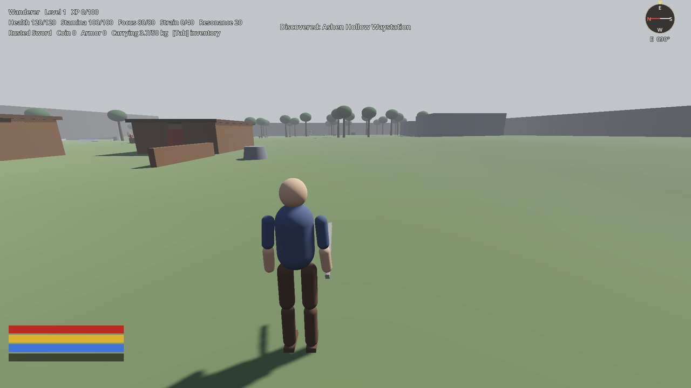 |
| 81 | **The compass in first person, looking north** 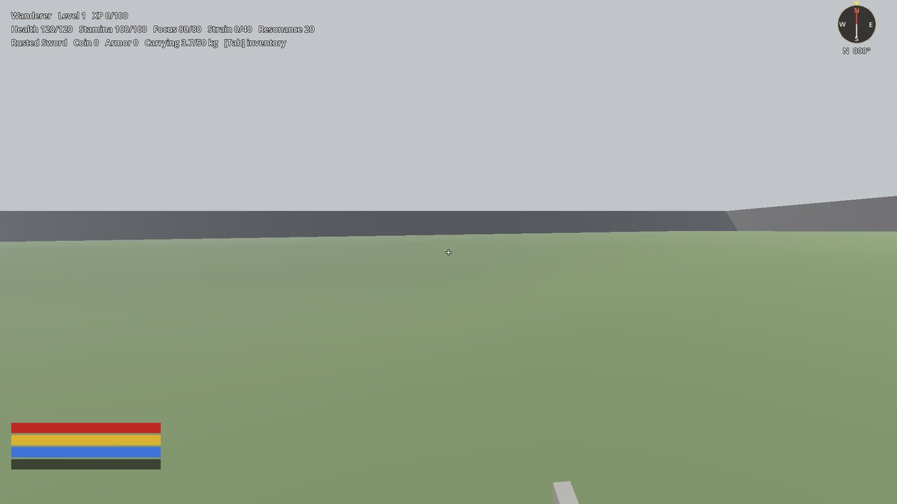 |
| 101 | **F1: the controls, read from the input map (the developer's keys apart)** 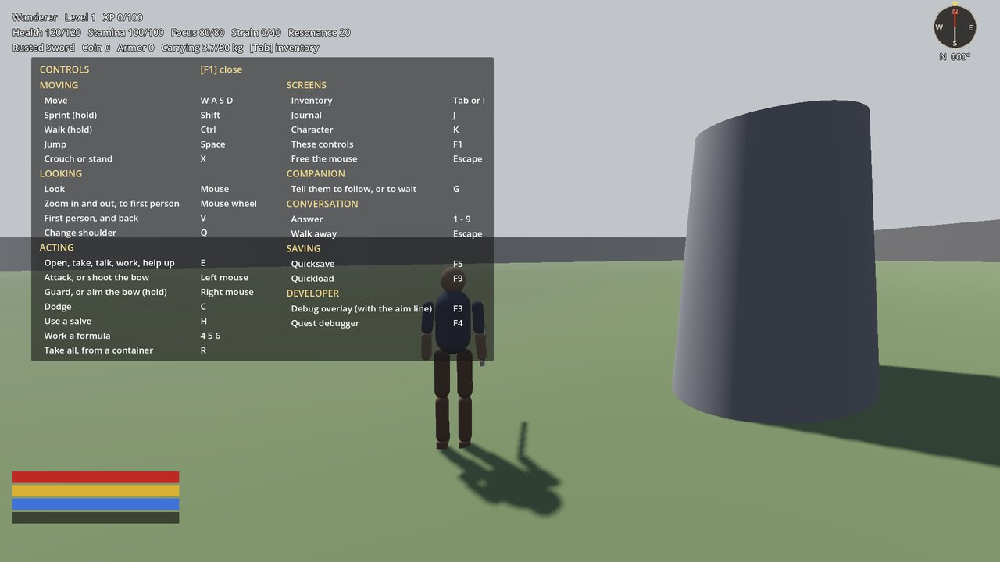 |
| 255 | **The waystation's chest opened: Take all [R] above its stacks** 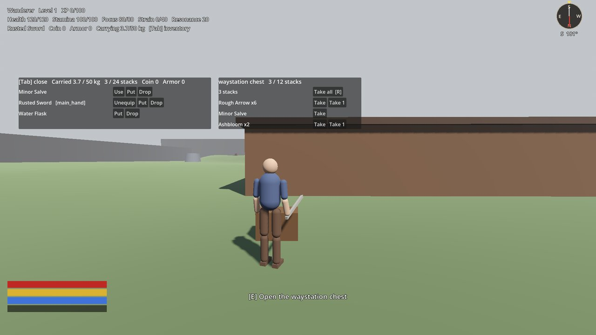 |
| 276 | **Take all: every stack into the pack** 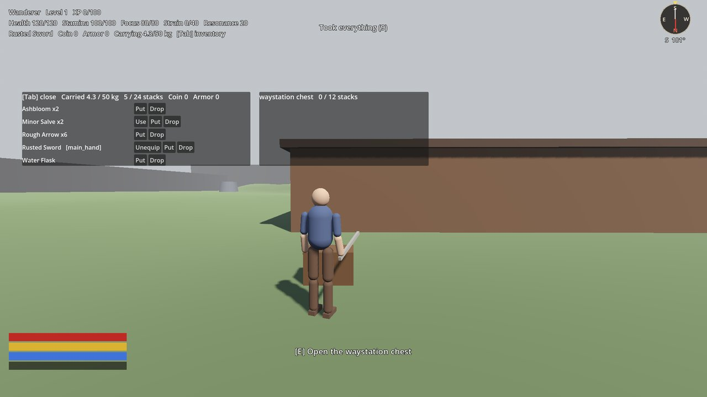 |
| 313 | **Walked out of reach: the panel closed by itself** 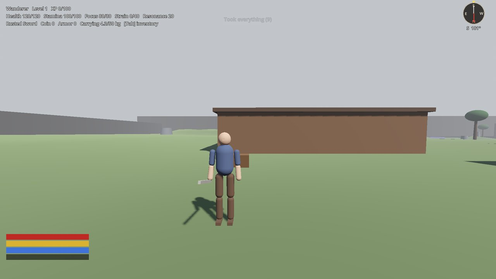 |
| 1265 | **A running jump over the fallen timber (0.8 m), caught over it** 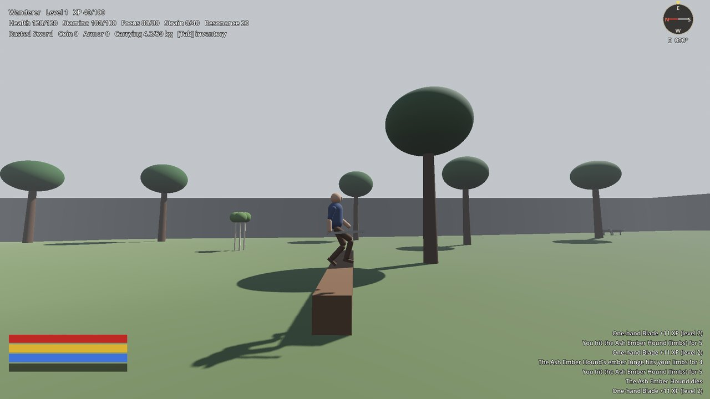 |
| 1607 | **Crouched under the Woundmoss beam (1.3 m clear)** 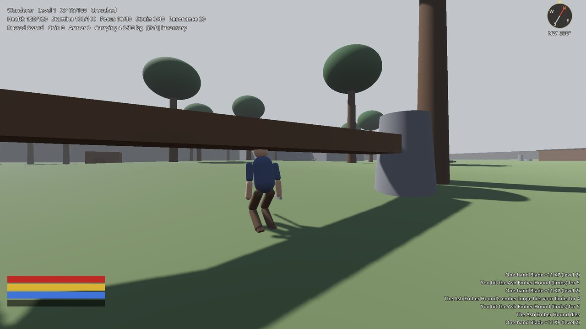 |
| 1619 | **Standing up under the beam is refused: "No room to stand"** 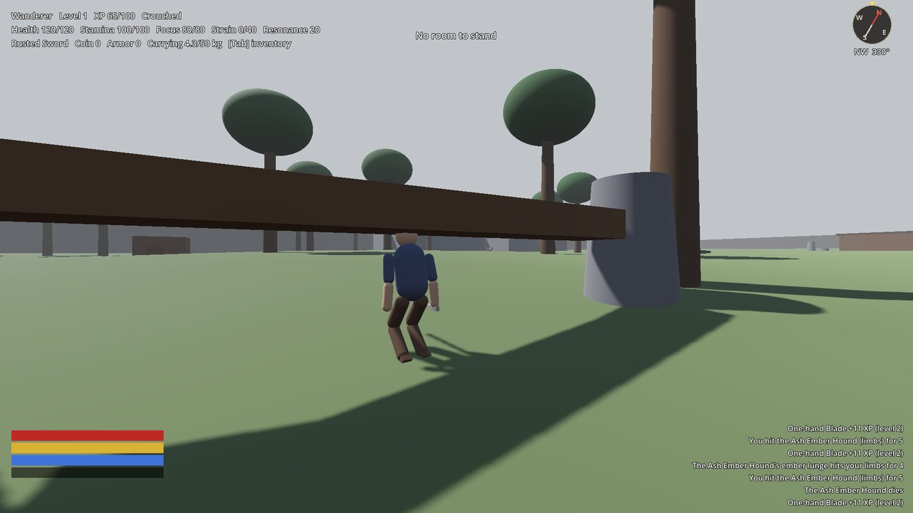 |
| 1844 | **Out the far side, stood, on to the cart: Take all gives the bow and its arrows; the bow in hand** 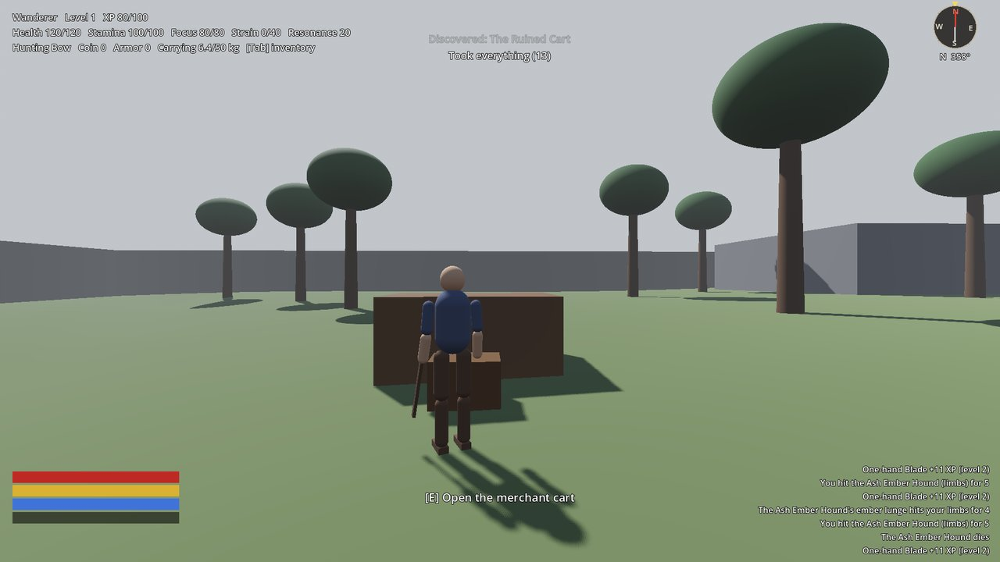 |
| 1876 | **The bow drawn at a tree 16 m off: the reticle sits where the arrow will go**  |
| 1879 | **The arrow in flight, its streak behind it, along the path the shot resolved** 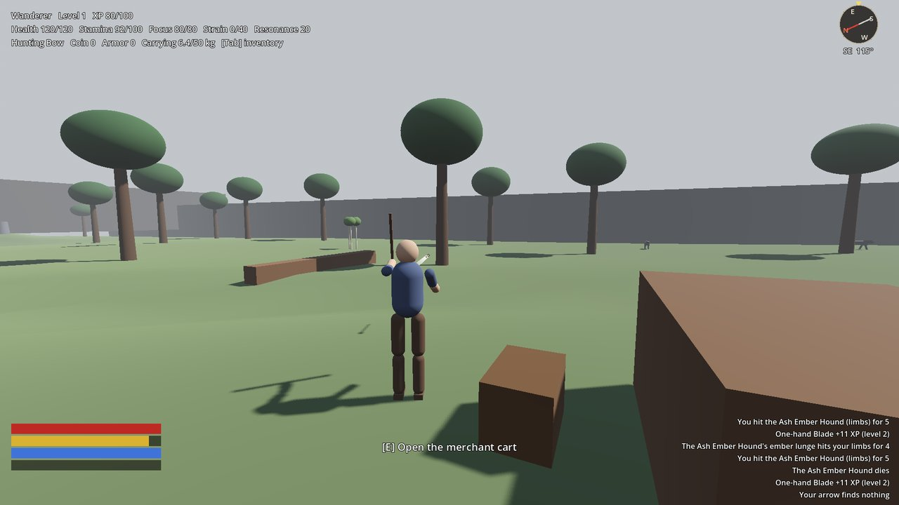 |
| 2004 | **The arrow stuck in the tree it hit, where it stays a while** 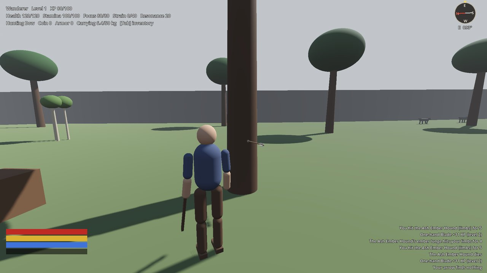 |
| 2693 | **Back to Sel: the primer given and read - three formulas known** 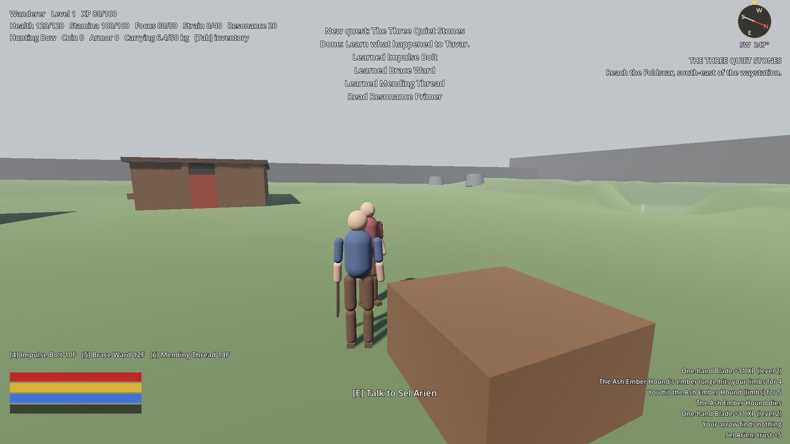 |
| 2804 | **Impulse Bolt's tell, at the lodge's east wall: the reticle on the wall** 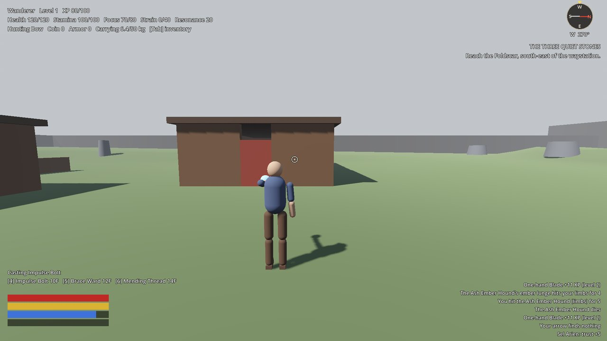 |
| 2808 | **Impulse Bolt in flight** 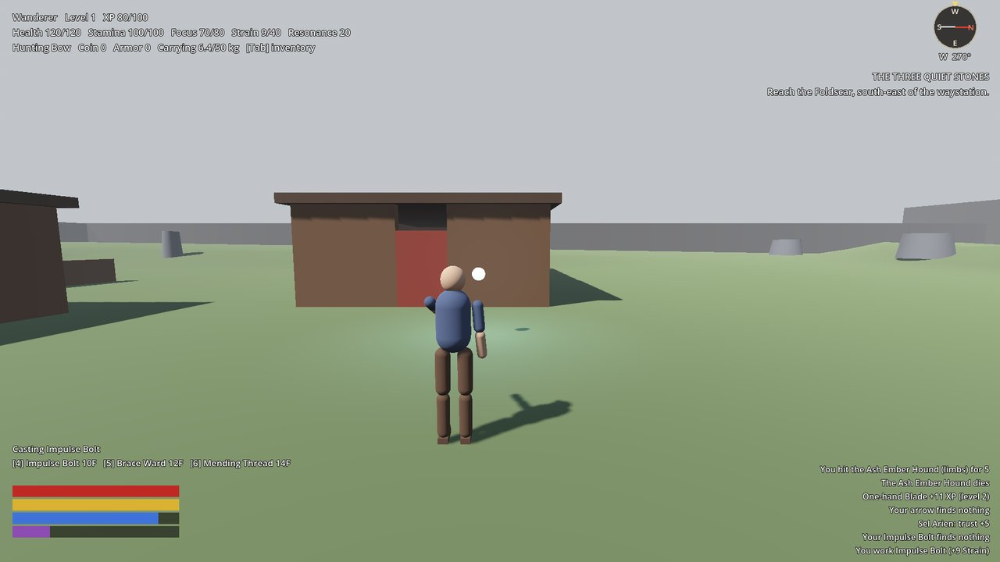 |
| 2813 | **Impulse Bolt bursting on the wall** 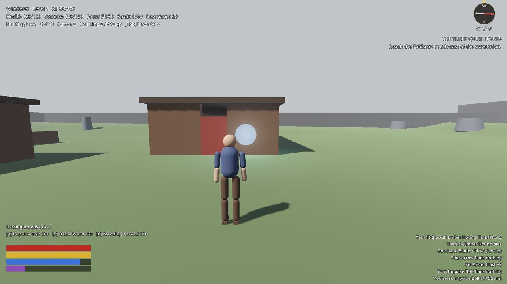 |
| 2834 | **K: the character sheet - only what the game has now** 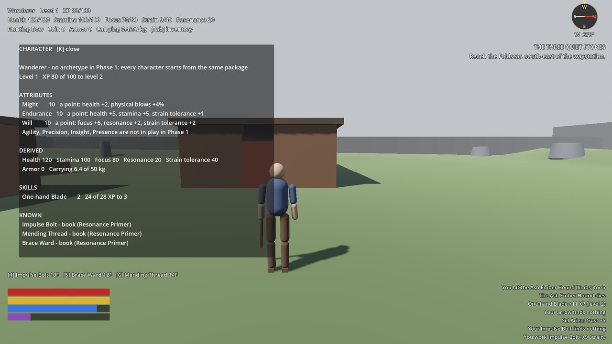 |
