# The acceptance playthrough (content bible §31)

Content 0.3.0 (sha256:d1197ab07e8b1c2f36f8ef7823266b72936ceed0dd9de8b8e6a19e8b3070acae), world seed 0x0A5E202609240001, 50 ms ticks, one a frame. Game time is world ticks as minutes and seconds.

| Game time | Tick | What happened |
|---|---|---|
| 0:00 | 0 | Start: (30.0, 158.0), level 1, carrying Minor Salve x1, Water Flask x1, Rusted Sword x1 |
| 0:00 | 0 | Discovered: Ashen Hollow Waystation |
| 0:01 | 30 | **Beside the Ashen Waystone, sword in hand (§29 0:00)** 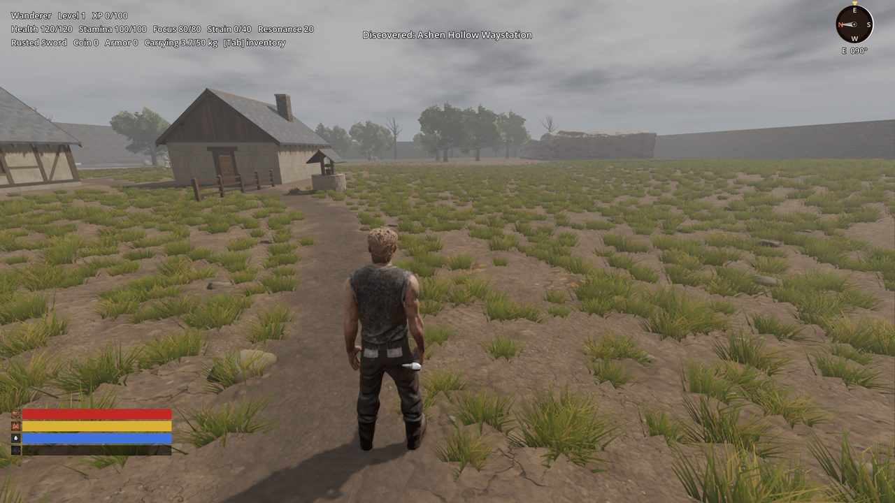 |
| 0:08 | 170 | Taken from container.waystation_chest: Rough Arrow x6 |
| 0:08 | 171 | Taken from container.waystation_chest: Minor Salve x1 |
| 0:08 | 171 | Taken from container.waystation_chest: Ashbloom x2 |
| 0:08 | 172 | **The waystation's storage chest opened and emptied (§29 0:30)** 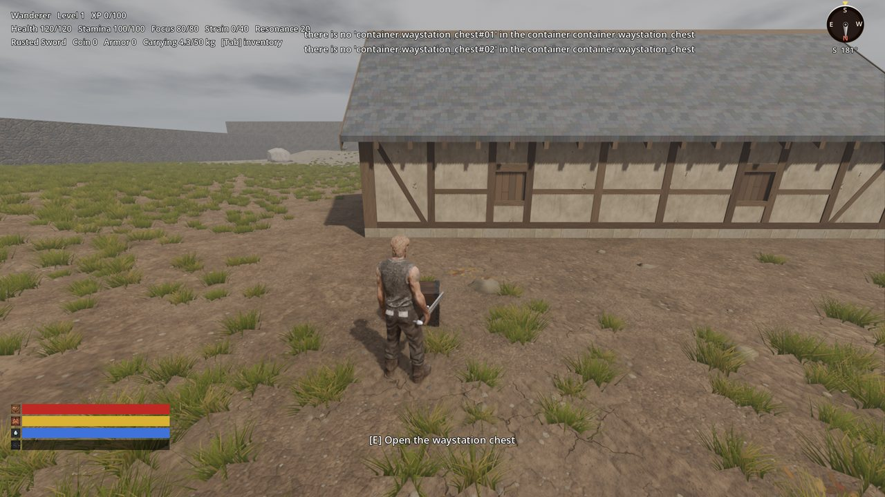 |
| 0:14 | 285 | **Into Kera's smithy** |
| 0:17 | 342 | Learned: Iron Billet |
| 0:17 | 342 | Learned: March Spear |
| 0:17 | 342 | Quest started: quest.ashen_hollow.iron_under_ash |
| 0:17 | 342 | Objective satisfied: o_speak of quest.ashen_hollow.iron_under_ash |
| 0:17 | 359 | **Kera teaches the forge: Iron Under Ash begins (§29 2:00)** 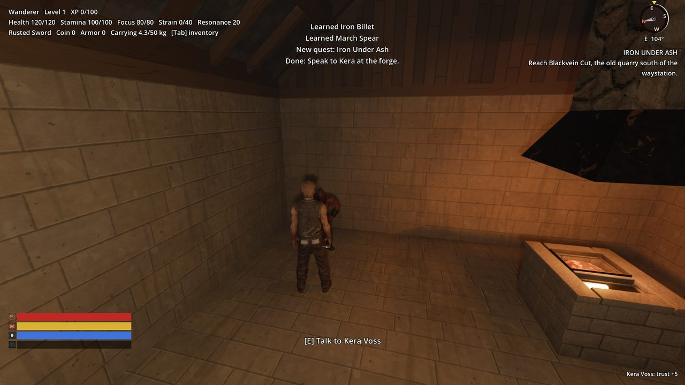 |
| 0:34 | 689 | **Out of the waystation by the east road (88, 145)** |
| 0:47 | 949 | Killed: Ash Ember Hound, by the character |
| 0:51 | 1028 | **Charwood: the hound's ground (128, 150) - fought if it hunts (§29 4:00)** 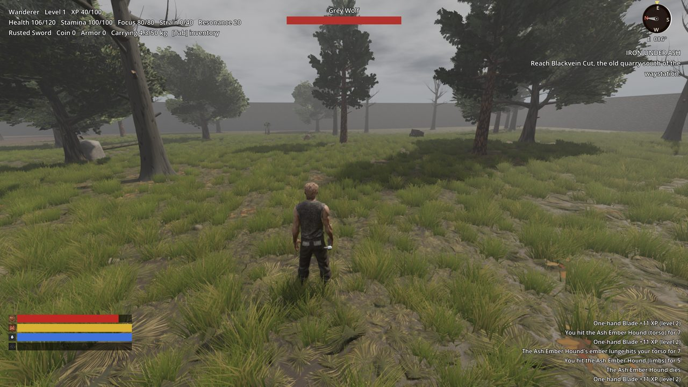 |
| 0:58 | 1171 | Discovered: The Ruined Cart |
| 1:01 | 1226 | Taken from container.merchant_cart: Rough Arrow x12 |
| 1:01 | 1227 | Taken from container.merchant_cart: Hunting Bow x1 |
| 1:01 | 1228 | **The ruined merchant cart: the hunting bow and arrows (§29 5:00)** 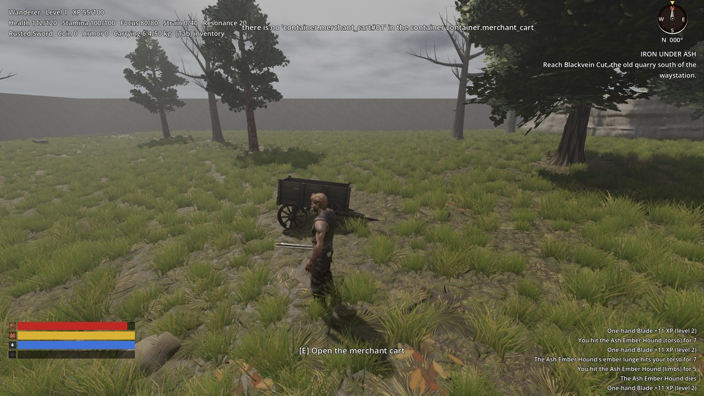 |
| 1:12 | 1443 | Gathered: Ash Haft x1 |
| 1:12 | 1444 | **An ash haft cut at the stand** 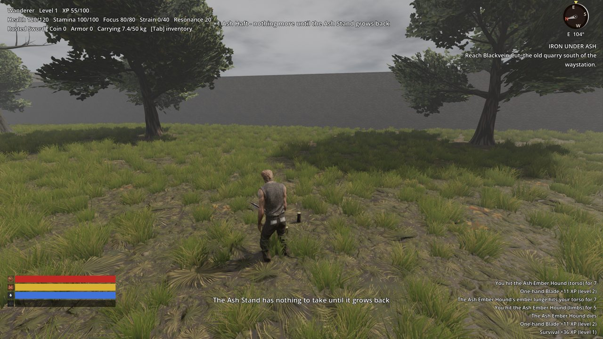 |
| 1:55 | 2301 | **Back south-west and down to Blackvein Cut's mouth (63, 98) (§29 6:00)** 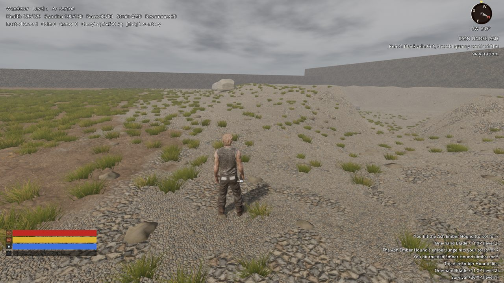 |
| 2:01 | 2421 | Discovered: Blackvein Cut |
| 2:01 | 2421 | Objective satisfied: o_shelf of quest.ashen_hollow.iron_under_ash |
| 2:16 | 2733 | Killed: Bone Walker Husk, by the character |
| 2:16 | 2733 | Level 2 |
| 2:22 | 2858 | Gathered: Raw Iron Ore x2 |
| 2:22 | 2858 | Objective satisfied: o_ore of quest.ashen_hollow.iron_under_ash |
| 2:22 | 2859 | **Past the Bone Walker's ground to the seam: raw iron ore (§29 7:00-8:00)** 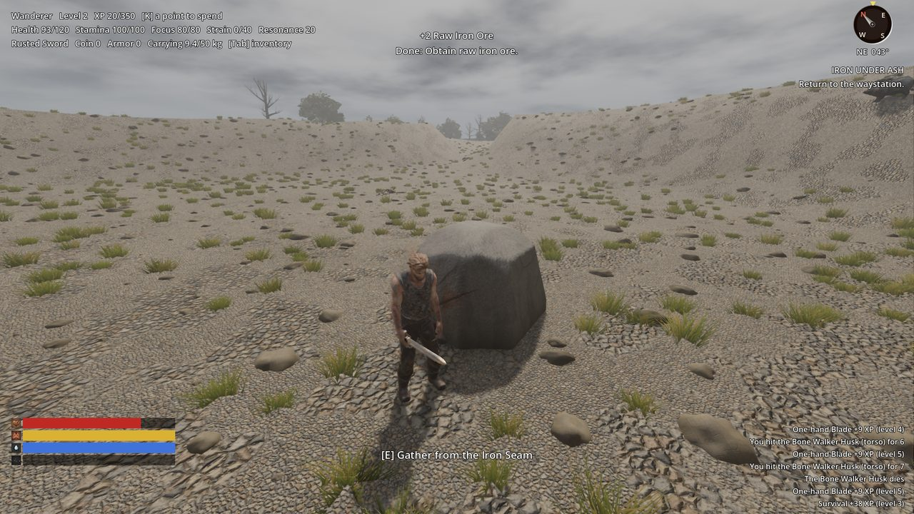 |
| 2:51 | 3427 | Objective satisfied: o_return of quest.ashen_hollow.iron_under_ash |
| 2:59 | 3587 | **Home north to the smithy (§29 9:00)** |
| 3:01 | 3637 | Made: Iron Billet (quality 0) |
| 3:01 | 3637 | Objective satisfied: o_billet of quest.ashen_hollow.iron_under_ash |
| 3:01 | 3638 | **A billet smelted at the hearth** 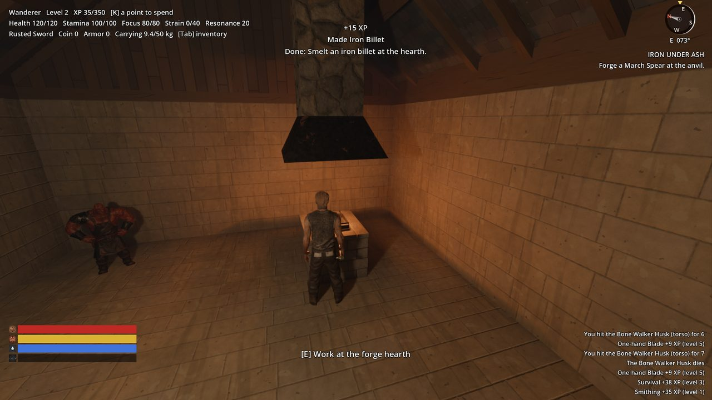 |
| 3:02 | 3659 | Made: March Spear (quality 0) |
| 3:02 | 3659 | Objective satisfied: o_spear of quest.ashen_hollow.iron_under_ash |
| 3:03 | 3661 | **The March Spear forged at the anvil, and taken in hand** 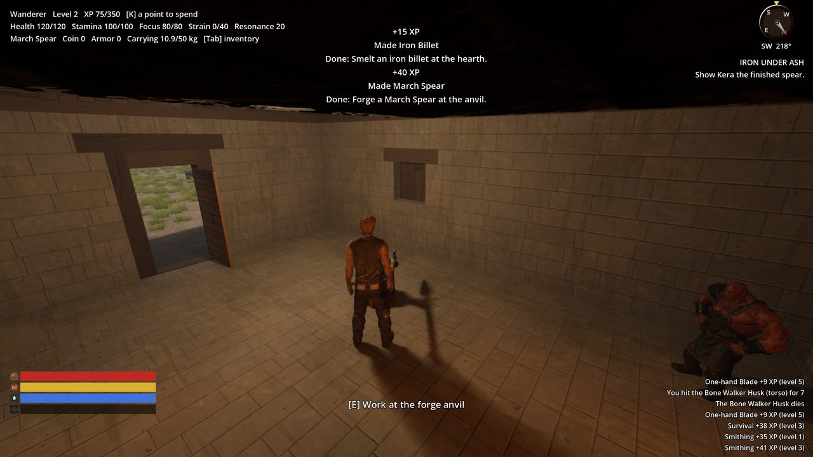 |
| 3:04 | 3685 | Objective satisfied: o_show of quest.ashen_hollow.iron_under_ash |
| 3:04 | 3685 | Quest completed: quest.ashen_hollow.iron_under_ash |
| 3:04 | 3685 | Reward: 120 XP |
| 3:04 | 3685 | Reward: 25 coin |
| 3:04 | 3685 | Reward: npc.ashen_hollow.kera_voss respect +5 |
| 3:04 | 3686 | **Kera shown the spear: Iron Under Ash complete** 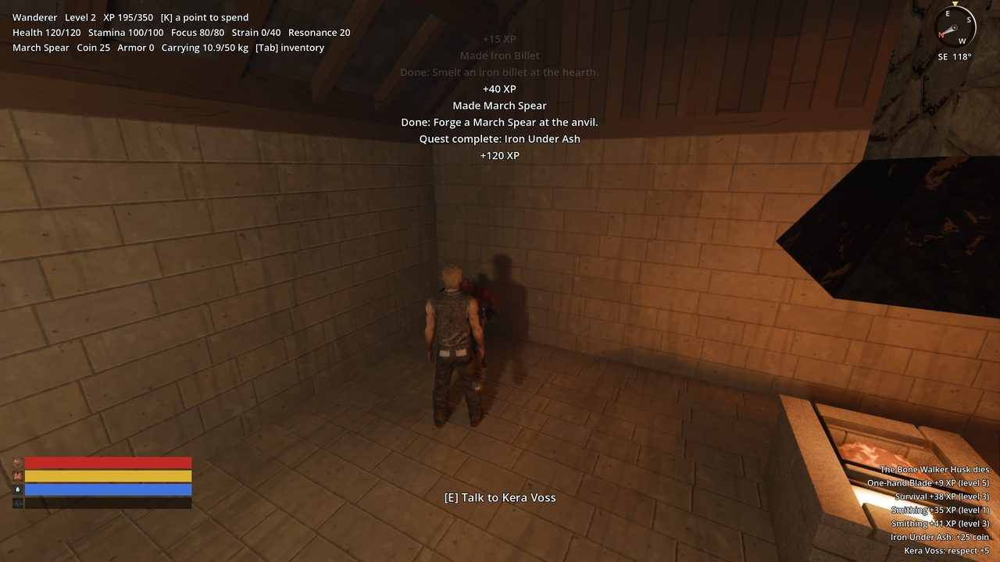 |
| 3:18 | 3964 | Quest started: quest.ashen_hollow.three_quiet_stones |
| 3:18 | 3964 | Objective satisfied: o_learn of quest.ashen_hollow.three_quiet_stones |
| 3:19 | 3989 | **Sel: the Resonance Primer, and Tavar's story - The Three Quiet Stones begins** 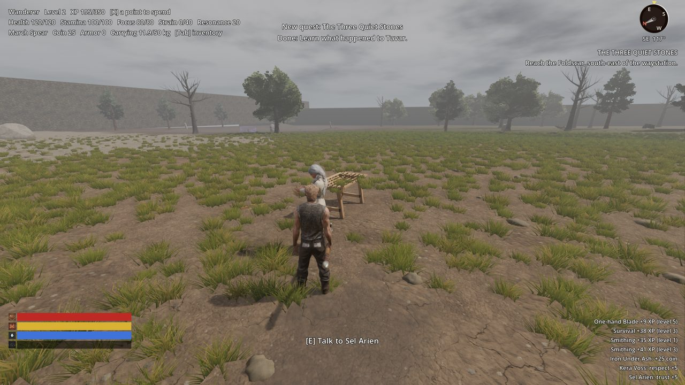 |
| 3:19 | 3996 | Learned: Impulse Bolt |
| 3:19 | 3996 | Learned: Brace Ward |
| 3:19 | 3996 | Learned: Mending Thread |
| 3:19 | 3997 | **The primer read: three formulas known** |
| 3:46 | 4525 | **The Foldscar path (105, 108) and in** |
| 3:49 | 4582 | Switch set: switch.stone_north |
| 3:49 | 4583 | **The north Quiet Stone turned into line** 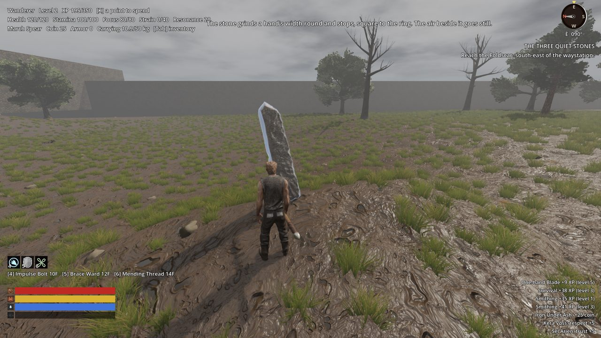 |
| 3:49 | 4592 | Discovered: The Foldscar |
| 3:49 | 4592 | Objective satisfied: o_reach of quest.ashen_hollow.three_quiet_stones |
| 3:49 | 4592 | Objective satisfied: o_north of quest.ashen_hollow.three_quiet_stones |
| 4:04 | 4886 | Switch set: switch.stone_southwest |
| 4:04 | 4886 | Objective satisfied: o_southwest of quest.ashen_hollow.three_quiet_stones |
| 4:04 | 4887 | **The south-west Quiet Stone turned into line** 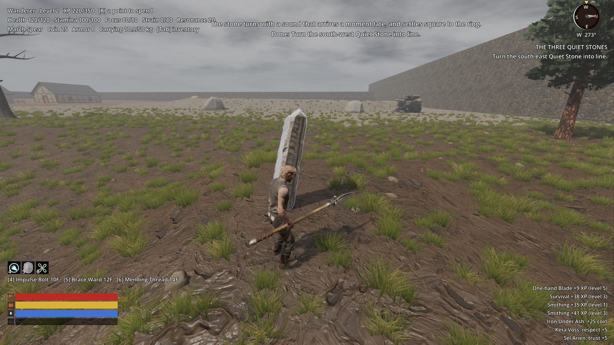 |
| 4:40 | 5618 | Switch set: switch.stone_southeast |
| 4:40 | 5618 | Objective satisfied: o_southeast of quest.ashen_hollow.three_quiet_stones |
| 4:40 | 5619 | **The south-east Quiet Stone turned, by the way round the spider (§8)** 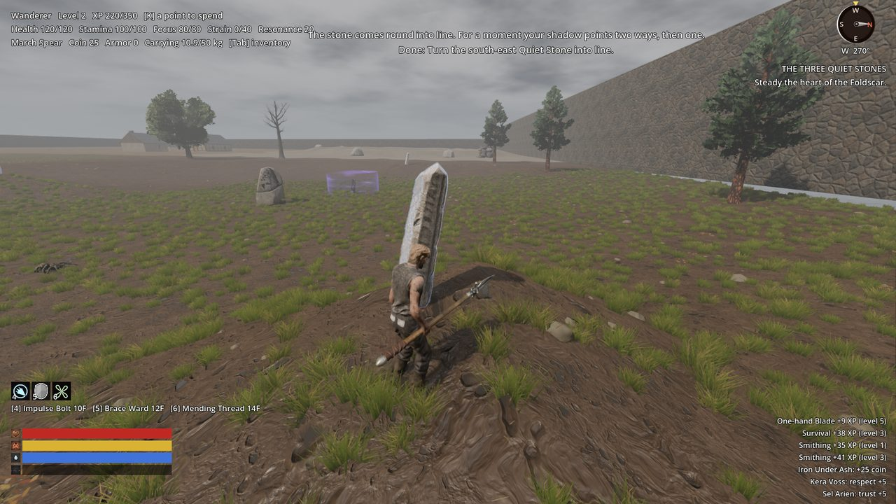 |
| 5:06 | 6138 | **At the heart: Tavar in the fold, out of reach** 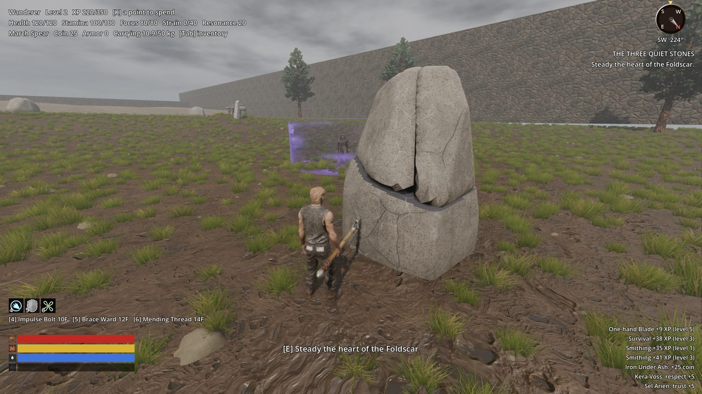 |
| 5:07 | 6145 | Switch set: switch.foldscar_heart |
| 5:07 | 6145 | Objective satisfied: o_steady of quest.ashen_hollow.three_quiet_stones |
| 5:07 | 6146 | **The heart steadied: the fold lifts** 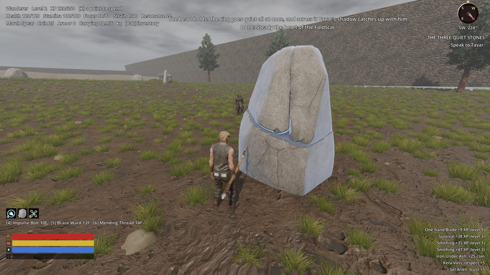 |
| 5:10 | 6219 | Objective satisfied: o_tavar of quest.ashen_hollow.three_quiet_stones |
| 5:10 | 6219 | Quest completed: quest.ashen_hollow.three_quiet_stones |
| 5:10 | 6219 | Level 3 |
| 5:10 | 6219 | Reward: 150 XP |
| 5:10 | 6219 | Reward: npc.ashen_hollow.sel_arien trust +10 |
| 5:11 | 6228 | Tavar Orr joins the character |
| 5:12 | 6244 | **Tavar freed - Quest 2 complete - and recruited** 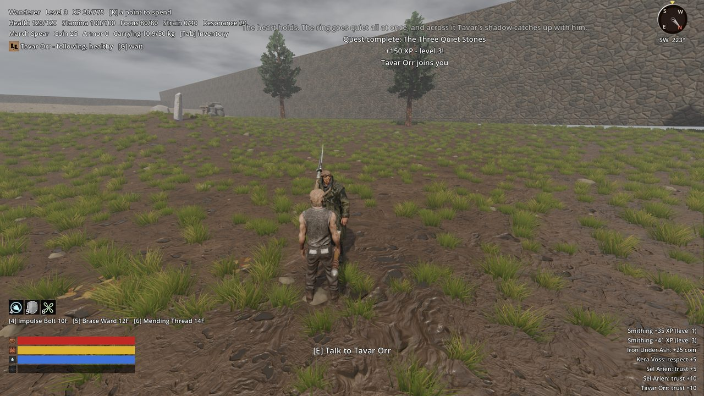 |
| 5:58 | 7160 | **Home with Tavar following** 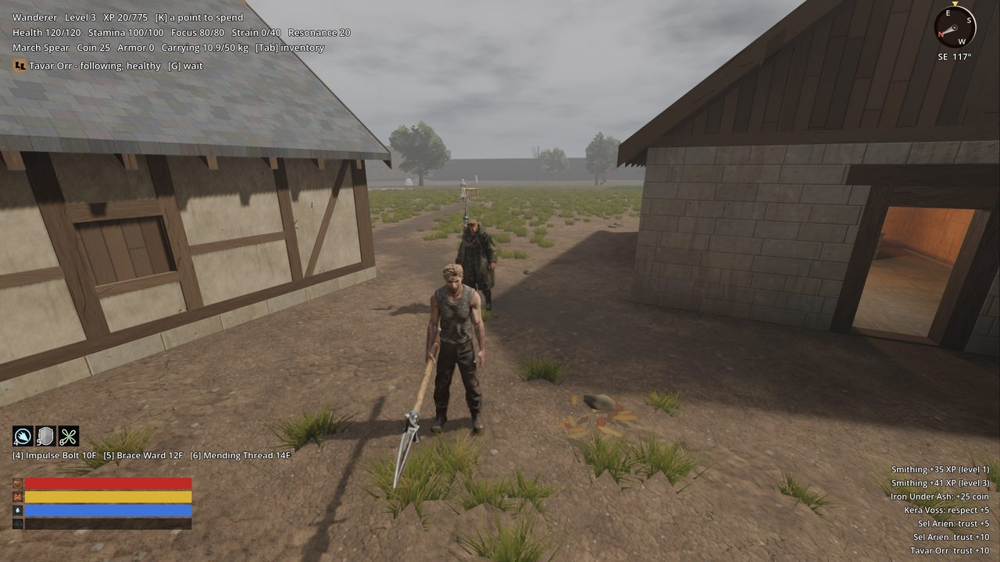 |
| 6:04 | 7296 | **Brace Wards worked at home until Strain passed tolerance and cost health (§33: Health and Strain not at rest)** 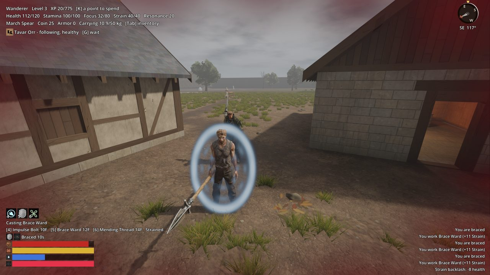 |
| 6:05 | 7303 | The persistence acceptance state (§33): level 3, XP 470; health 112/120, Strain 40, Focus 32/80; in hand March Spear; at (48.2, 136.9), 27.9 m from the spawn; quests Iron Under Ash completed, The Three Quiet Stones completed; companions Tavar Orr following at (50.5, 135.8); switches set 4 of 4; creature records 7, changed containers 2 |
| 6:05 | 7303 | State digest at the save: `sha256:cf9333d9e45660f89614da8b55814b01cac0aa6e1f3359fccbf37a1df45cb354` |
| 6:05 | 7303 | **Saved - then the application quits (§30)**  |
| 6:05 | 7310 | Finished: every beat happened. |
