# Phase B0 adoption report

Branch `claude/phase-b-visual-overhaul`, from main `a696931`. Every proof is a reversible switch
(`--visual key=value`); `--visual phase_a` draws the Phase-A look. No proof touches an M7 contract:
building dimensions, collision footprints, the placement lattice, doorways, navigation, movement authority, the save schema,
piece persistence, work anchors and terrain height semantics are all unchanged. No STOP condition was met.

Measurements are from the RTX 5090 at 1080p. The audit renders unpaced (vsync off) and reports the median GPU time over 60 frames
after 75 settling frames. Deltas are taken over the shots a proof shares with its control. The Phase-A 5090 baseline is
2.94 ms GPU median with 5.78 GB VRAM. RAZER (RTX 4070 Ti) runs about 2.3-2.7x slower, so the budget for a Phase-B frame at High is
about 6 ms on the 5090.

## Summary

| Proof | Candidate | Decision | GPU (5090) | VRAM |
|---|---|---|---|---|
| B0.1 | Terrain3D 1.0.2 (renderer only) | **ADOPT** | -0.23 ms | +436 MB (uncompressed; B1) |
| B0.2 | Poly Haven rock meshes on the ravine | **ADAPT** | +0.48 ms | +644 MB (uncompressed, duplicated per LOD; B1) |
| B0.3 | Sky3D 2.1 | **ADOPT** | +0.22 ms | +11 MB |
| B0.3 | SunshineClouds2 @ a73a80b0 | **ADAPT** (High/Ultra only) | +1.26 ms | +144 MB |
| B0.3 | HDRI sky background | **REJECT** | -0.09 ms | +32 MB |
| B0.4 | Built-in IK / look-at / spring bones | **ADOPT** | not measured separately | - |
| B0.4 | Retarget factory (offline bake) | **ADOPT** | - | - |
| B0.4 | RetargetModifier3D at runtime | **NOT NEEDED NOW** | - | - |
| B0.5 | Poly Haven plants through ScatterRules plus a global wind signal | **ADOPT** | +0.90 ms | +208 MB |
| B0.6 | The fold as restrained distortion | **ADOPT** | +0.18 ms | 0 |
| B0.6 | Alien artifact (zonked, CC0) wearing ambientCG Onyx015 | **ADOPT** (the approach) | +0.41 ms | +139 MB |
| B0.7 | Particle recipes (GPUParticles3D from data) | **ADOPT** | not measured separately | - |
| B0.7 | Unity Labs flipbooks (CC0) | **ADOPT** as textures | - | - |
| B0.7 | Godot VFX Library (MIT) | **ADAPT** (2D only; recipes ported) | - | - |
| Audio | 24-ID proof batch | **NOT YET ACCEPTED** (owner audition) | - | - |
| B0.8 | Boujie Water 1.0.1 | **REJECT** for rivers | 0.00 ms | 0 |
| B1 input | TAA without MSAA | candidate for the tiers | -0.50 ms | -167 MB |

## B0.1 Terrain3D (renderer only) - ADOPT

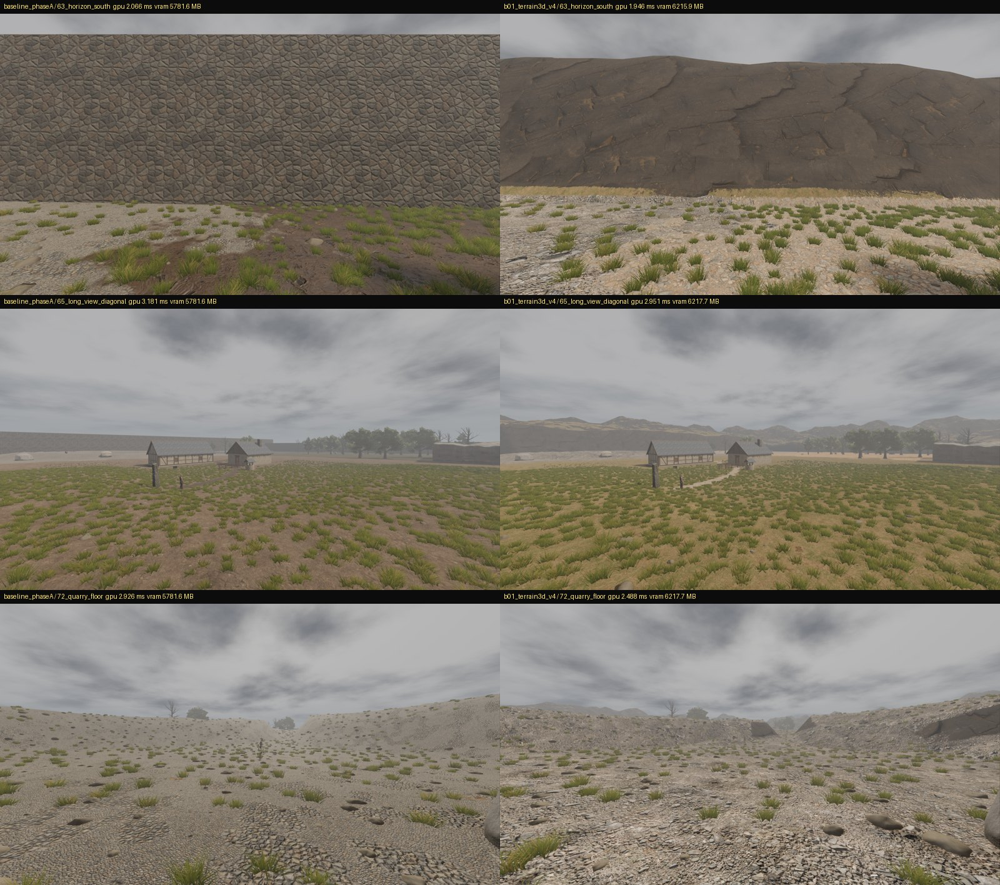

- **What:** Terrain3D 1.0.2 (MIT, Cory Petkovsek and Roope Palmroos). Only the Windows and Linux binaries are kept. The release zip's
  SHA-256 is `a071850250ec…4a2`, recorded in `addons/terrain_3d/OTHERREACH_NOTE.txt`.
- **How:** it is driven from C# through ClassDB (`Terrain3DView`).
  - The height map is imported from the domain `TerrainGrid`. Region-aligned import gives 0.0 mm error at every walkable 1 m point,
    checked on every run.
  - Collision is disabled. The body keeps colliding with the domain ground, and the camera keeps its own collider.
  - Five Poly Haven CC0 layers are packed by `tools/asset_pipeline/_pack_terrain_texture.py` with provenance. The autoshader handles
    slopes, and the ground slots and paths set the control map.
  - Outside the walkable edge, scenery landforms (ravine, far face, ridges, south cliff) come from one seeded height function.
- **Architecture impact:** none on authority. Terrain3D reads the domain heights and nothing reads Terrain3D back.
- **Eliminates:** our own clipmap/LOD terrain mesh, splat blending, slope texturing and the horizon geometry.
- **Remains:**
  - texture compression (B1);
  - landforms beyond the edge (B2);
  - macro variation tuning;
  - holes or overhangs, if ever needed (Terrain3D has none).

## B0.2 Quarry and cliff rock - ADAPT

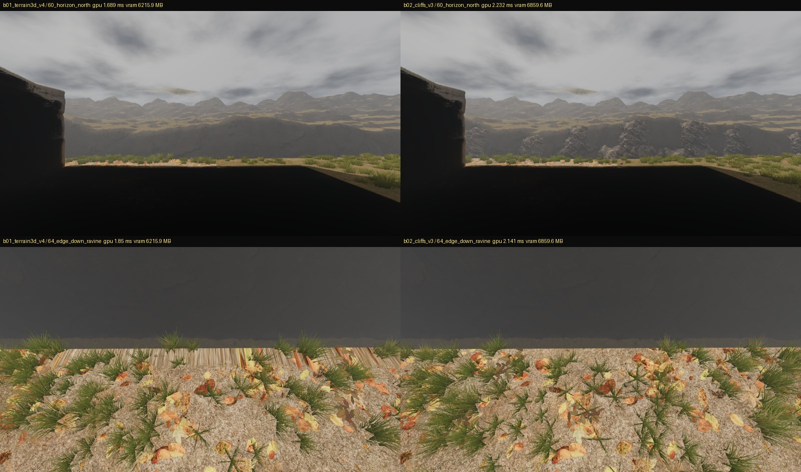

- **What:** Poly Haven CC0 meshes (mountainside, boulder_01, namaqualand_boulder_02, coast_rocks_01), prepared with LODs and provenance.
- **How:** `RavineDressing` places 65 pieces on the north ravine by a seeded rule on the scenery height function. Nothing is inside the
  walkable region.
- **Why ADAPT:**
  - The cliff scans are one-sided shells. They read well from the edge but need closed-back modules and edge hiding before they can
    stand in the open.
  - Every LOD GLB embeds its own uncompressed copy of the textures, costing +644 MB (B1: shared, compressed textures).
- **Eliminates:** hand-modelling rock.
- **Remains:**
  - a closed cliff and rock module set from the scans;
  - the quarry's own dressing (B2);
  - texture sharing.

## B0.3 Sky and clouds - Sky3D ADOPT, SunshineClouds2 ADAPT, HDRI REJECT

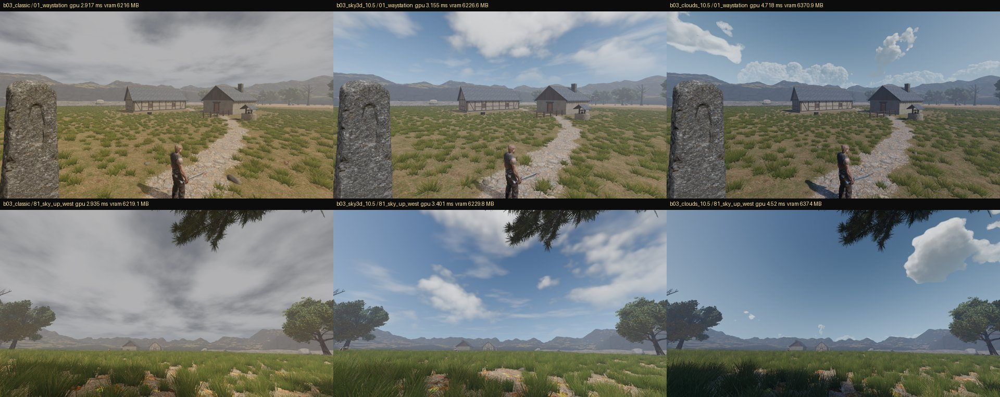
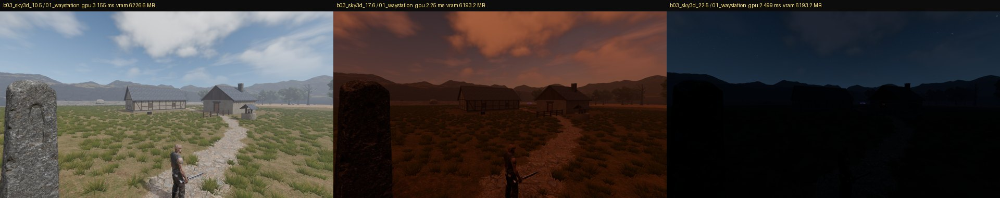
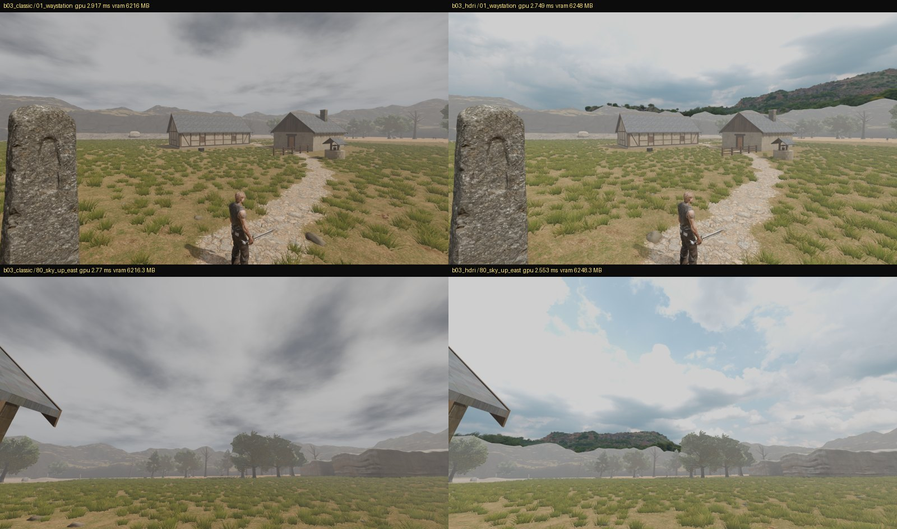

- **Sky3D 2.1** (MIT, Cory Petkovsek, J. Cuéllar and contributors): the sun, moon, stars and a dome that follow the time of day.
  - It has its own clock, which is off. The hour is presentation (`--visual hour=H`, 10:30 by default).
  - **No domain clock exists.** A real day/night cycle needs one: this is a coordination item for M7 or the owner, not something
    Phase B will invent.
  - Tuning needed: the sunset is over-saturated, the night needs a readable moonlight level, and an overcast state is needed (B5).
- **SunshineClouds2** (MIT, David House, pinned at `a73a80b08fb37b255f8f10d49debd71e5541bd70` because it has no tagged release;
  LICENSE fetched raw at that commit): ray-marched clouds as a compositor effect.
  - It costs +1.26 ms median (+1.56 worst) on the 5090, about +3-4 ms on RAZER, so it goes to High/Ultra only.
  - Its coverage needs tuning against our weather.
- **HDRI background:** rejected. The photographed ground in the panorama floats above our horizon. Poly Haven HDRIs remain useful as
  lighting references.
- **Eliminates:** our sky shader, sun/moon positioning and a cloud renderer.
- **Remains:**
  - the weather states and their transitions (B5);
  - a cheap cloud layer for Low/Medium;
  - the domain clock (coordination).

## B0.4 Character motion - ADOPT the built-in modifiers and the retarget factory

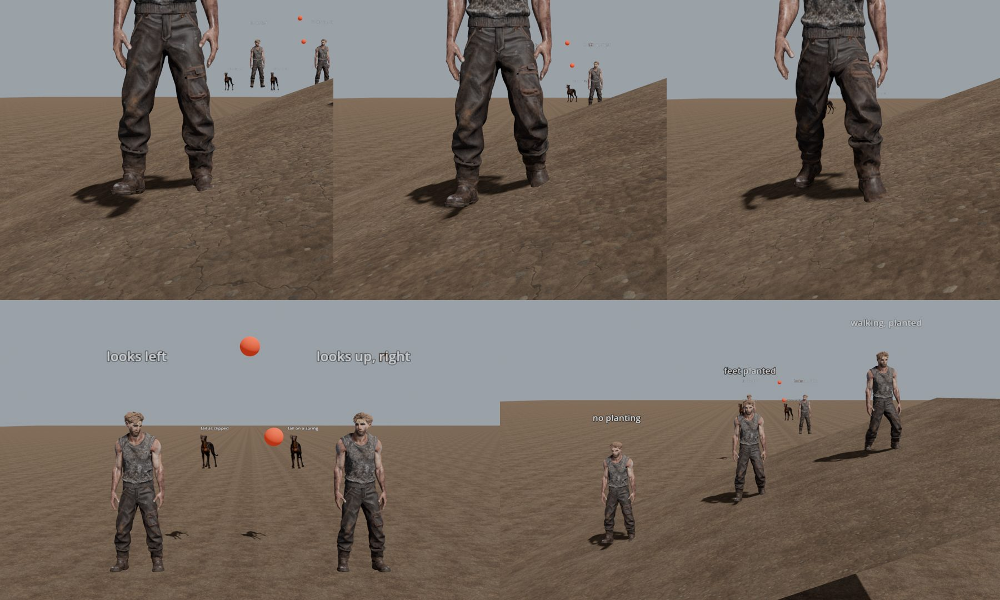

Measured inside `Skeleton3D.skeleton_updated`, the only point where a modifier's result exists (Godot discards it after skinning):

| Test | Without | With |
|---|---|---|
| Idle across a 20-degree slope, ankle height over the ground under each foot | 0.030 m / **0.160 m** (one foot in the air) | 0.097 m / 0.095 m (the flat stance), hips lowered 0.065 m |
| Walking across the slope | - | 0.097 m planted, 0.152 m in swing |
| Head to a marker 50 degrees off the body's facing (`LookAtModifier3D`) | 50.3 degrees off | **0.0 degrees** |
| Head to a marker up and to the other side | 45.2 degrees off | **0.0 degrees** |
| Hound tail swung side to side (`SpringBoneSimulator3D`) | 52.9 degrees (2 to 55) | 49.4 degrees (11 to 60): the range lags and shifts |

- **`BodyModifiers`** (presentation only) sets up the engine's `TwoBoneIK3D` for both legs. It is fed by `FootPlanting`, which finds the
  ground under each animated foot and lowers the hips for the lower foot. It also sets up `LookAtModifier3D` (the face's axis is found
  from the rest pose) and `SpringBoneSimulator3D`. The animation sheet photographs and measures all of them.
- **Hand/weapon IK:** not built in B0. The rig has no hand sockets, and the bow draw shows why hand IK is needed (see below). It is B12.
- **Spring bone on Tavar's coat:** impossible on the current rigs, because no rig has coat or cloth bones. The quadrupeds' single
  `tail` bone proved the simulator runs. Its effect on a one-bone tail is modest; a real chain needs more bones (B12).

**Retarget factory** (`tools/asset_pipeline/_retarget_clip.py`, bone maps in `tools/asset_pipeline/retarget_maps/`):

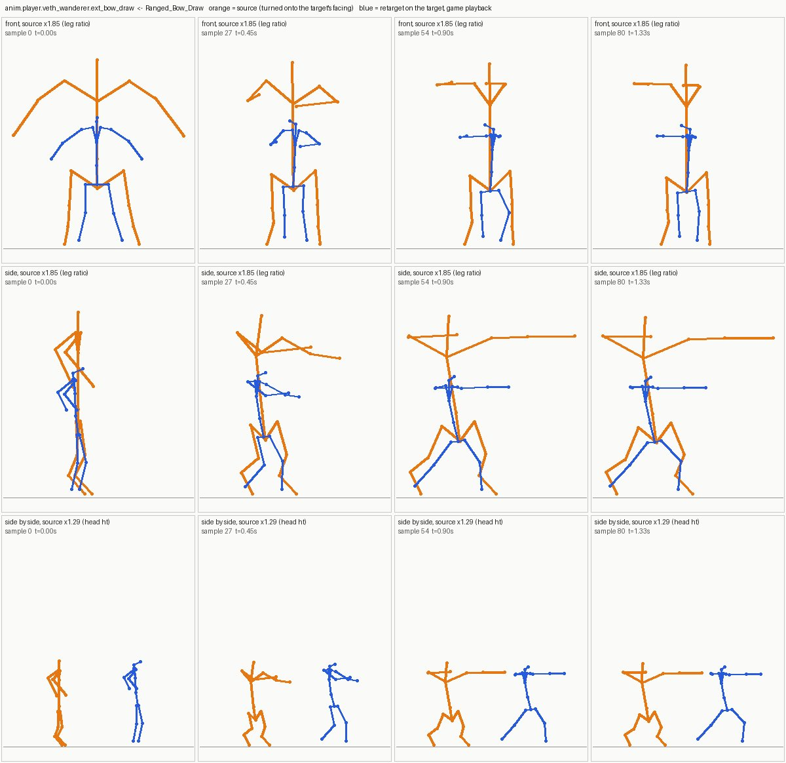
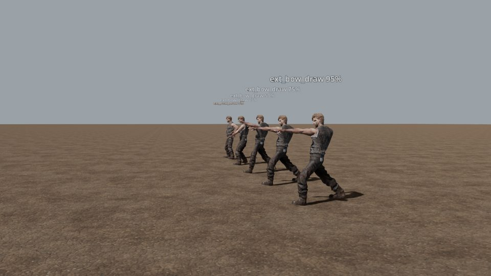
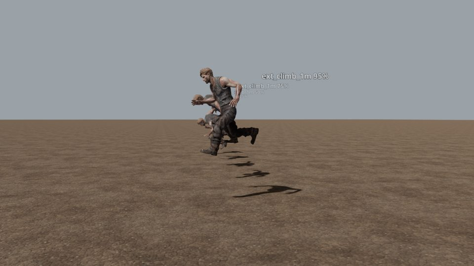

- It is an offline Blender bake of a pack clip onto our 20-bone rig by world orientation, one command per clip (about 2.5 s).
- It verifies the archive's SHA-256 and records pack, author, license, clip, file and map hashes. It reads the export back and fails
  on a mismatch (actual error 0.0003 degrees). Three builds were byte-identical.
- **KayKit Ranged_Bow_Draw** (CC0, Kay Lousberg; KayKit Character Animations 1.1):
  - foot slide 1.4-1.6 cm, the same as the source;
  - no root motion;
  - elbows and knees bend correctly;
  - skin stretch at most 0.090 m (our own clips reach 0.120 m);
  - **the draw is 18% short** (hand to hand 0.715 m against 0.877 m): our shoulders are narrower relative to the arms. It needs a
    hand anchor at the face (hand IK, B12).
- **UAL ClimbUp_1m** (CC0, Quaternius; Universal Animation Library 2):
  - root motion kept, rising 0.84 m on our body;
  - the ledge foot drifts 0.19 cm;
  - the hands land 4.7 cm low and 14.6 cm forward.
- **Effort per extra clip:** one command. A new source skeleton needs one JSON map of about 40 lines.
- **RetargetModifier3D:** not needed while clips are baked onto our rig; the game already retargets by bone name. Reconsider it at
  the 52-bone migration.
- **The 52-bone contract:** yes, in stages.
  1. Keep baking body clips onto the 20-bone rig, with a small set of hand poses per grip.
  2. Rebind the bodies to the 52-bone skeleton (its fingers map almost one to one from UAL) and add one map per pack.
  - Each race keeps its own skeleton. Bones humans lack are set to follow their parent or derived, never forced.
- **Eliminates:** hand-authoring RPG motion (the depot's packs become a clip source) and our own IK solvers.
- **Remains:**
  - fingers and hand poses;
  - hand IK for weapons and the bow draw;
  - coat/cloth bones;
  - foot planting wired into the game's bodies behind a tier (B12);
  - the Phase-A crouch depth and jump (on record: `otherreach-traversal-base`), which are gameplay-adjacent and stay untouched here.

## B0.5 Vegetation - ADOPT

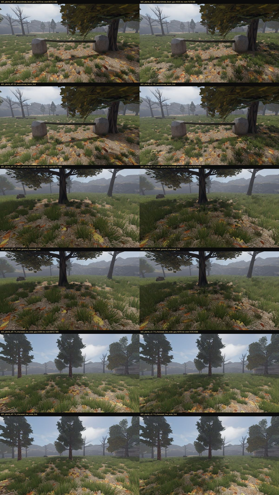

- **What:** Poly Haven CC0 grass_medium_01, nettle_plant and fern_02. Each is prepared to four levels ending in an impostor card, with
  the wind data in its vertex colours (red is the height fraction, green the phase).
- **How:**
  - A scatter kind can name a model (`"mesh": "model:<id>"`), placed by the same ScatterRules densities, patches, bare yards, tree
    and path rules and chunk seeds.
  - Each level is its own MultiMesh drawn over its distance band (`lods_m`), with the tint in the instance custom data.
  - One global wind signal (`wind`, `wind_gust`, `wind_time`, as global shader parameters, in `WindField`) drives a foliage shader.
    The bend scales with the plant's height, has a travelling gust and a per-kind stiffness.
  - A first/last-frame diff shows only these plants moving.
- **Cost:** 31,211 tufts, 2,426 nettles and 1,575 ferns placed in 670 ms.
  - GPU +0.90 ms median (+1.48 worst, on the Charwood floor), VRAM +208 MB, +165 draw calls.
  - Projected on RAZER: about +2-3.5 ms, so densities and level distances go into the B1 tiers.
- **Eliminates:** hand-built grass cards and a per-asset wind setup. Trees, cloth and smoke will read the same signal.
- **Remains:**
  - the ground-cover strategy (replace or layer over the card grass) and the Phase-A leaf litter, which reads cartoonish (B3);
  - trees on the same wind (B4).

## B0.6 Science-fantasy (the Foldscar)

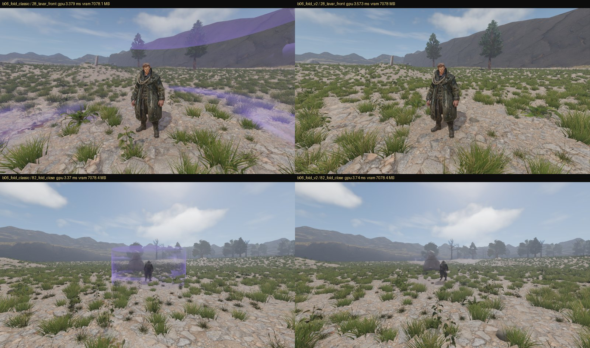

- **The fold** (`--visual foldscar=proof`) - ADOPT.
  - The Phase-A violet cylinder read as a debug volume (a box, at a distance).
  - The fold is now the bible's restrained weirdness: the world behind is slightly warped and doubled a hair to one side. It is
    strongest where it faces the eye and thins to nothing at its silhouette, with a ragged top and a foot that fades into the ground.
  - Its footprint (a 3 m circle, 2.6 m tall) is unchanged. Cost: +0.18 ms.
  - **Found on the way, a Phase-A defect:** anything drawn after the screen copy (fading instances: the scatter's far chunks, the
    grass) is missing from the copy. Every screen-reading shader, including the Phase-A fold and future water, drew those pixels black.
    The fold now draws only over what the copy holds.
  - Readability is a risk: the fold is subtle in a still. It is meant to be seen moving, and the owner's review decides the level.
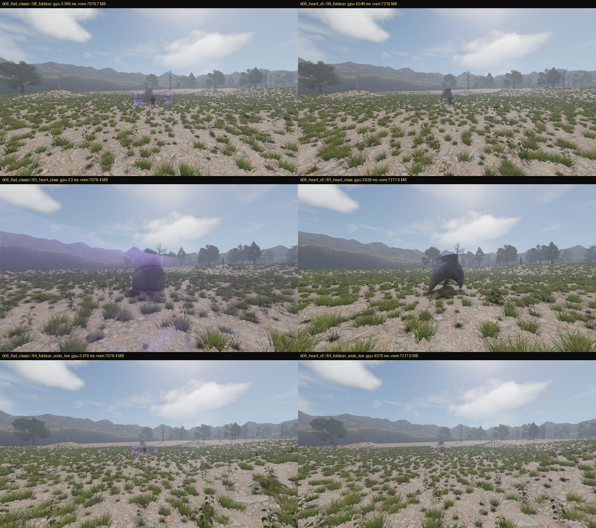

- **The heart as a staged alien artifact** - ADOPT the approach.
  - Sculpture 1 from "Alien Artifacts Sculptures" (CC0, zonked, OpenGameArt) is a carved horned arch standing on its horn tips. The
    1.15 M-triangle sculpt was decimated to four levels (30,000 to 1,200 triangles), with normal and occlusion baked from it.
  - It wears ambientCG Onyx015 (CC0), laid triplanar in the world and tinted dark over its own carving. A new "model wears a surface"
    binding does this: `surface`, `surface_tint`, and optionally `glow`.
  - It is drawn under `--visual foldscar=proof` through a new `structures_by_visual_option` bindings overlay.
  - It is fitted to the heart's own footprint by the existing fitting rule (3.0 m tall in a 3.5 m, 3 m-wide circle), so collision is
    unchanged. Its horn tips reach 0.36 m past the circle on one axis, so a body pressed against those two points overlaps them slightly.
  - Cost: +0.41 ms and +139 MB (uncompressed textures; the B1 cache takes most of this).
  - It reads as made, old and not for anything obvious: the language the brief asks for.
  - The Phase-B art path now has the pieces: kitbash geometry, an ambientCG surface, and a restrained cold light.
- **Tried and left out:** a light in the carving's grooves. The baked occlusion's deepest values are pits at the groove ends, so the
  mask lit scattered specks instead of lines. A proper groove light needs a baked cavity/curvature map from the sculpt (a pipeline bake).
- **Staged kits** (Modular Sci-Fi MegaKit, Space Kit, Sci-Fi Essentials, Kenney kits): kept as reference and kitbash sources only.
  Their stylised panels are exactly the "panel spam" the brief warns against. Nothing from them ships as-is.
- **Remains (B9):**
  - the Foldscar's ground language (folded or scorched ground, strewn fragments, a light that is wrong);
  - Tavar's delayed shadow;
  - the cavity bake;
  - industrial old-tech elements at the quarry (Rust009 and MetalPlates006 are prepared).

## B0.7 VFX - ADOPT the recipe path

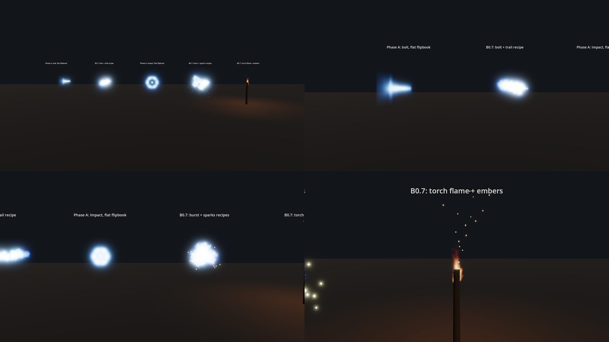

- **The path:**
  - Effects are data (`Art/vfx_recipes.json`), built by one factory (`ParticleRecipes`) into GPUParticles3D.
  - A recipe gives a burst or a stream; flipbook playback at the atlas's rate; direction and spread; gravity and damping; a size curve,
    a colour ramp and an angle range; additive or mixed blending.
  - Magic, sparks, smoke, embers, dust and environmental particles are all recipes. There is no per-effect code.
- **Unity Labs flipbooks** (CC0): FireBall01 through a cold ramp for Force (the manifest's "cold displaced air, never a flame colour"),
  and Flame02 for torches. ADOPT as texture sources.
- **Godot VFX Library** (MIT): ADAPT. It is entirely 2D (CPUParticles2D, canvas shaders), so nothing drops into our 3D world. Its
  recipes port by hand: `impact_sparks` is its sparks effect (30 particles, 0.5 s, all directions, gravity, the same colour ramp), and
  `embers` is its fireball trail, lengthened. Its spark texture is staged with its MIT notice.
- **Judged in motion** (Gemini 3.8 Flash, on a recording of the VFX sheet, `--vfx-sheet`), most to least convincing:
  1. torch plus embers;
  2. the recipe bolt;
  3. the recipe impact;
  4. the Phase-A bolt ("stepped 2D flipbook, no depth");
  5. the Phase-A impact ("a flat ring that pops out of existence").

  **The Phase-A defect the owner reported** (spells cut off in a square) is visible in the stills: the flat bolt quad shows its square
  edge. The recipe path has no such edge.
- **Fixed during the proof:** flames spun to random angles (a cross-shaped fire), so recipes now carry an angle range.
- **Remains (B11):**
  - wire recipes to the projectiles, impacts, forge, hearths and torches;
  - soften the recipe impact's discs;
  - fade the sparks out rather than letting them end;
  - dust and smoke recipes (Unity Labs WispySmoke01, Cloud01, DiscSmoke01, CandleSmoke01 are staged).

## Audio addition - the proof batch, auditioned in game

- **Sourcing** (`F:\Otherreach_External_Audio`): 72 packs, 91.4 GB, all hashes verified. For the 230 IDs:
  - 89 SOURCE REPLACEMENT AVAILABLE;
  - 107 SOURCE + SOUND DESIGN;
  - 31 KEEP PLACEHOLDER;
  - 3 CUSTOM RECORDING / GENERATION NEEDED.

  See `EXTERNAL_AUDIO_CATALOG.md` and `AUDIO_V3_REPLACEMENT_MATRIX.md` (its 12-point report).
- **The proof batch:** 24 IDs, format- and loudness-matched to their V3 placeholders, in `assets/audio_proof/`.
- **In the game:**
  - `--visual audio=proof` plays each proof where V3 has the ID.
  - `--audio-audition` plays every proof against its V3 sound through the game's own players, in a seeded random order, under a
    "pair N: A/B" caption. The answer key goes to a separate file.
  - Recordings (movie maker, 1080p, 48 kHz):
    - the scripted playthrough with V3 and with the proofs;
    - the 24-pair audition;
    - the 10-pair AI-clear audition.
- **What may go to an AI reviewer:**
  - Sonniss's GDC bundle licence prohibits AI use outright (8 proofs).
  - Mixkit and some other sources have no AI clause and are treated the same way (6 more).
  - Only the 10 proofs whose every source states no restriction were uploaded, via `--visual audio=proof_open` and
    `--audition-open-only`.
- **Blind result (Gemini 3.8 Flash, 10 AI-clear pairs):** it preferred V3 in 6 of 10.
  - V3 won: the three footsteps, the Charwood bed, the moderate Strain layer and the UI equip click.
  - The proof won: the armour's walk, the ward activation, the Foldscar tone and the door.
- **The reviewer is not a usable audition instrument for this:**
  - It misidentified 4 of the pairs (the ward, the Foldscar tone and the door as footsteps, cloth and a satchel).
  - In the playthrough comparison its scores moved on sounds that had not changed: creatures 4 to 7.5, combat 6 to 5.5, with no
    creature or combat proof in that run.
- **Decision:** nothing is replaced. The V3 library and manifest are untouched, as the brief requires until the proofs are
  **auditioned and accepted in game by the owner**. The recordings are in `G:\UNNAMED_HISTORY\phaseB\audio_audition\`; the owner
  should listen to `ab\audition.mp4` (all 24 pairs) before opening `ab\audition_key.json`.

## B0.8 Water - Boujie REJECT for rivers

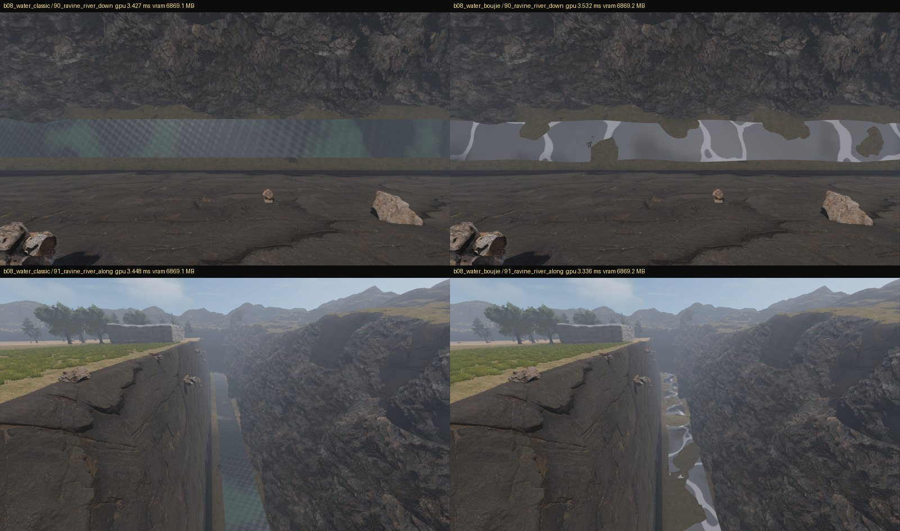

- **Boujie Water 1.0.1** (MIT, Zach Bernal): an open-water shader (Gerstner waves, shore foam, refraction). It has no flow maps, its
  foam reads as blobs in a narrow river, and it is ocean-tuned. It was removed from the project.
- **Found:** no water is visible in Ashen Hollow. The stream plane sits at 0.12 m, below the lowest terrain (1.66 m). The ravine floor
  is about 6 m wide and hidden from the playable edge.
- **Remains (B6):** our own flow water (flow map, depth, foam at obstacles) plus puddles, wetness and mist. Where water stands is a
  terrain/content question; Phase B will not move terrain heights.

## Coordination items (not Phase B's to decide)

1. **A domain clock** for day and night. Sky3D is ready to follow one.
2. **Visible water** needs terrain that dips below a water level, or content that places water. The height semantics are M7's.
3. **Hand sockets and a 52-bone rig** for the player and NPCs that use their hands. This is the rig contract (B12 proposes the stages).
