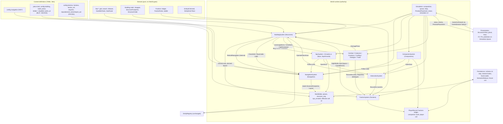

# M7 Part D - Cross-system architecture: reconciliation, unified contracts, dependencies, couplings, reuse

Status: the cross-system architect's document for the M7 design team, 2026-09-24. Design and implementation planning only; not an owner ruling. It reads Part A (`drafts/A_navigation.md`), Part B (`drafts/B_building.md`) and Part C (`drafts/C_factions.md`) against each other and against origin/main `e10d2c4` (read-only snapshot `main_e10d2c4`). Every `path:line` is repo-relative and was re-read in the snapshot for this document. It raises no challenge to a scope ruling (`drafts/00_SCOPE_RULINGS.md`).

**Precedence for the implementing agent:** where this document and a part disagree, this document wins; everywhere else the part governs. Each decision that changes a part is repeated in that part's list in section 6.3, so the parts can be amended mechanically.

Layout: §1 register and decision details; §2 contracts; §3 dependency graph and build order; §4 couplings and guards; §5 reuse; §6 owner questions, residual issues, per-part change lists.

---

## 1. Reconciliation register

| # | Issue | A says | B says | C says | DECISION | Evidence (snapshot) |
|---|---|---|---|---|---|---|
| D1 | Where the moving NPC's state lives, and who owns it | Mover block (body, phase, goal, stuck, `NavRoute`) in the **player section** beside companions; the owner's tick sits "between `_companions.Tick` and `_npcs.Tick`"; the body is re-placed with `PlaceNpc` (A §8.4, §13.6 N1, N3) | `NpcErrandRecord` in `WorldDelta`, `StateSlice.NpcErrands` owned by **`NpcSystem`**, persisted as `npc_errands` in `entities.msgpack`, anchored to the NPC's home cell like a creature record (B §9.2, §15.1) | Witnesses read `State.Npcs[..].Body` at the act (C §20) | **B's home and owner, A's mover algorithm.** `NpcSystem` claims `Npcs` and `NpcErrands`. It runs A §8.4 inside `NpcSystem.Tick`, errands first in NpcId order, and writes the body directly because it owns it (no `PlaceNpc`). Phase keys are `to_work`, `at_work`, `to_home`. Route and stuck count live on the errand, which `EffectiveCellDigest` v2 covers. Spec in §1.3 | `NpcSystem` owns `Npcs` (`src/World/Runtime/Simulation.cs:131`); `_npcs.Tick` already runs right after `_companions.Tick` (`Simulation.cs:326-327`); creature records are host-cell-anchored absolute-mm rows (`src/World/WorldDelta.cs:162-185`); `StateDigest` hashes every cell's effective digest (`Simulation.cs:357-364`) |
| D2 | How placed solids join the collision and sight set | A dynamic `SystemContext.StructureBlockers()` replacing nine `ClosedDoors()` sites. Warns that a runtime `WalkSpace` makes `CreatureSystem.Populate`'s `IsClear` load-order dependent (A §13.5 B2) | A rebuilt static `SystemContext.Space` (authored blockers, then piece solids). Closed piece doors are cached and appended to `ClosedDoors()`. Every `Layout.Space` read is switched, **including `Creatures.cs:173`** (B §2.4, §7.1, §21.5) | `SightWalls()` must carry placed walls and closed placed doors (C §13) | **B's rebuilt static `Space`, with one exception: `CreatureSystem.Populate` keeps reading `Setup.Layout.Space`.** The hazard is real (§1.1). `ClosedDoors()` returns authored closed doors, then standing barriers, then closed piece doors. Prediction reads `Simulation.Space` | `WalkSpace` is an immutable record (`src/Domain/Spatial/Kinematics.cs:104`). Airborne, static blockers get the tucked radius and dynamic ones the full radius (`Kinematics.cs:183-198`). `Populate` samples homes with `IsClear` against `space` (`src/World/Runtime/Creatures.cs:173-191`). A record overrides the body, never the home (`Creatures.cs:201-220`). Homes drive territory, leash, return and wander (`Creatures.cs:317, 328, 410-424`) |
| D3 | Order of piece blockers in `Space.Blockers` and `ClosedDoors()` | Geometric, never by ULID (A §13.5 B3) | Authored in content order, then pieces by piece ID, which is placement order. `ClosedPieceDoors` and `StructureFootprints` are also ordered by piece ID (B §2.4, §21.1) | - | **Geometric.** Authored blockers keep content order. Piece parts follow, sorted by `StructureOrder` = (`MinXMm`, `MinZMm`, `MaxXMm`, `MaxZMm`, `HeightMm`), then blocker `Id` as a last tie-break that the slot rules make unreachable. The same comparer orders closed piece doors and the footprint list. `Space` then depends on the piece set, not on placement history | `Resolve` pushes in list order (`Kinematics.cs:189-198`); `EntityId` compares ordinally (`src/Domain/EntityId.cs:129-130`) |
| D4 | Piece instance-ID minting | `EntityId.Create` from (world tick, per-tick placement ordinal, definition, anchor) (A §13.5 B9) | `EntityId.Derived(Piece, seq, "unnamed.piece/v1", owner)` over a persisted `StructureSequence`; the chest's `cnt_` is derived from the piece (B §18) | Acts use a persisted `Seq`, never a ULID (C §4.4) | **B.** Add `EntityId.Derived(kind, ordinal, tag, salt)`; today only `NewId` and `Create` exist. A's key collides when a piece is dismantled and re-placed at the same anchor within one boundary, and a tombstoned ID can never be registered again. NPC and creature derivations stay exactly as they are (§1.7) | `EntityId.cs:48-70`; `CreateEntity` throws on an existing ID (`src/EntityRegistry/EntityRegistry.cs:48-51`); destroy only tombstones (`EntityRegistry.cs:133-142`); precedents `src/World/Runtime/Social.cs:121-125`, `Creatures.cs:161-166` |
| D5 | The navigability check for placement | Local `CheckEdit` V-N1..V-N4: ring floods of at most 16,384 nodes in a 32 m window, protected points, functional access, door approaches. Barriers per their current state. The preview runs on its own scratch (A §5.4, §13.7) | Reference points must stay connected to the spawn, with every door and barrier passable. Eager global labels, `Window` then `Full`, `INavigability`, `NavVerdict.Unknown` with an amber ghost; median < 2 ms, worst < 20 ms (B §17) | - | **One check: A's local rules on the all-gates-passable graph (the `SolidFit` layer only), with B's reference points as its protected points.** It is the pure `NavEditCheck.Check` in Domain.Spatial, reached through `NavigationSystem.CheckEdit`. There are no labels, no `Window`/`Full`, no `INavigability` and no `Unknown`. Median ≤ 2 ms, worst ≤ 10 ms. The preview makes the same call on a `Simulation`-owned preview scratch with no counter sink, so parity is exact. It is made complete by the new lint BLD008 (D20). Spec in §1.2 | Global labels are residency-dependent at 2 km (A §17, "Placement rule" row); `CellTiers` is the precedent for a transient derived slice (`src/World/Runtime/RuntimeState.cs:36-37`) |
| D6 | Door operation | Companion and NPC open authored and placed doors within reach, plan through doors in any state, and never close them; `OpenDoor(string DoorKey, string NpcId)` to `InteractionSystem`; the close refusal should cover every body (A §12) | `CanOperate` allows the owner, the owner's companions and NPCs working for the owner; `OpenDoor(string DoorKey, EntityId Actor)`; `OperatePieceDoor(EntityId PieceId, EntityId Operator, bool? Open)`; a close is refused while any body overlaps (B §7.2-7.3) | - | **Merged.** `OpenDoor(string DoorKey, string NpcId)`; `OperatePieceDoor(EntityId PieceId, EntityId Operator, string? OperatorNpcId, bool? Open)`, where the NpcId turns `CanOperate` into a lookup instead of a reverse scan. B's `CanOperate` applies. Companions and errand NPCs may open authored doors. NPCs never close. The close refusal checks the player, every NPC including companions, and every living creature, for authored and placed doors (§1.6) | Today the refusal checks only the player's body (`src/World/Runtime/Systems.cs:266-268`); `DoorToggled.Actor` is an `EntityId` (`src/World/Runtime/Events.cs:25`); NPC IDs derive from the NpcId (`Social.cs:121-125`) |
| D7 | A's owner question on doors | "May companions and the NPC open doors, including placed ones, and close them behind them?" Default: open them and leave them open (A §18) | Decides it: `CanOperate`; "NPCs open and never close" (B §7.3) | - | **Not escalated; the default is decided.** Agents open the unlocked doors they may operate and never close them. "Close behind" remains a seam: a persisted "door I opened" field plus the all-bodies close check. The default is reversible, touches no ruling, and fixes no save shape | - |
| D8 | Composition order | `_navigation` before `_companions`, passed in by constructor; `Build()` after `_effects.Seed`, before `_npcs.Populate()` (A §13.2) | `_building` after `_crafting`; `_npcs` claims `Npcs` and `NpcErrands`; `_building.Populate()`, then `_navigation.Build()`, then `_npcs.Populate()` (B §9.6) | `_factions` after `_relationships` (C §15) | **Fixed list in §1.4.** `_navigation` right after `_crafting`, then `_building` (which receives it), then `_npcs` (which receives it), `_relationships`, `_factions`, and the rest unchanged, with `_companions` receiving `_navigation`. Rebuild order: `_effects.Seed`, `_building.Populate`, `_navigation.Build`, `_npcs.Populate`, `_companions.Populate`, `_creatures.Populate`, `_tiers.Settle` | `Simulation.cs:116-144` |
| D9 | Tick order | Navigation has no `Tick`; the mover runs between companions and NPCs (A §13.2) | `BuildingSystem` has no `Tick`; errands move inside `NpcSystem.Tick` (B §15.3) | `FactionSystem` has no `Tick` (C D1) | **`Simulation.Step` is unchanged.** Errands move inside `_npcs.Tick`, which already follows `_companions.Tick`. `BuildingSystem` dispatches `RebuildNavigation` synchronously, so a piece destroyed inside `_combat.Tick` is already in the grid when companions and errand NPCs move in the same tick | `Simulation.cs:320-333`; `Now` (`Simulation.cs:367`) |
| D10 | `RebuildNavigation` payload | `(ImmutableArray<Blocker> Changed, string Reason)` (A §13.2) | `(MinX, MinZ, MaxX, MaxZ, StructureChangeKind Kind, long Revision)`: the union of the changed parts, not inflated (B §21.1 item 3) | - | **`RebuildNavigation(NavRect Changed, StructureChangeKind Kind, long Revision)`.** The union AABB is a superset of A's per-footprint rectangles, and a restamp recomputes each node from all current inputs, so the result is exact. `NavigationRebuilt.Reason` is the kind's key | A §5.3 |
| D11 | The sight and occlusion wall list | `StructureBlockers()` for walls too (A B2) | `SightWalls() = Space.Blockers ∪ ClosedDoors()`; `Combat.cs:570`, `Companions.cs:598` and `Creatures.cs:893` switch to it (B §21.4) | `SightWalls() = Layout.Space.Blockers ∪ ClosedDoors()` today; building joins; switching combat and companions is building's call (C §13) | **B's definition, at all three sites and in the faction witness check.** It becomes the one wall list for sight, shots, blows, clear view and witnessing | The three copies: `src/World/Runtime/Combat.cs:569-570`, `src/World/Runtime/Companions.cs:597-598`, `Creatures.cs:893` |
| D12 | Kera's trade reach vs where her wares are | The wares stay at the site; "the assignment design's call" (A §13.6 N5) | Trade and talk reach follow her body; the wares stay at her site; trade does not reach-check the container (B §15.3) | Flagged for A and B (C §20) | **No code change.** The wares container stays at the authored site, so its host cell is unchanged; trade works wherever Kera stands. Test `KeraAtWork_TradesAtTheBench_AndHerWaresStayHome`, which also checks the billet gate at the bench | `WaresOf` uses `npc.Site` (`Systems.cs:61-64`); trade reach is measured to the body (`Social.cs:549`); no reach check while trading (`src/World/Runtime/Items.cs:459`) |
| D13 | Digest tags | Player v9 → v10 for the route (A §11) | Effective cell v1 → v2 and simulation v1 → v2; player v10 belongs to factions and navigation (B §9.3, §21.2) | Player v9 → v10 for the ledger (C §14.2) | **Three bumps, each done once, in the schema slice:** `unnamed.player/v10` (the route inside each companion after its trail, the ledger after posture); `unnamed.effective-cell/v2` (pieces, then errands, appended after the population loop); `unnamed.simulation/v2` (`StructureSequence` after the player digest). The exact order is in §1.5 | `src/World/PlayerState.cs:328`, `:357-365`; `WorldDelta.cs:587-634`; `Simulation.cs:360` |
| D14 | The schema 13 → 14 step | Companion `route`; freeze `CompanionDto` into V12 and the new V13 player (A §13.4) | `pieces`, `structure_seq`, `npc_errands`; freeze `V13.EntitiesSection`; repoint `SchemaV8ToV9` (B §9.4) | `factions`; freeze `V13.Player`; repoint `SchemaV12ToV13` (C §14.4) | **One `SchemaV13ToV14` and one `Sections/SchemaV13.cs` holding `Player`, `EntitiesSection` and `Companion`.** Repoint `SchemaV8ToV9`, `SchemaV12ToV13` and `V12.Player.Companions`. One v14 fixture, one writer pack `content-0.1.7`, the current fixture pack moved from 0.2.8 to 0.2.9 carrying both renames, and one `expected.json` regeneration | `src/Persistence/Migrations.cs:69-81`; `src/Persistence/Sections/SchemaV12.cs:4-7`, `:32`; `tests/Persistence.Tests/Fixtures/README.md` policies 2 and 4 |
| D15 | Hand-built `DeltaSnapshot`s | - | `ResolveDefinitions` and `SemanticRebase` must copy the three new properties (B §9.4) | - | **There are four construction sites, not two:** `WorldDelta.cs:520`, `src/Persistence/SaveLoader.cs:146` (the decode, missing from B), `SaveLoader.cs:358`, and `src/Persistence/BaselineTransitions.cs:112`. Rewrite `:358` and the rebase as `with` copies, so a future property survives by default, and add the reflection guard G11 (section 4) | grep of `new DeltaSnapshot(` over `src` and `tests` |
| D16 | `EntityKind` additions | none | `Piece` (`pce`), appended after `Character` (B §18) | none: acts are rows | **Accept.** No prefix collision; `bld` stays reserved | `src/Domain/EntityKind.cs:12-50` |
| D17 | `StateSlice` names | `Navigation` | `Structures`, `NpcErrands` | `Factions` | **Accept all four.** None collides with the 18 existing slices. `Structures`' doc comment must say "player-placed pieces (M7)", because the region YAML's `structures:` are authored blockers | `RuntimeState.cs:19-74`; `content/regions/ashen_hollow.yaml:64` |
| D18 | New record, command and event names | `NavigationRebuilt`, `RoutePlanned`, `OpenDoor`, `RebuildNavigation`, the `Nav*` types | the `Piece*` types, `StructuresChanged`, `Worker*`, `NpcArrivedAtWork`, `NpcReturnedHome`, `DamagePiece`, `OperatePieceDoor`, `BeginWork`, `EndWork`, `SpillContainer`, 5 commands | `ActRecorded`, `FactionLearned`, `ReputationChanged`, `RecordAct`, `ReportAct` | **Accept.** A grep of every `sealed record` and type declaration in `src` finds none of them. The only existing name any part touches is `Footprints`, which is reused, not redefined. The catalogue is in section 2 | `src/Domain/Spatial/Blockers.cs:29` |
| D19 | The route type on companion and errand | `NavRoute` plus `NavRouteDto`; `CompanionDto.route` required from 14 (A §11, §13.4) | The errand carries `NavRoute`; `NpcErrandDto.Route` is nullable (B §9.2, §15.1) | - | **One type, required on both.** `NpcErrandDto.route` is written on every errand (`status: "none"` included); decode throws on null and validates `NavRoute.Problem()` | The posture pattern (`src/Persistence/SectionCodec.cs:399-416`) |
| D20 | Build area vs the seal limit | The build area must be ≤ 1,024 m² (A B6, open issue 6) | `build_area.hollow_crossing` is 27 × 27 m = 729 m² (B §16) | - | **New lint BLD008:** (a) each build area, grown by the 200 mm edge overhang, is ≤ `seal_limit_nodes` × node² (750.8 m² ≤ 1,024 m²); (b) filled solid, it disconnects no walkable person node outside it from the spawn, with every gate passable. Together they make the local check exact (§1.2) | - |
| D21 | Two lattices | 250 mm nodes; snap in multiples of 250 mm; doorways ≥ 1.6 m (A §3, B6) | 3,000 mm module; 1,600 mm opening; 400 mm walls (B §0.4, §20) | - | **Compatible (3000 / 250 = 12).** BLD006 gains "`module_m` is a whole multiple of `config.navigation.node_m`" | - |
| D22 | A duplicated body-radius knob | `person` class radius, with NAV004 tying it to `base_speeds.body_radius_m` (A §13.3) | `config.building.navigability_radius_m` = body radius (B §8.4) | - | **Drop `navigability_radius_m`.** BLD005 and the check use navigation's `person` class, so there is one source of truth | - |
| D23 | Work-anchor distance limit | Lint: the anchor lies within 64 m straight-line of the NPC's site (A §13.6 N2) | The area's far corner is 74.2 m from Kera's site, so **A's lint rejects B's area** | - | **Replace it with a per-axis lint in BLD005:** every build-area corner lies within `window_max_m − 2·window_margin_m − start_snap_m − goal_snap_m` = 128 − 40 − 1 − 2 = **85 m** per axis of every `works_at` NPC's site (Kera: 52.6 m). Remove `work_anchor_max_m`. The runtime authority stays B's assign refusal 10 through `NavigationSystem.Reachable` | Kera's site (61.6, 139.6) (`ashen_hollow.yaml:154`); A's `TooFar` at an 88 m span (A §7.3) |
| D24 | The straddling-seam acceptance scene | A hut at x 97-103, z 125-131 (A N-A2), which is outside B's area | The Crossing Workshop, (99-105) m on both axes; doorway (100500, 99000) r0 straddles x = 100; anchor (100750, 103500) (B §11) | - | **B's Crossing Workshop is the only scene.** N-A2 asserts B's geometry: z = 100 crossed once inside the footprint, never exiting and re-entering. It uses B's arrival bound, and A's model numbers are re-measured on it | - |
| D25 | The protected-point type | Protected points listed in prose (A §5.4) | `ReferencePoint`/`ReferenceKind` with `OpensPieceDoors` (B §17.2) | - | **One type, `NavProtectedPoint`,** in `NavEditCheck.cs` (§1.2). `OpensPieceDoors` is dropped; the M9 seam is A's `NavAgent` access set | - |
| D26 | Preview isolation | Its own scratch, no counter sink (A §13.7) | "A second Navigator" (B §4) | - | **`Simulation` owns `NavScratch _previewScratch`,** allocated lazily and passed into `BuildingRules.Validate` only by `PreviewPlacement`. The preview never counts, dispatches, publishes or writes. B's H4 guard test stays | The `Simulation.Aim` precedent (`Simulation.cs:202`) |
| D27 | An errand NPC in conversation mid-walk | Stands, faces the character, `StuckTicks = 0` (A §8.4) | Faces the player while talking (B §15.3) | - | **A:** the errand NPC stops while its conversation is open | `NpcSystem.Tick` facing (`Social.cs:149-164`) |
| D28 | The "Blocked" view | "After 200 ticks" unreachable (A §7.5), with no persisted source | - | - | **The errand mover increments `StuckTicks` every tick it holds `Unreachable`.** The retry trigger matches first (A §7.6), so this adds no replans. The view's `Blocked` is `StuckTicks ≥ blocked_view_s × 20` | A §7.6 trigger order |
| D29 | Scope of the ban on faction reads | Navigation reads no standing (A §13.8) | Ownership feeds no standing (B §12) | `TacticalCode_NeverReadsFactionState` scans `Combat.cs`, `Creatures.cs`, `Companions.cs`, `Magic.cs` (C §12) | **Extend the scan** to `Navigation.cs`, `Building.cs`, `BuildingRules.cs`, `Errands.cs` and both `Quests.cs` files (World and Domain) | - |
| D30 | A working member away from her seat | - | Kera works 61.8 m from `location.outpost`'s anchor | FAC-M1 is a lint on authored placement; an accepted residue (C §5.2, open issue 4) | **Accept; no code.** In shipped content, no relevant act happens within 30 m of the build area unless the player brings the armour there, and then Kera really saw it. Record it in `M7_STATUS` | - |
| D31 | Debug keys | The overlay is toggled from "the debug menu or a key" (A §13.7) | F2 is the building debug view (B §21.3) | A debug panel with no key (C §15) | **F2 = building and navigation debug**, with A's overlay drawn while F2 is on. **F6 = faction debug.** Both go in F1's DEVELOPER section. F2 and F6 are free | `src/Presentation/Main.cs:1070-1093` |
| D32 | Runtime proof modes | A playthrough beat builds the hut (A §10.5) | `--build-shots <dir>` (B §11) | P1-P5 on shipped content (C §7.5) | **Building and navigation go in `--build-shots` only** (a new game, fixed seed). **Faction beats are appended to `--playthrough`** (dialogue only). The playthrough's scripted legs cross (100, 100), where the workshop would stand. Replies are chosen by ID, so new replies shift no script | `src/Presentation/Playthrough.cs:56, 63, 68`; `ChooseCommand(Actor, ReplyId)` (`Social.cs:33`) |
| D33 | Content validator order | "Hooked like the others" | After `QuestContent` | After `SocialContent` | **After `QuestContent`: Navigation, then Building (it needs the navigation config, social `works_at`, crafting kinds and combat spawns), then Faction** | `src/Content/ContentLoader.cs:155-197` (Quest at `:195`) |
| D34 | Foreign-owned piece doors | Openers plan through every door | One all-passable label class; foreign doors count as passable (B open issues) | - | **Consistent: plan through them.** `OperatePieceDoor` refuses, and the mover holds and replans on stuck. Reachable only from a crafted save | - |
| D35 | Assignment reachability | None: the mover holds on `Unreachable` | Refusal 10: a read-only plan at command time (B §15.2) | - | **Keep B's refusal,** served by `NavigationSystem.Reachable(NavAgent, from, to)`: the authoritative planner on the authoritative scratch (it counts), person class, opener, barriers by current flags | - |
| D36 | Navigation scratch per simulation | 3.8 MiB per `Simulation`, allocated eagerly (A §15.1) | - | - | **Allocate lazily on the first plan or flood, for both the authoritative and the preview scratch.** Scratch contents never influence a result (A §4), so laziness is invisible to determinism, and test boots that never plan pay nothing | - |
| D37 | Where the errand mover's code lives | "The assignment owner" | `NpcSystem`, in `Social.cs` | - | **`NpcSystem` becomes `partial`, and the errand mover lives in `src/World/Runtime/Errands.cs`.** D29's scan can then include it without scanning `TradeSystem`, which legitimately reads standing | `Social.cs` holds `NpcSystem`, `RelationshipSystem`, `DialogueSystem` and `TradeSystem` |
| D38 | The `WorldDelta` allow-list names | - | Readers `Piece`, `PiecesIn`, `Pieces`, `StructureSequence`, `NpcErrand`, `NpcErrandsIn` (B §9.3) | - | **As reflection sees them:** `Piece`, `PiecesIn`, `get_Pieces`, `get_StructureSequence`, `NpcErrand`, `NpcErrandsIn` | `tests/Architecture.Tests/ArchitectureTests.cs:61-79` (`get_Generator` precedent) |

### 1.1 D2 and D3 in detail: one static space, one exception, one order

**The hazard, verified.** `CreatureSystem.Populate` takes `var space = _context.Setup.Layout.Space` (`Creatures.cs:173`). For each spawner member it tries up to 16 RNG samples inside the spawner disc and keeps the first for which `Kinematics.IsClear(cx, cz, radius, space, others)` holds (`Creatures.cs:184-196`). That point becomes the creature's `HomeXMm/HomeZMm` in `CreatureState` (`Creatures.cs:59-65`, `:199-200`). When a `CreatureRecord` exists, it overrides the body, health, mind and knowledge, **but not the home** (`Creatures.cs:201-220`), and the record has no home field (`WorldDelta.cs:162-185`). Homes are therefore recomputed on every load. They drive territory, the leash, return and wander (`Creatures.cs:317`, `:328`, `:410-424`). If `Populate` read a space containing pieces, then placing a piece over a rejected-or-accepted sample after boot would move that creature's home on the next load. The continuing world would keep the old home and the loaded world would compute a new one: a save-then-continue divergence.

**Decision.**
- `SystemContext.Space` is B's rebuilt `WalkSpace`: `Setup.Layout.Space with { Blockers = authored ++ pieceSolids }`. Authored blockers keep content order; piece solid parts are sorted by `StructureOrder`. It is written only by `BuildingSystem` through a `RuntimeState` wrapper that requires `StateSlice.Structures`, and only on place, dismantle, destroy and in `Populate`.
- **Switched to `_context.Space`:** `MovementSystem` (`Systems.cs:216`); `CanStand` (`Systems.cs:140`, `:160`), which is harmless because pieces have `ClearanceMm = 0` and `CanStand` filters on clearance (`Kinematics.cs:176-177`); every `Kinematics.Step` of creatures (`Creatures.cs:588`, `:623`, `:837`) and companions (`Companions.cs:567`); companion catch-up and ring `IsClear` (`Companions.cs:372-379`, `:398-404`); and the three wall helpers through `SightWalls()` (D11).
- **Not switched: `Creatures.cs:173`** (`Populate`). A one-line comment says why, and test G9 pins it. B's spawner protection zones (§16.3, check 11 and BLD007) stay as the second barrier: no piece can overlap any spawn sample anyway.
- Terrain-only reads (`Companions.cs:132`, `Creatures.cs:762`, `Social.cs:136`) may keep `Setup.Layout.Space`; terrain never changes.
- **`ClosedDoors()`** = `Setup.Layout.ClosedDoors(IsOpen, IsLifted)` (authored doors, then barriers; `src/Domain/Spatial/RegionLayout.cs:94-97`) followed by the cached closed piece-door leaves in `StructureOrder`. `Obstacles()` keeps its formula (`Systems.cs:82-86`), so `Simulation.DynamicBlockers` carries closed piece doors to prediction automatically.
- **Prediction:** `PlayerController` passes `simulation.Space` instead of `setup.Layout.Space` (`src/Presentation/Player/PlayerController.cs:127`).
- **Why static rather than A's dynamic join:** the chest (700 mm) and bench (900 mm) then get the airborne tucked radius like authored low structures (`Kinematics.cs:189-193`), and the space is rebuilt per footprint change, not per `Obstacles()` call. Navigation reads authored blockers from `Setup.Layout.Space` and pieces from `State.StructureFootprints`; its grid is a `min` over inputs (A §5.3), so it is indifferent.

**`StructureOrder`** lives in Domain.Spatial beside B's `StructureFootprints.cs`: `(MinXMm, MinZMm, MaxXMm, MaxZMm, HeightMm, Id ordinal)`. Every piece part is a `BoxBlocker`. Equal AABBs cannot arise: B's slot rule allows one piece per slot key, and BLD003 bounds the slot kinds apart. Even if they did arise, pushes from identical boxes commute, so the final tie-break can never change a body. Test G10 places the same piece set in two different orders and asserts element-wise equal `Space.Blockers` and `ClosedDoors()`.

### 1.2 D5 in detail: the one navigability check

**Contract (A's file and rules; B's reference points; this document's gate rule).**

```csharp
// src/Domain/Spatial/NavEditCheck.cs  (namespace UNNAMED.Domain.Spatial; integer-only, inside test N-X1's scan)
public enum NavPointKind { NewSite, WorkAnchor, Body, NpcSite, Spawn, Reach, DoorApproach }
public sealed record NavProtectedPoint(string Label, NavPointKind Kind, NavRect Target, long RadiusMm, long ReachMm); // a point is a degenerate rect
public sealed record NavEditVerdict(bool Ok, string? Rule, string? Reason, int NodesFlooded);                          // Rule: "V-N1".."V-N4"
public static class NavEditCheck
{
    public static NavEditVerdict Check(NavGrid before, NavConfig config, NavScratch scratch,
        ImmutableArray<NavInput> addSolids, ImmutableArray<NavInput> addDoors, ImmutableArray<NavProtectedPoint> points);
}
// src/World/Runtime/Navigation.cs
internal NavEditVerdict CheckEdit(ImmutableArray<NavInput> addSolids, ImmutableArray<NavInput> addDoors,
                                  ImmutableArray<NavProtectedPoint> points, NavScratch scratch, NavCounterSink? counters);
```

**Graph.** The agent is the `person` class. **Every door (authored or placed, open or closed) and every barrier (standing or lifted) is passable**, so walkability is `SolidFit[n] > 0` alone; gates and `ClosedFit` are not read. The verdict is therefore a pure function of content, the piece set and the protected points' positions. No flag change or door toggle can make a preview stale, which is B's H4 argument, now without a label cache. "AFTER" is the touched tiles restamped in scratch with `addSolids` through A's single `StampRect`; "BEFORE" is the live grid. The slice is never mutated.

**Rules, in order; the first failure returns.**
- **V-N1, no newly sealed pocket** (only when `addSolids` is non-empty). This is A §5.4 unchanged: ring seeds just outside `AABB(add) ⊕ 600 mm` in `(j, i)` order; a 4-connected flood of AFTER within `W = AABB(add) ⊕ 32 m` (each side capped at 128 m), capped at `seal_limit_nodes` (16,384); a sealed AFTER flood re-floods BEFORE; sealed-after and open-before means refuse. **Naming:** the first protected point, in list order, whose walkable node lies in the pocket gives the reason: `WorkAnchor` "that would cut {npc}'s work place off"; the player's `Body` "that would shut you in"; another `Body` "that would shut {name} in"; `NpcSite` "that would wall in {name}'s place"; `NewSite` "that would shut in the {piece}"; `Reach` "that would shut {label} away"; `DoorApproach` "that would close off {door}". With no such point, the reason is A's "that would close off a space with no way in". So B's vestibule refusal keeps B's text.
- **V-N2, protected points inside W** (A): (a) no added solid strictly overlaps a point's circle of `RadiusMm`; (b) if BEFORE had a walkable node whose centre lies within `ReachMm` of `Target`, AFTER still has one.
- **V-N3, new functional points** (`NewSite`): standable at the person radius (`PointClear`) and not in a sealed pocket.
- **V-N4, door pieces** (`addDoors` non-empty): both approach points have a walkable node within 250 mm (A).

**Protected points**, gathered by the internal `BuildingRules.ProtectedPoints(state, candidate)` in this canonical order (B §17.3 order, with A's additions). Only points whose `Target` meets W are passed.

| Order | Kind | Points | RadiusMm | ReachMm |
|---|---|---|---|---|
| 1 | NewSite | the candidate chest's site; the candidate station's work anchor | 0 / 350 | 1,600 / 250 |
| 2 | WorkAnchor | anchors of `to_work`/`at_work` errands, by NpcId | 350 | 250 |
| 3 | Body | the player; companions by NpcId; errand NPCs by NpcId (never creatures, B critique M6) | 350 | 1,600 |
| 4 | NpcSite | every authored `NpcSite`, by NpcId, whether or not its NPC stands there (A: a worker can always walk home) | 350 | 1,600 |
| 5 | Spawn | the region spawn | 350 | 1,600 |
| 6 | Reach | authored containers by key; corpses by key; piece chests by ID; authored stations by key; piece stations by ID; nodes by name; switches (Target = the switch body's AABB, the `DistanceTo` rule, `Systems.cs:276-282`); created ground stacks by (x, z, def, count), never by their `NewId` item ID | 0 | 1,600 |
| 7 | DoorApproach | for each authored door by key, then each placed door in `StructureOrder`: leaf centre ± (half thickness + 700 mm) along the thin axis | 0 | 250 |

**When it runs.** B's check 15 calls it only when the candidate adds a solid part (wall, doorway, chest, bench), which runs V-N1 to V-N3, or is a door, which runs V-N4. Pads and roofs never call it. Dismantle never calls it: removing inputs can only raise `Fit` (A §5.4). `NavVerdict` becomes `{ NotApplicable, NotChecked, Proven, Refused }`: not called is `NotApplicable`; a preview asked without navigability is `NotChecked`; `Ok` is `Proven`; otherwise `Refused`. `Unknown`, the `Window`/`Full` split, `NavCheckDepth`, `INavigability` and the eager labels are all removed from B.

**Completeness (why local is enough in M7): BLD008.**
- (a) Every build area, grown by B's 200 mm edge overhang, holds at most `seal_limit_nodes` nodes. Ashen Hollow's area is 27.4 m square: 750.8 m², or 12,013 nodes, against a limit of 16,384.
- (b) With that grown box filled solid, every walkable person node outside it that shared the spawn's component still does, with all gates passable. This is a flood over the region at lint time.

By monotonicity, since fewer solids can only add connectivity, (b) implies that no piece set can cut off anything outside an area. A pocket can therefore only lie inside an area. By (a) it holds fewer nodes than the flood cap, and it lies within W, because W extends 32 m beyond the piece and the area is 27.4 m wide. So V-N1 decides every M7 pocket exactly. Widening the area later (scope row 7) must keep BLD008 green, or raise the seal limit with it.

**Budget.** Median ≤ 2 ms and worst ≤ 10 ms per call on ASTRAL, for command and preview alike. It is measured in N-A10, extended with B's 200-piece RK-06 case. Presentation asks for navigability only when the snapped pose or `Simulation.StructureRevision` changes (B §4 item 4); checks 1-14 may run every frame.

**Preview isolation.** `Simulation.PreviewPlacement` builds a `PlacementContext` whose scratch is `_previewScratch` and whose counter sink is null. `BuildingRules.Validate` is the same function the command uses. At equal state and with `checkNavigability: true`, the preview's `(Allowed, Failed, Reason)` therefore **always** equals the command's: parity is total, not conditional on a verdict. The ghost is green when allowed and `Proven` or `NotApplicable`, amber only when `NotChecked`, and red when refused. B's H4 guard test is retained unchanged.

### 1.3 D1, D19, D27, D28 and D37 in detail: the errand

**Record** (B §15.1, with A's mover fields):

```csharp
// src/World/WorldDelta.cs
public enum NpcErrandPhase { ToWork, AtWork, ToHome }          // keys "to_work" | "at_work" | "to_home"
public sealed record NpcErrandRecord(string NpcId, string HostCell, NpcErrandPhase Phase, EntityId? PieceId, EntityId? WorkOwner,
    long XMm, long ZMm, int FacingMdeg, string? BaselineHash = null)
{
    public NavRoute Route { get; init; } = NavRoute.None;   // A's type; required on the DTO (D19)
    public int StuckTicks { get; init; }
}
```

- **Host cell:** the cell of the NPC's authored site, fixed for the record's life. This is the creature convention: a creature record's host is its spawner's cell while its body roams (`research/sim_core.md` §5; `WorldDelta.cs:162-185`).
- **The goal is derived, not stored.** For `ToWork`/`AtWork` it is the station's work anchor from the piece row plus its definition (B §15.1). For `ToHome` it is the `NpcSite`. A's `NavRoute.GoalXMm/GoalZMm` records what the route was planned for, and A's `goal_moved` trigger compares against it, so a content retune of the anchor replans instead of diverging. B's load audit already turns an `at_work` errand whose body is off the anchor into `to_work`.

**Mover** (in `src/World/Runtime/Errands.cs`, `partial class NpcSystem`). This is A §8.4 with B's permissions and D27 and D28:

```
NpcSystem.Tick(tick):
  foreach errand in State.World errands, ordinal by NpcId:               // Errands.cs
     npc = State.Npcs[errand.NpcId]
     if TierOf(npc.Body) != A: continue
     goal = Goal(errand)                                                  // anchor or site, integer mm and facing
     if conversation is with this NPC: face the player (18,000 mdeg/tick); write StuckTicks = 0; continue      // D27
     if Phase == AtWork: turn towards the anchor facing; continue
     if body.(x,z) == goal.(x,z): turn; on facing == goal facing -> ToWork->AtWork (NpcArrivedAtWork) | ToHome->remove (NpcReturnedHome)
     step = _navigation.Follow(person-opener, errand.Route, body, goal, errand.StuckTicks, tick)
     Unreachable -> face the goal; StuckTicks + 1 (D28); keep step.Route
     OpenGate    -> _context.Dispatch(new OpenDoor(step.GateKey, npcId)); face the door; keep step.Route
     Walk/Arrive -> intent (Gait.Walk; exact landing within 80 mm); Kinematics.Step(body, intent, rules, _context.Space, Obstacles(npcId), TickMs)
                    StuckTicks = headway ? 0 : +1; write body (Npcs) and errand pose, route, stuck (NpcErrands)
  existing facing loop over NPCs that are neither companions nor on an errand (Social.cs:149-164, plus one exclusion)
```

- **Obstacles** are exactly the companion's set (`Companions.cs:570-581`). `Obstacles` becomes a shared `SystemContext` helper, `PersonObstacles(npcId)`, so the two copies cannot drift.
- **`Populate`** places an errand NPC at the errand pose, then applies B's §9.6 repairs. It publishes nothing.
- **Never teleport.**

### 1.4 D8 and D9 in detail: composition, rebuild, dispatch and tick

```
// Simulation constructor (Simulation.cs:116-144), M7 lines marked
... _clock .. _crafting                                                           unchanged (:116-130)
_navigation = new NavigationSystem(_context, _state.Claim(nameof(NavigationSystem), StateSlice.Navigation));                 // A
_building   = new BuildingSystem(_context, _state.Claim(nameof(BuildingSystem), StateSlice.Structures), player.Id, _navigation); // B
_npcs       = new NpcSystem(_context, _state.Claim(nameof(NpcSystem), StateSlice.Npcs, StateSlice.NpcErrands), _navigation);    // B+A (was :131)
_relationships = ...                                                              unchanged (:132)
_factions   = new FactionSystem(_context, _state.Claim(nameof(FactionSystem), StateSlice.Factions));                            // C
_dialogue, _trade, _quests                                                        unchanged
_companions = new CompanionSystem(..., player.Companions, _navigation);                                                       // A (was :136)
_debugger   = ...                                                                 unchanged (:137)
_state.RequireEverySliceOwned();                                                  (:139)
_effects.Seed(player.Id, player.Effects);                                         (:140)
_building.Populate();      // B: Space, closed piece doors, socket index, footprints; health clamp; audit. Publishes nothing
_navigation.Build();       // A: all tiles of Layout.CellKeys from Layout.Space + StructureFootprints. Publishes nothing
_npcs.Populate();          // sites, or the errand pose; errand repairs
_companions.Populate();
_creatures.Populate();     // reads Setup.Layout.Space only (D2)
_tiers.Settle();
```

**`DrainCommands` arms** (`Simulation.cs:273-299`): `PlacePieceCommand`, `DismantlePieceCommand`, `RepairPieceCommand`, `AssignWorkerCommand` and `ReleaseWorkerCommand`, each routed to `_building.Handle(c, WorldTick)`.

**`Dispatch` arms** (`Simulation.cs:369-404`):
- `RebuildNavigation → _navigation`, `OpenDoor → _interaction`;
- `OperatePieceDoor → _building`, `DamagePiece → _building`;
- `BeginWork → _npcs`, `EndWork → _npcs`, `SpillContainer → _inventory`;
- `RecordAct → _factions`, `ReportAct → _factions`.

Every arm passes `Now`.

**`Step`** does not change (`Simulation.cs:320-333`). Where each M7 effect lands:

| Where in the tick | What happens |
|---|---|
| During a drain, at boundary N | Placement, dismantle and door commands commit, dispatch `RebuildNavigation` (`Now` = N) and publish. Reports and choices dispatch `ReportAct` |
| `_combat.Tick(N+1)` | Melee, shot or formula damage dispatches `DamagePiece`. Destruction removes the piece and dispatches `RebuildNavigation` (`Now` = N+1) |
| `_creatures.Tick` | A kill dispatches `RecordAct` inside `Die`, after `RecordDeed` (`Creatures.cs:705-706`). The witness check reads NPC bodies before `_npcs.Tick` moves them this tick |
| `_companions.Tick` | The route follower may dispatch `OpenDoor` |
| `_npcs.Tick` | Errands move (they may dispatch `OpenDoor`), then other NPCs turn |

Everything is synchronous and in fixed order, so a command-log replay reproduces it.

### 1.5 D13, D14 and D15 in detail: digests and the one schema slice

**Digest order (exact).**
- `PlayerRecord.Digest`: the tag becomes `unnamed.player/v10`. Everything hashed today keeps its order. Inside each companion, after the trail marks (`PlayerState.cs:357-364`), the route is hashed: status key, goal x, goal z, planned tick, stamp, the four watch values, partial, corner count, then each corner as x, z. After posture (`:365`) the ledger is hashed: `NextActSeq`; then act count and each act as (seq, kind, subject, cell key, x, z, tick); then knowledge count and each row as (knower, act, identity, source, via or "-", tick, delta); then standing count and each row as (faction, points).
- `EffectiveCellDigest`: the tag becomes `unnamed.effective-cell/v2`. Every v1 term keeps its order (`WorldDelta.cs:587-634`). After the population loop come `PiecesIn(cell)` by ID (id, def, x, z, rotation, owner, health, door_open), then `NpcErrandsIn(cell)` by NpcId (npc, phase key, piece or "-", owner or "-", x, z, facing, the route's canonical fields as above, stuck).
- `Simulation.StateDigest`: `unnamed.simulation/v2`, `WorldTick`, player digest, **`World.StructureSequence`**, cell count, then the cells unchanged (`Simulation.cs:357-364`).

**The schema slice, landed once.**
1. `Sections/SchemaV13.cs` freezes `Player` (today's `PlayerDto`, with posture), `EntitiesSection` (today's `EntitiesSectionDto`) and `Companion` (today's `CompanionDto`).
2. `V12.Player.Companions` and `V13.Player.Companions` reference `V13.Companion`; the bytes are identical, and the v12 and v13 fixtures prove it.
3. `SchemaV8ToV9` writes `V13.EntitiesSection`, and `SchemaV12ToV13` writes `V13.Player` (README policy 2; the step writes the current DTOs today, `Migrations.cs:566`, `:741`).
4. `SchemaV13ToV14` writes:
   - player: `factions = {next_act_seq: 1, acts: [], knowledge: [], standing: []}`, and each companion's `route = {status: "none"}`;
   - entities: `pieces = []`, `structure_seq = 0`, `npc_errands = []`.
   The summary begins "schema 13 -> 14:". The step is appended to `SchemaMigrations.Production` (`Migrations.cs:69-81`), and `SaveFormat.SchemaVersion` becomes 14.
5. Each new field is nullable in its DTO and required on decode: `factions`, `route` (companion and errand), `pieces`, `structure_seq` and `npc_errands` throw "(required from schema 14)".
6. `SaveLoader`:
   - the decode builds the snapshot with all eight properties (`:146`, D15);
   - the definition pass covers piece `def_id`, errand `npc_id`, and the faction rows of C §14.5, and ends with `delta with {...}` (`:358`);
   - `ProveBaselines` checks piece and errand host cells.
   `SemanticRebase` returns `delta with {...}` (`BaselineTransitions.cs:112`).
7. **One v14 fixture**, written by `M2.Probe`, carrying:
   - B's pieces (including a foreign owner), with `structure_seq = 9`;
   - a `to_home` errand for `npc.fixture.smith` **with an active route**, so the route DTO is exercised in `entities.msgpack` too;
   - A's companion with an active three-corner route;
   - C's ledger.
8. Packs:
   - **one writer pack** `Fixtures/content-0.1.7` = 0.1.6 + pieces, timber, `npc.fixture.smith`, both fixture factions, `config.factions`, `config.navigation`, `config.building`, the fixture flag;
   - **the current fixture pack** `Fixtures/content` goes from 0.2.8 to 0.2.9, and its `_aliases.yaml` carries both `piece.fixture.old_wall: piece.fixture.wall` and `faction.fixture.delvers: faction.fixture.diggers`.
9. `CanonicalState` renders all new fields. Every older `expected.json` gains exactly `pieces: []`, `structure_seq: 0`, `npc_errands: []`, the empty ledger, and `route: none` on each companion. It is regenerated once and reviewed line by line.

Splitting the step per part would mean two v14 fixtures or a v15 inside one milestone; this layout avoids both.

### 1.6 D6 and D7 in detail: doors

```
InteractionSystem.Handle(InteractCommand c, tick):
  if EntityId.TryParse(c.TargetKey) is Piece id -> return Dispatch(new OperatePieceDoor(id, player, null, Open: null))   // B, toggle
  (switch branch unchanged; RecordAct after SetWorldFlag is accepted, C)
  authored door: reach from the player (unchanged); closing refused if ANY body overlaps the closed box:
      the player, every State.Npcs body (companions included), every living creature                          // D6
InteractionSystem.Handle(OpenDoor o, tick):                                                                      // A + B
  npc = State.Npcs[o.NpcId] ?? refuse; allowed = companion || has an errand                                     // B's authored-door rule
  pce_ key -> Dispatch(new OperatePieceDoor(id, NpcSystem.InstanceIdOf(o.NpcId), o.NpcId, Open: true))
  door.* key -> reach from the NPC's body; already open -> null; SetWorldFlag(cell, flag, 1); DoorToggled(InstanceIdOf(npc), key, true, tick)
BuildingSystem.Handle(OperatePieceDoor d, tick): B §7.3 in order; CanOperate(d.Operator, d.OperatorNpcId, door); no nav rebuild
```

NPCs never close (D7). A toggle rebuilds only the closed-leaf cache (Kinematics and sight), never the navigation grid (A §5.1, B §7.3).

### 1.7 D4 in detail: identities

- `EntityId.Derived(EntityKind kind, long ordinal, string tag, string salt) => Create(kind, ordinal, SHA-256(tag, salt, ordinal)[0..10])`, in `src/Domain/EntityId.cs` beside `Create` (`:58-70`), which already takes an explicit timestamp and random bytes.
- A piece is `Derived(Piece, StructureSequence + 1, "unnamed.piece/v1", owner.Value)`. A piece chest is `Derived(Container, piece seq, "unnamed.piece-container/v1", pieceId.Value)`.
- `StructureSequence` is persisted and strictly increases on every footprint change, so no ordinal is reused, and a tombstone never blocks a later ID (`EntityRegistry.cs:133-142`).
- Acts use C's `Seq` and navigation stores no IDs, so M7 mints no wall-clock ID except item refunds through the existing `GrantItem`, which merges first (`Items.cs` `Put`), as crafting already does.
- NPC (`Social.cs:121-125`) and creature (`Creatures.cs:161-166`) derivations are **not** retrofitted onto `Derived`: re-keying them would change every saved ID.
- The doc remark at `EntityId.cs:17-21`, DATA_MODEL `:123` and AGENTS.md are amended to name derived identities (B §24).

---

## 2. Unified contracts

### 2.1 State slices

| Slice | Owner | Saved | Where | Part |
|---|---|---|---|---|
| `Navigation` (new) | `NavigationSystem` | no: transient, rebuilt in the constructor and on `RebuildNavigation` | - | A |
| `Structures` (new) | `BuildingSystem` | rows and `StructureSequence` yes; `Space`, closed leaves, socket index and footprints are derived | `entities.msgpack` `pieces`, `structure_seq` | B |
| `NpcErrands` (new) | `NpcSystem` | yes | `entities.msgpack` `npc_errands` | B (mover A) |
| `Factions` (new) | `FactionSystem` | yes | `player.msgpack` `factions` | C |
| `Companions` (changed) | `CompanionSystem` | yes; `CompanionRecord.Route` added | `player.msgpack` | A |
| `Npcs` (changed doc) | `NpcSystem` | bodies stay transient; an errand NPC's pose is saved in its errand | - | B |
| `WorldItems` (changed) | `InventorySystem` | yes; gains the `ReleaseContainer` wrapper (spill) | `entities.msgpack` | B |

### 2.2 Systems

| System | File | Owns | `Tick` | New handlers and entry points | Part |
|---|---|---|---|---|---|
| `NavigationSystem` (new) | `src/World/Runtime/Navigation.cs` | `Navigation` | no | `Handle(RebuildNavigation)`; `Build()`; `Follow(...)`; `CheckEdit(...)`; `Reachable(...)`; `View()` | A |
| `BuildingSystem` (new) | `src/World/Runtime/Building.cs`, with `BuildingRules.cs` (internal static) | `Structures` | no | the 5 player commands; `DamagePiece`; `OperatePieceDoor`; `Populate()` | B |
| `FactionSystem` (new) | `src/World/Runtime/Factions.cs` | `Factions` | no | `RecordAct`, `ReportAct` | C |
| `NpcSystem` (changed, `partial`) | `Social.cs` + `Errands.cs` | `Npcs`, `NpcErrands` | yes (same position) | `BeginWork`, `EndWork`; the mover; errand `Populate` | B + A |
| `CompanionSystem` (changed) | `Companions.cs` | `Companions` | yes | Route mode in `Follow`; `OpenDoor` dispatch; route resets | A |
| `InteractionSystem` (changed) | `Systems.cs` | none | no | `OpenDoor`; the `pce_` branch; the all-bodies close check; `RecordAct` on a switch | A, B, C |
| `InventorySystem` (changed) | `Items.cs` | unchanged | no | `SpillContainer`; piece-chest `Baseline`, `Materialize` and `Check` (owner); the C1 clause | B |
| `CombatSystem` (changed) | `Combat.cs` | unchanged | yes | `FirstStop`; `DamagePiece` dispatch; `SightWalls()` | B |
| `CreatureSystem` (changed) | `Creatures.cs` | unchanged | yes | `RecordAct` in `Die`; `SightWalls()`; `Space` for `Step` (never for `Populate`) | C, B |
| `CraftingSystem` (changed) | `Crafting.cs` | none | no | reads `_context.Stations()` | B |
| `DialogueSystem` and `TradeSystem` (changed) | `Social.cs` | unchanged | unchanged | `ReportAct` consequence; `StandingLevel` and `ActDone` facts; `Withheld` | C |
| `QuestDebugger` (changed) | `QuestDebugger.cs` | none | no | `DescribeCondition` arms for `reputation` and `act_done` | C |

### 2.3 Player commands (`GameCommand`)

| Command | Handler | Part |
|---|---|---|
| `PlacePieceCommand(EntityId Actor, string PieceDefId, long XMm, long ZMm, int Rotation)` | `BuildingSystem` | B |
| `DismantlePieceCommand(EntityId Actor, EntityId PieceId)` | `BuildingSystem` | B |
| `RepairPieceCommand(EntityId Actor, EntityId PieceId)` | `BuildingSystem` | B |
| `AssignWorkerCommand(EntityId Actor, string NpcId, EntityId PieceId)` | `BuildingSystem`, which validates, then `BeginWork` | B |
| `ReleaseWorkerCommand(EntityId Actor, string NpcId)` | `BuildingSystem`, which validates, then `EndWork` | B |
| **Changed semantics, same shape:** `InteractCommand` (the target may be a `pce_` door); `MoveItemCommand` and `TakeAllCommand` (`container.pce_*` keys, with an owner refusal); `CraftCommand` (piece stations); `BuyCommand` (the billet gate); `ChooseCommand` (`report_act`) | as today | B, C |

None carries camera state, so `Commands_CarryNoCameraState_SoEveryPerspectiveSubmitsTheSameThing` stays green (`tests/Application.Tests/SessionTests.cs:162-178`).

### 2.4 Internal commands (`InternalCommand`; presentation cannot construct them, `Systems.cs:14-15`)

| Command | To | Dispatched by | Part |
|---|---|---|---|
| `RebuildNavigation(NavRect Changed, StructureChangeKind Kind, long Revision)` | `NavigationSystem` | `BuildingSystem` only (G1) | A/B, shape D10 |
| `OpenDoor(string DoorKey, string NpcId)` | `InteractionSystem` | `CompanionSystem`, `NpcSystem` | A |
| `OperatePieceDoor(EntityId PieceId, EntityId Operator, string? OperatorNpcId, bool? Open)` | `BuildingSystem` | `InteractionSystem` | B, shape D6 |
| `DamagePiece(EntityId PieceId, int Amount, string Source)` | `BuildingSystem` | `CombatSystem` (melee, shot, formula) | B |
| `BeginWork(string NpcId, EntityId PieceId, EntityId Owner, long AnchorXMm, long AnchorZMm, int FacingMdeg)` | `NpcSystem` | `BuildingSystem` | B |
| `EndWork(string NpcId, string Reason)` | `NpcSystem` | `BuildingSystem` | B |
| `SpillContainer(string Key)` | `InventorySystem` | `BuildingSystem` (destroy) | B |
| `RecordAct(string Kind, string Subject, long XMm, long ZMm)` | `FactionSystem` | `CreatureSystem.Die`, `InteractionSystem.Work` | C |
| `ReportAct(string Kind, string Subject, string SpeakerNpcId)` | `FactionSystem` | `DialogueSystem.Apply` | C |
| Reused unchanged | `ExchangeItems`, `GrantItem`, `DiscardContainer`, `SetWorldFlag` | `BuildingSystem`, `InteractionSystem` | - |

### 2.5 Events (public, past tense, views and tests only)

| Event | Publisher | Part |
|---|---|---|
| `NavigationRebuilt(ImmutableArray<NavTileKey> Tiles, int NodesRestamped, string Reason, long Tick)` | `NavigationSystem` | A |
| `RoutePlanned(string MoverKey, string Outcome, string Reason, int Corners, int Expansions, long Tick)` | the mover owners (`CompanionSystem`, `NpcSystem`) | A |
| `PiecePlaced(EntityId PieceId, string DefId, long XMm, long ZMm, int Rotation, EntityId Owner, long Revision, long Tick)` | `BuildingSystem` | B |
| `PieceRemoved(EntityId PieceId, string DefId, EntityId Actor, ImmutableArray<CostView> Refund, long Revision, long Tick)` | `BuildingSystem` | B |
| `PieceDestroyed(EntityId PieceId, string DefId, string Source, long Revision, long Tick)` | `BuildingSystem` | B |
| `PieceDamaged(EntityId PieceId, string DefId, int Amount, int HealthNow, string Source, long Tick)` | `BuildingSystem` | B |
| `PieceRepaired(EntityId PieceId, int From, int To, long Tick)` | `BuildingSystem` | B |
| `StructuresChanged(long MinXMm, long MinZMm, long MaxXMm, long MaxZMm, StructureChangeKind Kind, long Revision, long Tick)` | `BuildingSystem` | B |
| `WorkerAssigned(NpcId, PieceId, AnchorXMm, AnchorZMm, FacingMdeg, Tick)`, `WorkerReleased(NpcId, PieceId, Reason, Tick)`, `NpcArrivedAtWork(NpcId, PieceId, Tick)`, `NpcReturnedHome(NpcId, Tick)` | `NpcSystem` | B |
| `ActRecorded(long Seq, string Kind, string Subject, string CellKey, long Tick)` | `FactionSystem` | C |
| `FactionLearned(string FactionId, long ActSeq, string Source, string? Via, string Identity, bool Upgraded, long Tick)` | `FactionSystem` | C |
| `ReputationChanged(string FactionId, int From, int To, string TierFrom, string TierTo, long ActSeq, string Source, long Tick)` | `FactionSystem` | C |
| Reused: `DoorToggled(EntityId Actor, string DoorKey, bool Open, long Tick)` (`Events.cs:25`): `Actor` may be an NPC instance ID; `DoorKey` may be a `pce_` value | `InteractionSystem`, `BuildingSystem` | A, B |

Construction and load publish none of them (`tests/Application.Tests/DeterminismAndViewTests.cs:128-143`).

### 2.6 `Simulation` read surface

| Member | Kind | Allow-list | Part |
|---|---|---|---|
| `PreviewPlacement(string pieceDefId, long xMm, long zMm, int rotation, bool checkNavigability) → PlacementPreview` | **method** | **added to `TheSimulation_ExposesOnlyReadsAndTheCommandPath`** (`ArchitectureTests.cs:111-131`), commented "the placement ghost (M7)" | B |
| `Navigation` (`NavigationView`) | get-only | none needed | A |
| `Pieces`, `Space`, `Stations`, `StructureRevision`, `StructureAudit`, `WorkAssignments`, `StructureFootprints` | get-only | none | B |
| `Factions` (`ImmutableArray<FactionView>`), `Acts` (`ImmutableArray<ActView>`) | get-only | none | C |
| `Containers` (appends piece chests), `DynamicBlockers` (now includes closed piece doors), `Wares(npcId)` (hides withheld wares), `Aim` (stops at piece walls through `SightWalls`) | existing | unchanged | B, C |

### 2.7 `SystemContext` helpers (`Systems.cs:24-87`)

| Helper | Definition | Part |
|---|---|---|
| `Space` (new) | the rebuilt `WalkSpace` (§1.1), or `Setup.Layout.Space` before any piece | B |
| `ClosedDoors()` (extended) | authored closed doors, standing barriers, then closed piece leaves in `StructureOrder` | B |
| `SightWalls()` (new) | `Space.Blockers ∪ ClosedDoors()`: combat, companions, creatures, witnesses | B/C (D11) |
| `Stations()` (new) | authored stations, then piece stations in `StructureOrder` | B |
| `FindContainer(key)` (extended) | authored, corpse, merchant, then piece chests | B |
| `StructureFootprints` (new) | `ImmutableArray<NavFootprint>` in `StructureOrder` | B |
| `PersonObstacles(npcId)` (new) | the companion's set, moved from `Companions.cs:570-581` and shared with errands | A/B (§1.3) |
| `Obstacles()` | unchanged formula (`Systems.cs:82-86`) | - |

### 2.8 Domain types and pure functions

| Area | File(s) | Contents | Part |
|---|---|---|---|
| Navigation | `src/Domain/Spatial/Nav*.cs` | `NavConfig`, `NavGeometry` (`FitAt`, `PointClear`, `SegmentClear` with `Int128`, `BoundsFit`), `NavInputs`, `NavTile`, `NavGrid` (`Build`, `With`, `Walkable`, `WindowStamp`, `Digest`), `NavScratch`, `NavSearch.Plan`, `NavRoute`, `NavPoint`, `NavRect`, `NavFollower.Next`, **`NavEditCheck.Check` with `NavProtectedPoint` and `NavEditVerdict`** (§1.2), `NavCounters` | A (+D) |
| Structure shapes | `src/Domain/Spatial/StructureFootprints.cs` | `TraversalClass {Solid, Door, NonBlocking}`, `NavFootprint`, **`StructureOrder`** (D3). `ReferencePoint` and `ReferenceKind` are removed (D25) | B (+D) |
| Building | `src/Domain/Building/Building.cs` | definitions, `BuildingCatalog`, `BuildingConstants.Problem`, `Lattice`, `QuarterTurn`, `BuildingMath`, `PiecePose`, `Snapper.Snap` | B |
| Layout | `src/Domain/Spatial/RegionLayout.cs` | `BuildAreaSite`, `RegionLayout.BuildAreas`, `ContainerSite.InstanceId` and `Owner` (init) | B |
| Identity | `src/Domain/EntityId.cs`, `EntityKind.cs` | `EntityId.Derived`; `EntityKind.Piece` (`pce`) | B |
| Factions | `src/Domain/Factions/Factions.cs` | `ActKinds`, `ActRecord`, `FactionKnowledge`, `FactionStanding`, `FactionLedger`, `FactionDefinition`, `StandingLadder.TierOf`, `WitnessRules`, `StandingRequirement`, `FactionRules` (`Learn`, `BestWitness`, `Compact`, `PointsOf`, `IsSettled`) | C |
| Social and items | `Social.cs`, `Items.cs` (Domain) | `NpcDefinition.FactionId` and `WorksAt`; `ReputationCondition`, `ActDoneCondition`, `ReportActConsequence`; `IDialogueFacts.StandingLevel`, `ActDone`; `MerchantStock.Requires` | C, B |

### 2.9 Content: kinds, config groups, lints

| Item | Detail | Part |
|---|---|---|
| `config.navigation` | A §13.3, **minus `work_anchor_max_m`** (D23) | A |
| `config.building` | B §8.4, **minus `navigability_radius_m`** (D22) | B |
| `config.factions` | C §16.1 | C |
| Kind `piece` | `content/pieces/`, `piece_ref` suffix, `SchemaResolution` entry, `KnownDirectories_Is_Closed_Set` gains `pieces` (`factions` is already asserted, `tests/Content.Tests/ValidationTests.cs:348`) | B |
| Kind `faction` | already registered (`src/Content/SchemaResolution.cs:158-164`); the new `content/factions/ashen_hollow/*.yaml` | C |
| New fields | NPC `works_at` (B) and `faction_ref` (C); merchant stock `requires` (C); region `build_areas` (B); dialogue `reputation` and `act_done` conditions and the `report_act` consequence (C) | B, C |
| New definitions | 7 pieces; `item.material.timber`; `resource.wood.deadfall`; `node.wood.deadfall`, placed at (84, 118) with the M7 baseline transition; 2 factions; Kera's billet row; dialogue replies and nodes | B, C |
| Lints | NAV001-NAV007 (A); BLD001-BLD007 and WLD015 (B), **plus BLD008 (D20), the BLD006 module check (D21) and the BLD005 per-axis span check (D23)**; FAC001 (C). WLD codes stop at WLD014 today, so WLD015 is free; NAV, BLD and FAC are unused prefixes | A, B, C, D |
| Validator order | after `QuestContent` (`ContentLoader.cs:195`): `NavigationContent`, `BuildingContent`, `FactionContent` (D33) | D |
| `SimulationSetup` | `Navigation` (`NavConfig.Default`), `Building` (`BuildingSetup.Empty`), `Factions` (`FactionSetup.Empty`); all set in `GameSession.Boot` (`src/Application/GameSession.cs:88-99`) | A, B, C |
| `LoadAll_Loads_Yaml_Files` | one exact ID list gains every new ID. Each content slice adds its own, and the last one to land reconciles | A, B, C |

### 2.10 `WorldDelta` and `RuntimeState` write paths

| Mutator (internal) | Reached only through | Slice | Part |
|---|---|---|---|
| `PlacePiece(record, seq)`, `SetPiece`, `RemovePiece(id, seq)` | `RuntimeState` wrappers | `Structures` | B |
| `SetStructureSequence` | `FromSnapshot` only | - | B |
| `SetNpcErrand`, `RemoveNpcErrand` | wrappers | `NpcErrands` | B |
| `ReleaseContainer(key)` (retires only the `cnt_`) | wrapper | `WorldItems` | B |
| `SetNavigation(owner, NavGrid)`; `SetStructureDerived(owner, space, closedLeaves, sockets, footprints)` | `RuntimeState` | `Navigation`; `Structures` | A; B |
| `SetFactions(owner, FactionLedger)` | `RuntimeState` | `Factions` | C |
| Public readers added to `WorldDelta_ExposesNoPublicMutation` | `Piece`, `PiecesIn`, `get_Pieces`, `get_StructureSequence`, `NpcErrand`, `NpcErrandsIn` (D38) | - | B |
| `TryApplyPiece`, `TryApplyNpcErrand`, and `TryApplyContainer` (extended) | `FromSnapshot`: seq, then cells, entities, created, pieces, containers, creatures, errands | - | B |

### 2.11 Persisted records and DTOs

| Record | DTO and section | Required from | Digest | Part |
|---|---|---|---|---|
| `PieceRecord` | `PieceDto` in `entities.msgpack` `pieces` (sorted by `instance_id`) | 14 | effective cell v2 | B |
| `StructureSequence` | `structure_seq` in `entities.msgpack` | 14 | simulation v2 | B |
| `NpcErrandRecord` | `NpcErrandDto` in `entities.msgpack` `npc_errands` (sorted by `npc_id`), including a **required** `route` | 14 | effective cell v2 | B + A |
| `CompanionRecord.Route` | `CompanionDto.route` (`NavRouteDto`) in `player.msgpack` | 14 | player v10 | A |
| `FactionLedger` | `PlayerDto.factions` (`FactionsDto`) | 14 | player v10 | C |
| **Never saved** | `NavGrid`, tiles, stamps outside a route, scratch, counters; `Space`, closed leaves, socket index, footprints, `StructureAudit`; piece health max, footprints, anchors; faction tiers, relevance, members | - | - | A, B, C |

Enum values are string keys everywhere (`to_work`, `active`, `creature_killed`, `witnessed`, `identified`), never ordinals. There is no new section file and no change to `SaveFormat.Current` or `CheckedFiles` (`src/Persistence/SaveModel.cs:13-32`).

---

## 3. Dependency graph and build order

### 3.1 Graph



The graph encodes two rules: nothing points from `NavigationSystem` or `FactionSystem` back into building, combat or creatures (navigation answers queries; factions only record), and presentation reaches the world only through `GameCommand`s and read views.

### 3.2 Slice build order

| Slice | Content | Depends on | Gate (green before the next) |
|---|---|---|---|
| **S0** | Documents: rulings 1 and 2 written into DECISIONS, WORLD_ARCHITECTURE §5/§10/§11, RK-14/RK-A2, PERSISTENCE §2 and the ROADMAP M7 entry (scope rulings §1) | - | review |
| **S1a** | Domain navigation (A N1) | - | N-D1..N-D19, N-X1 |
| **S1b** | Domain building, `StructureFootprints`, `StructureOrder`, `EntityId.Derived`, `EntityKind.Piece`, `RegionLayout` additions (B step 1) | - | the Domain.Tests building tests; `Derived` stability |
| **S1c** | Domain factions and the social/item additions (C) | - | the pure `FactionRules` tests |
| **S2** | Content for all three parts, validators in D33 order, the deadfall and its baseline transition (B §8.2) | S1a, S1b, S1c | Content.Tests; `LoadAll_Loads_Yaml_Files`; the M7 transition test |
| **S3** | World records without systems: `PieceRecord`, `NpcErrandRecord`, `WorldDelta` stores, snapshot, `TryApply*`, digests v2/v2/v10; `PlayerRecord.Factions`; `CompanionRecord.Route` | S1 | `StateDumpTests`; `WorldDelta_ExposesNoPublicMutation`; G11, G12 |
| **S4** | **Persistence schema 14, once** (§1.5) | S3 | Persistence.Tests incl. `HistoricalFixtureTests`; `EveryShippedSchemaVersion_HasAFixture_AndNoneFromTheFuture` |
| **S5** | Navigation runtime over authored content, plus the companion route (A N3, N4) | S2, S4 | N-W1..N-W3, N-A1, N-A11, N-P1..N-P4; C16 unmodified |
| **S6** | Factions runtime (C), with `SightWalls()` introduced over `Setup.Layout.Space` | S2, S4 | the reputation table F1-F14 and P1-P5 (except the placed-wall row); `TacticalCode_NeverReadsFactionState` |
| **S7** | Building runtime: `Space` switch (§1.1), doors, chest, station, damage, `CheckEdit` join, `RebuildNavigation` (B step 3 + A N5); `SightWalls()` moves to `_context.Space`; the placed-wall row of C's table | S5, S4, S2 | N-A3, N-A4, N-A9, N-A13; B's preview parity and H4; G9, G10; `SixtyCreatures_TickWithinTheBudget` with 200 pieces |
| **S8** | Errands: mover, assignment, `Errands.cs` (A N6 + B §15) | S7 | N-A2 (Crossing Workshop), N-A5, N-A6, N-A7; B §11 steps 5-10 |
| **S9** | Presentation (B §21.3, A §13.7, C §15) | S5-S8 | smoke; `PresentationSource_*` scans |
| **S10** | Evidence and closeout: N-A8, N-A10, N-A14, B §11 step 11, `--build-shots`, playthrough faction beats, `M7_STATUS`, remaining documents | all | the M7 status document |

- **Critical path:** S1a → S2 → S3 → S4 → S5 → S7 → S8 → S9 → S10.
- **Parallel work:** S6 can run alongside S5 and S7; the three S1 slices run in parallel.
- **Why S4 comes before any system writes the new records:** there is exactly one schema bump and one v14 fixture. `M2.Probe` writes that fixture from records built directly, so it needs the record types and codec, not the systems.

---

## 4. Dangerous couplings and their guards

| # | Coupling | How it would fail | Guard (kind: specification) |
|---|---|---|---|
| G1 | **Building → navigation without presentation authority** | Presentation (or a non-owner) triggers a rebuild or mutates the grid; replay loses the edit | *Code rule:* `RebuildNavigation` is `internal` and presentation cannot construct internal commands (`Systems.cs:14-15`). *Architecture test (new) `OnlyBuildingDispatchesRebuildNavigation`:* the source scan finds `new RebuildNavigation(` only in `src/World/Runtime/Building.cs`. *Test N-W2:* construction publishes no `NavigationRebuilt`. The existing scan already forbids `.Step()` and `.DrainCommands()` in presentation (`ArchitectureTests.cs:162-183`) |
| G2 | **Faction state in quest or UI code** | A quest predicate or a panel computes tiers or reads standing globally, making factions psychic or letting UI logic decide access | *Architecture test (new) `QuestCode_NeverReadsStanding`:* `src/World/Runtime/Quests.cs` and `src/Domain/Quests/Quests.cs` contain none of `State.Factions`, `StandingOf`, `Setup.Factions`, `FactionRules`, `TierOf`, `StandingLevel`. *Architecture test (new) `PresentationSource_NeverDerivesStanding`:* no `FactionRules`, `StandingLadder`, `TierOf(` or `.Ladder.` in `src/Presentation`; the tier arrives only in `FactionView`. *Lint (C R5):* no `reputation` reward, `add_reputation`, or `faction_reputation`/`faction_state` objective. *Test:* `NoContent_TradesCurrencyForStanding` |
| G3 | **Derived navigation bloating saves** | Grid, tiles or scratch leak into a DTO, and saves grow by MB or depend on node size | *Architecture test (new) `PersistenceNeverReferencesTheNavigationGrid`:* `src/Persistence` never names `NavGrid`, `NavTile`, `NavScratch` or `NavCounters`. *Decode rule:* `NavRouteDto` holds at most 32 corners (A N-P4). *Test:* RK-06 growth ≤ 200 × 250 bytes (B §22). *Test N-A7:* the grid digest after load equals before, which proves the rebuild. *Doc:* the PERSISTENCE §2 not-saved row |
| G4 | **Placement depending on Godot physics** | Validity follows engine colliders or rays; the authority disagrees with the ghost; replay depends on the engine | *Existing:* `OnlyPresentation_MayReferenceGodot`, and `Commands_CarryNoCameraState` (`PlacePieceCommand` is a discrete pose). *Code rule:* validity is computed only in `BuildingRules.Validate` (World); the ghost colour comes only from `PreviewPlacement`; the build aim point is the camera ray intersected with the domain `TerrainGrid` in C#. *Architecture test (new) `PresentationUsesNoPhysicsQueries`:* no `IntersectRay`, `PhysicsRayQueryParameters3D`, `RayCast3D` or `ShapeCast3D` anywhere in `src/Presentation`; none exist today, `research/presentation_perf.md` §6 |
| G5 | **Faction consequences depending on unordered event handling** | A system subscribes to `CreatureKilled` or `PiecePlaced`; results depend on subscription order and views | *Architecture test (new) `SystemsNeverSubscribe`:* no `.Subscribe(` in `src/World` or `src/Domain`. This codifies `research/sim_core.md` §2.5. *Code rule:* acts arrive only as synchronous `RecordAct`/`ReportAct`; factions are iterated in ordinal order and candidate witnesses in ordinal NpcId order (C §4.4). *Validation:* `PlayerRecord` checks the ledger's canonical orderings. *Tests:* `FactionActs_ReplayFromTheCommandLog_EndIdentical`; `AViewThatListensToEverything...` extended to the M7 events (`DeterminismAndViewTests.cs:79-126`) |
| G6 | **Standing feeding hostility** | Standing drives combat, creature minds, companions, attack legality, door access or navigation | *Architecture test (C, extended by D29) `TacticalCode_NeverReadsFactionState`:* `Combat.cs`, `Creatures.cs`, `Companions.cs`, `Magic.cs`, `Navigation.cs`, `Building.cs`, `BuildingRules.cs`, `Errands.cs`. *Lint:* the ladder has no hostility word; `enemy_of` and `attitude_default` are refused (C §16.6). *Seam rule:* a future gate access set (A §9) may read faction **access** only |
| G7 | **Preview affecting outcomes** | A read-only query writes scratch, counters, registry or state that authority later reads, so a UI run and its replay differ | *Code rule:* `PreviewPlacement` uses `_previewScratch` and a null counter sink (§1.2, D26). *Architecture test (new) `PlacementRules_AreReadOnly`:* `BuildingRules.cs` and `NavEditCheck.cs` contain no `Dispatch(`, `Events.Publish`, `State.Set`, `State.Place`, `State.Remove`, `Registry.`, `NewId`. *Test (B H4):* the same log replayed with 1,000 interleaved previews gives equal dumps, piece IDs and `(Tick, Rejected)` pairs |
| G8 | **ID minting vs replay** | Wall-clock IDs differ in a replay; ID-ordered logic diverges; the raw `StateDigest` fails | *Code rule:* pieces and piece chests use `EntityId.Derived` (§1.7); acts use `Seq`; navigation stores and hashes no IDs (A §11 tile stamp). *Architecture test (new) `M7SystemsMintNoWallClockIds`:* no `EntityId.NewId` or `CreateEntity(` without an explicit ID in `Building.cs`, `BuildingRules.cs`, `Navigation.cs`, `Factions.cs`, `Errands.cs`. *Tests:* B §11 step 0 (raw digest equal after placement replay); A N-A8 |
| G9 | **Creature populate seeing pieces** (D2) | Homes recomputed differently after a load that has pieces: a save-then-continue divergence | *Code rule:* `Creatures.cs:173` reads `Setup.Layout.Space`, with a one-line comment. *Test (new) `CreatureHomes_DoNotDependOnPlacedPieces`:* boot the same save with and without its pieces; every `CreatureState.Home` is equal. *Content:* B's spawner protection and BLD007 |
| G10 | **Kinematics order depending on placement history** (D3) | Equal piece sets resolve collisions differently | *Code rule:* `StructureOrder`. *Test (new) `SpaceOrder_IsAFunctionOfThePieceSet`:* place one set in two orders; `Space.Blockers` and `ClosedDoors()` are element-wise equal |
| G11 | **Hand-listed `DeltaSnapshot` copies dropping pieces or errands** (D15) | A content-hash change or transition silently empties new records | *Code rule:* `with` copies at `SaveLoader.cs:358` and `BaselineTransitions.cs:112`. *Test (new, reflection) `EveryDeltaSnapshotProperty_SurvivesDecodeTheDefinitionPassAndTheRebase`:* a snapshot with every init property non-empty passes through decode, the pass (identity aliases) and a no-op rebase; every property compares equal. A new property is covered automatically |
| G12 | **Hand-written digests missing new fields** | Digest equality holds while state differs; replay proofs are hollow | *Test (new, reflection) `EveryPersistedField_MovesItsDigest`:* for `PieceRecord`, `NpcErrandRecord`, `NavRoute`, `FactionLedger` rows and `CompanionRecord`, change each public property in turn and assert that `EffectiveCellDigest` or `PlayerRecord.Digest` changes |
| G13 | **Building acts turning items into standing** | Place and dismantle loops buy standing (E-7) | *Lint (C):* reactions to `piece_placed` and `piece_destroyed` are refused. *Architecture test:* no `new RecordAct(` in `Building.cs` or `BuildingRules.cs` |
| G14 | **Door state baked into the grid** | Every toggle rebuilds; routes flip when the player toggles doors | *Code rule:* gates are read at query time; openers plan state-independently (A §7.1). *Test N-D5:* toggling leaves `Grid.Digest()` unchanged |
| G15 | **Mover decisions reading counters, scratch or revision** | Save-then-continue diverges, because counters are not saved | *Code rule (A §4 invariant):* decisions read only persisted mover state, geometry, flags and the tick. *Test N-A6:* mid-route save and load; digest equal every 50 ticks for 400 ticks |
| G16 | **Float or transcendental maths entering navigation** | Cross-machine replay differences | *Architecture test N-X1:* `src/Domain/Spatial/Nav*.cs` contains no `double`, `float`, `Math.Sqrt`, `Sin`, `Cos`, `Atan`, `Pow` or `Round` |
| G17 | **Two worlds sharing navigation or preview scratch** | Cross-talk between simulations in one process | *Existing test:* `StateAssemblies_HoldNoStaticMutableState` (`ArchitectureTests.cs:85-105`). *Test N-W3:* two simulations keep distinct grids and scratch. Scratch is an instance field, allocated lazily (D36) |
| G18 | **Two sources of truth for an errand NPC's position** | The `Npcs` body and the errand pose disagree after a load | *Code rule:* `NpcSystem` writes both in the same tick (§1.3); `Populate` places from the errand. *Test (B):* save mid-walk; continuing equals loading |
| G19 | **The assignment reading standing** (territory creep) | Assignment or placement becomes gated by reputation in M7 | Covered by G6's scan of `Building.cs` and `BuildingRules.cs`; territory gating is deferred (scope row 10) |

---

## 5. Reuse

### 5.1 Reused unchanged (no source line changes)

`ClockSystem`, `WorldFlagSystem`, `ProgressionSystem`, `DiscoverySystem`, `TierSystem`, `EquipmentSystem`, `StatusEffectSystem`, `DeathSystem`, `GatheringSystem` (the deadfall is content), `RelationshipSystem`, `QuestSystem` (runtime), `StubTierSimulation`, `EntityRegistry` (`EntityRegistry.cs:44-66`, `:133-142`), `Kinematics`, `MovementRules` and the `Blocker` shapes (ruling 2), `Perception.Sees`, `RngChannel` (**M7 opens no new random channel**; the bench craft uses the existing `"craft"` channel, `Crafting.cs:192`), `CanonicalHasher`, `EventBus`, `StateDump` (reflection picks up new fields, `src/Application/StateDump.cs:25-46`), `GameSession.Frame`, `SaveStore`, and `CellBaselineGenerator` (only its input changes).

### 5.2 Touched minimally, and exactly how

| Where | Exact change | Part |
|---|---|---|
| `MovementSystem` (`Systems.cs:216`), `CanStand` calls (`:140`, `:160`) | `Setup.Layout.Space` → `_context.Space` | B |
| `InteractionSystem` (`Systems.cs:240-293`) | `pce_` branch first; the close refusal covers every body; `Handle(OpenDoor)`; `RecordAct` after an accepted `SetWorldFlag` in `Work` (`:288`) | B, A, C |
| `SystemContext` (`Systems.cs:24-87`) | `Space`, `SightWalls()`, `Stations()`, `StructureFootprints`, `PersonObstacles`; `ClosedDoors()` appends closed piece leaves; `FindContainer` appends piece chests | B, A |
| `InventorySystem` (`Items.cs`) | `Baseline` empty when `LootTableId == ""`; `Materialize` uses `site.InstanceId`; `Check` refuses a non-owner; the C1 clause at `:558`; `Handle(SpillContainer)` | B |
| `CombatSystem` (`Combat.cs`) | `Walled` → `SightWalls()` (`:569-570`); `FirstStop`, rewriting `Trace`'s bisection without changing its outputs (`:523-545`); `DamagePiece` hooks in the melee branch and `Loose` | B |
| `Magic.cs:114` | passes `formula` as the damage source to `Loose` | B |
| `CreatureSystem` | `Walls()` → `SightWalls()` (`:893`); `Step` calls use `_context.Space` (`:588`, `:623`, `:837`); `RecordAct` after `RecordDeed` in `Die` (`:705-706`, the block becomes braced); **`Populate` unchanged** (G9) | B, C |
| `CompanionSystem` | `Route` in state and record; `Follow` Route and Nav modes (A §8.3); `OpenDoor`; route resets; `Space` switch (`:372`, `:398`, `:567`); `Walled` → `SightWalls()` (`:597-598`); `Obstacles` moves to `SystemContext.PersonObstacles` | A, B |
| `NpcSystem` | becomes `partial`; claims `NpcErrands`; `Errands.cs` mover; `Populate` at the errand pose; the facing loop skips errand NPCs; `BeginWork`/`EndWork` | B, A |
| `CraftingSystem` (`Crafting.cs:168-169`) | `Layout.Stations` → `_context.Stations()` | B |
| `DialogueSystem`, `TradeSystem`, `QuestDebugger` | C §15 hooks (`ReportAct`, facts, `Withheld`, `DescribeCondition` arms) | C |
| `Simulation` | composition and rebuild order (§1.4); new arms; get-only views; `PreviewPlacement`; `_previewScratch`; `CaptureRecord` adds `Factions` (`:342-351`); digest tag v2 (`:360`) | A, B, C |
| `RuntimeState` | 4 new slices, fields and wrappers | A, B, C |
| `WorldDelta`, `PlayerRecord` | §2.10, §2.11, §1.5 | B, A, C |
| Domain `Quests.cs:154-155` | the `faction_reputation`/`faction_state` `NotBuilt` reason becomes "faction quest content (M9)"; text only | C |
| Persistence | §1.5 | A, B, C |
| Content loaders | `SocialContent` (NPC fields, conditions, consequence), `ItemContent` (`requires`), `WorldContent` (WLD015), `SchemaResolution` and `ContentChecks` (`piece`) | B, C |
| Presentation | `PlayerController.cs:127` → `simulation.Space`; `CameraRig.MaxDistance` becomes an instance field; `StructuresView`; build mode keys; F2 and F6; the HUD line on a reported `ReputationChanged`; `CommandRejected` filters | B, A, C |

### 5.3 Untouched by rule

- **`src/World/Legacy`** (frozen worldgen 1; AGENTS.md).
- **Fixtures `v1`..`v13` and writer packs `content-0.1.0`..`0.1.6`** (README policy 1: never edited).
- **`SaveFormat.Current`** and **`CheckedFiles`**: no new section file (`research/persistence.md` §0 item 2).
- **`Kinematics.Step`'s contract and `MovementRules`' members** (ruling 2, one storey; nothing is stood on, `Kinematics.cs:157-159`).
- **Godot navigation outside `src/Presentation/Spike`** (ruling 1).
- **`CreatureDto` and the creature digest terms**: creature pathing is declined (A §1).
- **The M1 scaffold** (`ISystem`, `IWorldStateWriter`, `CommandBus`, `TickScheduler`), which only Domain.Tests use.
- **The relationship scale and `RelationshipSystem`** (ruling 3 separation, C §11).
- **Quest objective and reward kinds** stay `NotBuilt` (C §9 R5; B's `construct_building`).
- **DeepSeek-owned paths**: `tools/asset_pipeline/**`, `tools/godot_validate/**`, `assets/`, and the owned docs. Piece art bindings go in `art_bindings.json` only when the owner chooses; the kit stays withheld.

---

## 6. Owner questions, residual issues, per-part changes

### 6.1 Owner questions (final list, 5)

1. **Rotation** (scope Q1): quarter turns on a 3 m lattice (the default), or 45° and free rotation with oriented footprints across `Kinematics`, traces and prediction.
2. **Crime, bounty and pardon** (scope Q2): deferred beyond M7 (the default); the act log is the seam.
3. **"Assign an NPC to work in it"** (scope Q3): Kera Voss at a player-built anvil bench (the default), or reconciled to M10.
4. **Where to build** (scope Q4): `build_area.hollow_crossing`, x and z 87-114 m (the default; it also supersedes the content bible's "no player settlement building" line for M7), or anywhere legal.
5. **The working faction pair** (scope slot 5, C §20): the Waystation and the Survey, the Animated Armour proof act (+100 / -100), and the two gates.

A's door question is **withdrawn**: the default is decided in D7.

### 6.2 Residual cross-system issues (recorded, not blocking)

- **Timings are estimates** until S10 measures them on ASTRAL; the RAZER window is still owed (`docs/M6_STATUS.md:221`).
- **The existing `Sin`/`Cos`/`Atan2` exposure** stays; M7 adds none (G16; the witness check reuses `Perception.Sees`).
- **The authored layout is not in any `baseline_hash`.** Pieces over a later layout edit are audited, not proven (B §9.6; `docs/M2B_STATUS.md:135`).
- **A working member pools what she sees away from her seat** (D30). **A foreign-owned door stalls an opener** (D34). Both are accepted and recorded.
- **Refunds may mint item IDs through `GrantItem`.** Replay windows that contain a mint compare the replayable dump, as crafting already does.

### 6.3 What each part must change (mirrors the structured result)

- **A:** D1, D2, D5, D6, D7, D8, D10, D23, D24, D28, D31, D36.
- **B:** D2, D3, D5, D6, D10, D15, D19, D20, D21, D22, D23, D25, D26, D27, D32, D37, D38.
- **C:** D11, D12, D13, D14, D29, D30, D31, D33; guard G2.
