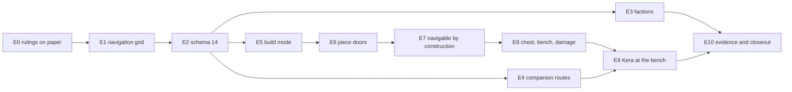

# M7 Part E - Slices, acceptance criteria, test matrix, runtime proof plan, implementation order

Status: the implementation planner's part of the M7 design, 2026-09-24. Design and planning only; not an owner ruling; no production code. Base: origin/main `e10d2c4`, read in the snapshot `main_e10d2c4`. Every `path:line` below is repo-relative and was re-read there.

Precedence: `D_cross_system.md` overrides A, B and C; F, GH and IJ refine D. This part turns D §3.2's layer-by-layer order (S0-S10) into vertical slices. It never reverses a D decision. Where it moves work between slices or refines a part, §E.5 lists the change.

Section numbers 11, 12, 13 and 18 are the M7 design's global numbering, as the brief asks.

---

## E.0 Decisions on one page

1. **Eleven slices, E0-E10.** Each ends in a merged-green, playable build ("Playable throughout", `docs/ROADMAP.md:15`). Each builds the authority, content, persistence use, presentation and proof of one feature together. D's horizontal S9 ("Presentation") is dissolved into the slices.
2. **One schema bump, 13 → 14, in E2.** E2 comes right after E1, the only earlier slice with runtime code, and E1 persists nothing: the grid is derived, and D §2.1 says it is never saved. So no slice ever holds authoritative state that a save would drop. No feature flag is needed (§E.1).
3. **E2 is the one deliberately horizontal slice**, and it is bounded. F §14's S3 and S4 become one slice with five commits. Its end state is testable end to end: an M6 save loads, the v14 fixture round-trips, and all 14 fixtures migrate.
4. **One windowed proof mode, `--build-shots`, grows beat by beat** from E1 to E9. Faction beats go into `--playthrough` in E3 (D32). Every slice also re-runs the proofs of the slices before it.
5. **A standard gate for every slice**, and global STOP rules (§E.2).
6. **Critical path:** E0 → E1 → E2 → E5 → E6 → E7 → E8 → E9 → E10. E3 (factions) and E4 (companion) come off E2 in parallel. The recommended single-agent order is E0-E10 in number order (§18).
7. **Owner-question deadlines:**
   - Q1 (rotation) and Q3 (assignment) are needed before E2 freezes the schema-14 shapes.
   - Q5 (the faction pair) is needed before E3.
   - Q4 (where to build) is needed before E5.
   - Q2 (crime) is recorded as a default in E0; changing it touches only documents.

| Slice | Name | Size | D slices it covers |
|---|---|---|---|
| E0 | The rulings on paper | S | S0 |
| E1 | Navigation you can see | L | S1a (most), S2 (navigation), S5 (grid) |
| E2 | Schema 14, landed once | L | S3, S4 |
| E3 | Factions v1 | L | S1c, S2 (C), S6 |
| E4 | Companion routes and opened doors | M | S1a (follower), S5 (companion) |
| E5 | Build mode: pads, walls, doorways, roofs | L | S1b, S2 (B), S7 (core), S9 (build) |
| E6 | Piece doors | S | S7 (doors) |
| E7 | Navigable by construction | M | S1a (edit check), S7 (`CheckEdit` join) |
| E8 | Chest, bench, blows and mending | M | S7 (chest, station, damage) |
| E9 | Kera works at your bench | L | S8 |
| E10 | Evidence and closeout | M | S10 |

---

## E.1 The schema-14 decision

**Where it lands: E2, once.**
- F §1 explains why a bump is required at all: fields are required on decode, and the fixture policy is mechanical.
- **One bump for all of M7**, not one per slice. Every schema step needs its own frozen shapes, fixture, `expected.json` regeneration and hard-coded step-list edits (`tests/Persistence.Tests/MigrationTests.cs:78`, `:415`; `tests/Persistence.Tests/HistoricalFixtureTests.cs:82`). Three bumps would triple that work. They would also leave two intermediate schemas, 14 and 15, that no shipped build ever needs. D14 and F §0 item 1 already decide one step.

**Why E2 is early rather than late.** Every M7 feature after the grid writes a persisted field:
- the companion's route (E4);
- the faction ledger (E3);
- pieces and `structure_seq` (E5);
- errands (E9).

A late bump would force those features to run with state a schema-13 save drops. That breaks the save-then-continue proof (`tests/Application.Tests/CompanionTests.cs:285`), and it would mean refusing to save. Autosave runs every 300 s (`src/Persistence/SaveStore.cs:41`), so refusing to save breaks R-1. A feature flag that hides M7 from saves would be worse: the playable build could not show the feature, and the flag's two code paths would need their own tests. Landing the shapes first makes each later slice an ordinary feature slice that fills an empty, already-migrated field.

**How E1 avoids unsaved state.** E1 adds only `StateSlice.Navigation`, which is derived and never saved (A §0 item 7; D §2.1). Guard G3 (`PersistenceNeverReferencesTheNavigationGrid`) lands in E1, before persistence changes.

**The carry rule.** A field that is loaded but has no owning system would be dropped by the next save. `Simulation.CaptureRecord` hand-lists what it captures (`src/World/Runtime/Simulation.cs:342-351`). So E2 makes every new record survive `Start` → `CaptureRecord` / `TakeSnapshot`:
- `CompanionRecord.Route` goes through the two companion copy sites (F §6.6).
- Pieces, `structure_seq` and errands live in `WorldDelta` and survive `TakeSnapshot`.
- The ledger gets a minimal `FactionSystem` that claims `StateSlice.Factions`, seeds it from `player.Factions` (the pattern of `_effects.Seed` at `Simulation.cs:140`), and gives it back to `CaptureRecord`. E3 adds the handlers.

**The freeze rule.** When E2's v14 fixture is committed, schema 14's shape is final for M7. A later slice that finds it needs another persisted field must STOP (§E.2 S2). Two guards catch a missing field: G12 (`EveryPersistedField_MovesItsDigest`) and the StateDump compare. The owner answers that could change the shapes (Q1: rotation 0..3 vs 0..7; Q3: whether errands exist at all) are therefore due before E2 merges.

---

## E.2 The standard gate and the global STOP rules

**Standard gate (every slice; "merged-green").** Run from the repository root:
1. `dotnet build src/UNNAMED.sln`, with 0 warnings in Presentation (the M6 bar, `docs/M6_STATUS.md:169`).
2. `dotnet test src/UNNAMED.sln`: all green. CI runs the same on `ubuntu-latest` (`.github/workflows/dotnet.yml`).
3. The content lint (AGENTS.md): 0 errors.
4. Godot 4.7.2 headless `--smoke` PASS and the `--quit-after 300` boot check. Both run on ASTRAL; CI has no Godot (`docs/M3_STATUS.md:88`).
5. The slice's own runtime acceptance, and every earlier `--build-shots` beat.
6. `docs/M7_STATUS.md` gains the slice's row: commits, test counts, lint count, the runs and any accepted residue.

Each commit inside a slice builds and passes `dotnet test`. The draft PR's CI is the merged-green signal. Merging to `main` is the owner's, at the milestone gate (AGENTS.md).

**Global STOP rules (any slice).** On any of these, stop and report:
- **S1.** An existing test must change beyond the edits the design lists by name (A §10.5 "Changed"; F §9.3; the `LoadAll_Loads_Yaml_Files` list).
- **S2.** After E2, a new persisted field or a changed DTO shape is needed.
- **S3.** A Godot type, a `Stopwatch` or a wall-clock ID is needed in `src/Domain`, `src/World` or `src/Application`.
- **S4.** An `expected.json` diff contains anything beyond F §9.2's lines.
- **S5.** `--playthrough` loses a beat, gains a companion catch-up, or its replay stops being byte-identical, for a reason the slice cannot name.
- **S6.** An owner answer contradicts a default the slice builds.
- **S7.** A CI budget assert fails at its 3× multiple (J.11.2).
- **S8.** Any path owned by DeepSeek would have to be touched (AGENTS.md).

---

## E.3 The slices

Each slice gives: purpose; code; new authoritative data; commands and events; content; persistence; presentation; tests; runtime acceptance; non-goals; STOP; commits. Test names are explained in §12.

### E0 - The rulings on paper (D S0)

**Purpose.** Write owner rulings 1 and 2 and the M7 reconciliation into the normative documents before any code, so no agent follows WA §11's baked navmesh or RK-14's "needs the engine" (risk R-X3).

**Code.** None.

**Documents:**
- `docs/DECISIONS.md`: dated entries for ruling 1 (navigation domain-side, deterministic, headless, replayable, derived from authoritative state, rebuilt on building edits, seam-independent; Godot navigation never authoritative) and ruling 2 (one storey; no upper floors, stairs, lifts, climbing, vertical navigation, voxel or structural physics; socket/snap); a dated D-08 note (quarter turns on a 3 m lattice, pending Q1).
- `docs/WORLD_ARCHITECTURE.md`: §5 (cells never partition movement or navigation); §10 (one storey; pieces are rows; navigability validated, not guaranteed by snapping); §11 (the navmesh row leaves the presentation table: a derived domain grid, never saved); RK-A2 "to be proven in M7 by a seam-free domain grid" ("solved" waits for E10).
- `docs/RISK_REGISTER.md`: RK-14 withdraws "needs the engine" and is validated by headless tests plus a runtime recording (likelihood unchanged until E10); RK-06 "navmesh rebuild" becomes "domain grid restamped per footprint change"; an accepted-risk row for one storey.
- `docs/PERSISTENCE.md` §2: the grid is derived, rebuilt in the `Simulation` constructor and on each footprint change, never saved; a mover's committed route is mover state and is saved.
- `docs/SYSTEMS.md`: `:443` and S-25 (A §11); S-32 "navmesh dirty regions" becomes "navigation dirty rectangles".
- `docs/ROADMAP.md` M7 (`:278-286`), per scope rows 1-14: the domain navigation grid; ground pads, one storey; quarter turns (Q1); crime, bounty and pardon deferred to Phase 3 with the act log as the seam (Q2); territory gating deferred; one work-anchor assignment (Q3); one build area crossing a seam (Q4); straddling required; "domain navigation path test"; the entry criterion (`:281`) met inside M7.
- `docs/INDEX.md` CRIME row (crime is Phase 3); `docs/GAMEPLAY_LOOPS.md:282` conflict recorded (property threats are M10's); the content bible's "no player settlement building" (`:1080`) superseded for M7.
- New `docs/M7_STATUS.md` in the M6 form: rulings as applied, this slice table, owner questions with deadlines, an empty scope ledger (R-X1), the local-risk table (I.3).
- `AGENTS.md` "Current status": M7 in progress; rulings 1 and 2 recorded.

**Tests and runtime.** None new. The suite stays green.

**Non-goals.** No as-built text: DATA_MODEL shapes, PERSISTENCE §5 fields and SYSTEMS S-27/S-32 detail land with their slices. No "solved" or "proven" claims.

**STOP.** A ruling contradicts rank-2 text in a way scope rulings §2 did not foresee.

**Commits.**
1. DECISIONS, WA, RISK_REGISTER, PERSISTENCE §2, SYSTEMS.
2. ROADMAP, INDEX, GAMEPLAY_LOOPS, the bible note.
3. `M7_STATUS.md` and AGENTS.md.

### E1 - Navigation you can see (A N1-N3)

**Purpose.** The derived, integer, seam-free grid and the planner exist over authored content. The grid is visible in F2 and proven headless. Nothing new is saved.

**Code:**
- **Domain,** `src/Domain/Spatial/`: `NavConfig`, `NavGeometry`, `NavInputs`, `NavTile`, `NavGrid` (`Build`, `With`, `Walkable`, `WindowStamp`, `Digest`), `NavScratch`, `NavSearch` (probes, A*, `StringPull`), `NavRoute` (`NavPoint`, `NavRect`, `NavRouteStatus`, `NavRoute.Problem()`, with no computed public properties, F §2.3) and `NavCounters`. `NavFollower` comes in E4 and `NavEditCheck` in E7.
- **Content:**
  - `content/config/navigation.yaml` (A §13.3, minus `work_anchor_max_m`, D23);
  - `src/Content/NavigationContent.cs` (NAV001-NAV007 and `Build`), hooked after `QuestContent` (D33).
  - **Decision:** `config.navigation` is optional. When it is absent, `NavConfig.Default` applies, and a test pins `Default` equal to the shipped file. E1 therefore does not touch the fixture pack; E2 adds the file to the pack. This answers F §15's question to A.
- **World:**
  - `RuntimeState`: `StateSlice.Navigation`, `Navigation`, `SetNavigation`;
  - `src/World/Runtime/Navigation.cs`: `NavigationSystem` with `Build`, `View`, `CurrentInputs` and `Reachable(NavAgent, from, to)` (D35), with scratch allocated lazily (D36);
  - `Simulation`: `SimulationSetup.Navigation`; `_navigation` composed right after `_crafting` (D8; `Simulation.cs:130`); `_navigation.Build()` after `_effects.Seed` (`:140`); a get-only `Navigation` view.
- **Application:** `GameSession.Boot` sets `Navigation` (`src/Application/GameSession.cs:88-99`).
- **Presentation:**
  - `Greybox/NavigationOverlay.cs`: person-unwalkable nodes within 24 m, gates coloured by state;
  - `Ui/StructureDebugPanel.cs`, holding only the navigation block for now (tiles, grid digest, counters);
  - `Main`: `build_debug` on F2 (Off → Navigation → Off; E5 makes it the two-stage cycle) and the F1 DEVELOPER row;
  - `BuildShots.cs`, wired like `--delta-shots`: the value list (`src/Presentation/Main.cs:1045`), the profile branch (`:89`), the seed (`:103`), one tick a frame (`:305`) and the input guard (`:342`). Until E5 it starts a new game at `Playthrough.Seed` (`src/Presentation/Playthrough.cs:38`).

**Authoritative data.** None saved. The grid is transient and derived.

**Commands and events.** None. `RoutePlanned` arrives in E4 and `NavigationRebuilt` in E5.

**Content.** `config.navigation`. `LoadAll_Loads_Yaml_Files` gains one ID.

**Persistence.** None.

**Tests:**
- Domain: N-D1, N-D3, N-D4, N-D5, N-D6, N-D9, N-D11, N-D12, N-D13, N-D14, N-D15, N-D16.
- World: N-W1, N-W2, N-W3.
- Application: N-A1, and the build and plan parts of N-A10.
- Content: N-X2, N-X3, `NavConfigDefault_IsTheShippedFile`.
- Architecture: N-X1, G3, G8 (scanning `Navigation.cs`), `CountersAreNeverRead`, `AuthorityNeverReadsAClock`.

**Runtime acceptance.** The standard gate, plus `--build-shots` beats b01 and b02 (§13.3), exit 0.

**Non-goals.** No follower, mover, edit check, rebuild dispatch or creature pathing (A §1). No Godot `NavigationServer`.

**STOP:**
- N-D9 or N-D11 fails. They carry the design's load-bearing claim.
- N-A1 finds an authored protected point outside the spawn's flood. That is a content or margin error; report it, and never loosen the margin.
- N-A10 measures a full build over 20 ms, or a capped plan over 4 ms on ASTRAL. The only allowed tuning is `max_expansions` in content, never below 12,000 (A §15.1).

**Commits.**
1. Domain types and the Domain tests.
2. Content and lints.
3. Runtime, the World and Application tests, and the guards.
4. Overlay, panel and `--build-shots`.

### E2 - Schema 14, landed once (D S3 + S4; F in full)

**Purpose.** Every M7 persisted field exists, is required on decode, is digested and is migrated before any system writes it. A real M6 save loads into this build.

**Code:**
- **Domain:**
  - `EntityId.Derived` beside `Create` (D §1.7), and `EntityKind.Piece` (`pce`);
  - `src/Domain/Factions/Factions.cs`, **record types only**: `ActRecord`, `FactionKnowledge`, `FactionStanding`, and `FactionLedger` with `Empty`, `OrdinaryFloor = -999`, `MaxPoints = 1000` and canonical-order validation. No computed public properties.
- **World:**
  - `WorldDelta`: `PieceRecord`, `NpcErrandRecord` and `NpcErrandPhase` (D §1.3); their stores, public readers and internal mutators; `TakeSnapshot`; the `FromSnapshot` order (F §3.2); `TryApplyPiece`, `TryApplyNpcErrand` and the chest clause (F §6.4); `EffectiveCellDigest` v2;
  - `PlayerRecord.Factions`, carried by all seven `With*` methods; player digest v10;
  - `CompanionRecord.Route`, carried by `Companions.cs:135-141` and `:149-155`;
  - `Simulation.StateDigest` v2, with `StructureSequence`;
  - `StateSlice.Factions`, claimed by the seed-only `FactionSystem` (§E.1) and read by `CaptureRecord`.
- **Content:** kind `piece` in `SchemaResolution`, the `piece_ref` suffix in `ContentChecks`, and `pieces` in the known directories. The semantic lints come with their slices.
- **Persistence (F §4-§9 exactly):**
  - `Sections/SchemaV13.cs`;
  - the four repoints, including `SchemaV11ToV12` (`src/Persistence/Migrations.cs:701`);
  - the new DTOs and `SchemaV13ToV14`;
  - `SaveFormat.SchemaVersion = 14` (`src/Persistence/SaveModel.cs:20`, 13 today);
  - codec changes; `DecodeEntitySection` returns a `DeltaSnapshot`;
  - `SaveLoader`: the decode site, the definition pass (with the storage-piece spill), `ProveBaselines` and `with` copies;
  - `SemanticRebase` rewritten with `with`.
- **Test data:**
  - `M2.Probe`'s v14 world and player (F §9.1);
  - `Fixtures/content-0.1.7`, and `Fixtures/content` moved to 0.2.9 (with `npc.fixture.smith` at (32, 70));
  - `v14/quick`;
  - the 13 older `expected.json` files regenerated once;
  - `CanonicalState`;
  - `tests/Application.Tests/Saves/m6_hollow/`, written by the `e10d2c4` build in a scratch worktree, with its manifest fingerprint recorded in the README beside it for E5 (F §8.3 step 1).

**Authoritative data.** Every schema-14 field (F §2). All of them are empty in live play.

**Commands and events.** None.

**Content.** No shipped definitions. The fixture packs only.

**Persistence.** The bump.

**Presentation.** None.

**Tests.** Every §12.5 row marked E2; `EntityIdDerived_…`; `WorldDelta_ExposesNoPublicMutation` with D38's names. `AnM6Save_…` asserts the persistence subset: no pieces, sequence 0, no errand, an empty ledger, Tavar's route `None`, both doors and the chest carried, `CellsRebased` empty. `ASaveAndALoad_CompareEqual_FieldByField` (`tests/Application.Tests/StateDumpTests.cs:19`) grows by exactly 2 leaves.

**Runtime acceptance:**
- The standard gate. The smoke's quicksave is now schema 14 and its digest is identical.
- `--playthrough`, then `--playthrough-verify`: every beat passes and `state_diff.txt` shows 0 differences. Expect 427 fields: 415 + `StructureSequence` + `NextActSeq` + 10 leaves for Tavar's `None` route (F §10.1). The count is recorded; 0 differences is the criterion.
- The replay's `state_replay.json` is byte-identical across two runs.

**Non-goals:**
- No system writes pieces, errands, routes or acts.
- No StateDump chest masking (E8), no deadfall or transition (E5), and no BLD, FAC or placement lints.

**STOP:**
- S4 (an `expected.json` diff beyond F §9.2).
- Any byte of `v1..v13/quick/**` or of a writer pack changes.
- A frozen type's wire shape differs; the v8-v13 fixtures prove the repoints.
- Q1 or Q3 is answered against the default before merge. Replan the shapes.

**Commits.**
1. Records, digests, the seed-only `FactionSystem`, G12 and F-E4. Green, with no save change (no digest is persisted, F §5.4).
2. The freeze and the repoints. Byte-identical.
3. **One commit:** the bump, DTOs, codec, loader, packs, probe, v14 fixture, every expectation, G11 and the corrupt and quarantine tests. The fixture-count test is red between the halves, so they cannot be split.
4. The M6 save and its test.
5. Documents: F §13's PERSISTENCE rows, DATA_MODEL §6 rule 1, the fixture README.

### E3 - Factions v1 (Part C in full)

**Purpose.** Acts are recorded, known only by witness or report, and move per-faction standing. Two gates work. F6 shows it all. The generated table proves "the same act moves two factions in opposite directions in a fixture" (`docs/ROADMAP.md:284`).

**Code:**
- **Domain:**
  - `Factions.cs` gains `FactionDefinition`, `StandingLadder.TierOf`, `WitnessRules`, `StandingRequirement` and `FactionRules` (`Learn`, `BestWitness`, `Compact`, `PointsOf`, `IsSettled`);
  - `src/Domain/Social/Social.cs`: `NpcDefinition.FactionId`, `ReputationCondition`, `ActDoneCondition`, `ReportActConsequence`, `IDialogueFacts.StandingLevel` and `ActDone`;
  - `MerchantStock.Requires`;
  - the `NotBuilt` text in Domain `Quests.cs:154-155`.
- **Content:** `FactionContent.cs` (FAC001), hooked after Navigation (D33 puts Building between them from E5); `SocialContent` and `ItemContent` parsing.
- **World:**
  - `Factions.cs`: `FactionSetup`, `RecordAct`, `ReportAct`, the handlers of `FactionSystem`, the events and the views;
  - `SystemContext.SightWalls()` = `Setup.Layout.Space.Blockers ∪ ClosedDoors()`, switched in at `src/World/Runtime/Combat.cs:569-570`, `Companions.cs:597-598` and `Creatures.cs:893`. It is the same list, so the change is behaviour-neutral;
  - `RecordAct` in `Die` after `RecordDeed` (`Creatures.cs:705-706`), and in `InteractionSystem.Work` after an accepted `SetWorldFlag`;
  - `DialogueSystem` report consequence and facts; `TradeSystem.Withheld`; the `QuestDebugger` arms;
  - `Simulation`: dispatch arms and the `Factions` and `Acts` views;
  - `GameSession.Boot` builds `Factions`.
- **Presentation:**
  - `Ui/FactionDebugPanel.cs` (F6);
  - the HUD log line on a `ReputationChanged` whose source is `reported`, which needs `Via` (GH H.14);
  - the F1 row;
  - the playthrough's faction beats (§13.2).

**Authoritative data.** The ledger, filling the E2 field.

**Commands and events:**
- Internal commands: `RecordAct` and `ReportAct`.
- Changed semantics: `ChooseCommand` (`report_act`) and `BuyCommand` (the billet gate).
- Events: `ActRecorded`, `FactionLearned`, and `ReputationChanged` with an added `string? Via`.

**Content:**
- `config.factions` and the two factions;
- `faction_ref` on Renn, Kera and Sel;
- Kera's billet row, appended last;
- Sel's and Kera's replies and nodes (DRAFT text, C §16.5).

`LoadAll_Loads_Yaml_Files` gains three IDs.

**Persistence.** None new.

**Tests.** Every §12.3 row marked E3, with `docs/M7_REPUTATION_TABLE.md` committed (F6 uses an authored wall; E5 adds the placed-wall row); G2; G5 (`AViewThatListensToEverything…` extended to the three events); G6 over `Combat.cs`, `Creatures.cs`, `Companions.cs`, `Magic.cs`, `Navigation.cs` and both `Quests.cs` files (D29). `AnM6Save_…` gains neutral views, billets withheld and `notes` hidden. `NpcTests.cs:287-307` stays unchanged.

**Runtime acceptance:**
- The standard gate.
- `--playthrough` with the faction beats inserted between `follow` (`Playthrough.cs:213`) and `ward` (`:214`) (§13.2). Every beat passes; the verify run shows 0 differences (about 470 fields, F §10.1); the replay is byte-identical.
- `--ui-shots` and `--delta-shots` exit 0 (Kera's and Sel's conversations gained replies).

**Non-goals.** Crime, bounty, pardon, legal status, territory, war state, decay, rumour, joining, a faction screen, building acts, and reputation quest rewards (C §19).

**STOP:**
- An existing dialogue, quest or trade test needs editing (S1).
- The playthrough's armour beat fails in 2 of 3 runs (§13.2 fallback).
- The G6 scan hits tactical code.

**Commits.**
1. Domain rules and tests.
2. Content, FAC001 and the content tests.
3. Runtime hooks, gates, the `SightWalls` refactor, the Application tests and the guards.
4. The table generator and the committed table.
5. F6, the HUD line and the playthrough beats.
6. As-built documents: SYSTEMS S-27; DATA_MODEL §4.12, §4.13 and §4.15; PROGRESSION §10; PROTOTYPE A-2 (C §18).

### E4 - Companion routes and opened doors (A N4)

**Purpose.** The entry criterion "companions path reliably": Tavar plans when his trail gives him no goal, and opens authored doors. The M6 companion tests stay green unmodified.

**Code:**
- **Domain:** `NavFollower.cs` (`NavStepKind`, `NavStep`, `Next`).
- **World:**
  - `NavigationSystem.Follow` and the `RoutePlanned` event;
  - `OpenDoor(string DoorKey, string NpcId)` (D6), handled by `InteractionSystem` for authored doors, for companions only until E9;
  - the close refusal extended to every NPC body and every living creature (D6; today `src/World/Runtime/Systems.cs:266-268` checks only the player);
  - `SystemContext.PersonObstacles(npcId)`, moved from `Companions.cs:570-581`;
  - `CompanionSystem`: `Route` in state, `Follow` per A §8.3 (Route and Nav modes, hysteresis), and route resets on Order, downed, up, `CatchUp` and `Fall`;
  - `Simulation`: dispatch `OpenDoor`; `NavigationView.Movers` gains the companion.
- **Presentation:** the F2 overlay draws route polylines and trail marks; the panel lists movers and the last `RoutePlanned`.

**Authoritative data.** `CompanionRecord.Route` is now written. The field exists from E2.

**Commands and events.** Internal `OpenDoor`. Events: `RoutePlanned`, and the reused `DoorToggled` with an NPC as the actor.

**Content and persistence.** None.

**Tests:**
- Domain: N-D2, N-D7, N-D8, N-D10, N-D17, N-D18.
- Application: N-A11; the authored-door half of `NoDoorCloses_OnAnyBody`; `HisState_RoundTripsThroughASave_FieldByField_AndGoesOnTheSame` (`CompanionTests.cs:285`) gains the route assertion; the companion case of N-A6 (E9 adds the errand).
- **Unmodified and green:** C16 (`CompanionTests.cs:119`), `FollowWaitFollow_…` (`:87`), `LeftFarBehind_…` (`:179`), every other `CompanionTests` case, `AScripted200CommandSession…` (`tests/Application.Tests/DeterminismAndViewTests.cs:49`), and `SixtyCreatures_TickWithinTheBudget` (`tests/Application.Tests/CreatureTests.cs:526`).

**Runtime acceptance.**
- The standard gate.
- `--playthrough`: every beat passes. The `follow` beat has 0 "caught up" rows. Transcript rows up to `follow` equal E3's run; any row that differs must be traced to Route mode and recorded. The verify run shows 0 differences.

**Non-goals.** Piece doors (E6); the errand mover (E9); closing doors behind (the D7 seam); creature pathing; the per-tick plan budget.

**STOP.** Any existing companion test fails or needs editing; C16 needs a catch-up; the playthrough's `follow` beat catches up.

**Commits.**
1. Follower and Domain tests.
2. `OpenDoor`, the all-bodies close refusal and `PersonObstacles`, with tests (neutral for the player).
3. Route mode and its tests.
4. Overlay.

### E5 - Build mode: pads, walls, doorways, roofs (B core)

**Purpose.** "Build a structure" works in the playable build. The player places and takes down pads, walls, doorways and roofs in `build_area.hollow_crossing`. Collision, sight and the navigation grid follow every edit ("the navmesh updates on placement", as reconciled). Pieces are saved as rows.

**Code:**
- **Domain:**
  - `src/Domain/Building/Building.cs`: definitions, `BuildingCatalog`, `BuildingConstants.Problem`, `Lattice`, `QuarterTurn`, `BuildingMath`, `PiecePose`, `Snapper`;
  - `Spatial/StructureFootprints.cs`: `TraversalClass`, `NavFootprint`, `StructureOrder` (D3);
  - `RegionLayout`: `BuildAreaSite`, `BuildAreas`.
- **Content:**
  - `BuildingContent.cs`: `Build`; BLD001-BLD004; BLD006 with D21's module check; BLD007; BLD009 (the J.4 ceilings);
  - WLD015 in `WorldContent`;
  - hooked in D33's order (Navigation, Building, Faction).
- **World:**
  - `StateSlice.Structures` and the `RuntimeState` wrappers;
  - `Building.cs`: `BuildingSystem` with Place, Dismantle, `Populate`, `Rebuild` and `RemoveCore(Dismantled)`;
  - `BuildingRules.cs`: `Validate` with checks 1-14. Check 15 returns `NotApplicable` for pads and roofs and `NotChecked` for solids until E7;
  - `SystemContext.Space` and `StructureFootprints`;
  - `SightWalls()` moves to `Space.Blockers ∪ ClosedDoors()`;
  - the `Space` switch at every site D §1.1 lists. `Creatures.cs:173` is not switched, and keeps a one-line comment saying why;
  - `NavigationSystem.Handle(RebuildNavigation)` through `NavGrid.With`, and `NavigationRebuilt`. For pads and roofs building sends no rebuild (J.3);
  - `Simulation`: `_building` composed (D8); the rebuild order `_building.Populate` → `_navigation.Build`; drain arms; the dispatch arm; the views `Pieces`, `Space`, `StructureRevision`, `StructureAudit`, `StructureFootprints`; `PreviewPlacement`, added to the allow-list (D §2.6).
- **Application:** `M6LayoutFingerprint`, taken from E2's README, and the M7 transition (F §8.3).
- **Presentation:**
  - `StructuresView`: the pad drape, walls, doorways with drawn lintels, roof slabs, camera colliders;
  - `Palette` materials;
  - `BuildMode.cs`: B, 1-7, PageUp/PageDown, R, left mouse, Z or Delete pressed twice, Esc precedence, and combat inputs suppressed;
  - `CameraRig.BuildMaxDistance` and `Cap` (the `const` stays: `src/Presentation/Perf/PerfRun.cs:56` reads it);
  - `PlayerController`: prediction reads `simulation.Space`, plus the `Place` and `Dismantle` submitters;
  - `Hud.SetBuild`, the F1 BUILDING section, the `CommandRejected` filter and `Main.Words`;
  - F2 becomes Off → Structures → +Navigation → Off.
- **`--build-shots`:**
  - it now boots the committed start save `tests/Application.Tests/Saves/m7_crossing_start/` (B §11's S0, §13.3);
  - beats b03-b06 (without the door), b08, b09 (no door yet), b18 and b19;
  - the new `--build-shots-verify`.

**Authoritative data.** Piece rows and `StructureSequence`. The fields exist from E2.

**Commands and events.**
- Commands: `PlacePieceCommand`, `DismantlePieceCommand`.
- Internal: `RebuildNavigation(NavRect, StructureChangeKind, long)` (D10).
- Events: `PiecePlaced`, `PieceRemoved`, `StructuresChanged`, `NavigationRebuilt`.

**Content:**
- `config.building` (minus `navigability_radius_m`, D22);
- `piece.pad.timber`, `piece.wall.timber`, `piece.doorway.timber`, `piece.roof.timber`;
- `item.material.timber`, `resource.wood.deadfall`, `node.wood.deadfall`;
- in the region: the deadfall at (84, 118) and the `build_areas` block.

`LoadAll_Loads_Yaml_Files` gains eight IDs.

**Persistence.** No shape change. The M7 baseline transition is content.

**Tests.** Every §12 row marked E5, including: the seven building-math tests; `EachPiece_Places_…` (four rows) and `EachPlacementRule_Refuses_…` (rules 1-14); `CrossingWorkshop_1to3` without door, bench and chest; N-A9, N-A12; `APlacedWall_HidesAnActFromAWitness` (a regenerated table row); the M6 fingerprint and transition tests, with `AnM6Save_…` gaining `CellsRebased` naming `r_0_0:c_00_01` and the deadfall `Ready`; the architecture guards G1, G4, G7, G9, G10, G13, `MovementRules_GainsNoMembers` and `EveryM7Action_IsBoundToADirectKey`. G6 and G8 gain `Building.cs` and `BuildingRules.cs`.

**Runtime acceptance:**
- The standard gate.
- `--build-shots`: the E5 beats; the verify run shows 0 differences and an equal continuation; the replay's `state_replay.json` is byte-identical.
- `--playthrough`: a new game has no pieces, so the `Space` switch must leave the transcript and replay equal to E4's.

**Non-goals.** Doors (E6); the navigability check (E7); chest, bench, damage and repair (E8); errands (E9); 45° turns; half and window walls; piece art bindings (GH G.4).

**STOP:**
- The playthrough changes, since the switch must be neutral.
- G9 finds a moved creature home.
- `SixtyCreatures_TickWithinTheBudget` fails.
- The fingerprint test finds another generator input changed.
- BLD007 or BLD009 rejects the shipped area. That is owner Q4's content, not a lint to relax.

**Commits.**
1. Domain building and its tests.
2. Content: lints, pieces, timber, deadfall, area and transition, with the content and transition tests.
3. `BuildingSystem`, the rules, the `Space` switch, the `SightWalls` move and the guards.
4. The navigation rebuild join and its tests.
5. Build mode and the views.
6. The start save, the beats and `--build-shots-verify`.

### E6 - Piece doors (B §7)

**Purpose.** A door hangs in a doorway and blocks when closed. The owner opens it with E, and so does the owner's companion. "Through" becomes a door, not an opening.

**Code:**
- Content: `piece.door.timber`, and BLD003's door-part rule active.
- World:
  - `OperatePieceDoor(EntityId, EntityId, string?, bool?)` (D6) and `CanOperate` (B §7.2);
  - `ClosedDoors()` appends the cached closed piece leaves in `StructureOrder`;
  - the `InteractionSystem` `pce_` branch comes first (D §1.6);
  - `Handle(OpenDoor)` routes `pce_` keys to `OperatePieceDoor`;
  - the close refusal covers piece doors;
  - piece-door footprints enter navigation as gates;
  - a toggle updates only the leaf cache, never the grid (G14).
- Presentation:
  - the hinge in `StructuresView` (GH G.3.3);
  - `FocusOn` includes piece doors; the prompt; `_open` refilled on `Resync`.

**Authoritative data.** `PieceRecord.DoorOpen` is written.

**Commands and events.** `InteractCommand` with a `pce_` target; internal `OperatePieceDoor`; `DoorToggled` with a `pce_` key (the actor may be Tavar).

**Content.** One ID.

**Persistence.** None.

**Tests:**
- `EachPiece_Places_…` gains the door row, and rule 7 gains its door cases.
- `WallsDoorwaysAndDoors_BlockAndPass` gains doors.
- The piece-door half of `NoDoorCloses_OnAnyBody`.
- `ACompanion_OpensTheOwnersPieceDoor`.
- N-D5 extended: toggling a piece door leaves `Grid.Digest()` unchanged.
- `APlacedWall_HidesAnActFromAWitness` gains a closed piece-door row.
- `CrossingWorkshop_1to3` is completed with the door.

**Runtime acceptance.** The standard gate. `--build-shots` b06 hangs the door; b09 is stopped at z 98.45 and opens it with E; b18 has Tavar pass the open door.

**Non-goals.** Locks; NPCs closing doors; foreign-owner cases beyond the refusal (D34).

**STOP.** A toggle rebuilds the grid, or a leaf closes on any body.

**Commits.**
1. Content, authority and tests.
2. Presentation and beats.

### E7 - Navigable by construction (D5; A §5.4)

**Purpose.** "Placement validation that rejects un-navigable configurations" (`docs/ROADMAP.md:283`). Check 15 is one local, exact check. The ghost becomes truthful: green or red, never amber, except while a check is pending.

**Code:**
- **Domain:** `NavEditCheck.cs`: `NavPointKind`, `NavProtectedPoint`, `NavEditVerdict` and `Check` (V-N1..V-N4), per D §1.2.
- **World:**
  - `NavigationSystem.CheckEdit`;
  - `BuildingRules.ProtectedPoints`, in D §1.2's order (errand anchors and bodies are empty until E9);
  - check 15 in both the command and the preview;
  - `Simulation._previewScratch`, lazily allocated, with no counter sink (D26);
  - `NavVerdict` = {`NotApplicable`, `NotChecked`, `Proven`, `Refused`}.
- **Content:** BLD008 parts (a) and (b), with crafted test packs.
- **Presentation:** the ghost tones with the `Asked` cache (GH H.4.4) and the status words.

**Authoritative data, commands, events.** None new.

**Tests:**
- N-D19, N-A13.
- `Preview_EqualsTheCommand_OverFortyPoses`, now over all 15 rules.
- `PreviewsInterleaved_ChangeNothing` (B's H4).
- `EachPlacementRule_Refuses_…` gains rule 15; `EachBuildingLint_…` gains BLD008.
- G7 gains `NavEditCheck.cs`; N-A10 gains the `CheckEdit` budget.
- `CrossingWorkshop_7_TheVestibuleIsRefused`. Until E9 its reason is the generic "that would close off a space with no way in", and the assertion keys on `Rule == "V-N1"`.

**Runtime acceptance.** The standard gate, plus `--build-shots` b14 (the vestibule refused in words).

**Non-goals.** Labels, `Window`/`Full`, `INavigability`, `Unknown` (D5 removed them all); a second graph for non-openers (M9).

**STOP:**
- `CheckEdit` takes more than 10 ms worst case on ASTRAL. Apply a J.13 lever only on that measurement.
- BLD008 rejects the shipped area. Change the content, not the lint (Q4).
- Preview/command parity fails anywhere.

**Commits.**
1. The Domain check and tests.
2. BLD008.
3. The command and preview join, with parity and H4.
4. Presentation and beat.

### E8 - Chest, bench, blows and mending (B §10, §13, §14)

**Purpose.** The storage and crafting placeables; per-piece health with the three-row explicit damage table; repair; destruction with spill and cascade. It covers "damage/repair works and is explicit" (`docs/ROADMAP.md:284`).

**Code:**
- **Content:** `piece.storage.chest`, `piece.station.anvil`; BLD005's container and station rules.
- **Domain:** `ContainerSite.InstanceId` and `Owner`.
- **World:**
  - `Items.cs`: `Baseline` empty for `""`; `Materialize` uses `site.InstanceId`; `Check` refuses a non-owner; the C1 clause at `:558`; `SpillContainer`, and the `ReleaseContainer` wrapper;
  - `SystemContext.FindContainer` appends piece chests; `Stations()`;
  - `Crafting.cs:168-169` reads `Stations()`;
  - `Combat.cs`: `FirstStop`, with `Trace` rewritten to produce the same outputs; the melee hook; a damage-source parameter on `Loose`; `Magic.cs:114` passes `formula`;
  - `BuildingSystem`: `DamagePiece`, `RepairPieceCommand`, and `RemoveCore(Destroyed)` with its cascade and spill;
  - `Simulation`: the new arms, the `Stations` view, `Containers` appending piece chests;
  - `StateDump`: the `container.pce_` masking (F §5.6; moved here from E2 because its test needs a placed chest).
- **Presentation:**
  - chest and bench greybox;
  - T mends; the target line; log lines for damage and destruction;
  - `OpenStation` reads `Stations`; `Describe` names `pce_` keys; `KeepContainerInReach` closes a vanished station.

**Authoritative data.** Piece health written; piece-chest `ContainerRecord`s (the schema-6 shape).

**Commands and events.**
- Commands: `RepairPieceCommand`; `MoveItemCommand`/`TakeAllCommand` to `container.pce_*`; `CraftCommand` at piece stations.
- Internal: `DamagePiece`, `SpillContainer`.
- Events: `PieceDamaged`, `PieceDestroyed`, `PieceRepaired`.

**Content.** Two IDs.

**Persistence.** None new.

**Tests.** Every §12 row marked E8: the chest, bench, damage and repair tests; `EachPiece_Places_…` and `ForeignPieces_…` gain their rows; `TwoFreshRuns_WithAPieceChest_ProduceTheSameReplayableDump` (F-E10); T10; `CrossingWorkshop_4and8`, with step 1 completed (19 pieces, 31 timber). Every existing combat and `Aim` test stays unchanged.

**Runtime acceptance.**
- The standard gate.
- `--build-shots` b07, b10, b15 and b16.
- `--playthrough`: the `FirstStop` rewrite touches every blow, so every fight must replay identically; the transcript must equal E7's.

**Non-goals.** Creature, fire, raid or off-screen damage; collapse; upgrade tiers; new recipes; beds.

**STOP.** Any combat or aim test changes; the playthrough transcript changes; T10 throws (the chest-crash class, R-B3).

**Commits.**
1. The chest and its inventory changes.
2. The bench and stations.
3. The `FirstStop` refactor alone, proven neutral by the combat tests and the playthrough.
4. Damage, repair and destruction.
5. Presentation and beats.

### E9 - Kera works at your bench (B §15; A §8.4; D §1.3)

**Purpose.** The ROADMAP exit "assign an NPC to work in it, verify the NPC navigates in, through, and around it — including a structure straddling a cell boundary" (`docs/ROADMAP.md:284`). The Crossing Workshop runs complete.

**Code:**
- **Domain:** `NpcDefinition.WorksAt`.
- **Content:** Kera's `works_at: [anvil, forge]`; BLD005's `works_at` check and D23's per-axis span of 85 m.
- **World:**
  - `StateSlice.NpcErrands`, claimed by `NpcSystem`, which becomes `partial`;
  - `Errands.cs`: the mover (D §1.3, with D27 and D28);
  - `BeginWork`, `EndWork`;
  - `BuildingSystem` Assign and Release, with refusals 1-10; refusal 10 uses `Reachable`;
  - `RemoveCore` sends `EndWork`;
  - `OpenDoor` is allowed for errand NPCs, and `CanOperate` looks up by NpcId;
  - `NpcSystem.Populate` places an errand NPC at the errand pose and repairs the record (F §15, issues for B); the facing loop skips errand NPCs;
  - `NavigationView.Movers` gains the errand; `Simulation` gains the arms and the `WorkAssignments` view;
  - G6 and G8 gain `Errands.cs`.
- **Presentation:**
  - Y (`work_order`), with its prompts and toasts (GH H.5-H.6);
  - F2 draws work anchors; the F1 row;
  - `--build-shots` beats b11-b13 and b17; the final b19; verify beats v1-v3.

**Authoritative data.** Errands. The field exists from E2.

**Commands and events.**
- Commands: `AssignWorkerCommand`, `ReleaseWorkerCommand`.
- Internal: `BeginWork`, `EndWork`, and `OpenDoor` sent by `NpcSystem`.
- Events: `WorkerAssigned`, `WorkerReleased`, `NpcArrivedAtWork`, `NpcReturnedHome`, `RoutePlanned`.

**Content.** One field on Kera.

**Persistence.** None new.

**Tests.** Every §12 row marked E9: N-A2 (implemented as `CrossingWorkshop_5to6_KeraWalksInThroughAndAround`), N-A3-N-A7, the remaining workshop step groups, the errand tests, `KeraAtWork_TradesAtTheBench_AndHerWaresStayHome` (D12), `ABuiltStaffedAndKnownWorld_CompareEqual_FieldByField` (F-E6) and the `works_at` lints; `ForeignPieces_…` and T10 gain assign and release. The vestibule's reason becomes "that would cut Kera Voss's work place off".

**Runtime acceptance:**
- The standard gate.
- The full `--build-shots` run, with `--build-shots-verify` (0 differences, an equal continuation, Kera home exactly) and a byte-identical replay.
- The seam recording (§13.4).
- `--playthrough`: Kera never has an errand in a new game, so it must be equal to E8's.

**Non-goals.** Schedules, production, wages, hirelings, a second worker, NPCs closing doors.

**STOP:**
- Kera moves more than 81 mm in one tick (a teleport).
- She misses B's arrival bound.
- Her route leaves the footprint and re-enters it.
- Save-then-continue diverges.
- Q3 is answered "M10". Replan: A §18 item 9's test-only mover proves the straddling case, and the assignment code is withheld.

**Commits.**
1. `works_at` and its lints.
2. The errand record's ownership, the mover and tests.
3. Assign and release, with the refusals and tests.
4. The workshop tests completed.
5. Y, the beats, verify and the recording.

### E10 - Evidence and closeout (D S10; IJ J.11)

**Purpose.** Measured budgets, the recorded runtime proofs, documents as built, and `M7_STATUS` in the M6 form.

**Code:**
- `tests/Application.Tests/M7BudgetTests.cs` (T1-T8, T11), T9 `TheCompanion_Soak`, N-A8, and the final N-A10.
- `docs/M7_COST_TABLE.md`, generated.
- `FrameStats` columns, and `sim_ms` and `save_ms` in `Main` (J.11.3).
- `PerfRun`'s `--perf-world <dir>` and the perf-world generator (J.11.4). `--perf` is unchanged.

**Documents:**
- `M7_STATUS`:
  - the parts, the evidence, the verification counts, and the exit criteria one by one (§11);
  - the complete scope ledger;
  - local risks;
  - the SaveTool limit (F §8.3);
  - the ASTRAL numbers against J.10;
  - the RAZER window, owed.
- `RISK_REGISTER`: I.3's edits, including RK-14's likelihood lowered and RK-06's ceilings.
- WA RK-A2 becomes "solved in M7".
- DATA_MODEL: the piece kind as implemented, `pce`, `piece_ref`, derived identities (`:123`).
- SYSTEMS S-32 as built.
- The `src/Domain/EntityId.cs:17-21` remark.
- AGENTS.md: status, derived IDs and the new run modes.
- README: the scripted checks.
- `docs/acceptance/m7/` and `docs/acceptance/m7_build/`: JPEG stills, transcripts, command logs, state JSON and diffs. Videos stay outside the repository (the M6 precedent, `docs/M6_STATUS.md:76`).

**Tests.** As listed. T2 replaces D S7's "the existing test with 200 pieces" (J.11.2). `SixtyCreatures_TickWithinTheBudget` stays unmodified.

**Runtime acceptance.** Every mode of §13, a `--perf` and `--perf --perf-world` trial on ASTRAL, and the J.12 checklist prepared for RAZER.

**Non-goals.** J.13 levers unless a measurement trips one; any M8 work.

**STOP:**
- A CI budget assert fails (S7).
- An ASTRAL number misses J.10's half-budget: apply only the lever that measurement names, in J.13 order, and report.
- The RAZER window is not given: record it as owed. That is the owner's gate, not a merge blocker, as in M6.

---

## E.4 Commit and branch discipline

- Commit boundaries are listed per slice. Every commit builds and passes the suite. The exception is E2's bump commit, which is atomic by necessity.
- Commit messages name the slice (for example "M7 E5.3: …").
- A slice ends with its `M7_STATUS` row and a green draft-PR CI.
- The branch and worktree follow the owner's roles ruling (AGENTS.md). Nothing is merged to `main` by the agent.

## E.5 Changes this part asks of other parts

- **D §3.2:** re-cut vertically; S9 dissolved into the slices; S3+S4 are one slice (E2), placed after the grid; E2 adds a seed-only `FactionSystem` so a loaded ledger is not dropped; D32's "a new game" becomes a committed start save from E5 on (a new game has neither timber nor a companion).
- **A:** `config.navigation` is optional, defaulting to `NavConfig.Default` (pinned by a test); N-D2, N-D7, N-D8 and N-D10 move to E4 with the follower; N-A12 to E5 (it needs a placed wall); N-A2 is implemented as B's workshop steps 5-6 (D24).
- **B:** the door is its own slice (E6); check 15 answers `NotChecked` until E7; BLD005's `works_at` and span parts land in E9; §11's scenario becomes step-group test methods that grow slice by slice, from a committed start save shared with `--build-shots`.
- **C:** the M6 playthrough never kills the Animated Armour, so D32's "dialogue only" cannot reach P5: E3 inserts an armour fight with Tavar told to wait, and the heart becomes act 1, the armour act 2. The placed-wall row lands in E5, the closed-piece-door row in E6.
- **F:** the StateDump chest masking and its test move to E8; `AnM6Save_…` grows in E2, E3 and E5; `M6LayoutFingerprint` lands in E5 from E2's recorded manifest.
- **GH:** presentation is distributed per slice; F2 is navigation-only in E1 and the two-stage cycle from E5; the 256-piece presentation measurement belongs to `--perf --perf-world`, not `--build-shots`.
- **IJ:** T10 lands in E8 and grows in E9; every guard lands with the first file it scans.

---

## 11. Exact acceptance criteria for M7

Each criterion is checkable, and names its evidence and what it proves. "Exit" means `docs/ROADMAP.md:284`, "Proof" `:285`, "Work" `:282-283` and "Entry" `:281`. R1-R7 are the owner rulings.

1. **Rulings 1 and 2 and the M7 reconciliation are written** into DECISIONS, WA §5/§10/§11, RK-14/RK-A2, PERSISTENCE §2 and the ROADMAP M7 entry. `M7_STATUS` names every default that awaits an owner answer.
   - Evidence: E0 review.
   - Proves: R1, R2; scope rulings §1.
2. **No Godot navigation in authority.** The grid is integer-only, derived, and never saved.
   - Evidence: `OnlyPresentation_MayReferenceGodot` (`tests/Architecture.Tests/ArchitectureTests.cs:27`), N-X1, G3, N-A7.
   - Proves: R1.
3. **The grid is a pure function of content and the piece set**: equal under any edit order, after repeated edits, and after a load.
   - Evidence: N-D11, N-A9, G10, `Building_RoundTrips…` (grid digest), N-A7.
   - Proves: R1 ("derived from authoritative state").
4. **"The navmesh updates on placement", as reconciled.** Every committed place, dismantle and destroy sends exactly one `RebuildNavigation` at its tick boundary. Door toggles, damage, repair and assignment send none.
   - Evidence: G1; N-A3 (`NavigationRebuilt` at the boundary); N-D5 extended in E6.
   - Proves: Exit; R1 ("responds to building edits").
5. **Seams are not in the data.**
   - Evidence: N-D9 (a)-(e), N-D10, N-W1.
   - Proves: Exit (straddling); RK-14.
6. **Movers replan after edits** and take the changed way.
   - Evidence: N-D7, N-D8, N-A3, N-A4, `CrossingWorkshop_9`.
   - Proves: R1.
7. **Companions path reliably.** C16 and every existing companion test pass unmodified. N-A11 has 0 catch-ups where M6's trail snagged. N-A12 passes. The playthrough's `follow` beat has 0 catch-ups.
   - Proves: Entry (met inside M7, scope row 14); RK-05.
8. **Build a structure.** Workshop step 1: 19 pieces accepted, exactly 31 timber spent, IDs `Derived(Piece, 1..19, owner)`, `StructureSequence` 19.
   - Evidence: `CrossingWorkshop_1to3`, `_4and8`, `_0and11`.
   - Proves: Exit ("Build a structure"); Work (pieces).
9. **One storey.** `MovementRules` and `Kinematics` gain no members. Every piece part has `ClearanceMm = 0` (BLD003). Pads and roofs are neither blockers nor navigation inputs (`EachPiece_Places_…` asserts empty parts).
   - Proves: R2.
10. **Socket/snap in quarter turns, with 0 mm tolerance.**
    - Evidence: the Domain lattice and `Snapper` tests; placement rules 3, 4, 7 and 8.
    - Proves: Work ("socket/snap"; free rotation reconciled, Q1).
11. **Overlapping configurations are refused.** Rules 7, 10 and 12 each refuse with their reason and leave `StateDigest` unchanged.
    - Evidence: `EachPlacementRule_Refuses_…`.
    - Proves: Work (validation).
12. **Un-navigable configurations are refused**, by V-N1..V-N4. The preview equals the command, and previews change nothing.
    - Evidence: N-D19, N-A13, `CrossingWorkshop_7`, `Preview_EqualsTheCommand_OverFortyPoses`, `PreviewsInterleaved_ChangeNothing`.
    - Proves: Work (validation); R7.
13. **Assign an NPC to work in it.** Kera Voss is assigned in person to the player's bench. Refusals 1-10 hold in order, and release sends her home.
    - Evidence: `Assign_RefusesInOrder`, `CrossingWorkshop_5to6`.
    - Proves: Exit; scope row 5 (Q3).
14. **In, through, around, straddling.** Kera:
    - arrives exactly at (100 750, 103 500), facing 270 000 mdeg, within B §11's bound;
    - sends `DoorToggled` with her ID for `door.forge_shed` and for the piece door;
    - crosses z = 100 exactly once inside [98 800, 105 200]², from `c_01_00` to `c_01_01`, and never leaves and re-enters;
    - moves at most 81 mm a tick, and is `IsClear` every tick;
    - takes a changed way home after step 9;
    - retires exactly at her site.
    - Evidence: N-A2, `CrossingWorkshop_9`, and `--build-shots` b12 (the seam recording).
    - Proves: Exit (in, through, around, straddling); RK-14.
15. **Save/load keeps every piece with its owner and health.**
    - Evidence:
      - `T01_M7State_RoundTripsEveryField_ByteStable`;
      - `Fixture_…(14)`'s M7 block (a foreign owner, health 150, `door_open`);
      - `Building_RoundTrips…`;
      - `CrossingWorkshop_10` (the north wall at 190, `StructureSequence` 31, D1 == D2, 0 StateDump differences);
      - `--build-shots-verify`.
    - Proves: Exit; Proof ("structure round-trip through save").
16. **Damage and repair work and are explicit.** There are exactly three damage sources, each one code point: melee 10, shot 2 and formula 12. A boar's charge damages nothing. At 0 health the piece is destroyed, with the doorway-takes-door cascade and the chest spill keeping item IDs. Repair at 170/200 costs 1 timber.
    - Evidence: `DamageRules_…`, `ABlowThatHitsACreature_…`, `APieceAtZero_…`, `ADestroyedChest_…`, `Repair_…`.
    - Proves: Exit.
17. **Ownership** gates dismantle, repair, assign, release, the chest and the piece door. It never gates damage and never feeds standing.
    - Evidence: `ForeignPieces_AreNotYoursToTouch`; G6 over `Building*.cs`; G13.
    - Proves: Work (ownership); R3.
18. **Storage and a station as placeables.** The chest keeps one `cnt_` through empty-and-refill and across a save. The bench crafts the March Spear until it is taken down.
    - Proves: Work.
19. **A sparse world delta and one schema step.**
    - v14 fixture committed;
    - all 14 fixtures migrate through the commit path;
    - each older `expected.json` gained only F §9.2's lines;
    - pieces and errands are proven by their host cell's `baseline_hash`;
    - no new section file.
    - Proves: Work ("sparse world delta (D-05)"); R7.
20. **An M6 save loads into M7** with nothing built, neutral standing, no errand, no route, and the deadfall transition named in `CellsRebased`.
    - Evidence: `AnM6Save_…`.
    - Proves: R-1 continuity; PERSISTENCE §7.4.
21. **Deterministic replay.**
    - Evidence:
      - N-A8, `CrossingWorkshop_0and11` (raw `StateDigest` after step 1), `FactionActs_ReplayFromTheCommandLog_EndIdentical`, H4;
      - the `--playthrough` and `--build-shots` replays byte-identical.
    - Proves: R1 ("replayable"); R7.
22. **The same act moves two factions in opposite directions in a fixture.** The signs of F1 and P5 are asserted, and `docs/M7_REPUTATION_TABLE.md` equals the build.
    - Evidence: `ReputationTableTests`, `TheSameKnownAct_MovesTwoFactionsInOppositeDirections`.
    - Proves: Exit (last clause); Proof ("a reputation fixture table").
23. **No magically global information.** No witness and no report means no knowledge. Authored walls, placed walls and closed piece doors hide acts. Companions never witness.
    - Evidence: F2, F3, F6, F9, F12 and N1; `AFactionThatNeitherSawNorWasTold_DoesNotUpdate`; `APlacedWall_HidesAnActFromAWitness`.
    - Proves: R3.
24. **The layers stay separate.** Personal relationship never follows standing. Faction relations never move standing. Nothing derives legal status, hostility or attack legality.
    - Evidence: `PersonalRelationships_StaySeparateFromStanding`, `FactionRelations_NeverMoveStanding`, `TacticalCode_NeverReadsFactionState`, `TheLadder_HasNoHostilityTier`.
    - Proves: R3; Work ("no universal morality meter").
25. **Gating derived from standing.** Sel's `notes` reply opens and closes. The billets are withheld, and a raw `BuyCommand` is refused until the Waystation is accepted.
    - Evidence: `TheReputationCondition_OpensAndClosesSelsNotes`, `TheBilletGate_…`.
    - Proves: Work ("service, dialogue … gating").
26. **Faction definitions, membership, static relations and reaction tables** exist in content and pass the FAC001 lints.
    - Evidence: the FAC001 set.
    - Proves: Work (faction definitions and membership).
27. **Reputation never converts into power.**
    - Evidence: `AxisIndependence_ReputationByLevel_2x2`, `…BySkill_2x2`, `NoContent_TradesCurrencyForStanding`.
    - Proves: Work (D-09); `docs/PROGRESSION_AXIS_RECONCILIATION.md:246`.
28. **No core action needs a radial menu.** Every M7 action is a named input action on a direct key, listed in F1.
    - Evidence: `EveryM7Action_IsBoundToADirectKey`; the F1 still.
    - Proves: R5.
29. **Presentation observes and submits.**
    - Evidence: `PresentationSource_NeverReachesPastThePublicReadAndCommandSurface` (`ArchitectureTests.cs:163`); G2; G4; `TheSimulation_ExposesOnlyReadsAndTheCommandPath` (`:112`) gains only `PreviewPlacement`; `Commands_CarryNoCameraState_SoEveryPerspectiveSubmitsTheSameThing` (`tests/Application.Tests/SessionTests.cs:163`).
    - Proves: R7; D-11.
30. **Identity.** Definition IDs are dotted (`piece.*`, `faction.*`). Runtime `pce_` and `cnt_` IDs come from `EntityId.Derived`. No M7 system mints a wall-clock ID. Acts use `Seq`.
    - Evidence: G8, `EntityIdDerived_…`.
    - Proves: R7.
31. **No networking.** The command queue stays the only mutation path, and the existing architecture tests are unchanged.
    - Proves: R6 (the seam kept).
32. **A playable build.**
    - Smoke PASS and the boot check.
    - `--playthrough` with the faction beats: every beat passes; verify shows 0 differences; the replay is byte-identical.
    - `--build-shots`: every beat passes; verify shows 0 differences and an equal continuation; the replay is byte-identical.
    - `--ui-shots` and `--delta-shots` exit 0.
    - Proves: Proof ("Playable build"); R-1 (`docs/ROADMAP.md:15`).
33. **Budgets.** `M7BudgetTests` is green at its CI multiples. The ASTRAL numbers are recorded against J.10. The RAZER capture is recorded as owed.
    - Proves: RK-02 and RK-06. Recorded, not a ROADMAP line.
34. **Scope held.**
    - The `NotBuilt` kinds are unchanged (`construct_building`, `src/Domain/Quests/Quests.cs:146`; the faction objectives).
    - There is no crime, territory, war-state or decay code.
    - The scope ledger is complete.
    - No M7 criterion depends on C10 (R4).
    - Proves: ROADMAP governs when; R3, R4; R-X1.

---

## 12. Test matrix

**Types:**
- **U** unit: pure Domain, or content lint;
- **I** headless integration: `Simulation` or `GameSession` through `Harness`;
- **P** persistence;
- **A** architecture: reflection or source scan;
- **R** runtime: Godot.

**Labels:** F-E1..F-E10 are Part F's evidence-test labels (F §10.2), not slices. G1-G19 are D's guards; T1-T11 are J.11.2's budget tests.

**Projects:** `Dom` = Domain.Tests, `Wld` = World.Tests, `App` = Application.Tests, `Per` = Persistence.Tests, `Con` = Content.Tests, `Arc` = Architecture.Tests.

### 12.1 Navigation (Part A)

| Test | Proj | Slice | Proves | Type |
|---|---|---|---|---|
| N-D1 `AnOpenField_RoutesStraight` | Dom | E1 | simple reachable path, bounded expansions | U |
| N-D2 `AWall_IsRoutedAround_AndWalkedByKinematics` | Dom | E4 | follower plus `Kinematics` walks a planned detour | U |
| N-D3 `ADoorway_IsTheWayIn` | Dom | E1 | a route uses the doorway | U |
| N-D4 `ASealedRoom_IsEnclosed_WithoutAStar` | Dom | E1 | probes decide an enclosure with 0 expansions | U |
| N-D5 `AClosedDoor_StopsANonOpener_NotAnOpener` | Dom | E1 (piece doors E6) | gates at query time; toggles leave the grid digest (G14) | U |
| N-D6 `BodyClasses_ThroughDoors` | Dom | E1 | a different body size | U |
| N-D7 `APieceAcrossTheRoute_Invalidates` | Dom | E4 | the stamp change forces a `geometry` replan | U |
| N-D8 `ARemovedPiece_GivesTheShorterRoute` | Dom | E4 | removal is noticed next call | U |
| N-D9 `TheSeam_IsNotARepresentationBoundary` | Dom | E1 | tile or order independence; the monolithic reference | U |
| N-D10 `AStraddlingHut_IsEnteredOnce_AndCrossedTwice` | Dom | E4 | RK-14's "exits and re-enters" fails it | U |
| N-D11 `RectRebuild_EqualsFullBuild_AlwaysAndBack` | Dom | E1 | a rectangle rebuild equals a full build | U |
| N-D12 `TheSameQuery_GivesTheSameRoute` | Dom | E1 | deterministic ties | U |
| N-D13 `TheBudget_EndsASearch_Deterministically` | Dom | E1 | the expansion cap is exact | U |
| N-D14 `TheEnds_Snap_ByDistanceThenIndex` | Dom | E1 | end snapping | U |
| N-D15 `IntegerGeometry_EqualsSeparation` | Dom | E1 | the integer predicate equals `Separation` | U |
| N-D16 `EveryLatticeEdge_IsWalkableByTheBody` | Dom | E1 | the soundness margin | U |
| N-D17 `TheFollower_OpensTheNearestDoorInReach` | Dom | E4 | a geometric door tie-break | U |
| N-D18 `EachReplanTrigger_FiresOnItsCondition` | Dom | E4 | the 8 triggers | U |
| N-D19 `EditCheck_Rules` | Dom | E7 | V-N1..V-N4 | U |
| N-W1 `TileKeys_AreCellKeys` | Wld | E1 | tiles map to cells, including the negative region | I |
| N-W2 `TheNavigationSlice_HasOneOwner_AndBuildingPublishesNothing` | Wld | E1 | one owner; construction is silent | I |
| N-W3 `TwoSimulations_ShareNoNavigationState` | Wld | E1 | no shared scratch (G17) | I |
| N-A1 `TheHollow_EveryProtectedPointIsReachable` | App | E1 | authored content is navigable | I |
| N-A2 `TheAssignedNpc_WalksIntoAHutStraddlingTheSeam_AndHome` (= `CrossingWorkshop_5to6`) | App | E9 | the exit: in, through, straddling, exact, no teleport | I |
| N-A3 `AWallPlacedAcrossTheRoute_IsWalkedAround` | App | E9 | a rebuild at the boundary, then a replan | I |
| N-A4 `ARemovedWall_OpensTheShorterWay` | App | E9 | removal shortens the route | I |
| N-A5 `AnUnreachableGoal_LeavesTheNpcWaiting` | Wld | E9 | unreachable holds and retries, never teleports | I |
| N-A6 `MidRoute_SaveLoad_GoesOnTheSame` | App | E4 (companion) / E9 | save-then-continue for both movers (G15) | I |
| N-A7 `TheSeam_SurvivesAReload` | App | E9 | the grid and routes are equal after a load | I |
| N-A8 `APlacementSession_ReplaysToTheSameState` | App | E10 | a full replay, raw digest included | I |
| N-A9 `RepeatedRebuilds_AreIdentical` | App | E5 | 50 place/dismantle cycles return the digest | I |
| N-A10 `Navigation_StaysWithinBudget` (T6) | App | E1, E7, E10 | build, plan and `CheckEdit` budgets | I |
| N-A11 `TheCompanion_OpensTheLodgeDoor_AfterWaitThenFollow` | App | E4 | the entry criterion: the M6 snag is gone | I |
| N-A12 `TheCompanion_FollowsRoundAPlayerWall` | App | E5 | the companion round a placed wall | I |
| N-A13 `PlacementIsRefused_WhenNavigationWouldBreak` | App | E7 | the ROADMAP "un-navigable" refusal | I |
| N-X1 `NavDomain_IsIntegerOnly` | Arc | E1 | no float or transcendental in `Nav*.cs` (G16) | A |
| N-X2 `LoadAll_Loads_Yaml_Files` (gains IDs in E1, E3, E5, E6, E8) | Con | each | the exact content list | U |
| N-X3 `NavigationLints_RefuseBadConfigs_AndPassTheGame` | Con | E1 | NAV001-NAV007 | U |
| `NavConfigDefault_IsTheShippedFile` | Con | E1 | an absent config means the shipped values | U |
| `HisState_RoundTripsThroughASave_FieldByField_AndGoesOnTheSame` (+ route) | App | E4 | the companion route round-trips | I |

N-P1..N-P4 are carried by F's tests below: N-P1 = `Schema13To14_…`, N-P2 = `ASchema14CompanionWithoutARoute_…`, N-P3 = `Fixture_…(14)`, N-P4 = the route cases of the corrupt set.

### 12.2 Building (Part B)

| Test | Proj | Slice | Proves | Type |
|---|---|---|---|---|
| `Lattice_AnchorsAndSlotKeys_ForEverySlotKind` | Dom | E5 | the §0.4 slot rules | U |
| `QuarterTurn_MapsBoxesAndFacingsExactly` | Dom | E5 | integer rotation | U |
| `Sockets_HaveTheirWorldPositionsAndAxes` | Dom | E5 | sockets | U |
| `Snapper_SnapsFixedHalfModuleAndDoorAims` | Dom | E5 | aim to pose | U |
| `Relief_OfTheKnownSquares` (228 mm, 96 mm) | Dom | E5 | the terrain tolerance | U |
| `RoofSupport_DepthOneOnly` | Dom | E5 | no structural simulation | U |
| `IntegerOverlap_TouchingIsNotOverlap` | Dom | E5 | overlap maths | U |
| `RepairCost_RoundsUp_AndRefund_RoundsDown` | Dom | E8 | cost scaling | U |
| `EntityIdDerived_IsStable_AndOrdersLikeItsOrdinal` | Dom | E2 | replay-stable IDs | U |
| `TheGamePack_BuildsTheCatalogueTheAreaAndTheDeadfall` | Con | E5 (E6, E8 rows) | the shipped content builds | U |
| `EachBuildingLint_RefusesItsCraftedBadFile` (BLD001-BLD009, WLD015) | Con | E5; BLD008 E7; BLD005 E8/E9 | lints | U |
| `KnownDirectories_Is_Closed_Set` (+ `pieces`) | Con | E2 | the kind is registered | U |
| `KerasWorksAt_Parses_AndIsRecipeUsed` | Con | E9 | the `works_at` field | U |
| `EachPiece_Places_WithItsExactSpendEventsViewAndId` | App | E5, E6, E8 | each piece | I |
| `EachPlacementRule_RefusesWithItsReason_AndLeavesTheDigest` | App | E5 (1-14), E7 (15) | the 15 checks | I |
| `Preview_EqualsTheCommand_OverFortyPoses` | App | E7 | preview parity | I |
| `PreviewsInterleaved_ChangeNothing` (H4) | App | E7 | previews never affect outcomes (G7) | I |
| `WallsDoorwaysAndDoors_BlockAndPass` | App | E5, E6 | collision | I |
| `NoDoorCloses_OnAnyBody` | App | E4, E6 | D6 | I |
| `ACompanion_OpensTheOwnersPieceDoor` | App | E6 | `CanOperate` | I |
| `Prediction_EqualsAuthority_AcrossANewWall` | App | E5 | prediction reads `Simulation.Space` | I |
| `Creatures_AreBlockedByPieces` | App | E5 | the `Space` switch | I |
| `Aim_StopsAtAPieceWall` | App | E5 | `SightWalls` | I |
| `Dismantle_RefusesInOrder_AndRefundsHalf` | App | E5 | dismantle | I |
| `ForeignPieces_AreNotYoursToTouch` | App | E5, E8, E9 | ownership gates | I |
| `TheFourCellPad_IsHostedByItsAnchor_AndDigestedOnce` | App | E5 | host cell; straddling rows | I |
| `Building_RoundTripsThroughSave_AndNavigationDerivesIdentically` (F-E7) | App | E5 | rows, sequence, grid digest, `Space` after a load | P |
| `TwoHundredPieces_RoundTripAndStayNavigable` (RK-06) | App | E5 | scale, growth ≤ 200 × 250 B | P |
| `APieceChest_EmptiedAndRefilled_KeepsOneIdentity` | App | E8 | the C1 fix | I |
| `APieceChest_EmptiedAndRefilled_AcrossASave_KeepsOneIdentity` | App | E8 | C1 across a save | P |
| `AChestWithItems_CannotBeTakenDown` | App | E8 | the dismantle refusal | I |
| `ADestroyedChest_SpillsItsStacks_KeepingTheirIds` | App | E8 | no item loss | I |
| `APieceAnvil_Crafts_UntilTakenDown` | App | E8 | the station | I |
| `DamageRules_MeleeShotAndFormula_DealTheirAmounts` | App | E8 | the explicit table | I |
| `ABlowThatHitsACreature_DamagesNoPiece` | App | E8 | `FirstStop` | I |
| `AnAuthoredWall_ShieldsATouchingPiece` | App | E8 | the shielding rule | I |
| `APieceAtZero_IsDestroyed_AndADoorwayTakesItsDoor` | App | E8 | destruction and cascade | I |
| `Repair_CostsTheScaledTimber_AndRefusesInOrder` | App | E8 | repair | I |
| `Assign_RefusesInOrder` | App | E9 | refusals 1-10 | I |
| `Kera_WalksToTheBench_ArrivesExactly_AndHomeAgain` | App | E9 | exact landing and retirement | I |
| `AnErrand_OpensDoors_AndNeverClosesThem` | App | E9 | D7 | I |
| `AnErrandNpc_FacesHerWork_OrTheCharacterWhileTalking` | App | E9 | D27 | I |
| `AnErrand_SavedMidWalk_ContinuesLikeTheUnsavedWorld` | App | E9 | G18 | I |
| `TakingDownTheBench_SendsTheWorkerHome` | App | E9 | `EndWork` | I |
| `KeraAtWork_TradesAtTheBench_AndHerWaresStayHome` | App | E9 | D12 | I |
| `CrossingWorkshop_1to3_BuildRefuseAndWalkIn` | App | E5 → E6 | build, overlap, collision | I |
| `CrossingWorkshop_7_TheVestibuleIsRefused` | App | E7 → E9 | navigability in the scenario | I |
| `CrossingWorkshop_4and8_CraftBlowsMendAndSpill` | App | E8 | station, damage, repair, chest | I |
| `CrossingWorkshop_9_ANewWallChangesHerWayHome` | App | E9 | "around" | I |
| `CrossingWorkshop_10_SaveQuitReloadGoesOnTheSame` | App | E9 | the save proof (D1 == D2, 0 differences) | P |
| `CrossingWorkshop_0and11_ReplaysFromTheLog` | App | E9 (E5 partial) | replay and raw digest | I |
| `TheCommittedBuildStart_IsTheCrossingWorkshopStart` | App | E5 | the `--build-shots` start is B §11's S0 | I |
| `ACreatureChasingRoundTheWorkshop_NeverOverlapsAPiece` | App | E5 | R-A7 | I |

### 12.3 Factions (Part C)

| Test | Proj | Slice | Proves | Type |
|---|---|---|---|---|
| `TierOf_FollowsTheLadder_AtEveryBoundary` | Dom | E3 | the ladder | U |
| `Learn_AppliesARowOnce_PerFactionPerAct` | Dom | E3 | idempotence | U |
| `Learn_Unidentified_KnowsButMovesNothing` | Dom | E3 | identity gating | U |
| `Learn_AReportUpgradesUnidentifiedExactlyOnce` | Dom | E3 | the upgrade | U |
| `Learn_WithoutARow_StoresNothing` | Dom | E3 | relevance | U |
| `Learn_ClampsAtTheOrdinaryFloor_AndTheCap` | Dom | E3 | clamps | U |
| `BestWitness_IdentifiedBeatsUnidentified_ThenNearer_ThenLowerNpcId` | Dom | E3 | deterministic witness | U |
| `BestWitness_RangeFacingAndWallsHideTheActor` | Dom | E3 | sight | U |
| `Compact_EvictsTheOldestSettledActFirst` | Dom | E3 | retirement | U |
| `ReputationTableTests` (F1-F14, P1-P5, N1; generates `docs/M7_REPUTATION_TABLE.md`) | App | E3 (+rows E5, E6) | **the ROADMAP proof** | I |
| `TheSameKnownAct_MovesTwoFactionsInOppositeDirections` | App | E3 | the exit, on shipped content | I |
| `AFactionThatNeitherSawNorWasTold_DoesNotUpdate` | App | E3 | not psychic | I |
| `AnUnknownActor_MovesNoStanding_UntilIdentified` | App | E3 | identity | I |
| `RepeatedReportsAndWitnesses_ApplyOnce` | App | E3 | idempotence | I |
| `DistinctActs_EachApply` | App | E3 | distinct acts | I |
| `FactionState_ContinuesAcrossASaveAndLoad` | App | E3 | 0 StateDump differences | P |
| `SaveThenContinue_EqualsContinue_WithFactions` | App | E3 | `StateDigest` continuity | P |
| `FactionActs_ReplayFromTheCommandLog_EndIdentical` | App | E3 | replay (G5) | I |
| `TwoFreshRuns_ProduceTheSameReplayableDump` | App | E3 | fresh-ID independence | I |
| `PersonalRelationships_StaySeparateFromStanding` | App | E3 | layer separation (R3) | I |
| `FactionRelations_NeverMoveStanding` | App | E3 | static relations | I |
| `ACompanionsKill_IsNotThePlayersAct` | App | E3 | attribution | I |
| `TheBilletGate_HidesTheWare_AndRefusesARawBuyCommand_UntilAccepted` | App | E3 | the service gate | I |
| `TheReputationCondition_OpensAndClosesSelsNotes` | App | E3 | the dialogue gate | I |
| `ActDone_OffersTheReportOnlyAfterTheAct` | App | E3 | reports need an act | I |
| `AxisIndependence_ReputationByLevel_2x2`, `AxisIndependence_ReputationBySkill_2x2` | App | E3 | no currency crossing | I |
| `APlacedWall_HidesAnActFromAWitness` (+ closed piece door) | App | E5, E6 | building occlusion (D11) | I |
| FAC001: `TheLadder_HasNoHostilityTier`, `ACompanionCannotBeAMember`, `AMemberStandsInsideTheSeat`, `AStandingCondition_NamesTheSpeakersOwnFaction`, `ActDone_OnlyBesideAReportOfTheSameAct`, `AGate_BelongsToTheTradersFaction`, `APlacedPieceReaction_IsRefused`, `ARespawningCreatureReaction_IsRefused` | Con | E3 | lints | U |
| `NoContent_TradesCurrencyForStanding` | Con | E3 | E-7 | U |
| `FactionContent_RefusesDataModelFieldsItDoesNotBuild` | Con | E3 | a closed field set | U |
| `TacticalCode_NeverReadsFactionState` (G6) | Arc | E3 (+E5, E9 files) | no hostility from standing | A |

### 12.4 Cross-system guards (Part D)

| Test | Proj | Slice | Proves | Type |
|---|---|---|---|---|
| G1 `OnlyBuildingDispatchesRebuildNavigation` | Arc | E5 | rebuild authority | A |
| G2 `QuestCode_NeverReadsStanding`, `PresentationSource_NeverDerivesStanding` | Arc | E3 | no psychic quests or UI | A |
| G3 `PersistenceNeverReferencesTheNavigationGrid` | Arc | E1 | the grid is never saved | A |
| G4 `PresentationUsesNoPhysicsQueries` | Arc | E5 | no engine authority | A |
| G5 `SystemsNeverSubscribe`, and `AViewThatListensToEverything_…` (`DeterminismAndViewTests.cs:80`) extended | Arc / App | E3 (+E5, E9 events) | synchronous acts | A / I |
| G7 `PlacementRules_AreReadOnly` | Arc | E5, E7 | read-only preview | A |
| G8 `M7SystemsMintNoWallClockIds` | Arc | E1 (+E3, E5, E9) | replay-stable IDs | A |
| G9 `CreatureHomes_DoNotDependOnPlacedPieces` | App | E5 | the `Populate` exception | I |
| G10 `SpaceOrder_IsAFunctionOfThePieceSet` | App | E5 | `StructureOrder` | I |
| G11 `EveryDeltaSnapshotProperty_SurvivesDecodeTheDefinitionPassAndTheRebase` | Per | E2 | no hand-list drop | P |
| G12 `EveryPersistedField_MovesItsDigest` | Wld | E2 | complete digests | U |
| G13 `BuildingNeverRecordsAnAct` | Arc | E5 | no items-for-standing | A |

G14 = N-D5; G15 = N-A6; G16 = N-X1; G17 = N-W3; G18 = `AnErrand_SavedMidWalk_…`; G19 is covered by G6.

### 12.5 Persistence (Part F)

| Test | Proj | Slice | Proves | Type |
|---|---|---|---|---|
| `T01_M7State_RoundTripsEveryField_ByteStable` (F-E1) | Per | E2 | T-01/T-03 for every field | P |
| `Fixture_LoadsToItsExpectedCurrentState(14)` with the M7 block; `Fixture_MigratesThroughTheCommitPath_AndReloadsToTheSameState(1..14)` (`HistoricalFixtureTests.cs:100`, `:294`) | Per | E2 | migration and v14 values | P |
| `EveryShippedSchemaVersion_HasAFixture_AndNoneFromTheFuture` (`:82`), unchanged | Per | E2 | the fixture policy | P |
| `EveryPlayerRecordInitProperty_SurvivesEveryWithMethod` (F-E4) | Per | E2 | the `With*` trap | P |
| `ASchema14PlayerWithoutFactions_IsCorrupt_NotDefaulted` | Per | E2 | corrupt, not defaulted | P |
| `ASchema14CompanionWithoutARoute_IsCorrupt_NotDefaulted` (+ status, corners, watch cases) | Per | E2 | route decode | P |
| `ASchema14EntitiesSectionWithoutPiecesSeqOrErrands_IsCorrupt_NotDefaulted` | Per | E2 | required lists | P |
| `AnErrandWithoutARoute_IsCorrupt_NotDefaulted` | Per | E2 | D19 | P |
| `AQuarantinedEntitiesSection_LosesStructuresErrandsAndChestsTogether_AndSaysSo` | Per | E2 | quarantine | P |
| `AnInvalidPieceRow_IsRejectedAlone`, `AnInvalidErrandRow_IsRejectedAlone` | Per | E2 | row rejection | P |
| `APieceChestWithoutItsPiece_IsRejected`, `APieceChestWithTheWrongIdentity_IsRejected` | Per | E2 | the chest clause | P |
| `ACellsQuarantine_LeavesPiecesAndErrandsWhole` | Per | E2 | section independence | P |
| `Schema13To14_GivesNothingBuiltNoLedgerAndNoRoutes` (N-P1; C's `…GivesAnEmptyLedger`) | Per | E2 | the step's defaults; no reconstruction | P |
| `PiecesAndErrands_GoThroughTheDefinitionPass_RenamesRemovalsSpillsAndMerges` | Per | E2 | F §7 with the spill | P |
| `TheFactionLedger_GoesThroughTheDefinitionPass_RenamesMergesAndRemovals` | Per | E2 | C §14.5 | P |
| `PiecesAndErrands_AreProvenByTheirHostCells_AndRebasedByATransition` | Per | E2 | baseline proof and rebase | P |
| `ACompanionRoute_SurvivesPopulateAndCapture` | App | E2 | the copy sites | I |
| `TheFactionLedger_SurvivesStartAndCapture` | App | E2 | the carry rule | I |
| `AnM6Save_LoadsIntoM7_WithNothingBuiltNeutralStandingNoErrandAndNoRoute` | App | E2 (+E3, E5) | a real M6 save loads | P |
| `TheM6LayoutFingerprint_IsTodaysLayoutWithoutTheDeadfall` | App | E5 | the frozen constant; no other generator change | P |
| `AnM6LayoutSave_LoadsOntoM7s_ThroughTheDeadfallTransition` | App | E5 | the M7 transition | P |
| `ASaveAndALoad_CompareEqual_FieldByField` (`StateDumpTests.cs:19`; +2 leaves) | App | E2 | M7 leaves in the dump | P |
| `ABuiltStaffedAndKnownWorld_CompareEqual_FieldByField` (F-E6) | App | E9 | the whole M7 state through `GameSession` | P |
| `TwoFreshRuns_WithAPieceChest_ProduceTheSameReplayableDump` (F-E10) | App | E8 | the chest-key masking | I |
| The MigrationTests step-list edits (F §9.3) | Per | E2 | chain integrity | P |

### 12.6 Risk and performance (Part IJ)

| Test | Proj | Slice | Proves | Type |
|---|---|---|---|---|
| T1 `M7CostTable_MatchesTheBuild` → `docs/M7_COST_TABLE.md` | App | E10 | machine-independent work counts | I |
| T2 `TheCapWorkshop_SixtyCreaturesAndTwoMovers_TickWithinTheBudget` | App | E10 | the 4 ms tick | I |
| T3 `APlacementBurst_StaysWithinTheCommandBudget` | App | E10 | command frames | I |
| T4 `AnEditThatReplansBothMovers_StaysWithinTheTickBudget` | App | E10 | the edit tick | I |
| T5 `PreviewPlacement_StaysWithinTheFrameBudget` | App | E10 | the ghost's cost; unchanged counters | I |
| T7 `SaveAndLoad_WithTheCapWorkshop_StayInsideTheirBudgets` | App | E10 | save growth and time | P |
| T8 `FactionActs_AtTheLogCap_StayCheap` | App | E10 | act costs | I |
| T9 `TheCompanion_Soak` | App | E10 | RK-05's soak, finally written | I |
| T10 `BuildingCommands_NeverThrow` | App | E8 (+E9) | R-B3 | I |
| T11 `PerfWorld_IsBuiltThroughCommands` | App | E10 | the perf-world save | I |
| `CountersAreNeverRead` | Arc | E1 (+E3, E5) | counters stay out of decisions | A |
| `AuthorityNeverReadsAClock` | Arc | E1 | no `Stopwatch` or `DateTime.Now` | A |
| `MovementRules_GainsNoMembers` | Arc | E5 | R2 | A |
| `SixtyCreatures_TickWithinTheBudget` (`CreatureTests.cs:526`), unmodified | App | all | no regression | I |

T6 = N-A10.

### 12.7 UI (Part GH) and runtime

| Test / run | Proj | Slice | Proves | Type |
|---|---|---|---|---|
| `EveryM7Action_IsBoundToADirectKey` (source scan of `DefineInput`) | Arc | E5 (+E9 `work_order`, F2, F6) | R5 | A |
| `TheSimulation_ExposesOnlyReadsAndTheCommandPath` (+ `PreviewPlacement`) | Arc | E5 | the read surface | A |
| `PresentationSource_NeverReachesPastThePublicReadAndCommandSurface`, `Commands_CarryNoCameraState_…`, `EveryStateSlice_HasExactlyOneOwningSystem` (`SessionTests.cs:151`), unchanged | Arc / App | all | R7 | A / I |
| `--smoke`, `--quit-after 300` | Godot headless | all | boot and save round trip | R |
| `--playthrough`, `--playthrough-verify`, replay | Godot | E2+, faction beats E3 | the M6 path plus factions | R |
| `--build-shots`, `--build-shots-verify`, replay | Godot | E1+ | the building and navigation proof | R |
| `--ui-shots`, `--delta-shots` | Godot | E3+ | no Phase-1 regression | R |
| `--perf`, `--perf --perf-world` | Godot | E10 | ASTRAL trial; RAZER owed | R |

---

## 13. Runtime proof plan

### 13.1 The modes

| Mode | New in | Start | What it proves |
|---|---|---|---|
| `--build-shots <dir>` | E1 | a new game at `Playthrough.Seed` until E5; then the committed save `tests/Application.Tests/Saves/m7_crossing_start/` (B §11's S0) | navigation, building and the assignment, beat by beat; one PNG and one transcript row per beat |
| `--build-shots-verify <dir>` | E5 | the `acceptance` save that `--build-shots` wrote | the field compare and save-then-continue at run time |
| `--playthrough` with M7 beats | E3 | a new game at `Playthrough.Seed` | the M6 route unchanged, plus the faction proof |
| `--perf --perf-world <dir>` | E10 | the T11 save | the 256-piece presentation cost |

**The start save.** It is written once, in E5, by an env-gated test (`UNNAMED_WRITE_BUILD_START=1`, the TTK pattern). That test and `CrossingWorkshop.Start()` share one builder, so the headless scenario and the windowed proof start from the same state:
- a new character at the spawn (30, 158) (`docs/M6_STATUS.md:16`);
- 45 timber in stacks of 20, 20 and 5, one iron ingot and one ash haft;
- `recipe.smithing.march_spear` known;
- Tavar recruited, ordered to wait, at (100.5, 108.5) facing 180°;
- world seed `Playthrough.Seed`, tick 0.

`TheCommittedBuildStart_IsTheCrossingWorkshopStart` checks it after the definition pass, never byte for byte: content updates change the hash. `.gitattributes` treats it as binary, which is F §12.2's rule.

**Why a committed start and not a new game (a refinement of D32).** A new game carries no timber. The deadfall yields 3-4 per gather, daily (B §8.1). And Tavar is recruited only at the end of Quest 2.

**Wiring.** The same as `--delta-shots` (`Main.cs:204-209`): one tick a frame at the tick rate. Beats submit the same commands the keys send, through `PlayerController`'s submitters (G4). A beat fails on its tick budget, on an exception, or on an in-beat assertion. The run writes `transcript.md`, `commands.tsv`, `state_saved.json`, `state_replay.json`, `state_continued.json` and PNGs.

### 13.2 The M7 playthrough (faction beats, E3)

**Where the beats go.** They are inserted between `follow` (`Playthrough.cs:213`) and `ward` (`:214`), so that `ward` still leaves Health and Strain unrested at the save (§33).

**Recording.** `Record()` subscribes to `ActRecorded`, `FactionLearned` and `ReputationChanged`, beside the existing lines (`Playthrough.cs:534-573`). The heart beat therefore gains one row: act 1, `switch_set world.foldscar.steadied`.

| Beat | Does | Asserts | Shot |
|---|---|---|---|
| `m7_wait` | orders Tavar to wait at home | - | - |
| `m7_billet_refused` | into the smithy (`Door("door.forge_shed")`, `IntoTheSmithy`); a raw `BuyCommand` for the billet ware | refused with "Kera Voss will not sell you that"; the billet is not in `Wares` | - |
| `m7_armour` | to Blackvein by `HomeToTheSmithy` reversed (`Playthrough.cs:58-59`) to (54, 74), then a new leg `ToTheArmour` to the sentinel's post (65, 34) (C §7.4), authored and checked against the quarry's blockers; fights with `Defend()` | `CreatureKilled` by the character; `ActRecorded` seq 2 `creature_killed`; no `FactionLearned` | `22_armour_down` |
| `m7_tell_kera` | back to the smithy; `Converse(Kera, "armour")` (C §16.5); buys one billet | Waystation 0 → 100, neutral → accepted, reported, via Kera; the billet listed and bought; Kera's respect and trust unchanged | `23_billets` |
| `m7_tell_sel_tavar` | to Sel (72, 122) by `OutToSel` (`:62`); `Converse(Sel, "tavar_back")` (`content/dialogue/ashen_hollow/sel_arien.yaml:21-27`) | Survey 0 → 100 (act 1, reported); Sel's trust +5 (authored); `notes` offered | `24_notes_offered` |
| `m7_tell_sel_armour` | `Converse(Sel, "armour")` | Survey 100 → 0, neutral; `notes` hidden; the HUD line "The Survey: neutral (-100), told to Sel Arien"; Sel's trust unchanged | `25_factions_f6` (F6 on) |

**The unchanged relaunch.** The verify beats (`:220-230`) run as before. `loaded` compares about 470 fields: F §10.1's estimate plus the dialogue memory. The criterion is 0 differences, and the measured count and its breakdown go in `M7_STATUS`.

**Criteria:**
- M6's transcript rows appear, in order, with only M7 rows added.
- `state_replay.json` is byte-identical across two runs.
- No death happens before the `death` verify beat.

**Fallback (STOP).** If `m7_armour` fails in 2 of 3 runs (a death or the budget), stop. Propose to the owner either tuning the beat (a mending stop before the fight) or dropping the kill from the playthrough. In the second case the playthrough keeps `m7_tell_sel_tavar` (the heart act: the gate opens), and P1-P5 stay proven headless by `ReputationTableTests` on shipped content.

### 13.3 `--build-shots` beats (B §11 coordinates, in mm unless marked m)

The final order follows B §11. "Slice" is where each beat is added; earlier runs simply lack the later beats.

| Beat | Slice | B §11 | Does (coordinates) | Asserts | Shot |
|---|---|---|---|---|---|
| b01_grid_smithy | E1 | - | walk to (51.8, 142) m (`Playthrough.cs:51`); F2 to navigation | 4 tiles; the smithy walls unwalkable; the `door.forge_shed` gate drawn closed | yes |
| b02_grid_corner | E1 | - | stand at (100.0, 96.0) m facing 0° | walkable nodes on both sides of x = 100 and z = 100; no seam artefact | yes |
| b03_build_mode | E5 | - | by `OutToSel` (`:62`), (90, 112) m (`:63`), (95, 95) m to (100.5, 94.5) m; B; key 1 | area outline; pad ghost green over square (33, 33) | yes |
| b04_pads | E5 | 1 | pads at (100500, 100500), (103500, 100500), (100500, 103500), (103500, 103500) r0 | 4 `PiecePlaced`; pad (33, 33) hosted in `c_01_01`; no `NavigationRebuilt` for pads | - |
| b05_edges | E5 | 1 | doorway (100500, 99000) r0; walls (103500, 99000) r0, (100500, 105000) r0, (103500, 105000) r0, (99000, 100500) r1, (99000, 103500) r1, (105000, 100500) r1, (105000, 103500) r1 | 8 `NavigationRebuilt` | at 9 m |
| b06_door_and_roofs | E5 (door E6) | 1 | door (100500, 99000) r0; roofs on the 4 squares | each roof has a supporting edge | yes |
| b07_bench_and_chest | E8 | 1 | bench (100500, 103500) r3; chest (103500, 103500) r0 | 19 pieces; `StructureSequence` 19; 31 timber spent; IDs `Derived(Piece, 1..19)` | yes |
| b08_overlap_refused | E5 | 2 | aim a wall at (100500, 99000) r0; left mouse | red ghost "…a Timber Doorway already stands there"; the toast; digest unchanged | yes |
| b09_door_and_inside | E5 (door E6) | 3 | walk north from (100.5, 97.0) m | stopped at z 98.45 m; E opens (`DoorToggled`, `pce_`); in to (100.5, 101.0) m; `Aim` at 270° stops at x ≈ 99.2 m | under the roof |
| b10_craft_at_home | E8 | 4 | at (100.6, 102.4) m, `CraftCommand(march_spear)` | accepted, with no authored anvil in reach | - |
| b11_assign | E9 | 5 | out through the doorway; close the piece door; by (100.5, 96.0) m, (96.0, 96.0) m, (90, 112) m, then `OutToSel` reversed to (51.8, 142) m; open `door.forge_shed`; within 1.95 m of Kera (61.6, 139.6) m (`content/regions/ashen_hollow.yaml:154`); Y; out; close `door.forge_shed`; by `OutToSel`, (90, 112) m, (105, 108) m (`:63`), (108, 100) m to a vantage at (108.0, 95.0) m | `WorkerAssigned`; the player's route stays east of Kera's expected west route | - |
| b12_kera_walks | E9 | 6 | F2 stage 2 on; wait | `DoorToggled(Kera, door.forge_shed)` and `(Kera, pce_door)`; the host-cell sequence is logged; z = 100 crossed once inside [98800, 105200]²; never exits and re-enters; ≤ 81 mm per tick | when her body z ∈ [98600, 99400] |
| b13_kera_at_work | E9 | 6 | wait | body exactly at (100750, 103500), facing 270000; `NpcArrivedAtWork` within ⌈1.25 × path / 1.6 m/s × 20⌉ + 40 ticks | through the doorway |
| b14_vestibule | E7 (words E9) | 7 | from (100.5, 94.5) m: pad (100500, 97500); walls (99000, 97500) r1 and (102000, 97500) r1; aim a wall at (100500, 96000) r0; then take down the two walls and the pad | refused by V-N1: "…that would cut Kera Voss's work place off" (generic before E9); refunds 1 + 1 + 0 | the red ghost |
| b15_blows_and_mending | E8 | 8 | round the east side ((106.5, 96) m, (106.5, 106) m) to (100.5, 105.6) m facing 180°; 3 blows; T; 1 blow | health 170 → 200 (1 timber) → 190 | the target line |
| b16_chest_cycle_and_spill | E8 | 8 | in by the doorway to (103.5, 102.9) m facing 0°; store 2 timber, take all, store 2; 10 blows; pick up | one `cnt_` throughout; `PieceDestroyed`; 2 timber at (103.5, 104.4) m, their IDs unchanged | the spilled stack |
| b17_route_west | E9 | 9 | second chest (103500, 100500) r1, store 2; pads (97500, 100500), (97500, 103500); wall (96000, 100500) r1; standing at (96.0, 103.5) m, wall (96000, 103500) r1 refused; from (97.5, 103.5) m placed; from (101.5, 102.5) m, Y releases Kera | "someone is standing there"; `WorkerReleased`; her first route does not cross the x = 96 m segment, z ∈ [98800, 105200] | F2 stage 2 |
| b18_companion_in | E5 | 9 | 300 ticks after release (E9; at once before E9), from (102.0, 102.0) m inside, order Tavar to follow | Nav mode plans (`RoutePlanned`); he passes the doorway opening and ends inside [99200, 104800]²; 0 `CompanionCaughtUp` | F2 stage 2 |
| b19_save | E5 (final E9) | 10 | 100 ticks after the order: quicksave; write the dumps; continue 600 ticks; write `state_continued.json` and the digest | Kera mid-walk; Tavar mid-route | - |
| v1_loaded | E5 | 10 | `--build-shots-verify`: load | `state_diff.txt` shows 0 differences | yes |
| v2_continued | E5 | 10 | 600 ticks | 0 differences against `state_continued.json`; equal `StateDigest` | - |
| v3_kera_home | E9 | 10 | tick until `NpcReturnedHome` | body exactly at her site pose; the errand retired | yes |

Every beat after b01 also checks that the camera never passes a piece wall and that the F1 BUILDING section is listed. The F1 still is taken in b03.

### 13.4 The seam recording (RK-14's "runtime recording")

- **What.** b11-b13 of the E9 `--build-shots` run, with F2 stage 2 on (grid quads, gates, Kera's route polyline, counters). It is recorded as video, 1920x1080 at 20 fps in real time, the way M6's `playthrough.mp4` was, and kept outside the repository (`docs/M6_STATUS.md:76`).
- **What the transcript adds.**
  - One row per change of Kera's host cell (tick, x, z, from → to).
  - The expected sequence is `c_00_01 → c_00_00 → c_01_00 → c_01_01`, by the west side. That is what B §11 predicts (the shorter west side). The beat asserts the invariants, not the sequence; the sequence is logged.
  - A row for each `RoutePlanned` and `DoorToggled`.
- **What makes the run fail.** Any violation of criterion 14's invariants inside b12-b13. The recording is therefore evidence of an asserted run, not of a watched one.
- **Headless twin.** N-A2 / `CrossingWorkshop_5to6`, and N-D9/N-D10 for the pure seam claims.

### 13.5 The StateDump field compares

| Run | Compare | Expected leaves | Criterion |
|---|---|---|---|
| `ASaveAndALoad_CompareEqual_FieldByField` | save vs load, a new game | the existing count + 2 | 0 differences |
| `ABuiltStaffedAndKnownWorld_CompareEqual_FieldByField` | the workshop at step 8 plus the P1-P5 ledger | ≥ F §10.1's floor (about 228 beyond a new game) | 0 differences |
| `CrossingWorkshop_10` | W1 vs W2 after 600 ticks, plus save vs load | as measured | 0 differences; D1 == D2 |
| `--playthrough-verify` | `state_saved.json` vs `state_loaded.json` | about 470 (E3+); 427 in E2 | 0 differences |
| `--build-shots-verify` | saved vs loaded; continued vs continued-after-load | recorded | 0 and 0 |

`StateDump.Compare` counts one leaf per scalar and per array-length mismatch (`src/Application/StateDump.cs:49-89`). Counts are recorded with their breakdown and never rounded (F §10.1).

### 13.6 What runs where

| Proof | Where | Notes |
|---|---|---|
| All `dotnet test` projects, including budgets at 3× | CI (`ubuntu-latest`) and ASTRAL | CI is the merged-green signal |
| Content lint | ASTRAL | every slice |
| `--smoke`, boot check | Godot headless, ASTRAL | not in CI (no Godot on the runner) |
| `--playthrough` (+ verify, replay), `--build-shots` (+ verify, replay), `--ui-shots`, `--delta-shots` | Godot windowed, ASTRAL | stills as JPEG in `docs/acceptance/m7*/`; videos outside the repository |
| `--perf`, `--perf --perf-world` trial; the budget tests' logged evidence | ASTRAL | a trial against J.10's half-budgets |
| J.12 capture (`--perf` unchanged, `--perf-world`, `--spike`, the budget tests for the CPU ratio) | **RAZER**, in the owner's window | owed from M6; recorded as owed; the owner's gate |

---

## 18. Recommended implementation order

**Critical path:** E0 → E1 → E2 → E5 → E6 → E7 → E8 → E9 → E10. E1, E2, E5 and E9 are the large slices on it.

**What can run in parallel:**
- **E3 (factions)** needs only E2. It touches `Social.cs`, the `Die` hook in `Creatures.cs`, `Systems.cs`' `Work`, and the three sight sites. E5 later changes the sight sites' definition. Landing E3 first means E5 edits one helper, not three copies.
- **E4 (companion)** needs only E2 and must precede E9, which reuses `NavFollower`, `OpenDoor` and `PersonObstacles`. It conflicts with E5 only at `Companions.cs`' `Space` sites (`:372`, `:398`, `:567`).
- Inside slices:
  - Domain work can go ahead of its runtime commit (E1 commit 1, E5 commit 1, E7 commit 1, E3 commit 1);
  - the E10 budget tests can be drafted from E5 on;
  - the E0 document review can overlap E1's Domain work.

**Recommended single-agent sequence:** E0, E1, E2, E3, E4, E5, E6, E7, E8, E9, E10.
- **E3 early:** it gets the second exit criterion green early, and it lands the `SightWalls()` refactor before building changes it.
- **E4 before E5:** the companion-regression risk (R-A5, the highest-impact behaviour risk) gets the playthrough's exposure for five slices before E9 leans on the follower.

**Owner-question deadlines:**

| Question | Needed before | Why |
|---|---|---|
| Q1 rotation | E2 merges | `PieceDto.rotation`'s domain (0..3) and the v14 fixture |
| Q3 assignment | E2 merges | whether `npc_errands` exists in schema 14 |
| Q5 faction pair and proof act | E3 starts | content and the table |
| Q4 where to build | E5 starts | BLD007/BLD008/BLD009 and the area content |
| Q2 crime | E0's ROADMAP text | reversible documents only |

**First action for the implementing agent.** Land E0 as three commits. Confirm Q1 and Q3 with the owner while E1 is built. Start E2 only when both are answered or the defaults are confirmed.
