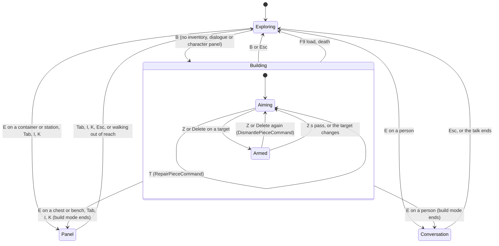

# M7 Parts G and H - Content and asset requirements; UI and controls

Status: design and implementation planning for the M7 team, 2026-09-24. Not an owner ruling. It writes no production code.

Base: origin/main `e10d2c4`, read in the snapshot named in `00_SCOPE_RULINGS.md` §0. Every `path:line` is repo-relative at that commit and was re-read for this document. `docs/PHASE1_HUD_UI_CONTROLS_AND_FEEDBACK_SPEC.md` exists only in the `G:/UNNAMED` working tree. It is labelled **(untracked)** wherever it is cited, and its authority is unconfirmed.

Precedence: `D_cross_system.md` overrides A, B and C, and this document follows D. Where G or H refines a part or D, the refinement is listed in §H.14 and in the structured result. No scope ruling is challenged.

---

## G. Content and asset requirements

### G.0 Verdict

- **M7 needs no asset files.** Every M7 visual is a greybox primitive that presentation builds at run time from authoritative views and content dimensions, in the way `HollowView` builds the hollow (`src/Presentation/Greybox/HollowView.cs:36-54`).
- **No work goes to DeepSeek or to the asset-remediation agent.** Nothing in M7 waits on polished art.
- **`art_bindings.json` gets no `pieces` section in M7.** §G.4 records the future shape as a seam.
- **Factions get no visuals.** Reputation shows as text only (§G.5, §H.7).
- **The new content is 15 definitions plus edits to 7 existing files,** all in slice S2 (§G.6).

### G.1 Rules for M7 visuals

1. **Greybox is the deliverable, not a placeholder that blocks.** A piece is drawn from its `PieceView` parts and bounds, in the domain's own millimetres. No drawing code names a content ID. That keeps the rule "Scripts may name content; the game may not." (`src/Presentation/DeltaShots.cs:23`).
2. **No asset backlog is opened.** The building kit is withheld: its swatch textures show their grey backdrop (`src/Presentation/Art/art_bindings.json:25-31`). The chest and anvil models are withheld as tilted (`:46-47`). Every `_lod` file carries no material (research `presentation_perf.md` §5.2). Waiting on any of these would put M7 on DeepSeek's critical path, and ruling 7's authority does not need them.
3. **Presentation-only data stays out of rules content.** Art bindings "touch no rule, save or content hash" (`src/Presentation/Art/ArtBindings.cs:28-31`). Piece definitions therefore carry no asset field (B §1.2).
4. **Do not touch the files the asset-remediation branch is changing.** At the session start that branch had modified `src/Presentation/Art/ArtLibrary.cs` and `SkinnedModel.cs` (git status). M7 leaves `src/Presentation/Art/**`, `src/Presentation/Audio/**`, `CraftingView`, `ItemsView`, `NpcsView` and `HollowView` unchanged. The helpers M7 needs are copied into its own new files (§G.3.4).

### G.2 The three lists

**REQUIRED TO FUNCTION.** Everything here is code-built greybox in `src/Presentation` (slice S9). No file comes from the asset pipeline.

| # | Item | Why the M7 proof needs it | Form |
|---|---|---|---|
| R1 | Greybox builders for the seven pieces (§G.3) | "Build a structure" must be seen, and the camera must collide with it | `StructuresView` boxes and slabs from `PieceView.Parts` and bounds |
| R2 | A hinged leaf for the piece door, with a camera collider that turns with it | Door use; Kera and Tavar walk "through" | the `HollowView` hinge pattern (`HollowView.cs:219-257`), keyed by the `pce_` value |
| R3 | A draped pad surface | Ruling 2: the floor is drawn on the ground the body stands on, so feet never float or sink (B §6) | a `SurfaceTool` mesh over the domain's own terrain samples |
| R4 | Camera colliders on every solid part, the doorway lintel and the roof slab | Camera doctrine: the camera "cannot pass through walls" and compresses indoors (`docs/CAMERA_PERSPECTIVE_AND_PRESENTATION.md:90-98`, `:76-86`) | a `StaticBody3D` on layer 1 with mask 0 (`HollowView.cs:18`, `:374-381`) |
| R5 | Ghost materials: allowed, unchecked and refused | The placement preview (§H.4.5) | 3 translucent emissive `Palette` materials, on the `Palette.Fold` precedent (`src/Presentation/Greybox/Palette.cs:42-50`) |
| R6 | A highlight overlay for the targeted piece | Taking down and mending need a visible target | 1 `Palette` material, applied through `GeometryInstance3D.MaterialOverlay` (present in GodotSharp 4.7.2) |
| R7 | The build-area outline, shown only in build mode and in F2 | The player must be able to find where building is allowed; there are no markers in normal play | thin strips that follow the terrain, in the F3 ring colour (`HollowView.cs:335`) |
| R8 | The F2 overlay primitives: unwalkable-node quads, route lines, socket markers, piece ID labels, work anchors | The navigation and structure proofs are read from the overlay | `MultiMeshInstance3D`, `ImmediateMesh` and `Label3D` (all present in GodotSharp 4.7.2) |
| R9 | Existing looks reused unchanged | Kera and Tavar are drawn as today (`NpcsView.cs:43-49`). The deadfall uses the wood-node look (`CraftingView.cs:39`). Timber lies on the ground in the existing ground-item look (`ItemsView.cs:58-80`) and has a text-only inventory row | none |

**NICE FOR PRESENTATION.** Code-only. Each item is done only if it is cheap, and none of them gates M7's exit.

| # | Item | Note |
|---|---|---|
| N1 | Interpolate an errand NPC between ticks | `NpcsView` follows the body and does not predict it (`NpcsView.cs:44`). The companion already walks this way, and A §13.7 says no new view code is needed. B §21.3's "interpolated as creatures are" is withdrawn (§H.14) |
| N2 | A damage tint by health band (for example, darker below 50 %) | The F2 view and the target line already show exact health |
| N3 | Indoor footsteps and wood arrow-impact sounds inside player rooms | `SoundEvents` derives "indoors" from wall-ID prefixes and materials from `Layout.Space` (`src/Presentation/Audio/SoundEvents.cs:62-70`, `:445-460`). This is in the remediation area, so it is deferred |
| N4 | Sounds for placing and taking down | Deferred for the same reason |
| N5 | One merged mesh and one trimesh camera collider per structure | Only if the S10 measurement demands it. Per-piece nodes cost about 438 nodes for B's 200-piece RK-06 set (§G.3.5) |

**USE GREYBOX FOR NOW.** Nobody is asked for these in M7.

| Item | Why greybox |
|---|---|
| Timber wall, doorway, roof and floor art (`building_wall_timber`, `building_roof_panel`, `building_floor_planks`) | The kit is withheld (`art_bindings.json:25-31`) |
| The door leaf model on piece doors | Authored doors bind `prop_iron_banded_oak_door` by door key (`art_bindings.json:92-95`). A piece door's key is an instance ID, so binding it would need the `pieces` section, which M7 does not add |
| The chest model | `container_chest_iron_banded` is withheld as tilted (`art_bindings.json:46`) |
| The anvil-bench model | `prop_blacksmith_anvil_stump` is withheld as tilted (`art_bindings.json:47`). The authored anvil station is greybox too |
| A deadfall look (fallen logs) | Presentation picks a node's look by its category segment, and `wood` draws the ash-stand trunks (`CraftingView.cs:39`). A logs look would need a binding field or a model. The prompt still reads "[E] Gather from the Deadfall" through `DisplayName` |
| A timber icon | Only 17 icon keys are bound, and no material item is among them (`art_bindings.json:172-190`). The inventory shows text, as it already does for iron and ash |
| Any faction visual | None exists, and none is needed (§G.5) |

### G.3 The minimum greybox building kit

#### G.3.1 Dimensions (from B §20, local mm at r0; origin at the square centre or edge midpoint)

| Piece (display name, DRAFT) | ID | Blocking parts (collide) | Drawn as | Material | Camera collider |
|---|---|---|---|---|---|
| Timber Pad | `piece.pad.timber` | none | draped surface over [−1500, 1500]², +20 mm above terrain, with a 150 mm skirt | `Palette.Shaft` (0.60, 0.50, 0.36), a lighter wood that reads as floor | none |
| Timber Wall | `piece.wall.timber` | box [−1700, −200, 1700, 200], h 3000 | a box, base at `LowestUnder(part)` − 0.2 m, height 3.2 m | `Palette.Wood` | yes |
| Timber Doorway | `piece.doorway.timber` | jambs [−1700, −200, −800, 200] and [800, −200, 1700, 200], h 3000 | the two jambs as walls, plus a lintel [−800, −200, 800, 200] from +2.4 m to +3.0 m above `LowestUnder(bounds)`. The lintel is drawn only | `Palette.Wood` | yes, lintel included |
| Timber Door | `piece.door.timber` | leaf [−800, −200, 800, 200], h 2400, blocking only while closed | a leaf 1.6 × 2.4 × 0.4 m hung from a hinge node; it swings ±90° | `Palette.Door` | yes, and it turns with the leaf |
| Timber Roof | `piece.roof.timber` | none | a slab 3.0 × 0.2 × 3.0 m whose bottom is at the square's `LowestUnder` + 3.0 m (the wall-top rule) | `Palette.Roof` | yes |
| Storage Chest | `piece.storage.chest` | box [−500, 600, 500, 1200], h 700 | a box, base `LowestUnder` − 0.2 m, top at +0.7 m | `Palette.Leather` (0.35, 0.25, 0.18), next to the authored chest's (0.38, 0.26, 0.14) (`ItemsView.cs:18`) | yes |
| Anvil Bench | `piece.station.anvil` | box [−500, 400, 500, 1000], h 900 | a wood box of the part, plus an iron block 0.62 × 0.24 × 0.26 m centred on top along the long axis. The block is decoration with no collider | `Palette.Wood` + `Palette.Iron` (`Palette.cs:29`) | the bench box only |

The ghost, overlay and outline materials are new `Palette` entries. All of them are translucent, emissive and cull-disabled, and the nodes that wear them cast no shadow:

| Name | Albedo (RGBA) | Use |
|---|---|---|
| `GhostAllowed` | (0.35, 0.85, 0.45, 0.35) | the preview is allowed and navigability is Proven or NotApplicable |
| `GhostUnchecked` | (0.95, 0.75, 0.25, 0.35) | allowed, with navigability NotChecked (a transient, §H.4.5) |
| `GhostRefused` | (0.95, 0.30, 0.25, 0.35) | refused; also the overlay while a take-down is armed |
| `Highlight` | (1.00, 0.95, 0.70, 0.25) | the overlay on the targeted piece |
| `AreaOutline` | (1.00, 0.85, 0.20, 0.35) | the build-area outline (the F3 ring colour, `HollowView.cs:335`) |

Colour is never the only signal. Every ghost state comes with words on the status line (§H.4.5), which meets "colour-independent indicators" (`docs/HUD_INPUT_AND_ACTIONS.md:108-121`).

#### G.3.2 How the builder works (`src/Presentation/Greybox/StructuresView.cs`, new)

The builder follows `HollowView.BuildStructure` (`HollowView.cs:162-200`), with four differences:
- it runs at any time, not only at boot;
- its input is `PieceView`, not a layout `Blocker`;
- it is keyed by the piece's `pce_` value;
- it never rotates a node except a door hinge.

`PieceView.Parts` are already world-axis-aligned integer-mm boxes: quarter turns give exact AABBs (B §0.4). A part is therefore drawn exactly like an authored `BoxBlocker`.

```
StructuresView : Node3D                                   // presentation only; holds no truth
  Dictionary<string pieceKey, Node3D> _pieces; Dictionary<string pieceKey, (Node3D Hinge, float OpenDeg)> _doors
  Sync(Simulation s)            // add every s.Pieces id not built; free every built id not in s.Pieces (the CreaturesView diff pattern)
  SetDoor(string key, bool open) // DoorToggled with a pce_ key; unknown keys are ignored, as HollowView.SetDoor does (:56-60)
  Highlight(string? key, Material? overlay)
  static Node3D BuildPiece(PieceView p, TerrainGrid t, Material? ghost)   // one builder for pieces and the ghost
     family pad      -> Drape(bounds, t)                                   // no collider
     family roof     -> Slab(bounds, LowestUnder(bounds)+3.0, 0.2)         // collider unless ghost
     family door     -> Hinge(p.Parts[0], p.Rotation)                      // collider unless ghost; turns with the leaf
     otherwise       -> foreach part: Box(part)                            // collider unless ghost
                        doorway: + Lintel(bounds); station: + anvil block (no collider)
  Box(part): size = (dx, h/1000 + 0.2, dz); base = LowestUnder(part) - 0.2; MeshInstance3D(BoxMesh) + StaticBody3D{layer 1, mask 0} + BoxShape3D
```

- **`Solid` and `LowestUnder` are copied** into `StructuresView` (6 and 7 lines, `HollowView.cs:374-381`, `:386-392`), not shared through a visibility change. That keeps `HollowView`, which the art integration also touches, byte-identical.
- **When it runs:** `Sync` runs in `Main.Resync()` (`src/Presentation/Main.cs:915-928`) and on every `PiecePlaced`, `PieceRemoved` and `PieceDestroyed`. Events are published after the commit (B §3.4), so the view read inside the handler is current. A destroy cascade publishes several events, and `Sync` is idempotent.
- **The ghost** is the same `BuildPiece` output with the ghost material on every mesh, **no colliders** (the camera must not bump into a preview), and `CastShadow = Off`. It is rebuilt only when the (definition, pose) pair changes; its colour is swapped every frame.

#### G.3.3 The door hinge

- The hinge sits at the leaf's local −X end, R_r(−800, 0) from the anchor, using B's integer maps (B §0.4).
- The leaf's closed direction from the hinge is R_r(+1, 0). Its open direction is R_r(0, +1), the piece's local +Z side, which is the side B's two legal rotations choose.
- Choose θ ∈ {+90°, −90°} so that the closed direction turned by θ equals the open direction. Use `HollowView`'s convention: "+90° about Y turns +Z to +X" (`HollowView.cs:253`). At r0 this gives −90°. Compute θ; never hard-code it per rotation.
- Initial state comes from `PieceView.DoorOpen`, and every later change from `DoorToggled` with the `pce_` key.

#### G.3.4 The pad drape and the build-area outline

- **The drape** is a 13 × 13 vertex grid at 250 mm over the 3 m square, the same lattice B's relief check samples (B §3.3 check 9). Each vertex y is `TerrainGrid.HeightAtMm(x, z) / 1000 + 0.02`. A 0.15 m skirt hangs from the edge vertices. Normals are generated. `HeightAtMm` is the function the body stands on, so the floor never floats or swallows the feet. With 250 mm of relief allowed, the drape reads as a floor, not a ramp.
- **The outline** of each `RegionLayout.BuildAreas` box is drawn as four strips 0.1 m wide, sampled every 1 m along the edge at terrain height + 0.03 m, in `AreaOutline`. It is visible only in build mode and in F2. In normal play nothing is drawn: the charter's no-markers rule stands (`HollowView.cs:331`).

#### G.3.5 Node budget

- Per piece:
  - a wall, roof or chest: 3 nodes (mesh, body, shape);
  - a doorway: 9;
  - a door: 4;
  - a bench: 4;
  - a pad: 1.
- B's RK-06 set (81 pads, 81 roofs, 38 walls) is 81 + 243 + 114 = **438 nodes**. The authored hollow has 44 structures (`docs/M3_STATUS.md:13`), each with 3.
- The GPU cost of greybox is trivial on ASTRAL (GPU p99 0.21 ms, `docs/M6_STATUS.md:85`). The risk is CPU-side and unmeasured on RAZER (`docs/M6_STATUS.md:221`).
- `--build-shots`' 200-piece beat records `Performance.Monitor.ObjectNodeCount` and `RenderTotalDrawCallsInFrame` (monitor names verified in research `presentation_perf.md` §10.6). N5 is the fallback.

### G.4 `art_bindings.json`: no `pieces` section in M7

- **No.** There is nothing to bind: the kit, the chest and the anvil are withheld (`art_bindings.json:25-31`, `:46-47`). An empty section would still need a loader property in `ArtBindings.Load` (`ArtBindings.cs:117-182`), and that code lives in the area the remediation branch is changing.
- **The seam is kept by the builder's shape.** Each part is built by one method. A later `ArtPiece(PieceView, part)` can wrap it exactly as `HollowView.ArtStructure` wraps `BuildStructure`, keeping the greybox collider (`HollowView.cs:135-160`).
- **The future shape is recorded here, not written.** It is a top-level `"pieces"` object keyed by the piece **definition** ID (never a `pce_` value), whose values are `Placement` looks (`ArtBindings.cs:10-11`). For example, `"piece.wall.timber": { "model": "building_wall_timber", "fit": "tile", "material": "wood" }` and `"piece.door.timber": { "model": "prop_iron_banded_oak_door" }`. It is added when the owner releases the fixed kit (D §5.3).

### G.5 Factions need no new visuals

- **Ruling 3 forbids a faction-coloured world in M7.** Nothing may present hostility or legal status: no tier or relation feeds combat, creature minds or attack legality (C §0, §12). A banner, nameplate tint or colour-coded NPC would present standing as a property of the world that everyone can see. That is the "magically global information" ruling 3 excludes.
- **Nothing in M7 has a faction presence to draw.** Membership is static, is not saved and names three existing NPCs (C §10.2). There is no territory, no guards and no war state (scope §4).
- **The proof is textual by design.** The ROADMAP proof is "a reputation fixture table" (`docs/ROADMAP.md:285`), which C generates as `docs/M7_REPUTATION_TABLE.md` (C §17.1). In play, the two gates show up in the world as a dialogue reply that appears and a ware that is listed. The player-facing text is one HUD log line (§H.7), and the debug panel is F6 (§H.8.2).

### G.6 New content (YAML) checklist

All of it is slice **S2** (D §3.2), and each row is owned by the named part. Text marked DRAFT awaits the owner's tone review.

**New definitions (15):**

| # | ID | File | Contents (source) | Part | Lint / test |
|---|---|---|---|---|---|
| C1 | `config.navigation` | `content/config/navigation.yaml` | A §13.3, **minus `work_anchor_max_m`** (D23) | A | NAV001-NAV007 |
| C2 | `config.building` | `content/config/building.yaml` | B §8.4, **minus `navigability_radius_m`** (D22) | B | BLD006 (with D21's module check) |
| C3 | `config.factions` | `content/config/factions.yaml` | C §16.1 | C | FAC001 |
| C4 | `piece.pad.timber` | `content/pieces/pad/timber.yaml` | B §20 row; name "Timber Pad" (DRAFT) | B | BLD001-BLD005 |
| C5 | `piece.wall.timber` | `content/pieces/wall/timber.yaml` | B §1.1 example; "Timber Wall" | B | same |
| C6 | `piece.doorway.timber` | `content/pieces/doorway/timber.yaml` | B §20; "Timber Doorway" | B | same |
| C7 | `piece.door.timber` | `content/pieces/door/timber.yaml` | B §20; "Timber Door" | B | same |
| C8 | `piece.roof.timber` | `content/pieces/roof/timber.yaml` | B §20; "Timber Roof" | B | same |
| C9 | `piece.storage.chest` | `content/pieces/storage/chest.yaml` | B §20; "Storage Chest"; `container: { stack_slots: 12, at_m: [0, 0.9] }` | B | same |
| C10 | `piece.station.anvil` | `content/pieces/station/anvil.yaml` | B §20; "Anvil Bench"; `station: { kind: anvil, work_anchor_m: [0, -0.25], work_facing_deg: 0 }` | B | same |
| C11 | `item.material.timber` | `content/items/material/timber.yaml` | B §8.1; "Rough Timber"; `no_sell: true` | B | ITM, SEM |
| C12 | `resource.wood.deadfall` | `content/resources/wood/deadfall.yaml` | B §8.1; yields 3-4 timber | B | CRF |
| C13 | `node.wood.deadfall` | `content/nodes/wood/deadfall.yaml` | B §8.1; 8 charges, daily, survival 2 | B | CRF |
| C14 | `faction.ashen_hollow.waystation` | `content/factions/ashen_hollow/waystation.yaml` | C §16.2; name "the Waystation" (working name) | C | FAC001 |
| C15 | `faction.ashen_hollow.survey` | `content/factions/ashen_hollow/survey.yaml` | C §16.3; "the Survey" (working name) | C | FAC001 |

**Edits to existing files:**

| # | Where | Edit | Part | Lint / test |
|---|---|---|---|---|
| E1 | `content/regions/ashen_hollow.yaml`, `nodes:` (`:157-159`) | `- { name: deadfall, node_ref: node.wood.deadfall, position_m: [84, 118] }`, plus the M7 `BaselineTransition` in `GameSession` (B §8.2; code, not YAML) | B | WLD010; the M7 transition test |
| E2 | the same file, a new `build_areas:` block after `stations:` (`:161-163`) | `- { key: build_area.hollow_crossing, box_m: [87, 87, 114, 114], max_pieces: 256 }` (B §16.1). It is layout, not a definition, so it adds no ID | B | WLD015, BLD007, BLD008 (D20) |
| E3 | `content/npcs/ashen_hollow/kera_voss.yaml` (after `:12`) | `works_at: [anvil, forge]` (B §15.1) and `faction_ref: faction.ashen_hollow.waystation` (C §16.4) | B, C | BLD005 with D23's 85 m per-axis span; FAC-M1 |
| E4 | `content/npcs/ashen_hollow/renn_vale.yaml` | `faction_ref: faction.ashen_hollow.waystation` | C | FAC-M1 |
| E5 | `content/npcs/ashen_hollow/sel_arien.yaml` | `faction_ref: faction.ashen_hollow.survey`. `tavar_orr.yaml` gets none (FAC-M2) | C | FAC-M1, FAC-M2 |
| E6 | `content/merchants/ashen_hollow/kera_voss.yaml`, appended after `:11` | `- { item_ref: item.material.iron_ingot, count: 3, price_bias: 1.0, requires: { faction_ref: faction.ashen_hollow.waystation, min_tier: accepted } }`. Appended **last**, so the ware refs `#00..#02` keep their indices (C §8.2) | C | R5 and "a gated item in one row"; `tests/Application.Tests/NpcTests.cs:287-307` unchanged |
| E7 | `content/dialogue/ashen_hollow/kera_voss.yaml`, node `again` (`:28`) | reply `armour` before `trade` (`:61`), and node `armour_down` (C §16.5). DRAFT text | C | R3, R4 |
| E8 | `content/dialogue/ashen_hollow/sel_arien.yaml`, node `again` (`:30`) | replies `notes` and `armour`; nodes `notes` and `armour_down`; a `report_act` consequence on both `tavar_back` replies (`:21-27`, `:57-65`) (C §16.5). DRAFT text | C | R1, R3, R4 |

**Tests that change because content changed:**
- `LoadAll_Loads_Yaml_Files` (`tests/Content.Tests/ValidationTests.cs:508-547`) gains exactly C1-C15. Whichever content slice lands last reconciles the list (D §2.9).
- `KnownDirectories_Is_Closed_Set` gains `pieces` (B §19.1).

**Test-only content** (never shipped; listed so nobody puts it in `content/`):
- **S4:** the writer pack `Fixtures/content-0.1.7` and the fixture pack 0.2.8 → 0.2.9, whose `_aliases.yaml` carries `piece.fixture.old_wall: piece.fixture.wall` and `faction.fixture.delvers: faction.fixture.diggers`, plus `npc.fixture.smith` (D §1.5 item 8).
- **S6:** the hand-built fixture factions `faction.fixture.keepers` and `faction.fixture.delvers` inside `ReputationTableTests` (C §17.1).
- **S7:** the building refusal test packs through the `EditedContent` harness: a steep area, a rock in the area, an area over a spawner, and `max_pieces: 3` (B §22).

**Consequences:**
- Every row moves `content_hash`, which is not a generation input (research `content_registry.md` §6.3).
- Only E1 moves the world-generation fingerprint, because fixed nodes enter the generator (B §8.2). That is why it carries the one M7 baseline transition.
- E2 is layout and needs no transition (B §16.1).

### G.7 Words, not IDs, on every M7 surface

M6 fixed an ID slip "against the no-IDs rule" (`docs/M6_STATUS.md:156`). Some authoritative reasons M7 inherits still contain definition IDs. B's materials refusal uses the crafting wording, "needs {count} {itemId}" (`src/World/Runtime/Crafting.cs:188`).

- **The rule.** Presentation passes every M7 reason it shows (ghost status line, command-rejection toasts) through one helper, `Main.Words(string)`. Each whitespace-separated token for which `GameSession.DisplayName(token) != token` (`src/Application/GameSession.cs:162`) is replaced by the display name. The helper is generic and names no content.
- **Where it applies.** The five new commands and the M7 status lines. Existing Phase-1 toasts are left alone; that is scope discipline.
- **The one reason `Words` cannot fix.** Check 10's example, "that would build over rock_well" (B §3.3), names a region blocker's local ID, which has no display name. It is unreachable in shipped content, because BLD007 keeps the area clear of authored structures. B changes it to a words-only reason (§H.14).

---

## H. UI and controls

### H.0 Decisions at a glance

| # | Decision |
|---|---|
| H1 | **Build mode is a presentation mode, toggled with B.** Every build action is a direct key; there is no radial and no pointer-driven menu (ruling 5; bible `docs/PHASE1_ASHEN_HOLLOW_PLAYABLE_CONTENT_BIBLE.md:645`, which names "building function") |
| H2 | In build mode: **1-7** choose a piece, **PageUp/PageDown** cycle, **R** turns, **left mouse** places, **Z or Delete** takes down (press twice), **T** mends, and **B or Esc** leaves. **E** is unchanged |
| H3 | **Y** asks the focused NPC to work at your nearest eligible station, or lets them go. It works in and out of build mode |
| H4 | **Build mode does not pause** the simulation |
| H5 | **The ghost is advisory.** Its colour and words come only from `Simulation.PreviewPlacement`. The authority's refusal arrives as a toast |
| H6 | **The camera cap rises from 6 m to 9 m in build mode, and nothing else about the camera changes** |
| H7 | **Build mode suppresses exactly the combat inputs:** attack, guard, casts and dodge |
| H8 | **M7 builds no player-facing faction screen.** The HUD log line on reported changes, F6 and the generated table are enough for the proof |
| H9 | **F2** is building debug, and pressing it again adds the navigation overlay. **F6** is faction debug. Both are listed in F1 under DEVELOPER |
| H10 | **Every new action is a named `InputMap` action.** That is the controller-parity seam; no gamepad bindings are built |

### H.1 Principles

1. **Presentation writes nothing.** Every M7 action submits a `GameCommand` through `GameSession.Submit`. The ghost, the target, the eligibility of a worker prompt and the build-area hint are views over immutable reads (`docs/DECISIONS.md:234`). The architecture scan must stay green (`tests/Architecture.Tests/ArchitectureTests.cs:163`).
   - No presentation identifier may contain the literal `.Step()`. A build-mode "step" helper must be named otherwise.
   - D's new guards bind M7 presentation too:
     - G4 `PresentationUsesNoPhysicsQueries`: the aim is a terrain march in C# (§H.4.3);
     - G2 `PresentationSource_NeverDerivesStanding`: F6 uses no `FactionRules`, `StandingLadder`, `TierOf(` or `.Ladder.`.
2. **One validator.** Colour and words come from `PreviewPlacement`, which calls `BuildingRules.Validate`, the function the command runs (D §1.2). Presentation never decides that a placement is legal.
3. **Perspective-neutral.** Building works the same at every camera distance, including first person. Commands carry a discrete pose and no camera state, so `Commands_CarryNoCameraState_SoEveryPerspectiveSubmitsTheSameThing` (`tests/Application.Tests/SessionTests.cs:163`) stays green.
4. **Take only the keys needed.** Build mode claims keys only while it is on, and only keys whose normal meaning is off or harmless then (§H.3). That is the model the dialogue branch uses for 1-9 (`Main.cs:374-383`).
5. **Players read words.** Every refusal is shown as words (§G.7). Colour always comes with text.

### H.2 Key table (every M7 action)

Bindings are added in `Main.DefineInput` (`Main.cs:1061-1104`) with `PhysicalKeycode`, as today. All keys used are free today (`Main.cs:1070-1103`; research `presentation_perf.md` §2.2). The Godot key names were checked in GodotSharp 4.7.2: `Key.B`, `Key.T`, `Key.Y`, `Key.Z`, `Key.Delete`, `Key.Pageup`, `Key.Pagedown`, `Key.F2`, `Key.F6`, `Key.Key1`..`Key.Key7`.

| Action | Key(s) | Active when | Effect | Submits |
|---|---|---|---|---|
| `build_mode` | B | not a scripted run; no inventory, dialogue or character panel visible; the build catalogue is not empty | enter or leave build mode | - |
| `build_piece_1` .. `build_piece_7` | 1 .. 7 | build mode | select the n-th piece in the build order (§H.4.2) | - |
| `build_piece_next` / `build_piece_prev` | PageDown / PageUp | build mode | cycle through all pieces, wrapping (beyond 7 too) | - |
| `build_rotate` | R | build mode | rotation := (r + 1) mod 4 (clockwise, B §0.4) | - |
| `build_place` | Left mouse | build mode, mouse captured, a pose exists | place the ghost's pose | `PlacePieceCommand(player, defId, x, z, r)` |
| `build_dismantle` | Z, Delete | build mode, a target exists | the first press arms for 2 s; a second press on the same target submits | `DismantlePieceCommand(player, pieceId)` |
| `build_repair` | T | build mode, a target exists | mend it | `RepairPieceCommand(player, pieceId)` |
| `release_mouse` (existing) | Escape | build mode: leave build mode; the mouse stays captured. Otherwise unchanged (`Main.cs:381-382`, `:489-490`) | - | - |
| `interact` (existing) | E | as today (`Main.cs:411-440`) | a piece door toggles; a piece chest or bench opens its panel (which ends build mode) | `InteractCommand`, or the panel's own commands |
| `work_order` | Y | no modal panel; an NPC in focus (§H.5) | ask to work, or let go | `AssignWorkerCommand` / `ReleaseWorkerCommand` |
| `build_debug` | F2 | not a scripted run | cycle Off → Structures → Structures + Navigation → Off | - |
| `faction_debug` | F6 | not a scripted run | toggle the faction panel | - |

- **Why Z and Delete.** Delete is the obvious remove key (B §21.3). Z keeps the action under the left hand. The two-press arm makes a slip cost nothing.
- **Why no confirmation on T.** Mending is refused at full health, and it spends only what repair costs.
- **Why no mouse wheel for pieces or rotation.** The wheel stays zoom everywhere (`Main.cs:350-355`), so the collision research `presentation_perf.md` §2.2 flagged never arises.

### H.3 Existing keys in build mode

| Existing binding | Outside build mode | In build mode | Why |
|---|---|---|---|
| Left mouse `attack` (`Main.cs:386`) | swing or shoot | **place**; attack is suppressed | the one pointer button; `swing` becomes `captured && !build` |
| Right mouse `guard` (`:385`, `:400-402`) | guard, or aim the bow | suppressed | keeps the bow reticle and aim line (`Main.cs:514-538`) off the build screen |
| C `dodge` (`:403-407`) | dodge | suppressed | combat inputs are off as a set; B or Esc brings them back in one press |
| 4-6 `cast_n` (`:387`) | formulas | **pieces 4-6**; casts suppressed; the formula tiles are hidden (`SetMagic` gets an empty list while building, `Main.cs:603-606`) | shared keys |
| 1-9 `reply_n` (`:374-380`) | answer, only in dialogue | 1-7 pick pieces | never both: a conversation ends build mode |
| R `take_all` (`:461-462`) | only with the inventory panel visible | **rotate** | never both: the inventory panel ends build mode |
| Mouse wheel (`:350-355`) | zoom 0-6 m | zoom 0-9 m (§H.4.8) | camera doctrine |
| Q, V, WASD/arrows, Shift, Ctrl, Space, X, H, G | unchanged | unchanged | movement, perspective, jump, crouch, salve and companion order stay useful while building |
| E `interact` | interact | unchanged; anything that opens a panel or a conversation ends build mode | one rule, no special cases |
| Esc `release_mouse` | free the mouse; in dialogue, leave | **leave build mode first**; the next Esc frees the mouse | cancel, as expected |
| Tab/I, K | inventory, character (both free the mouse, `:450-456`, `:463-469`) | the panel opens and build mode ends | a panel and a captured-mouse mode cannot share the screen |
| J, F1, F3, F4, F2, F6 | overlays | unchanged; the mouse stays captured (`:470-484`) | overlays, not panels |
| F5 / F9 | save / load | save unchanged; a load ends build mode (`Resync`) | state is replaced |
| LMB with the mouse free and no panel (`:356-359`) | recapture | cannot happen: entering build mode captures the mouse, and Esc leaves build mode before it frees the mouse | - |

A note on the unbuilt 8-slot hotbar (bible `:572-589`; HUD spec §3, untracked): when it arrives, build mode keeps overriding the digits while it is on, as dialogue does. No conflict.

### H.4 Build mode

#### H.4.1 State and lifecycle (`src/Presentation/Player/BuildMode.cs`, new; presentation only)

```
BuildMode
  Active; Slot; Rotation                 // Slot and Rotation are remembered across entries (per session, not saved)
  ArmedKey; ArmedUntil                    // the take-down confirmation
  Asked: (defId, x, z, r, revision, atSeconds, PlacementPreview) or null   // the last full preview (navigability asked)
  ScriptedAim: (xMm, zMm)?                // --build-shots override, the UiShots Viewpoint precedent
Enter(): Active = true; capture the mouse; camera.Cap = BuildMaxDistance; show the panel, outlines and reticle
Exit():  Active = false; hide ghost, panel, outlines and highlight; clear ArmedKey; camera.Cap = MaxDistance
         (TargetDistance = min(TargetDistance, MaxDistance))
```

**Exit triggers** (checked at the top of `ReadInput`, before the combat gating):
- B or Esc;
- the inventory, dialogue or character panel becomes visible;
- `PlayerDied` (`Main.cs:856-863`);
- `Resync` after a load;
- a scripted mode taking over.

B is ignored while one of those panels is visible. If the content has no pieces (a test pack), B shows the toast "Nothing to build with here" for 2 s.

#### H.4.2 Piece order

- **Order:** by family, in the closed order `pad, wall, doorway, door, roof, storage, station` (B §1.1's enum: code knows family keys, never content IDs), then by definition ID (ordinal).
- **Source:** the definitions come from `GameSession.Setup.Building.Catalog` (D §2.9's `SimulationSetup.Building`).
- **The M7 keys:**
  - 1 Timber Pad;
  - 2 Timber Wall;
  - 3 Timber Doorway;
  - 4 Timber Door;
  - 5 Timber Roof;
  - 6 Storage Chest;
  - 7 Anvil Bench.
- **More than 7 pieces:** digits reach the first 7, and PageUp/PageDown reach everything. The production catalogue (§H.13) replaces this list.

#### H.4.3 Aim (presentation-only floats; only the snapped integer pose leaves presentation)

```
GroundAim(camera, terrain, body):
  from, dir = camera.Camera.ProjectRayOrigin(centre), ProjectRayNormal(centre)   // Camera3D methods, not physics queries (G4)
  march t = 0 .. 20 m in 0.25 m steps; first t where (from + dir*t).y <= HeightAtMm(x, z)/1000 -> bisect 8 times
  hit ? (x, z) : body + GroundForward * 3 m        // looking up still leaves a ghost in front of you
aimMm = (round(x*1000), round(z*1000))
pose  = Snapper.Snap(catalog, sim.Pieces.Select(ToPiecePose), defId, aimMm.x, aimMm.z, Rotation)   // Domain, pure (B §5.2)
```

- The centre ray is the build reticle: `Hud.SetCrosshair(true)` in build mode at every distance (`Main.cs:571` today shows it only in first person).
- `ToPiecePose` maps `PieceView` to `PiecePose` (B §5.2).
- A `null` pose happens only for a door with no free doorway within 2 m. The ghost is then hidden, the status line reads "{Timber Door}: aim at a doorway to hang it", and LMB does nothing.

#### H.4.4 Per-frame loop

```
BuildFrame(sim, setup, camera, body, now):
  def  = Order(setup.Building.Catalog)[Slot]
  pose = Snap(...); if pose is null -> hide ghost; status(door hint); goto target
  askNav = Asked is null || pose != Asked.pose || sim.StructureRevision != Asked.revision || now - Asked.at >= 0.5 s
  p = sim.PreviewPlacement(def.Id, pose.X, pose.Z, pose.R, checkNavigability: askNav)      // checks 1-14 every frame; 15 when asked
  if askNav: Asked = (def.Id, pose, sim.StructureRevision, now, p)
  tone =  !p.Allowed                                                   -> Refused, reason p.Reason
          p.Navigability is Proven or NotApplicable                   -> Allowed
          Asked matches (def, pose, revision) && Asked.p.Navigability == Refused -> Refused, reason Asked.p.Reason
          Asked matches && Asked.p.Navigability is Proven             -> Allowed
          otherwise                                                   -> Unchecked
  ghost.Show(def, p, tone); hud.SetBuild(panel, StatusLine(def, p, tone), tone)
target:
  t = Target(sim, camera, body, aim); structures.Highlight(t, t == ArmedKey && now < ArmedUntil ? GhostRefused : Highlight)
  input: LMB -> if pose: controller.Place(def.Id, pose)          // always submitted; the authority decides (§H.4.6)
         Z/Delete -> if t: (ArmedKey == t && now < ArmedUntil) ? controller.Dismantle(t) : arm(t, now + 2 s)
         T -> if t: controller.Repair(t)
```

- **Cost.** Checks 1-14 cost microseconds (B §3.3). The navigability check (≤ 2 ms median, ≤ 10 ms worst, D §1.2) runs when the pose or the revision changes, and at most every 0.5 s otherwise. The 0.5 s refresh picks up moved bodies, which are protected points (D §1.2). Between two asks, the cached verdict for the same pose and revision stands in. So amber shows only when nothing has been asked for this pose yet, which in practice is less than a frame.
- **Isolation.** The preview writes nothing, so a UI run and its replay agree (D G7 and B's H4 guard).

#### H.4.5 The ghost and its words

| Tone | Material | Status line (under the interaction prompt) |
|---|---|---|
| Allowed | `GhostAllowed` | "{Name}: can be built here - {n} {Material} ({carried} carried)", from `p.Cost` (`CostView(ItemId, Count, Carried)`, B §4) |
| Unchecked | `GhostUnchecked` | "{Name}: will be checked when placed - {cost}" (B §4 item 5's wording) |
| Refused | `GhostRefused` | "{Name}: {Words(reason)}", for example "Timber Wall: that would cut Kera Voss's work place off" or "Timber Doorway: you may only build inside a build area" |

- **Outside every build area:** the panel footer adds "The nearest build area is {d} m to the {compass word}". It uses 8 compass words computed from `Setup.Layout.BuildAreas` and the body. These are text directions, never a marker, on the journal's precedent (`src/Presentation/Ui/JournalPanel.cs:12-14`).
- **Materials:** the list rows show each definition's cost (content data). Only the selected piece shows "carried", taken from the authority's `CostView`, so presentation re-implements no stack rule.

#### H.4.6 Placing, and invalid-placement feedback

- **LMB always submits `PlacePieceCommand` with the ghost's pose, even when the ghost is red.** The authority is the only judge (D-11). The ghost may be up to a tick stale. The refusal comes back as `CommandRejected` and is toasted as `Words(reason)` for 3 s, the existing pattern (`Main.cs:662-670`). The same words are already on the status line, so a player who clicks on red sees the reason confirmed, not contradicted.
- **Nothing is toasted on success.** The ghost's pose becomes a piece within the frame (commands drain in the frame they are read, `docs/M3_STATUS.md:51`), and the carried count in the status line drops.
- **The five new commands join a `CommandRejected` filter:** `PlacePieceCommand`, `DismantlePieceCommand`, `RepairPieceCommand`, `AssignWorkerCommand` and `ReleaseWorkerCommand`. Without the filter their reasons never reach the player (research `presentation_perf.md` §1.4).

#### H.4.7 Target, take down, mend, doors

**Target rule** (presentation only; it picks what to highlight, and the command names the piece):
1. Candidates are the pieces whose bounds lie within `place_reach_mm` of the body, measured from the body to the nearest point of the bounds. This is B's reach rule, used for display only, on `FocusOn`'s precedent of applying "the rule the simulation applies" (`src/Presentation/Player/PlayerController.cs:177-180`).
2. Among candidates with blocking parts, take the first part that the segment from the body along `GroundForward`, of length reach, enters. A door is tested by its closed leaf box whether it is open or not. Ties: a door beats its doorway, then the lower piece ID.
3. With no such part, take the roof, and then the pad, on the lattice square that contains the aim point.

**The target line** (under the status line):
- "{Name} {health}/{max} - [T] mend   [Z] take down". The health is the player's own property, and the mend cost depends on it.
- While armed: "Press Z again to take down the {Name}".

**Results come from events** (§H.6). Refund and repair costs are not previewed: that would copy B's rounding rules into presentation. `PieceRemoved.Refund` reports the refund after the fact.

**Doors** are worked with E, in and out of build mode:
- `PlayerController.FocusOn` adds piece doors, each measured to its closed leaf box with `DistanceTo`, as authored doors are (`PlayerController.cs:186-190`).
- The prompt is "[E] Open the Timber Door" or "[E] Close the Timber Door". `IsOpen` reads `_open`, which `Resync` also fills from the piece doors (`:57-58`) and `OnDoorToggled` keeps current (`:67`).
- The authority refuses a close while a body stands in the leaf. That refusal is toasted, because `InteractCommand` is already in the filter (`Main.cs:664`).

#### H.4.8 Camera limits

- **`CameraRig` change.** `CameraRig.MaxDistance` stays a `const` 6 m: `PerfRun` reads it statically (`src/Presentation/Perf/PerfRun.cs:56`), so B's plan to turn it into an instance field (B §21.3) would break the build. `CameraRig` gains:
  - `public const float BuildMaxDistance = 9f`;
  - an instance `public float Cap { get; set; } = MaxDistance`.
  `Zoom` then clamps to `Cap` (`src/Presentation/Player/CameraRig.cs:85`).
- **In build mode** the cap is 9 m ("a somewhat farther camera ... Camera distance must remain bounded", `docs/CAMERA_PERSPECTIVE_AND_PRESENTATION.md:266-272`). Entering does not move the camera: manual zoom always overrides (`:320-332`). Leaving clamps `TargetDistance` back to 6 m, and the existing lerp eases it in (`CameraRig.cs:109-124`).
- **Unchanged:**
  - the pitch clamp (`:79-83`);
  - the spring arm and its collision on layer 1 (`:73-75`); the new camera colliders mean it compresses inside a player-built room exactly as in the lodge;
  - there is no detached, free or top-down camera.

At 9 m and a pitch of −1.35 rad the camera stands about 8.8 m above the eye. That frames a 3 × 3 module workshop without scouting over the ravine rim.

#### H.4.9 Does build mode pause? No.

1. Nothing pauses today: `_session.Frame` runs every frame whatever is open (`Main.cs:305`). Time scale is "debug/pause only" in the architecture (`docs/WORLD_ARCHITECTURE.md:249`), and no such mechanism exists.
2. Build mode is not a menu. The player walks, looks and places in the world, with direct keys and no browsing screen. The accessibility draft (untracked) asks for pause "in menus where technically appropriate unless a specific system intentionally remains live" (`G:/UNNAMED/docs/DIFFICULTY_ACCESSIBILITY_AND_PLAYER_CUSTOMIZATION_DRAFT.md:193`). A live world is what building in the world means.
3. The proof needs the world live. Kera walks and the companion paths while the player builds and waits (B §11 steps 6 and 9-10).
4. A pause would let creatures freeze while walls go up, and it would need a presentation-driven stop of `Frame`. A spawner-protected build area (BLD007) already keeps M7 building out of fights.

### H.5 Assigning and releasing the worker (Y)

```
WorkOrder(sim, setup, focus):                                   // Y pressed, no modal panel
  if focus is not an NPC: toast "No one to ask" (2 s); return
  npc = focus.Key
  if sim.WorkAssignments has npc with phase to_work|at_work -> controller.Release(npc); return
  works = setup.Social.Npcs[npc].WorksAt                         // B §15.1 field
  station = sim.Pieces.Where(family station, Owner == player, WorkerNpcId == null)
               .OrderBy(kind(p) ∈ works ? 0 : 1).ThenBy(distance to body).ThenBy(id).FirstOrDefault()
  station is null ? toast "You have no workplace for anyone to work at" : controller.Assign(npc, station.Id)
```

- **The authority decides; presentation only chooses what to name.** B §15.2 has 10 refusals, including talk reach, "Kera Voss does not work an anvil" and "Kera Voss cannot get there". Presentation still submits when the kind does not match, so the authority's words explain the refusal.
- **The prompt** (added to the NPC prompt, `Main.cs:582-583`):
  - "[E] Talk to Kera Voss   [Y] Let Kera Voss go home" when she works for you;
  - "... [Y] Ask Kera Voss to work at your Anvil Bench" when `WorksAt` is non-empty and a matching owned, unmanned station exists.
  - There is no Y prompt for NPCs without `works_at`, or for a downed companion.
- **Asking is in person.** Focus uses `FocusOn`'s NPC rule, which is talk reach (`PlayerController.cs:204-207`) and matches B's refusal 5.
- **Kera stays a trader while working** (D12). E on her at the bench opens her conversation. The trade panel anchors to her body at that moment (`src/Presentation/Ui/InventoryPanel.cs:90-95`), and D27 stops her while her conversation is open.

### H.6 Event feedback

| Event (publisher) | HUD response |
|---|---|
| `PiecePlaced` | none; `StructuresView.Sync` draws it |
| `PieceRemoved` | toast 3 s: "Took down the {name}: +{n} {material}" from `Refund`, or "Took down the {name}" |
| `PieceDestroyed` | log "The {name} is destroyed". For the storage family it adds "; what it held lies on the ground" |
| `PieceDamaged` | log "You strike the {name} ({health}/{max})". It stands in for the missed swing the melee rule no longer reports (B §13.1) |
| `PieceRepaired` | toast 2 s "Mended the {name}" |
| `DoorToggled` with a `pce_` key | the leaf swings (`StructuresView.SetDoor`) and `PlayerController._open` updates. The existing handler (`Main.cs:642-646`) gains one call |
| `WorkerAssigned` | toast 4 s "{npc} will work at your {name}" |
| `NpcArrivedAtWork` | log "{npc} is at your {name}" |
| `WorkerReleased` | toast 4 s "{npc} heads home", plus " (the {name} is gone)" when the reason is `dismantled` or `destroyed`. The name is read from `sim.Pieces`, falling back to "the workplace" |
| `NpcReturnedHome` | log "{npc} is home" |
| `StructuresChanged`, `NavigationRebuilt`, `RoutePlanned` | F2 only |
| `ActRecorded`, `FactionLearned` | F6 only; silent in the HUD |
| `ReputationChanged` with `Source == "reported"` | log line (§H.7) |
| `ReputationChanged` with `Source == "witnessed"` | silent |
| `CommandRejected` for the five new commands | toast 3 s `Words(reason)` |
| `CommandRejected` for `BuyCommand` (the billet gate) | the existing toast (`Main.cs:780-784`): "Kera Voss will not sell you that" |

Names come from `DisplayName(defId)` (`GameSession.cs:162`). A piece's name is found through its `DefId` in `sim.Pieces`. No ID is ever shown.

### H.7 Reputation UI: no player-facing faction screen in M7

**Decision.** M7 builds no faction screen, journal section or HUD standing widget. The player-facing surface is:
1. **One HUD log line per reported change.** On `ReputationChanged` with `Source == "reported"`: "{Faction}: {tierTo} ({±delta}), told to {npc}", for example "The Survey: wary (-100), told to Sel Arien".
   - It uses the style of the existing relationship log line, which already shows signed deltas (`Main.cs:778-779`).
   - The faction name is its content `name` with its first letter capitalised. The tier word arrives in the event, so nothing derives it (G2).
   - The NPC comes from a `Via` field that C adds to `ReputationChanged` (§H.14). Until then, presentation pairs the line with the `FactionLearned` of the same faction and act, which C publishes just before it (C §15).
2. **The gates as they are met in the world.** Sel's `notes` reply is offered or hidden, and Kera's billets are listed or not, with a worded refusal on a direct buy.
3. **F6 and the generated `docs/M7_REPUTATION_TABLE.md`** for the developer and the owner.

**Why this is enough, and why a screen would be wrong now:**
- **What ROADMAP asks for.** The proof is "Playable build; ... a reputation fixture table", and the exit is "the same act moves two factions in opposite directions **in a fixture**" (`docs/ROADMAP.md:284-285`). Neither needs a screen.
- **Ruling 3.** A screen of true standing would show changes the character cannot know about: witnessed changes are deliberately silent (C §15). An honest screen needs a model of what the character knows about standing, which M7 does not build. It is the reputation form of "Maps reflect character knowledge, not database truth" (HUD spec §15, untracked).
- **What the HUD is for.** The HUD "should show what the player needs to act" (HUD spec §1, untracked). In M7 the only actionable consequences are the two gates, and both show in the world.
- **Where a screen belongs.** The charter lists "factions" among the screens to provide (`docs/PROJECT_CHARTER.md:976-987`). The vertical slice is where reputation becomes a *choice* between two opposed factions, with five visible effects (`docs/VERTICAL_SLICE.md:94-95`, `:169`). The screen belongs to M9, knowledge-limited, with tier words and no points.
- **Risk.** A screen invites tier logic in presentation, which D's G2 guard makes a build failure.

### H.8 Debug views

Both panels follow `QuestDebugPanel`:
- a `CanvasLayer` with a `PanelContainer` at (40, 130) and a minimum width of 1100 (`JournalPanel.cs:84`);
- plain `Label` text;
- a redraw at most 4 times a second (`JournalPanel.cs:90-100`).

Both are DEVELOPER keys, available in the playtest build like F3 and F4. IDs are allowed there, since the HUD spec's debug layer keeps "persistence IDs" (untracked, §19).

#### H.8.1 F2: structures, then navigation (a refinement of D31)

**Stage 1, Structures.**

The text panel (`src/Presentation/Ui/StructureDebugPanel.cs`, new):

```
STRUCTURES (F2; again: + navigation)          tick 4410
revision 19   pieces 19   build_area.hollow_crossing 19/256   audit: clean
last change: placed x 99.80-101.20 z 98.80-99.20 (tick 4410)
ghost: piece.wall.timber (100.500, 96.000) r0 -> refused Navigability: that would cut Kera Voss's work place off [nav Refused, asked tick 4402]
target: PCE_...QX4 piece.wall.timber ex:33:35 (103.500, 105.000) r0 owner you health 190/200
pieces within 12 m: id, def, anchor, r, owner, health, door, container, station, worker   (by ID)
work: npc.ashen_hollow.kera_voss at_work PCE_...A11 anchor (100.750, 103.500) 270.000
```

- Sources: `Simulation.StructureRevision`, `Pieces`, `StructureAudit` and `WorkAssignments` (D §2.6), and `Setup.Layout.BuildAreas`.
- The last `StructuresChanged` is kept from the subscription. The ghost line comes from `BuildMode.Asked`.
- The slot key comes from Domain's pure `Lattice` (B §3.2).

The world markers, under a hidden `Node3D`:
- each intact provider socket as a 0.15 m cube: `edge` green, `square` blue, `door` orange. Positions come from the definition plus Domain's `QuarterTurn`, which are pure functions;
- the last 6 ULID characters as a `Label3D` over each piece within 12 m;
- each work anchor as a disc with a facing tick;
- the build-area outlines;
- the last change rectangle.

**Stage 2, + Navigation** (A §13.7's list):
- **The unwalkable nodes.** Person-unwalkable nodes within 24 m of the character are drawn as a `MultiMesh` of flat 0.25 m quads at terrain + 0.05 m.
  - They come from `Simulation.Navigation.Grid.Walkable(i, j, person, gateOpen)` (A §13.1-13.2, `NavigationView`).
  - They are rebuilt on `NavigationRebuilt`, after a 2 m move of the character, and at most twice a second. A 24 m radius is at most 36,864 node tests.
- **Gates** from `Navigation.Gates`, drawn over their footprints: closed in red, open in green.
- **Each mover's route corners** from `Navigation.Movers` as an `ImmediateMesh` polyline at +0.3 m, with the companion's trail marks.
- **The text panel gains:**
  - each mover: status, goal, corner count, planned tick, `Blocked`;
  - the last `RoutePlanned` per mover;
  - the last `NavigationRebuilt` (tiles, nodes, reason);
  - `NavCounters`: builds, rebuilds, nodes restamped, plans by outcome, the maximum expansions of one query, edit checks and refusals by rule.

**Why a two-stage cycle and not D31's "overlay while F2 is on".** Up to 37k quads bury the pieces being inspected. One key and one F1 line keep D31's key assignment.

#### H.8.2 F6: factions

Text only (`src/Presentation/Ui/FactionDebugPanel.cs`, new):

```
FACTIONS (F6)                                                      tick 17010
the Waystation  faction.ashen_hollow.waystation   100  accepted (1)   seat location.outpost
   members Renn Vale, Kera Voss   relations: the Survey cordial
the Survey      faction.ashen_hollow.survey          0  neutral (0)    seat location.outpost
   members Sel Arien               relations: the Waystation cordial
ACTS 2 / 256
 #1 creature_killed creature.construct.animated_armour r_0_0:c_00_00 (65.0, 34.0) tick 9120
    the Waystation  reported via npc.ashen_hollow.kera_voss  identified  +100  tick 9800
    the Survey      reported via npc.ashen_hollow.sel_arien  identified  -100  tick 17010
 #2 switch_set world.foldscar.steadied ...
GATES (as the authority lists them now)
 merchant.ashen_hollow.kera_voss  item.material.iron_ingot  requires faction.ashen_hollow.waystation level >= 1  -> on offer: 3
LAST FACTION EVENTS (8)
 17010 ReputationChanged the Survey 100 -> 0 (accepted -> neutral) reported
```

- **Sources:** `Simulation.Factions` (`FactionView`) and `Simulation.Acts` (`ActView` with `Known`), which are C's get-only views (C §15).
- **The service gate** is shown from `Simulation.Wares(npcId)`, an allow-listed method (`ArchitectureTests.cs:112-131`). The panel counts the gated item on offer, and lists the requirement from the merchant's stock row as the raw level in `StandingRequirement`. It is labelled "on offer", not "open": a sold-out row also reads 0.
- **The dialogue gate is not evaluated in presentation:** that would repeat the rule G2 forbids. It is observed in the conversation, and its requirement is readable in F4's `DescribeCondition` arm (C §8.1).
- **The event list** is a ring buffer of `ActRecorded`, `FactionLearned` and `ReputationChanged`, kept from subscriptions. It is display-only.

C §15's "both gate states" is amended to this (§H.14).

F3 is unchanged. F7, F8 and F10-F12 stay free.

### H.9 F1 (HelpPanel) entries

`HelpPanel.Sections` gains a **BUILDING** section after ACTING. `LeftSections` goes from 3 to 4 (`src/Presentation/Ui/HelpPanel.cs:14-40`, `:48`).

| Row | Actions (read from the input map, `:104-113`) | Shown as |
|---|---|---|
| Build mode, on or off | `build_mode` | B |
| Choose a piece | `build_piece_1`, `build_piece_7` | 1 - 7 (the existing `_1` range rule) |
| Next or previous piece | `build_piece_next`, `build_piece_prev` | PageDown PageUp |
| Turn the piece | `build_rotate` | R |
| Place it | `build_place` | Left mouse |
| Take down what you face (press twice) | `build_dismantle` | Z or Delete |
| Mend what you face | `build_repair` | T |
| Leave build mode | `release_mouse` | Escape |
| Ask someone to work at your bench, or let them go | `work_order` | Y |

`Developer` gains two rows (`:42-45`):
- "Building debug (again: the navigation grid)": `build_debug`, shown as F2;
- "Faction debug": `faction_debug`, shown as F6.

**Fit.** The left column becomes 30 rows (MOVING 6, LOOKING 5, ACTING 8, BUILDING 10, and the title) and the right 20. At 17-18 px that fits below y = 110 at 1080p. It is verified by an F1 still in `--build-shots` (§H.12), because F1's "cannot drift" claim covers keys, not rows (research `presentation_perf.md` §2.2).

### H.10 Screen flow



- **Overlays** (F1, F2, F3, F4, F6, J) may be on in any state. **Y** acts in Exploring and Building.
- **A typical run:** B at the crossing shows the panel, the area outline and a ghost. A digit and R set the piece, and the status line says whether it can be built and why not. Aiming at a built piece offers T and Z; E works the door. B leaves; Y, facing Kera at the smithy, sends her to the bench, and toasts follow her there and back.

### H.11 The controller-parity seam

- **Every build action is a named `InputMap` action; nothing polls a raw key.** A gamepad later adds `InputEventJoypadButton` or `InputEventJoypadMotion` events to the same actions in `DefineInput`. Suggested mappings: `build_mode` on a d-pad button, piece next and previous on the shoulders, `build_place` on the right trigger, `build_dismantle` as a hold. None is built (`docs/M3_STATUS.md:86`; `docs/M6_STATUS.md:182`).
- **No action needs a pointer.** Aim is the camera centre, so a stick-driven camera works unchanged. The build panel is display-only, and nothing in it is clicked.
- **Cycling means a pad needs no digits.** PageUp and PageDown reach every piece.
- **An optional radial, when someone builds one, only mirrors these actions** (bible `:645`, `:656-668`). It is never the controller's only path, which resolves the soft wording of `docs/HUD_INPUT_AND_ACTIONS.md:36` in the bible's favour.

### H.12 Presentation change map (slice S9), guards and runtime proof

| File | Change |
|---|---|
| `src/Presentation/Main.cs` | <ul><li>`DefineInput` gains the 17 new actions of §H.2.</li><li>`ReadInput`: the build branch (exit triggers, then B, digits, PageUp/PageDown, R, LMB, Z/Delete, T); `captured && !build` for attack, guard, casts and dodge (`:384-407`); Esc precedence (`:489`); Y; F2 and F6.</li><li>`Draw`: `BuildFrame`, the Y prompt suffix, the crosshair in build mode, `SetMagic` hidden.</li><li>`Subscribe`: §H.6, and the five commands in a `CommandRejected` filter with `Words`.</li><li>`Resync`: `StructuresView.Sync`, and build mode ends.</li><li>`OpenStation` (`:1003-1007`) reads `simulation.Stations`.</li><li>`Describe` (`:1024-1031`) names `pce_`, `container.pce_` and `station.pce_` keys through the piece's `DefId`.</li><li>`KeepContainerInReach` (`:498-507`) also closes a station panel whose station has vanished.</li></ul> |
| `src/Presentation/Player/PlayerController.cs` | <ul><li>`Predict` passes `simulation.Space` (`:127`, D §1.1).</li><li>`Resync` fills `_open` from the piece doors.</li><li>`FocusOn` adds piece doors and reads `simulation.Stations` instead of `Setup.Layout.Stations` (`:202-203`).</li><li>New submitters `Place`, `Dismantle`, `Repair`, `Assign` and `Release`, the same methods scripted runs call.</li></ul> |
| `src/Presentation/Player/CameraRig.cs` | `BuildMaxDistance` const, `Cap` property, `Zoom` clamps to `Cap` (§H.4.8) |
| `src/Presentation/Player/BuildMode.cs` (new) | §H.4 |
| `src/Presentation/Greybox/StructuresView.cs` (new) | §G.3: pieces, doors, ghost, highlight, outlines |
| `src/Presentation/Greybox/NavigationOverlay.cs` (new) | F2 stage 2 |
| `src/Presentation/Greybox/Palette.cs` | the 5 materials of §G.3.1 (additive) |
| `src/Presentation/Ui/Hud.cs` | `SetBuild(string? panel, string? status, string? target, BuildTone tone)`: the panel at top-right (−380, 290), 360 wide, clear of the tracker (`Hud.cs:87-88`) and the log (`:130-131`); the two lines directly under the prompt (`:64-67`) |
| `src/Presentation/Ui/HelpPanel.cs` | §H.9 |
| `src/Presentation/Ui/StructureDebugPanel.cs`, `FactionDebugPanel.cs` (new) | §H.8 |
| `src/Presentation/BuildShots.cs` (new, D32) and `Main.cs` wiring | `--build-shots` in `ParseArguments`' value list (`:1045-1047`), the profile branch (`:89`), the seed (`:103`), `_UnhandledInput`'s guard (`:342`) and the one-tick-per-frame condition (`:305`) |
| **Untouched** | `Art/**`, `art_bindings.json`, `Audio/**`, `HollowView`, `CraftingView`, `ItemsView`, `NpcsView` |

**Guards that bind this map:**
- `PresentationSource_NeverReachesPastThePublicReadAndCommandSurface` (`ArchitectureTests.cs:163`);
- D's G2 and G4;
- `TheSimulation_ExposesOnlyReadsAndTheCommandPath`, which gains only `PreviewPlacement` (D §2.6);
- `Commands_CarryNoCameraState` (`SessionTests.cs:163`);
- the headless smoke and the boot check (AGENTS.md).

**Runtime proof stills** (`--build-shots`, D32, beside B §11's beats; one PNG and one transcript row each): a green pad ghost; a red doorway ghost with its words, then the toast after LMB; the workshop from outside at 9 m; the camera compressed under the roof; the piece door opened with E; the vestibule wall refused with its navigability words; F2 stage 2 with Kera's route through the doorway; Kera at the bench; the north wall's target line at 170/200, then mended; the chest's timber on the ground; the 200-piece beat with node and draw-call counts; F1 with the BUILDING section. The playthrough's faction beats (D32) end with the "The Survey: neutral (-100), told to Sel Arien" log line and an F6 still.

### H.13 What the production building UI will need later (named, not designed)

- A categorized, searchable piece catalogue with thumbnails once the kit returns (bible `:647-654`; charter "building interface", `docs/PROJECT_CHARTER.md:987`), replacing the digit list.
- Cost, shortfall and refund previews for place, mend and take down. That needs an authority read, so presentation never copies B's rounding.
- Rebinding and gamepad bindings for the `build_*` actions; hold and toggle options (`docs/HUD_INPUT_AND_ACTIONS.md:108-121`); UI scale and HUD modes (HUD spec §16-§17, untracked).
- An optional radial that mirrors the direct keys, never replacing them.
- Runs of walls, blueprints and multi-piece placement. Rotation steps other than 90° if the owner answers question 1 that way.
- A structure panel (ownership, health overview, worker) and M10's worker management.
- Per-activity camera memory (`docs/CAMERA_PERSPECTIVE_AND_PRESENTATION.md:320-332`) and grid visibility options.
- The `pieces` art bindings (§G.4), building sounds and indoor audio.
- The knowledge-limited faction screen (M9, §H.7).

### H.14 Refinements and changes asked of other parts

- **B §21.3 (keys):**
  - dismantle is **Z or Delete, pressed twice**;
  - T mends;
  - Y works in both modes and picks the nearest eligible station, kind-matching first;
  - build mode also suppresses guard and dodge;
  - PageUp and PageDown cycle pieces;
  - the build panel is display-only.
- **B §21.3 (camera):** keep `CameraRig.MaxDistance` a `const` (`PerfRun.cs:56` reads it) and add a `Cap` property with `BuildMaxDistance = 9f`.
- **B §21.3 (moving NPC):** the "interpolated between ticks" line is withdrawn. A §13.7 governs: `NpcsView` needs no new code.
- **B §3.3:** check 10's reason must not name an authored blocker ID. Use "that would build over something already standing there", and leave the ID to F2.
- **B/D:** presentation must read `Simulation.Stations` in `FocusOn` and `OpenStation`, add piece doors to `FocusOn`, and name piece keys in `Describe`. These are S9 items; the reads already exist in D §2.6.
- **C §15:** add `string? Via` to `ReputationChanged`, so the HUD line needs no pairing. F6 shows the service gate through `Wares`, not a derived open/closed state; C's "both gate states" is amended accordingly.
- **D31:** F2 is a two-stage cycle (structures; plus navigation). The key assignment is unchanged.
- **A §13.7:** the overlay contract is `NavigationView.Grid.Walkable` over a 24 m window, plus `Gates`, `Movers` and `Counters`. No change is needed, provided `Movers` includes errand movers, as D28's `Blocked` implies.

No new owner question. The keys, the no-pause decision and the absence of a faction screen are reversible presentation decisions that fix no save shape. D §6.1's five questions are unaffected.
