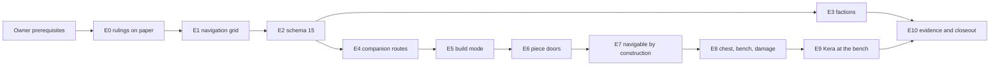

# Otherreach M7 - Implementation Design

**Milestone:** M7 - Factions, Reputation, and Building v1 (Phase 2)
**Date:** 2026-09-24. Reconciled to the closed Phase 1 on 2026-09-25.
**Status:** Execution design, ready for implementation authorization. Design only: no code, content, asset or repository change has been made. M7 is **not authorized**, and nothing here starts it.
**Code base:** canonical `main` at `a69693108b89d471cdb409a229ba0bdf78b08fa4` (`a696931`, "Merge pull request #7 ... integration/phase1-complete"). This is Phase 1 closed: the Phase-A Complete Prototype, the technical-audit remediation, the H-02 ArtLibrary closure, the L-05 pre-migration backup fix, the Linux profile-lock fix, and the closeout documentation (`docs/PHASE1_TECHNICAL_CLOSEOUT.md`). All `path:line` citations refer to `a696931`.
**Save schema at the base:** 14. M7 migrates **14 → 15**. The digests at the base are `unnamed.player/v9`, `unnamed.effective-cell/v2` and `unnamed.simulation/v2`; M7 moves them to v10, v3 and v3.
**Author role:** M7 design lead. Research, alternative designs, adversarial critiques, audits and the post-Phase-1 reconciliation were run as independent passes. Their working papers are kept beside this file.

## How to use this document

- This document is **normative for the M7 implementation**. It settles the architecture questions, so the implementation prompt only has to point at it. Where it disagrees with a working paper, this document wins.
- The five owner questions (section 17) were **approved by the owner on 2026-09-25**. The owner's RAZER ruling of the same date accepts the measured Phase-A result as the performance baseline.
- The Phase-B visual overhaul is not an input to this design. Only gameplay-facing contracts on canonical `main` are.
- Some items are owner **process** prerequisites, not design questions: authorizing M7; naming the agent, worktree and branch; the R-1 tag; the dialogue tone review. They are listed in sections 17 and 18.
- The implementation order is section 18. The slices are section 10, and the acceptance criteria are section 11.

## Sections

1. Authoritative M7 scope
2. Existing-system inventory
3. Navigation v1
4. Building v1
5. Factions and reputation v1
6. Cross-system contracts
7. Persistence and save migration (schema 15)
8. UI and controls
9. Minimal content and asset requirements
10. Implementation slices
11. Exact acceptance criteria
12. Test matrix
13. Runtime proof plan
14. Performance considerations
15. Risk register
16. Explicit deferrals and non-goals
17. Owner decisions
18. Recommended implementation order

## Supporting papers (in `G:\UNNAMED_HISTORY\M7_DESIGN_2026-09-24\`)

| Folder / file | What it holds |
|---|---|
| `M7_EXECUTIVE_BRIEF.md` | The short version for the owner |
| `M7_POST_PHASE1_RECONCILIATION_PREP.md` | The analysis of what the Phase-1 audit remediation changed for M7 (written against `75e6759`) |
| `recon/00_RECON_RULINGS.md` | The rulings and verified facts applied in the final reconciliation to `a696931` |
| `recon/citation_remap_report.tsv`, `recon/changed_citations_by_section.md` | Every source citation mapped from `e10d2c4` to `a696931`, and the citations whose lines changed and were re-derived |
| `research/*.md` | Ten cited research notes over the docs and source at `e10d2c4`: authority, building docs, faction docs, world lore, simulation core, spatial movement, persistence, content registry, social/quests code, presentation/performance |
| `drafts/00_SCOPE_RULINGS.md` | The design lead's scope rulings given to every design pass |
| `drafts/01_LEAD_RULINGS_ON_AUDITS.md` | The design lead's rulings on the audits |
| `drafts/A_navigation.md`, `B_building.md`, `C_factions.md` | The full part designs, with derivations, arithmetic and appendices (at `e10d2c4`; superseded where this document differs) |
| `drafts/D_cross_system.md` | The reconciliation register D1-D38, which settles the disagreements between the parts |
| `drafts/E_slices_tests.md`, `F_persistence.md`, `GH_content_ui.md`, `IJ_risk_perf.md` | Working drafts of the plan, persistence, UI, content, risk and performance |
| `drafts/panel/*.md` | Independent candidate designs (three navigation, two faction), the first building design and its adversarial critique |
| `drafts/audit/*.md` | Audits: on the drafts, four (scope, code facts, determinism and persistence, implementability); on the assembled document, four (two cross-section consistency checks, owner-brief compliance, code facts); plus the post-reconciliation checks |
| `drafts/history/*` | This document and the brief as they stood before the reconciliation to `a696931` |

---

## 1. Authoritative M7 scope

### Decisions

- This design is reconciled against `main` at `a696931`. Phase 1 is closed (`docs/PHASE1_TECHNICAL_CLOSEOUT.md:8-9`), and Q1-Q5 are approved (2026-09-25).
- M7 is built and proven in **Ashen Hollow**: region `r_0_0`, 200 x 200 m, four 100 m cells. The vertical slice's Kaldrun Reach, Vessmere and VS factions are M9 content and are not built here. Everything M7 builds must be reusable by M9 without rework.
- ROADMAP's M7 entry is the scope text. It predates the owner's 2026-09-24 rulings. Where the two conflict, the ruling wins until M7's first slice writes it into the normative documents (`docs/IMPLEMENTATION_PRECEDENCE_AND_DESIGN_STATUS.md:33`).
- Owner rulings 1 (domain navigation, never Godot Navigation) and 2 (one storey) are **recorded nowhere** in the repository, in the V4 handoff or in the history reports. Slice E0 records both.
- The M7 exit's "navmesh" means **the domain navigation grid** of section 3: derived, deterministic, headless, updated on placement.
- Crime, bounty, pardon and territory gating are **deferred**, approved (Q2, 2026-09-25). The act log and gate-access sets are their seams.
- Faction knowledge in M7 is **report-only**, approved (Q5, 2026-09-25). The witnessed channel is specified for M9 and not built (section 5).

### 1.1 The ROADMAP M7 entry, verbatim (`docs/ROADMAP.md:278-286`)

> ### M7 — Factions, Reputation, and Building v1 — `FEATURE` — **PHASE 2**
>
> - **Class:** FEATURE. **Depends on:** M4 (NPC persistence), M3f (materials). **Phase:** **2** — this milestone is Phase-2 work; an earlier draft of this roadmap placed it in Phase 1, which contradicted `PROTOTYPE.md`, `GAMEPLAY_LOOPS.md` §15 ("**BUILD** — **Not in Phase 1**"), and `SYSTEMS.md` §3 (S-27 Factions and S-32 Buildings are both Phase 2). `RISK_REGISTER.md` declares Phase 1 *failed* if any system outside `PROTOTYPE.md`'s minimum list is built, so building this in Phase 1 would have failed the phase by the register's own criterion.
> - **Entry:** NPCs and companions path reliably — D-08's whole justification for snap-based building is that structures must stay navigable and persist reliably.
> - **Work (factions/reputation, moved here from M4):** faction definitions and membership graph; per-faction player reputation with directional, per-faction reactions and **no universal morality meter** (Charter §20); cross-faction attitude relations; crime/bounty records and pardon state (`S-27`); service, dialogue and territory gating derived from standing. Reputation answers *access* and never converts into character power (`D-09`).
> - **Work (building):** Socket/snap placement; foundations, walls, floors, roofs, doors; free rotation and socketing; ownership; per-piece health applied by explicit rules (**no structural simulation, no physics collapse** — D-08); repair; storage containers; one crafting station as a placeable; player-built structure persistence as a sparse world delta (D-05); placement validation that rejects un-navigable or overlapping configurations.
> - **Exit criteria:** Build a structure, assign an NPC to work in it, verify the NPC navigates in, through, and around it — **including a structure straddling a cell boundary**, which is `RK-14`'s explicitly unsolved case and must be proven here rather than discovered in playtest; save/load preserves every piece with correct ownership and health; damage/repair works and is explicit rather than emergent; the navmesh updates on placement; the same act moves two factions in opposite directions in a fixture.
> - **Proof:** Playable build; navmesh path test including the straddling-seam case; structure round-trip through save; a reputation fixture table.
> - **Notes:** Less creative freedom than voxel building is the accepted cost of guaranteed navigability and clean persistence (D-08). If playtest says expression is limited, the answer is **more pieces, not physics**.

ROADMAP rules that bind M7:

- R-1: playable throughout; merged, tagged and smoke-green at each milestone.
- R-2: vertical, not horizontal.
- R-3: dependency order.
- R-6: no networking; only the four D-12 extension points.
- The dependency note at `:93`: "Snap building guarantees navigability; navigability is only testable once NPCs and companions actually path (D-08)".
- M10 (`:312`) owns "NPC work assignment and production roles" and home-defense threats.
- M9 (`:303`) owns the slice's "2–3 factions with mutually constraining reputation".

### 1.2 Authority order used by this design

- `PHASE_0_COMPLETE.md` §1: Charter > DECISIONS > rank-3 specialists (ARCHITECTURE, DATA_MODEL, PERSISTENCE, WORLD_ARCHITECTURE, SYSTEMS, PROGRESSION) > PROTOTYPE / ROADMAP / VERTICAL_SLICE / GAMEPLAY_LOOPS > RISK_REGISTER. Within a rank, the more specialised document wins.
- Design-extension documents (`CRIME_LAW_REPUTATION_AND_JUSTICE.md`, `WORLD_BUILDING_AND_PROPERTY_DESIGN.md`, both owned by M7 per `docs/INDEX.md:89-90`) are directional until M7 reconciles them. Handoffs are orientation only.
- ROADMAP governs **when**; PROTOTYPE governs **what is in Phase 1** (`docs/ROADMAP.md:447`). For Phase-2 content the governing documents are ROADMAP M7 (scope), SYSTEMS S-27/S-32 and PROGRESSION §10 (mechanics), D-08/D-09 (decisions) and the owner's rulings.

Where each owner ruling is recorded today:

| Ruling | Recorded at | M7 action |
|---|---|---|
| 1 Navigation: domain, deterministic, headless; Godot Navigation never authoritative | **Nowhere.** Supporting principles only: navigation and pathfinding are derived state (`docs/PERSISTENCE.md:83-84`, `docs/ARCHITECTURE.md:165`) | E0 writes a dated DECISIONS entry and amends WORLD_ARCHITECTURE §5/§10/§11/RK-A2, RISK_REGISTER RK-14/RK-06, PERSISTENCE §2 and SYSTEMS S-25/S-32 |
| 2 One storey | **Nowhere** | E0 writes a dated DECISIONS entry and amends ROADMAP M7 ("floors" means ground pads) |
| 3 Faction separation, no morality meter, no psychic knowledge | `docs/SOCIAL_INTERACTION_LANGUAGES_AND_KNOWLEDGE.md:548-564`; `docs/PROGRESSION.md:444-452`; D-09 as amended (`docs/DECISIONS.md:209`) | Enforced by the section 5 rules and architecture tests |
| 4 C10 retired | `docs/PROTOTYPE.md:298` (the untracked V4 handoff §18 is stale) | None |
| 5 No required radial | `docs/PHASE1_ASHEN_HOLLOW_PLAYABLE_CONTENT_BIBLE.md:645` | Section 8 uses direct keys only; E0 softens `docs/HUD_INPUT_AND_ACTIONS.md:36` |
| 6 No networking | D-02, D-12, R-6 | None |
| 7 Engine-independent authority; dotted IDs; ULID instance IDs; sparse deltas | D-02, D-04, D-05, D-11 | E0 adds a dated D-04 note on derived ULID-shaped IDs (section 4) |

### 1.3 Conflicts, and how this design resolves each

| # | Text | Conflicting authority or ruling | Resolution in this design |
|---|---|---|---|
| 1 | ROADMAP "the navmesh updates on placement"; "navmesh path test" | Ruling 1. WA §11 (`:435`) lists a Recast navmesh "baked per cell" in the presentation/streaming table. RK-14 (`docs/RISK_REGISTER.md:290`) says the test "needs the engine". The only navmesh in code is the Godot bake in the presentation-only spike (`src/Presentation/Spike/SpikeScene.cs:159-179`) | "Navmesh" means the domain navigation grid (section 3). It is updated synchronously by `RebuildNavigation` on every placement, dismantle or destroy that changes a blocking footprint. RK-14 is proven headless plus a recording. A guard test bans Godot navigation types outside the spike |
| 2 | ROADMAP "foundations, walls, floors, roofs, doors" | Ruling 2. The body cannot stand on anything (`src/Domain/Spatial/Kinematics.cs:159`) | One storey. A floor or foundation is a **ground pad**: a visual placement anchor with a terrain-relief gate. Gameplay stays terrain-bound, and there is no walkable elevated surface. Roofs never block walkers |
| 3 | ROADMAP and D-08 "free rotation and socketing" | VS: 45° steps. Code: axis-aligned boxes and circles only (`src/Domain/Spatial/Blockers.cs:40-41`) | Quarter turns on a 3 m lattice, approved (**Q1**, 2026-09-25). Pieces stay axis-aligned boxes, and `Kinematics.Step`, combat traces and prediction are untouched. The data shape leaves room for 45° later |
| 4 | ROADMAP "crime/bounty records and pardon state (S-27)" | PROTOTYPE `:40` and INDEX `:89` put crime in Phase 3; VS `:336` makes it a non-goal. Ruling 3 keeps legal status separate. Nothing can be committed today: NPCs cannot be harmed and containers have no owner | Deferred beyond M7, approved (**Q2**, 2026-09-25). The act log and its string-keyed source/identity fields are the seam. Nothing in M7 derives legal status or hostility |
| 5 | ROADMAP "service, dialogue and territory gating derived from standing" | PROGRESSION §10: access only | One dialogue gate and one service gate are built. Territory gating is deferred with crime (**Q2**) |
| 6 | ROADMAP exit "assign an NPC to work in it" | VS hirelings 0 (`:97`). ROADMAP M10 (`:312`) owns NPC work assignment. NPC bodies are not saved today | The smallest literal proof, approved (**Q3**, 2026-09-25): Kera Voss is assigned to a player-built anvil bench as a persisted errand. She walks there and back by navigation. No production, schedules or wages |
| 7 | ROADMAP exit "structure straddling a cell boundary" | VS keeps its plot inside one cell (`:161`). RK-14 permits constraining placement | Required and proven. The build area sits over the four-cell corner at (100, 100), and the acceptance structure straddles a seam with its interior route crossing it |
| 8 | Where the player may build (ROADMAP silent) | VS: one quest-granted plot. WORLD_BUILDING §4: do not restrict to plots | One content-defined area, `build_area.hollow_crossing` (x and z 87-114 m), with no quest gate, approved (**Q4**, 2026-09-25). Widening it later is data |
| 9 | "per-piece health ... damage/repair works and is explicit" | GAMEPLAY_LOOPS wants property threats plus a frequency option in the phase building ships; ROADMAP M10 owns home defense; off-screen raids are tier-illegal | Per-piece health, **one** explicit damage rule (the player's melee strike on a piece), repair with materials, destruction at 0 health. No raids and no threat system. The GAMEPLAY_LOOPS conflict is recorded in section 16 |
| 10 | "storage containers; one crafting station as a placeable" | VS is inconsistent about stations | One storage-chest piece (reuses the container record) and one anvil-bench piece (reuses the M3f station model) |
| 11 | "cross-faction attitude relations" | Ruling 3 | Static, directional relation words in content, read by views only. They never move standing, and there is no war-state change in M7 |
| 12 | Reputation ladder: VS 5 tiers incl. "Hostile"; PROGRESSION 11 (-5..+5); DATA_MODEL example 4 | PROGRESSION is rank 3 and the specialist | PROGRESSION §10's eleven tiers. Tiers are derived from stored points and never stored, and no tier name implies an attack order |
| 13 | VS §5.6: backing a faction "puts town guards on you" | D-09 as amended ("access only; never hostility"); PROGRESSION §10; ruling 3 | Excluded. Standing never decides who attacks, enforced by an architecture test (section 5) |
| 14 | DATA_MODEL §4.13 FactionDefinition fuses `laws`, `guards_hostile` and `enemy_of` into the faction | Ruling 3; S-27 `:309` | Those fields are refused by lint in M7. Law belongs to places and institutions (CRIME_LAW `:20`) and arrives with crime |
| 15 | ROADMAP entry "NPCs and companions path reliably" | No pathfinding exists: creatures steer straight and slide, NPCs never move, and the companion follows a breadcrumb trail with a teleport safety net | The entry criterion is met **inside** M7 by slices E1 (grid and planner) and E4 (companion route mode), before any building slice. This is recorded honestly in M7_STATUS |
| 16 | PROTOTYPE A-2: "`faction_id` field exists on NPCs and is saved" | No such field exists in code or saves | Corrected in E0. M7 adds NPC `faction_ref` as static content, not saved |
| 17 | Feel test: "not an M7 entry blocker" (ROADMAP `:274`, owner ruling) | IMPL_PRECEDENCE `:156,:321`, the content bible and the V3/V4 handoffs still say "before Phase 2" | The owner ruling stands: the test's precondition (a nontechnical Windows playtest build) is now met (`docs/PHASE1_TECHNICAL_CLOSEOUT.md`, "Blind test"). The test itself has not been run, and it is not an M7 blocker. E0 amends IMPL_PRECEDENCE to cite it |
| 18 | RAZER 1080p/60 evidence "before Phase 2" (bible `:1047-1070`; PROTOTYPE `:384`) | ROADMAP M7 entry is silent; the window was measured 2026-09-25 and accepted by the owner as the Phase-A/Phase-1 baseline (`docs/PHASE1_TECHNICAL_CLOSEOUT.md:131, 202-204`; `docs/M6_STATUS.md:221`) | Done and accepted. Every gameplay segment holds 60 FPS except the magic segment's 1% low; the repeatable first-use hitches (magic at about 1.5 s and 3.3 s, combat at about 16.4 s, walking at about 43.9 s and 58.5 s) are carried as targeted follow-ups, not M7's. Section 14 says what M7 adds to that capture |
| 19 | ROADMAP `:422` "No other milestone requires owner input" | The stop-after-M6 ruling (IMPL_PRECEDENCE `:315-323`; `docs/M6_STATUS.md:187`) | M7 needs owner authorization and a named agent, worktree and branch (AGENTS.md scopes Claude "through M6"). Owner process item |
| 20 | Ruling 3 lists "directly witnessed" among possible knowledge sources | Shipped Ashen Hollow cannot exercise witnessing (members stand inside buildings or far from any relevant act), and the channel carried two audit-found hazards | M7 is report-only. Witnessing is specified as the M9 extension, with its fixes, and the stored knowledge rows already carry the fields it needs |

### 1.4 REQUIRED FOR M7

1. **Document reconciliation (E0).** Rulings 1 and 2 recorded as DECISIONS entries. ROADMAP M7 amended to this scope. WORLD_ARCHITECTURE, RISK_REGISTER, PERSISTENCE §2, SYSTEMS, GAMEPLAY_LOOPS, the Ashen Hollow content bible, PROTOTYPE A-2, HUD_INPUT and IMPL_PRECEDENCE amended where they conflict; DATA_MODEL changes land as built in E2, E3 and E10. A dated D-04 note on derived IDs. `docs/M7_STATUS.md` created.
2. **Navigation v1 (section 3).**
   - A derived 250 mm integer lattice, stored one tile per 100 m cell.
   - Deterministic windowed A* with string pulling.
   - Routes persisted with their movers.
   - `RebuildNavigation` on structure edits.
   - The companion's route mode, used as the fallback when his trail fails; he opens doors.
   - The errand mover.
   - One navigability rule for placement.
   - A headless seam proof and a runtime recording.
3. **Building v1 (section 4).**
   - Seven greybox pieces: pad, wall, doorway, door, roof, storage chest, anvil bench.
   - A 3 m lattice with quarter turns and deterministic snapping.
   - Ordered placement checks with an advisory preview that matches the command.
   - Ownership; per-piece health, one damage rule, repair, dismantle and destroy.
   - Authoritative piece doors.
   - The build area over the four-cell corner.
   - The Crossing Workshop, a structure that straddles a seam.
   - Materials (timber) consumed through existing inventory transactions, from an authored timber stack.
4. **NPC work assignment, approved (Q3, 2026-09-25).** Kera Voss is assigned to the player's anvil bench and released from it. The errand is persisted.
5. **Factions v1 (section 5).**
   - Two working factions, the Waystation and the Survey.
   - Static membership and relations.
   - An act log with two built act kinds.
   - Data-defined per-faction reactions.
   - Report-only knowledge.
   - The PROGRESSION ladder.
   - One dialogue gate and one service gate.
   - The reputation fixture table, in which the same act moves two factions in opposite directions.
6. **Persistence (section 7).**
   - One schema bump, 14 to 15, with its migration step, frozen V14 shapes and a v15 fixture.
   - The committed M6 acceptance save (`tests/Application.Tests/GameSaves/m6_acceptance/`) as the historical proof, migrated 12 → 13 → 14 → 15; no new M6 save is written.
   - Field-by-field StateDump evidence (the live reconstructed-state comparison), deterministic replay, and save-then-continue equality.
7. **Presentation (sections 8 and 9).**
   - Build mode on direct keys with no radial.
   - A greybox `StructuresView` and an advisory ghost.
   - F2 structure/navigation and F6 faction debug views.
   - HUD lines for reported reputation changes.
8. **Runtime proof (section 13).** A `--build-shots` scripted run with verify and replay, faction beats in `--playthrough`, and the live reconstructed-state `StateDump` comparison (956 fields at the Phase-1 baseline; M7 asserts 0 differences and records counts, never asserting a count).
9. **Required instrumentation (section 14).**
   - `NavCounters`.
   - FrameStats `sim_ms`, `ticks`, `save_ms`.
   - Headless budget tests.
   - The RK-06 200-piece round trip.
   - Lint BLD009.
   - Evidence on `--perf --perf-route extended` with the `building` segment appended, compared against the accepted Phase-A RAZER baseline; the carried first-use hitches are not M7's.

### 1.5 OPTIONAL IF CHEAP

- Instrumentation beyond the required set: `--perf-world` and its generator, the generated cost table, building and faction counters, extra FrameStats columns, and the companion soak (owed M6/RK-05 work). Each is built only when a measurement calls for it, or for the owner's RAZER window. Section 14 gives the switch-on conditions.
- Additional greybox piece variants, such as a half wall or window wall, only if they are pure content that needs no new mechanism. None is planned.

Everything the scope rulings once listed as optional was decided during design and is recorded in section 16:
- Creature return-home by navigation: declined. It would reopen `CreatureDto` and the behaviour matrix.
- Territory gating: deferred with crime (Q2).

### 1.6 DEFERRED BEYOND M7

Section 16 lists every deferred item once, with the milestone that owns it. In short:

- **Building:** vertical building of any kind; oriented or 45° rotation (unless Q1 says otherwise).
- **Crime and law:** crime, bounty, pardon, legal status, jurisdiction, guards, territory gating.
- **Knowledge:** witnessed knowledge, rumor, in-flight reports, war-state changes, standing decay, joining factions, memory logs.
- **Settlement:** NPC schedules, production, hirelings, settlement simulation, raids and the attack-frequency option.
- **Damage and resources:** damage sources beyond player melee; renewable timber.
- **Navigation:** creature pathing and extra radius classes.
- **Presentation:** the production building UI, the art kit, a player faction screen.
- **Never in M7:** Godot navigation in any authoritative role, networking, and Kaldrun Reach content.

### 1.7 M7 entry status (at `a696931`)

| Entry condition | Status |
|---|---|
| M4 (NPC persistence) and M3f (materials) complete | Met (`docs/M4_STATUS.md`, `docs/M3F_STATUS.md`) |
| "NPCs and companions path reliably" | Not met before M7. Met inside M7 by E1 and E4 (row 15 above) |
| Owner authorization to start M7 | **Not given** (`docs/M6_STATUS.md:187`). Owner process item |
| Feel test | Waived as an entry blocker by owner ruling (`docs/ROADMAP.md:274`); its precondition is now met (`docs/PHASE1_TECHNICAL_CLOSEOUT.md`, "Blind test"), but the test itself has not been run |
| RAZER 1080p/60 window | **Done and accepted.** Measured 2026-09-25 and accepted by the owner as the Phase-A/Phase-1 baseline (`docs/PHASE1_TECHNICAL_CLOSEOUT.md:131, 202-204`); the repeatable first-use hitches are carried as targeted follow-ups, not M7's |
| R-1 tagged build | No git tags exist. The owner tags at merge, or waives the rule |

---

## 2. Existing-system inventory (what M7 builds on)

Base: `main` `a696931`. Every `path:line` is repo-relative and was re-read in the read-only snapshot. The "M7 touch" column is normative: it is the complete list of Phase-1 code M7 changes, and how.

### Decisions

- M7 is specified against the live runtime in `src/World/Runtime`; the M1 scaffold (`ISystem`, `IWorldStateWriter`, `CommandBus`, `TickScheduler`) is not touched.
- `Simulation.Step`'s system order is unchanged; M7 adds no `Tick` (errands move inside `NpcSystem.Tick`).
- `Kinematics.Step`, `MovementRules`, the two `Blocker` shapes and `TerrainGrid` are unchanged; a piece part is an axis-aligned `BoxBlocker` with `ClearanceMm = 0`.
- `Setup.Layout.Space` is never mutated; the piece-bearing space is a separate `SystemContext.Space`.
- `CreatureSystem.Populate` keeps reading `Setup.Layout.Space`.
- The only change to existing item behaviour is `InventorySystem.Put`, which merges into same-kind stacks in (count descending, `ItemId` ordinal) order. Every other Phase-1 touch this design still needs is listed as MINIMAL or EXTENDED below; several rows M7's original draft expected to touch (the all-bodies door close refusal, the corpse-container clauses) are already Phase-1 fixes and need no M7 edit at all, only the tests kept green.
- NPC and creature ID derivations stay as they are; only pieces and piece chests use the new `EntityId.Derived`.
- `Magic.cs`, `GatheringSystem`, the world generator, `GameSession`'s baseline transitions, `SaveFormat.Current` and `CheckedFiles` are untouched.
- Pre-existing hazards M7 exposes are recorded in `M7_STATUS` and `RISK_REGISTER` (§2.15), not fixed.
- A Phase-1 file not marked MINIMAL or EXTENDED below is not changed. Changing one is a design change and needs a recorded decision.
- Phase-1 tests pass unmodified, except the named edits in §2.18. The Phase-1 baseline is 825 tests (Domain 147, Application 204, Persistence 173, Content 146, World 61, Presentation 57, EntityRegistry 23, Architecture 14); `tests/Presentation.Tests` is a new project, over the Godot-free presentation logic (`ArtRecordsTests.cs`, `CoverageTests.cs`). CI (`ubuntu-latest`) runs build and tests only, no Godot.

### 2.1 Legend and governing sections

| Touch | Meaning |
|---|---|
| NONE | No source line changes |
| MINIMAL | A small, named edit; Phase-1 behaviour is identical unless the row says otherwise |
| EXTENDED | The type or system gains M7 members or branches; existing branches keep their behaviour |
| NEW beside | A new file or type next to the existing one; the existing one is not edited |

Governing sections: §3 Navigation, §4 Building (including the work assignment), §5 Factions, §6 Cross-system contracts, §7 Persistence and migration, §8 UI and presentation, §9 Content.

### 2.2 Simulation core: composition, tick, commands, slices, events

| Element | Where | Today | M7 touch | § |
|---|---|---|---|---|
| Composition root | `src/World/Runtime/Simulation.cs:100-145` | Builds `RuntimeState` and `SystemContext`, registers carried items, constructs 21 systems plus `QuestDebugger` in a fixed list (`:116-137`), `RequireEverySliceOwned` (`:139`), then `_effects.Seed`, `_npcs.Populate`, `_companions.Populate`, `_creatures.Populate`, `_tiers.Settle` | EXTENDED: `_navigation` after `_crafting`, then `_building` (receives it), `_npcs` (claims `Npcs` and `NpcErrands`, receives it), `_relationships`, `_factions` (claims `Factions`; no seed call); `_companions` receives `_navigation`. Rebuild order: `_effects.Seed`, `_building.Populate`, `_navigation.Build`, `_npcs.Populate`, `_companions.Populate`, `_creatures.Populate`, `_tiers.Settle` | §6 |
| Tick | `Simulation.cs:315-342` | Movement, tiers, tier B/C stubs, combat, creatures, companions, NPCs, dialogue, effects, death, discovery, quests, clock (last) | NONE | §6 |
| Command queue | `Simulation.cs:72`, `:271-309`; `Commands.cs:29` | `Queue<GameCommand>`, drained FIFO at tick boundaries; every command logged as `LoggedCommand(Tick, Sequence, Command, RejectedReason)`; a rejection is a string plus `CommandRejected`; 23 command types | EXTENDED: five arms (`PlacePieceCommand`, `DismantlePieceCommand`, `RepairPieceCommand`, `AssignWorkerCommand`, `ReleaseWorkerCommand`) to `_building.Handle(c, WorldTick)` | §4, §6 |
| Internal commands | `Systems.cs:15`; `Simulation.cs:373`, `:375-410` | Synchronous, re-entrant `Dispatch` by type; 32 arms; an unknown type throws; stamped `Now` (stepped tick, or boundary tick while draining) | EXTENDED: nine arms: `RebuildNavigation`→navigation; `OpenDoor`→interaction; `OperatePieceDoor`, `DamagePiece`→building; `BeginWork`, `EndWork`→NPCs; `SpillContainer`→inventory; `RecordAct`, `ReportAct`→factions | §6 |
| State slices | `RuntimeState.cs:20-75`, `:145-162`, `:337-341` | 18 slices; one owner each (boot error otherwise); every write passes `Require(owner, slice)` | EXTENDED: `Navigation` (transient), `Structures`, `NpcErrands`, `Factions`, with gated wrappers; `Npcs`' doc names the errand pose as saved in its errand | §6 |
| Player-held slice seeding | `RuntimeState.cs:98-116` (`Posture = player.Posture`, `:103`) | The constructor copies `PlayerRecord` fields into slices | MINIMAL: also reads `player.Factions` | §5 |
| `SystemContext` | `Systems.cs:24-95` | Shared reads: `IsOpen`, `IsSet`, `IsLifted`, `ClosedDoors` (`:48`), `FindContainer` (`:51-52`), `MerchantSites`, `WaresOf` (`:61-64`), `TalkReachMm` 1,950 (`:67`); `Walled` (`:72-74`) and `InTalkReach` (`:76-78`, the Phase-1 technical audit, L-09) read `Setup.Layout.Space.Blockers` and `ClosedDoors()` directly, not through a shared helper; `Obstacles` (`:90-94`). 9 `ClosedDoors()` call sites and 18 `Layout.Space` reads in `src/World/Runtime` | EXTENDED: `Space`, `SightWalls()` (a new shared helper; `Walled` switches to it, becoming the fourth copy of the wall line beside Combat `:575`, Companions `:598` and Creatures `:924`), `Stations()`, `StructureFootprints`, `PersonObstacles(npcId)`, `BodyIn(Blocker)` (lifted from the authored-door close refusal, `:279-285`, and shared by authored doors, piece doors and building check 12); `ClosedDoors()` appends closed piece leaves; `FindContainer` appends piece chests; `Obstacles()`' formula unchanged; assign and release reach use `InTalkReach` | §6 |
| `SimulationSetup` | `Simulation.cs:14-33` | Immutable rules; init properties default to `XSetup.Empty` | EXTENDED: `Navigation`, `Building`, `Factions` init properties | §6 |
| Read surface | `Simulation.cs:202` (`Aim`), `:255` (`DynamicBlockers`), `:345-354` (`CaptureRecord`), `:360-370` (`StateDigest`, `unnamed.simulation/v2`, `:363`) | Public methods allow-listed; get-only properties free | EXTENDED: method `PreviewPlacement` (the only allow-list addition); `_previewScratch`; get-only `Navigation`, `Pieces`, `Space`, `Stations`, `StructureRevision`, `StructureAudit`, `WorkAssignments`, `StructureFootprints`, `Factions`, `Acts`; `CaptureRecord` adds `Factions`; digest `v3` puts `StructureSequence` after the player digest term, before the cell and noise terms | §6, §7 |
| Events | `Events.cs:10-11`; `src/Application/EventBus.cs:26-31`, `:64-87`; `GameSession.cs:108` | Past-tense records for views and tests; published inline; exact-type dispatch in subscription order; each subscriber's exceptions are caught and counted (`SubscriberFailures`, `GameSession.cs:365-374`) rather than propagated, so no throwing view can abort or replay an authoritative tick (H-02); no system subscribes; construction and load publish nothing | NEW beside: 15 event types (§6). `DoorToggled` reused: `Actor` may be an NPC instance ID, `DoorKey` a `pce_` value. No new isolation guard is needed - M7's events inherit it - but every M7 test on `GameSession`/`Harness` must collect events and assert afterward, and assert `SubscriberFailures == 0`; every scripted beat STOPs on a non-zero count | §6 |
| M1 scaffold | `src/Domain/ISystem.cs`, `IWorldStateWriter.cs`, `ICommandBus.cs`; `src/Application/CommandBus.cs`, `TickScheduler.cs` | Used only by `tests/Domain.Tests/PickUpItem*.cs` | NONE | - |
| Frame loop | `src/Application/GameSession.cs:327-353` | Clamps a frame to 0.25 s, drains, steps whole ticks, drains after each, autosaves every 300 s of playtime with no conversation check | NONE | - |
| Unchanged systems | `Systems.cs` (Clock, WorldFlag, Progression, Discovery), `Items.cs` (Equipment), `Combat.cs` (StatusEffect, Death) | - | NONE | - |

### 2.3 Space: kinematics, blockers, terrain, doors, barriers, tiers

| Element | Where | Today | M7 touch | § |
|---|---|---|---|---|
| `Kinematics.Step` | `src/Domain/Spatial/Kinematics.cs:119`, `:129-160`, `:178-185`, `:187-212` | Sub-steps ≤ r/2; up to 4 passes, statics in list order then dynamics; the tucked radius applies while the feet are off the ground, never on the step that lands (`:178-185`, the Phase-1 technical audit, L-15); rounds half away from zero; Y = terrain + lift (`:157-159`) | NONE. Callers pass `_context.Space`; M7's movers are grounded, so the landing change does not touch them | §3, §4 |
| Blockers | `src/Domain/Spatial/Blockers.cs:11`, `:41`, `:95` | `BoxBlocker` and `CircleBlocker`, axis-aligned, integer mm; `Separation` treats touching as clear, `Crosses` as crossing; both height-blind | NONE | §4 |
| `WalkSpace` | `Kinematics.cs:104`; `RegionLayout.cs:63` | One immutable region-wide record, built once from content; cells do not partition movement | NEW beside: `SystemContext.Space = Setup.Layout.Space with { Blockers = authored ++ piece solids in StructureOrder }`, written only by `BuildingSystem` | §4, §6 |
| `IsClear`, `CanStand` | `Kinematics.cs:170-177` | `IsClear` height-blind; `CanStand` reads only blockers with `ClearanceMm > 0` | NONE | - |
| `Layout.Space` reads | 18 in `src/World/Runtime` (not 17) | 14 collision or sight, 4 terrain-only | MINIMAL: 12 switch to `_context.Space`: `Systems.cs:148`, `:173`, `:229`; `Companions.cs:372`, `:398`, `:567`, `:598`; `Creatures.cs:599`, `:637`, `:868`, `:924`; `Combat.cs:575`. `Creatures.cs:174` stays (with a one-line comment). Terrain-only `Companions.cs:132`, `:519`, `Creatures.cs:781`, `Social.cs:136` stay | §4, §6 |
| Terrain | `src/Domain/Spatial/TerrainGrid.cs:51`; `content/regions/ashen_hollow.yaml:15-62` | Integer `HeightAtMm`; authored 41 × 41 grid at 5 m; outside every baseline hash | NONE (pads drape; no flattening) | §4 |
| Region sites | `src/Domain/Spatial/RegionLayout.cs:12-49`, `:60-98` | `DoorSite`, `SwitchSite`, `BarrierSite`, `LocationSite`, `ContainerSite(Key, LootTableId, XMm, ZMm, StackSlots)`, `StationSite(Key, Kind, XMm, ZMm)`, `NpcSite` | MINIMAL: `BuildAreaSite`, `RegionLayout.BuildAreas`; `ContainerSite.InstanceId` and `.Owner` (init, null for authored sites) | §4, §9 |
| Door and barrier state | `Systems.cs:48`; `RegionLayout.cs:94-97`; `Simulation.cs:169-183` | `ClosedDoors()` re-reads cell flags on every call: authored doors, then standing barriers; a flag lives in the cell of its footprint centre | EXTENDED: closed piece leaves appended in `StructureOrder`; piece doors keep `door_open` on their row, never a flag | §4 |
| `InteractionSystem` | `Systems.cs:253-310` | Player-only; door reach 1.6 m from the body; closing on an authored door is already refused over the player, every living creature and every NPC (`:279-285`, the Phase-1 technical audit, L-16 - its own tests cover only the player and a wolf); a switch sets its flag once (`:293-309`) | EXTENDED: a `pce_` target dispatches `OperatePieceDoor`, keeping the same all-bodies refusal; `Handle(OpenDoor)` for companions and errand NPCs (open only); the `:279-285` predicate is lifted into `SystemContext.BodyIn(Blocker)`, shared by authored doors, piece doors and building check 12; `NoDoorCloses_OnAnyBody` adds the NPC and companion cases Phase 1's own tests lack; `RecordAct("switch_set", flag)` after an accepted `SetWorldFlag` (`:305`) | §3, §4, §5 |
| Tiers | `src/Domain/Spatial/Tiers.cs:20-47`; `Systems.cs:490`, `:540` | A cell enters A within 140 m and stays A to 160 m; not saved; `Settle` recomputes on load; B and C are stubs | NONE. The errand mover is not tier-gated | §3 |
| Perception | `src/Domain/Creatures/Perception.cs:87-107` | `Sees`: range, `Sin`/`Cos` field of view, `Crosses` | NONE (factions do not witness in M7) | §5 |

### 2.4 Companions and NPCs

| Element | Where | Today | M7 touch | § |
|---|---|---|---|---|
| Companion follow | `src/World/Runtime/Companions.cs:325-361` | Catch-up at > 30 m or 80 ticks without headway; else the player in clear view, else the newest trail mark in clear view, else the oldest; headway = displacement ≥ 30% of expected travel | EXTENDED: `CompanionState.Route`; Route and Nav branches; `OpenDoor` dispatch; route resets on order, downed, up, catch-up and fall; a refused `OpenDoor` adds 1 to `StuckTicks` | §3 |
| Trail | `Companions.cs:308-316`, `:187` | A mark per metre, 48 kept; an order clears the trail | NONE | - |
| Catch-up and ring | `Companions.cs:367-408` | Teleport near the player; the safety net | MINIMAL: the space switch at `:372`, `:398` | §3 |
| Companion obstacles | `Companions.cs:571-581` | Closed doors, living creatures, the player, every other NPC | MINIMAL: moved to `SystemContext.PersonObstacles(npcId)`, shared with errands; same set | §3, §6 |
| Clear view | `Companions.cs:584-598` | Three `Crosses` segments against statics and closed doors | MINIMAL: `Walled` reads `SightWalls()` | §4 |
| Conversation hold | `Companions.cs:286-290` | Stands facing the player while talking; reads the transient conversation | NONE (recorded hazard, §2.15) | - |
| Recruit | `Companions.cs:160-171` | Idempotent; no relationship requirement | MINIMAL: refuses an NPC that has an errand | §4 |
| Copy sites | `Companions.cs:125-143` (`Populate`), `:145` (`Records`) | Carry every saved companion field | MINIMAL: both carry `Route` | §7 |
| `CompanionRecord` | `src/World/PlayerState.cs:52-62` | Saved since schema 12 (trail, stuck ticks) | EXTENDED: `Route` init property | §3, §7 |
| `NpcSystem` | `src/World/Runtime/Social.cs:105-165` | `Populate` places every `NpcSite`; bodies transient (`NpcState`, `:88`); `Tick` turns non-companions 18,000 mdeg per tick towards the talker, else back to site facing; `PlaceNpc` moves companions (`:141-147`) | EXTENDED: `partial`; claims `NpcErrands`; the errand mover in `Errands.cs` runs first in `Tick`, NpcId order; the facing loop skips errand NPCs; `Populate` places errand NPCs at their pose and drops an errand whose NPC is a companion; `BeginWork`, `EndWork` | §3, §4 |
| NPC identity | `Social.cs:121-125` | `EntityId.Create(Npc, 1, SHA-256("unnamed.npc/v1", npcId)[0..10])` | NONE | - |
| `NpcDefinition` | `src/Domain/Social/Social.cs:10-16` | Id, name, role, services, merchant, dialogue; no faction | EXTENDED: `FactionId`, `WorksAt` (init) | §4, §5 |

### 2.5 Creatures

| Element | Where | Today | M7 touch | § |
|---|---|---|---|---|
| Spawn homes | `src/World/Runtime/Creatures.cs:172-231` | Up to 16 samples on channel `spawn`, first `IsClear` against `Setup.Layout.Space` and earlier homes; a record overrides the body, never the home; homes recomputed on every load | NONE | §6 |
| Steering | `Creatures.cs:851-869`, `:900` | Straight `MoveIntent` plus `Kinematics.Step`; arrived within 700 mm; no path search | MINIMAL: `Step` reads `_context.Space` (`:599`, `:637`, `:868`); no pathing | §4 |
| Charge and lunge | `Creatures.cs:574-638` | Fixed-line charge; every NPC body already stops it, the same as any other solid obstacle → `CreatureStunned` (`:597-605`, the Phase-1 technical audit, L-24) - so Kera on an errand can stun a charging boar, taking no damage herself. A lunge's obstacles (`:632`) and ordinary walking (`:861`) do not list NPCs, so those still pass through a non-companion NPC | NONE beyond the space switch; charges stay un-pathed | §3 |
| Sight walls | `Creatures.cs:924` | `Walls()` = statics + `ClosedDoors()` | MINIMAL: delegates to `SightWalls()` | §4 |
| Death | `Creatures.cs:720-733` | `RecordDeed(Killed)` only when the killer is the player | MINIMAL: `RecordAct("creature_killed", defId, x, z)` right after `RecordDeed`; the block gains braces | §5 |
| Tier gate | `Creatures.cs:273`, `:928` | Acts only in tier-A cells | NONE (recorded hazard) | - |
| Identity and record | `Creatures.cs:163-167`; `src/World/WorldDelta.cs:163-201` | Hash-derived ID; `CreatureRecord` has no home field | NONE | - |

### 2.6 Combat traces

| Element | Where | Today | M7 touch | § |
|---|---|---|---|---|
| Melee sweep | `src/World/Runtime/Combat.cs:500-512` | Each living creature in reach and arc and not walled is struck; nothing struck publishes `AttackMissed` | EXTENDED: when nothing is struck at the active window's last tick, `FirstStop(body, reach)` may yield a piece part: dispatch `DamagePiece(pieceId, 10, "melee")` in place of that swing's `AttackMissed` | §4 |
| `Trace` and `Loose` | `Combat.cs:516-550` | First creature on the facing line, else `Sin`/`Cos` bisection to 10 mm against walls; feeds shots and `Simulation.Aim` | MINIMAL: walls read through `SightWalls()`; `FirstStop` sits beside it and reuses the same bisection with identical outputs; `Loose`'s signature is unchanged | §4 |
| `Walled` | `Combat.cs:574-575` | Statics + `ClosedDoors()` | MINIMAL: `SightWalls()` | §4 |
| Formulas | `src/World/Runtime/Magic.cs:114` | `Loose(formula.Id, …)` | NONE; bolts and arrows stop at piece walls and damage nothing | §4 |
| Targets | `Combat.cs:501`, `:559` | Only creatures; NPCs have no health | NONE | §5 |
| `PlayerCombat` | `RuntimeState.cs:129` | Transient; a load starts at rest | NONE. Building commands read only `Defeated`; no busy clause | §4 |

### 2.7 Items, containers, corpses, created instances

| Element | Where | Today | M7 touch | § |
|---|---|---|---|---|
| `ExchangeItems` | `src/World/Runtime/Items.cs:91`, `:330-360` | Spends listed stacks all-or-nothing; a null `ItemId` mints nothing | NONE; placement and repair spend through it | §4 |
| `GrantItem` | `Items.cs:106`, `:370-377` | Refuses an unknown item; else `Put`, overflow to the ground | NONE; dismantle refunds through it | §4 |
| `Put` merge | `Items.cs:576-616`, `MergeInto` `:618-634` | Fills same-kind, same-quality stacks in `ItemId` ordinal order (`:583`, `:607`) | MINIMAL, behaviour change: order (count descending, `ItemId` ordinal) at `:583` and `:607`; identical when one partial stack exists | §4, §6 |
| Minting | `Items.cs:664` | `NewItem` → registry inferring overload → wall-clock ULID | NONE; M7 systems mint nothing themselves | §6 |
| `Check` | `Items.cs:453-463` | Refuses `MoveItem`/`TakeAll` on wares; no owner concept | EXTENDED: refuses a non-owner on a piece chest | §4 |
| `Baseline` | `Items.cs:500-516` | Loot-table roll (channel `loot`), or authored stock split by `stack_max` into `{key}#NN` refs | MINIMAL: empty when `LootTableId == ""` | §4 |
| `Materialize` | `Items.cs:519-529` | Mints a `cnt_` on first change | MINIMAL: uses `site.InstanceId` when present | §4 |
| Corpse clause | `Items.cs:225-226`, `:489`, `:559-569` | Both already fixed, on the same `IsCorpse(key)` check (`:489`): M-01, an emptied container is removed only if `IsCorpse(site.Key)` (`:565`) and `CorpseEmptied` dispatched; M-04, `MoveItem` refuses placing an item into a corpse (`:225-226`, "a body is no place to leave things") | NONE - both are already Phase-1 fixes, superseding the C1 clause edit. Keep `APieceChest_EmptiedAndRefilled_KeepsOneIdentity` and T10, and assert `IsCorpse` never matches a `container.pce_*` key, so neither refusal touches a piece chest | §4 |
| `DiscardContainer` | `Items.cs:380-384`; `WorldDelta.cs:410-420` | Removes a container and retires every ID in it | NONE; dismantle uses it | §4 |
| Spill | - | - | NEW beside: `Handle(SpillContainer)`; `WorldDelta.ReleaseContainer` retires only the `cnt_`; items land via `PlaceItem` (`WorldDelta.cs:380-387`) with their IDs | §4 |
| Records | `WorldDelta.cs:55-62`, `:77`, `:367-374` | `CreatedEntityRecord` (cm in host cell); `ContainerRecord` (schema 6); `PlaceCreated` unused | NONE; piece chests are ordinary `ContainerRecord`s | §4, §7 |
| Trade moves | `Items.cs:97`, `:459-462` | Only `Trade` moves wares | NONE | - |

### 2.8 Gathering and crafting stations

| Element | Where | Today | M7 touch | § |
|---|---|---|---|---|
| `GatheringSystem` | `src/World/Runtime/Crafting.cs:58-135` | Nodes on channel `gather`; fixed nodes are generator input | NONE (timber comes from an authored container) | §9 |
| Station check | `Crafting.cs:168-170` | `Layout.Stations.Any(kind && within reach)` | MINIMAL: `_context.Stations()` (authored, then piece stations in `StructureOrder`) | §4 |
| Craft refusals and spend | `Crafting.cs:158-161`, `:178`, `:192` | Dead and busy checks; spends quality descending then `ItemId`; channel `craft` | NONE | - |
| Recipes | `content/recipes/smithing/march_spear.yaml:8` | Station kind `anvil` | NONE; the bench piece is an `anvil` | §4, §9 |
| Fixed nodes and transitions | `src/Application/GameSession.cs:165-177` | Two registered transitions (M3f, M6) | NONE | §7 |

### 2.9 Dialogue, relationships, trade

| Element | Where | Today | M7 touch | § |
|---|---|---|---|---|
| `RelationshipSystem` | `Social.cs:183-204`; `src/Domain/Social/Social.cs:30-40` | Five dimensions in [-100, 100]; moved only by dialogue and quest rewards | NONE | §5 |
| `DialogueSystem` | `Social.cs:206-428`; `TalkCommand` `:225-246` | Closed condition and consequence sets; the open conversation is transient (`:90-91`); flags are read in the speaker's cell, or, since L-17, a place a `world_state` condition names directly (`location_ref`) | EXTENDED: `report_act` → `ReportAct`; facts `StandingLevel`, `ActDone`; `TalkCommand` refuses an errand NPC whose persisted phase is `to_work` or `to_home` | §4, §5 |
| `SpeakerFacts` | `Social.cs:438-466` | Debugger view of the same facts | EXTENDED: the two facts | §5 |
| `IDialogueFacts` | `src/Domain/Social/Social.cs:131-165`, `:137` | Eight facts, `Holds` is a closed switch; `WorldFlag` already takes two arguments, `WorldFlag(flagId, locationId)` (`:137`, L-17); three implementers, one in `tests/Domain.Tests/DialogueRulesTests.cs:12` | EXTENDED: `StandingLevel`, `ActDone` (ten facts after M7), two `Holds` arms; every implementer gains explicit members, and the test fake implements all ten | §5 |
| `TradeSystem` | `Social.cs:475-557` | No state; reach to the NPC's body; `BuyCommand` needs no conversation; `open_service` only publishes | EXTENDED: `Withheld` in `Buy` and `View`; reach, wares location (`WaresOf`, `Systems.cs:61-64`) and pricing unchanged | §5 |
| `MerchantStock` | `src/Domain/Items/Items.cs:220` | `(ItemId, Count, PriceBias)` | EXTENDED: `Requires` init property | §5 |

### 2.10 Quests and world flags

| Element | Where | Today | M7 touch | § |
|---|---|---|---|---|
| `QuestSystem` | `src/World/Runtime/Quests.cs:70` (class), `:101-116` (`Handle(RecordDeed)`), `:118-137` (`Tick`) | Runs after every other system except the clock; deed fan-in `RecordDeed` (`:61`) | NONE | - |
| Not-built vocabulary | `src/Domain/Quests/Quests.cs:147-166`, `:211-212` | `construct_building` "building (M7)"; `faction_reputation`, `faction_state` "factions (M7)"; reward `reputation` | MINIMAL (text): the faction objectives' reason becomes "faction quest content (M9)"; all stay not built | §5 |
| `QuestDebugger` | `src/World/Runtime/QuestDebugger.cs:399` | `DescribeCondition` switch with a `ToString()` fallback (`:413`) | EXTENDED: `reputation`, `act_done` arms, pinned by `DescribeCondition_NamesStandingAndActDone` (E3, §2.18), because a missing arm falls back silently | §5 |
| `QuestDebugger.Recipe` | `src/World/Runtime/QuestDebugger.cs:419` | Names the nearest station from `Setup.Layout.Stations` (authored only) | MINIMAL: reads `_context.Stations()`, so the F4 debugger also names piece stations | §4 |
| World flags | `Systems.cs:313-333`; `WorldDelta.cs:270-282` | `world.*` values per 100 m cell; 0 is absence | NONE; neither piece doors nor factions use flags | §4, §5 |

### 2.11 Identity

| Element | Where | Today | M7 touch | § |
|---|---|---|---|---|
| `EntityId` | `src/Domain/EntityId.cs:46`, `:48-53`, `:58`, `:129` | `NewId`: wall-clock ms + 80 random bits; `Create` from explicit parts; ordinal comparison | EXTENDED: `Derived(kind, ordinal, tag, salt)` beside `Create`; `Create` and `Timestamp` doc comments name derived identities | §4 |
| `EntityKind` | `src/Domain/EntityKind.cs:12-50`, `:71-84` | 12 kinds, `bld` present; inference for item, creature, npc, quest only | MINIMAL: append `Piece` → `pce` | §4 |
| `EntityRegistry` | `src/EntityRegistry/EntityRegistry.cs:44-66`, `:71-85`, `:133-142` | Explicit ID throws if seen; `NewId` overload; destroy only tombstones; never saved | NONE | - |
| Hashing and RNG | `src/Domain/CanonicalHasher.cs`; `src/World/StableRandom.cs` | SHA-256 canonical hasher; counter-based channels | NONE; M7 opens no random channel | - |

### 2.12 Persistence (schema 14)

| Element | Where | Today | M7 touch | § |
|---|---|---|---|---|
| Format | `src/Persistence/SaveModel.cs:12-33`, `:20` | Container 1; schema 14; `manifest.json`, `player.msgpack`, `cells.msgpack`, `entities.msgpack` + `sections.sha256` | MINIMAL: `SchemaVersion` 15 | §7 |
| Migrations | `src/Persistence/Migrations.cs:70-82` | 13 ordered steps, the last `SchemaV13ToV14` (`:756-805`), carrying `Creatures` and `Noises` | EXTENDED: `SchemaV14ToV15` appended; repoints `:703` (V14.Companion), `:724` (V14.Player), `:769` (the 13→14 entities writer), `Sections/SchemaV12.cs:32` | §7 |
| Frozen shapes | `src/Persistence/Sections/SchemaV1..V13` (no V7) | Each step reads frozen N, writes N+1; `SchemaV13.cs` is untouched by M7 | NEW beside: `Sections/SchemaV14.cs` (`V14.Player`, 18 keys, schemas 13-14; `V14.Companion`, 11 keys, schemas 12-14; `V14.EntitiesSection`, 6 keys incl. `noises`, `creatures` as the schema-14 `CreatureDto`) | §7 |
| Codec | `src/Persistence/SectionCodec.cs:22`, `:76`, `:204`, `:437`, `:509`, `:593` | String-keyed MessagePack; later fields nullable, required on decode; `Prove(cell, hash, EntityId)`; `DecodeEntitySection` already returns a 5-tuple (`:592-593`, adds `Noises`, schema 14) | EXTENDED: `factions`, companion `route`, `pieces`, `structure_seq`, `npc_errands`; `Prove`'s third parameter becomes a string label; `DecodeEntitySection` returns a `DeltaSnapshot` | §7 |
| Loader | `src/Persistence/SaveLoader.cs:143-156`, `:159-160`, `:207-373`, `:375-422`, `:424-444` | Decode, definition pass only on a content-hash change, baseline proof, quarantine; hand-built snapshots at `:144`, `:369-372`, already carrying `Noises` | EXTENDED: the pass covers piece `def_id`, errand `npc_id`, standing, knowledge and act IDs; a standing merge to 0 drops the row with a Warning; an `ArgumentException` from the pass maps to a Blocker; every `with` copy keeps `Noises`; proof covers piece and errand host cells; `ResolveDefinitions` (`:207`) goes from private to internal and `Persistence.csproj` gains `<InternalsVisibleTo Include="Persistence.Tests" />`, so G11 can call it and `SemanticRebase.Apply` (E2 commit 3) | §7 |
| Rebase | `src/Persistence/BaselineTransitions.cs:22`, `:94-118` | Created, containers, creatures carried as they are; the `with` copy at `:112-118` already keeps `Noises` | MINIMAL: `with` copy carrying pieces and errands too; no new transition | §7 |
| `WorldDelta` | `src/World/WorldDelta.cs:204-219`, `:478-549`, `:559-615`, `:621-675` | `DeltaSnapshot` (with `Noises`); `TakeSnapshot` (`:478`) is the diff authority; `FromSnapshot` (`:559`) validates each record; `EffectiveCellDigest` v2 (`:626`) | EXTENDED: `PieceRecord`, `NpcErrandRecord`, `StructureSequence`; stores, readers, internal mutators, `TryApply*`, the chest clause; effective-cell v3 (M7's terms after the v2 terms, including the creature continuation terms) | §7 |
| `PlayerRecord` | `src/World/PlayerState.cs:92-369`, `:222-253`, `:328` | Seven `With*` copies hand-list `{ Posture = Posture }`; digest `unnamed.player/v9` | EXTENDED: `Factions`; every `With*` carries it; digest v10 (unchanged plan) | §7 |
| `StateDump` | `src/Application/StateDump.cs:26-48`, `:150-151` | Reflection over `CaptureRecord()` and `TakeSnapshot()`; replayable mode masks `^[a-z]{3}_[0-9A-Z]{26}$`; the `live` dump is hand-listed (`Live`, `:57`) and `StateDumpTests` asserts `left_out` exactly; `TakeSnapshot` is allow-listed as a read but is not a pure one - it rebases, stamping `BaselineHash` (T-05) | MINIMAL: a second mask for `container.pce_…` keys; `Live` extends with `pieces`, piece `stations`, `work_assignments` and `factions` (standings, acts, knowledge), and lists transient fields in `left_out`; from E5 the timber stack appears in `live.containers`; M7 must not treat `TakeSnapshot` as pure | §7 |
| Fixtures | `tests/Persistence.Tests/Fixtures/v1..v14`, `content-0.1.0..0.1.6`, `content` 0.2.8 (`HistoricalFixtureTests.cs:17`); `CanonicalState.cs`; `tests/M2.Probe` | One fixture per schema, never edited; `expected.json` via `UNNAMED_WRITE_FIXTURE_EXPECTATIONS=1` | EXTENDED: `v15`, `content-0.1.7`, current pack 0.2.9 (0.2.10 on a later lint failure); v1..v14 stay frozen and gain only empty M7 fields in `expected.json` | §7 |
| Save store | `src/Persistence/SaveStore.cs:41-45`, `:636` | 300 s autosave cadence (`AutosaveCadence.IntervalSeconds`); capture happens on the frame at a tick boundary (`GameSession.Capture`, `GameSession.cs:268-273`) and is encoded and written on one chained worker, in capture order (`:275-282`); a failed autosave retries at 30, 60, 120 and 240 s; command log never written; `.prev-<slot>` keeps a displaced, unproven quick or manual save; the start screen's Continue picks the newest loadable save of any kind, autosaves included; `<profile>/.lock` enforces one game per profile; `build_timestamp` is now the capture time | EXTENDED: `save_ms` is the capture cost on `AutosaveTaken` frames and on a quicksave's capture (the write is off-frame, reported through `Mark`); new guard G29 `SaveDocument_IsDeeplyImmutable` (a reflection walk that rejects mutable collections and settable members); G25 extends to ban `ImmutableCollectionsMarshal` in `src/World` and `src/Domain`; `TakeSnapshot` materialises new arrays for pieces and errands, and `NavRoute.Corners` never wraps a scratch buffer; b19 and every M7 synchronous save use `session.Save(...)`, not `QuickSave` | §7 |

### 2.13 Content kinds and lints

| Element | Where | Today | M7 touch | § |
|---|---|---|---|---|
| Validator chain | `src/Content/ContentLoader.cs:155-197` | Progression, ContentChecks, Item, World, Combat, Magic, Crafting, Social, Quest; semantic lint runs only if every file loaded | EXTENDED: Navigation, Building, Faction after Quest | §9 |
| Kinds | `src/Content/SchemaResolution.cs:57-297` | 28 kinds; `faction` registered (`:158-164`) with no content; no piece kind | MINIMAL: register `piece` (directory `pieces`) | §9 |
| Reference suffixes | `src/Content/ContentChecks.cs:18-44` | `faction_ref` resolves (`:34`); unknown `*_ref` is XREF004 | MINIMAL: `piece_ref` | §9 |
| Social content | `src/Content/SocialContent.cs:26-30`, `:69-94` | Closed condition and consequence lists; five NPC fields refused, others ignored | EXTENDED: NPC `faction_ref`, `works_at`; `reputation`, `act_done`; `report_act`; the `add_reputation` refusal text | §5, §9 |
| Item and world content | `src/Content/ItemContent.cs:191-204`; `src/Content/WorldContent.cs` | Stock rows; WLD001-WLD014 | MINIMAL: stock `requires`; region `build_areas` and WLD015 | §9 |
| Config groups | `content/config/*.yaml` (13) | One group per file | NEW beside: `config.navigation`, `config.building`, `config.factions` | §9 |
| Region | `content/regions/ashen_hollow.yaml:146-163` | Three containers, four NPC sites, two stations | EXTENDED (data): `container.timber_stack` at (84, 118) with 80 timber, `build_area.hollow_crossing`; no generator input changes | §9 |
| Boot wiring | `GameSession.cs:139-179` | Builds every setup; registers two transitions | EXTENDED: builds `NavConfig`, `BuildingSetup`, `FactionSetup` | §6 |
| ID list test | `tests/Content.Tests/ValidationTests.cs:508-547` | Asserts the exact sorted ID list | MINIMAL: gains every new ID | §9 |

### 2.14 Presentation

| Element | Where | Today | M7 touch | § |
|---|---|---|---|---|
| Input map | `src/Presentation/Main.cs:1449-1493` | Actions in code, `PhysicalKeycode`; B, T, Y, Z, Delete, PageUp, PageDown, F2, F6 free | EXTENDED: 17 named actions | §8 |
| Input gating | `Main.cs:641-720`, `:593` (`Modal`) | Dialogue takes 1-9; combat needs a captured mouse and no panel (`Modal => _inventory.Visible \|\| _dialogue.Visible \|\| _character.Visible \|\| _saves.Visible`, `:593`) | EXTENDED: one exit check every frame, outside `ReadInput`, just before `UpdateMouse`: `if (_build.Active && (Modal \|\| player dead)) _build.Exit();` (also runs in harness runs; `Resync()` also exits build mode); B toggles build mode only when `!Modal`; build keys are read below the modal gate; combat reads become `captured && !_build.Active`; Esc is consumed by the build branch first, and only the next Esc frees the mouse; same-frame panel keys re-read `Modal`, not a cached copy; F2/F6 are read with the overlays, never in `Modal`. `Modal` and `UpdateMouse` themselves are unchanged since `75e6759` | §8 |
| Refusal toasts | `Main.cs:960`, `:1068`, `:1152` | Toasts only listed command types | MINIMAL: the five building commands join a filter | §8 |
| Other `Main` hooks | `Main.cs:1066`, `:1204`, `:1395`, `:1408-1418`, `:1428-1435`; the `--build-shots`/`--build-shots-verify` wiring joins Phase A's `--visual-audit`/`--visual-audit-ab` at the same five places: `ParseArguments` value list (`:1432-1434`), the scratch-or-profile branch (`:134-140`), the `scripted` set (`:147-150`), the harness chain (`:491-506`, following the `VisualAudit` object pattern, `VisualAudit.cs:86`, `:122`), the one-tick `Frame` expression (`:533`) | Relationship log line; `Resync`; `OpenStation` reads `Layout.Stations`; `Describe`; `ParseArguments` value list | MINIMAL: reported `ReputationChanged` log line; `StructuresView.Sync` and build exit in `Resync`; `simulation.Stations`; `pce_` keys named via `DefId`; `--build-shots` joins the five wiring points above | §8 |
| Prediction and focus | `src/Application/PlayerMotion.cs:79-103` (`Predict`, the Phase-1 technical audit, M-05/L-14); `src/Presentation/Player/PlayerController.cs:95` (the thin `Predict` delegate), `:151-188` (`FocusOn`) | `PlayerMotion.Predict` runs `Kinematics.Step` against `setup.Layout.Space` + `simulation.DynamicBlockers` (`:103`); focus from layout doors and stations | MINIMAL: `PlayerMotion.Predict` reads `simulation.Space`; `Prediction_EqualsAuthority_AcrossANewWall` runs headless against `PlayerMotion`; piece doors join the focus candidates; `simulation.Stations`; submitters `Place`, `Dismantle`, `Repair`, `Assign`, `Release` | §6, §8 |
| Camera | `Player/CameraRig.cs:23`, `:85`; `Perf/PerfRun.cs:74` | `const MaxDistance = 6f`, read statically by `PerfRun` | MINIMAL: `const BuildMaxDistance = 9f`; instance `Cap`; `Zoom` clamps to `Cap` | §8 |
| Structures | `Greybox/HollowView.cs:43`, `:313`, `:327-393` (`BuildDoor`, now a root plus a separate leaf hinge when art-drawn), `:635` (`Solid`), `:647` (`LowestUnder`) | Built once at boot; camera colliders on layer 1; roofs by ID prefix; `Palette` (`Shaft`, `Wood`, `Door`, `Roof`, `Leather`, `Iron`) unchanged; `HollowView.Bind` takes a `GroundField?`; whole-building binding hides authored building walls and roofs while keeping their colliders | NONE - `HollowView` itself stays untouched. NEW beside: `StructuresView` (copies `HollowView`'s helpers), `NavigationOverlay`, `BuildMode`. `ArtCoverage` gate (`Art/ArtCoverage.cs:14`, `:66-91`) counts and never fails; the placement ghost and build-area outline are `Coverage.Resolved("ghost"\|"overlay", id, "m7_effect")`; player-built pieces record `Coverage.Fallback("piece", defId, "M7 ships no piece art")` and are not allowlisted (`art_coverage_allowlist.json:6`, `:9`: `debug:*` only); M7's evidence reports the `piece:*` count explicitly and keeps the route's 0 unexpected at 0; presentation-only reuse of the bound chest and anvil models for the piece chest and bench is optional (the default is greybox); timber wall, roof and floor art stay withheld (`art_bindings.json:21-24`) | §8 |
| Other views | `Greybox/ItemsView.cs`, `CreaturesView.cs`, `NpcsView.cs`, `CraftingView.cs`; `Art/**`; `Audio/**` | NPCs followed, not predicted | NONE | - |
| HUD, help, palette | `Ui/Hud.cs`; `Ui/HelpPanel.cs:14-48`, `:51`; `Greybox/Palette.cs` | Fixed HUD slots; F1 sections are a hard-coded table; the UI scales (`canvas_items`, `expand`; the logical canvas is at least 1920x1080), and every key label already follows the keyboard layout through `HelpPanel.Key(action)` | MINIMAL: `Hud.SetBuild`; a BUILDING section and two DEVELOPER rows, `LeftSections` 4; five additive materials; every M7 key label (mend, take-down, assign prompts, "press Z again") also goes through `HelpPanel.Key(...)` | §8 |
| Debug panels | F3 overlay (`Main.cs:667`); F4 quest debugger (`Ui/JournalPanel.cs`) | Read-only `CanvasLayer` panels; both use the `debug:` art-coverage kind, already allowed | NONE. NEW beside: F2 structures and navigation, F6 factions, using the same `debug:` kind | §8 |
| `InputCheck`/`LayoutCheck` | `InputCheck.cs:27-31` (14 gameplay actions); `LayoutCheck.cs:13-19` (`--resolution 1366x768`/`1280x720`) | `--input-check` presses every gameplay key with each panel (a conversation, the inventory, the character sheet, the saves list) open in turn, through the real input map; `--layout-check` fits every panel at 1366x768 and 1280x720 | EXTENDED: `InputCheck` gains `build_mode`, `build_place`, `build_dismantle`, `build_repair`, `build_rotate`, `build_piece_1` and `work_order`, plus build-specific steps (panels end build mode; Esc leaves build mode before freeing the mouse; the recapture click never places; L ends build mode); `LayoutCheck` gains the build panel and the F1 fit at both sizes; `EveryM7Action_IsBoundToADirectKey` must not assert a total action count, since `saves` (L) already exists | §8 |
| Scripted modes | `Smoke.cs`; `Playthrough.cs:40`, `:73`; `DeltaShots.cs:43`; `UiShots.cs`; Phase A adds `--visual-audit`/`--visual-audit-ab` (`VisualAudit.cs`, `VisualAuditAB.cs`) at the same five wiring points `--build-shots` needs (see "Other `Main` hooks" above) | `--playthrough` and `--delta-shots`: fixed seed (`Main.cs:141`), one tick per frame (`:533`), transcripts and `StateDump` JSON; `--smoke`: random seed, one tick per frame; `--ui-shots`: random seed, real-time frames; reports (`ArtCoverage`, `art coverage:` line) are written only by `--smoke`, `--delta-shots` and `--playthrough`(`-verify`), through `Main.WriteReports` | EXTENDED: faction beats appended to `--playthrough`, extending the Phase-1 audit/closeout acceptance transcript (`docs/acceptance/phase1_audit/`, `phase1_closeout/` for the package); the regression set adds `--input-check`, `--layout-check` (both sizes), `--resume-shots` and `--perf --perf-route extended`. NEW beside: `BuildShots.cs`, following `--build-shots`'s flow (join `scripted`; take the profile `.lock`; clear profile and state files before Boot, L-20; copy S0 from `GameSaves/m7_crossing_start/save` into `<dir>/profile/quick`; Boot; `LoadChosen(Quick, Current)`, exiting 2 on failure); `--build-shots`/`--build-shots-verify` call `WriteReports` at done and failed, and verify loads `quick` explicitly and asserts `IsComplete`, digest equality and `SubscriberFailures == 0`. Smoke, delta and UI shots NONE | §8 |
| Performance | `Perf/FrameStats.cs:86`; `Perf/PerfRun.cs` | Nine CSV columns; no simulation timing; `--perf --perf-route extended` plays warmup, conversation, magic, combat, loot, then 150 s third-person and 150 s first-person segments; `FrameStats.Mark(what)` reports the three frames after a marked frame against the segment median | MINIMAL: `sim_ms`, `ticks` (`FrameResult.TicksRun`), `save_ms` (the capture cost on `AutosaveTaken` frames, per §2.12's Save store row) appended; `--perf` unchanged in code, but M7's evidence appends one `building` segment after `first_person` (goal `BuildAtTheCrossing`): walk to the timber stack and take timber; enter build mode, place the Crossing Workshop rows landed so far, sweep the ghost 10 s; take down and replace one wall twice; assign Kera from E9, wait for `RoutePlanned`, release her; one synchronous capture with the pieces standing, then exit; `Mark` on `PiecePlaced`, `NavigationRebuilt`, `RoutePlanned`, `WorkerReleased` and the capture. Pass lines apply to that segment, compared against the accepted Phase-A RAZER baseline; the carried first-use hitches are not M7's. `--perf-world` stays optional (the 256-piece stress case) | §8 |
| Godot navigation | `Spike/SpikeScene.cs:159-160` | The only use, measurement only | NONE; banned elsewhere in `src/Presentation` | §3 |

### 2.15 Phase-1 facts that surprise newcomers

1. Events are presentation-only. No system subscribes; cross-system work is a synchronous internal command (`Simulation.cs:375-410`).
2. Commands apply FIFO only at tick boundaries. A command submitted in a frame applies at that frame's first drain, and takes physical effect in the next `Step`.
3. The clock advances last, so everything in step N+1 reads `WorldTick == N` and stamps `N+1`.
4. Movement ignores cell seams: one `WalkSpace` for the region. `den_rock_west` already straddles x = 100 (`ashen_hollow.yaml:94`).
5. Nothing is stood on. Y is terrain height plus jump lift; there is no slope limit or step height.
6. Non-companion NPC bodies are not saved, and NPCs never translate today. Their facing history is transient.
7. The open conversation is transient, and autosave does not check for one.
8. The M1 scaffold is test-only; `ARCHITECTURE.md` §4 still describes it as the system model.
9. `faction` is already a registered kind, and `faction_ref` already resolves. The NPC builder silently ignores unknown keys.
10. Item IDs are wall-clock ULIDs, unordered within a millisecond. The raw `StateDigest` hashes them, so fresh runs compare through the replayable dump.
11. NPC and creature IDs are hash-derived through `EntityId.Create`, despite the `EntityId` doc comment (`EntityId.cs:18`).
12. World flags are cell-scoped. Dialogue reads them in the speaker's current cell, or, since L-17, a place a `world_state` condition names directly (`location_ref`, the fifth grandfathered knowledge leak, sight-justified); quests in a location's cell.
13. Creature homes are recomputed on every load from `Setup.Layout.Space`; no record stores a home.
14. Player blows kill during `_combat.Tick`, bleeds during `_effects.Tick`, which runs after `_npcs.Tick`.
15. `BuyCommand` needs no conversation: `open_service` only opens a panel.
16. The player cannot harm an NPC, and NPCs have no health.
17. The authored layout (structures, doors, containers, stations, sites) is outside every `baseline_hash`. Fixed nodes are generator input.
18. `Math.Sin`, `Cos` and `Atan2` sit in authoritative paths (perception, traces, facing); determinism is proven on one machine only.
19. `StateDump`'s replayable mode sorts arrays by content, so in replayable comparisons trail and route order are checked only by the raw dump and the digests.
20. `Simulation`'s public methods are allow-listed; get-only properties are free. The presentation scan bans the literal `.Step()`, so no presentation helper may be named `Step`.
21. Four sites hand-build a `DeltaSnapshot`, already carrying `Noises` (`WorldDelta.cs:545`, `SaveLoader.cs:147`, `:369`, `BaselineTransitions.cs:112`), and seven `With*` methods hand-list `PlayerRecord` init properties.
22. A load-phase content error hides every semantic lint, and `DIR003` does not fail the lint CLI.

### 2.16 Pre-existing hazards M7 records, not fixes

Each goes into `M7_STATUS`, and the first two also into `RISK_REGISTER`.

| Hazard | Where | Why it matters | Owed |
|---|---|---|---|
| Tier hysteresis is unsaved yet gates movers | `Companions.cs:263`; `Creatures.cs:273`; `Tiers.cs:36-47` | A cell 140-160 m away is A in a continuing world and B after a load | Before M9: save tiers, or use a hysteresis-free gate |
| Companion conversation hold reads the transient conversation | `Companions.cs:286-290` | A save during a conversation can make continue differ from load | Unscheduled |
| `PlayerCombat` is transient | `RuntimeState.cs:129`; `Crafting.cs:158-161` | Crafting's busy check can differ across a save | Unscheduled; building drops the busy clause |
| ID-ordered spends | `Items.cs:390` (`ConsumeItem`); `Crafting.cs:178` | Same-millisecond mints can change which stack is spent | Unscheduled; `Put` and placement check 14 are fixed in M7 |
| Float paths into persisted state | `Perception.cs:95-97`; `Combat.cs:527-542`; `src/Domain/Combat/Combat.cs:238-243` | `FirstStop` decides which piece loses health; `FacingTowards` sets saved errand facing | Evidence replays run on one OS |
| Layout outside the baseline hash | `src/World/Generation.cs:144-162` | Pieces over a later layout edit are audited, not proven | Unscheduled |
| Command log never saved | `SaveStore.cs:636` | PERSISTENCE T-28 is unimplemented | Not M7 |
| `TakeSnapshot` is allow-listed as a read but is not a pure one | `WorldDelta.cs:478` (the Phase-1 technical audit, T-05) | It rebases, stamping `BaselineHash`; M7 relies on it for pieces and errands and must not treat it as pure | Unscheduled; `PreviewsInterleaved_ChangeNothing` and G8 stay |

### 2.17 Not in M7

| Item that drafts touched | Belongs to |
|---|---|
| Faction witnessing through `Perception.Sees` (and an integer witness cone) | M9 |
| Piece damage from shots and formulas (`Loose` parameter, `Magic.cs:114` hook) | A later milestone, with the other reserved damage sources |
| A renewable timber node, its baseline transition and a frozen M6 fingerprint | A later milestone that wants renewable timber |
| Save deferral or a persisted conversation | Unscheduled (recorded hazard) |
| Persisted tiers or a hysteresis-free gate | Before M9 |
| Creature pathing (return home, leash) | A later milestone; declined in M7 |
| `--perf-world`, its generator, `M7_COST_TABLE.md`, building and faction counters, the other `FrameStats` columns, the 30-minute companion soak | Optional in M7 (§14 switch-on conditions); the soak is owed M6 RK-05 work |
| Attackable NPCs, attack legality, crime, bounty, pardon, territory gating | Beyond M7, approved (Q2, 2026-09-25) |
| `faction_reputation`/`faction_state` objectives, a player-facing faction screen | M9 |
| Command-log persistence (T-28) | Not scheduled |

### 2.18 Tests owned by this section

The only permitted Phase-1 test edits are those §12.10 lists by name ("Edited by name"); anything else is STOP S1.

| Test | Project | What it proves |
|---|---|---|
| `Put_MergesIntoTheFullestStackFirst_WhateverTheItemIds` (new) | Application.Tests (`ItemTests.cs`) | Two carried partial stacks {15, 10} of one kind and quality, in either `ItemId` order, receive 7 and end as {20, 12}; with one partial stack the result equals Phase 1 |
| `SplittingAndMerging_WithinTheInventory` | Application.Tests | The `Put` change keeps Phase-1 split and merge behaviour, unmodified |
| `DescribeCondition_NamesStandingAndActDone` (new, E3) | Application.Tests (`QuestTests.cs`) | F4's `DescribeCondition` gives §5.7.1's wording for a `reputation` and an `act_done` condition, never the `ToString()` fallback |
| `SixtyCreatures_TickWithinTheBudget` | Application.Tests | The creature tick stays under 4 ms, unmodified |
| `ThroughTheLodgeAndRoundIt_NoSnagHoldsHimFifteenSeconds` and every other `CompanionTests` test (`HisState_RoundTripsThroughASave_FieldByField_AndGoesOnTheSame` gains only its route assertion, E4) | Application.Tests | Companion behaviour is unchanged where the trail suffices |
| `ADodgedCharge_RunsTheBoarIntoTheRock_AndStunsIt` | Application.Tests | Charges stay un-pathed and still stun on solid ground |
| `ADoor_WillNotCloseOnAWolfInTheDoorway` | Application.Tests | The Phase-1 all-bodies close refusal (L-16) stays green after it moves behind `BodyIn`; `NoDoorCloses_OnAnyBody` (new) adds the NPC and companion cases Phase 1's own tests lack |
| `NothingCanBePutIntoACorpse_…` | Application.Tests | The Phase-1 M-04 refusal (`Items.cs:225-226`) stays green and is unaffected by piece chests |
| `AChargingBoar_DoesNotRunThroughTavar` | Application.Tests | The Phase-1 L-24 fix (every NPC body stops a charge) stays green; an errand NPC is exercised the same way |
| `Kera_BehindAPlacedWall_CannotBeTalkedTo_TradedWith_OrAssigned` (new) | Application.Tests | `Walled` reads `SightWalls()` so a placed wall, not only an authored one, blocks talk, trade, revive and assign - mirrors `Kera_CannotBeTalkedTo_OrTradedWith_ThroughTheSmithyWall`, which stays green |
| `Prediction_EqualsAuthority_AcrossANewWall` (new) | Application.Tests | Runs headless against `PlayerMotion.Predict`, now that prediction lives in `src/Application` |
| `AScripted200CommandSession_ThroughFrames_EqualsItsReplayThroughTheCommandBus` | Application.Tests | Replay still equals the run, unmodified |
| `SavingIsNotAnEvent_AndLoadingPublishesNothing` | Application.Tests | Save and load publish nothing, unmodified |
| `EveryStateSlice_HasExactlyOneOwningSystem` | Application.Tests | The four new slices each have one owner, unmodified |
| `Commands_CarryNoCameraState_SoEveryPerspectiveSubmitsTheSameThing` | Application.Tests | No M7 command carries camera state, unmodified |
| `TheSameScript_PlaysTheSameGame_WhateverTheFreshIdsAre` | Application.Tests | Fresh-run equality through the replayable dump, unmodified |
| `BuyingAndSelling_MoveCoinAndGoodsExactly_AndRefuseCleanly` | Application.Tests (`NpcTests.cs:376`) | Kera's existing wares still trade at neutral standing, unmodified |
| `OnlyPresentation_MayReferenceGodot`, `ApplicationAndPersistence_CannotWriteAuthoritativeState`, `StateAssemblies_HoldNoStaticMutableState`, `ViewsAndEvents_HaveNoPublicSetters`, `PresentationSource_NeverReachesPastThePublicReadAndCommandSurface`, `TheRegistry_OwnsIdentityOnly_AndDependsOnNothingButDomain`, `TheWorldStateWriter_IsNotVisibleOutsideDomain` | Architecture.Tests | Phase-1 architecture rules hold, unchanged |
| `KinematicsTests`, `TerrainGridTests`, `TierRulesTests` (`tests/Domain.Tests/Spatial/SpatialTests.cs`) | Domain.Tests | Movement, terrain and tier rules are unchanged |
| `EveryShippedSchemaVersion_HasAFixture_AndNoneFromTheFuture` | Persistence.Tests | Fixture policy, unchanged |
| `ObserverTests`, `AsyncSaveTests`, `ResumeTests`, `SaveFailureTests`, `RotationTests` | Application.Tests / Persistence.Tests | The background-save mechanics (capture on the frame, encode and write off-thread, `.prev-<slot>`, retry cadence, Continue) stay green under M7's new `SaveDocument` members; new guard G29 checks M7's own records are deeply immutable |
| `--smoke`, `--quit-after 300`, `--ui-shots`, `--delta-shots` | Godot runs | No Phase-1 runtime regression |

## 3. Navigation v1

Navigation is a derived, integer, headless part of the authority. It answers where a mover steps next, whether a goal is reachable, and whether a placement would make the world un-navigable. It never writes a body, never refuses a rebuild and never reads faction state. Cross-system names (slices, commands, events, views, helpers, guards G1-G29) are defined in section 6; this section owns the behaviour behind them.

Units: mm (`long`), millidegrees, ticks (20 Hz). A **node** is a lattice point; a **tile** is the nodes of one 100 m cell. **[model]** marks a count from the design's Python re-implementation of these rules over `content/regions/ashen_hollow.yaml` at `e10d2c4`, which is unchanged at `a696931` (it reproduces the working paper's 20,756 build evaluations and 9,709-expansion hollow route exactly). **[bench]** marks a time from a scratch C# harness of the same A* on ASTRAL (Ryzen 9 9950X3D), not the implementation. N-A10 re-measures both.

### Decisions

- Movers in M7: the errand NPC (Kera Voss) and the companion's fallback mode. Creatures, the player and static NPCs are never pathed.
- Representation: one global integer lattice at 250 mm, one tile per 100 m cell, two bytes per node (`SolidFit`, `ClosedFit`).
- Planning radius = body radius + 50 mm, which makes every lattice edge provably walkable by the real body.
- Only the `person` class (350 mm) ships; the byte counts classes, so more classes are content-only later.
- Doors and barriers are gates read at query time, never baked into the grid; a toggle never rebuilds.
- Inputs: authored statics from `Setup.Layout.Space`, pieces from `SystemContext.StructureFootprints`; terrain is never read.
- The grid, scratch and counters are never saved; `NavigationSystem.Build()` rebuilds them in the `Simulation` constructor.
- A structure edit rebuilds only the nodes within 600 mm of the changed parts, per touched tile, synchronously at the edit's tick.
- Seams do not exist in the data: node indices are global, and a tile built alone equals the same tile from a full build.
- Search: enclosure probes, then windowed optimal A* (8-connected, no corner cutting, costs 1000/1414, octile heuristic, tie-break `(f, h, idx)`).
- `max_expansions` is 65,536, not 16,000: Kera's real workshop routes need 22,685 and 40,751 expansions [model].
- Routes pull to at most 32 integer corners with an exact integer swept-circle test (`Int128`).
- A mover's committed route is saved with its body: the companion's in `CompanionRecord.Route`, the errand's in `NpcErrandRecord.Route`.
- `NavRoute` is built only through validating factories and compares by value (`SequenceEqual` over corners).
- Replan trigger 7 is `Partial && Corners.Length == 1 && within corner_reach`.
- Navigation returns a target point; the owner builds the `MoveIntent`; `Kinematics.Step` does all collision.
- Movers open unlocked doors they may operate, plan through every door, and never close one; a refused `OpenDoor` adds 1 to `StuckTicks`.
- Companion priority: Direct, then Route, then Trail, then a Nav plan; C16 passes unmodified.
- The errand mover is not tier-gated, never reads conversation state, never teleports, and lands exactly on its goal.
- One navigability rule for placement: `NavEditCheck.Check` (V-N1..V-N4) on the all-gates-passable graph; any newly sealed pocket is refused.
- Instrumentation is `NavCounters` only: deterministic work counts, never saved, never digested, never read by a decision.

### 3.1 Consumers

Today nothing paths. Creatures steer straight and slide (`docs/M3D_STATUS.md:78`); named NPCs stand and turn (`src/World/Runtime/Social.cs:149-164`); the companion follows a persisted breadcrumb trail with a catch-up teleport after 80 ticks without headway or beyond 30 m (`Companions.cs:325-361`, `content/config/companion.yaml:10-11`).

| Consumer | M7 use | Goal | Entry point |
|---|---|---|---|
| Errand NPC (Kera Voss) | **Primary.** The exit "the NPC navigates in, through, and around it" cannot be met by a teleport, and she has no trail | The work anchor (`to_work`); her `NpcSite` (`to_home`) | `NavigationSystem.Follow` from `NpcSystem.Tick` (`Errands.cs`) |
| Companion (Tavar) | **Fallback mode** when his trail gives no goal: no mark in clear view, an empty trail after wait-then-follow (`Companions.cs:186-187`), a wall across the marks | The character | `NavigationSystem.Follow` from `CompanionSystem.Follow` |
| Assignment refusal 10 | Read-only reachability at command time | The work anchor, from the NPC's body | `NavigationSystem.Reachable` |
| Placement validation | Flood queries, not A* | - | `NavigationSystem.CheckEdit` (command and preview), which runs `NavEditCheck.Check` |
| F2 debug view, tests, `--build-shots` | Read-only | - | `Simulation.Navigation` |
| Player | Never: input-driven | - | - |
| Static NPCs (Renn, Sel, Kera at home, Tavar before recruitment) | Never: they stand at their sites | - | - |
| Creatures (chase, search, wander, patrol, flee, return-home) | **Never in M7:** it would reopen `CreatureDto` (frozen since schema 8) and the behaviour matrix, and contradict "searched for, not pathed to" (`docs/M3D_STATUS.md:78`) | - | - |
| Creature charge | Never paths, but never passes through one either: every NPC body now stops a charge and stuns the charger, undamaged (L-24, `Creatures.cs:597-605`), so a boar charging Kera mid-errand is the one that gets hurt | - | - |
| Creature walk and lunge | Never: still pass through non-companion NPCs; only the player and companions are solid to them | - | - |

### 3.2 Representation

The owner's four families, scored against Otherreach's constraints: integer-mm state with digest-tested replay and save-then-continue; axis-aligned boxes and circles only (`src/Domain/Spatial/Blockers.cs:41`, `:95`); 1.6 m doorways in 0.4 m walls; 100 m cells, a 200 m region now and 2 km regions in M9; a 4 ms world-system budget (`docs/WORLD_ARCHITECTURE.md:449`).

| Criterion | **A. Uniform grid: tiled integer clearance lattice (chosen)** | B. Graph from cells or samples (waypoints; visibility graph over inflated corners) | C. Steering + local avoidance (today's layer) | D. Other: domain navmesh (constrained triangulation); flow fields |
|---|---|---|---|---|
| Determinism | Integer bytes; order-free `min` stamping; exact integer segment test | Edges need exact tests; tangents need trig | Deterministic; bug-following state must be saved | Needs exact predicates; edits order-sensitive |
| Seams, 100 m cells | Not a case: seams fall between global node indices | Long edges cross cells | None | Stitching or global retriangulation |
| Dynamic building | Restamp 56-108 nodes per piece | Re-sample, re-link, per-radius graphs | Nothing guaranteed | Risky retriangulation; a flow field dies per edit |
| "Unreachable", "seals a room" | Yes: probes and floods | Yes | **No** | Yes |
| Memory | 320,000 B per tile; 1.22 MiB here | Small, grows with density | 0 | Small; 1.3 MB per flow-field goal |
| CPU | Plans on triggers; ~0.1 µs per expansion [bench] | Costly rebuilds | Cheapest | Costly edits |
| 2 km regions, larger worlds | ≤ 21 resident tiles (6.7 MB); window-capped search; portals later | Scales poorly | Unusable | Same portal problem |
| Headless tests | Byte-hashable; tile-alone equals full build | Harder | Easy, weak | Hard |
| Save/load | Only routes saved; rebuild proven equal | Same | Nothing | Harder proof |
| Schedules | Agent-generic mover block and follower | Scales poorly | Unusable | Workable |

**Recommendation: A**, with C kept beneath it (the trail, `Kinematics` sliding, snag and catch-up). A alone is integer-exact, seam-free by construction, updated locally, provably equal to a full rebuild, and checkable against `Kinematics` with the same predicate. C cannot answer "unreachable" or "would this seal a room", which placement validation and RK-14 need. D is the upgrade path if routes ever need sub-lattice optimality; `NavSearch.Plan` and `NavFollower.Next` would not change. Godot navigation has no authoritative role (G4 `PresentationUsesNoGodotNavigation_OutsideTheSpike`).

### 3.3 Resolution and margin

Symbols: `s` node spacing; `r` class radius; `m` margin; `Rp = r + m` the planning radius. A node is walkable for a class when a circle of radius `Rp` at its centre overlaps no footprint; touching is clear, matching `Separation` (`Blockers.cs:52`, `:102`).

- **C1, soundness.** For two walkable nodes `L` apart and any point `q` of a convex footprint, `|A−q|, |B−q| ≥ Rp` implies every point of AB is at least `sqrt(Rp² − L²/4)` from `q`. The diagonal edge (`L = s·√2`) binds: **`Rp² ≥ r² + s²/2`**.
- **C2, doorways.** An opening of clear width `W` leaves a band `W − 2Rp` for node centres; a band of width `w` holds at least `floor(w/s)` centres. The guaranteed-passable width is **`W_min = 2Rp + s`**.
- **C3, tiling.** `s` divides 100,000 mm (seams fall between nodes), the 5 m terrain spacing and the 3 m module, and is even, so centres (`250·i + 125`) are whole millimetres.
- **C4, movement scale.** Movers re-steer every tick (80 mm a walk, 160 mm a run), so a spacing above one tick's travel costs no smoothness.
- **C5, walls.** Wall thickness sets no lower bound on `s`. `FitAt` inflates every footprint by `Rp`, and C1 holds for any convex footprint. A 0.4 m wall or jamb therefore removes a 1.2 m band of nodes (4-5 rows at `s = 250`), and no walkable lattice edge crosses it.

`Kinematics` narrows a body to `JumpTuckRadiusMm` only while `posture.Airborne && liftMm > 0`; the step that lands is resolved at the full radius, or a landing against a low structure would end inside it (`Kinematics.cs:184-185`, L-15). Both M7 movers never jump or crouch (§3.10), so they are always resolved at the full `person` radius and C1-C5 bind on `r = 350 mm` throughout, never the tucked one.

| s (mm) | Minimum m for r = 350 (C1) | Person `W_min` at m = max(50, minimum) | Nodes per tile | Bytes per tile | Divides 100 m / 5 m / 3 m |
|---|---|---|---|---|---|
| 500 | 147.5 | 1,495 (one lane through 1.6 m) | 40,000 | 80,000 | yes / yes / yes |
| **250** | **42.1** | **1,050** | **160,000** | **320,000** | **yes / yes / yes** |
| 200 | 27.5 | 1,000 | 250,000 | 500,000 | yes / yes / no |
| 100 | 7.1 | 900 | 1,000,000 | 2,000,000 | yes / yes / yes |

**Choice: `s = 250 mm`, `m = 50 mm`, `person r = 350 mm`, `Rp = 400 mm`.** C1: `400² = 160,000 ≥ 350² + 31,250 = 153,750`, so the minimum clearance along a diagonal edge is `sqrt(160,000 − 31,250) = 358.8 mm > 350`. It is the coarsest spacing that keeps several lanes through the existing 1.6 m doorways, and it tiles the cell, the terrain and the building module (3000 / 250 = 12).

**Doorway lanes on real geometry [model]:**

| Opening | Clear width | Person node lanes (centres) |
|---|---|---|
| `door.longhouse` (`ashen_hollow.yaml:143`) | 1.6 m | 4: z 127,625 / 127,875 / 128,125 / 128,375 |
| `door.forge_shed` (`:144`) | 1.6 m | 4: z 141,625 / 141,875 / 142,125 / 142,375 |
| Crossing Workshop doorway (100500, 99000) r0 | 1.6 m (x 99,700-101,300) | 4: x 100,125 / 100,375 / 100,625 / 100,875 |
| Smithy fence gap (`:80`) | x 51.4-53.0 | 3: x 51,875 / 52,125 / 52,375 |
| Woundmoss beam line (`:89-91`) | clearance 1.3 m < 1.8 m | 0: sealed for a standing body, as `Kinematics` makes it |

**Classes in content.** Only `person` ships (`classes: [{ id: person, radius_m: 0.35 }]`). `SolidFit` and `ClosedFit` count fitting classes (0..K), so adding a class is a content change and a rebuild, never a migration. The synthetic three-class configuration (350 / 450 / 550) exists only in test N-D6.

**Influence radius.** `NavConfig.InfluenceMm = 600` (constant): a node farther than 600 mm from an input's AABB is unaffected by it. NAV002 keeps every planning radius ≤ 600 mm (any class up to r = 550 mm); a larger class needs a code change. Building keeps openings ≥ 1.6 m and `module_m` a multiple of `node_m`, so lane counts never depend on where a piece lands (§3.15).

### 3.4 Authority

| Aspect | Specification |
|---|---|
| **Reads (authoritative)** | `Setup.Layout.Space` (bounds, authored statics); `Layout.Doors` and `Layout.Barriers` footprints (`RegionLayout.cs:12`, `:28`); gate state **at query time** (`SystemContext.IsOpen`, `IsLifted`, `Systems.cs:41-45`; piece doors through `State.World.Piece(id).DoorOpen`); `SystemContext.StructureFootprints` (`NavFootprint`s in `StructureOrder`); `config.navigation`; `MovementRules`. **Never:** terrain (it never blocks, `Kinematics.cs:159`), bodies, faction state, the conversation, cell tiers, the structure revision |
| **Filter** | An input counts only if `Kinematics.Blocks(b, 0, agent_height_mm)` (`Kinematics.cs:166-167`): movers stand 1.8 m and never leave the ground. The beam (clearance 1.3 m) blocks; pieces (clearance 0) always block; pads and roofs have no parts |
| **Derived** | `NavGrid`: per tile, `SolidFit` and `ClosedFit` bytes, the canonical input list, the gate list and the input stamp |
| **Cached** | The `NavGrid` in `StateSlice.Navigation`, transient like `CellTiers` (`RuntimeState.cs:38`). Scratch is working memory whose contents never influence a result |
| **Invalidates** | Place, dismantle or destroy of a piece with at least one solid or door part, pushed by `BuildingSystem` as `RebuildNavigation` (section 6.2.2) |
| **Does not invalidate** | Door toggles, barrier lifts, damage, repair, assignment, release, errand phase changes, bodies moving, tier changes, saves, loads |
| **Rebuilt** | Every tile of `Layout.CellKeys` in the `Simulation` constructor after `_building.Populate()` (new game and load alike: PERSISTENCE §7.4 step k); on `RebuildNavigation`, the nodes of `Changed ⊕ 600 mm` in each touched tile, with those tiles' input lists and stamps |
| **Saved** | Each mover's `NavRoute` beside its body: `CompanionRecord.Route` (`player.msgpack`, `unnamed.player/v10`); `NpcErrandRecord.Route` (`entities.msgpack`, `unnamed.effective-cell/v3`) |
| **Not saved** | The grid, tiles, input and gate lists, tile stamps (except the window stamp inside a route), scratch, `NavCounters`, rebuild history. PERSISTENCE §2 gains "Navigation grid: rebuilt in the `Simulation` constructor from layout and piece rows; never persisted" |

**Invariant.** No decision reads a counter, a rebuild history, the structure revision (`RebuildNavigation.Revision` is for views only) or scratch contents. Decisions read persisted mover state, current geometry and flags (and the grid, a pure function of them), and the tick (G15, N-A6).

### 3.5 Dynamic building updates

#### 3.5.1 The sequence

Everything runs synchronously inside one command, so a command-log replay reproduces it at the same boundary.

```
Boundary N (DrainCommands, FIFO) - or tick N+1 for a destroy inside _combat.Tick
 PlacePieceCommand -> BuildingSystem.Handle
   checks 1-15 (check 15 = NavigationSystem.CheckEdit, §3.13; read-only)
   ExchangeItems (the refusable step)
   PlacePiece row + StructureSequence            the structure delta
   Rebuild()                                      Space, closed leaves, socket index, StructureFootprints
   Dispatch(RebuildNavigation(Changed, Kind, Revision))       only if the piece has a solid or door part
     NavigationSystem.Handle(c, Now):
       a. inputs = CurrentInputs()                authored statics + authored gates + footprints, canonical order
       b. R = nodes whose centre lies in Changed ⊕ 600 mm; for each tile T meeting R: dirty[T] = R ∩ T
       c. for T in (Tz, Tx) order: T' = T.Restamped(dirty[T], inputs)   copy-on-write of T's two layers
                                   T'.Inputs = inputs whose AABB ⊕ 600 mm meets T's node-centre rect
                                   T'.Stamp  = TileStamp(T'.Key, T'.Inputs)
       d. State.SetNavigation(owner, grid with every T')
       e. publish NavigationRebuilt(tiles, nodesRestamped, kind key, Now)     views and tests only
   PiecePlaced, StructuresChanged
Next follow of each mover (same tick if the edit happened in _combat.Tick; else tick N+1):
   NavFollower.Next: grid.WindowStamp(route.Watch) != route.Stamp -> replan "geometry"
```

- **Dismantle and destroy** take the same path through `RemoveCore` with `Kind = Dismantled` or `Destroyed`; removing inputs only raises `Fit`, so no check runs. A destroyed doorway holding a door is two removals, door first, with two dispatches.
- **Destruction during a step** dispatches with `Now = N+1`; companions and errand NPCs move later in that tick and see the new grid (fixed order, `Simulation.cs:323-336`).
- Door toggles and barrier lifts rebuild nothing (G14). `Handle` never refuses and never dispatches. Construction publishes nothing (N-W2, `ConstructionAndLoad_PublishNoM7Event`).

#### 3.5.2 Rebuild scope

The restamped nodes are those whose centres lie in the parts' union AABB inflated by 600 mm, clipped to each tile it meets: never a whole cell, and a neighbouring tile only for the strip the rectangle actually covers.

| Piece (section 4 catalogue) | Parts AABB | Nodes restamped | Tiles touched |
|---|---|---|---|
| Wall, or doorway (the union of its jambs) | 3.4 × 0.4 m | 18 × 6 = 108 | 1-2 |
| Door leaf | 1.6 × 0.4 m | 12 × 6 = 72 | 1-2 |
| Chest or bench | 1.0 × 0.6 m | 56-63 | 1-4 (a chest on square (33, 33) can lie within 600 mm of both seams) |
| Pad, roof | none | 0: no dispatch | 0 |

Cost per footprint change: ≤ 540 `FitAt` evaluations, one copy-on-write of 320,000 B per touched tile, and a re-filter and stamp per tile; estimated 0.05-0.2 ms, asserted < 2 ms (N-A10).

#### 3.5.3 Why a rectangle rebuild equals a full build

`SolidFit[n] = min(BoundsFit(n), min over solid inputs of FitAt(I, n))`; `ClosedFit[n]` adds the gate inputs. `min` is order-free, and an input farther than 600 mm contributes `K` (the class count), the identity of `min`, so only nodes in `Changed ⊕ 600` can change, and each is recomputed from **all** current inputs. There is one stamping function, `StampRect(tile layers, rect, inputs)`; `Build` is `StampRect` over each whole tile after a fill with `K`. N-D11 and N-A9 assert byte equality after hundreds of edits.

### 3.6 Cell seams

**Mapping.**
- Node `(i, j)` is global: `i = FloorDiv(xMm, 250)`, centre `x = 250·i + 125`; likewise `j` from `zMm`. `FloorDiv` is integer floor division in `NavGeometry` (Domain cannot use World's `WorldMath`).
- A tile is `NavTileKey(long Tx, long Tz)` with `Tx = FloorDiv(i, 400) = FloorDiv(xMm, 100,000)`. That equals `Rx·20 + Cx` for cell `c_Cx_Cz` of region `r_Rx_Rz`, because cell origins are `(Rx·2,000 + Cx·100) m` (`Systems.cs:517-518`). `NavigationSystem.Build` parses `Layout.CellKeys` with `CellKey.Parse` to get the tile keys.
- Local index in a tile: `(j − Tz·400)·400 + (i − Tx·400)`.
- `NavTileKey : IComparable<NavTileKey>`, ordered (Tz, Tx). `NavGrid.Tiles` is an `ImmutableArray<NavTile>` in that order, looked up by binary search; no sorted dictionary is built (G24).
- N-W1 pins the mapping against `CellKey.OfWorld` (`src/World/Coordinates.cs:93-96`) for the four hollow cells, points on x = 100,000 and z = 100,000, and the negative region `r_neg1_0`.

| Hazard | How the design removes it |
|---|---|
| Duplicated nodes | Centres sit 125 mm inside a tile; seams are multiples of 100,000 mm; every node is in exactly one tile. No border nodes, no overlap margin |
| Ambiguous coordinates | x = 100,000 mm is node 400, tile 1, as `CellKey.OfWorld(100.0, z)`. Integer `FloorDiv`, never `double` metres |
| Disconnected borders | Neighbours are `(i ± 1, j ± 1)` in global indices. A*, probes, floods and `SegmentClear` never see a tile boundary |
| Order-dependent rebuilding | Values are a `min` over inputs within 600 mm (§3.5.3): any edit or tile order gives identical bytes and stamps |
| Straddling footprints | One input (footprints are world mm, never split). It is in the list of every tile its AABB ⊕ 600 meets; each tile stamps its own nodes. A segment test unions the lists of the tiles it touches; duplicates are harmless (AND) |
| Valid before a reload, invalid after | A tile is a pure function of its key and the global inputs: a rebuild after a load, or after eviction in M9, is byte-identical (N-D9, N-A7) |

**RK-14 for a domain representation** fails if no path is found (N-D10, N-A2), if the path exits and re-enters the structure (N-D10, N-A2), or if it is valid before a reload and invalid after (N-D9(b), N-A7). Its "overlap margin" is the 600 mm influence radius; neighbour dirtying happens exactly when an edit's rectangle crosses a seam. Straddling is proven, not constrained; the runtime recording is section 13's seam recording.

### 3.7 Pathfinding

#### 3.7.1 Agent and walkability

```csharp
public readonly record struct NavAgent(int ClassIndex, bool OpensDoors);   // every M7 mover and check: (0, true)
```

Node `n` is walkable for agent `(k, opens)` when:

```
SolidFit[n] > k
&& ( ClosedFit[n] > k                                        // fast path: no gate within Rp_k
     || every gate g in tile(n).Gates with FitAt(g, n) <= k is passable )
passable(g) = g.Kind == Barrier ? isGateOpen(g)              // nobody opens a barrier; lifted = open
            : opens ? true                                   // openers plan through doors in any state
            : isGateOpen(g)                                  // a non-opener reads the state (seam; no M7 mover)
```

- Openers plan independently of door state, so a toggle never changes an opener's route.
- `BoundsFit(n)` counts the classes for which `x − Rp ≥ MinX && x + Rp ≤ MaxX` (and z), the `IsClear` bounds rule (`Kinematics.cs:171-172`) at `Rp`.
- Obstacle inflation is built into `FitAt`; there is no dilation pass.

#### 3.7.2 Integer geometry (`NavGeometry`, pure)

- **`FitAt(input, node)`** counts ascending classes, stopping at the first that fails. Box `[x0, z0, x1, z1]`: `dx = max(x0 − px, 0, px − x1)`, `dz` likewise; class k fits iff `dx² + dz² ≥ Rp_k²`. Circle `(cx, cz, Rc)`: fits iff `(px−cx)² + (pz−cz)² ≥ (Rp_k + Rc)²`. Evaluated only inside the inflated AABB; every term is below 10¹².
- **`PointClear(p, R, input)`**: the same comparisons at any radius. It equals `Separation(p, R) is null` exactly, because `Separation` squares `long`-valued inputs in `double` below 2⁵³ (N-D15).
- **`SegmentClear(A, B, R, input)`**, the exact swept circle; touching is clear throughout.
  - Circle `(C, Rc)`, `Q = R + Rc`, `d = B − A`, `w = C − A`, `dot = w·d`, `len2 = d·d`. `len2 == 0`: the point test. `dot ≤ 0`: clear iff `|w|² ≥ Q²`. `dot ≥ len2`: clear iff `|C − B|² ≥ Q²`. Else clear iff `|w|²·len2 − dot² ≥ Q²·len2`, in **`Int128`** (products reach about 10²¹ for 128 m segments).
  - Box: the swept obstacle is the open union of `[x0−R, x1+R] × [z0, z1]`, `[x0, x1] × [z0−R, z1+R]` and four corner discs of radius R. A segment meets an open rectangle iff its AABB overlaps it strictly on both axes and the four corner values `(az−bz)(cx−ax) + (bx−ax)(cz−az)` are strictly mixed in sign; the corner discs use the circle test with `Rc = 0`.
  - Candidate inputs: those in the tiles meeting the segment's AABB ⊕ R whose own AABB ⊕ R meets it.
- `BoundsFit`, `DistanceSquaredTo(footprint, point)` and `FloorDiv` complete the file. There is no `double`, `float`, `Math.Sqrt` or transcendental anywhere in `Nav*.cs` (N-X1).

#### 3.7.3 The query pipeline: `NavSearch.Plan(NavQuery q, NavAgent a, NavPoint from, NavPoint to) → NavPlan`

`NavQuery` bundles `(NavGrid Grid, Func<NavInput, bool> IsGateOpen, NavConfig Config, NavScratch Scratch, NavCounterSink? Counters)`.

1. **Snap the start.** Nodes within Chebyshev radius 4 (`start_snap_m` 1 m), ordered by (squared distance from the start to the centre, `j`, `i`); the first walkable one with `SegmentClear(start, node, r − 50)` wins (a body pressed on a wall can sit a few mm inside `r` after `Resolve`). None: `StartBlocked`.
2. **Snap the goal.** The same over radius 8 (`goal_snap_m` 2 m) with `SegmentClear(node, goal, r)`. None: `GoalBlocked`. A standable goal (`PointClear` at r against solids and impassable gates, in bounds) is the exact final corner; otherwise the snapped centre is.
3. **Window.** The snapped nodes' AABB inflated by `window_margin_m` (20 m = 80 nodes), clipped to the grid. A span over 352 nodes (88 m) on either axis is `TooFar` (the window is at most 512 nodes, 128 m).
4. **Enclosure probes.** A 4-connected BFS from the goal node, then the start node, each limited to `probe_nodes` (2,048) and the window. Reaching the other endpoint stops probing. A frontier that empties below the limit without touching the window border proves `Enclosed` with zero expansions; anything else is inconclusive. (4-connectivity is the A* partition: a legal diagonal implies both orthogonal steps.)
5. **A\*** (§3.7.4). `Found` when the goal node is popped; an empty open set is `Exhausted`, or `NotInWindow` if a window-border node was closed; `max_expansions` reached is `Budget`.
6. **String pulling** (greedy, exact). `cand = [start, n₀, …, nₖ, goal-if-standable]`; from anchor `a`, extend `k` while `SegmentClear(cand[a], cand[k+1], r)` holds against solids and impassable gates, emit `cand[k]` as the next anchor. Lattice edges are clear by C1, so every emission advances. Over `max_corners` (32): keep 32, mark `Partial`.
7. **Result:** `NavPlan(NavOutcome Outcome, ImmutableArray<NavPoint> Corners, bool Partial, NavRect Window, int Expansions, int ProbeNodes)`; `Found` maps to `NavRoute.Active`, every other outcome to `NavRoute.Unreachable`.

#### 3.7.4 Costs, heuristic, neighbours, ties

- **Graph.** 8-connected. A diagonal is allowed only if both orthogonal neighbours are walkable (no corner cutting).
- **Costs.** `int`: 1,000 orthogonal, 1,414 diagonal. No door or proximity penalty in M7. `g` fits in `int` (262,144 × 1,414 = 3.7·10⁸).
- **Heuristic.** `h = 1000·max(|di|,|dj|) + 414·min(|di|,|dj|)`: exact on empty ground, admissible and consistent. The search is optimal A* (weight 1).
- **Neighbour order.** E(+1,0), N(0,+1), W(−1,0), S(0,−1), NE(+1,+1), NW(−1,+1), SW(−1,−1), SE(+1,−1); "N" is +Z. The table is a `private static readonly ImmutableArray<(int Di, int Dj, int Cost)>`, which `StateAssemblies_HoldNoStaticMutableState` accepts (`ArchitectureTests.cs:205-210`); a `static readonly int[]` would fail it.
- **Open set.** Our own binary min-heap of `(f, h, idx)` compared lexicographically, with `idx = (j − wj0)·ww + (i − wi0)` (row-major inside the window). This is a total order over distinct nodes, so the pop sequence depends on the data alone. .NET `PriorityQueue` is not used (its order among equal priorities is unspecified). Stale entries are skipped by a closed bit.
- **Relaxation.** Only on a strictly smaller `g`; the parent is a direction byte, so the first-found parent wins among equals.

#### 3.7.5 Outcomes: always decided by counts, never by time

| Outcome (key) | Meaning | Route |
|---|---|---|
| `Found` (`found`) | Goal node popped | `Active` (`Partial` if truncated at 32) |
| `StartBlocked` (`start_blocked`) | No walkable node within 1 m reachable in a straight line | `Unreachable` |
| `GoalBlocked` (`goal_blocked`) | Nowhere to stand within 2 m of the goal | `Unreachable` |
| `Enclosed` (`enclosed`) | A probe proved the goal or the start sealed in | `Unreachable` |
| `TooFar` (`too_far`) | Endpoint span over 88 m on an axis | `Unreachable` |
| `Exhausted` / `NotInWindow` (`exhausted` / `not_in_window`) | Open set emptied inside the window / touching its border | `Unreachable` |
| `Budget` (`budget`) | `max_expansions` reached | `Unreachable` |

What a mover does next is its owner's rule (§3.11, §3.12). No partial route is ever followed on `Budget`: it could lead into a dead end.

#### 3.7.6 Replan triggers

Evaluated in `NavFollower.Next` at each mover tick, in this order; the first match replans with that reason. Every condition reads only persisted route fields, persisted mover state, current geometry and flags, and the tick.

| # | Reason key | Condition | Throttle |
|---|---|---|---|
| 1 | `none` | `route.Status == None` | immediate |
| 2 | `retry` | `route.Status == Unreachable`: replan when `tick − PlannedTick ≥ retry` (40 ticks); **otherwise return `Unreachable` at once and evaluate nothing further** (hold) | 40 ticks |
| 3 | `goal_moved` | `dist²(goal, route.Goal) > goal_moved²` (2 m) | `tick − PlannedTick ≥ 10` |
| 4 | `geometry` | `grid.WindowStamp(route.Watch) != route.Stamp` | immediate |
| 5 | `blocked` | a remaining corner-to-corner segment fails `SegmentClear(·, ·, r)` against solids and the gates the agent cannot pass | immediate |
| 6 | `stuck` | the owner's `StuckTicks > 0 && StuckTicks % 20 == 0` | immediate |
| 7 | `partial` | `route.Partial && Corners.Length == 1 && dist²(body, Corners[0]) ≤ corner_reach²` (400 mm) | immediate |
| 8 | `off_line` | `SegmentClear(body, Corners[0], r − 50)` fails against solids and impassable gates (a body shouldered it off the line) | `tick − PlannedTick ≥ 10` |

- In play only the companion's goal moves; a running character out of view triggers `goal_moved` about every 0.6 s.
- Trigger 2's hold means an errand holding `Unreachable` (whose `StuckTicks` rises every tick, §3.12) retries every 40 ticks, not every 20.
- Trigger 7 can fire: the follower never drops the last corner, and a partial route's last corner is not the goal, so arriving at it replans from there. `NavRoute.Problem()` is unchanged.

#### 3.7.7 The expansion cap

The working papers set `max_expansions` to 16,000 from the hollow's worst authored route (9,709 [model]). The Crossing Workshop was never measured against it. Measured now [model; bench on ASTRAL]:

| Route (person, opener) | Expansions | Corners | Length | Time [bench] |
|---|---|---|---|---|
| Kera's site (61.6, 139.6) → bench anchor (100.75, 103.5), workshop built | **22,685** | 7 | 80.45 m | 3.1 ms |
| Anchor → site (the walk home) | **40,751** | 7 | 80.54 m | 4.6 ms |
| Anchor → site after workshop step 9's wall at x = 96 m | 40,639 | 6 | 81.3 m | - |
| West of the lodge (30, 128) → Renn | 9,709 | 5 | - | 0.8 ms |
| Kera's site → (100.75, 96.0), no workshop | 1,179 | 4 | 76.9 m | - |

Both workshop routes exceed 16,000: the smithy's west door and the workshop's south doorway put a detour at each end, so optimal A* expands an ellipse of open ground. With 16,000, assign refusal 10 would answer "Kera Voss cannot get there" and the exit scene would fail. **Decision: `max_expansions: 65536`** (1.6 × the worst route), search kept optimal: a heuristic weight of 2 cuts the walk home to 10,896 expansions but gives up optimality and the predictable west-side route. A plan at the cap costs about 6-9 ms [bench] (≈ 18 ms at the rate E1 measured in Release, 2026-09-25; §3.18), so a planning tick can exceed the 4 ms world-system budget by one plan; plans happen only on triggers (Kera 1-3 per trip; the companion typically under 1 ms each), bounded by §3.18. The scratch is sized to the cap (§3.14).

#### 3.7.8 Floating point

Rasterisation, probes, A*, floods, pulling, stamps and route validation are integer. The only floating point on a mover's path already exists: the owner's intent direction (`Companions.cs:558-568`), `CombatRules.FacingTowards`' `Atan2` for facing (recorded in `M7_STATUS` as a one-machine-deterministic path), and `Kinematics.Step`. Navigation adds none.

### 3.8 Local movement

| Layer | Function | Owner | M7 change |
|---|---|---|---|
| Global route | `NavSearch.Plan`: snap, probes, A*, pull | Domain, pure | new |
| Route following | `NavFollower.Next` → `NavStep`: a target point, `OpenGate`, `Arrived` or `Unreachable` | Domain, pure | new |
| Intent and facing | The owner builds a `MoveIntent` towards the target | `CompanionSystem.Step` (unchanged); the errand mover (same pattern, plus exact landing) | errand only |
| Collision and bodies | `Kinematics.Step(body, intent, Setup.Movement, _context.Space, obstacles, TickMs)` | Domain | **none** |

- Bodies are never in the grid: `Kinematics` push-out and sliding handle them, then the stuck replan, then (companion only) the Phase-1 catch-up. There is no crowd avoidance: M7 has two movers.
- Both movers' obstacles are `SystemContext.PersonObstacles(npcId)` (closed doors and closed piece leaves, living creatures, the player, every other NPC), moved verbatim from `Companions.cs:570-581`.
- Asymmetries are unchanged: an errand NPC blocks the player (`Systems.cs:90-94` exclude only companions); creatures pass through non-companion NPCs (`Creatures.cs:861-867`).

**`NavFollower.Next`:**

```csharp
public enum NavStepKind { Walk, Arrived, OpenGate, Unreachable }
public sealed record NavStep(NavRoute Route, NavStepKind Kind, NavPoint Target, string? GateKey,
                             string? ReplanReason, NavOutcome? Outcome, int Expansions);
public static NavStep Next(NavQuery q, NavAgent agent, NavRoute route, NavPoint body, NavPoint goal, int stuckTicks, long tick);
```

1. **Replan** per §3.7.6. On a replan: `plan = Plan(q, agent, body, goal)`; `route = Active(goal, plan.Corners, tick, WindowStamp(plan.Window), plan.Window, plan.Partial)` or `Unreachable(goal, tick, WindowStamp(plan.Window), plan.Window)`. `ReplanReason`, `Outcome` and `Expansions` are set only on a replan tick.
2. **Unreachable:** return `Unreachable`; the owner holds.
3. **Advance**, at most 4 times: while `Corners.Length ≥ 2` and either `dist²(body, Corners[0]) ≤ corner_reach²` or `SegmentClear(body, Corners[1], r)` against solids and impassable gates, `route = route.Advance(1)`. The last corner is never dropped here.
4. **Arrived:** `Corners.Length == 1 && dist²(body, Corners[0]) ≤ arrive²` (300 mm). Return `Arrived` with `Target = Corners[0]`.
5. **Door:** if a closed, openable gate fails `SegmentClear(body, Corners[0], r)` and its integer squared distance to the body is ≤ `InteractReachMm²` (1,600 mm, `base_speeds.yaml:11`, measured from the body as the player's reach is, `Systems.cs:272-277`), return `OpenGate(key)`. Several qualify: the nearest by (squared distance to the footprint, `MinXMm`, `MinZMm`). The tie-break is geometric, never the key.
6. Otherwise return `Walk` with `Target = Corners[0]`.

Consumed corners are removed, so `Corners[0]` is always the current target; there is no cursor. Cost per mover per tick: one window stamp (≤ 9 tile stamps hashed; 4 in Ashen Hollow), ≤ 32 segment validations against nearby inputs, the look-ahead and the door test: about 10-20 µs.

### 3.9 Route persistence and save-then-continue

**Why routes are saved.** A route depends on the body position at the tick it was planned. Re-derived after a load it can choose different corners, and the digest diverges; replanning every tick (20 plans a second, flipping between equal-cost routes) is rejected. M6 made the same choice for the trail and stuck counter (`src/World/PlayerState.cs:52-62`; `CompanionTests.cs:343-377`).

```csharp
// src/Domain/Spatial/NavRoute.cs (namespace UNNAMED.Domain.Spatial)
public readonly record struct NavPoint(long XMm, long ZMm);
public readonly record struct NavRect(long MinXMm, long MinZMm, long MaxXMm, long MaxZMm);   // inclusive
public enum NavRouteStatus { None, Active, Unreachable }                                      // keys "none" | "active" | "unreachable"

public sealed record NavRoute
{
    public const int MaxCorners = 32;
    private NavRoute(NavRouteStatus status, long goalXMm, long goalZMm, ImmutableArray<NavPoint> corners,
                     long plannedTick, ulong stamp, NavRect watch, bool partial) { /* assigns get-only properties */ }
    public NavRouteStatus Status { get; }  public long GoalXMm { get; }  public long GoalZMm { get; }
    public ImmutableArray<NavPoint> Corners { get; }  public long PlannedTick { get; }  public ulong Stamp { get; }
    public NavRect Watch { get; }  public bool Partial { get; }

    public static NavRoute None { get; }                                         // canonical zeros
    public static NavRoute Active(NavPoint goal, ImmutableArray<NavPoint> corners, long plannedTick, ulong stamp, NavRect watch, bool partial);
    public static NavRoute Unreachable(NavPoint goal, long plannedTick, ulong stamp, NavRect watch);
    public NavRoute Advance(int count);                                          // Active only; keeps at least one corner
    public static string? ProblemOf(NavRouteStatus status, long goalXMm, long goalZMm, ImmutableArray<NavPoint> corners,
                                    long plannedTick, ulong stamp, NavRect watch, bool partial);
    public string? Problem();                                                    // ProblemOf over this route
    public void AddTo(CanonicalHasher h);                                        // the one digest term order
    public bool Equals(NavRoute? other);                                         // SequenceEqual over Corners
    public override int GetHashCode();
}
```

- **Validity (`ProblemOf`).** `None`: goal (0, 0), no corners, tick 0, stamp 0, watch zeros, not partial. `Active`: 1..32 corners, tick ≥ 0, watch min ≤ max. `Unreachable`: no corners, not partial, tick ≥ 0, watch min ≤ max. Every factory and `Advance` throws `ArgumentException` with that text, so an invalid route cannot exist and a bug fails at the mutation, never at a save or load.
- **Properties are get-only**, so `with` cannot bypass a factory; there is no computed public property (`StateDump` serialises every public property).
- **Capture safety.** `Corners` is built as its own `ImmutableArray` by string pulling (§3.7.3 step 6); no factory, `Advance` or the follower ever hands out a view over `NavScratch`'s pooled window, heap or queue arrays. A route captured on the frame thread is therefore safe to encode on the background save worker without a further copy (R8, G29 `SaveDocument_IsDeeplyImmutable`).
- **`Watch`** is the planning window in mm, `(wi0·s, wj0·s, wi1·s + s − 1, wj1·s + s − 1)`, so `config.navigation` is not save-locked.
- **Tile stamp:** the first 8 bytes of `CanonicalHasher` over `"unnamed.nav-tile/v1"`, the config digest (node, margin, influence, classes, agent height), `Tx`, `Tz`, and every tile input in canonical order as (kind, shape tag, AABB, circle, height, clearance, openable). **It never includes an instance ID**, so replays and reloads produce equal stamps.
- **Window stamp (`Stamp`):** the first 8 bytes over `"unnamed.nav-window/v1"` and, for each resident tile meeting `Watch` in (Tz, Tx) order, `Tx, Tz, tile.Stamp`.
- **Digest terms** (`AddTo`): status key, goal x, goal z, planned tick, stamp, watch min x, min z, max x, max z, partial, corner count, then each corner x, z. `PlayerRecord.Digest` calls it inside each companion after the trail marks (`unnamed.player/v10`); `EffectiveCellDigest` calls it inside each errand (`unnamed.effective-cell/v3`).

**Route homes (full DTOs in section 7).**

| Mover | Record | Section file | Digest | Written by |
|---|---|---|---|---|
| Companion | `CompanionState.Route` → `CompanionRecord.Route` (init, default `NavRoute.None`), carried at both copy sites (`Companions.cs:125-155`) | `player.msgpack`, `CompanionDto.route` | `unnamed.player/v10` | `CompanionSystem` |
| Errand NPC | `NpcErrandRecord.Route` (init, default `NavRoute.None`) with `StuckTicks` | `entities.msgpack`, `NpcErrandDto.route` | `unnamed.effective-cell/v3` | `NpcSystem` (`Errands.cs`) |

Both use `NavRouteDto { status, goal_mm[2], corners_mm[≤ 64], planned_tick, stamp, watch_mm[4], partial }`, required on every companion and every errand from schema 15; about 70 bytes plus 16 per corner. A route holds no definition or instance ID, so the definition-ID pass and the baseline proof never touch it. A route that fails `ProblemOf` is a decode failure on either host: in `player.msgpack` it makes the player section corrupt; in `entities.msgpack` it quarantines the entities section (§7.5, §7.13).

**Why exact continuity holds.** At a boundary the loaded and the continuing world have equal grids (N-A7), gate flags and door states, mover records (body, phase, `StuckTicks`, `NavRoute`), other bodies and tick. `NavFollower.Next`, `NavSearch.Plan` and every trigger are pure functions of these: scratch never influences a result, counters are never read, tie-breaks are geometric, the errand mover reads neither tiers nor the conversation, and there is no per-tick plan budget. By induction every later tick is identical (N-A6). The window stamp is saved, not recomputed on load: a fighting or talking companion keeps an `Active` route unevaluated, and a stale saved stamp makes both worlds replan at the same tick.

**Doctrine (E0).** SYSTEMS `:443` becomes "search state, grids and caches are never persisted; a mover's committed route is mover state, saved with the body it moves (precedent: the schema-12 trail)"; S-25's "transient: path following state" becomes "persisted route".

### 3.10 Doors and the capability model

| Element | Source | Grid layer | Openable | Blocks planning when | Blocks `Kinematics` when |
|---|---|---|---|---|---|
| Authored door (`door.longhouse`, `door.forge_shed`) | `Layout.Doors`; flag at query time | gate (`ClosedFit` only) | yes; no locks in M7 | never for an opener | closed (unchanged) |
| Piece door leaf | `NavFootprint` of class `Door`; `DoorOpen` read from the piece row at query time | gate | yes, if `CanOperate` allows | never for an opener | closed (through `ClosedDoors()`) |
| Doorway jambs | `NavFootprint`s of class `Solid` | solid | - | always | always |
| Barrier (`barrier.foldscar_fold`) | `Layout.Barriers`; flag | gate | never | standing | standing |

`NavFootprint` carries no `DoorOpen`: door state is read at query time, so footprints change only when pieces change.

**Capability model.**

| Agent (M7) | Body radius | `NavAgent` | Height | Jump / crouch |
|---|---|---|---|---|
| Errand NPC | 350 (`base_speeds.yaml:10`) | `(0, OpensDoors: true)` | stands 1.8 m | never |
| Companion | 350 | `(0, true)` | stands 1.8 m | never |
| Placement check, `Reachable` | 350 | `(0, true)` | - | - |

`ClassIndex` is the smallest configured class whose radius ≥ the body radius (`NavConfig.ClassFor`). Reserved and not built: an access set on the agent, a height class, and "closes behind".

**Opening.** `OpenDoor(string DoorKey, string NpcId)` is handled by `InteractionSystem` exactly as section 6.1.4 specifies: companions and errand NPCs only, reach from the NPC's body, an open door is a no-op, `door.*` sets the flag and publishes `DoorToggled` with the NPC's instance ID, `pce_` goes through `OperatePieceDoor` and `CanOperate` (the owner, the owner's companion, an NPC whose errand `WorkOwner` is the owner).

**On an `OpenGate` step** (both movers): dispatch `OpenDoor`, turn towards the gate, take no `Kinematics` step. **Accepted:** `StuckTicks` unchanged; the mover walks through next tick. **Refused:** `StuckTicks += 1`, so a door the mover may not open (a foreign-owned piece door, only in a crafted save) gives a stuck replan every 20 ticks and at most one `OpenDoor` per tick; the errand shows "Blocked" at 200 ticks, and the companion reaches its snag catch-up at 80 ticks first (G26).

**Closing.** Movers never close doors. The close refusal covers every body for authored and piece doors (section 6.5.2), so nobody shuts a door on a mover in the doorway.

### 3.11 Companion integration

The change is confined to `CompanionSystem.Follow` (`Companions.cs:325-361`). Everything else in the companion, including the conversation hold (`:286-290`) and the tier gate (`:263`), is unchanged.

```
Follow(c, npc, tick):
  catch-up check                                        unchanged (CompanionRules.CatchUp)
  gait; within follow_near (2.5 m): stand               unchanged; also Route := None
  drop reached marks (800 mm)                           unchanged
  if InClearView(body, player):              Direct:  goal = player; Route := None            (unchanged branch)
  elif c.Route.Status == Active:             Route:   step = Follow((0, true), c.Route, body, player, c.StuckTicks, tick)
  elif a trail mark is in clear view:        Trail:   goal = the newest such mark; trim        (unchanged branch)
  else:                                      Nav:     step = Follow((0, true), c.Route, body, player, c.StuckTicks, tick)
       step.Kind == Unreachable -> goal = the oldest mark, or the player if the trail is empty   (the Phase-1 fallback)
  step.Kind == OpenGate    -> Dispatch(OpenDoor(step.GateKey, c.NpcId)); turn to the gate; no Step;
                              StuckTicks += (refused ? 1 : 0)
  step.Kind == Walk/Arrived -> goal = step.Target
  moved = Step(npc, goal, gait)                          unchanged helper, now on _context.Space and PersonObstacles
  headway and StuckTicks                                 unchanged (displacement ≥ 30% of expected travel)
  c.Route = step?.Route ?? c.Route; publish RoutePlanned when step.ReplanReason != null
```

- **Priority:** Direct > Route > Trail > Nav plan. Only the character in clear view pre-empts an `Active` route, so Trail and Route never flip-flop.
- **Route resets** (`Route := None`): standing within follow_near, Direct, `Order` (beside the trail clear, `:186-187`), downed, `Up`, `CatchUp`, `Fall`.
- **Safety net unchanged:** the 80-tick snag and 30 m catch-up remain; three stuck replans (20, 40, 60 ticks) precede any snag.
- **C16 unmodified.** `ThroughTheLodgeAndRoundIt_NoSnagHoldsHimFifteenSeconds` runs through Direct and Trail almost everywhere and passes with zero `CompanionCaughtUp`, as does every other `CompanionTests` case.

### 3.12 The errand mover

`NpcSystem` becomes `partial`; the mover lives in `src/World/Runtime/Errands.cs` and runs first inside `NpcSystem.Tick`, which already follows `_companions.Tick` (`Simulation.cs:329-330`). The record, phases and commands are section 4's and section 6's; the mover is:

```
NpcSystem.Tick(tick):
  foreach errand in State.World errands, ordinal by NpcId:                                // Errands.cs
    npc = State.Npcs[errand.NpcId]; body = (errand.XMm, errand.ZMm, errand.FacingMdeg)     // equal to npc.Body (G18)
    (goal, goalFacing) = errand.Phase is ToWork or AtWork
                         ? the piece's work anchor and facing (row + definition)
                         : the NpcSite position and facing
    if Phase == AtWork: turn towards goalFacing; write if changed; continue
    if body.(x, z) == goal:
        turn towards goalFacing (18,000 mdeg per tick, the integer turn of Social.cs:158-161)
        if facing == goalFacing:
            ToWork -> AtWork, Route := None, StuckTicks := 0; publish NpcArrivedAtWork
            ToHome -> RemoveNpcErrand; publish NpcReturnedHome                            // the NPC is baseline again
        write; continue
    step = _navigation.Follow(NavAgent(0, true), errand.Route, body.xz, goal, errand.StuckTicks, tick)
    if step.ReplanReason != null: publish RoutePlanned(npcId, outcome key, reason, corners, expansions, tick)
    Unreachable  -> turn towards the goal; StuckTicks += 1; Route = step.Route
    OpenGate     -> refused = Dispatch(OpenDoor(step.GateKey, npcId)) != null; turn towards the gate;
                    StuckTicks += refused ? 1 : 0; Route = step.Route
    Walk/Arrived -> travel = SpeedMmPerSecond(Walk) * TickMs / 1000                        // 80 mm
                    d = step.Target - body
                    landing = step.Target == goal && d.x² + d.z² <= travel²
                    dir = landing ? (DivRound(1000 * d.x, travel), DivRound(1000 * d.z, travel))
                                  : the companion's normalised direction (Companions.cs:561-566)
                    moved = Kinematics.Step(body, MoveIntent(dir, Walk, FacingTowards(body, target)),
                                            Setup.Movement, _context.Space, _context.PersonObstacles(npcId), TickMs)
                    headway = landing || dist²(body, moved) >= 24²                           // 30% of travel, integer
                    StuckTicks = headway ? 0 : StuckTicks + 1; Route = step.Route
    write the body (Npcs) and the errand (x, z, facing, Route, StuckTicks) in the same tick when any changed
  existing facing loop over NPCs that are neither companions nor on an errand (Social.cs:149-164, one exclusion)
```

- **No tier gate.** Tiers are unsaved and have hysteresis (`Tiers.cs:36-47`): a cell 140-160 m away is A when continuing and B after a load. The mover runs for every errand every tick (G22). The companion and creature tier gates keep the hazard, recorded in `M7_STATUS` and `RISK_REGISTER` as owed before M9.
- **Never reads conversation state** (G21). A talk with an NPC whose persisted phase is `to_work` or `to_home` is refused by `DialogueSystem`. At work she keeps her work facing and talks and trades normally; at home she has no record.
- **Exact landing.** Within one tick's travel, `dir` is the remaining offset in per-mille of `travel`, rounded half away from zero in integers. `Kinematics.Step` moves `dir·travel/1000` within 0.1 mm (`Kinematics.cs:137-147`) and whole-mm quantisation (`:157-158`) lands the body **exactly** on the integer goal. Arrival and retirement require exact x, z and facing, so a loaded world without the record places her at her site (`Social.cs:127-139`) exactly where the continuing world has her.
- **Never teleports.** A body blocking the last step keeps the record in its phase until she lands. Jams show as rising `StuckTicks`, a replan every 20 ticks, and "Blocked" at 200 ticks. Displacement never exceeds 81 mm a tick.
- **Populate** places an errand NPC at its errand pose, drops an errand whose NPC is a saved companion (an `ErrandAudit` line, shown in the `StructureAudit` view; G23), and publishes nothing. Creature homes never see pieces (G9).

### 3.13 The placement navigability check

There is **one rule**: `NavEditCheck.Check`, pure, in `src/Domain/Spatial/NavEditCheck.cs`. The command and the ghost both reach it through `NavigationSystem.CheckEdit`: the command with the authoritative scratch and sink, the ghost (`Simulation.PreviewPlacement` → `BuildingRules.Validate`) with `_previewScratch` and a null sink. Both carry the system in `PlacementContext.Navigation` (section 4). It never mutates the slice.

```csharp
public enum NavPointKind { NewSite, WorkAnchor, Body, NpcSite, Spawn, Reach, DoorApproach }
public sealed record NavProtectedPoint(string Label, NavPointKind Kind, NavRect Target, long RadiusMm, long ReachMm);   // a point is a degenerate rect
public sealed record NavEditVerdict(bool Ok, string? Rule, string? Reason, int NodesFlooded);                          // Rule: "V-N1".."V-N4"
public static NavEditVerdict Check(NavGrid before, NavConfig config, NavScratch scratch,
    ImmutableArray<NavInput> addSolids, ImmutableArray<NavInput> addDoors, ImmutableArray<NavProtectedPoint> points);
// src/World/Runtime/Navigation.cs
internal NavEditVerdict CheckEdit(ImmutableArray<NavInput> addSolids, ImmutableArray<NavInput> addDoors,
                                  ImmutableArray<NavProtectedPoint> points, NavScratch scratch, NavCounterSink? counters);
```

**Graph.** The `person` class with **every gate passable** (all doors and barriers, in any state): walkability is `SolidFit[n] > 0` alone, so the verdict is a pure function of content, the piece set and the points, and no toggle can make a preview stale. BEFORE is the live grid; AFTER is `min(SolidFit(n), FitAt(add, n))` per node on demand, which equals `StampRect` over the touched tiles. **Window** `W`: the added AABB inflated by `edit_window_margin_m` (32 m), at most 128 m a side, clipped to the grid; only points whose `Target` meets W are passed.

**Rules, in order; the first failure returns.**

- **V-N1, no newly sealed pocket** (when `addSolids` is non-empty). Seeds: the walkable AFTER nodes on the one-node ring just outside `AABB(add) ⊕ 600 mm`, in (j, i) order. For each seed not yet labelled, flood AFTER (4-connected) inside W up to `seal_limit_nodes` (16,384). Reaching the cap or W's border means open. A flood that ends sealed re-floods the same seed in BEFORE; sealed after and open before means **refuse**. **Any** newly sealed walkable pocket is refused, whether or not a protected point lies in it; a doorless one-square hut is refused. A new pocket must border the change, so the ring is sufficient. The reason names the first protected point, in list order, with a walkable node in the pocket (the table below); with none, "that would close off a space with no way in; rooms need a doorway".
- **V-N2, existing protected points** (kinds `WorkAnchor` … `DoorApproach`, inside W). (a) No added solid strictly overlaps a point's circle of `RadiusMm`. (b) If BEFORE had a walkable node whose centre lies within `ReachMm` of `Target`, AFTER still has one. The reason is the point's phrase.
- **V-N3, new functional points** (`NewSite`). `RadiusMm > 0` (the station work anchor): `PointClear` at that radius against the AFTER solids, and a walkable node within `ReachMm` of it whose AFTER flood is open. `RadiusMm = 0` (the chest site, which lies inside the chest's own box): a walkable node within `ReachMm` whose AFTER flood is open. Reason: "nothing could reach the {piece}".
- **V-N4, door pieces** (when `addDoors` is non-empty). Both approach points (leaf centre ± (half thickness + 700 mm) along the thin axis) have a walkable AFTER node within 250 mm. Reason: "the door would open onto a wall".

**Protected points**, gathered by the World-internal `BuildingRules.ProtectedPoints(state, candidate)` in this canonical order:

| Order | Kind | Points | RadiusMm | ReachMm | Phrase (V-N1 naming and V-N2) |
|---|---|---|---|---|---|
| 1 | `NewSite` | the candidate chest's site; the candidate station's work anchor | 0 / 350 | 1,600 / 250 | "that would shut in the {piece}" |
| 2 | `WorkAnchor` | anchors of `to_work` and `at_work` errands, by NpcId | 350 | 250 | "that would cut {npc}'s work place off" |
| 3 | `Body` | the player; companions by NpcId; errand NPCs by NpcId; never creatures | 350 | 1,600 | "that would shut you in" / "that would shut {name} in" |
| 4 | `NpcSite` | every authored `NpcSite`, by NpcId, whether or not its NPC stands there | 350 | 1,600 | "that would wall in {name}'s place" |
| 5 | `Spawn` | the region spawn | 350 | 1,600 | "that would wall in the waystone" |
| 6 | `Reach` | authored containers by key; corpses by key; piece chests by ID; authored stations by key; piece stations by ID; nodes by name; switches (`Target` = the switch body's AABB, the `DistanceTo` rule of `Systems.cs:293-299`); created ground stacks by (x, z, def, count), never by item ID | 0 | 1,600 | "that would shut {label} away" |
| 7 | `DoorApproach` | each authored door by key, then each placed door in `StructureOrder`: both approach points | 0 | 250 | "that would close off {door}" |

**When it runs.** Building's check 15 calls it only for a candidate with a solid part (wall, doorway, chest, bench: V-N1 to V-N3) or a door (V-N4). Pads and roofs never call it; dismantle never calls it. `NavVerdict`: not called → `NotApplicable`; a preview asked without navigability → `NotChecked`; `Ok` → `Proven`; otherwise `Refused` (section 6.1.6).

**Completeness: BLD008** (section 4). (a) Every build area grown by the 200 mm overhang holds at most `seal_limit_nodes` nodes (Ashen Hollow: 12,013). (b) Filled solid, it disconnects no walkable node outside it from the spawn. By monotonicity a pocket can only lie inside an area, below the flood cap and within W, so V-N1 decides every M7 pocket exactly. Widening an area must keep BLD008 green or raise the limit.

**Budgets** (ASTRAL, command and preview alike): median ≤ 2 ms, worst ≤ 10 ms, measured by N-A10; presentation asks only when the snapped pose or `StructureRevision` changes, and otherwise at most every 0.5 s (bodies move). **Preview parity:** the preview runs the same `BuildingRules.Validate` with `_previewScratch` and a null counter sink, so at equal state its `(Allowed, Failed, Reason)` always equals the command's; it never dispatches, publishes, registers, counts or writes (G7).

**Examples in Ashen Hollow [model]:** the Crossing Workshop vestibule wall (100500, 96000) r0 seals workshop and vestibule into a 428-node pocket (the same seed floods 615,891 nodes before), so it is refused naming Kera's work anchor. A wall with a 1.6 m gap, a U-shaped hut and a lone wall are accepted.

### 3.14 Code placement

**Domain, `src/Domain/Spatial/` (namespace exactly `UNNAMED.Domain.Spatial`, integer only, no sub-namespace, inside N-X1's scan):**

| File | Contents |
|---|---|
| `NavConfig.cs` | `NavConfig(long NodeMm, long MarginMm, long AgentHeightMm, ImmutableArray<NavClass> Classes, NavLimits Limits)`; `NavClass(string Id, long RadiusMm)`; `NavLimits` (window, expansions, probes, corners, snaps, seal limit, edit window, follower thresholds, retry, stuck and replan ticks, blocked view); `InfluenceMm = 600`; `RpMm(k)`; `ClassFor(radiusMm)`; `Problem()` (NAV001-NAV003, NAV007); `Digest()`; `Default` (equals the shipped file) |
| `NavGeometry.cs` | `FitAt`, `PointClear`, `SegmentClear` (`Int128`), `BoundsFit`, `DistanceSquaredTo`, `FloorDiv` |
| `NavInputs.cs` | `enum NavInputKind { Solid, Door, Barrier }`; `NavInput(NavInputKind Kind, Blocker Shape, string? GateKey)`; the canonical comparer (AABB MinX, MinZ, MaxX, MaxZ; kind; shape tag; height; clearance; gate key ordinal as the final tie-break) |
| `NavTile.cs` | `NavTileKey(long Tx, long Tz) : IComparable<NavTileKey>` (Tz, Tx); `NavTile` (immutable): `Key`, `SolidFit`, `ClosedFit` (`ImmutableArray<byte>`, 160,000 each), `Inputs`, `Gates`, `Stamp`; `Restamped(rect, inputs)` |
| `NavGrid.cs` | `NavGrid` (immutable): `Config`, `Bounds`, `ImmutableArray<NavTile> Tiles` (key order); `Build(config, bounds, tileKeys, inputs)`; `With(NavRect changed, inputs)`; `Walkable(i, j, agent, isGateOpen)`; `WindowStamp(NavRect)`; `Digest()` (tests and views only) |
| `NavScratch.cs` | a class, one per owner, never static: window-sized `int[] G`, `int[] Generation`, `byte[] Dir` (with the closed bit), flood `int[] Queue` (16,384); the heap arrays `(int f, int h, int idx)` sized `8 × max_expansions + 1`, allocated on the first A*. Everything is allocated lazily; a generation wrap clears the arrays and restarts at 1 |
| `NavSearch.cs` | `NavAgent`; `NavQuery`; `enum NavOutcome`; `NavPlan`; `Plan` (snap, probes, A*, `StringPull`) |
| `NavRoute.cs` | `NavPoint`, `NavRect`, `NavRouteStatus`, `NavRoute` (§3.9) |
| `NavFollower.cs` | `NavStepKind`, `NavStep`, `Next` (§3.8) |
| `NavEditCheck.cs` | `NavPointKind`, `NavProtectedPoint`, `NavEditVerdict`, `Check` (§3.13) |
| `NavCounters.cs` | `NavCounters` (immutable snapshot) and `NavCounterSink` (an instance class; §3.17) |

The byte layers are built in a `byte[]` and exposed with `ImmutableCollectionsMarshal.AsImmutableArray` (no copy); the builder array is never kept after publication, and `ImmutableCollectionsMarshal` appears only in `NavTile.cs` and `NavGrid.cs`, the sole exemption G25 grants across all of `src/Domain` and `src/World` (R8). `StructureFootprints.cs` (`TraversalClass`, `NavFootprint`, `StructureOrder`) is building's file in the same namespace (section 4).

**World, `src/World/Runtime/Navigation.cs` (new):**
- `internal sealed class NavigationSystem` — "Owns: `StateSlice.Navigation`". Instance fields: the authoritative `NavScratch` and a `NavCounterSink`, exposed by the internal accessors `Scratch` and `Counters` for the command path's `PlacementContext`. Members: `Build()`; `Handle(RebuildNavigation, long tick)`; `Follow(NavAgent, NavRoute, NavPoint body, NavPoint goal, int stuckTicks, long tick) → NavStep`; `CheckEdit(...) → NavEditVerdict`; `Reachable(NavAgent, NavPoint from, NavPoint to) → bool` (the plan's outcome is `Found`; counts; barriers by current flags); `CurrentInputs()`; `View()`. No `Tick`.
- The internal commands `RebuildNavigation(NavRect Changed, StructureChangeKind Kind, long Revision)` and `OpenDoor(string DoorKey, string NpcId)`; the events `NavigationRebuilt` and `RoutePlanned`; the views `NavigationView(NavGrid Grid, ImmutableArray<NavGateView> Gates, ImmutableArray<NavMoverView> Movers, NavCounters Counters)`, `NavGateView(string Key, string Kind, Blocker Footprint, bool Open)` (`Kind` ∈ `door`, `piece_door`, `barrier`), `NavMoverView(string NpcId, NavRoute Route, bool Blocked)`.
- `CurrentInputs()`: authored statics from `Setup.Layout.Space` passing the height filter; authored doors and barriers as gates; `StructureFootprints` (`Solid` → solid, `Door` → gate with `GateKey = PieceId.Value`); sorted by the canonical comparer. It never reads `SystemContext.Space`, which already contains the piece solids.

**Other World touch points** (full list in section 6.5.2):
- `RuntimeState.cs`: `StateSlice.Navigation` ("Transient: derived from the region layout and the placed pieces; rebuilt at start and on every `RebuildNavigation`; never saved"); `public NavGrid? Navigation { get; private set; }`; `SetNavigation(SliceOwner, NavGrid)` beginning with `Require(owner, StateSlice.Navigation)`.
- `Simulation.cs`: `SimulationSetup.Navigation { get; init; } = NavConfig.Default`; `_navigation` composed after `_crafting` and passed by constructor to `_building`, `_npcs` and `_companions`; `Build()` after `_building.Populate()`; `Dispatch` arms `RebuildNavigation → _navigation`, `OpenDoor → _interaction`; the get-only `Navigation => _navigation.View()`.
- `SystemContext.PersonObstacles(npcId)`; `InteractionSystem.Handle(OpenDoor, long)`; `CompanionState.Route` and `Follow` (§3.11); `Errands.cs` (§3.12); `GameSession.Boot` sets `Navigation = NavigationContent.Build(loader)` (`src/Application/GameSession.cs:148-159`).

### 3.15 Contracts

**Offered by navigation:**

| To | Contract |
|---|---|
| Building | `CheckEdit` for the command and the preview (the preview with `_previewScratch` and a null sink); `Reachable` for assign refusal 10; the guarantee that an accepted placement cannot seal a space, bury a protected point, or strand a door or work anchor; BLD005's per-axis limit, `window_max_m − 2·window_margin_m − start_snap_m − goal_snap_m` = 85 m from every `works_at` NPC's site to every build-area corner |
| Errands, companion | `Follow` (target, `OpenGate`, `Arrived`, `Unreachable`), decided from persisted state only |
| Persistence | `NavRoute` (factories, `ProblemOf`, value equality, `AddTo`); nothing else (G3) |
| Presentation | `Simulation.Navigation` (`Grid.Walkable`, `Gates`, `Movers` with `Blocked`, `Counters`); `NavigationRebuilt`, `RoutePlanned`; no Godot navigation outside `src/Presentation/Spike/**` (G4) |
| Factions | Nothing: navigation reads no standing (G6); a future gate access set may express **access**, never hostility |

**Required by navigation:**

| From | Contract |
|---|---|
| Building | Every placed part as a `NavFootprint` (world mm, axis-aligned, `StructureOrder`) readable before `Build()`; none for pads and roofs; `RebuildNavigation` per section 6.2.2 with `Changed` = the parts' union AABB; door state on the piece row; openings ≥ 1.6 m; BLD005, BLD006 (`module_m` a multiple of `node_m`), BLD008 |
| Interaction | `OpenDoor` as §3.10; the all-bodies close refusal |
| Content | `config.navigation` or `NavConfig.Default`; `MovementRules` from `config.base_speeds` |

### 3.16 Content and lints

`content/config/navigation.yaml` (optional; when absent `NavConfig.Default` applies, and `NavConfigDefault_IsTheShippedFile` pins them equal):

```yaml
id: config.navigation
kind: config
schema: 1
display_key: config.navigation.name
tags: [config]
notes: Domain navigation (M7; owner ruling 1). A 250 mm clearance-class lattice on global indices, tiled per 100 m cell, derived from exactly what Kinematics collides with; nothing here is saved.
node_m: 0.25              # NAV001: divides 100 m (400) and the 5 m terrain spacing (20); even in mm
margin_m: 0.05            # NAV003: (r + margin)^2 >= r^2 + node^2 / 2 for every class
agent_height_m: 1.8       # NAV005: equals the built MovementRules stand height
classes:                  # ascending radius; a body uses the smallest class at least its radius
  - { id: person, radius_m: 0.35 }   # NAV004: equals the built MovementRules body radius
window_margin_m: 20
window_max_m: 128
max_expansions: 65536     # covers Kera's workshop walk home (40,751 [model]) with 60% headroom
probe_nodes: 2048
max_corners: 32
start_snap_m: 1.0
goal_snap_m: 2.0
corner_reach_m: 0.4
arrive_m: 0.3
off_line_tolerance_m: 0.05
replan_min_gap_s: 0.5
retry_s: 2
stuck_replan_s: 1
goal_moved_m: 2.0
blocked_view_s: 10
seal_limit_nodes: 16384   # 1,024 m2; BLD008 keeps every build area below it
edit_window_margin_m: 32
```

`src/Content/NavigationContent.cs` holds `Validate(loader)` and `Build(loader) → NavConfig`, hooked in `ContentLoader.LoadAll` after `QuestContent` and before `BuildingContent` (section 6.1.10). Every sorted collection uses `StringComparer.Ordinal`.

| Lint | Checks |
|---|---|
| NAV001 | `node_m` divides 100 m exactly, is even in mm, and is ≥ 50 mm |
| NAV002 | Class IDs unique; radii > 0 and strictly ascending; a class named `person` exists; every class's planning radius (radius + margin) ≤ 600 mm (`InfluenceMm`) |
| NAV003 | The soundness inequality `(r + m)² ≥ r² + s²/2` for every class |
| NAV004 | The `person` radius equals the **built** `MovementRules.BodyRadiusMm` (not the raw key; the fixture pack omits optional keys) |
| NAV005 | `agent_height_m` equals the built `MovementRules.StandHeightMm` |
| NAV006 | In every region, with every door and barrier passable, the spawn's 4-connected person flood satisfies every authored point: each `NpcSite`, container, station and node (a flooded node within 1,600 mm); each switch (within 1,600 mm of its structure's footprint); each door approach point (within 250 mm); each **location anchor as a reach point**: a flooded node within its `discovery.radius_m`, or within 1,600 mm of the footprint that contains the anchor. Tavar's site at the fold's centre passes, as WLD012 intends (`src/Content/WorldContent.cs:304-305`) |
| NAV007 | `window_max_m ≤ 128`; `2·window_margin_m + start_snap_m + goal_snap_m < window_max_m`; `1 ≤ max_expansions ≤ 65,536` (the scratch bound); `1 ≤ probe_nodes ≤ seal_limit_nodes ≤ 16,384`; `1 ≤ max_corners ≤ 32`; every distance > 0; every time ≥ one tick |

**NAV006 on shipped content [model]:** the walkable area is one component (616,991 nodes). The Foldscar (153, 48) and Ruined Cart (157, 162) anchors lie inside rocks, so their centre nodes are unwalkable; both pass as reach points. Blackvein Cut's anchor moved in Phase 1 (C-01) to (38, 48) with a 38 m discovery radius (`content/locations/blackvein_cut.yaml:9`, `:11`); it lies on the walkable quarry floor and passes directly, as does every other point, including `container.timber_stack` at (84, 118).

### 3.17 Instrumentation

`NavCounters` is the only M7 instrument in the authority (L4). It is an immutable snapshot built from the `NavigationSystem`'s `NavCounterSink`: deterministic work counts, never saved, never in a digest or `StateDump`, never read by a decision (`CountersAreNeverRead`, G15). Preview queries never count.

| Group | Counters | Read by |
|---|---|---|
| Builds | `FullBuilds`, `RectRebuilds`, `TilesRestamped`, `NodesRestamped` | F2; N-A9 |
| Searches | `Plans`, `PlansByOutcome` (by `NavOutcome`), `Expansions` (sum), `MaxExpansionsOneQuery` | F2; N-A10 (ns per expansion) |
| Placement | `EditChecks`, `EditRefusalsByRule` (V-N1..V-N4), `FloodNodes` | F2; N-A10 |

- **Timing** exists only outside `src/Domain` and `src/World`, which never read a clock: N-A10 times with a test `Stopwatch`; the RAZER capture times frames.
- **Events.** `RoutePlanned` (outcome, reason, corners, expansions) lets a transcript reconstruct every plan; `NavigationRebuilt` carries tiles, nodes and the kind.
- **F2** (section 8) draws person-unwalkable nodes within 24 m, gates by state, each mover's corners and the trail, and prints the counters and the last rebuild and plan.

**Memory (Ashen Hollow):** tiles 4 × 320,000 B = 1.22 MiB; authoritative scratch, lazy, ≈ 8.7 MB (window arrays 262,144 × 9 B, heap 524,289 × 12 B, queue 65,536 B); preview scratch, floods only, ≈ 2.4 MB. **Steady state:** following costs 10-20 µs per mover per tick (estimate), about 0.05 ms a tick for two movers; the 60-creature tick (0.43 ms, `docs/M3D_STATUS.md:53`) is untouched.

### 3.18 Budgets asserted

N-A10 (`Navigation_StaysWithinBudget`) asserts in CI at 3× the ASTRAL targets and logs ASTRAL evidence for `M7_STATUS`:

| Measure | ASTRAL target | CI assert |
|---|---|---|
| Full build of the four tiles (640,000-node fill, 20,756 evaluations [model]) | < 20 ms | < 60 ms |
| One piece's `RebuildNavigation` (≤ 108 nodes) | < 2 ms | < 6 ms |
| `CheckEdit` over the Crossing Workshop placements and the RK-06 200-piece layout | median ≤ 2 ms, worst ≤ 10 ms | worst < 30 ms |
| Actual M7 mover plans: Kera's three workshop routes (the walk home is the worst, 40,751 expansions [model]) and the companion's Nav-mode plans | Release: plan ≤ 15 ms (target), > 20 ms is a STOP; `Found` in ≤ 43,690 expansions (two thirds of the cap, the 1.5× headroom rule) | plan < 45 ms; counts exact |
| Every ordered pair of authored protected points with a span ≤ 88 m per axis: **diagnostic coverage**, not mover routes | all `Found` within `max_expansions`; mean < 2 ms (Release); every count and time reported | counts exact (all `Found`) |
| A plan at the cap (≈ 18 ms at the measured rate; 6-9 ms [bench] before) | logged | not asserted |

STOP if an actual M7 mover plan exceeds 20 ms on ASTRAL in Release, or if runtime evidence shows a repeatable, player-visible hitch attributable to planning that materially exceeds the frame-time expectations of §14. Content tuning keeps `max_expansions` ≥ 1.5 × the worst actual mover route. On such a STOP the escalation order is: profile; optimize the implementation without changing any result; re-measure; only then the per-tick plan budget (§3.19), which is not built in M7. Any algorithmic change needs owner review.

**Owner ruling, 2026-09-25 (the E1 N-A10 STOP).** This section first read: "Kera's walk-home plan ... (4.6 ms [bench]) | ≤ 6 ms | < 18 ms"; "Every ordered pair of authored protected points ..., plus Kera's three workshop routes | all `Found`; mean < 2 ms; max expansions ≤ 43,690 (two thirds of the cap) | counts exact"; and "STOP if the walk-home plan exceeds 6 ms on ASTRAL". Both bounds came from the model's figures: its worst authored route was west of the lodge → Renn (9,709 expansions), and its cost was about 0.1 µs an expansion [bench]. E1 measured on ASTRAL:
- The implementation reproduces the model on the routes it modelled: 9,709 and 1,179 expansions.
- An independent monolithic-raster reference agrees with it (N-D9).
- All 180 authored pairs are `Found` under the 65,536 cap. Three of them take more than 43,690 expansions: iron seam → Renn's place 52,985; den cache → Kera's place 46,942; den cache → the forge hearth 44,464. The model had not evaluated every pair.
- The Release cost is about 0.27-0.29 µs an expansion, so Kera's walk home is estimated at about 11-12 ms.

The owner kept optimal A* and `max_expansions: 65536`, and ruled as follows:
- The exhaustive authored-pair sweep is diagnostic coverage. It must be `Found` within the cap and need not stay under two thirds of it, and its expensive pairs are recorded as residue.
- The two-thirds (1.5× headroom) rule applies to actual M7 mover routes only.
- The 6 ms STOP is superseded by ≤ 15 ms as the target and > 20 ms as the STOP for an actual mover plan.

A diagnostic pair is never a mover route merely because a test queries it. The measured evidence is in `docs/M7_STATUS.md` ("STOP - E1, N-A10").

### 3.19 Future seams (designed, not built)

| Future need | Seam left in M7 | What arrives later, as an addition |
|---|---|---|
| NPC schedules (M9/M10) | The mover block (phase, goal, route, stuck) is what a schedule issues; the follower is agent-generic | Schedules issue goals. A per-tick plan budget: spent in fixed mover order, reset every tick, never saved, no cursor; a deferred mover keeps its stale persisted stamp. Trigger: 60 tier-A actors plan about 1.5 times a tick |
| Larger settlements, 2 km regions | Per-tile storage, global indices, windowed search, rectangle rebuilds, local edit checks, tile-alone equals full build | Tier-A residency (≤ 21 tiles, 6.7 MB), one tile built per tick on promotion; a probe or flood meeting a non-resident tile is inconclusive. A **portal graph** from walkable tile-edge runs, cached per tile stamp, for routes over 88 m. Per-tile input lists as the `Kinematics` broadphase when RK-06 needs it |
| Doors: locks, permission, courtesy | Gates carry a kind and key; one `passable(g)`; one `OpenDoor` | An agent access set and gate `Access` (key, owner, faction access, never hostility); a walkability with piece doors solid for non-permitted agents; "close behind" via a persisted "door I opened" field |
| Bridges | A planar model | A corridor where a future impassable-terrain layer is absent; overpasses stay excluded (ruling 2) |
| Roads | Integer costs, admissible heuristic | A per-tile cost byte (1.0×-2.0×); the heuristic uses the cheapest multiplier |
| Creature sizes and pathing | The class-count byte; `ClassFor`; the generic follower | `medium` 450 and `large` 550 in content (2 lanes each through 1.6 m); `NavAgent(ClassFor(r), false)`; a route in `CreatureRecord` (a `CreatureDto` freeze and migration) |
| Jump and crouch agents | One height class via `Blocks(b, 0, h)` | A `SolidFit`/`ClosedFit` pair per height class; jump links |
| 45° or free rotation | `FitAt` needs only a point-to-footprint distance | An oriented-box integer distance and segment test, only if a later ruling reopens rotation past quarter turns (Q1: quarter turns, approved 2026-09-25) |
| Networking | Deterministic authority code | A future authority runs it; clients never do |

### 3.20 Acceptance tests

Homes: `tests/Domain.Tests/Spatial/NavigationTests.cs` (synthetic, pure); `tests/World.Tests/NavigationRuntimeTests.cs` (internals, `src/World/World.csproj:19`; real content through `TestWorlds.HollowSetup()`, which E1 adds: it builds `SimulationSetup` from `content/` with the same Content builders as `GameSession.Boot` (`src/Application/GameSession.cs:146-159`) plus `NavigationContent.Build`, because World.Tests references Content but not Application (`tests/World.Tests/World.Tests.csproj:22-25`) and `TestWorlds.cs` today only hashes a content root (`:52-58`)); `tests/Application.Tests/NavigationTests.cs` (real Ashen Hollow content through `Harness`); Content and Architecture tests as noted. Randomness in tests is a test-local LCG, never `System.Random`. Every save an N-A test takes goes through `session.Save(...)` (synchronous), never `QuickSave`; every test that runs a `GameSession` or `Harness` script collects published events and asserts `SubscriberFailures == 0` once the script ends (R8, R9).

**The required cases:**

| Case | Tests |
|---|---|
| Simple reachable path | N-D1 |
| Blocked path | N-D2, N-D4, N-D5 |
| Structure placed across the route | N-D7, N-A3 |
| Structure removed | N-D8, N-A4 |
| Seam crossing | N-D9, N-D10, N-A2 |
| Save/load reconstruction | N-A6, N-A7 |
| Deterministic replay | N-A8, N-D12 |
| Different body size (synthetic classes) | N-D6 |
| Unreachable target | N-D4, N-D13, N-A5 |
| Repeated rebuild gives identical data and path | N-D11, N-A9 |

#### 3.20.1 Domain

| # | Name | Setup | Assertions |
|---|---|---|---|
| N-D1 | `AnOpenField_RoutesStraight` | 40 × 40 m, empty; (10, 10) → (30, 25) m | `Found`; corners == [exact goal]; expansions ≤ 2 × the octile node distance |
| N-D2 | `AWall_IsRoutedAround_AndWalkedByKinematics` | An off-centre 20 m × 0.4 m wall across the line | `Found`; every segment `SegmentClear` at r; `Kinematics.Step` driven by `NavFollower` arrives within 1.3 × (length / speed) ticks; `IsClear` at every tick end |
| N-D3 | `ADoorway_IsTheWayIn` | 10 × 8 m room, 0.4 m walls, one 1.6 m doorway | The route crosses the wall line once, inside the doorway |
| N-D4 | `ASealedRoom_IsEnclosed_WithoutAStar` | The same room, no doorway | `Enclosed`; 0 expansions; probe nodes ≤ 2,048 |
| N-D5 | `AClosedDoor_StopsANonOpener_NotAnOpener` | N-D3 plus a door gate; E6 adds a piece-door gate | Non-opener `Enclosed` while closed, `Found` when open; opener `Found` with identical corners either way; toggling leaves `Grid.Digest()` unchanged (G14) |
| N-D6 | `BodyClasses_ThroughDoors` | Synthetic config 350 / 450 / 550; doorway z [10.0, 11.6] m, then [10.0, 11.2] m | Lanes 3 / 2 / 2, then 1 / 1 / 0; `large` `Unreachable` through the 1.2 m opening, `person` `Found` |
| N-D7 | `APieceAcrossTheRoute_Invalidates` | Plan; add a box across the second corner segment; `With(rect)` | `WindowStamp(route.Watch) != route.Stamp`; `Next` replans with `geometry`; the new corners avoid the box; with the stamp check disabled in a test seam, `blocked` fires instead |
| N-D8 | `ARemovedPiece_GivesTheShorterRoute` | A detour round a wall; remove the wall | `geometry` on the next call; the new cost is below the old remainder |
| N-D9 | `TheSeam_IsNotARepresentationBoundary` | 200 × 200 m, 4 tiles; a hut straddling (100, 100), its door on the z = 100 m seam | (a) the full build equals the four tiles built in all 24 orders; (b) a tile built alone, or evicted and rebuilt, equals the same tile from the full build; (c) a monolithic raster by the same `StampRect` equals the union of the tiles; (d) (100,000, z) is tile 1; (e) 50 fixed pairs across both seams route identically tiled and monolithic |
| N-D10 | `AStraddlingHut_IsEnteredOnce_AndCrossedTwice` | 6 × 6 m hut centred on (100, 100) m, doors west and east | A route to the interior crosses the hut's outer AABB exactly once; west to east crosses it exactly twice; both are walked by `Kinematics` |
| N-D11 | `RectRebuild_EqualsFullBuild_AlwaysAndBack` | 200 LCG place/remove edits of boxes and circles, a third within 600 mm of a seam | After every edit, `With` equals `Build(all)` byte for byte; after undoing all, equal to the original; the same with the input order reversed |
| N-D12 | `TheSameQuery_GivesTheSameRoute` | A symmetric obstacle centred on the start-goal line | 100 repeats × 3 input orders × fresh or reused scratch: identical corners, expansions and probe counts; the tie resolves to the asserted lower-(j, i) side |
| N-D13 | `TheBudget_EndsASearch_Deterministically` | Test config `max_expansions: 16000`; goal at the centre of a sealed 60 × 60 m ring (57,600 interior nodes, so probes are inconclusive); start 10 m west of the ring | `Unreachable(Budget)` at exactly 16,000 expansions, every run |
| N-D14 | `TheEnds_Snap_ByDistanceThenIndex` | Start 360 mm from a wall; goal inside a rock; goal out of reach | Snapped by (d², j, i); `GoalBlocked` when nothing stands within 2 m |
| N-D15 | `IntegerGeometry_EqualsSeparation` | 20,000 LCG points and radii; 5,000 LCG segments | `PointClear == (Separation(p, R) is null)` for boxes and circles; `SegmentClear` true implies no `Separation` hit at 10 mm samples, false implies a hit within 1 mm of the contact |
| N-D16 | `EveryLatticeEdge_IsWalkableByTheBody` | A random cluttered field; person and the synthetic classes | Every walkable 8-edge, sampled every 10 mm, has `Separation(·, r) is null` (floor 358.8 mm for person) |
| N-D17 | `TheFollower_OpensTheNearestDoorInReach` | Two closed gates on the segment; keys swapped between runs | `OpenGate` only within 1,600 mm; the same door chosen whatever the keys |
| N-D18 | `EachReplanTrigger_FiresOnItsCondition` | A table of the 8 reasons, including a partial route walked to its last corner | Each fires exactly on its condition and throttle, in order; an `Unreachable` route holds until the retry tick even while `StuckTicks` crosses multiples of 20 |
| N-D19 | `EditCheck_Rules` | Synthetic | Refused: the wall sealing a hut (V-N1, generic reason); a doorless one-square hut; burying a protected point (V-N2); a station whose anchor is not standable (V-N3); a door onto a wall (V-N4). Allowed: a U-shaped hut; a wall with a 1.6 m gap; an edit beside an already-sealed pocket. `NodesFlooded` is equal for a fresh and a reused scratch (the counter sink is `CheckEdit`'s; `PreviewsInterleaved_ChangeNothing` covers the null-sink path) |
| N-D20 | `EditCheck_AChestSiteInsideItsOwnBox_IsAReachPoint` | A chest whose site lies inside its own solid part | Accepted: V-N3 finds a walkable node within 1,600 mm in an open component |
| N-D21 | `NavRoute_IsBuiltOnlyThroughValidatingFactories` | Every invalid shape: 0 or 33 corners for `Active`, corners on `Unreachable`, non-zero `None` fields, min > max watch, `Advance` past the last corner | Each factory throws `ArgumentException` with the `ProblemOf` text; no public constructor exists (reflection); `with` cannot set a property |
| N-D22 | `TheScratchGenerationWrap_ClearsAndAnswersTheSame` | Scratch generation started at `int.MaxValue − 1`; three plans and two floods across the wrap | Results equal those of a fresh scratch |

#### 3.20.2 World (internals)

- **N-W1 `TileKeys_AreCellKeys`:** the tile-to-`CellKey.OfWorld` mapping for the four cells, points on x = 100,000 and z = 100,000, and `r_neg1_0`.
- **N-W2 `TheNavigationSlice_HasOneOwner_AndBuildingPublishesNothing`:** `EveryStateSlice_HasExactlyOneOwningSystem` stays green; construction publishes no `NavigationRebuilt`.
- **N-W3 `TwoSimulations_ShareNoNavigationState`:** two worlds in one process with different edits keep distinct grid digests, scratch and counters (G17).
- **N-A5 `AnUnreachableGoal_LeavesTheNpcWaiting`** (World.Tests, real content through `TestWorlds.HollowSetup()`): a crafted `to_home` errand for `npc.ashen_hollow.tavar_orr` (not recruited), body at (140.0, 42.0) m, route `None`, with `barrier.foldscar_fold` standing. His home is the fold's centre, so the plan is `GoalBlocked`: the body moves 0 mm; one `RoutePlanned` every 40 ticks; `NavMoverView.Blocked` from tick 200. Setting `world.foldscar.steadied` makes the next retry `Found`; he walks home, lands exactly on (145,000, 42,000) facing 53,000 and the errand retires with `NpcReturnedHome`.

#### 3.20.3 Application (real content)

| # | Name | Script | Assertions |
|---|---|---|---|
| N-A1 | `TheHollow_EveryProtectedPointIsReachable` | Real content, person, every gate passable | Every point of NAV006 satisfied; the lodge, smithy and workshop-doorway lanes of §3.3 (4 each, by centre); fence gap 3 lanes; beam line sealed for a standing person. The Application twin of NAV006 |
| N-A2 | `TheAssignedNpc_WalksIntoAHutStraddlingTheSeam_AndHome`, implemented as `CrossingWorkshop_5to6_KeraWalksInThroughAndAround` (`tests/Application.Tests/BuildingAcceptanceTests.cs`, section 4's command table): **the exit criterion** | Workshop steps 1-6 | Kera lands exactly on (100,750, 103,500) facing 270,000, within ⌈1.25 × L / 1.6 m/s × 20⌉ + 40 ticks, L = the polyline length of the first `RoutePlanned` route after `WorkerAssigned` ([model]: 80.45 m, 1,297 ticks); `DoorToggled` with her ID for `door.forge_shed` and the piece door; between `WorkerAssigned` and `NpcArrivedAtWork` she crosses z = 100 m exactly once inside [98,800, 105,200]², `c_01_00` → `c_01_01`, never exiting and re-entering the footprint after entering the opening; ≤ 81 mm and `IsClear` every tick. Host-cell changes are logged ([model]: `c_00_01 → c_00_00 → c_01_00 → c_01_01`). Release and exact retirement are asserted by `CrossingWorkshop_9`/`_10` at R43 and R47, and by `Kera_WalksToTheBench_ArrivesExactly_AndHomeAgain` |
| N-A3 | `AWallPlacedAcrossTheRoute_IsWalkedAround` | See the script below | `NavigationRebuilt` at the placement boundary; `RoutePlanned(reason: geometry)` on Kera's next tick; no new segment fails `SegmentClear` against the wall; she never overlaps it (`IsClear`); she arrives exactly |
| N-A4 | `ARemovedWall_OpensTheShorterWay` | The same, with the wall placed before assignment and dismantled mid-walk; a control world runs the same script without the dismantle | `RoutePlanned(geometry)` on her next tick; the new remaining polyline is shorter than the old remainder; she arrives earlier than in the control world |
| N-A6 | `MidRoute_SaveLoad_GoesOnTheSame` | (a) companion: N-A11's script, saved 20 ticks after Tavar's first `RoutePlanned`; (b) errand: workshop step 6, saved on the first tick Kera's body z ∈ [98,600, 99,400] | Grid digest equal; each `NavRoute` equal by value (G28); `StateDigest` equal at the load and every 50 ticks for 400 ticks; the same arrival tick (G15) |
| N-A7 | `TheSeam_SurvivesAReload` | After workshop step 1: save, load | Grid digest and every tile stamp equal; pure plans (`NavSearch.Plan` on each world's grid with a test scratch) from eight fixed points (3 m outside the midpoint of each wall; the four inner corners 0.8 m in from the walls) to the anchor are identical before and after |
| N-A8 | `APlacementSession_ReplaysToTheSameState` | From the Crossing Workshop start save, the command table's steps 1-9; replay the log at the same boundaries | Grid digest, every route, the `(tick, rejected)` pairs and `NavCounters` equal; the replayable `StateDump` shows 0 differences; the raw `StateDigest` is compared only for windows that minted no `itm_` (G8) |
| N-A9 | `RepeatedRebuilds_AreIdentical` | Crossing Workshop start with 60 timber, from (100.5, 94.5): pad (94500, 94500); then 50 × (place wall (94500, 96000) r0; dismantle it) | After every dismantle the grid digest equals the pad-only digest, after every place the first placed digest; a pure plan from (94.5, 92.0) to (94.5, 100.0) m gives identical corners in each state every time |
| N-A10 | `Navigation_StaysWithinBudget` | §3.18 | §3.18 |
| N-A11 | `TheCompanion_OpensTheLodgeDoor_AfterWaitThenFollow` | Tavar recruited (built as `CompanionTests` builds him), ordered to wait at (46.0, 128.0) inside the lodge; the character walks out through `door.longhouse` to (53.0, 128.0), closes it, walks to (58.0, 128.0) and orders Follow | Nav mode plans (`RoutePlanned`); `DoorToggled` with Tavar's instance ID; he ends within 4 m of the character; 0 `CompanionCaughtUp`. On Phase-1 code this script snags |
| N-A12 | `TheCompanion_FollowsRoundAPlayerWall` | Crossing Workshop start (Tavar waiting at (100.5, 108.5)); from (100.5, 101.0) the character places pad (100500, 103500) and wall (100500, 105000) r0, asserts Tavar is not in clear view, and orders Follow (the order clears the trail) | Nav mode plans round a wall end; 0 `CompanionCaughtUp`; no hold longer than 300 ticks (C16's measure); he ends within follow_near |
| N-A13 | `PlacementIsRefused_WhenNavigationWouldBreak` | From the state after workshop step 1. (a) Square (30, 30), from (95.0, 91.5): pad (91500, 91500), walls (91500, 90000) r0, (91500, 93000) r0, (90000, 91500) r1, then (93000, 91500) r1. (b) The same hut built from (91.5, 91.5), inside it. (c) From (100.5, 94.5): pad (100500, 94500), doorway (100500, 96000) r0, chest (100500, 94500) r0 (accepted), then door (100500, 96000) r0 | (a) V-N1: "that would close off a space with no way in; rooms need a doorway"; (b) V-N1 naming the player's `Body`: "that would shut you in"; (c) V-N4, the south approach (100500, 95100) lying on the chest: "the door would open onto a wall" [model-verified]. `StateDigest` unchanged each time. The vestibule is `CrossingWorkshop_7`. V-N2 and V-N3 cannot fire first in a legal M7 build; N-D19 proves them |

**N-A3 and N-A4 script.** Chosen by rule with concrete geometry; the geometry comes from the modelled first route (corner segment (52,625, 137,375) → (93,125, 103,375), which crosses x = 90,000 at z ≈ 106,000).
1. From the command table's state after step 4 (player at (100.6, 102.4), piece door open), the player walks by straight legs (100.5, 97.0) → (97.0, 97.0) → (91.5, 110.0) and places pad (91500, 106500) r0 on square (30, 35). N-A4 also places wall (90000, 106500) r1 (bounds x 89,800-90,200, z 104,800-108,200).
2. Legs (70.0, 128.0) → (51.5, 136.5) → (52.0, 142.0); open `door.forge_shed`; (53.9, 142.0) → (60.0, 140.2); `AssignWorkerCommand(kera, bench)` (1.71 m from her body).
3. At once, running: (53.9, 142.0) → (50.0, 142.0) → (51.5, 136.5) → (70.0, 128.0) → (91.5, 110.0). Assert the player stands there before Kera's body reaches x = 75,000.
4. At the first boundary after Kera's body has x ≥ 75,000: N-A3 places wall (90000, 106500) r1; N-A4 dismantles it. Precondition asserted before the edit: in N-A3 the wall's bounds fail `SegmentClear` with a remaining segment of her route; in N-A4 her remaining route passes round a wall end. A failed precondition fails the test with the route printed, never silently.

#### 3.20.4 Content, architecture and persistence

- **N-X1 `NavDomain_IsIntegerOnly`** (Architecture.Tests, G16): a source scan of `src/Domain/Spatial/Nav*.cs` finds none of `double`, `float`, `Math.Sqrt`, `Math.Sin`, `Math.Cos`, `Math.Atan`, `Math.Pow`, `Math.Round`.
- **N-X2 `LoadAll_Loads_Yaml_Files`** (`tests/Content.Tests/ValidationTests.cs:508`) gains `config.navigation`.
- **N-X3 `NavigationLints_RefuseBadConfigs_AndPassTheGame`:** each of NAV001-NAV007 refuses a crafted bad config or region; the shipped content and the fixture pack pass all of them, including Tavar's site at the fold's centre and the two location anchors inside rocks.
- **`NavConfigDefault_IsTheShippedFile`** (Content.Tests): an absent `config.navigation` means the shipped values.
- **Persistence** (section 7 owns the tests): N-P1 = `Schema14To15_GivesNothingBuiltNoLedgerAndNoRoutes`; N-P2 = `ASchema15CompanionWithoutARoute_IsCorrupt_NotDefaulted` (plus status, corner and watch cases); N-P3 = the v15 fixture's active three-corner partial companion route and two-corner errand route; N-P4 = the route cases of the corrupt set.
- **Guards** in section 6 that exercise navigation: G1 `OnlyBuildingDispatchesRebuildNavigation`, G3 `PersistenceNeverReferencesTheNavigationGrid`, G4 `PresentationUsesNoGodotNavigation_OutsideTheSpike`, G15 `CountersAreNeverRead`, G22, G25 `NavigationGridBytes_AreNeverUnwrapped`, G26 `ARefusedDoor_CountsAsStuck_ForBothMovers`, G28 `NavRoute_AndFactionLedger_EqualByValue_AfterADecode`, G29 `SaveDocument_IsDeeplyImmutable` (§3.9's capture safety).

**Must stay green, unmodified:** C16 and every other `CompanionTests` case (including `FollowWaitFollow_…` and `LeftFarBehind_…`); `JumpAndCrouchTests`, `CreatureTests`, `FoldscarTests`, `BehaviourMatrixTests`, `StateDumpTests` (apart from `ASaveAndALoad_CompareEqual_FieldByField`'s leaf count, §12.10); the `TerrainGridTests`, `KinematicsTests` and `TierRulesTests` in `tests/Domain.Tests/Spatial/SpatialTests.cs`; `SixtyCreatures_TickWithinTheBudget` (`CreatureTests.cs:767-783`); `AScripted200CommandSession_ThroughFrames_EqualsItsReplayThroughTheCommandBus` and `SavingIsNotAnEvent_AndLoadingPublishesNothing`.

**Changed by name:** `HisState_RoundTripsThroughASave_FieldByField_AndGoesOnTheSame` (`CompanionTests.cs:343`) gains `Assert.Equal(before.Route, after.Route)`, valid because `NavRoute` compares by value. `LoadAll_Loads_Yaml_Files` gains `config.navigation`.

### 3.21 Not in M7

| Item | Belongs to |
|---|---|
| Creature pathing (chase, search, return-home), and routes in `CreatureRecord` | Unscheduled; M9 at the earliest |
| `medium` and `large` navigation classes in content (N-D6 stays synthetic) | With creature pathing |
| A per-tick plan budget | M9/M10 schedules, or earlier only if the RAZER window measures a hitch |
| The portal graph, tile residency and eviction, build-on-promotion, routes over 88 m | M9 (2 km regions) |
| Door access sets (locks, keys, ownership, faction access), a second walkability for non-openers, "close behind" | M9/M10 |
| Crowd or local avoidance between movers | M9/M10 schedules |
| Roads (cost bytes), bridges (an impassable-terrain layer), jump and crouch agents | Unscheduled |
| Oriented footprints for 45° or free rotation | Not needed: Q1 approved quarter turns (2026-09-25); unscheduled unless a later ruling reopens it |
| The 30-minute companion soak (T9) | Owed RK-05 work from M6; optional in M7 (section 14) |
| A `Kinematics` broadphase from the per-tile input lists | When an RK-06 measurement needs it |
| `work_anchor_max_m` | Removed; BLD005's 85 m per-axis rule replaces it |

### Tests owned by this section

| Test | Project | What it proves |
|---|---|---|
| N-D1 `AnOpenField_RoutesStraight` | Domain.Tests | A simple reachable path with bounded expansions |
| N-D2 `AWall_IsRoutedAround_AndWalkedByKinematics` | Domain.Tests | Follower plus `Kinematics` walks a planned detour |
| N-D3 `ADoorway_IsTheWayIn` | Domain.Tests | A route uses the doorway |
| N-D4 `ASealedRoom_IsEnclosed_WithoutAStar` | Domain.Tests | Probes decide an enclosure with 0 expansions |
| N-D5 `AClosedDoor_StopsANonOpener_NotAnOpener` | Domain.Tests | Gates are read at query time; toggles leave the grid (G14) |
| N-D6 `BodyClasses_ThroughDoors` | Domain.Tests | Different body sizes, with synthetic classes |
| N-D7 `APieceAcrossTheRoute_Invalidates` | Domain.Tests | The stamp change forces a `geometry` replan |
| N-D8 `ARemovedPiece_GivesTheShorterRoute` | Domain.Tests | Removal is noticed on the next call |
| N-D9 `TheSeam_IsNotARepresentationBoundary` | Domain.Tests | Tile and order independence; tile-alone equals full build |
| N-D10 `AStraddlingHut_IsEnteredOnce_AndCrossedTwice` | Domain.Tests | RK-14's "exits and re-enters" never happens |
| N-D11 `RectRebuild_EqualsFullBuild_AlwaysAndBack` | Domain.Tests | A rectangle rebuild equals a full build |
| N-D12 `TheSameQuery_GivesTheSameRoute` | Domain.Tests | Deterministic ties |
| N-D13 `TheBudget_EndsASearch_Deterministically` | Domain.Tests | The expansion cap is exact |
| N-D14 `TheEnds_Snap_ByDistanceThenIndex` | Domain.Tests | End snapping order and `GoalBlocked` |
| N-D15 `IntegerGeometry_EqualsSeparation` | Domain.Tests | The integer predicates equal `Separation` |
| N-D16 `EveryLatticeEdge_IsWalkableByTheBody` | Domain.Tests | The 50 mm soundness margin |
| N-D17 `TheFollower_OpensTheNearestDoorInReach` | Domain.Tests | Geometric door tie-break within reach |
| N-D18 `EachReplanTrigger_FiresOnItsCondition` | Domain.Tests | The 8 triggers, corrected trigger 7, the retry hold |
| N-D19 `EditCheck_Rules` | Domain.Tests | V-N1..V-N4 refusals and acceptances |
| N-D20 `EditCheck_AChestSiteInsideItsOwnBox_IsAReachPoint` | Domain.Tests | V-N3's reach rule for a zero-radius site |
| N-D21 `NavRoute_IsBuiltOnlyThroughValidatingFactories` | Domain.Tests | No invalid route can be constructed |
| N-D22 `TheScratchGenerationWrap_ClearsAndAnswersTheSame` | Domain.Tests | Scratch history never changes a result |
| N-W1 `TileKeys_AreCellKeys` | World.Tests | Tiles map to cells, including the negative region |
| N-W2 `TheNavigationSlice_HasOneOwner_AndBuildingPublishesNothing` | World.Tests | One owner; construction is silent |
| N-W3 `TwoSimulations_ShareNoNavigationState` | World.Tests | No shared grid, scratch or counters (G17) |
| N-A5 `AnUnreachableGoal_LeavesTheNpcWaiting` | World.Tests | Unreachable holds and retries, never teleports; lifts are picked up |
| N-A1 `TheHollow_EveryProtectedPointIsReachable` | Application.Tests | Authored content is navigable; real door lanes |
| N-A2 `TheAssignedNpc_WalksIntoAHutStraddlingTheSeam_AndHome` (= `CrossingWorkshop_5to6_KeraWalksInThroughAndAround`, file owned by section 4) | Application.Tests | The exit: in, through, around, straddling, exact, no teleport |
| N-A3 `AWallPlacedAcrossTheRoute_IsWalkedAround` | Application.Tests | A rebuild at the boundary, then a `geometry` replan round the wall |
| N-A4 `ARemovedWall_OpensTheShorterWay` | Application.Tests | Removal shortens the route |
| N-A6 `MidRoute_SaveLoad_GoesOnTheSame` | Application.Tests | Save-then-continue for both movers (G15) |
| N-A7 `TheSeam_SurvivesAReload` | Application.Tests | The grid, stamps and plans are equal after a load |
| N-A8 `APlacementSession_ReplaysToTheSameState` | Application.Tests | A full replay of a building session |
| N-A9 `RepeatedRebuilds_AreIdentical` | Application.Tests | 50 place/dismantle cycles return the digest and the route |
| N-A10 `Navigation_StaysWithinBudget` | Application.Tests | Build, rebuild, plan and `CheckEdit` budgets |
| N-A11 `TheCompanion_OpensTheLodgeDoor_AfterWaitThenFollow` | Application.Tests | The entry criterion: the M6 snag is gone |
| N-A12 `TheCompanion_FollowsRoundAPlayerWall` | Application.Tests | The companion plans round a placed wall |
| N-A13 `PlacementIsRefused_WhenNavigationWouldBreak` | Application.Tests | The ROADMAP "un-navigable" refusal on real content |
| N-X1 `NavDomain_IsIntegerOnly` | Architecture.Tests | No float or transcendental in `Nav*.cs` (G16) |
| N-X2 `LoadAll_Loads_Yaml_Files` (gains `config.navigation`) | Content.Tests | The exact content list |
| N-X3 `NavigationLints_RefuseBadConfigs_AndPassTheGame` | Content.Tests | NAV001-NAV007, NAV006 with location reach points |
| `NavConfigDefault_IsTheShippedFile` | Content.Tests | An absent config means the shipped values |
| `HisState_RoundTripsThroughASave_FieldByField_AndGoesOnTheSame` (+ route) | Application.Tests | The companion route round-trips by value |

## 4. Building v1

Section 6 owns every cross-system name used here; section 3 owns the navigation algorithms building calls; section 7 owns the save schema; section 8 owns the build-mode UI.

### Decisions

- Pieces snap to a world-anchored 3 m lattice in quarter turns (approved, Q1, 2026-09-25); every blocking part is an axis-aligned integer-mm box with `ClearanceMm = 0`.
- One storey (ruling 2): a "foundation" or "floor" is a ground pad; bodies stay on the terrain; M7 has **no walkable elevated surface**.
- Seven greybox pieces: pad, wall, doorway, door, roof, storage chest, anvil bench. Every cost is timber.
- A placed piece is one saved row, `PieceRecord`. Shape, sockets, `health_max`, container and station data come from the definition and are never saved.
- `StructureSequence` is a persisted per-world counter, bumped by exactly one on every place, dismantle and destroy. It is the piece-ID ordinal and the structure revision.
- `BuildingSystem` owns `StateSlice.Structures`, has no `Tick`, and handles five player commands plus the internal `OperatePieceDoor` and `DamagePiece`.
- Placement runs fifteen ordered checks and returns the first failure. All fifteen ship in M7; check 15 (navigability) lands in slice E7.
- `Simulation.PreviewPlacement` runs the same `BuildingRules.Validate` on a preview scratch. It is advisory and writes nothing.
- Every committed place, dismantle or destroy of a piece with a solid or door part sends exactly one `RebuildNavigation`; pads and roofs send none; door toggles send none.
- A piece door's open/closed state is authoritative on its row. The owner, the owner's companion and NPCs working for the owner may open it; NPCs never close; a close is refused while any body overlaps the leaf.
- Timber comes only from the authored `container.timber_stack` (80 timber) at (84, 118). There is no renewable node and no baseline transition.
- Material takes order stacks by (quality ascending, count ascending, `ItemId` ordinal). Dismantle refunds 50 % rounded down. Repair costs the missing fraction rounded up.
- Exactly one damage rule: a player melee blow on a piece part deals 10. Authored geometry shields. Pads and roofs hold health that no M7 rule reaches.
- Destruction at 0 health takes the removal path without refund. A destroyed doorway destroys its door first. A destroyed chest spills its stacks with their item IDs kept; a chest's `cnt_` is retired only with its piece (the C1 boundary: `IsCorpse` never matches a piece-chest key, so no `Items.cs` edit is needed).
- Ownership gates dismantle, repair, assign, release, chest access and piece doors. It never gates damage and never feeds standing, legality or hostility.
- One build area, `build_area.hollow_crossing` (x and z 87-114 m), over the four-cell corner (approved, Q4, 2026-09-25).
- Kera Voss can be assigned to a player-built anvil bench. The assignment is an `NpcErrandRecord` owned by `NpcSystem` (approved, Q3, 2026-09-25; D1).
- Piece and piece-chest IDs are `EntityId.Derived` from `StructureSequence`. E0 adds a dated D-04 note.
- Building records no faction act. Its placed walls reach combat, creatures and companions through `SightWalls()`.
- The Crossing Workshop is the acceptance scenario, driven by one command table that the headless tests and `--build-shots` share.

### 4.1 What ROADMAP M7 requires of building

| ROADMAP M7 (`docs/ROADMAP.md:283-285`) | M7 answer | § |
|---|---|---|
| Socket/snap placement | Content sockets on a 3 m lattice, exact mating (0 mm tolerance) | 4.2, 4.7 |
| Foundations, walls, floors, roofs, doors | Pad (foundation and floor are one ground piece), wall, doorway, door, roof | 4.8, 4.21 |
| Free rotation and socketing | Quarter turns (Q1); the definition keeps a `rotations` list | 4.2 |
| Ownership | `Owner` on every row | 4.11 |
| Per-piece health by explicit rules; repair | `health_max` / `HealthCurrent`, one named damage rule, `RepairPieceCommand` | 4.12 |
| Storage containers; one crafting station as a placeable | `piece.storage.chest`, `piece.station.anvil` | 4.14 |
| Sparse world delta (D-05) | Host-cell rows in `entities.msgpack` | 4.19 |
| Rejects un-navigable or overlapping configurations | Checks 7, 10, 12 (overlap) and 15 (navigability) | 4.5 |
| Exit: build, assign an NPC, in/through/around, straddling | The Crossing Workshop, Kera Voss at the bench | 4.15, 4.22 |
| Exit: save/load keeps pieces, owner, health | Row round trip, digests, `StateDump`, the v15 fixture | 4.19, 4.22 |
| Exit: damage/repair explicit | One rule, one code point | 4.12 |
| Exit: "the navmesh updates on placement" | The domain grid is restamped by `RebuildNavigation` (ruling 1) | 4.5, 4.23 |

### 4.2 Invariants and the lattice

**Invariants.**
1. **One storey.** Body Y is always terrain plus jump lift (`src/Domain/Spatial/Kinematics.cs:157-159`). `Kinematics` and `MovementRules` gain no members.
2. **No overhang parts.** Every part has `ClearanceMm = 0`. `IsClear` and `Crosses` are height-blind, so a lintel or roof blocker would close a doorway to sight and navigation. Lintels and roofs exist only in presentation.
3. **Axis-aligned integer boxes.** Quarter turns keep every rotated part an exact axis-aligned box.
4. **No structural simulation (D-08).** Support is checked at placement only. Removing a wall never removes a roof.

**Module.** M = 3000 mm, H = 1500 mm, anchored at the world origin (lattice lines x = 3000·i, z = 3000·k). `module_m` is save-locked: anchors are absolute. 3000 / 250 = 12, so every lattice line is a navigation node boundary (BLD006). Cell seams (multiples of 100 000 mm) are lattice lines only every third seam; neither interior seam of Ashen Hollow (x or z = 100 m) is one, so every square containing a seam straddles it.

**Rotation.** `r ∈ {0, 1, 2, 3}` quarter turns. Local +Z points along world facing `r · 90 000` mdeg (0 = +Z, clockwise towards +X). The integer maps are:
- R0(lx, lz) = (lx, lz)
- R1(lx, lz) = (lz, −lx)
- R2(lx, lz) = (−lx, −lz)
- R3(lx, lz) = (−lz, lx)

A local facing f becomes `(f + r · 90 000) mod 360 000`. A rotated box is the box bounding its four rotated corners, which is exact.

**Slots.** Arithmetic uses `WorldMath.FloorMod`/`FloorDiv`.

| Slot | Anchor rule (mm) | Rotation rule | Slot key | Area-containment geometry |
|---|---|---|---|---|
| `square` (pad) | x ≡ H, z ≡ H (mod M) | any listed | `sq:i:k`, i = (x−H)/M, k = (z−H)/M | the square [x±H] × [z±H] |
| `edge` (wall, doorway) | r even: x ≡ H, z ≡ 0; r odd: x ≡ 0, z ≡ H | parity fixes the axis | `ex:i:k` (r even) or `ez:i:k` (r odd), i = ⌊x/M⌋, k = ⌊z/M⌋ | the edge segment |
| `door` | equals an intact doorway's anchor | r ≡ the doorway's r (mod 2) | `dr:<the doorway's edge key>` | the doorway's segment |
| `roof` | x ≡ H, z ≡ H | any listed | `rf:i:k` | the square |
| `furniture` (chest, bench) | x ≡ H, z ≡ H | any listed | `fu:i:k` | the square |

A slot key holds at most one intact piece. Piece-against-piece footprint overlap is not checked: two walls meeting at a corner share a 400 × 400 mm corner square by design, and BLD003 keeps slot kinds apart.

**Host cell.** `CellKey.OfWorld(XMm / 1000.0, ZMm / 1000.0)` of the anchor. It floors, so an anchor on a seam is unambiguous. A straddling piece is one row in one host cell.

### 4.3 Piece definitions (content kind `piece`)

```yaml
# content/pieces/wall/timber.yaml
id: piece.wall.timber
kind: piece
schema: 1
display_key: piece.wall.timber.name
tags: [piece]
name: Timber Wall                     # DRAFT display name
notes: A 3 m timber wall on a pad edge (M7, one storey).
family: wall                          # pad | wall | doorway | door | roof | storage | station
slot: edge                            # square | edge | door | roof | furniture
rotations: [0, 1, 2, 3]
bounds_m: [-1.7, -0.2, 1.7, 0.2]      # local [min_x, min_z, max_x, max_z] at r0
parts:
  - { box_m: [-1.7, -0.2, 1.7, 0.2], height_m: 3.0, traversal: solid }
sockets:
  - { type: edge_mount, at_m: [0, 0], axis: x }
cost:
  - { item_ref: item.material.timber, count: 2 }
health_max: 200
supports_roof: true
# storage only:  container: { stack_slots: 12, at_m: [0, 0.9] }
# station only:  station:   { kind: anvil, work_anchor_m: [0, -0.25], work_facing_deg: 0 }
```

| Field | Type / units | Required | Meaning and constraint |
|---|---|---|---|
| `id` | definition ID | yes | `piece.<segment>.<name>`. The second segment need not equal `family` (fixture pieces are `piece.fixture.*`) |
| `family` | closed key | yes | `pad`, `wall`, `doorway`, `door`, `roof`, `storage`, `station` |
| `slot` | closed key | yes | the family's one legal slot: pad → square; wall, doorway → edge; door → door; roof → roof; storage, station → furniture |
| `rotations` | int list | yes | non-empty, distinct, ⊆ {0, 1, 2, 3} |
| `bounds_m` | 4 × m | yes | reach, area containment, authored overlap and protected ground. The square for pads and roofs; the union of `parts` otherwise |
| `parts[]` | box_m, height_m, traversal | no (absent for pads, roofs) | converted with `Mm` (round half away from zero), whole mm, inside `bounds_m`. `traversal` ∈ {`solid`, `door`}: `solid` always blocks; `door` blocks only while the row's `DoorOpen` is false; `door` only on the door family |
| `sockets[]` | type, at_m, axis | family-dependent | closed type set below; `axis` ∈ {x, z} for edge and door sockets, absent for square sockets |
| `cost[]` | item_ref, count ≥ 1 | yes | spent in list order; `item_ref` names a plain `item` definition |
| `health_max` | int ≥ 1 | yes, every family | pads and roofs carry it too; no M7 rule reaches them |
| `supports_roof` | bool | no (false) | the piece supports a roof on either adjacent square |
| `container` | stack_slots ≥ 1, at_m | storage only | the chest's container site point, local metres, inside `bounds_m` |
| `station` | kind, work_anchor_m, work_facing_deg | station only | `kind` must be used by a recipe (`anvil`, `forge`); the anchor is the worker's pose in local terms |

The field set is closed: any other key is BLD002. There is no presentation asset field: art bindings are presentation-only and M7 adds none (section 8).

**Socket types.**

| Type | Role | Offered by | Needed by | Mates with |
|---|---|---|---|---|
| `edge` | provider | pad: (0, ±1.5) axis x; (±1.5, 0) axis z | - | `edge_mount` |
| `square` | provider | pad: (0, 0) | - | `square_mount` |
| `door` | provider | doorway: (0, 0) axis x | - | `door_mount` |
| `edge_mount` | mount | - | wall, doorway | `edge` |
| `square_mount` | mount | - | chest, bench | `square` |
| `door_mount` | mount | - | door | `door` |

Code: the definition records, `BuildingCatalog`, `BuildingConstants` (with `Problem()`), `Lattice`, `QuarterTurn`, `BuildingMath`, `PiecePose` and `Snapper` live in `src/Domain/Building/Building.cs` (namespace `UNNAMED.Domain.Building`), pure and World-free. `BuildingContent.Build(loader)` returns `BuildingSetup(BuildingCatalog Catalog, BuildingConstants Constants)` for `SimulationSetup.Building` (default `BuildingSetup.Empty`).

### 4.4 The runtime instance

There is **no persisted "structure" record**. A structure is a derived connected set of pieces; F2 may name it after its lowest piece ID. `EntityKind.Building` (`bld`) stays reserved for a later settlement record.

```csharp
// src/World/WorldDelta.cs
/// A player-placed building piece (M7): one row, anchored to its anchor's cell and proven against that cell's baseline.
/// Its shape is its definition's; only what the definition cannot know is stored.
public sealed record PieceRecord(
    EntityId InstanceId,   // pce_, EntityId.Derived (4.18)
    string DefId,          // piece.*; through the definition-ID pass on load
    string HostCell,       // CellKey.OfWorld(XMm / 1000.0, ZMm / 1000.0)
    long XMm, long ZMm,    // slot anchor, absolute world mm
    int Rotation,          // 0..3
    EntityId Owner,        // chr_ of the placing character
    int HealthCurrent,     // 1..health_max; a row at 0 never exists
    string? BaselineHash = null)
{
    public bool DoorOpen { get; init; }   // door family only; false elsewhere
}
```

**Not stored:** footprints, bounds, sockets, slot keys, overlapped cells, `health_max`, cost, container site and capacity, station kind and work anchor, and the worker. The worker lives only in the NPC's errand (4.15), so a row and an errand can never disagree. The record exposes no computed public property (the `StateDump` rule).

**`StructureSequence`** (`long`, on `WorldDelta`, saved as `structure_seq`): +1 on every place, dismantle and destroy, pads and roofs included; never on door toggles, damage, repair, assignment or load. It never decreases and no ordinal is reused. `Simulation.StructureRevision` equals it.

**Derived state** (owned by `StateSlice.Structures`, written only through `RuntimeState` wrappers, rebuilt by `Rebuild()`):

| Field | Content | Rebuilt on |
|---|---|---|
| `SystemContext.Space` (`WalkSpace`) | `Setup.Layout.Space with { Blockers = authored (content order) ++ piece solid parts (StructureOrder) }`; part IDs `"{pieceId}#{partIndex}"` | place, dismantle, destroy, `Populate` |
| Closed piece leaves (`ImmutableArray<Blocker>`) | door parts of intact doors whose row has `DoorOpen = false`, in `StructureOrder` | the above, and every door toggle (`SetClosedPieceLeaves`) |
| Socket index | `Slots`: slot key → piece ID (ordinal); `Providers`: (socket type, world x, world z, axis) → count of intact providers | place, dismantle, destroy, `Populate` |
| `StructureFootprints` (`ImmutableArray<NavFootprint>`) | one per solid or door part (`TraversalClass { Solid, Door }`), in `StructureOrder`. Pads and roofs emit none | place, dismantle, destroy, `Populate` |
| `StructureAudit` (`ImmutableArray<StructureConflict(string Subject, string Problem)>`) | load-time report of the piece lines (4.19), written by `BuildingSystem.Populate` through `SetStructureAudit(owner, lines)` | `Populate` only |

The errand lines are not `Structures` state: `NpcSystem.Populate` writes them (4.15) to a transient `ErrandAudit` (`ImmutableArray<StructureConflict>`) under `StateSlice.NpcErrands`, through `SetErrandAudit(owner, lines)`, which requires `NpcErrands`. The view `Simulation.StructureAudit` returns `State.StructureAudit` (piece lines), then `State.ErrandAudit` (errand lines, in `NpcId` order).

`StructureOrder` (section 6) is `(MinXMm, MinZMm, MaxXMm, MaxZMm, HeightMm, then Id ordinal)`, so `Space` depends on the piece set, never on placement history (G10). Providers are asked only for a **count**, so no iteration order decides anything. Pieces join the **static** blocker list (the low chest and bench get the airborne tucked radius like authored low structures). `CreatureSystem.Populate` alone keeps reading `Setup.Layout.Space` (G9).

### 4.5 Placement

```csharp
// src/World/Runtime/Building.cs
public sealed record PlacePieceCommand(EntityId Actor, string PieceDefId, long XMm, long ZMm, int Rotation) : GameCommand(Actor);
public enum PlacementRule { Actor, Definition, Rotation, Lattice, BuildArea, Reach, Slot, Support, Terrain, Authored, Protected,
                            Bodies, PieceCap, Materials, Navigability }
public enum NavVerdict { NotApplicable, NotChecked, Proven, Refused }

// src/World/Runtime/BuildingRules.cs (internal static; reads RuntimeState)
internal sealed record PlacementContext(SystemContext Context, NavigationSystem Navigation, EntityId Actor, NavScratch Scratch,
                                        NavCounterSink? Counters, bool CheckNavigability);
internal sealed record PlacementCheck(bool Allowed, PlacementRule? Failed, string? Reason, BoundsMm Bounds,
    ImmutableArray<BoxBlocker> Parts, ImmutableArray<StackTake> Takes, NavVerdict Navigability);
internal static PlacementCheck Validate(PlacementContext ctx, string defId, long xMm, long zMm, int rotation);
```

The command carries only a discrete pose: no aim point, camera ray or tolerance (`Commands_CarryNoCameraState_SoEveryPerspectiveSubmitsTheSameThing` stays green). `DrainCommands` routes it to `_building.Handle(c, WorldTick)`. Candidate parts carry the IDs `"candidate#{i}"`; committed parts are renamed `"{pieceId}#{i}"`. The command passes `_navigation` with navigation's authoritative scratch and counter sink (`_navigation.Scratch` and `_navigation.Counters`, internal accessors on `NavigationSystem`, lazily allocated); the preview passes `_navigation` with `_previewScratch` and a null sink.

**The fifteen checks, in order; the first failure is returned.** All fifteen are M7. Checks 1-14 land in E5 (check 15 answers `NotApplicable` for pads and roofs and `NotChecked` otherwise until E7). Territory, claim and permission-to-build checks are not in M7 (4.24).

| # | Rule | Exact test | Reason |
|---|---|---|---|
| 1 | `Actor` | the actor is the player and `PlayerCombat.Defeated` is false. There is no combat-phase "busy" clause | "unknown actor {id}" / "dead" |
| 2 | `Definition` | the ID is in the catalogue | "{id} is not a piece this build knows" |
| 3 | `Rotation` | r ∈ {0..3} ∩ `rotations` | "{name} cannot be turned that way" |
| 4 | `Lattice` | (x, z, r) satisfies the slot rule (4.2). A door needs an intact doorway with anchor (x, z) and r ≡ its r (mod 2) | "that is not on the building grid" |
| 5 | `BuildArea` | the slot geometry lies inside one build-area box, closed intervals. An edge on the boundary is inside; its 200 mm end extensions may reach past it | "you may only build inside a build area" |
| 6 | `Reach` | squared distance from the actor's body to the nearest point of `Bounds` ≤ `place_reach_mm`² (6000²), in `long` | "that is 7.20 m away; building reach is 6.00 m" |
| 7 | `Slot` | no intact piece holds the slot key | "a {Name} already stands there" / "that doorway already has a door" |
| 8 | `Support` | every mount socket has a compatible intact provider at the same world position and axis. A roof needs an intact `supports_roof` piece on one of its square's four edges, or an edge-adjacent intact roof that itself has one (depth 1, evaluated now only) | "a wall needs a floor pad on one side" / "a roof needs a wall under one of its edges, or a roofed neighbour that has one" |
| 9 | `Terrain` | pads only: max − min of `TerrainGrid.HeightAtMm` over a 13 × 13 sample lattice at 250 mm across the square (edges included) ≤ `pad_max_relief_mm` (250), integer | "the ground here is too uneven for a pad: 0.31 m of rise, 0.25 m allowed" |
| 10 | `Authored` | `Bounds` does not strictly overlap any authored static blocker, any authored door's closed box, or any barrier footprint, whatever their state. Box/box: minA < maxB ∧ minB < maxA on both axes; box/circle: squared clamp distance < R², `long`. Touching is not overlap | "that would build over something already standing there" |
| 11 | `Protected` | `Bounds` does not strictly intersect a protected zone (4.16) | "that ground is kept clear ({what})", e.g. "(Kera Voss's place)" |
| 12 | `Bodies` | pieces with parts only (a door is placed closed): no candidate part has `SystemContext.BodyIn(part)` true — the shared all-bodies overlap predicate (lifted from the Phase-1 authored-door refusal, `Systems.cs:281-283`), true when the player (350), any NPC including companions (350) or any living creature (its `RadiusMm`) overlaps the blocker (`Separation(...) is not null`) | "someone is standing there" |
| 13 | `PieceCap` | intact pieces anchored in this area < its `max_pieces` (256) | "this build area already holds 256 pieces" |
| 14 | `Materials` | for each cost line in order, carried **unequipped** stacks of that definition, ordered (quality asc, count asc, `ItemId` ordinal), cover the count; they become `Takes` | "needs {count} {itemId}" (the crafting wording; presentation maps IDs to names) |
| 15 | `Navigability` | a candidate with a solid part (wall, doorway, chest, bench) runs V-N1..V-N3; a door runs V-N4; pads and roofs skip (`NotApplicable`). Through `ctx.Navigation.CheckEdit` (4.17) | the first protected point's text, e.g. "that would cut Kera Voss's work place off" |

Checks 10 and 11 are defence in depth: BLD007 keeps shipped areas clear, so they are reachable only through a setup edited after load (the rule tests) or a later layout edit.

**Commit** (section 6 order):

```
string? Handle(PlacePieceCommand c, long tick):
    var check = BuildingRules.Validate(new PlacementContext(_context, _navigation, c.Actor, _navigation.Scratch, _navigation.Counters, true), ...)
    if (!check.Allowed) return check.Reason
    if (_context.Dispatch(new ExchangeItems(check.Takes, ItemId: null, Count: 0, Quality: 0)) is { } refused) return refused
    long seq = State.World.StructureSequence + 1
    var id   = EntityId.Derived(EntityKind.Piece, seq, "unnamed.piece/v1", c.Actor.Value)
    State.PlacePiece(_owner, new PieceRecord(id, def.Id, HostOf(c.XMm, c.ZMm), c.XMm, c.ZMm, c.Rotation, c.Actor, def.HealthMax), seq)
    Rebuild()                                                           // Space, leaves, socket index, footprints
    if (!check.Parts.IsEmpty)
        _context.Dispatch(new RebuildNavigation(UnionOf(check.Parts), StructureChangeKind.Placed, seq))
    Publish(new PiecePlaced(id, def.Id, c.XMm, c.ZMm, c.Rotation, c.Actor, seq, tick))
    Publish(new StructuresChanged(check.Bounds..., StructureChangeKind.Placed, seq, tick))
    return null
```

`ExchangeItems` with a null `ItemId` spends only, all or nothing, and mints nothing. A chest's container record materialises on first use, not at placement. Two commands for one slot in one drain are FIFO; check 7 refuses the second. `RebuildNavigation.Changed` is the union AABB of the parts, not inflated.

### 4.6 Placement preview

```csharp
// Simulation: the only addition to the method allow-list ("the placement ghost (M7)")
public PlacementPreview PreviewPlacement(string pieceDefId, long xMm, long zMm, int rotation, bool checkNavigability);
public sealed record PlacementPreview(bool Allowed, PlacementRule? Failed, string? Reason,
    long MinXMm, long MinZMm, long MaxXMm, long MaxZMm, ImmutableArray<BoxBlocker> Parts,
    ImmutableArray<CostView> Cost, NavVerdict Navigability);
public sealed record CostView(string ItemId, int Count, int Carried);
```

1. **Same function.** The preview calls `BuildingRules.Validate` with the player as actor, `Navigation = _navigation`, `Scratch = _previewScratch` (a `Simulation` field, allocated lazily), `Counters = null`, and `CheckNavigability = checkNavigability`.
2. **Parity.** At equal state with `checkNavigability: true`, `(Allowed, Failed, Reason)` equals the command's, for all fifteen rules. With `false`, check 15 answers `NotChecked` for solids and doors.
3. **Isolation.** It never dispatches, publishes, registers, counts or writes (G7).
4. **Advisory.** State can move between preview and command; the command may still refuse (D-11). Presentation always submits the ghost's pose and shows the authority's refusal.
5. **Cadence.** Presentation asks for navigability only when the snapped pose or `StructureRevision` changes, or every 0.5 s (bodies move); checks 1-14 may run every frame.
6. **Ghost tone** (section 8): refused → red with the reason; allowed and `Proven`/`NotApplicable` → green; allowed and `NotChecked` → amber ("will be checked when placed").

### 4.7 Snapping

```csharp
// src/Domain/Building/Building.cs (pure; called by presentation)
public sealed record PiecePose(EntityId Id, string DefId, long XMm, long ZMm, int Rotation);
public static class Snapper
{
    public static (long XMm, long ZMm, int Rotation)? Snap(BuildingCatalog catalog, IReadOnlyList<PiecePose> pieces,
        string pieceDefId, long aimXMm, long aimZMm, int rotation);
}
```

The aim point is the camera-centre ray intersected with the domain `TerrainGrid` in C#; no engine physics query (G4). All divisions are floor divisions.
- **square, roof, furniture:** x = M·⌊aimX/M⌋ + H, z = M·⌊aimZ/M⌋ + H; r is kept.
- **edge:** r even: x = M·⌊aimX/M⌋ + H, z = M·⌊(aimZ + H)/M⌋. r odd: x = M·⌊(aimX + H)/M⌋, z = M·⌊aimZ/M⌋ + H. Unique by construction; an aim on a half-way line resolves by floor, never by a tie.
- **door:** candidates are intact doorways without a door whose anchor is within 2000 mm of the aim. Take the minimum squared distance (`long`); ties go to the lower anchor x, then the lower anchor z. Rotation r' = r if r ≡ r_doorway (mod 2), else (r + 1) mod 4; the two legal values only choose the leaf's swing side. No candidate → null (the ghost hides).

**Mating.** Socket positions are local integer mm, rotated by Rr and added to the anchor; axes rotate with the piece (x at odd r becomes z). A mount mates a provider by exact equality of world position, type pairing and world axis. **Tolerance is 0 mm**: every socket lies on a lattice position (BLD003) and every anchor is lattice-exact (check 4). A mount with several providers (a wall between two pads) is satisfied by any; none is recorded.

### 4.8 Foundations and terrain

1. **M7 has no walkable elevated surface.** Nothing a player builds is stood on. A body on a pad stands at `TerrainGrid.HeightAtMm(x, z)` exactly as beside it. Roofs are drawn slabs with no authority blocker. Landing on the chest or bench pushes the body off.
2. **A pad is exactly three things:** a placement anchor (four `edge` and one `square` provider), a terrain-relief gate (check 9, ≤ 250 mm), and a visual floor. It emits no blocker and no navigation footprint.
3. **Drawing** (section 8): the pad top is draped over the domain's own terrain samples, 20 mm up with a 150 mm skirt, so feet never float. The 250 mm cap keeps the drape reading as a floor. There is no terrain flattening.
4. **Shipped relief** (integer `HeightAtMm` over `content/regions/ashen_hollow.yaml`): the worst square in the area rises 228 mm (x 111-114, z 105-108), so all 81 squares take a pad; the four-cell square (99-102)² rises 96 mm.
5. **Height-blind low pieces.** The chest (700 mm) and bench (900 mm) are under the 1150 mm jump apex; the player can jump them. Both still block sight and shots, as the authored fallen timber does. Recorded, not changed.
6. A walkable floor would need a walk-surface rule in `Kinematics.Step`, surface heights in `Blocks`/`IsClear`/`CanStand`, 2.5-D navigation and a new meaning for saved body Y. Ruling 2 excludes it.

### 4.9 Doors

**Model.** A door piece is an authoritative open/closed blocker: `DoorOpen` on its row (flags are declared content, so a placed door cannot use one). `SystemContext.ClosedDoors()` returns authored closed doors, then standing barriers, then the cached closed piece leaves in `StructureOrder`, so every consumer (`Obstacles()`, `PersonObstacles`, creature obstacles, `SightWalls()`, prediction through `DynamicBlockers`) treats a closed piece door like a closed authored door.

**Who may operate** (`BuildingRules.CanOperate`, pure):

```
CanOperate(EntityId operatorId, string? operatorNpcId, PieceRecord door, RuntimeState s) =
      operatorId == door.Owner                                                       // the owner
   || (operatorNpcId is { } n && s.Companions.ContainsKey(n) && door.Owner == player) // the owner's companion
   || (operatorNpcId is { } m && s.World.NpcErrand(m) is { WorkOwner: var o } && o == door.Owner)   // working for the owner
```

Creatures never operate doors. Other NPCs never move in M7.

**Commands.**
- **Player:** the existing `InteractCommand(Actor, TargetKey)` with `TargetKey` = the door's `pce_` value. `InteractionSystem.Handle` tries a `pce_` target first and dispatches `OperatePieceDoor(id, player, null, Open: null)` (a toggle).
- **NPC:** `OpenDoor(string DoorKey, string NpcId)` (section 6), sent by the companion and the errand mover. A `pce_` key dispatches `OperatePieceDoor(id, NpcSystem.InstanceIdOf(npc), npc, Open: true)`. **NPCs open and never close.**
- **`OperatePieceDoor(EntityId PieceId, EntityId Operator, string? OperatorNpcId, bool? Open)`** to `BuildingSystem`, checks in order:
  1. the piece is an intact door ("there is no such door");
  2. `CanOperate` ("that door is not yours");
  3. the operator's body is within `InteractReachMm` (1600) of the closed box, `DistanceTo` ("the door is 1.80 m away; reach is 1.60 m");
  4. a close is refused while `SystemContext.BodyIn` (check 12's predicate, 4.5) is true against the closed box ("the door cannot close: something is in the doorway");
  5. asking for the current state is an accepted no-op (no event).

  On success: `SetPiece(row with { DoorOpen = open })`, `SetClosedPieceLeaves`, `DoorToggled(Operator, pieceId.Value, open, tick)`.
- **Toggles never rebuild navigation** and never change `StructureSequence`: gates are read at query time (G14; N-D5 extended).
- **Authored doors** already carry the all-bodies close refusal (Phase 1, L-16, `Systems.cs:279-285`), because NPCs now walk through them. M7 lifts that predicate into the shared `SystemContext.BodyIn`, used here and by check 12 alike. There are no locks or keys in M7.

### 4.10 Materials

**Timber** (L3): one new item, one authored source, no renewable node.

```yaml
# content/items/material/timber.yaml
id: item.material.timber
kind: item
schema: 1
display_key: item.material.timber.name
tags: [item]
name: Rough Timber
notes: What M7's pieces are built from (content/pieces). Traders do not buy it.
category: material
stack_max: 20
weight: 0.5
value_base: 2
rarity: common
no_sell: true

# content/loot/timber_stack.yaml
id: loot.timber_stack
kind: loot
schema: 1
display_key: loot.timber_stack.name
tags: [loot]
notes: The timber stack by the crossing (M7) - all static, taken once.
rolls: 0
guaranteed:
  - { item_ref: item.material.timber, count_range: [80, 80] }

# content/regions/ashen_hollow.yaml, containers:
  - { key: container.timber_stack, loot_ref: loot.timber_stack, position_m: [84, 118], stack_slots: 12 }
```

The stack opens as four standard stacks of 20 and never refills (a touched container keeps its record). 80 covers the Crossing Workshop (45) plus repairs and experiments. Containers are layout, not generator input, so M6 saves load with no baseline transition. The stack is 5.0 m from the area corner (87, 114), outside it.

**Transactions** (existing internal commands; no construction currency, upkeep or progress; placement is instant):

| Operation | Items | Path |
|---|---|---|
| Place | spend each `cost` line (check 14's `Takes`) | `ExchangeItems(takes, null, 0, 0)`, before any building state changes |
| Repair | spend ⌈a / c⌉ per line, a = count × missing × `repair_cost_percent`, c = 100 × `health_max`, computed as (a + c − 1) / c in `long` | `ExchangeItems`, before the health change |
| Dismantle | grant ⌊count × `refund_percent` / 100⌋ per line, when > 0 | `GrantItem(itemId, n, Quality.Standard)` after removal; it merges into partial stacks before minting and falls back to the ground; it never refuses a known item |
| Destroy | nothing | - |

**Stack order (L5).** Check 14 (placement and repair) takes stacks by (quality ascending, count ascending, `ItemId` ordinal). Worst quality goes first because quality does nothing for a piece; equal-count stacks are interchangeable, so the counts left never depend on ID order. `InventorySystem.Put`'s merge order at `src/World/Runtime/Items.cs:583` and `:607` becomes (count descending, `ItemId` ordinal); section 6 (G20) owns that change and its test.

**`config.building`** (`content/config/building.yaml`):

```yaml
id: config.building
kind: config
schema: 1
display_key: config.building.name
tags: [config]
notes: Building v1 (M7). Socket/snap on a 3 m lattice, quarter turns, one storey (D-08; owner rulings 1-2).
module_m: 3.0              # save-locked: anchors are absolute
rotation_step_deg: 90      # quarter turns only (approved, Q1)
place_reach_m: 6.0         # body centre to the nearest point of the piece's bounds
pad_max_relief_m: 0.25     # highest minus lowest ground under a pad, sampled every 0.25 m
refund_percent: 50         # of each cost line, rounded down, when taken down
repair_cost_percent: 100   # of each cost line, scaled by the health missing, rounded up
protection:
  spawn_point_m: 3.0       # the region spawn
  npc_site_m: 1.5          # each authored NPC site
  site_m: 1.5              # authored containers, stations and nodes
  structure_margin_m: 1.5  # round authored door boxes, switch structures and barriers
  spawner_margin_m: 1.0    # beyond a spawner's disc (and each patrol leg) plus its largest member's radius
damage:
  melee: 10                # the only M7 damage source
```

There is no `navigability_radius_m`: the navigation `person` class is the one source of the body radius (D22).

### 4.11 Ownership

- `Owner` is the `chr_` of the placing character. Transfer is not in M7.
- It gates: dismantle ("that is not yours to take down"), repair ("that is not yours to mend"), assign and release, chest moves (`InventorySystem.Check` gains a refusal "that chest is not yours" when `site.Owner` is set and differs from the actor) and piece-door operation (`CanOperate`).
- It does not gate damage.
- It is a building fact only. Nothing in M7 derives crime, hostility, standing, legality or attack permission from it, and building dispatches no `RecordAct` (G13). Foreign-owned pieces exist only in crafted saves and the v15 fixture.

### 4.12 Health, the one damage rule, repair

**The damage table** (L2: exactly one source).

| Key | Producer (one code point) | Rule | Amount |
|---|---|---|---|
| `melee` | `CombatSystem`'s melee branch, at the active window's last tick, when no creature was struck (`src/World/Runtime/Combat.cs:511`) | `FirstStop(body, attack.ReachMm)` yields a piece part → `DamagePiece(pieceId, 10, "melee")`, which replaces that swing's `AttackMissed` | 10 |

Every other source is reserved (4.24). Arrows and formulas stop at piece walls and damage nothing; a boar charge ending on a piece stuns the boar and damages nothing. Hitting a piece practises no skill and awards no XP. No rule reaches the stored health of pads and roofs. `DamagePiece` never sets `PlayerCombat.LastCombat` (L-10): the creature-hit branch is the only path that stamps it (`Combat.cs:588`), and replacing that swing's `AttackMissed` with `DamagePiece` never runs it.

**Which part a blow hit: `FirstStop`** (World, private to `CombatSystem`). `Trace` (`Combat.cs:528-550`) is rewritten to call it with unchanged outputs:

```
(double ClearMm, ImmutableArray<Blocker> Hit) FirstStop(Body from, long lengthMm):
    (dx, dz) = the facing's Sin/Cos exactly as Trace computes them today
    walls    = _context.SightWalls()                      // Space.Blockers ∪ ClosedDoors()
    if no wall Crosses(from, from + d·length): return (length, [])
    bisect exactly as Trace does → clear, reach           // reach − clear ≤ 10 mm
    return (clear, walls.Where(b => b.Crosses(from, from + d·reach)))   // SightWalls() list order
```

A piece is struck only if **every** blocker in `Hit` is a piece part; then the first element of `Hit` (list order, which is geometric: `StructureOrder` within each list). An authored blocker, door or barrier in `Hit` shields the piece and wins the tie. Pieces cannot strictly overlap authored geometry (check 10), and the rule adds no new float arithmetic.

**`DamagePiece(EntityId PieceId, int Amount, string Source)`** to `BuildingSystem`: no piece → "there is no such piece"; `Amount < 1` → "no damage"; `to = max(0, HealthCurrent − Amount)`; `to == 0` → destroy (4.13); else `SetPiece(row with { HealthCurrent = to })` and `PieceDamaged(id, def, Amount, to, Source, Now)`. Damage changes no footprint: no sequence change and no navigation rebuild.

**Repair.** `RepairPieceCommand(EntityId Actor, EntityId PieceId)`. Refusals in order: actor ("unknown actor", "dead"); "there is no such piece"; "that is not yours to mend"; reach (check 6's rule); full health ("it needs no repair"); materials (check 14 over the scaled cost). Success: `ExchangeItems`, `HealthCurrent = health_max`, `PieceRepaired(PieceId, From, To, Tick)`. One command, one cost, no partial repair. A wall at 170/200 costs ⌈2 × 30 × 100 / 20 000⌉ = 1 timber.

Blows to destroy: walls and doorways 20, door 12, chest 10, bench 30.

### 4.13 Removal: dismantle and destroy

**Dismantle.** `DismantlePieceCommand(EntityId Actor, EntityId PieceId)`. Refusals in order: actor ("unknown actor", "dead"); "there is no such piece"; "that is not yours to take down"; reach (check 6's rule); dependents ("take the door down first" / "take down what stands on it first"); a storage piece whose container record holds any item ("empty the chest first"). Dependents come from the socket index: a doorway's is its door; a pad's are the furniture on its square and every wall-family piece on its edges whose other adjacent square has no intact pad. Nothing else has dependents; roofs never do. Removal only adds connectivity, so dismantle runs no navigability check.

**`RemoveCore(piece, kind, source)`**, shared by both (section 6 order):
1. a station named by a `to_work`/`at_work` errand: `EndWork(npcId, "dismantled" | "destroyed")`;
2. a storage piece with a container record: `DiscardContainer(key)` (dismantle; the record is empty by the last refusal) or `SpillContainer(key)` (destroy);
3. `seq = StructureSequence + 1`; `State.RemovePiece(_owner, id, seq)` retires the `pce_`;
4. `Rebuild()`; if the piece has parts, `RebuildNavigation(UnionOf(parts), kind, seq)`;
5. `PieceRemoved(PieceId, DefId, Actor, Refund, Revision, Tick)` or `PieceDestroyed(PieceId, DefId, Source, Revision, Tick)`, then `StructuresChanged`;
6. dismantle only: one `GrantItem` per refund line. `PieceRemoved.Refund` lists the lines as `CostView(ItemId, Count, Carried: 0)`.

**Destroy** (health reaches 0) differs from dismantle in exactly three ways:
1. no refund, and no owner or reach check: the rule destroys, not a player;
2. **a destroyed doorway destroys its door first** (L9): the door gets its own `RemoveCore` (sequence + 1, one `RebuildNavigation`, `PieceDestroyed` with the doorway's source), then the doorway gets its own. No other cascade exists;
3. **chest spill**: `SpillContainer(string Key)` to `InventorySystem` moves each `ContainerItem`, in record order, to the ground at the container site point, one created stack each, **keeping its item ID** (`State.PlaceItem` at cell-relative cm; `PlaceItem` never touches the registry). It then calls `ReleaseContainer(key)`, which retires only the `cnt_`. `RemoveContainer` would retire every item ID, which would be item loss.

**The C1 boundary (no `Items.cs` edit).** `InventorySystem.Take`'s corpse clause (`src/World/Runtime/Items.cs:565`) already reads `if (items.IsEmpty && IsCorpse(site.Key))` (M-01), and `IsCorpse(key) => _context.CorpseSites().Any(s => s.Key == key)` (`:489`) matches only a creature's `CorpseKey`, never a `container.pce_*` piece-chest key. An emptied piece chest therefore already keeps its empty record while the piece stands, with no M7 change to `Items.cs`: without the M-01 scoping, emptying would retire the derived `cnt_`, which the registry only tombstones, so the next deposit would throw in `CreateEntity`, and only in the unsaved run. Corpses and merchants are unaffected. T10 `BuildingCommands_NeverThrow` (section 14) and the two chest-identity tests guard the class, plus the direct assertion that `IsCorpse` never matches a `container.pce_*` key.

### 4.14 The storage chest and the anvil bench

**Chest: the container model reused.** Each intact storage piece yields a synthesized `ContainerSite`:
- key `"container." + pieceId.Value.ToLowerInvariant()` (a valid definition-ID shape, which `Materialize` parses);
- `LootTableId` `""`; position = the world point of `container.at_m`; `StackSlots` from the definition;
- init properties `InstanceId = Derived(Container, pieceId.Timestamp, "unnamed.piece-container/v1", pieceId.Value)` (the piece's ordinal) and `Owner = piece.Owner` (new on `ContainerSite`, null for authored sites).

Reuse: `FindContainer` checks authored, corpse, merchant, then piece sites; `Baseline` is empty for `LootTableId == ""` on a non-merchant; `Materialize` uses `site.InstanceId` instead of minting; `Check` adds the owner refusal; `Simulation.Containers` appends piece chests. The record is the schema-6 `ContainerRecord`, hosted in the site point's cell.

**Bench: the M3f station model reused.** `piece.station.anvil` has kind `anvil`, the March Spear's station (`content/recipes/smithing/march_spear.yaml:8`). No new recipe. Each intact station piece yields `StationSite("station." + pieceId.Value.ToLowerInvariant(), kind, part centre)`. `SystemContext.Stations()` returns authored sites (content order), then piece sites in `StructureOrder`; `CraftingSystem` reads it instead of `Setup.Layout.Stations` (`src/World/Runtime/Crafting.cs:168`), and presentation reads `Simulation.Stations`. A removed bench leaves no site; the next craft gets the existing "no anvil in reach". The craft uses the existing `"craft"` random channel.

### 4.15 NPC work-anchor assignment

**Data.**
- The station definition gives `work_anchor_m` and `work_facing_deg`: world anchor = piece anchor + Rr(local); facing = (local + r · 90°) mod 360°.
- `NpcDefinition` gains `ImmutableArray<string> WorksAt { get; init; }` (default empty). Only `content/npcs/ashen_hollow/kera_voss.yaml` sets it: `works_at: [anvil, forge]`. `SocialContent` parses it explicitly.
- The errand is the single source of truth for an assignment. `NpcSystem` owns `StateSlice.NpcErrands` beside `Npcs` (D1):

```csharp
// src/World/WorldDelta.cs
public enum NpcErrandPhase { ToWork, AtWork, ToHome }       // keys "to_work" | "at_work" | "to_home"
/// A named NPC away from their place (M7), anchored to the cell of the NPC's authored site with absolute mm.
/// Absent means the NPC stands at their site: the baseline.
public sealed record NpcErrandRecord(string NpcId, string HostCell, NpcErrandPhase Phase, EntityId? PieceId,
    EntityId? WorkOwner, long XMm, long ZMm, int FacingMdeg, string? BaselineHash = null)
{
    public NavRoute Route { get; init; } = NavRoute.None;   // section 3's type; required on the DTO
    public int StuckTicks { get; init; }
}
```

Invariants: `ToWork`/`AtWork` name an intact station owned by `WorkOwner`; `ToHome` has a null `PieceId` and keeps `WorkOwner` for door permission on the way out; one errand per NPC; at most one `ToWork`/`AtWork` per piece; companions never have one. The goal is derived, never stored: the work anchor (from the row plus its definition) for `ToWork`/`AtWork`, the `NpcSite` for `ToHome`.

**Commands** (`BuildingSystem` validates, `NpcSystem` commits):

```csharp
public sealed record AssignWorkerCommand(EntityId Actor, string NpcId, EntityId PieceId) : GameCommand(Actor);
public sealed record ReleaseWorkerCommand(EntityId Actor, string NpcId) : GameCommand(Actor);
internal sealed record BeginWork(string NpcId, EntityId PieceId, EntityId Owner, long AnchorXMm, long AnchorZMm, int FacingMdeg) : InternalCommand;
internal sealed record EndWork(string NpcId, string Reason) : InternalCommand;   // released | dismantled | destroyed
```

**Assign refusals, in order:**
1. actor: "unknown actor {id}" / "dead";
2. the NPC is not in `State.Npcs`: "there is no one called {npcId} here";
3. the NPC is a companion: "{name} travels with you";
4. the player's body is not within `SystemContext.InTalkReach` (talk reach, 1950 mm, and not walled off, L-09) of the NPC's body: "{name} is out of reach" (asking is in person);
5. the piece is not an intact station: "there is no such station";
6. the actor does not own it: "that {station} is not yours";
7. `WorksAt` lacks the station's kind: "{name} does not work an {kind}";
8. another `ToWork`/`AtWork` errand names the piece: "someone already works there";
9. the NPC has a `ToWork`/`AtWork` errand: "{name} already works for you" (a `ToHome` errand is replaced);
10. `NavigationSystem.Reachable(NavAgent(person, OpensDoors: true), body, anchor)` is false: "{name} cannot get there" (authoritative planner; barriers by current flags).

Then `BeginWork`: `NpcSystem` writes the errand (`to_work`, pose = the current body, route `None`, stuck 0, host = the site's cell) and publishes `WorkerAssigned`. No footprint changes.

**Release refusals:** actor; no `ToWork`/`AtWork` errand at a piece the actor owns ("{name} does not work for you"); `SystemContext.InTalkReach` ("{name} is out of reach"). Then `EndWork(npc, "released")`: `to_home`, `PieceId` null, route `None`, stuck 0, `WorkerReleased`. Dismantle and destroy send `EndWork` with their reason.

**Phases.** `to_work` → `at_work` on exact arrival; `at_work` → `to_home` on `EndWork`; `to_work` → `to_home` on `EndWork`; `to_home` → `to_work` on a new assign; `to_home` → removed on exact return.

**The mover** (`src/World/Runtime/Errands.cs`, `partial class NpcSystem`; section 3 owns `Follow`):

```
NpcSystem.Tick(tick):
  foreach errand in State.World errands, ordinal by NpcId:          // no tier gate; never reads State.Conversation
    npc = State.Npcs[errand.NpcId]; goal = Goal(errand)              // (x, z, facing)
    if Phase == AtWork: turn towards goal facing (18 000 mdeg/tick); write if changed; continue
    if body.(x, z) == goal.(x, z):
        turn towards goal facing (18 000 mdeg/tick); when equal: ToWork → AtWork, Route = None, StuckTicks = 0, NpcArrivedAtWork
                                                                  ToHome → RemoveNpcErrand, NpcReturnedHome
        write; continue
    step = _navigation.Follow(NavAgent(person, OpensDoors: true), errand.Route, body, goal, errand.StuckTicks, tick)
    Unreachable → face the goal; StuckTicks + 1; Route = step.Route
    OpenGate    → refused = Dispatch(new OpenDoor(step.GateKey, npcId)); face the door;
                  StuckTicks += refused is null ? 0 : 1; Route = step.Route
    Walk/Arrive → intent at Gait.Walk (80 mm/tick), exact landing when within 80 mm of the goal;
                  Kinematics.Step(body, intent, Movement, _context.Space, _context.PersonObstacles(npcId), TickMs);
                  StuckTicks = headway ? 0 : StuckTicks + 1
    write the body (Npcs) and the errand (pose, route, stuck) in the same tick           // G18
  then the existing facing loop over NPCs that are neither companions nor on an errand
```

- **Never teleport.** Arrival and retirement need exact equality of x, z and facing; a body a few mm off keeps its record until exact (store what diverges, never snap).
- **Facing.** An errand NPC's facing is written only by the mover. At work she keeps the work facing even while talking; the facing loop skips her (L5 deletes D27's hold).
- **Conversation.** `DialogueSystem.Handle(TalkCommand)` refuses an NPC whose persisted phase is `to_work` ("{name} is walking to work") or `to_home` ("{name} is walking home"). At work, or at home with no record, she talks and trades normally. An open conversation whose NPC walks off is ended by the existing reach check (`Social.cs:294`).
- **Trade.** Talk and trade reach are measured to her body; her wares stay at her site (`Systems.cs:61-64`), unchanged (D12).
- **Recruit.** `CompanionSystem.Handle(Recruit)` refuses an NPC that has an errand: "{name} cannot join you while on an errand".
- **`Populate(companions)`** places an errand NPC at the errand pose, publishes nothing, and repairs, each with an `ErrandAudit` line (shown in the `StructureAudit` view; 4.4): an errand whose NPC is a saved companion is dropped; an errand for an NPC with no `NpcSite` is dropped; a `to_work`/`at_work` errand whose piece is not an intact station becomes `to_home` with route `None`; an `at_work` errand whose pose is not the anchor becomes `to_work`; an errand whose NPC's site moved to another cell is re-hosted, and its `BaselineHash` is restamped from the new host at the next `TakeSnapshot`.
- There is no production, schedule, wage, housing or hireling. "Work" is standing at the bench.

### 4.16 The build area

```yaml
# content/regions/ashen_hollow.yaml, after stations:
# Where the player may build (M7): boxes on the 3 m building lattice, clear of authored geometry, spawns and NPC stands.
# It sits on the four-cell corner (100, 100), so a structure there straddles both seams (ROADMAP M7 exit).
build_areas:
  - { key: build_area.hollow_crossing, box_m: [87, 87, 114, 114], max_pieces: 256 }
```

`RegionLayout` gains `ImmutableArray<BuildAreaSite> BuildAreas` with `BuildAreaSite(string Key, long MinXMm, long MinZMm, long MaxXMm, long MaxZMm, int MaxPieces)`. Build areas are layout, not baseline.

**Geometry.** 87 = 29 × 3 and 114 = 38 × 3: 9 × 9 = 81 squares, i and k ∈ 29..37. Square (33, 33), x and z 99-102, contains (100, 100). The area meets all four cells: `c_00_01` (x < 100, z ≥ 100), `c_01_01`, `c_00_00`, `c_01_00`.

**Why here.** It is the one place near the waystation (the corner is 36 m from Sel's stand and 55 m from Kera's) where one lattice square contains both seams, which delivers RK-A2's "a building straddling four cells" with one pad. Every square takes a pad (worst relief 228 mm), and no quest gate is needed. Widening it is data, subject to BLD008 and BLD009.

**Clearances** (grown box [86.8, 114.2]²): `tree_25` (112, 86, radius 0.4) is 0.4 m outside it; the valley strays' protection (6 + 0.45 + 1 = 7.45 m) against 14.56 m to (114, 114); Sel's site 17 m; every door, switch, barrier, station, other spawner and the spawn further.

**Protected zones** (check 11 and BLD007; strict intersection with a piece's bounds):
- the region spawn circle (3 m);
- each authored NPC site circle (1.5 m);
- each authored container, station and node point circle (1.5 m);
- each authored door's closed box, each switch structure and each barrier footprint, grown by 1.5 m;
- each spawner's disc of radius `radius + largest member radius + 1 m`;
- each patrol leg, sampled every 500 mm (endpoints included) as circles of that radius.

**Seal limit and ceilings.** BLD008: the area grown by 200 mm is 27.4 m square, 750.8 m² (12 013 nodes of 250 mm) ≤ `seal_limit_nodes` (16 384); filled solid it disconnects nothing outside. BLD009: 256 pieces per cell and per region.

### 4.17 Navigability: what building passes to navigation

Section 3 owns `NavEditCheck.Check` and rules V-N1..V-N4. Building calls it as check 15 and supplies the inputs.

- **When.** A candidate with a solid part (wall, doorway, chest, bench) sends `addSolids` = its solid parts as `NavInput`s and runs V-N1..V-N3. A door sends `addDoors` = its leaf and runs V-N4. Pads and roofs never call it. Dismantle never calls it.
- **Graph.** The `person` class; every door (authored or placed, open or closed) and every barrier (standing or lifted) is passable. The verdict is a pure function of content, the piece set and the protected points.
- **One rule (L6).** Any newly sealed walkable pocket is refused, whether or not a protected point is inside. A doorless one-square hut is refused: "that would close off a space with no way in; rooms need a doorway". With a protected point inside, the first in list order names the refusal.
- **Call.** Check 15 calls `ctx.Navigation.CheckEdit(addSolids, addDoors, points, ctx.Scratch, ctx.Counters)`: the command with the authoritative scratch and sink, the ghost (`Simulation.PreviewPlacement` → `BuildingRules.Validate`) with `_previewScratch` and a null sink (4.5, 4.6). It maps `Ok` → `Proven`, otherwise `Refused`.

**Protected points** (`BuildingRules.ProtectedPoints(state, candidate)`; only points whose target meets the check window are passed):

| Order | Kind | Points | RadiusMm | ReachMm |
|---|---|---|---|---|
| 1 | NewSite | the candidate chest's site; the candidate station's work anchor | 0 / 350 | 1600 / 250 |
| 2 | WorkAnchor | anchors of `to_work`/`at_work` errands, by NpcId | 350 | 250 |
| 3 | Body | the player; companions by NpcId; errand NPCs by NpcId (never creatures) | 350 | 1600 |
| 4 | NpcSite | every authored NPC site, by NpcId | 350 | 1600 |
| 5 | Spawn | the region spawn | 350 | 1600 |
| 6 | Reach | authored containers by key; corpses by key; piece chests by piece ID; authored stations by key; piece stations by piece ID; nodes by name; switches (target = the switch body's AABB); created ground stacks by (x, z, def, count), never by item ID | 0 | 1600 |
| 7 | DoorApproach | authored doors by key, then placed doors in `StructureOrder`: leaf centre ± (half thickness + 700 mm) along the thin axis | 0 | 250 |

V-N3 (L6): a `NewSite` with `RadiusMm > 0` (the station anchor) must be standable at that radius and lie in an open component; with `RadiusMm = 0` (the chest site, which lies inside the chest's own box) it needs a walkable node within `ReachMm` in an open component. Refusal texts by kind: WorkAnchor "that would cut {npc}'s work place off"; the player's Body "that would shut you in"; another Body "that would shut {name} in"; NpcSite "that would wall in {name}'s place"; NewSite "that would shut in the {piece}"; Reach "that would shut {label} away"; DoorApproach "that would close off {door}".

### 4.18 Instance IDs

```csharp
// src/Domain/EntityId.cs, beside Create
/// A runtime identity derived from what made it: the same commands make the same IDs, so a replay and a
/// save-then-continue mint identically. The timestamp field holds the ordinal, not a time (M7 pieces).
public static EntityId Derived(EntityKind kind, long ordinal, string tag, string salt)
{
    using var h = new CanonicalHasher();
    return Create(kind, ordinal, h.Add(tag).Add(salt).Add(ordinal).FinishBytes().AsSpan(0, 10));
}
```

| Instance | Derivation |
|---|---|
| piece `pce_` | `Derived(EntityKind.Piece, StructureSequence + 1, "unnamed.piece/v1", owner.Value)` |
| piece chest `cnt_` | `Derived(EntityKind.Container, the piece's ordinal, "unnamed.piece-container/v1", pieceId.Value)` |

- `EntityKind.Piece` (`pce`) is appended after `Character`; no value shifts; `TryInferFromDefinition` is unchanged.
- Ordinals strictly increase per world and are never reused, so a tombstone never blocks a later ID. The owner's `chr_` salt separates characters. IDs sort by ordinal.
- Every derived ID is registered through `registry.CreateEntity(DefinitionId.Parse(defId), id)` inside the `WorldDelta` mutators. `BuildingSystem` never calls `NewId` (G8). Item IDs are minted only through the existing item commands (refund `GrantItem`, splits, takes).
- NPC and creature derivations are not moved onto `Derived`: re-keying would change every saved ID.
- **D-04 note (L9).** E0 adds a dated note to `docs/DECISIONS.md` D-04: "Derived identities (NPC since M4, creature since M3d, piece and piece chest since M7) are ULID-shaped with an ordinal or constant timestamp. They are replay-stable, never time-ordered across worlds, and never compared across saves. The piece ordinal is a per-world persisted counter, acceptable because single-player saves never merge." E2 amends the `EntityId.Create` and `Timestamp` doc comments in the same commit as `Derived`; `docs/DATA_MODEL.md:123` and AGENTS.md name `EntityId.Derived`. `TryApplyPiece` documents that it reads `Timestamp` as the derivation ordinal. Not an owner question: the NPC and creature precedents exist.

### 4.19 Persistence (summary; section 7 is normative)

- **Where.** `entities.msgpack` gains `pieces` (sorted by `instance_id`; keys `instance_id`, `def_id`, `host_cell`, `x_mm`, `z_mm`, `rotation`, `owner`, `health`, `door_open`; about 180 bytes a row), `structure_seq` and `npc_errands` (sorted by `npc_id`, each with a required `route`). Piece chests are ordinary `containers` rows. No new section file; one step 14 → 15 shared with navigation and factions; every field required on decode and defaulted only by the step (`[]`, `0`, `[]`).
- **Load.** `FromSnapshot` order: `StructureSequence`, cells, entities, created, pieces, containers, creatures, errands. `TryApplyPiece` checks host cell and hash, kind `Piece`, `DefId` shape, owner kind `Character`, rotation 0..3, health ≥ 1, `HostCell` = the anchor's cell, `InstanceId.Timestamp ≤ StructureSequence`, and not seen; it does not compare the ID with `Derived(…, Owner)` (the transfer seam). `TryApplyContainer` needs a `container.pce_*` chest's piece and derived `cnt_`. `TryApplyNpcErrand` checks the phase invariants, `WorkOwner` = the piece's owner for working phases, and one working errand per piece.
- **Definition pass** (on a content-hash change): piece `def_id` renamed, or the piece dropped as a loss; a dropped storage piece **spills** its chest's items to the ground at its host cell with their IDs; errand `npc_id` renamed or dropped. The pass and the rebase use `with` copies, so `StructureSequence` survives (G11).
- **Digests.** `unnamed.effective-cell/v3` hashes pieces by ID (id, def, x, z, rotation, owner, health, door_open) then errands by NpcId, after the v2 terms (creature continuation included); `unnamed.simulation/v3` hashes `StructureSequence` after the player digest term, before the cell and noise terms (G12).
- **`StateDump`.** `StateDump.Live` (section 7, normative) gains `pieces`, piece `stations` and `work_assignments` (factions add their own fields, section 5); from E5 the timber stack appears in `live.containers`.
- **Load audit** (`BuildingSystem.Populate`; kept and reported in `StructureAudit`, never silently dropped): pieces now off-lattice, outside every area, over authored or protected ground, or unsupported; `health_current` above a retuned `health_max` (clamped); `door_open` on a non-door (treated false). The authored layout is in no `baseline_hash`, so pieces under a later layout edit are audited, not proven.

### 4.20 Content kind and lints

| Item | Value |
|---|---|
| Kind | `piece`, registered in `src/Content/SchemaResolution.cs` in the `faction` pattern |
| Directory | `content/pieces/<family>/<name>.yaml` (the loader recurses) |
| ID shape | `piece.<segment>.<name>` |
| Reference suffix | `piece_ref` → `piece` (`src/Content/ContentChecks.cs`) |
| Validator | `BuildingContent.Validate`, after `NavigationContent`, before `FactionContent` (all after `QuestContent`) |
| Tests touched | `LoadAll_Loads_Yaml_Files` gains the 10 building IDs (7 pieces, `config.building`, `item.material.timber`, `loot.timber_stack`); `KnownDirectories_Is_Closed_Set` may add `pieces` (it asserts `Contains` only) |

| Code | Checks |
|---|---|
| BLD001 | the catalogue builds (one `Try` wrapper), naming the definition's source file |
| BLD002 | closed field set; closed enums (`family`, `slot`, `traversal`, socket `type`/`axis`); slot legal for the family; `rotations` non-empty, distinct, ⊆ {0..3}; `health_max` ≥ 1 on every family; the ID's second segment is not tied to `family` |
| BLD003 | local lattice consistency: `edge` providers at (0, ±1500) axis x or (±1500, 0) axis z; `square` and `door` providers and every mount at (0, 0); square and roof bounds exactly the square; edge bounds within [−1700, −200, 1700, 200]; furniture bounds within [−1300, −1300, 1300, 1300]; parts inside bounds, `height_m` > 0, no clearance key; `door` parts only on doors |
| BLD004 | every `cost` line names an existing `item` definition, count ≥ 1 |
| BLD005 | `container` only on storage (`stack_slots` ≥ 1, `at_m` inside bounds); `station` only on stations, with a recipe-used `kind` and a work anchor inside the square at least person radius + 300 mm (650) from every part and from the ±1300 faces; every NPC `works_at` kind is recipe-used; every build-area corner within 85 m per axis of every `works_at` NPC's site (85 = `window_max_m` − 2·`window_margin_m` − `start_snap_m` − `goal_snap_m` from `config.navigation`; Kera: 52.6 m) |
| BLD006 | `config.building` present iff any piece or build area exists; `module_m` 3.0 and a whole multiple of `config.navigation.node_m`; `rotation_step_deg` 90; reach 1-12 m; relief 0-1 m; refund 0-100; repair 0-1000; protections ≥ 0; `damage` keys closed to {`melee`}, each ≥ 1 |
| BLD007 | build-area corners on the lattice; the area grown by 200 mm overlaps no authored structure, door box or barrier and meets no protected zone (spawner discs from `CombatContent`) |
| BLD008 | (a) each area grown by 200 mm holds ≤ `seal_limit_nodes` nodes; (b) filled solid, it disconnects no walkable person node outside it from the spawn, every gate passable |
| BLD009 | `BuildingConstants.PiecesPerCellCeiling = 256` and `PiecesPerRegionCeiling = 256`: the sum of `max_pieces` over the areas meeting each cell, and each region, is within the ceiling |
| WLD015 | build-area shape (`WorldContent`): `build_area.` prefix; min < max; inside region bounds and covered cells; unique keys; `max_pieces` ≥ 1 |

`BuildingConstants.Problem()` validates the built constants in the `CompanionTuning` pattern.

### 4.21 The greybox catalogue

Local mm at r0; origin at the square centre or the edge midpoint. Every cost is `item.material.timber`.

| ID (display, DRAFT) | Family / slot | Blocking parts (box; height) | Bounds | Sockets and extras | Cost | `health_max` |
|---|---|---|---|---|---|---|
| `piece.pad.timber` (Timber Pad) | pad / square | none | [−1500, −1500, 1500, 1500] | 4 `edge` + 1 `square` providers; relief ≤ 250 | 1 | 200 |
| `piece.wall.timber` (Timber Wall) | wall / edge | [−1700, −200, 1700, 200]; 3000; solid | = part | `edge_mount` axis x; `supports_roof` | 2 | 200 |
| `piece.doorway.timber` (Timber Doorway) | doorway / edge | [−1700, −200, −800, 200] and [800, −200, 1700, 200]; 3000; solid | [−1700, −200, 1700, 200] | `edge_mount` and `door` axis x; `supports_roof`; opening 1600; lintel 2400-3000 drawn only | 2 | 200 |
| `piece.door.timber` (Timber Door) | door / door | [−800, −200, 800, 200]; 2400; door | = part | `door_mount` axis x; `DoorOpen` | 1 | 120 |
| `piece.roof.timber` (Timber Roof) | roof / roof | none | the square | support rule (check 8); drawn as a 200 mm slab at wall top | 1 | 100 |
| `piece.storage.chest` (Storage Chest) | storage / furniture | [−500, 600, 500, 1200]; 700; solid | = part | `square_mount`; `container: { stack_slots: 12, at_m: [0, 0.9] }` | 2 | 100 |
| `piece.station.anvil` (Anvil Bench) | station / furniture | [−500, 400, 500, 1000]; 900; solid | = part | `square_mount`; `station: { kind: anvil, work_anchor_m: [0, −0.25], work_facing_deg: 0 }` | 4 | 300 |

Why these numbers:
- **Walls 400 mm thick, 3000 mm tall, centred on the lattice line**, as the authored walls; one wall serves two rooms, and the ±200 end extensions fill corners, so rooms seal except at doorways.
- **Doorway opening 1600 mm, door 2400 mm**, matching both authored doors. A 350 mm body passes at local x ∈ [−450, 450]. The closed leaf fills the opening exactly, so a closed door is a continuous wall.
- **Chest** site (0, 900) lies inside its own box, so V-N3 treats it as a reach point. **Bench** anchor (0, −250) is 650 mm from its face, clear for a 350 mm body; the bench costs no iron because Ashen Hollow's iron is finite.

### 4.22 Acceptance: the Crossing Workshop

A 2 × 2 workshop over the four-cell corner: its south doorway straddles x = 100, the bench straddles x = 100, and Kera's route crosses z = 100 inside it.

**Where the code lives.** One command table, `CrossingWorkshop.Rows`, and the start builder `CrossingWorkshop.Start()` live in `src/Application/Evidence/CrossingWorkshop.cs` (data and a `PlayerRecord` builder, beside `StateDump`). `tests/Application.Tests/BuildingAcceptanceTests.cs` runs them headless; `src/Presentation/BuildShots.cs` runs the same rows as `--build-shots` beats (L8). Each row names the slice that adds it; a slice runs every row whose slice has landed, in order.

**S0 (start).** `CrossingWorkshop.Start()`: a new character's `PlayerRecord` at **(100.5, 94.5) facing 0**, world seed `Playthrough.Seed`, tick 0, plus:
- 45 `item.material.timber` as standard stacks of 20, 20 and 5; one `item.material.iron_ingot`; one `item.material.ash_haft`;
- `recipe.smithing.march_spear` known;
- Tavar Orr recruited (`CompanionRecord`, order `Wait`, up) at (100.5, 108.5) facing 180°.

Carried weight is about 28.5 kg. An env-gated test (`UNNAMED_WRITE_BUILD_START=1`) writes it once, in E5, to `tests/Application.Tests/GameSaves/m7_crossing_start/save/`; `TheCommittedBuildStart_IsTheCrossingWorkshopStart` checks the committed save against the builder after the definition pass. `--build-shots` joins the `scripted` set, takes the profile `.lock`, clears the profile and state files before Boot, copies S0 into `<dir>/profile/quick`, Boots, then `LoadChosen(Quick, Current)`, exiting 2 on failure.

**Notation.** Poses are metres and degrees. `@(x, z) f`: `Harness.WalkTo(…, Gait.Walk, toleranceMm: 50)` after the listed run waypoints (`→`, tolerance 300), then one frame of `MoveCommand(Idle(f·1000))`. Tick `pose` = the first boundary after the pose is reached; `+n` = n ticks after the previous row; `until` = frames until the event, with a cap. The first green run records absolute ticks in `commands.tsv`; the replays use them. `Place(def, x, z, r)` = `PlacePieceCommand(player, …)` in mm with the seven short names of 4.21; Kera and Tavar are their `npc.ashen_hollow.*` IDs. "E6+: command" means the pose row runs from its slice and the command only from E6. A waypoint that snags in the first green run is a script fix, not a design change. Every run collects events and asserts them afterward (`GameSession`/`Harness` swallow in-handler assertions), and every table run also asserts `SubscriberFailures == 0`; a non-zero count STOPs the run the same as `--build-shots` (STOP S5).

| Row | Step | From | Tick | Player pose | Command | Expect |
|---|---|---|---|---|---|---|
| R00 | 0 | E5 | 0 | (100.5, 94.5) f0 | load S0 | - |
| R01 | 1 | E5 | pose | @(102.0, 102.0) f0 | - | - |
| R02 | 1 | E5 | +1 each | same | `Place(pad, 100500, 100500, 0)`, `(pad, 103500, 100500, 0)`, `(pad, 100500, 103500, 0)`, `(pad, 103500, 103500, 0)` | seq 1-4; pad (33, 33) hosted in `c_01_01`; no `NavigationRebuilt` |
| R03 | 1 | E5 | +1 | same | `Place(doorway, 100500, 99000, 0)` | seq 5; opening x 99 700-101 300 straddles x = 100 |
| R04 | 1 | E5 | +1 each | same | `Place(wall, …)`: (103500, 99000, 0), (100500, 105000, 0), (103500, 105000, 0), (99000, 100500, 1), (99000, 103500, 1), (105000, 100500, 1), (105000, 103500, 1) | seq 6-12; R03-R04 publish 8 `NavigationRebuilt` |
| R05 | 1 | E5 | +1 each | same | `Place(roof, …)` on the four square anchors, r0 | seq 13-16; no rebuild |
| R06 | 1 | E6 | +1 | same | `Place(door, 100500, 99000, 0)` | seq 17; one rebuild; placed closed |
| R07 | 1 | E8 | +1 | same | `Place(bench, 100500, 103500, 3)` | seq 18; part x [99 500, 100 100], z [103 000, 104 000]; site (99 800, 103 500); anchor (100 750, 103 500) facing 270 000 |
| R08 | 1 | E8 | +1 | same | `Place(chest, 103500, 103500, 0)` | seq 19; part x [103 000, 104 000], z [104 100, 104 700]; site (103 500, 104 400); totals below |
| R09 | 2 | E5 | +1 | same | `Place(wall, 100500, 99000, 0)` | refused `Slot`, "a Timber Doorway already stands there"; `StateDigest` unchanged |
| R10 | 3 | E5 | pose | @(100.5, 100.3) f180 | E6+: `InteractCommand(door)` | opened |
| R11 | 3 | E5 | pose | @(100.5, 97.6) f0 | E6+: `InteractCommand(door)` | closed |
| R12 | 3 | E5 | pose | @(100.5, 97.0) f0 | `MoveCommand(north, Walk)` × 40 ticks | E6+: body z ≤ 98 450 on every tick and ≥ 98 400 at the end; E5: z > 99 200 at the end |
| R13 | 3 | E6 | +1 | same | `InteractCommand(door)` | opened |
| R14 | 3 | E5 | pose | @(100.5, 101.0) f270 | `Simulation.Aim(270000, 20000)` | stop x ∈ [99 200, 99 210], `OnCreature` false |
| R15 | 4 | E8 | pose | @(100.6, 102.4) f315 | `CraftCommand(recipe.smithing.march_spear)` | accepted, 1.36 m from the bench site, no authored anvil in reach |
| R16 | 5 | E9 | pose | → (100.5, 100.3); @(100.5, 97.6) f0 | `InteractCommand(door)` | closed |
| R17 | 5 | E9 | pose | → (100.5, 96.0) → (96.0, 96.0) → (90.0, 112.0) → (80.0, 118.0) → (62.0, 130.0) → (51.8, 136.0); @(51.8, 142.0) f90 | `InteractCommand(door.forge_shed)` | opened |
| R18 | 5 | E9 | pose | → (54.5, 142.0); @(60.0, 140.2) f110 | `AssignWorkerCommand(player, Kera, benchId)` | accepted; `WorkerAssigned` |
| R19 | 5 | E9 | pose | → (54.5, 142.0); @(51.8, 142.0) f90 | `InteractCommand(door.forge_shed)` | closed (every body clear) |
| R20 | 5 | E9 | pose | → (51.8, 136.0) → (62.0, 130.0) → (80.0, 118.0) → (90.0, 112.0) → (106.5, 111.0) → (106.5, 96.0); @(108.0, 95.0) f270 | - | the player's body is never within 1,000 mm (centre to centre) of Kera's body between `WorkerAssigned` and `NpcArrivedAtWork` |
| R21 | 6 | E9 | until `NpcArrivedAtWork` (cap: the arrival bound) | same | - | the step-6 assertions below |
| R22 | 7 | E7 | pose | @(100.5, 94.5) f0 | `Place(pad, 100500, 97500, 0)` | accepted |
| R23 | 7 | E7 | +1 each | same | `Place(wall, 99000, 97500, 1)`, `Place(wall, 102000, 97500, 1)` | accepted |
| R24 | 7 | E7 | +1 | same | `Place(wall, 100500, 96000, 0)` | refused `Navigability`, rule V-N1; E9 text "that would cut Kera Voss's work place off"; digest unchanged |
| R25 | 7 | E7 | +1 each | same | `DismantlePieceCommand`: the wall at x = 99, the wall at x = 102, then the pad | refunds 1, 1, 0 |
| R26 | 8 | E8 | pose | → (106.5, 96.0) → (106.5, 106.0); @(100.5, 105.8) f180 | - | - |
| R27 | 8 | E8 | +20 each | same | `AttackCommand` × 3 | `PieceDamaged` × 3, source `melee`, north wall (100500, 105000) at 170 |
| R28 | 8 | E8 | +20 | same | `RepairPieceCommand(north wall)` | 1 timber; `PieceRepaired(170, 200)` |
| R29 | 8 | E8 | +1 | same | `AttackCommand` | 190, kept to the end |
| R30 | 8 | E8 | pose | → (106.5, 106.0) → (106.5, 96.0) → (100.5, 97.6) → (100.5, 100.3); @(103.5, 102.9) f0 | - | the door is open |
| R31 | 8 | E8 | +1 | same | `MoveItemCommand(timber, Carried → In(chest key), 2)` | the record materialises with the derived `cnt_` |
| R32 | 8 | E8 | +1 | same | `TakeAllCommand(chest key)` | 2 back; the empty record stays |
| R33 | 8 | E8 | +1 | same | `MoveItemCommand(timber, Carried → In(chest key), 2)` | stored; one `cnt_` throughout; no exception |
| R34 | 8 | E8 | +20 each | same | `AttackCommand` × 10 | the tenth: `PieceDestroyed`; the 2 timber lie at (103.5, 104.4) with their item ID unchanged |
| R35 | 8 | E8 | +1 | same | `MoveItemCommand(that item, Ground → Carried, 2)` | picked up |
| R36 | 9 | E8 | pose | @(102.9, 100.5) f90 | `Place(chest, 103500, 100500, 1)` | part x [104 100, 104 700], z [100 000, 101 000]; site (104 400, 100 500) |
| R37 | 9 | E8 | +1 | same | `MoveItemCommand(timber, Carried → In(chest 2 key), 2)` | stored |
| R38 | 9 | E9 | same | same | test-side: record P2, a read-only plan (section 3 planner, own scratch) from Kera's anchor to her site | - |
| R39 | 9 | E5 | pose | → (100.5, 100.3) → (100.5, 97.6) → (97.5, 97.0); @(97.5, 102.0) f270 | `Place(pad, 97500, 100500, 0)`, then `Place(pad, 97500, 103500, 0)` | accepted |
| R40 | 9 | E5 | +1 | same | `Place(wall, 96000, 100500, 1)` | accepted |
| R41 | 9 | E5 | pose | @(96.0, 103.5) f0 | `Place(wall, 96000, 103500, 1)` | refused `Bodies`, "someone is standing there" |
| R42 | 9 | E5 | pose | @(97.5, 103.5) f270 | `Place(wall, 96000, 103500, 1)` | accepted; the line x = 96 runs z 98.8-105.2 |
| R43 | 9 | E9 | pose | → (97.5, 97.0) → (100.5, 97.6) → (100.5, 100.3); @(101.5, 102.5) f300 | `ReleaseWorkerCommand(player, Kera)` | `WorkerReleased(released)`; P3 (a read-only plan in the same tick) differs from P2 and does not cross x = 96 000, z ∈ [98 800, 105 200]; her first route equals P3 |
| R44 | 9 | E9 | +300 | same | - | Kera's body outside [98 800, 105 200]² |
| R45 | 9 | E5 | pose | E5-E8: → (97.5, 97.0) → (100.5, 97.6) → (100.5, 100.3); @(102.0, 102.0) f0. E9 (the player is inside at (101.5, 102.5) after R43-R44): @(102.0, 102.0) f0 | `OrderCompanionCommand(player, Tavar, Follow)` | `RoutePlanned` for Tavar |
| R46 | 10 | E5 | +100 | same | `session.Save(SaveSlots.Quick)`; W1 continues 600 ticks; a fresh `GameSession` loads the save as W2 and continues 600 ticks | the step-10 assertions below |
| R47 | 10 | E9 | W1 until `NpcReturnedHome` | same | - | Kera exactly at (61 600, 139 600) facing 300 000; errand retired |

**Step assertions.**
- **Step 0 (replay, M1).** Load S0 a second time and replay R01-R08 at the logged ticks. The registry's `itm_` count is unchanged over the window (it mints nothing), so the raw `StateDigest` is equal, and the piece ID list equals `Derived(Piece, 1..n, owner)` element by element.
- **Step 1.** Exact spend and sequence per the counts table; one `PiecePlaced` per row.
- **Step 6** (criterion 14; implements N-A2). Kera:
  - sends `DoorToggled(NpcSystem.InstanceIdOf(Kera), door.forge_shed, true)` and `DoorToggled(…, pce_door, true)`;
  - arrives with body (x, z) exactly (100 750, 103 500) and facing exactly 270 000, within ⌈1.25 × L / 80⌉ + 40 ticks, where L is the polyline length in mm from her body through her route's corners on the tick of her first `RoutePlanned` after `WorkerAssigned` (read from `Simulation.Navigation.Movers`);
  - between `WorkerAssigned` and `NpcArrivedAtWork`, crosses z = 100 000 exactly once inside the footprint union [98 800, 105 200]², from `c_01_00` to `c_01_01`; the doorway admits body centres only at x ∈ [100 050, 100 950];
  - from entering the opening to arrival, stays inside the footprint union (never exits and re-enters);
  - moves at most 81 mm a tick and is `IsClear` against `Space` plus her obstacles every tick; no body placement other than by the mover;
  - her host-cell sequence is logged (expected `c_00_01 → c_00_00 → c_01_00 → c_01_01`; asserted only by the invariants above).
- **Step 7.** Until E9 the assertion keys on `Failed == Navigability` and `Rule == "V-N1"` (in E7 the first point in the pocket is the door's approach, in E8 the chest). From E9 the text is exact.
- **Step 10.** `StateDigest` D1 == D2; `StateDump.Compare(S1, S2)` finds 0 differences; the dump of the save equals the dump just after load; every piece row is equal (IDs, defs, poses, owners, health with the north wall at 190, door state); `StructureSequence` equal (31 in E8+); Kera's errand (E9) and chest 2's 2 timber equal; the navigation grid digest equal; in both worlds Tavar ends inside [99 200, 104 800]², having passed the doorway opening, with no `CompanionCaughtUp`. At the save, Kera has a `to_home` errand (E9) and Tavar's route is `Active`.
- **Step 11.** From S0, R01-R45 replayed at the logged ticks give an equal replayable `StateDump`, equal piece ID lists and equal `(Tick, Rejected)` pairs. The window mints (splits, the craft), so the raw digest is not compared (G8). `PreviewsInterleaved_ChangeNothing` reuses this log.

**Per-slice expected counts.**

| Slice | After step 1: pieces / timber spent / `StructureSequence` | End of the table: intact pieces / timber carried / `StructureSequence` |
|---|---|---|
| E5 | 16 / 24 / 16 | 20 / 15 / 20 |
| E6 | 17 / 25 / 17 | 21 / 14 / 21 |
| E7 | 17 / 25 / 17 | 21 / 11 / 27 |
| E8 | 19 / 31 / 19 | 23 / 0 (2 in chest 2) / 31 |
| E9 | 19 / 31 / 19 | 23 / 0 (2 in chest 2) / 31 |

**Timber ledger (E8, E9):** 45 → build −31 = 14 → vestibule −5 = 9 → refunds +2 = 11 → repair −1 = 10 → chest cycle and spill ±0 = 10 → chest 2 −2 and stored −2 = 6 → pads and walls −6 = 0. Stacks: check 14 takes the 5, then a 20, then 6 of the last 20; refunds merge into the one partial stack.

**Sequence ledger (E8, E9):** 1-19 step 1; 20-22 the vestibule placed; 23-25 its dismantles; 26 the chest destroyed; 27 chest 2; 28-31 the west pads and walls.

**New-game proof (L8).** `ANewGame_TakesTimber_BuildsAPadAndAWall_AndLoadsEqual`: `GameSession.NewGame` at `Playthrough.Seed` (spawn (30, 158) f90) → (40.0, 140.0) → (47.0, 139.0) → (51.8, 136.0) → (65.0, 136.0); @(84.0, 116.6) f0: `MoveItemCommand("container.timber_stack#00", In(container.timber_stack) → Carried, 3)`; @(88.5, 116.0) f180: `Place(pad, 88500, 112500, 0)` and `Place(wall, 87000, 112500, 1)`; save; a fresh session loads. Asserts: both accepted; one `NavigationRebuilt` (the wall); `StructureSequence` 2; 77 timber left in the stack's record; 0 timber carried; `StateDump.Compare` finds 0 differences between the dump before save and after load. The same pad and wall form the short playthrough beat (placed by section 13 after the faction beats, whose later legs never cross the area): take 3 timber at the stack, place the pad and wall from (88.5, 116.0), assert the two `PiecePlaced` and one rebuild; the playthrough's own save/verify then covers the rows.

**RK-06 at scale.** `TwoHundredPieces_RoundTripAndStayNavigable`: from a crafted start at (100.5, 94.5) carrying 12 stacks of 20 timber (weight is checked only when items enter the pack), place through commands 81 pads, 37 walls, one doorway and 81 roofs (238 timber): east-west lines of walls on z = 93 000, 102 000 and 111 000 across all nine columns, with the doorway at (100500, 102000) r0 in the middle line; walls on x = 99 000 for all nine rows; walls (105000, 100500) r1 and (105000, 103500) r1; roofs last, directly supported rows first. Nothing seals (each strip stays open at an area edge). The player's poses are the implementer's (reach 6 m, never inside a part, never inside a strip a placement would seal), as for `FullAreaLayout` (§14); every placement must be accepted, and a refusal fails the test naming its rule and reason. Save, then load under a copy of the game content whose `content_hash` differs (one definition's `notes` edited), so the definition pass and the `with` copies run. Assert equal rows and `StructureSequence` 200; `entities.msgpack` grows ≤ 200 × 250 bytes over the empty save; equal grid digest; a person-class plan from (100 500, 100 500) to (100 500, 103 500) is found before and after, through the doorway opening, with equal corners.

### 4.23 Contracts offered

Section 6 lists every signature; this is what building guarantees behind them.

**To navigation (section 3).**
- `StructureFootprints`: one `NavFootprint` per solid or door part, world mm, `StructureOrder`, no `DoorOpen` (read at query time from the row), no per-cell split; readable before `_navigation.Build()`. `Space` appends exactly the `Solid` footprints' boxes (asserted by a test).
- `RebuildNavigation` only from `BuildingSystem` (G1), after the row mutation and `Rebuild()`, before the piece events, under the rule of 4.5 and 4.13.
- Check 15's inputs and protected points (4.17); `CanOperate`; the all-bodies close refusal; `OperatePieceDoor` for `OpenDoor` on `pce_` keys; the errand record, route and stuck count (4.15).
- Rebuild order: `_building.Populate()`, `_navigation.Build()`, `_npcs.Populate(companions)`.

**To persistence (section 7).** The records of 4.4 and 4.15, the piece-chest `ContainerRecord`, the `WorldDelta` mutators reached only through `RuntimeState` wrappers, the public readers (`Piece`, `PiecesIn`, `get_Pieces`, `get_StructureSequence`, `NpcErrand`, `NpcErrandsIn`), and the rules and audit of 4.19.

**To presentation (section 8).**
- Reads: `Pieces` (`PieceView(Id, DefId, Family, XMm, ZMm, Rotation, Owner, HealthCurrent, HealthMax, DoorOpen, WorkerNpcId, MinXMm, MinZMm, MaxXMm, MaxZMm, Parts, ContainerKey, StationKey)`, by ID; `WorkerNpcId` derived from errands), `Space`, `Stations`, `StructureRevision`, `StructureAudit`, `StructureFootprints`, `WorkAssignments` (`WorkAssignmentView(NpcId, EntityId? PieceId, AnchorXMm, AnchorZMm, FacingMdeg, NpcErrandPhase Phase)`, one row per errand; a `to_home` row carries the site pose and a null piece), `Containers` and `DynamicBlockers`.
- `PreviewPlacement` (4.6), the pure `Snapper` (4.7), and the piece and worker events. Prediction reads `simulation.Space` (`PlayerMotion.Predict`, `src/Application/PlayerMotion.cs:103`). Every building action is a direct key (no radial); the build camera cap is 9 m through `CameraRig.BuildMaxDistance` and `Cap`. No `pieces` section in `art_bindings.json`.

**To factions (section 5).** `SightWalls()` carries placed walls and closed piece leaves to combat, creatures and companions; factions do not read it in M7. Building records no act (G13) and never references faction state (G6, G19); `piece_placed` and `piece_destroyed` stay `NotBuilt`.

### 4.24 Not in M7

| Item | Belongs to |
|---|---|
| `shot` and `formula` piece damage (a `Loose` source parameter, the `Magic.cs:114` hook) | M9, if the slice's building needs them |
| `creature_charge`, `creature_blow`, `fire`, `raid` damage; property threats and the attack-frequency option | M10 (home defense) |
| A renewable timber node, its baseline transition, a frozen M6 layout fingerprint and their two tests | the milestone that wants renewable timber (M9 or later) |
| A recursive mount cascade, collapse, or any structural support simulation | not scheduled (D-08) |
| A persisted structure record (`bld`), merge and split, ownership transfer | M10 (settlements) |
| Territory gating, claims or permission checks on placement | with crime (Phase 3; owner Q2) |
| `piece_placed` / `piece_destroyed` act kinds | M9 |
| `construct_building` objective | M9 or later (quest content) |
| A second navigability graph with piece doors solid for non-permitted agents; NPCs closing doors behind them | M9/M10 |
| NPC schedules, production, wages, hirelings, a second worker | M10 |
| Vertical building (upper floors, stairs, ladders, walkable roofs), terrain flattening | beyond Phase 2 (ruling 2) |
| 45° or free rotation with oriented footprints | Q1 (quarter turns approved, 2026-09-25) |
| Building anywhere legal, or more build areas | Q4 (one build area approved, 2026-09-25); later content within BLD008/BLD009 |
| Posts, fences, half and window walls, beds, upgrade tiers, locks and keys | later content milestones |
| The production building UI (catalogue, blueprints, cost and refund previews), piece art bindings, building sounds | when the owner releases the kit |
| `BuildingCounters`, merged meshes or MultiMesh per structure | optional in M7, switched on by measurement (section 14) |

### Tests owned by this section

| Test | Project | What it proves |
|---|---|---|
| `Lattice_AnchorsAndSlotKeys_ForEverySlotKind` | Domain.Tests | The slot rules and keys of 4.2 |
| `QuarterTurn_MapsBoxesAndFacingsExactly` | Domain.Tests | Integer rotation of boxes and facings for every r and piece |
| `Sockets_HaveTheirWorldPositionsAndAxes` | Domain.Tests | Socket positions and axes after rotation |
| `Snapper_SnapsFixedHalfModuleAndDoorAims` | Domain.Tests | Aim to pose, including half-way aims and the geometric door tie-break |
| `Relief_OfTheKnownSquares` | Domain.Tests | The square (111-114, 105-108) rises 228 mm and (99-102)² 96 mm |
| `RoofSupport_DepthOneOnly` | Domain.Tests | Roof support is depth 1, evaluated at placement only |
| `IntegerOverlap_TouchingIsNotOverlap` | Domain.Tests | Box/box and box/circle overlap maths |
| `RepairCost_RoundsUp_AndRefund_RoundsDown` | Domain.Tests | Cost scaling |
| `EntityIdDerived_IsStable_AndOrdersLikeItsOrdinal` | Domain.Tests | Replay-stable derived IDs that sort by ordinal |
| `TheGamePack_BuildsTheCatalogueTheAreaAndTheTimberStack` | Content.Tests | The shipped pieces, `config.building`, the area and the 80-timber stack build |
| `EachBuildingLint_RefusesItsCraftedBadFile` | Content.Tests | BLD001-BLD009 and WLD015 each reject a crafted bad file |
| `KerasWorksAt_Parses_AndIsRecipeUsed` | Content.Tests | The `works_at` field and its lint |
| `EachPiece_Places_WithItsExactSpendEventsViewAndId` | Application.Tests | Every piece: acceptance, exact spend, events, view, derived ID; pads and roofs have no parts |
| `EachPlacementRule_RefusesWithItsReason_AndLeavesTheDigest` | Application.Tests | All fifteen checks refuse with their reason and leave `StateDigest` unchanged (rules 9-11 and 13 on setups edited after load) |
| `ADoorlessOneSquareHut_IsRefused` | Application.Tests | Any newly sealed pocket is refused, with the "rooms need a doorway" reason (L6) |
| `EachFootprintChange_SendsExactlyOneRebuild_AndPadsAndRoofsSendNone` | Application.Tests | Criterion 4: one `RebuildNavigation` per committed change of a piece with parts, none for pads, roofs, toggles, damage or repair; every change bumps the sequence |
| `Preview_EqualsTheCommand_OverFortyPoses` | Application.Tests | Preview parity over all fifteen rules |
| `PreviewsInterleaved_ChangeNothing` | Application.Tests | G7: 1,000 interleaved previews change no dump, ID, rejection or counter |
| `WallsDoorwaysAndDoors_BlockAndPass` | Application.Tests | Collision through walls, doorways and doors |
| `NoDoorCloses_OnAnyBody` | Application.Tests | `SystemContext.BodyIn` refuses a close on authored and piece doors alike, over the player, every NPC and companion (Phase 1's own door test covers only a wolf) and every living creature |
| `ACompanion_OpensTheOwnersPieceDoor` | Application.Tests | `CanOperate` for the owner's companion |
| `Prediction_EqualsAuthority_AcrossANewWall` | Application.Tests | Runs headless on `PlayerMotion.Predict`, which reads `simulation.Space` |
| `Creatures_AreBlockedByPieces` | Application.Tests | Creature steps use the piece-bearing space |
| `Aim_StopsAtAPieceWall` | Application.Tests | `SightWalls()` includes placed walls |
| `Dismantle_RefusesInOrder_AndRefundsHalf` | Application.Tests | Dismantle refusals and refunds |
| `ForeignPieces_AreNotYoursToTouch` | Application.Tests | Ownership gates on a foreign-owned piece from a crafted save |
| `TheFourCellPad_IsHostedByItsAnchor_AndDigestedOnce` | Application.Tests | Host cell and per-cell digest of a straddling pad |
| `Building_RoundTripsThroughSave_AndNavigationDerivesIdentically` | Application.Tests | Rows, sequence, grid digest and `Space` after a load |
| `TwoHundredPieces_RoundTripAndStayNavigable` | Application.Tests | RK-06: 200 pieces through a content-hash change, ≤ 250 B per piece, doorway plans equal after load |
| `APieceChest_EmptiedAndRefilled_KeepsOneIdentity` | Application.Tests | The C1 boundary: `IsCorpse` never matches a `container.pce_*` key, so an emptied piece chest keeps one identity with no `Items.cs` edit |
| `APieceChest_EmptiedAndRefilled_AcrossASave_KeepsOneIdentity` | Application.Tests | The C1 boundary holds across a save |
| `AChestWithItems_CannotBeTakenDown` | Application.Tests | The dismantle refusal for a filled chest |
| `ADestroyedChest_SpillsItsStacks_KeepingTheirIds` | Application.Tests | No item loss on destroy |
| `APieceAnvil_Crafts_UntilTakenDown` | Application.Tests | The station piece |
| `DamageRules_OnlyAMeleeBlow_DamagesAPiece` | Application.Tests | The one damage source (10); arrows, bolts, formulas and a boar's charge damage nothing |
| `ABlowThatHitsACreature_DamagesNoPiece` | Application.Tests | `FirstStop` runs only when no creature was struck |
| `AnAuthoredWall_ShieldsATouchingPiece` | Application.Tests | The shielding rule |
| `APieceAtZero_IsDestroyed_AndADoorwayTakesItsDoor` | Application.Tests | Destruction and the doorway-door rule |
| `Repair_CostsTheScaledTimber_AndRefusesInOrder` | Application.Tests | Repair cost and refusals |
| `Assign_RefusesInOrder` | Application.Tests | Assign refusals 1-10 |
| `Release_RefusesInOrder` | Application.Tests | Release refusals |
| `Kera_BehindAPlacedWall_CannotBeTalkedTo_TradedWith_OrAssigned` | Application.Tests | L-09: a placed wall stops talk, trade and assign through `SystemContext.InTalkReach` reading `SightWalls()`, mirroring `Kera_CannotBeTalkedTo_OrTradedWith_ThroughTheSmithyWall` |
| `Kera_WalksToTheBench_ArrivesExactly_AndHomeAgain` | Application.Tests | Exact landing, arrival and retirement |
| `AnErrand_OpensDoors_AndNeverClosesThem` | Application.Tests | NPCs open authored and piece doors and never close them |
| `AnErrandNpc_KeepsHerWorkFacing_WhileTalking` | Application.Tests | The mover alone writes an errand NPC's facing (L5) |
| `AnErrand_SavedMidWalk_ContinuesLikeTheUnsavedWorld` | Application.Tests | G18: save-then-continue for the errand |
| `TakingDownTheBench_SendsTheWorkerHome` | Application.Tests | `EndWork` on dismantle and destroy |
| `KeraAtWork_TradesAtTheBench_AndHerWaresStayHome` | Application.Tests | D12, including the billet gate at the bench |
| `CrossingWorkshop_1to3_BuildRefuseAndWalkIn` | Application.Tests | Steps 1-3: build, overlap refusal, collision |
| `CrossingWorkshop_4and8_CraftBlowsMendAndSpill` | Application.Tests | Steps 4 and 8: station, damage, repair, chest cycle and spill |
| `CrossingWorkshop_5to6_KeraWalksInThroughAndAround` | Application.Tests | Steps 5-6; the implementation of N-A2 (criterion 14) |
| `CrossingWorkshop_7_TheVestibuleIsRefused` | Application.Tests | Navigability in the scenario |
| `CrossingWorkshop_9_ANewWallChangesHerWayHome` | Application.Tests | "Around": the new wall changes her route home |
| `CrossingWorkshop_10_SaveQuitReloadGoesOnTheSame` | Application.Tests | D1 == D2 and 0 `StateDump` differences with movers mid-route |
| `CrossingWorkshop_0and11_ReplaysFromTheLog` | Application.Tests | Raw-digest replay of step 1, replayable-dump replay of the table |
| `TheCommittedBuildStart_IsTheCrossingWorkshopStart` | Application.Tests | The committed S0 equals the builder |
| `ANewGame_TakesTimber_BuildsAPadAndAWall_AndLoadsEqual` | Application.Tests | The new-game building loop from the timber stack through a save (L8) |
| `ACreatureChasingRoundTheWorkshop_NeverOverlapsAPiece` | Application.Tests | R-A7: creatures slide along pieces and never overlap one |

## 5. Factions and reputation v1

This section owns the behaviour behind the faction names that section 6 catalogues: the act log, faction knowledge, standing, the two gates, the faction content and its lint, and the reputation fixture table. Section 6 owns the names, the dispatch order and the guards G1-G28; section 7 owns the wire format; section 8 owns the HUD line and the F6 panel.

### Decisions

- One system, `FactionSystem`, owns one slice, `StateSlice.Factions`. It handles two internal commands, `RecordAct` and `ReportAct`, and has no `Tick` and no `Seed`.
- Knowledge is **report-only** in M7. The only writer of knowledge and standing is `ReportAct`, sent by a dialogue `report_act` consequence.
- Acts (what happened) are recorded apart from knowledge (who knows). A recorded act moves nothing until a faction is told.
- Two act kinds are built: `creature_killed` and `switch_set`. Every other kind is a reserved key. Building records no act.
- An act's identity is a persisted sequence number, `Seq`, and never an `EntityId`.
- Knowledge rows keep the string keys `source`, `via` and `identity`, which are always `reported` / `identified` in M7. They are the stored seam for the M9 witnessed channel.
- There are two working factions: **the Waystation** (Renn Vale, Kera Voss) and **the Survey** (Sel Arien). Tavar Orr belongs to neither. The names are working names, not canon.
- The proof act is destroying the Blackvein Animated Armour: Waystation +100, Survey −100. Steadying the Foldscar heart gives the Survey +100.
- The ladder is PROGRESSION §10's 11 tiers on points [−1000, 1000], with an ordinary floor of −999. The tier comes from `StandingLadder.StandingTierOf` and is never stored.
- There are two gates, both at `accepted`: Sel's `notes` reply (dialogue) and Kera's iron-billet stock row (service, enforced in `TradeSystem`).
- Membership is the static NPC `faction_ref`. It is not saved, and the player is never a member.
- Faction relations are static, directional attitude words. Only views read them.
- There are **no hostility thresholds**. A reflection check keeps tactical code from reading faction state.
- All faction state lives on the player record, in the `player.msgpack` `factions` field (schema 15, `unnamed.player/v10`).
- The act log holds 256 acts and evicts the oldest first.
- Code never connects personal relationships and standing. Content may put both consequences on one reply.
- M7 adds no player command, no faction screen and no radial.

### 5.1 Minimum entities and data

| Candidate | In M7? | Form |
|---|---|---|
| FactionDefinition | Yes | Content `kind: faction` (already registered, `src/Content/SchemaResolution.cs:158-163`): `name`, `seat_location_ref`, `reactions`, `relations`. Other DATA_MODEL §4.13 fields are refused by name (§5.14) |
| FactionRelationship | Static data only | `relations: [{ faction_ref, attitude }]` with closed attitude words. No rule reads it; `FactionView` shows it |
| ReputationRecord | Yes | `FactionStanding(FactionId, Points)` on the player. Tier derived when read; 0 not stored |
| KnownAct | Yes, as two records | `ActRecord` (truth: what, where, when) and `FactionKnowledge` (belief: which faction knows, by which channel and member, and whether it knows who) |
| Value or tag preferences | No | A faction's values are its reaction rows: one act kind, one exact subject, one delta |
| Membership | Yes, static | Optional NPC `faction_ref`. The faction lists no members; `FactionView.Members` is derived from `Setup.Social.Npcs` when read |
| Hostility thresholds | **None** | No field can hold one. Standing is access only (`docs/PROGRESSION.md:444-452`) |

A reaction names a world act, never a quest, and quests have no reputation reward, so "quest X gives +10 to faction A" cannot be expressed.

#### 5.1.1 Domain types (`src/Domain/Factions/Factions.cs`, new, namespace `UNNAMED.Domain.Factions`)

```csharp
public static class ActKinds
{
    public const string CreatureKilled = "creature_killed";   // subject: the creature definition ID
    public const string SwitchSet = "switch_set";             // subject: the world.* flag the switch set
    public static readonly ImmutableArray<string> Built = ImmutableArray.Create(CreatureKilled, SwitchSet);
    /// Named and refused, each with what it waits for (the ObjectiveTypes.NotBuilt pattern).
    public static readonly ImmutableSortedDictionary<string, string> NotBuilt = new Dictionary<string, string>
    {
        ["piece_placed"]    = "a repeat rule: placement consumes materials, so a reaction would turn items into standing (E-7); M9",
        ["piece_destroyed"] = "a repeat rule (M9)",
        ["item_taken"]      = "ownership (crime, Phase 3)",
        ["npc_harmed"]      = "NPCs that can be harmed",
    }.ToImmutableSortedDictionary(StringComparer.Ordinal);
}

public static class KnowledgeSources { public const string Witnessed = "witnessed", Reported = "reported"; public static readonly ImmutableArray<string> All = [Witnessed, Reported]; }
public static class Identities       { public const string Unidentified = "unidentified", Identified = "identified"; public static readonly ImmutableArray<string> All = [Unidentified, Identified]; }
public static class Attitudes        { public static readonly ImmutableArray<string> All = ["close", "cordial", "indifferent", "strained", "opposed"]; }

public sealed record ActRecord(long Seq, string Kind, string Subject, string CellKey, long XMm, long ZMm, long Tick);

public sealed record FactionKnowledge(
    string Knower,     // a faction ID in M7; the key is "knower" so a later per-NPC row fits the same list
    long Act,          // ActRecord.Seq
    string Identity,   // Identities: always "identified" when M7 writes it
    string Source,     // KnowledgeSources: always "reported" when M7 writes it; the channel of the row's latest change
    string? Via,       // the member told; null only after the definition pass removed that NPC
    long Tick,         // the tick of the row's latest change
    int Delta);        // the standing change this row caused, after the clamp; 0 while unidentified

public sealed record FactionStanding(string FactionId, int Points);   // Points != 0

public sealed record FactionLedger(long NextActSeq, ImmutableArray<ActRecord> Acts,
    ImmutableArray<FactionKnowledge> Knowledge, ImmutableArray<FactionStanding> Standing)
{
    public const int MinPoints = -1000, MaxPoints = 1000, OrdinaryFloor = -999;
    public static FactionLedger Empty { get; } = new(1, [], [], []);
    public FactionLedger WithAct(ActRecord act);                 // appends; NextActSeq = act.Seq + 1
    public FactionLedger WithKnowledge(FactionKnowledge row);    // inserts or replaces the (Knower, Act) row, keeping canonical order
    public FactionLedger WithPoints(string factionId, int points); // 0 removes the row
    public FactionLedger WithoutAct(long seq);                   // removes the act and its knowledge rows; standing untouched
    // Equals/GetHashCode compare the three arrays with SequenceEqual (G28). No computed public instance property (StateDump contract).
}

public sealed record Reaction(string Kind, string Subject, int Delta);
public sealed record Relation(string FactionId, string Attitude);
public sealed record FactionDefinition(string Id, string Name, string SeatLocationId,
    ImmutableArray<Reaction> Reactions, ImmutableArray<Relation> Relations);   // no rule reads SeatLocationId (lint FAC-M1; FactionView shows it)

public sealed record StandingTier(string Key, int Level, int MinPoints);
public sealed record StandingLadder(ImmutableArray<StandingTier> Tiers, int MinPoints, int MaxPoints, int OrdinaryFloor)
{
    /// PROGRESSION §10's keys and levels, top down. FAC001 pins config.factions to exactly these.
    public static readonly ImmutableArray<(string Key, int Level)> Keys = [("exalted", 5), ("allied", 4), ("honoured", 3),
        ("trusted", 2), ("accepted", 1), ("neutral", 0), ("wary", -1), ("disliked", -2), ("despised", -3), ("outcast", -4), ("anathema", -5)];
    public static StandingLadder Default { get; }            // the §5.4.1 numbers; used by FactionSetup.Empty
    public static int LevelOf(string tierKey);                // throws FormatException on an unknown key
    public StandingTier StandingTierOf(int points);           // the first tier, top down, whose MinPoints <= points
}

public sealed record StandingRequirement(string FactionId, int MinLevel);   // a gated stock row (§5.7.2)

public sealed record Learned(string FactionId, long ActSeq, string Source, string? Via, string Identity, bool Upgraded, int From, int To);

public static class FactionRules
{
    public static (FactionLedger Ledger, Learned? Change) Learn(FactionLedger ledger, FactionDefinition faction, long actSeq,
        string source, string via, string identity, long tick, StandingLadder ladder);          // §5.4.3
    public static (FactionLedger Ledger, ImmutableArray<long> Evicted) Compact(FactionLedger ledger, int capacity);   // §5.4.5
    public static int PointsOf(FactionLedger ledger, string factionId);                           // 0 when absent
}
```

Elsewhere in Domain:
- `src/Domain/Social/Social.cs`:
  - `NpcDefinition` gains `public string? FactionId { get; init; }`.
  - New types: `ReputationCondition(string FactionId, int MinLevel, int MaxLevel) : DialogueCondition`, `ActDoneCondition(string Kind, string Subject) : DialogueCondition` and `ReportActConsequence(string Kind, string Subject) : DialogueConsequence`.
  - `IDialogueFacts` gains `int StandingLevel(string factionId)` and `bool ActDone(string kind, string subject)`.
- `src/Domain/Items/Items.cs`: `MerchantStock` gains `public StandingRequirement? Requires { get; init; }`.

#### 5.1.2 Invariants

`PlayerRecord` validates the ledger in its `Factions` init setter and throws `ArgumentException`, as `Posture` does (`src/World/PlayerState.cs:306-317`):
- `NextActSeq ≥ 1`.
- Acts:
  - strictly ascending by `Seq`, each with `1 ≤ Seq < NextActSeq`;
  - `Kind` is in `ActKinds.Built`, and `Subject` is a valid `DefinitionId`;
  - `CellKey == CellKey.OfWorld(XMm / 1000.0, ZMm / 1000.0).ToString()` (L5).
- Knowledge:
  - sorted by (`Knower` ordinal, `Act` ascending), with at most one row per pair;
  - every `Act` is present in `Acts`, and `Knower` is a valid `faction.*` ID;
  - `Identity` is in `Identities.All`, and `Source` is in `KnowledgeSources.All`;
  - `Via` is null or a valid `npc.*` ID;
  - `Delta == 0` when `Identity == unidentified`.
- Standing: sorted by `FactionId` ordinal, unique, `Points ≠ 0`, and within [`MinPoints`, `MaxPoints`].

Every sorted collection M7 builds from content uses `StringComparer.Ordinal` (G24).

### 5.2 The act: from a gameplay act to a faction input

#### 5.2.1 The command

```csharp
// src/World/Runtime/Factions.cs (namespace UNNAMED.World.Runtime)
/// To FactionSystem: the character did something a faction may react to, standing here, now.
internal sealed record RecordAct(string Kind, string Subject, long XMm, long ZMm) : InternalCommand;
```

`RecordAct` is synchronous, the `RecordDeed` pattern (`src/World/Runtime/Creatures.cs:724-725`). `Simulation.Dispatch` routes it to `_factions.Handle(a, Now)`. It writes the act log only: **no knowledge and no standing**. It returns null, and a dispatcher ignores the result.

The dispatch sites pass `ActKinds.CreatureKilled` and `ActKinds.SwitchSet`. These are `public const string`, so the compiler inlines them and no member reference into `UNNAMED.Domain.Factions` reaches the IL of a tactical file. `TacticalCode_NeverReadsFactionState` (G6) therefore stays green. They must never become `static readonly`.

`Deed` is not reused. It is a quest counter with quest-only kinds and no position, and M5 stays untouched.

#### 5.2.2 Dispatch sites

| Kind | Subject | Site | Exact hook | Position |
|---|---|---|---|---|
| `creature_killed` | the creature definition ID | `CreatureSystem.Die` | inside the existing `if (killer == _player)` block, immediately after the `RecordDeed` dispatch (`Creatures.cs:724-725`). The `if` becomes braced | the player's body (`State.Body`) at dispatch |
| `switch_set` | `site.FlagId`, the `world.*` flag the switch set | `InteractionSystem.Work` | after the accepted `SetWorldFlag` (`src/World/Runtime/Systems.cs:305`), before `SwitchSet` is published (`:307`) | the player's body |

Rules:
- A blow kill happens in `_combat.Tick`; a damage-over-time kill in `_effects.Tick` (`Harm` → `HarmCreature` → `Die`). Both are deterministic.
- **A companion's kill is not the player's act**: it is outside the `killer == _player` block, as in M6.
- **The subject of `switch_set` is the flag**, a definition ID that the `flag_ref` walker and the alias pass cover; a switch key is layout and covered by neither.
- Dialogue `set_world_flag` and quest `world_flag` rewards are not acts; they are content bookkeeping.
- **The position is the actor's body, never the effect's.** No M7 rule reads it; it is stored for the M9 witnessed channel and for crime, where seeing the actor identifies and seeing only the effect is evidence.
- `BuildingSystem` never dispatches `RecordAct` (G13).
- Deliberately not act kinds: trade (E-7: coin never buys standing), quest completion (factions react to the world act the quest required), dialogue choices, container takes (ownership is crime's), and building. A reaction to placement would turn materials into standing through place-dismantle loops (E-7) until a repeat rule exists; nothing needs it for the exit; and adding `piece_placed` later is one `Built` entry, one dispatch line and one lint rule, with no migration.

#### 5.2.3 The relevance filter

`FactionSetup.IsRelevant(kind, subject)` is true when some faction has a reaction row for the pair. `Handle(RecordAct)` returns at once, recording nothing, for an irrelevant pair; a wolf kill is not recorded.

In Ashen Hollow the set has exactly two pairs, both single-instance, so shipped play records at most two acts:
- (`creature_killed`, `creature.construct.animated_armour`): its only spawner, `spawn.hollow.iron_shelf_armour`, has `respawn: { kind: none }`;
- (`switch_set`, `world.foldscar.steadied`): the switch sets once (`Systems.cs:301`).

Relevance is fixed at boot: content added later cannot react to an act recorded before it existed (the quest-deed rule).

#### 5.2.4 Identity and ordering

- **Identity is `Seq`** from the persisted `NextActSeq` (starts at 1, +1 per recorded act). Acts are history rows, not registry entities, so D-04's ULID rule does not apply (precedent: `harvest_seq`). A wall-clock `EntityId.NewId` would differ between a session and its command-log replay and break `StateDigest` equality.
- **Order is dispatch order**, fully determined: FIFO drain at a boundary, the fixed `Step` order, synchronous internal commands, ordinal sorted collections.
- Inside the faction code: factions in ordinal ID order, acts in ascending `Seq`, at most one reaction row per (faction, kind, subject) (lint). No result depends on event handling or dictionary enumeration order (G5).

#### 5.2.5 The act record's fields

| Asked for | Where it lives | M7 content |
|---|---|---|
| Actor identity | Implicitly the player: the ledger is the player's, and every `GameCommand` handler refuses a non-player actor | Not stored as a field. When NPC acts arrive, the log moves to a world-global record and gains `actor`; that migration fills in the player's ID, which is in the save |
| Actor known or unknown | `FactionKnowledge.Identity` | Always `identified` in M7, because a report names its teller |
| Location and cell | `ActRecord.XMm`, `ZMm` (integer mm) and `CellKey` (checked against x and z on load) | the player's body |
| Tick | `ActRecord.Tick` = `Now` at dispatch | |
| Witnesses | None in M7. `FactionKnowledge.Via` names the member who was told | The M9 witnessed rows use the same field |
| Sequence | `ActRecord.Seq` | |

### 5.3 Knowledge: when a faction knows (report-only)

#### 5.3.1 The rules

The K numbers are kept from the working draft; K2-K4 are the M9 extension (§5.3.4).

- **K1 - one channel.** In M7 knowledge rows are created or changed only by K5.
- **K5 - reported.** When a reply carrying `report_act (kind, subject)` is chosen in a conversation with NPC S, whose faction is F, F learns every act in the log with that (kind, subject), in ascending `Seq`, through `FactionRules.Learn` with `source = reported`, `via = S`, `identity = identified`. The actor names themselves, so a report always identifies. An act F already knows as identified is unchanged; a `report_act` with no matching act does nothing.
- **K6 - pooled at the tick.** When a member is told, the faction knows at that tick. No delay, no per-member memory.
- **K7 - no row, nothing stored.** A faction without a reaction row for the act gets no knowledge row. Lint R4 keeps content from reaching this case; `Learn_WithoutARow_StoresNothing` proves the rule.
- **K8 - idempotent, one upgrade.** A second report of an act already known as identified changes and publishes nothing. An `unidentified` row upgrades to `identified` exactly once.
- **K9 - no other writer.** Nothing but K5 writes knowledge, and nothing but `FactionRules.Learn` (called from K5) writes standing. No faction learns from another; relations move nothing.
- **K10 - relevance.** An act outside the relevant set is never recorded, so no faction can learn it.

**Unknown actor.** Not reachable in M7, because a report always identifies. The `identity` key is the seam: unit row U1 (§5.15) and crafted-save row F4 (`AnUnknownActor_MovesNoStanding_UntilIdentified`) prove an `unidentified` row applies no delta until identified, then applies it once.

**Scripted transfer** is not a third mechanism: it is a `report_act` consequence on a reply said to a member. By R4 it informs only the speaker's own faction, and only when that faction reacts to the act; a consequence informing a faction nobody in the conversation belongs to cannot be written.

**Propagation.** None beyond K6: no NPC-to-NPC telling, no rumour, no reports in flight, no transfer between factions.

#### 5.3.2 Why pooling is honest here

"Same faction does not imply instant shared awareness" (`docs/STEALTH_DETECTION_AND_THREAT.md:100`). K6 is M7's one stated approximation, made checkable by two lints:
- **FAC-M1 (seat).** Every faction names a `seat_location_ref`, and every member's authored placement lies inside that location's discovery radius. Both factions sit at `location.outpost` (anchor (55, 145), radius 30 m): Renn 20.6 m, Kera 8.5 m, Sel 28.6 m from the anchor. No runtime code reads the seat; it is the data seam for a later "at the seat" condition.
- **FAC-M2 (no companion member).** A companion travels with the player; pooling a report told to him on the road would reach the seat instantly and would decide companion loyalty.

**Accepted residue (D30).** Kera, `at_work` at the bench about 62 m from the seat, can be told, and the Waystation learns at that tick. Shipped content cannot observe it: the only reads of the Waystation's standing are Kera's own billet row and views. Recorded in `M7_STATUS`. A talk with her is refused while she walks (`to_work` / `to_home`, G21).

#### 5.3.3 Seams kept as data

So that M9 needs no migration: the string keys `Source`, `Via` and `Identity`, whose closed sets already include `witnessed` and `unidentified`; `Knower` (a per-NPC knower fits the same list); the act's position, cell and tick; and `seat_location_ref` (lint only). The v15 fixture (§7.12) stores two `reported`/`identified` rows. Decode accepts `witnessed` and `unidentified` (§7.5); unit row U1 and the crafted save of fixture row F4 (`AnUnknownActor_MovesNoStanding_UntilIdentified`), which is saved through `SaveStore` and resumed, exercise both keys; M7 code never writes either.

#### 5.3.4 The M9 extension: the witnessed channel (specified, not built)

M7 builds none of this: no `WitnessRules`, no `BestWitness`, no `witness` config block (FAC001 refuses the key); `FactionSystem` never calls `SightWalls()` or reads an NPC body. M9 adds it with no save change, and must honour the three audit fixes marked **(fix)**:
- **K2 - witnessed.** Inside `Handle(RecordAct)`, for each reacting faction F (ordinal), candidates are NPCs with `FactionId == F` and a body in `State.Npcs`, not companions, **with no errand record (fix)**, and **whose body is inside F's seat radius (fix)**.
- **Eye (fix).** Position from the body; facing **only from saved or content state** (`npc.Site.FacingMdeg`), never the transient body facing the conversation turn changes (`src/World/Runtime/Social.cs:149-164`).
- **Sight (fix).** An **integer cone** `WitnessRules.InCone`, not the floating-point `Perception.Sees`: squared distances in mm, a dot product in `Int128` against a precomputed integer cos² threshold for the half angle, and occlusion by `SightWalls()` (placed walls and closed piece doors hide acts).
- **K3.** One witness per faction: identified beats unidentified, then the smaller squared distance, then the ordinal-lower NPC ID; it becomes `Via`.
- **K4.** `identified` within `identify_m`, else `unidentified` with `Delta = 0` until a report upgrades it (K8).
- Numbers (`config.factions.witness`, M9): `sight_m: 30`, `fov_deg: 140`, `identify_m: 15`. Witnessed changes are silent in the HUD. Sel's authored facing (135°) crosses her own survey table 2 m out; M9 re-faces or moves her.
- M9 owns the tests: `BestWitness` ordering and sight, `APlacedWall_HidesAnActFromAWitness` (and a closed piece door), `AWitnessJustAfterAConversation_LearnsTheSameAfterASaveAndLoad`, and the fixture rows for range, facing, walls and companions.

### 5.4 Standing

#### 5.4.1 The ladder (PROGRESSION §10 governs)

| Tier key | Level | Points (inclusive) | Width |
|---|---|---|---|
| `exalted` | +5 | 1000 | the cap |
| `allied` | +4 | 700 .. 999 | 300 |
| `honoured` | +3 | 450 .. 699 | 250 |
| `trusted` | +2 | 250 .. 449 | 200 |
| `accepted` | +1 | 100 .. 249 | 150 |
| `neutral` | 0 | −99 .. 99 | 199 |
| `wary` | −1 | −249 .. −100 | 150 |
| `disliked` | −2 | −449 .. −250 | 200 |
| `despised` | −3 | −699 .. −450 | 250 |
| `outcast` | −4 | −999 .. −700 | 300 |
| `anathema` | −5 | −1000 | explicit acts only |

- **Range and floor.** Points are held in [−1000, 1000]. An ordinary reaction clamps at −999, because "`Anathema` requires explicit acts" (`docs/PROGRESSION.md:454`) and no atonement content exists; a row flag `anathema: allowed` is refused.
- **One major local act crosses one tier.** The proof deltas are ±100 and Accepted starts at 100, so each gate opens or closes on one learned act.
- **The neutral band is wide** (−99..99): small M9 acts of ±10-30 accumulate inside Neutral ("accumulation inside a tier"). Tiers widen from 150 to 300 points so M9 content needs no re-base.
- **Ten times the relationship scale** ([−100, 100]), so a standing cannot be mistaken for a trust value.
- **The tier is never stored**; a threshold change in content reclassifies saved points, which is accepted because tiers gate access only.

`StandingLadder.StandingTierOf(points)` returns the first tier, top down, whose `MinPoints ≤ points`. **Never name it `TierOf`**: that is the simulation-tier helper in `Creatures.cs` and `Companions.cs` (L7).

#### 5.4.2 Default standing

Every faction starts at 0 (Neutral). There is no `start_points` field; `player_start_reputation` is refused by name.

#### 5.4.3 Application: `FactionRules.Learn` (pure)

```csharp
public static (FactionLedger, Learned?) Learn(FactionLedger ledger, FactionDefinition faction, long actSeq,
    string source, string via, string identity, long tick, StandingLadder ladder)
{
    var act = ledger.Acts.Single(a => a.Seq == actSeq);
    var row = faction.Reactions.SingleOrDefault(r => r.Kind == act.Kind && r.Subject == act.Subject);
    if (row is null) return (ledger, null);                                                   // K7
    var known = ledger.Knowledge.SingleOrDefault(k => k.Knower == faction.Id && k.Act == actSeq);
    bool upgrade = known is { Identity: Identities.Unidentified } && identity == Identities.Identified;
    if (known is not null && !upgrade) return (ledger, null);                                 // K8
    int from = PointsOf(ledger, faction.Id), to = from;
    if (identity == Identities.Identified)
        to = Math.Clamp(from + row.Delta, ladder.OrdinaryFloor, ladder.MaxPoints);
    var knowledge = new FactionKnowledge(faction.Id, actSeq, identity, source, via, tick, to - from);
    return (ledger.WithKnowledge(knowledge).WithPoints(faction.Id, to),
            new Learned(faction.Id, actSeq, source, via, identity, upgrade, from, to));
}
```

| Existing row | New knowledge | Result |
|---|---|---|
| none | unidentified | add the row with `Delta = 0`; points unchanged (reachable only from M9, or in a unit test) |
| none | identified | add the row, apply the clamped delta, store it in `Delta` |
| unidentified | identified | upgrade: overwrite `Identity`, `Source`, `Via`, `Tick` and `Delta`; apply the delta once |
| unidentified | unidentified | no change |
| identified | anything | no change |

`Delta` records what actually moved after the clamp, so the knowledge rows are PERSISTENCE T-21's bounded attribution log.

#### 5.4.4 Repeated acts

- **One act instance** applies at most once per faction, however often it is reported (K8).
- **Distinct instances of one subject each apply** (F8); earning standing by deeds is sanctioned.
- **Content cannot reach unbounded repeats in M7:** lint FAC-R5 allows reactions only to single-instance subjects (a creature whose every spawner has `respawn: none`; a flag some switch sets and no dialogue or quest reward writes). A repeatable subject first needs a repeat rule (GAMEPLAY_LOOPS E-9, M9).
- **Decay is deferred**; the migration that adds it takes the latest knowledge-row tick per faction as "last changed".

#### 5.4.5 Log capacity and eviction (L9)

`config.factions.acts.log_capacity` is 256. `FactionRules.Compact(ledger, capacity)` runs in `Handle(RecordAct)` after the append: while `Acts.Length > capacity`, it removes the **lowest-`Seq`** act with its knowledge rows. Standing never changes on eviction, and `NextActSeq` never decreases. An evicted act can no longer be reported. There is no "settled" rule and no `IsSettled`. Shipped play records at most two acts; the cap is a backstop proven by `Compact_EvictsTheOldestActFirst` and fixture row F14.

### 5.5 `FactionSystem`, setup, events and views

**Setup** (`src/World/Runtime/Factions.cs`, public, built by `FactionContent.Build(loader)` and set in `GameSession.Boot`):

```csharp
public sealed record FactionSetup(ImmutableSortedDictionary<string, FactionDefinition> Factions, StandingLadder Ladder, int LogCapacity)
{
    public static FactionSetup Empty { get; }                             // no factions, StandingLadder.Default, 256
    public bool IsRelevant(string kind, string subject);                  // some faction has a row for the pair
    public ImmutableArray<string> ReactorsTo(string kind, string subject); // faction IDs, ordinal
    // Backed by an ordinal ImmutableSortedDictionary keyed kind + "|" + subject, built in the constructor.
}
```

`SimulationSetup.Factions` is an init property that defaults to `FactionSetup.Empty`.

**State.**
- `RuntimeState` gains `StateSlice.Factions`, `FactionLedger Factions`, `int StandingOf(string factionId)` (0 when absent) and `SetFactions(SliceOwner owner, FactionLedger ledger)`.
- Its constructor reads `player.Factions`, as it reads `Posture`.
- `Simulation.CaptureRecord` adds `Factions = _state.Factions`.

**Composition.** `_factions = new FactionSystem(_context, _state.Claim(nameof(FactionSystem), StateSlice.Factions));` goes right after `_relationships` (section 6.1.2).

**`Handle(RecordAct a, long tick)`:**
1. If `!Setup.Factions.IsRelevant(a.Kind, a.Subject)`, return null.
2. Take `seq = ledger.NextActSeq`. Append `ActRecord(seq, a.Kind, a.Subject, CellKey.OfWorld(a.XMm / 1000.0, a.ZMm / 1000.0).ToString(), a.XMm, a.ZMm, tick)`. Publish `ActRecorded(seq, kind, subject, cellKey, tick)`.
3. Run `Compact(ledger, Setup.Factions.LogCapacity)`, then `SetFactions`, and return null. No knowledge is written.

**`Handle(ReportAct r, long tick)`:**
1. Look up `speaker = Setup.Social.Npcs.GetValueOrDefault(r.SpeakerNpcId)`. If `speaker?.FactionId` is null or names no faction in `Setup.Factions`, return null. Lint R4 makes this unreachable in content.
2. For each act with `Kind == r.Kind && Subject == r.Subject`, in ascending `Seq`:
   - call `Learn(ledger, faction, act.Seq, Reported, r.SpeakerNpcId, Identified, tick, Ladder)`;
   - on a change, publish `FactionLearned(F, seq, "reported", speaker, "identified", Upgraded, tick)`;
   - then, if `To != From`, publish `ReputationChanged(F, From, To, TierFrom, TierTo, seq, "reported", speaker, tick)`. Both tiers are computed with `Ladder.StandingTierOf`.
3. Call `SetFactions` if the ledger changed, and return null.

**What `FactionSystem` never touches.** It reads no NPC body, no facing, no `State.Npcs`, no `State.Conversation` and no `SightWalls()`. It dispatches nothing. The architecture test `FactionSystem_ReadsNoSightNoBodiesAndNoFacing` enforces this: `src/World/Runtime/Factions.cs` contains none of `SightWalls`, `Perception`, `.Body`, `FacingMdeg`, `State.Npcs`, `State.Conversation` or `Dispatch(`, and no type named `WitnessRules` and no member named `BestWitness` or `IsSettled` is declared in the Domain or World assemblies (reflection).

**The dialogue hook.**
- `DialogueSystem.Apply` gains `case ReportActConsequence report: _context.Dispatch(new ReportAct(report.Kind, report.Subject, open.NpcId)); break;`.
- Consequences apply in authored order.
- `ReportAct(string Kind, string Subject, string SpeakerNpcId)` is internal, lives in `Factions.cs`, and is routed to `_factions.Handle(r, Now)`.

**Events** (public records in `src/World/Runtime/Factions.cs`; exact shapes in section 6.1.5):
- `ActRecorded(long Seq, string Kind, string Subject, string CellKey, long Tick)`;
- `FactionLearned(string FactionId, long ActSeq, string Source, string? Via, string Identity, bool Upgraded, long Tick)`;
- `ReputationChanged(string FactionId, int From, int To, string TierFrom, string TierTo, long ActSeq, string Source, string? Via, long Tick)`.

In M7 every `FactionLearned` and `ReputationChanged` carries `Source = "reported"` and `Identity = "identified"`. Construction and load publish none of them (G27). There is no eviction event.

**Views** (get-only on `Simulation`; no allow-list change):
- `Factions` → `ImmutableArray<FactionView>`, ordinal by ID. `FactionView(string Id, string Name, int Points, string Tier, int Level, string SeatLocationId, ImmutableArray<string> Members, ImmutableArray<RelationView> Relations)`, with `RelationView(string FactionId, string Attitude)`.
- `Acts` → `ImmutableArray<ActView>`, in ascending `Seq`. `ActView(long Seq, string Kind, string Subject, string CellKey, long XMm, long ZMm, long Tick, ImmutableArray<KnowledgeView> Known)`, with `KnowledgeView(string Knower, string Identity, string Source, string? Via, long Tick, int Delta)`.
- `Wares(npcId)` omits withheld wares (§5.7.2).

The tier and level reach presentation only through `FactionView` and `ReputationChanged` (G2).

**File change list:**

| File | Change |
|---|---|
| `src/Domain/Factions/Factions.cs` (new) | §5.1.1 |
| `src/Domain/Social/Social.cs` | `NpcDefinition.FactionId`; the three new records; `IDialogueFacts.StandingLevel` and `ActDone`; two `DialogueRules.Holds` arms (`:154-165`) |
| `src/Domain/Items/Items.cs` | `MerchantStock.Requires` (`:220`) |
| `src/Domain/Quests/Quests.cs` | the `faction_reputation` and `faction_state` `NotBuilt` reasons (`:160-161`) become "faction quest content (M9)". Text only |
| `src/World/Runtime/Factions.cs` (new) | `FactionSetup`, `RecordAct`, `ReportAct`, `FactionSystem`, the three events, the views |
| `src/World/Runtime/RuntimeState.cs`, `Simulation.cs` | slice, fields and wrappers; composition; two `Dispatch` arms; `CaptureRecord`; `Factions` and `Acts` views |
| `src/World/Runtime/Creatures.cs`, `Systems.cs` | the two `RecordAct` dispatches (§5.2.2) |
| `src/World/Runtime/Social.cs` | the `ReportActConsequence` arm; `StandingLevel` and `ActDone`, implemented explicitly by `DialogueSystem` (`:206`) and `SpeakerFacts` (`:438`); `TradeSystem.Withheld` in `Handle(BuyCommand)` and `View` |
| `tests/Domain.Tests/DialogueRulesTests.cs:12` | the `Facts` fake implements both new members explicitly (no default interface members); `IDialogueFacts` then totals ten facts, including the already-two-argument `WorldFlag(flagId, locationId)` |
| `src/World/Runtime/QuestDebugger.cs` | `DescribeCondition` arms (`:399`, fallback `:413`) for `reputation` and `act_done`, reading `Setup.Factions` and `State.Factions` through the class's own properties; the eight-parameter constructor (`:77-79`) gains no argument. The neighbouring `world_state` arm's stale "at the speaker" wording may be fixed in the same pass (optional) |
| `src/World/PlayerState.cs` | the `Factions` property and its validation; all seven `With*` copies (`:228-253`) carry `{ Posture = Posture, Factions = Factions }`; digest v10 (section 7) |
| `src/Content/FactionContent.cs` (new, FAC001) | `Validate` (§5.14) and `Build` (definitions, ladder, capacity) |
| `src/Content/SocialContent.cs` | NPC `faction_ref`; the `reputation` and `act_done` parse arms; `report_act`; the `add_reputation` refusal text |
| `src/Content/ItemContent.cs` | stock-row `requires` (`MerchantOf`, `:191-204`) |
| `src/Content/ContentLoader.cs` | `FactionContent.Validate`, after `BuildingContent` (the order is Quest → Navigation → Building → Faction; until E5 lands, Faction follows Navigation) |
| `src/Application/GameSession.cs` | `Factions = FactionContent.Build(loader)` in the `SimulationSetup` initializer (`:148-159`) |
| `src/Persistence/*` | section 7 |

### 5.6 The working factions and the proof case

Names are working names, not canon: "Names are working names until cultural naming is finalized" (`docs/PHASE1_ASHEN_HOLLOW_PLAYABLE_CONTENT_BIBLE.md:265`). IDs follow the content's social scoping. They avoid `faction.hollow.wardens`, which `tests/Content.Tests/QuestContentTests.cs:124` uses as a deliberately missing reference. Peoples (Veth, Kal, Siann, Orenth) are not factions, and neither faction is keyed to a people.

#### 5.6.1 The factions

| | The Waystation | The Survey |
|---|---|---|
| ID | `faction.ashen_hollow.waystation` | `faction.ashen_hollow.survey` |
| Purpose | Keep Ashen Hollow's road stop running: shelter, a forge with iron, a road travellers survive | Sel Arien's survey of the Foldscar and the old workings, kept for an institution the fiction leaves unnamed |
| Values | A stop safe to reach; iron for the forge; useful work | An accurate record of old things before they are used up; the Quiet Stones set right |
| Why here | It is Ashen Hollow's only community, and Renn is its practical local authority | The Foldscar is its subject |
| Reactions (M7) | `creature_killed` `creature.construct.animated_armour` **+100** | `switch_set` `world.foldscar.steadied` **+100**; `creature_killed` `creature.construct.animated_armour` **−100** |
| Relation | → Survey `cordial` | → Waystation `cordial` |
| Members | `npc.ashen_hollow.renn_vale`, `npc.ashen_hollow.kera_voss` | `npc.ashen_hollow.sel_arien` |
| Seat | `location.outpost` | `location.outpost` |
| What it proves | report knowledge; the service gate; an approving faction whose members' personal regard does not move | disapproval of an act another faction approves; the dialogue gate opening and closing; Sel's personal trust apart from the Survey's view |

Tavar Orr is unaffiliated. He is a hired Orenth guide and the companion, and lint FAC-M2 refuses `faction_ref` on any NPC with a `companion:` block. The Survey's second member arrives when M9 content has one who stays at a seat.

#### 5.6.2 A third faction: considered and deferred

"Whoever turned the Quiet Stones out of line" is the strongest opposed seed in Phase-1 content. As a faction, it would disapprove of steadying the heart and have no member present. In report-only M7 it could never be told anything. It would prove only that a faction without knowledge never updates, which the pair already proves (tell one faction, not the other) and fixture row F12 proves with a memberless fixture faction. It would also invent lore. It is the natural M9 candidate.

#### 5.6.3 The same act, two responses

**One act: the player destroys the Animated Armour in Blackvein Cut.**
- **To the Waystation** it was a guard standing between the stop and its iron. Scrapped, it leaves the seam free to work: **+100**.
- **To the Survey** it was an old working still keeping a post nobody remembers giving it, destroyed before anyone recorded it: **−100**.

Neither faction is the villain. It is a real choice: the sentinel holds its post at (65, 34), 38 m from the seam, ore must be reachable without defeating every enemy (content bible), and Quest 1 has no kill objective.

| How the player plays it | Waystation | Survey |
|---|---|---|
| Kills it, tells no one | 0, neutral (does not know) | 0, neutral (does not know) |
| Tells Kera | +100, accepted | 0 (does not know) |
| Tells Sel | 0 | −100, wary |
| Tells both | +100, accepted | −100, wary: **the same act, opposite directions** |
| Tells Sel twice (impossible in content; forced in fixture F5) | - | −100, once |

The player who wants Sel's notes keeps quiet about the armour, or spares it. That is legible in play, and it is what "information is not magically global" means here.

#### 5.6.4 The acceptance walk on shipped content (the P script)

This is a headless script in `tests/Application.Tests/ReputationFixture.cs`, shared by `ReputationTableTests` and `FactionTests`. It uses shipped content, dialogue and gates. Only the kill uses an arena placement (L8). `GameSession`/`Harness` isolate subscriber exceptions, so every event asserted below is collected as the script runs and checked afterwards, alongside `SubscriberFailures == 0` (R9).

1. **P1 (kill).** Open the arena like `CreatureTests.Armed` (`tests/Application.Tests/CreatureTests.cs:36-44`) with `item.weapon.march_spear`: the shipped `creature.construct.animated_armour` as a `sentinel` at (120.0, 63.0), the player 1.8 m behind it along its facing, as `TheArmoursOpenBack_IsWhereABlowFromBehindLands` (`:327-335`) places them; seed 42. `Fight(armour, 600, stayPut: true)`. Assert the character killed it, `ActRecorded` seq 1 `creature_killed`, and no `FactionLearned`. The arena's spawn list replaces the shipped spawns, so no other creature is present. The arena record carries 40 coin, because a new character starts with none and P3 buys a billet (20 coin at `ceil(20 x 1.0)`).
2. **P2 (heart).** Walk (120, 63) → (140, 80), then the playthrough legs `ToTheNorthStone`, `ToTheSouthWestStone`, `ToTheSouthEastStone`, `ToTheHeart` (`src/Presentation/Playthrough.cs:66-69`), turning the three stones and steadying the heart with `InteractCommand`s. Assert act 2 `switch_set world.foldscar.steadied`; the stone flags record nothing. Walk to within talk reach of Tavar (145, 42), choose `found`, then leave (he is not recruited).
3. **P3 (tell Kera).** Walk `HomeWithTavar` (`:70`), then (51.8, 139) and (51.8, 142); open `door.forge_shed`; walk `IntoTheSmithy` and on to (60.3, 140.3). Talk to Kera: her first node is `greet`, so choose `leave`, talk again, and choose `armour` in `again`. Buy one billet by its ware ref (§5.7.2).
4. **P4 (tell Sel of Tavar).** Walk `OutToSel`, then to (71, 123). At Sel's `greet` choose `tavar_back`, then `back`; assert `notes` is offered in `again`.
5. **P5 (tell Sel of the armour).** Choose `armour`, then `back`; assert `notes` is not offered.

Each leg added here is checked against the layout's blockers when written, as section 13 checks `ToTheArmour`. **STOP on the first failure, including a non-zero `SubscriberFailures`** (part of STOP S5): the run is deterministic.

The runtime counterpart is `--playthrough`'s faction beats (section 13). There, the heart is act 1, the armour is act 2, and Tavar is ordered to wait before the fight.

### 5.7 The gates

#### 5.7.1 Dialogue gate: `reputation` (Sel's `notes`)

```yaml
{ kind: reputation, faction_ref: faction.ashen_hollow.survey, min_tier: accepted }   # max_tier optional; not: refused
```

- **Predicate.** It holds iff `MinLevel ≤ Ladder.StandingTierOf(State.StandingOf(FactionId)).Level ≤ MaxLevel`. `min_tier` defaults to `anathema` (−5) and `max_tier` to `exalted` (+5). A `min_tier` above `max_tier` is refused.
- **Domain.** `DialogueRules.Holds` gains `ReputationCondition r => facts.StandingLevel(r.FactionId) is var l && l >= r.MinLevel && l <= r.MaxLevel`.
- **Content.**
  - `SocialContent.Conditions` gains `reputation` and `act_done` (`src/Content/SocialContent.cs:26-27`).
  - The parse arm resolves `faction_ref` to kind `faction`, and tier keys through `StandingLadder.LevelOf`.
  - `not` is refused, because the existing rule allows it only on four kinds.
- **Runtime.**
  - `DialogueSystem` and `SpeakerFacts` implement `StandingLevel(id) => Setup.Factions.Ladder.StandingTierOf(State.StandingOf(id)).Level`.
  - `ActDone(kind, subject) => State.Factions.Acts.Any(a => a.Kind == kind && a.Subject == subject)`.
- **Debugger.** `DescribeCondition` says, for example, "needs the Survey at accepted or better; it is neutral (0)". For `act_done` it says "needs the character to have killed Animated Armour; the act log holds none".
- **Bypass is impossible.** `Handle(ChooseCommand)` refuses a reply whose conditions do not hold (`src/World/Runtime/Social.cs:265-266`), and `View()` hides it (`:306`).

#### 5.7.2 Service gate: Kera's iron billets

**Content.** One new stock row, appended **last** to `content/merchants/ashen_hollow/kera_voss.yaml`:

```yaml
  - { item_ref: item.material.iron_ingot, count: 3, price_bias: 1.0, requires: { faction_ref: faction.ashen_hollow.waystation, min_tier: accepted } }   # M7: the waystation's own come first
```

`requires` takes exactly `faction_ref` and `min_tier`. `MerchantOf` parses it into `StandingRequirement(FactionId, StandingLadder.LevelOf(min_tier))`.

**Runtime** (`TradeSystem`, `src/World/Runtime/Social.cs:475-558`):

```csharp
private string? Withheld(NpcState npc, Merchant merchant, string itemId) =>
    merchant.Stock.FirstOrDefault(s => s.ItemId == itemId)?.Requires is { } gate
    && _context.Setup.Factions.Ladder.StandingTierOf(State.StandingOf(gate.FactionId)).Level < gate.MinLevel
        ? $"{npc.Definition.Name} will not sell you that" : null;

// Handle(BuyCommand): after the count check (:491-492), before pricing (:493):
//     if (Withheld(npc, merchant, ware.DefId) is { } withheld) return withheld;
// View(npcId) (:522-528): .Where(i => Withheld(npc, merchant, i.DefId) is null)  - a withheld ware is not listed
```

- **Predicate.** A ware whose item definition has a gated stock row at this merchant is listed and sold only while the player's tier with the gate's faction is at `MinLevel` or above. The gate is keyed by item definition, so an ingot the player sold to Kera joins her wares and is withheld too. Selling is not gated.
- Nothing changes at Neutral: `NpcTests.BuyingAndSelling_MoveCoinAndGoodsExactly_AndRefuseCleanly` (`tests/Application.Tests/NpcTests.cs:375-395`) passes unchanged. Quest 1 is not newly bypassed by this gate: `o_ore` and `o_billet` are `acquire_item` objectives with `or_item_refs`, which already count a bought billet as well as a carried ingot or spear, so the gate only decides when that route opens; it is reachable only after the armour kill and a report (`accepted`), and `o_spear` still needs the anvil (residue, §5.19).

**The ware ref rule (#05).** While a trader's wares are untouched, a ware's ref is `{merchantId}#{i:00}` over the stock split into stacks by `stack_max`, in row order (`src/World/Runtime/Items.cs:494-516`). Kera's 60 arrows (`stack_max` 20) are `#00`-`#02`, the vest `#03`, the cap `#04`, and the three ingots (`stack_max` 10) one stack, **`merchant.ashen_hollow.kera_voss#05`**; appending the row last keeps `#00`-`#04` unchanged. Once the container has a record, the ref is the stack's `itm_` ID, which tests read from `Simulation.World.Container("merchant.ashen_hollow.kera_voss")` because a withheld ware is not in `Wares`. Tests compute the untouched ref from the stock rows and the catalogue; they never hard-code `#05`.

#### 5.7.3 Why the service gate cannot be bypassed

- `Handle(BuyCommand)` is the only path that moves a trader's wares: `Trade` is dispatched only by `TradeSystem.Handle(BuyCommand)` (`src/World/Runtime/Social.cs:503`) and `Handle(SellCommand)` (`:522`); only the Buy path moves a stack out of a trader's wares, and `InventorySystem.Check` refuses `MoveItem` and `TakeAll` on wares.
- The check is in the authority, not the dialogue: `open_service` only publishes an event, and a `BuyCommand` needs no open conversation. Presentation cannot construct an internal command.
- A raw `BuyCommand` naming the billet's ref is refused with the reason, which `CommandRejected` already toasts (`src/Presentation/Main.cs:1068-1072`).

**Migrated saves.** A Kera wares container that a pre-M7 save already traded with, and that still holds a persisted record, never re-reads stock, so that save never sees the billets. A Kera bought fully out under a pre-audit build left no record at all, so that save's first load re-reads the full authored stock, billets included, until she is bought out again (the permitted edit to `NpcTests.ATraderBoughtOut_StaysEmpty_AcrossASaveAndLoad`, `tests/Application.Tests/NpcTests.cs:445`, proves it). Migrations may not read content; accepted and recorded in `M7_STATUS`. The proof runs on a new game.

### 5.8 Faction reads: rules R1-R5 and the grandfathered Phase-1 leaks

M7 does not fix Phase 1. It adds five rules for every faction read or write. FAC001 enforces R1, R3, R4 and R5; R2 holds structurally, because `SocialContent.Conditions` gains only `reputation` (bounded by R1) and `act_done`, and no condition reads knowledge:
- **R1.** A `reputation` condition may name only a faction of which every participant of its conversation is a member.
- **R2.** No condition reads another faction's standing or any knowledge row; there is no `faction_knows` condition.
- **R3.** `act_done` reads ground truth (the player's own log; it holds iff at least one act of that pair is logged). It may appear only on a reply that also carries `report_act` for the same kind and subject, so it gates only the player's own decision to tell, never what an NPC says unprompted.
- **R4.** `report_act` may appear only in a conversation whose participants all belong to one faction, and that faction has a reaction row for that kind and subject.
- **R5.** Nothing but `FactionSystem` writes standing: `add_reputation` is refused with "reputation moves only through acts a faction learns of (M7)"; the quest reward `reputation` stays in `RewardKinds.NotBuilt`; `faction_reputation` and `faction_state` stay in `ObjectiveTypes.NotBuilt`; a merchant's `requires.faction_ref` must be the faction of every NPC whose `merchant_ref` names that merchant.

**Grandfathered.** Phase-1 dialogue reads global player state (cross-dialogue `visited`, `relationship` on any `npc_ref`, `quest_state`, `has_item`, and `world_state` naming a place through `location_ref`). These reads are unchanged, and M7 adds no new cross-NPC read. Sel's `tavar_back` is offered on a cross-dialogue `visited` of Tavar's greeting, an existing leak; the `report_act` M7 adds to it is legitimate, because the Survey learns from the player's words, not from the condition. The fifth leak, `world_state location_ref` (Sel hides her `tavar` reply once `world.foldscar.steadied` is set, reading the Survey's own reaction subject at a distance instead of being told, `content/dialogue/ashen_hollow/sel_arien.yaml:53`, `:96`), is justified as sight and is the natural first consumer of the M9 witnessed channel; it moves no standing, and R2 and N1 still hold. Recommendation for M9: hold `relationship` conditions to the speaker, as R1 holds `reputation`.

**Code-level read rule** (section 6, G2 and G6): faction state is read only by `FactionSystem`, `DialogueSystem`, `TradeSystem`, `QuestDebugger` (describe only) and views; tactical files never reference it; presentation never derives a tier.

### 5.9 Relations, membership, and where faction state lives

**Static relations.** `relations: [{ faction_ref, attitude }]`, `attitude` ∈ {`close`, `cordial`, `indifferent`, `strained`, `opposed`}; directional, at most one row per target, never self. `allied` is not an attitude word, because it is a tier. Words replace DATA_MODEL's `attitude_default` ([−1, 1], a third numeric scale) and `enemy_of` (relation fused with hostility), so no code can do arithmetic between a relation and a standing. No M7 rule reads a relation; F6 and the table show it, and fixture F11 pins that relations never move standing. M7 content is `cordial` both ways: the player can be accepted by one faction and wary with the other while the factions stay cordial.

**Membership and the PROTOTYPE A-2 correction.** Membership is the NPC definition's optional `faction_ref` (where DATA_MODEL puts it); the faction has no `members:` field (refused by name). PROTOTYPE says "`faction_id` field exists on NPCs and is saved" (`docs/PROTOTYPE.md:110`); no such field exists, and non-companion NPC bodies are not saved at all. M7's resolution: membership is definition data while nothing can change it, so it needs no save field; saved instance membership arrives with the first system that changes membership (joining, defection, generated members). E3 corrects A-2. The player is never a member in M7.

**Where faction state lives.** There is no mutable faction-global state in M7. The act log, knowledge and standing are about the player, so they live on the player record, as relationships have since schema 10 (PERSISTENCE §5.1 already puts "faction reputation and crime records" in the player section). Relations and membership are content. World flags are cell-scoped and unused for factions. The first world-global faction state (war state, faction control, NPC acts, sharing between factions) needs a world-global save record that does not exist yet; when it arrives, the act log moves there by migration and gains `actor`.

### 5.10 Personal relationship vs faction reputation

| | Personal relationship | Faction standing |
|---|---|---|
| Holder | one NPC | one faction |
| Scale | five dimensions (affection, fear, grudge, respect, trust), int [−100, 100] | one int [−1000, 1000] plus a derived tier |
| Moved by | `ChangeRelationship`, from dialogue `record_relationship_event` or a quest `relationship` reward | `FactionRules.Learn`, only on a reported act |
| Slice and owner | `StateSlice.Relationships`, `RelationshipSystem` | `StateSlice.Factions`, `FactionSystem` |
| Read by | the `relationship` condition, the `relationship_value` objective | the `reputation` condition, the billet gate, views |

**They never interact in M7.**
- `FactionSystem` never dispatches `ChangeRelationship`, and `RelationshipSystem` never dispatches `RecordAct` or `ReportAct`.
- The shipped relationship writes stay exactly as authored.
- Content may carry both consequences on one reply. Sel's `tavar_back` keeps its `trust +5` and gains an independent `report_act`: Sel is personally grateful, and the Survey as an institution judges the steadying.
- Divergence is the point:
  - telling Sel about the armour costs the Survey 100 and Sel's trust nothing;
  - Sel's trust cannot open `notes`; only the Survey's standing can;
  - Kera's `respect` +10 for fine work says nothing about the Waystation.

`PersonalRelationships_StaySeparateFromStanding` pins both directions.

### 5.11 Hostility: out of M7, with the layers kept separate

M7 builds no faction hostility and no combat against NPCs:
- NPCs have no health (`NpcState`, `src/World/Runtime/Social.cs:88`), and the player's blows resolve only against creatures;
- creatures carry no faction, and their hostility is their perception-driven mind (M3d).

| Ruling-3 layer | M7 state | Where |
|---|---|---|
| Personal relationship | exists (M4), untouched | `Relationships` |
| Trust, fear, grudge | exist as relationship dimensions (M4), untouched | `Relationships` |
| Reputation / standing | **built** | `FactionStanding`, tier derived |
| Legal status | not built; nothing writes or derives it | reserved: per-jurisdiction records, never one bounty number (Phase 3, Q2) |
| Faction relation | static content | `FactionDefinition.Relations` |
| War state | not built | reserved: a world-global record |
| Known identity | a stored key, always `identified` in M7 | `FactionKnowledge.Identity` |
| Tactical threat | creature mind (M3d) | `CreatureRecord` |
| Attack legality | not built; the `CanAttemptAttack(attacker, target, context)` seam is untouched | `docs/MODDING_COMMUNITY_SERVERS_FEDERATION_AND_PVP_SEAMS.md:825` |

**The guard** is `TacticalCode_NeverReadsFactionState` (G6, owned by section 6), a **reflection check**, not a token grep: no type declared in `Combat.cs`, `Creatures.cs`, `Companions.cs`, `Magic.cs`, `Errands.cs`, `Navigation.cs`, `Building.cs`, `BuildingRules.cs`, `src/World/Runtime/Quests.cs` or `src/Domain/Quests/Quests.cs` may reference `UNNAMED.Domain.Factions`, `RuntimeState.Factions`, `RuntimeState.StandingOf`, `SimulationSetup.Factions` or `IDialogueFacts.StandingLevel`. It never bans the bare token `TierOf`. The `RecordAct` dispatch in `Creatures.cs` passes, because `RecordAct` is declared in `UNNAMED.World.Runtime` and its kind argument is an inlined constant.

`TheLadder_HasNoHostilityTier` requires exactly PROGRESSION's 11 keys, so VERTICAL_SLICE's "Hostile" tier cannot appear; FAC001 refuses `enemy_of` and `attitude_default`. A future gate access set may read faction access, and only that.

### 5.12 Persistence (summary; section 7 specifies)

- **Where.** One new field, `PlayerDto.factions` (`FactionsDto`: `next_act_seq`, `acts[]`, `knowledge[]`, `standing[]`) in `player.msgpack`, required from schema 15 (`DecodePlayer` throws `FormatException("player.msgpack has no factions (required from schema 15)")`). Enum-like values are string keys. No world-delta change, no new section file, no `DeltaSnapshot` property.
- **Migration.** The shared `SchemaV14ToV15` step writes `{ next_act_seq: 1, acts: [], knowledge: [], standing: [] }`. **Pre-M7 acts are never reconstructed** ("factions arrived with M7; nothing before was told"): a save whose armour or heart was already done loads with an empty log and neutral standing, and its report replies are not offered.
- **Digest.** `unnamed.player/v10` hashes, after posture: `NextActSeq`; each act (seq, kind, subject, cell, x, z, tick); each knowledge row (knower, act, identity, source, via or "-", tick, delta); each standing row (faction, points).
- **Definition pass** (only when `content_hash` differs):

  | Stored reference | If renamed or replaced | If removed | If merged |
  |---|---|---|---|
  | standing `faction_id` | rewritten | row dropped, with `Loss` | points summed, then clamped to [−999, 1000]; **a sum of 0 drops the row with a `Warning`** ("standing with {a} and {b} merged to neutral", L5) |
  | knowledge `knower` | rewritten | row dropped | union by (`knower`, `act`); identified beats unidentified, then the lower tick |
  | act `subject` | rewritten | the act and its rows dropped; standing kept; `Loss` | - |
  | knowledge `via` | rewritten | set to null with a `Warning`; the row is kept | - |

  An unresolvable `via` is a Blocker. An `ArgumentException` from the pass maps to a Blocker that names the pass (L5).
- **Never saved:** tiers, relevance, member lists, relations, `FactionSetup`, the views. Nothing is in flight: no witness working set, no service cache, no reports in transit.
- **Evidence** (section 7): the v15 fixture ledger (two acts; one act moving two fixture factions in opposite directions; two `reported`/`identified` knowledge rows, with act 2 known by no faction; the `faction.fixture.delvers → diggers` alias reaching standing and knowledge; the warden rename reaching `via`); `CanonicalState` renders the ledger; the committed M6 acceptance save loads with every `FactionView` at 0, neutral, level 0, `Acts` empty, the billets withheld and `notes` hidden.

### 5.13 Content (YAML)

`content/config/factions.yaml`:

```yaml
id: config.factions
kind: config
schema: 1
display_key: config.factions.name
tags: [config]
notes: Factions and reputation (M7; PROGRESSION.md §10). One ladder for every faction; a standing is whole points and its tier is derived at read time, never saved. In M7 a faction learns an act only when the player tells a member - no rumour, no telling between factions.
ladder:                          # PROGRESSION.md §10's eleven tiers, top down; a tier holds points >= its min
  - { tier: exalted,  level: 5,  min: 1000 }
  - { tier: allied,   level: 4,  min: 700 }
  - { tier: honoured, level: 3,  min: 450 }
  - { tier: trusted,  level: 2,  min: 250 }
  - { tier: accepted, level: 1,  min: 100 }
  - { tier: neutral,  level: 0,  min: -99 }
  - { tier: wary,     level: -1, min: -249 }
  - { tier: disliked, level: -2, min: -449 }
  - { tier: despised, level: -3, min: -699 }
  - { tier: outcast,  level: -4, min: -999 }
  - { tier: anathema, level: -5, min: -1000 }
points: { min: -1000, max: 1000, ordinary_floor: -999 }   # Anathema needs explicit acts (PROGRESSION §10); none exist yet
acts:
  log_capacity: 256  # the oldest act goes first
```

`content/factions/ashen_hollow/waystation.yaml`:

```yaml
id: faction.ashen_hollow.waystation
kind: faction
schema: 1
display_key: faction.ashen_hollow.waystation.name
tags: [faction]
name: the Waystation            # working name, not canon (content bible §9)
notes: The people who keep Ashen Hollow's road stop running - Renn Vale's stewardship and Kera Voss's forge. Wants the stop safe and supplied. Members are the NPCs whose faction_ref names it; this file lists none. An M7 working faction.
seat_location_ref: location.outpost
reactions:
  - { act: creature_killed, creature_ref: creature.construct.animated_armour, delta: 100 }   # the seam can be worked, and the forge gets its iron
relations:
  - { faction_ref: faction.ashen_hollow.survey, attitude: cordial }                         # read by nothing but views in M7
```

`content/factions/ashen_hollow/survey.yaml`:

```yaml
id: faction.ashen_hollow.survey
kind: faction
schema: 1
display_key: faction.ashen_hollow.survey.name
tags: [faction]
name: the Survey                # working name; the institution behind Sel is deliberately unnamed
notes: Sel Arien's survey of the Foldscar and the old workings around Ashen Hollow. Wants old things recorded before they are used up, and the Quiet Stones set right. An M7 working faction.
seat_location_ref: location.outpost
reactions:
  - { act: switch_set,      flag_ref: world.foldscar.steadied,                delta: 100 }    # the stones set right, the fold quiet
  - { act: creature_killed, creature_ref: creature.construct.animated_armour, delta: -100 }   # an old working destroyed before anyone recorded who set it there, or why
relations:
  - { faction_ref: faction.ashen_hollow.waystation, attitude: cordial }
```

**NPC lines** (one each):
- `renn_vale.yaml` and `kera_voss.yaml` gain `faction_ref: faction.ashen_hollow.waystation`;
- `sel_arien.yaml` gains `faction_ref: faction.ashen_hollow.survey`;
- `tavar_orr.yaml` gets none.

**Merchant row:** §5.7.2.

**Dialogue additions.** All new text is **DRAFT for the owner's tone review**; it ships as written unless the owner objects before E10. No existing line's text or conditions change.

Kera, in `again`, gains one new reply placed before `trade`, and one new node:

```yaml
      - id: armour
        text: "The armour at the seam won't stand guard any more."   # DRAFT (tone review)
        conditions:
          - { kind: act_done, act: creature_killed, creature_ref: creature.construct.animated_armour }
          - { kind: visited, node: armour_down, not: true }
        consequences:
          - { command: report_act, act: creature_killed, creature_ref: creature.construct.animated_armour }
        next: armour_down
  armour_down:
    text: "Then the seam's only a seam again. I keep a few billets back for the waystation's own. Ask, and they're yours to buy."   # DRAFT
    once: true
    next_if_exhausted: again
    choices:
      - { id: back, text: "I'll look.", next: again }   # DRAFT
```

Sel, in `again`, gains two new replies placed before `leave`, and two new nodes:

```yaml
      - id: notes
        text: "What's in the notes you keep back?"   # DRAFT (tone review)
        conditions: [{ kind: reputation, faction_ref: faction.ashen_hollow.survey, min_tier: accepted }]
        next: notes
      - id: armour
        text: "The armour in Blackvein Cut is down."   # DRAFT
        conditions:
          - { kind: act_done, act: creature_killed, creature_ref: creature.construct.animated_armour }
          - { kind: visited, node: armour_down, not: true }
        consequences:
          - { command: report_act, act: creature_killed, creature_ref: creature.construct.animated_armour }
        next: armour_down
  notes:
    text: "The stones weren't knocked out of line. Each was turned the same quarter, by someone who knew the ring. That's more than I've written down."   # DRAFT; a lore hook the owner may reject
    choices:
      - { id: back, text: "I'll keep it to myself.", next: again }   # DRAFT
  armour_down:
    text: "Down. It kept that post longer than this waystation has stood, and now nobody can ask it who set it there."   # DRAFT
    once: true
    next_if_exhausted: again
    choices:
      - { id: back, text: "It was in the way.", next: again }   # DRAFT
```

**SOC001** requires a reply with consequences on a `once` node to reappear on its fallback with an identical, ordered consequence list. Sel's two existing `tavar_back` replies meet this exactly: `greet`'s `once` copy (`content/dialogue/ashen_hollow/sel_arien.yaml:21-27`) and `again`'s fallback copy (`:62-70`) each gain the identical consequence, appended in the same position after the existing relationship event:

```yaml
          - { command: report_act, act: switch_set, flag_ref: world.foldscar.steadied }
```

**Migrated saves stay safe:**
- `report_act` does nothing without a matching act;
- no existing reply gains a condition, so Quest 2's start and completion are untouched;
- `act_done` is false on a migrated save, so the new report replies are not offered.

`LoadAll_Loads_Yaml_Files` (`tests/Content.Tests/ValidationTests.cs:508-547`) gains `config.factions`, `faction.ashen_hollow.survey` and `faction.ashen_hollow.waystation`.

### 5.14 Lint FAC001 (`src/Content/FactionContent.cs`)

**`config.factions`:**
- It is required iff any faction exists (the `config.companion` precedent).
- `ladder` holds exactly `StandingLadder.Keys`, in order and with those levels. `min` is strictly descending, and `neutral.min ≤ 0 < accepted.min`.
- `points.min == anathema.min == FactionLedger.MinPoints` (−1000), `points.max == FactionLedger.MaxPoints` (1000), `exalted.min ≤ points.max`, and `points.ordinary_floor == outcast.min == FactionLedger.OrdinaryFloor` (−999).
- `acts.log_capacity ≥ 16`.
- `witness` is refused by name: "the witnessed channel is M9".

**Faction:**
- `name` and `seat_location_ref` are required, and the seat is a `location`.
- Reactions:
  - `act` is in `ActKinds.Built`; a `NotBuilt` kind is refused with its reason (`piece_placed` and `piece_destroyed` included: G13);
  - there is exactly one subject field, matching the kind: `creature_ref` for `creature_killed`, `flag_ref` for `switch_set`;
  - at most one row per (act, subject);
  - `delta ≠ 0` and `|delta| ≤ 250`;
  - `anathema: allowed` is refused.
- **FAC-R5 (single-instance subjects).**
  - (a) A `creature_killed` subject has every spawner that places it at `respawn: none`.
  - (b) A `switch_set` flag is set by at least one layout switch, and no dialogue `set_world_flag` consequence and no quest `world_flag` reward writes it.
- Relations name an existing faction other than self, at most one row per target, with `attitude` in `Attitudes.All`.
- **Refused by name, each with its reason:**
  - `members` ("membership is the NPC's faction_ref");
  - `player_start_reputation` and `reputation_tiers` ("one ladder, config.factions; every standing starts at 0");
  - `laws` ("crime is not built; law belongs to places, not to a faction");
  - `enemy_of` and `attitude_default` ("relations are attitude words; hostility is not a faction field");
  - `territory`, `services_gated`, `joinable` and `join_requirements` ("not built in M7").

**NPC:**
- `faction_ref` names an existing faction.
- **FAC-M1.** The NPC's authored placement, in each region layout that places it, lies within the discovery radius of its faction's seat location. The seat location's `region_ref` must be that region. An unplaced member is an error. Sel's margin is 1.4 m, so any re-placement fails loudly.
- **FAC-M2.** `faction_ref` together with a `companion:` block is refused.

**Dialogue and merchant:**
- R1, R3, R4 and R5 as stated in §5.8.
- A gated item appears in exactly one stock row of its merchant.

### 5.15 The reputation fixture table

**What it is.** `docs/M7_REPUTATION_TABLE.md`, **generated from the build** on the precedent of `docs/M3D_BEHAVIOUR_MATRIX.md`. The generator `tests/Application.Tests/ReputationTableTests.cs` fails when the committed file differs from the build; regenerate with `UNNAMED_WRITE_REPUTATION=1 dotnet test --filter ReputationTable` from `src/` (the `UNNAMED_WRITE_MATRIX` pattern, `tests/Application.Tests/BehaviourMatrixTests.cs:78`). Unlike that precedent, the write path refuses when `CI=true` (T-10), so the variable can never turn a CI run into a tautology. It also asserts the signs of F1 and P5 directly, so the table cannot drift from the exit criterion.

**Its sections:** (1) Ladder: tier, level, point range from `config.factions`. (2) Reaction matrix from content: rows (act, subject), columns factions, cells `+100` / `−100` / `-`, a row with differing signs marked **opposite**. (3) Factions: seat, members, relations. (4) Knowledge: channels built (`reported`) and reserved (`witnessed`, M9), log capacity. (5) Scenarios, measured in the real simulation and driven only through public `GameCommand`s, in the format below.

**The fixture setup (F rows)**, in `tests/Application.Tests/ReputationFixture.cs`: `session.Setup with { … }` opened through `Arena.OpenCreatures`.
- **Factions.** A = `faction.fixture.keepers` (Renn, Kera, by setting `NpcDefinition.FactionId`): `creature_killed creature.beast.wolf_grey` +100. B = `faction.fixture.delvers` (Sel): `creature_killed wolf_grey` −100, `switch_set world.foldscar.stone_north_aligned` +100. Relations `cordial` both ways. The shipped ladder; `LogCapacity` 256, or 16 for F14.
- **Dialogues.** Kera and Sel get fixture dialogues whose root node offers `wolf` (`act_done` + `report_act creature_killed wolf_grey`, `next` the same node); Sel's also offers `stone`. No `visited` guard, so F5 can report twice. R1-R5 hold.
- **Placement.** Sel's site moves to (59.0, 139.6), facing 90°; the player acts from (60.3, 140.3), 1.48 m from both, inside the 1.95 m talk reach. The axis tests instead move Sel within talk reach of `switch.stone_north`.
- **Kills.** Fixture wolves are `sleeper`s with the combat setup's `wolf_grey` at 1 health: one blow each. Coordinates are the test's own; the table prints them.
- **Save and resume** use `SaveStore` and `Arena.Resume(setup, …)`, as `CompanionTests.HisState_RoundTripsThroughASave_FieldByField_AndGoesOnTheSame` does (`tests/Application.Tests/CompanionTests.cs:343-368`), which keeps the fixture setup.

**Format and rows.** A is the Waystation in P rows and the keepers in F rows; B is the Survey or the delvers.

| # | Scenario | Act (seq, kind, subject) | Reports | A: source, via, identity, Δ, points, tier | B: source, via, identity, Δ, points, tier | Other checks | Proves |
|---|---|---|---|---|---|---|---|
| F1 | wolf killed; tell Kera, then Sel | 1, creature_killed, wolf_grey | A via kera; B via sel | reported, kera, identified, +100, 100, accepted | reported, sel, identified, −100, −100, wary | two `ReputationChanged` | **the same act moves two factions in opposite directions, in a fixture (ROADMAP exit)** |
| F2 | wolf killed; tell nobody | 1 | - | -, 0, neutral | -, 0, neutral | act 1 recorded; no knowledge row; `act_done` holds | no report, no change |
| F4 | crafted save: act 1 known `unidentified` by B (witnessed, via sel, Δ 0); then tell Sel | 1 | B via sel | - | before: 0, neutral. After: reported, sel, identified (upgraded), −100, −100, wary | one `FactionLearned` with `Upgraded`; one `ReputationChanged` | the identity seam: nothing moves until identified, then the delta applies once |
| F5 | F1, then tell Kera and Sel again | 1 | A, B again | unchanged | unchanged | no `FactionLearned`, no `ReputationChanged` | reports are idempotent |
| F8 | two wolves killed; tell Kera once | 1, 2 | A via kera | +100, +100: 200, accepted | - | two `FactionLearned`, in ascending `Seq` | distinct acts each apply |
| F10 | F2; save and resume between the act and the report; tell Sel after the resume | 1 | B via sel | - | reported, sel, identified, −100, −100, wary | `StateDump.Compare`: 0 differences against an unsaved twin that did the same | continuity across a save |
| F11 | F1's act with relations A → B `opposed`, B → A `close`; tell Kera only | 1 | A via kera | +100, 100, accepted | -, 0, neutral | | relations never move standing |
| F12 | wolf killed; a third fixture faction C (`faction.fixture.watchers`) reacts +100 but has no member; tell Kera and Sel | 1 | A, B | +100 | −100 | C: no row, 0, neutral | a faction nobody told never learns |
| F13 | a `creature.beast.bristleback_boar` killed; no faction reacts | none | - | 0 | 0 | no `ActRecorded`; `NextActSeq` unchanged | irrelevant acts are not recorded |
| F14 | capacity 16: wolf 1 killed and told to Kera, then 16 more wolves killed | 1..17 | A via kera (act 1) | +100, 100, accepted, unchanged by eviction | - | after act 17: act 1 and its row are gone; acts 2..17 remain; `NextActSeq` 18 | the oldest act goes first; standing is untouched |
| U1 | Domain unit: `Learn` with `identity: unidentified` | synthetic | - | row stored, Δ 0, points unchanged | | | an unidentified row applies no delta |
| P1 | shipped: armour killed (§5.6.4) | 1, creature_killed, animated_armour | - | -, 0, neutral | -, 0, neutral | billets absent from `Wares(Kera)`; a raw `BuyCommand` for the billet ref is refused with "Kera Voss will not sell you that" | nobody knows |
| P2 | heart steadied | 2, switch_set, world.foldscar.steadied | - | - | -, 0, neutral | the three stone flags record no act | Tavar is no member: nobody knows |
| P3 | tell Kera `armour`; buy one billet | 1 | Waystation via kera | reported, kera, identified, +100, 100, accepted | -, 0, neutral | billets listed and one bought; Kera's respect and trust unchanged | report knowledge; the service gate opens; the Survey does not hear |
| P4 | tell Sel `tavar_back` | 2 | Survey via sel | unchanged | reported, sel, identified, +100, 100, accepted | `notes` offered; Sel's trust moved only by the authored writes that fired (the `brought_tavar_back` event and, if Quest 2 completes, its `relationship` reward) | the dialogue gate opens |
| P5 | tell Sel `armour` | 1 | Survey via sel | unchanged: 100, accepted | reported, sel, identified, −100, 0, neutral | `notes` hidden; Sel's trust unchanged by P5; the HUD line "The Survey: neutral (-100), told to Sel Arien" | **one act: Waystation +100, Survey −100**; the gate closes |
| N1 | checkpoint after P2 | 1, 2 | none | 0 | 0 | no knowledge rows; `act_done` holds for both acts; Kera's and Sel's `armour` replies are offered when first shown (P3, P4) | no psychic factions |

Rows dropped to M9 with the witnessed channel: range and identify distance, facing, walls, placed walls and closed piece doors, and a companion as witness. The runtime path of K7 cannot be reached in content (R4), so the Domain test `Learn_WithoutARow_StoresNothing` covers it.

### 5.16 Acceptance tests

File homes: `tests/Domain.Tests/Factions/FactionRulesTests.cs`; `tests/Application.Tests/ReputationTableTests.cs` (the generator), `ReputationFixture.cs` (the fixture setup and the P script) and `FactionTests.cs` (every other Application test); `tests/Content.Tests/FactionContentTests.cs`; `tests/Architecture.Tests/ArchitectureTests.cs`.

| Case | Tests |
|---|---|
| The same known act moves two factions differently | `TheSameKnownAct_MovesTwoFactionsInOppositeDirections` (P1-P5 on shipped content); F1 in `ReputationTableTests` |
| A faction without knowledge does not update | `AFactionThatNeitherSawNorWasTold_DoesNotUpdate` (N1; P3's Survey; F2; F12) |
| Save and load | `FactionState_ContinuesAcrossASaveAndLoad` (F10; after P5, a save and resume with `StateDump.Compare` at 0 differences); `SaveThenContinue_EqualsContinue_WithFactions` (save between P3 and P4, run P4-P5 in both worlds, equal `StateDigest`) |
| Replay | `FactionActs_ReplayFromTheCommandLog_EndIdentical`: the P script replayed from its command log. P3's purchase materialises Kera's wares and mints `itm_` IDs, so by G8's rule it compares the replayable dump, plus the `FactionLedger` by value and the sequence of the three faction events. Also `TwoFreshRuns_ProduceTheSameReplayableDump` |
| Repeated act | `RepeatedReports_ApplyOnce` (F5); `DistinctActs_EachApply` (F8); `Learn_AppliesARowOnce_PerFactionPerAct`; lint `ARespawningCreatureReaction_IsRefused` and `AReactionToAFlagContentCanReset_IsRefused` |
| Unknown actor: not relevant in M7; the seam | `Learn_Unidentified_KnowsButMovesNothing` (U1); `Learn_AReportUpgradesUnidentifiedExactlyOnce`; `AnUnknownActor_MovesNoStanding_UntilIdentified` (F4) |
| The relationship stays separate | `PersonalRelationships_StaySeparateFromStanding`: across P1-P5, Sel's trust equals exactly the authored writes that fired, and Kera's respect and trust are untouched by P3. A source scan also checks that `Factions.cs` never constructs `ChangeRelationship` and that `RelationshipSystem` never dispatches `RecordAct` or `ReportAct` |
| The gates | `TheBilletGate_HidesTheWare_AndRefusesARawBuyCommand_UntilAccepted` (from a crafted ledger holding the armour act; also, a billet sold to Kera at neutral is withheld); `TheReputationCondition_OpensAndClosesSelsNotes` (a crafted record with acts 1 and 2 and Tavar's `greet` in dialogue memory); `ActDone_OffersTheReportOnlyAfterTheAct` |
| Attribution | `ACompanionsKill_IsNotThePlayersAct`: a fixture armour at 1 health; Tavar, following, lands the blow; no `ActRecorded`; Kera's `armour` reply is not offered |
| No currency crossing (owed at M7) | `AxisIndependence_ReputationByLevel_2x2` and `AxisIndependence_ReputationBySkill_2x2`. High standing at level 1 comes from a reported fixture switch act (a switch pays no XP, and no quest is active). High level or skill at neutral comes from kills and practice that no faction reacts to. Each asserts that no axis's currency moved another |
| Report-only is structural | `FactionSystem_ReadsNoSightNoBodiesAndNoFacing` |

Guards owned by section 6 that cover factions: `TacticalCode_NeverReadsFactionState` (G6, G19), `PresentationSource_NeverDerivesStanding` (G2), `SystemsNeverSubscribe` and the extended `AViewThatListensToEverything_SeesExactlyWhatHappened_AndWritesNothing` (G5), `BuildingNeverRecordsAnAct` (G13), `EveryPersistedField_MovesItsDigest` (G12), `ConstructionAndLoad_PublishNoM7Event` (G27), `NavRoute_AndFactionLedger_EqualByValue_AfterADecode` (G28). Section 7 owns the persistence tests: the 14 → 15 migration, `ASchema15PlayerWithoutFactions_IsCorrupt_NotDefaulted`, `TheFactionLedger_GoesThroughTheDefinitionPass_RenamesMergesAndRemovals`, `TwoFactionsMergedWithOppositeStanding_LoadNeutral_WithAWarning`, the unmapped-`via` Blocker, and the v15 fixture.

### 5.17 Presentation touch points (section 8 specifies)

- A HUD log line on every `ReputationChanged` whose `Source == "reported"`, which in M7 is every one: "{Faction}: {TierTo} ({±(To − From)}), told to {name of Via}". Nothing in presentation derives a tier.
- F6 is a read-only faction debug panel built from `Simulation.Factions`, `Simulation.Acts` and `Simulation.Wares`. The service gate shows as "on offer". The dialogue gate is not evaluated in presentation.
- Reports and purchases use the existing `ChooseCommand` and `BuyCommand`. There is no new command, no faction screen and no radial.

### 5.18 As-built document updates (E3)

- **SYSTEMS S-27:** owns the act log, knowledge and standing (tier derived) and static relations; nothing transient; K1, K5-K10, the M9 extension note and the three events; drop "legal/offense state derived from it" and `AddReputation`.
- **DATA_MODEL:** §4.13 takes the §5.13 shape and records where each dropped field went; §4.12 `reputation` takes tier keys, adds `act_done` and `report_act`, `add_reputation` stays unbuilt; §4.15 stock rows take `requires`.
- **PROGRESSION §10:** numbers in `config.factions`; tiers derived; decay deferred; "trade volume" means goods supplied, never coin; Anathema unreachable until atonement content exists; ruling 3's separation written here.
- **PROTOTYPE A-2** (`:110`, `:395`): membership is definition data, not saved until something can change it. **INDEX** CRIME row: "M7 reconciled: act records and faction knowledge only; crime is Phase 3". **VERTICAL_SLICE** `:95`, `:169` flagged as conflicting (a "Hostile" tier; "puts town guards on you"), for M9 to reconcile as relation, war state and legal status. PERSISTENCE §5.1: section 7. ROADMAP M7: E0.

### 5.19 Residues recorded in `M7_STATUS`

1. A companion's kill is not the player's act; if Tavar lands the killing blow, nothing can be reported.
2. No history before M7: migrated saves start with an empty log and neutral standing.
3. A Kera wares container already traded with before M7 is a persisted record that never re-reads stock, so it never shows the billets; a Kera bought fully out under a pre-audit build has no record at all, and so shows the full authored stock, billets included, until bought out again (M-01).
4. Pooling is immediate (K6); Kera told at the bench moves the Waystation at that tick (D30), unobservable in shipped content.
5. Every faction learns by report; NPCs do not notice deeds on their own until M9.
6. Relevance is fixed at boot; an evicted act can no longer be reported.
7. All new dialogue text is a draft; Sel's `notes` line is a lore hook the owner may reject.
8. The live tier reaches the player only through the HUD line and F6.
9. `o_ore` and `o_billet` (Quest 1) are `acquire_item` objectives with `or_item_refs`; once Kera's billet gate is `accepted`, a bought billet satisfies both, reachable only after the armour kill and a report. `o_spear` still needs the anvil (C-01).

### 5.20 Not in M7

| Item | Belongs to |
|---|---|
| The witnessed channel (K2-K4, `WitnessRules`, `BestWitness`, `config.factions.witness`, identity by sight, the occlusion rows including `APlacedWall_HidesAnActFromAWitness`), with the fixes of §5.3.4 | M9 |
| Settled-first eviction and `IsSettled` | dropped (L9) |
| `piece_placed` / `piece_destroyed` act kinds (they need a repeat rule) | M9 |
| `item_taken`, `npc_harmed` act kinds | Phase 3 crime / harmable NPCs |
| Crime, bounty, pardon, legal status, jurisdiction, guards, evidence, disguise | Phase 3 (owner Q2) |
| Territory gating and faction access sets on gates | with crime (Q2) |
| Rumour, NPC-to-NPC telling, transfer between factions, reports in flight, per-member memory, delay through `Via` and the seat | the first propagation milestone (M9 or later) |
| Identity rungs beyond two; `confidence`, claims, lies | M9 or later |
| War state, faction control, any hostility derivation | M9 reconciliation (VERTICAL_SLICE) and later |
| Decay, caps, diminishing returns, repeat rules | M9 tuning |
| Joining or leaving a faction, player membership, multiple memberships, saved instance membership | the first system that changes membership (unscheduled) |
| `start_points` and standing by origin | character creation (unscheduled) |
| `faction_reputation` / `faction_state` objectives; the `reputation` quest reward | M9 quest reconciliation |
| A player-facing faction screen limited to what the character knows | M9 |
| Price modifiers by tier; whole-trade gates | M9 |
| A third faction (the stone-turners) | M9 candidate |
| Companion loyalty and reporting; party attribution of kills | M9 (attribution), Expansion (loyalty) |
| Anathema by explicit act, with atonement content | when atonement content exists |
| `FactionCounters`; the log-cap timing test T8 | optional, switched on by measurement (section 14) |

### Tests owned by this section

| Test | Project | What it proves |
|---|---|---|
| `StandingTierOf_FollowsTheLadder_AtEveryBoundary` | Domain.Tests | The ladder at −1000/−999, −100/−99, 99/100 and 999/1000 |
| `Learn_AppliesARowOnce_PerFactionPerAct` | Domain.Tests | One act applies at most once per faction |
| `Learn_Unidentified_KnowsButMovesNothing` | Domain.Tests | U1: an unidentified row applies no delta |
| `Learn_AReportUpgradesUnidentifiedExactlyOnce` | Domain.Tests | The identity seam upgrades once and applies once |
| `Learn_WithoutARow_StoresNothing` | Domain.Tests | K7: no reaction row, no knowledge row |
| `Learn_ClampsAtTheOrdinaryFloor_AndTheCap` | Domain.Tests | Ordinary reactions stop at −999 and 1000; `Delta` records the clamped change |
| `Compact_EvictsTheOldestActFirst` | Domain.Tests | Eviction by lowest `Seq`, with its rows; standing untouched |
| `ReputationTableTests` (F1-F14, U1, P1-P5, N1; generates `docs/M7_REPUTATION_TABLE.md`) | Application.Tests | The ROADMAP proof table equals the build; the signs of F1 and P5 |
| `TheSameKnownAct_MovesTwoFactionsInOppositeDirections` | Application.Tests | The exit on shipped content through reports |
| `AFactionThatNeitherSawNorWasTold_DoesNotUpdate` | Application.Tests | No psychic factions (N1, P3, F2, F12) |
| `AnUnknownActor_MovesNoStanding_UntilIdentified` | Application.Tests | F4: a crafted unidentified row moves nothing until a report upgrades it once |
| `RepeatedReports_ApplyOnce` | Application.Tests | F5: reports are idempotent |
| `DistinctActs_EachApply` | Application.Tests | F8: distinct acts of one subject each apply |
| `FactionState_ContinuesAcrossASaveAndLoad` | Application.Tests | 0 `StateDump` differences across a save (F10, and after P5) |
| `SaveThenContinue_EqualsContinue_WithFactions` | Application.Tests | `StateDigest` continuity mid-script |
| `FactionActs_ReplayFromTheCommandLog_EndIdentical` | Application.Tests | Replay reproduces the ledger and the faction events (G5) |
| `TwoFreshRuns_ProduceTheSameReplayableDump` | Application.Tests | Independence from fresh IDs |
| `PersonalRelationships_StaySeparateFromStanding` | Application.Tests | Relationships and standing never move each other |
| `FactionRelations_NeverMoveStanding` | Application.Tests | F11: static relations move nothing |
| `ACompanionsKill_IsNotThePlayersAct` | Application.Tests | Attribution: a companion's kill records no act |
| `TheBilletGate_HidesTheWare_AndRefusesARawBuyCommand_UntilAccepted` | Application.Tests | The service gate, keyed by item, cannot be bypassed |
| `TheReputationCondition_OpensAndClosesSelsNotes` | Application.Tests | The dialogue gate opens and closes |
| `ActDone_OffersTheReportOnlyAfterTheAct` | Application.Tests | A report reply needs a recorded act, and is offered once |
| `AxisIndependence_ReputationByLevel_2x2` | Application.Tests | AX-REP × AX-LVL: no currency crossing |
| `AxisIndependence_ReputationBySkill_2x2` | Application.Tests | AX-REP × AX-SKL: no currency crossing |
| `FactionSystem_ReadsNoSightNoBodiesAndNoFacing` | Architecture.Tests | Report-only is structural: `Factions.cs` reads no sight, body, facing, conversation or NPC state, and dispatches nothing; and no type named `WitnessRules` and no member named `BestWitness` or `IsSettled` is declared in the Domain or World assemblies (reflection) |
| `TheLadder_HasNoHostilityTier` | Content.Tests | The ladder is exactly PROGRESSION's 11 keys and levels |
| `ACompanionCannotBeAMember` | Content.Tests | FAC-M2 |
| `AMemberStandsInsideTheSeat` | Content.Tests | FAC-M1 |
| `AStandingCondition_NamesTheSpeakersOwnFaction` | Content.Tests | R1 |
| `ActDone_OnlyBesideAReportOfTheSameAct` | Content.Tests | R3 |
| `AReport_GoesOnlyToTheSpeakersReactingFaction` | Content.Tests | R4 |
| `AGate_BelongsToTheTradersFaction` | Content.Tests | R5's merchant clause; one gated row per item |
| `APlacedPieceReaction_IsRefused` | Content.Tests | Reserved building act kinds are refused (G13) |
| `ARespawningCreatureReaction_IsRefused` | Content.Tests | FAC-R5 (a) |
| `AReactionToAFlagContentCanReset_IsRefused` | Content.Tests | FAC-R5 (b) |
| `NoContent_TradesCurrencyForStanding` | Content.Tests | E-7: no `reputation` reward, no `add_reputation` (refused with its reason), no trade act kind |
| `FactionContent_RefusesDataModelFieldsItDoesNotBuild` | Content.Tests | The closed field set, including `config.factions.witness` |
| `LoadAll_Loads_Yaml_Files` (extended) | Content.Tests | The three new definition IDs load |

## 6. Cross-system contracts

This section is the one place where navigation (section 3), building (section 4), factions (section 5), persistence (section 7) and presentation (section 8) meet. Every type, command, event, view and guard that crosses a system boundary is listed here once. Sections 3-5 own the behaviour behind each name; this section owns the names, the owners, the order and the guards.

### Decisions

- `Simulation.Step` does not change. No new system has a `Tick`. All cross-system work is a synchronous internal command, the `RecordDeed` pattern.
- There are four new state slices: `Navigation` (transient), `Structures`, `NpcErrands` and `Factions`. `NpcSystem` owns both `Npcs` and `NpcErrands`.
- `SystemContext.Space` is the one rebuilt collision space. Only `CreatureSystem.Populate` keeps reading `Setup.Layout.Space`.
- Placed blockers, closed piece leaves and footprints are ordered by `StructureOrder`, which is geometric and never uses an ID.
- Only `BuildingSystem` dispatches `RebuildNavigation`. It sends exactly one per committed place, dismantle or destroy of a piece that has a solid or door part.
- There is one navigability check, `NavEditCheck.Check`. The command and the ghost both reach it through `NavigationSystem.CheckEdit`: the command with the authoritative scratch and sink, the ghost (`Simulation.PreviewPlacement` → `BuildingRules.Validate`) with `_previewScratch` and a null sink.
- The only addition to the `Simulation` method allow-list is `PreviewPlacement`.
- Faction knowledge is report-only. `FactionSystem` reads no NPC body, no facing and no `SightWalls()`.
- There is exactly one damage source: `CombatSystem`'s melee branch dispatches `DamagePiece(…, "melee")`.
- Faction state is read only by `FactionSystem`, `DialogueSystem`, `TradeSystem`, `QuestDebugger` (describe only) and views. The tactical files never reference it, and a reflection check enforces that.
- Errand NPCs never read conversation state. A talk with an NPC whose errand phase is `to_work` or `to_home` is refused, and the refusal reads that persisted phase.
- The errand mover is not gated on cell tiers.
- M7 systems mint nothing themselves. Pieces and piece chests use `EntityId.Derived`, and item IDs are minted only through the existing item commands.
- Stack choice does not depend on item IDs. Material takes order stacks by (quality asc, count asc, `ItemId`); `Put` merges into stacks ordered by (count desc, `ItemId`).
- M7 opens no random channel, adds no section file, and puts no Godot type in the authority.

### 6.1 Unified catalogue

#### 6.1.1 State slices

`StateSlice` goes from 18 values to 22. Every slice has exactly one owner (`RuntimeState.cs:145-162`).

| Slice | Owner | Saved | Where (section 7) | Doc comment / note |
|---|---|---|---|---|
| `Navigation` (new) | `NavigationSystem` | no | - | "Transient: derived from the region layout and the placed pieces; rebuilt at start and on every `RebuildNavigation`; never saved." |
| `Structures` (new) | `BuildingSystem` | the rows and `StructureSequence` are saved. `Space`, the closed piece leaves, the socket index, `StructureFootprints` and `StructureAudit` are derived | `entities.msgpack` `pieces`, `structure_seq` | "Player-placed pieces (M7). Not the region YAML's `structures:`, which are authored blockers." |
| `NpcErrands` (new) | `NpcSystem` | yes. `ErrandAudit` (the errand lines of the `StructureAudit` view) is derived | `entities.msgpack` `npc_errands` | "Named NPCs away from their site (M7): walking to work, at work, walking home." |
| `Factions` (new) | `FactionSystem` | yes. `RuntimeState`'s constructor seeds it from `player.Factions`, as it seeds `Posture` | `player.msgpack` `factions` | "The player's act log, what factions know of it, and standing (S-27; M7)." |
| `Companions` (changed) | `CompanionSystem` | yes; `CompanionRecord.Route` is added | `player.msgpack` | - |
| `Npcs` (changed doc) | `NpcSystem` | bodies stay transient. An errand NPC's pose is saved in its errand, and both are written in the same tick | - | - |
| `WorldItems` (changed use) | `InventorySystem` | piece-chest `ContainerRecord`s, schema-6 shape. Gains the `ReleaseContainer` wrapper | `entities.msgpack` `containers` | - |

#### 6.1.2 Systems, composition and rebuild order

| System | File | Owns | `Tick` | M7 entry points |
|---|---|---|---|---|
| `NavigationSystem` (new) | `src/World/Runtime/Navigation.cs` | `Navigation` | no | `Build()`; `Handle(RebuildNavigation, tick)`; `Follow(NavAgent, NavRoute, NavPoint body, NavPoint goal, int stuckTicks, long tick) → NavStep`; `CheckEdit(...) → NavEditVerdict`; `Reachable(NavAgent, NavPoint from, NavPoint to) → bool`; `CurrentInputs()`; `View()`; internal `Scratch` and `Counters` (the authoritative scratch and counter sink that `BuildingSystem` passes, with `_navigation`, in `PlacementContext` for check 15 on the command path) |
| `BuildingSystem` (new) | `Building.cs`, plus `BuildingRules.cs` (`internal static`) | `Structures` | no | the five player commands; `Handle(DamagePiece)`; `Handle(OperatePieceDoor)`; `Populate()` |
| `FactionSystem` (new) | `src/World/Runtime/Factions.cs` | `Factions` | no | `Handle(RecordAct)`, `Handle(ReportAct)`. No `Seed` |
| `NpcSystem` (becomes `partial`) | `Social.cs` + new `Errands.cs` | `Npcs`, `NpcErrands` | yes, same position | `Handle(BeginWork)`, `Handle(EndWork)`; the errand mover (in `Errands.cs`); `Populate(companions)` |
| `CompanionSystem` | `Companions.cs` | `Companions` | yes | route mode in `Follow`; dispatches `OpenDoor`; `Handle(Recruit)` refuses an NPC that has an errand |
| `InteractionSystem` | `Systems.cs` | none | no | `Handle(OpenDoor)`; the `pce_` branch; the all-bodies close refusal; `RecordAct` after an accepted switch |
| `InventorySystem` | `Items.cs` | unchanged | no | `Handle(SpillContainer)`; piece-chest `Baseline`, `Materialize` and `Check`; the C1 clause; the `Put` merge order |
| `CombatSystem` | `Combat.cs` | unchanged | yes | `FirstStop`; `DamagePiece` from the melee branch; `SightWalls()` |
| `CreatureSystem` | `Creatures.cs` | unchanged | yes | `RecordAct` in `Die`; `SightWalls()`; `Space` for `Step` (never for `Populate`) |
| `CraftingSystem` | `Crafting.cs` | none | no | reads `_context.Stations()` |
| `DialogueSystem`, `TradeSystem` | `Social.cs` | unchanged | unchanged | the `ReportAct` consequence; the `StandingLevel` and `ActDone` facts; the walking-errand talk refusal; `Withheld` |
| `QuestDebugger` | `QuestDebugger.cs` | none | no | `DescribeCondition` arms for `reputation` and `act_done` |

**Composition** (`Simulation.cs:116-144`; M7 lines marked):

```
_clock … _crafting                                                   unchanged (:116-130)
_navigation = new NavigationSystem(_context, _state.Claim(nameof(NavigationSystem), StateSlice.Navigation));                  // M7
_building   = new BuildingSystem(_context, _state.Claim(nameof(BuildingSystem), StateSlice.Structures), player.Id, _navigation); // M7
_npcs       = new NpcSystem(_context, _state.Claim(nameof(NpcSystem), StateSlice.Npcs, StateSlice.NpcErrands), _navigation);     // was :131
_relationships                                                        unchanged (:132)
_factions   = new FactionSystem(_context, _state.Claim(nameof(FactionSystem), StateSlice.Factions));                           // M7
_dialogue, _trade, _quests                                            unchanged (:133-135)
_companions = new CompanionSystem(_context, …, player.Id, player.Companions, _navigation);                                      // was :136
_debugger                                                             unchanged (:137)
_state.RequireEverySliceOwned();                                                                                              // :139
_effects.Seed(player.Id, player.Effects);                                                                                     // :140
_building.Populate();                // Space, closed piece leaves, socket index, footprints; health clamp; StructureAudit. Publishes nothing
_navigation.Build();                 // every tile of Layout.CellKeys from Layout.Space + State.StructureFootprints. Publishes nothing
_npcs.Populate(player.Companions);   // sites, or the errand pose; drops an errand whose NPC is a saved companion (ErrandAudit line, shown in the StructureAudit view); errand repairs
_companions.Populate();
_creatures.Populate();               // reads Setup.Layout.Space only (G9)
_tiers.Settle();
```

This is the single rebuild point for a new game and for a load (PERSISTENCE §7.4 step k). The scratch arrays are allocated lazily on the first plan or flood, for both the authoritative scratch and `_previewScratch`.

#### 6.1.3 Player commands (`GameCommand`)

| Command | Handler |
|---|---|
| `PlacePieceCommand(EntityId Actor, string PieceDefId, long XMm, long ZMm, int Rotation)` | `BuildingSystem` |
| `DismantlePieceCommand(EntityId Actor, EntityId PieceId)` | `BuildingSystem` |
| `RepairPieceCommand(EntityId Actor, EntityId PieceId)` | `BuildingSystem` |
| `AssignWorkerCommand(EntityId Actor, string NpcId, EntityId PieceId)` | `BuildingSystem` validates (refusals 1-10), then dispatches `BeginWork` |
| `ReleaseWorkerCommand(EntityId Actor, string NpcId)` | `BuildingSystem` validates, then dispatches `EndWork` |

**Changed semantics, same shape:**
- `InteractCommand`: the target may be a `pce_` door.
- `MoveItemCommand` and `TakeAllCommand`: `container.pce_*` keys, with an owner refusal.
- `CraftCommand`: piece stations.
- `BuyCommand`: the billet gate.
- `ChooseCommand`: `report_act`.
- `TalkCommand`: refused for an NPC whose errand phase is `to_work` ("{name} is walking to work") or `to_home` ("{name} is walking home").

Rules for all five building commands:
- Their actor refusals are `"unknown actor {id}"` and `"dead"` (`PlayerCombat.Defeated`) only; there is no combat-phase `"busy"` clause.
- None reads the open conversation.
- None carries an aim point, camera ray or tolerance, so `Commands_CarryNoCameraState_SoEveryPerspectiveSubmitsTheSameThing` stays green.

`DrainCommands` (`Simulation.cs:271-309`) gains the five arms `… => _building.Handle(c, WorldTick)`.

#### 6.1.4 Internal commands (`InternalCommand`; presentation cannot construct them, `Systems.cs:13-15`)

| Command | To | Dispatched by | Contract |
|---|---|---|---|
| `RebuildNavigation(NavRect Changed, StructureChangeKind Kind, long Revision)` | `NavigationSystem` | `BuildingSystem` only (G1) | Rules in §6.2.2. Never refused |
| `OpenDoor(string DoorKey, string NpcId)` | `InteractionSystem` | `CompanionSystem`, `NpcSystem` | Allowed for a companion or an NPC with an errand. Reach is measured from the NPC's body (≤ `InteractReachMm`). An already-open door is an accepted no-op. A `door.*` key dispatches `SetWorldFlag(cell, flag, 1)` and publishes `DoorToggled(NpcSystem.InstanceIdOf(npc), key, true, tick)`. A `pce_` key dispatches `OperatePieceDoor(id, InstanceIdOf(npc), npc, Open: true)`. NPCs never close doors |
| `OperatePieceDoor(EntityId PieceId, EntityId Operator, string? OperatorNpcId, bool? Open)` | `BuildingSystem` | `InteractionSystem` (the player's toggle with `Open: null`; an NPC's open) | Checks, in order: the piece is an intact door; `CanOperate` (the owner; the owner's companion; an NPC whose errand `WorkOwner` is the owner); reach from the operator's body; a close is refused while `SystemContext.BodyIn` finds any body overlapping; asking for the current state is a no-op. It sets `DoorOpen`, rebuilds the closed-leaf cache only, and publishes `DoorToggled(Operator, pieceId.Value, open, tick)`. There is no sequence change and no `RebuildNavigation` |
| `DamagePiece(EntityId PieceId, int Amount, string Source)` | `BuildingSystem` | `CombatSystem`'s melee branch only. `Source` is always `"melee"` in M7 | Health reaching 0 destroys the piece (§6.2.2) |
| `BeginWork(string NpcId, EntityId PieceId, EntityId Owner, long AnchorXMm, long AnchorZMm, int FacingMdeg)` | `NpcSystem` | `BuildingSystem` | Writes the errand (`to_work`, route `None`, stuck 0) and publishes `WorkerAssigned` |
| `EndWork(string NpcId, string Reason)` | `NpcSystem` | `BuildingSystem` (release, dismantle, destroy) | Sets `to_home` with a null `PieceId` and route `None`, and publishes `WorkerReleased`. `Reason` ∈ {`released`, `dismantled`, `destroyed`} |
| `SpillContainer(string Key)` | `InventorySystem` | `BuildingSystem` (destroy only) | Moves each item to the ground at the chest site, keeping its item ID, then `ReleaseContainer(key)` retires only the `cnt_` |
| `RecordAct(string Kind, string Subject, long XMm, long ZMm)` | `FactionSystem` | `CreatureSystem.Die` (killer is the player, right after `RecordDeed`); `InteractionSystem.Work` (after an accepted `SetWorldFlag`, before `SwitchSet`) | The position is the player's body. An irrelevant (kind, subject) records nothing. A relevant one appends an `ActRecord`, publishes `ActRecorded`, and compacts oldest-first at `log_capacity`. It writes **no** knowledge and **no** standing. Returns null |
| `ReportAct(string Kind, string Subject, string SpeakerNpcId)` | `FactionSystem` | `DialogueSystem.Apply` (`report_act`) | The speaker's faction learns every matching act, in ascending `Seq`, as `reported` / `identified` with `Via` = the speaker, through `FactionRules.Learn`. Returns null |
| Reused unchanged | `ExchangeItems`, `GrantItem`, `DiscardContainer`, `SetWorldFlag`, `PlaceNpc` (now companions only), `Recruit` (now refused for an errand NPC) | `BuildingSystem`, `InteractionSystem`, `CompanionSystem` | - |

`Simulation.Dispatch` (`:369-404`) gains, each passing `Now`:
- `RebuildNavigation` → `_navigation`;
- `OpenDoor` → `_interaction`;
- `OperatePieceDoor` and `DamagePiece` → `_building`;
- `BeginWork` and `EndWork` → `_npcs`;
- `SpillContainer` → `_inventory`;
- `RecordAct` and `ReportAct` → `_factions`.

#### 6.1.5 Events (public, past tense; views and tests only; no system subscribes)

| Event | Publisher |
|---|---|
| `NavigationRebuilt(ImmutableArray<NavTileKey> Tiles, int NodesRestamped, string Reason, long Tick)`. `Reason` is the kind key: `placed`, `dismantled` or `destroyed` | `NavigationSystem` |
| `RoutePlanned(string MoverKey, string Outcome, string Reason, int Corners, int Expansions, long Tick)`. `MoverKey` is the NPC definition ID | `CompanionSystem`, `NpcSystem` |
| `PiecePlaced(EntityId PieceId, string DefId, long XMm, long ZMm, int Rotation, EntityId Owner, long Revision, long Tick)` | `BuildingSystem` |
| `PieceRemoved(EntityId PieceId, string DefId, EntityId Actor, ImmutableArray<CostView> Refund, long Revision, long Tick)` | `BuildingSystem` |
| `PieceDestroyed(EntityId PieceId, string DefId, string Source, long Revision, long Tick)` | `BuildingSystem` |
| `PieceDamaged(EntityId PieceId, string DefId, int Amount, int HealthNow, string Source, long Tick)` | `BuildingSystem` |
| `PieceRepaired(EntityId PieceId, int From, int To, long Tick)` | `BuildingSystem` |
| `StructuresChanged(long MinXMm, long MinZMm, long MaxXMm, long MaxZMm, StructureChangeKind Kind, long Revision, long Tick)` | `BuildingSystem` |
| `WorkerAssigned(string NpcId, EntityId PieceId, long AnchorXMm, long AnchorZMm, int FacingMdeg, long Tick)`; `WorkerReleased(string NpcId, EntityId PieceId, string Reason, long Tick)`; `NpcArrivedAtWork(string NpcId, EntityId PieceId, long Tick)`; `NpcReturnedHome(string NpcId, long Tick)` | `NpcSystem` |
| `ActRecorded(long Seq, string Kind, string Subject, string CellKey, long Tick)` | `FactionSystem` |
| `FactionLearned(string FactionId, long ActSeq, string Source, string? Via, string Identity, bool Upgraded, long Tick)` | `FactionSystem` |
| `ReputationChanged(string FactionId, int From, int To, string TierFrom, string TierTo, long ActSeq, string Source, string? Via, long Tick)` | `FactionSystem` |
| Reused: `DoorToggled(EntityId Actor, string DoorKey, bool Open, long Tick)` (`Events.cs:25`). `Actor` may be an NPC instance ID, and `DoorKey` may be a `pce_` value | `InteractionSystem`, `BuildingSystem` |
| Reused: `CommandRejected`, for the five new commands and the new `TalkCommand` and `BuyCommand` refusals | `Simulation` |

`StructureChangeKind` is `{ Placed, Dismantled, Destroyed }`.

In M7, every `FactionLearned` and `ReputationChanged` carries `Source = "reported"` and `Identity = "identified"`. `Upgraded` is true only when a report meets an `unidentified` row, which only a crafted save can hold.

Construction and load publish none of these events (`ConstructionAndLoad_PublishNoM7Event`).

Every event above is delivered through `GameSession`'s isolating `EventBus` (`EventBus.cs:26-31`, `:64-87`; `GameSession.cs:108`; the Phase-1 technical audit, H-02): a subscriber's exception is caught and counted in `SubscriberFailures` (`:365-374`) rather than aborting or replaying the tick. Every M7 test on `GameSession`/`Harness` collects events after the run and asserts `SubscriberFailures == 0` alongside them.

#### 6.1.6 `Simulation` read surface

| Member | Kind | Allow-list |
|---|---|---|
| `PreviewPlacement(string pieceDefId, long xMm, long zMm, int rotation, bool checkNavigability) → PlacementPreview` | **method** | **Added** to `TheSimulation_ExposesOnlyReadsAndTheCommandPath` (`tests/Architecture.Tests/ArchitectureTests.cs:111-132`), with the comment "the placement ghost (M7)". It is the only addition |
| `Navigation` → `NavigationView(NavGrid Grid, ImmutableArray<NavGateView> Gates, ImmutableArray<NavMoverView> Movers, NavCounters Counters)` | get-only | none needed. `Movers` holds the companion and every errand NPC, and `Blocked` = `StuckTicks ≥ blocked_view_s × 20` |
| `Pieces` (`PieceView`, by ID), `Space` (`WalkSpace`), `Stations` (authored, then piece stations in `StructureOrder`), `StructureRevision` (= `World.StructureSequence`), `StructureAudit` (`State.StructureAudit`'s piece lines, then `State.ErrandAudit`'s errand lines in `NpcId` order), `WorkAssignments`, `StructureFootprints` | get-only | none |
| `Factions` (`FactionView`), `Acts` (`ActView` with `Known`) | get-only | none |
| Existing, changed: `Containers` (appends piece chests), `DynamicBlockers` (now includes closed piece leaves, because `Obstacles()` is built on `ClosedDoors()`), `Wares(npcId)` (omits withheld wares), `Aim` (stops at piece walls through `SightWalls()`), `Walled` (the existing public wrapper, `Simulation.cs:258`, now stops at piece walls too, through `SystemContext.Walled` → `SightWalls()`) | existing | unchanged |

`PlacementPreview(bool Allowed, PlacementRule? Failed, string? Reason, long MinXMm, long MinZMm, long MaxXMm, long MaxZMm, ImmutableArray<BoxBlocker> Parts, ImmutableArray<CostView> Cost, NavVerdict Navigability)`.

`NavVerdict` is `{ NotApplicable, NotChecked, Proven, Refused }`.

The preview calls the same `BuildingRules.Validate` the command calls, with a `PlacementContext(SystemContext Context, NavigationSystem Navigation, EntityId Actor, NavScratch Scratch, NavCounterSink? Counters, bool CheckNavigability)` that carries `_navigation`, whose scratch is `_previewScratch` and whose counter sink is null; check 15 calls `ctx.Navigation.CheckEdit(…)` with that scratch and sink. At equal state with `checkNavigability: true`, its `(Allowed, Failed, Reason)` equals the command's. It never dispatches, publishes, registers, counts or writes.

#### 6.1.7 `SystemContext` helpers (`Systems.cs:24-95`)

| Helper | Definition | Readers |
|---|---|---|
| `Space` (new) | the rebuilt `WalkSpace`: `Setup.Layout.Space with { Blockers = authored (content order) ++ piece solid parts (StructureOrder) }`. It equals `Setup.Layout.Space` when there are no pieces | movement, `CanStand`, every creature and companion `Kinematics.Step`, companion catch-up and ring `IsClear`, the errand mover, `SightWalls()`. **Not** `CreatureSystem.Populate` |
| `ClosedDoors()` (extended) | authored closed doors, then standing barriers (`RegionLayout.cs:94-97`), then the cached closed piece leaves in `StructureOrder` | `Obstacles()`, `PersonObstacles`, creature obstacles, `SightWalls()` |
| `Walled(x0, z0, x1, z1)` (existing, now routed through `SightWalls()`) | a wall, a structure or a closed door lies across the line between two points (`Systems.cs:73-74`; the Phase-1 technical audit, L-09) | `InTalkReach`; `Simulation.Walled` (`Simulation.cs:258`), the existing public wrapper the prompt reads |
| `InTalkReach(Body npc)` (existing) | within a hand's reach of the player's body and not `Walled` (`Systems.cs:77-78`) | talk, trade and companion revive (Phase 1); `AssignWorkerCommand`'s and `ReleaseWorkerCommand`'s reach refusal (M7) |
| `SightWalls()` (new) | `Space.Blockers ∪ ClosedDoors()` | the FOUR copies it replaces: `Combat.cs:574-575`, `Companions.cs:597-598`, `Creatures.cs:924` and `Walled` (`Systems.cs:73-74`, the fourth copy); also `FirstStop`. **Not** `FactionSystem` in M7 |
| `Stations()` (new) | authored stations, then piece stations in `StructureOrder` | `CraftingSystem` (`Crafting.cs:168`) |
| `FindContainer(key)` (extended) | authored, corpse, merchant, then piece chests | `InventorySystem` |
| `StructureFootprints` (new) | `ImmutableArray<NavFootprint>` in `StructureOrder` | `NavigationSystem.CurrentInputs()` |
| `PersonObstacles(npcId)` (new) | moved verbatim from `Companions.cs:570-581`: closed doors, living creatures, the player, every other NPC | the companion and the errand mover |
| `Obstacles()` | unchanged formula (`Systems.cs:90-94`) | the player's movement, prediction |
| `BodyIn(Blocker)` (new) | lifted from the Phase-1 close-refusal predicate (`Systems.cs:281-283`; the Phase-1 technical audit, L-16): true when the player's body, a living creature, or an NPC (companions included) overlaps the blocker | the authored-door close refusal; `BuildingSystem`'s piece-door close refusal (`OperatePieceDoor`); building check 12 |

`StructureBlockers()` (A's dynamic join) is **not built**.

Terrain-only reads (`Companions.cs:132`, `:519`; `Creatures.cs:781`; `Social.cs:136`) keep `Setup.Layout.Space`, because terrain never changes.

#### 6.1.8 Domain types and pure functions

| Area | File(s) | Contents |
|---|---|---|
| Navigation (integer only, namespace `UNNAMED.Domain.Spatial`) | `src/Domain/Spatial/Nav*.cs` | `NavConfig`; `NavGeometry` (`FitAt`, `PointClear`, `SegmentClear` with `Int128`, `BoundsFit`); `NavInputs`; `NavTile`, and `NavTileKey : IComparable<NavTileKey>` ordered (Tz, Tx); `NavGrid` (`Build`, `With`, `Walkable`, `WindowStamp`, `Digest`); `NavScratch` (a generation wrap clears the arrays); `NavSearch.Plan`; `NavRoute`, built only through the validating factories `None`, `Active(…)` and `Unreachable(…)`, with a private (non-primary) constructor and get-only properties (§3.9), `Problem()`, and value `Equals`/`GetHashCode` (`SequenceEqual` over `Corners`); `NavPoint`; `NavRect`; `NavAgent(int ClassIndex, bool OpensDoors)`; `NavFollower.Next` (trigger 7: `Partial && Corners.Length == 1 && within corner_reach`); `NavEditCheck.Check` with `NavPointKind`, `NavProtectedPoint` and `NavEditVerdict(bool Ok, string? Rule, string? Reason, int NodesFlooded)`; the `NavCounters` snapshot |
| Structure shapes | `src/Domain/Spatial/StructureFootprints.cs` | `TraversalClass { Solid, Door }`; `NavFootprint(EntityId PieceId, int Part, long MinXMm, long MinZMm, long MaxXMm, long MaxZMm, long HeightMm, TraversalClass Class, EntityId Owner)`, with **no `DoorOpen`**, because door state is read at query time from `State.World.Piece(id).DoorOpen`; `StructureOrder` = (`MinXMm`, `MinZMm`, `MaxXMm`, `MaxZMm`, `HeightMm`, then `Id` ordinal) |
| Building | `src/Domain/Building/Building.cs` | definitions; `BuildingCatalog`; `BuildingConstants.Problem` (including BLD009's `PiecesPerCellCeiling = 256` and `PiecesPerRegionCeiling = 256`); `Lattice`; `QuarterTurn`; `BuildingMath`; `PiecePose`; `Snapper.Snap` |
| Layout | `src/Domain/Spatial/RegionLayout.cs` | `BuildAreaSite`; `RegionLayout.BuildAreas`; `ContainerSite.InstanceId` and `Owner` (init) |
| Identity | `src/Domain/EntityId.cs`, `EntityKind.cs` | `EntityId.Derived(EntityKind kind, long ordinal, string tag, string salt)`; `EntityKind.Piece` (`pce`), appended after `Character`. The doc comments on `Create` and `Timestamp` gain the derived-identity wording |
| Factions | `src/Domain/Factions/Factions.cs` | `ActKinds` (`Built` = `creature_killed`, `switch_set`; `NotBuilt` includes `piece_placed`, `piece_destroyed`); `KnowledgeSources`; `Identities`; `ActRecord`; `FactionKnowledge` (`Source`, `Via` and `Identity` stay string keys; in M7 they are always `reported`/`identified`); `FactionStanding`; `FactionLedger` (value `Equals`/`GetHashCode`); `Reaction`; `Relation`; `FactionDefinition` (`SeatLocationId`: no rule reads it; lint checks it and the F6 view shows it); `StandingTier`; `StandingLadder.StandingTierOf`; `StandingRequirement`; `FactionRules.Learn`, `Compact` (oldest `Seq` first) and `PointsOf` |
| Social and items | `src/Domain/Social/Social.cs`, `src/Domain/Items/Items.cs` | `NpcDefinition.FactionId` and `WorksAt`; `ReputationCondition`, `ActDoneCondition`, `ReportActConsequence`; `IDialogueFacts.StandingLevel(string)` and `ActDone(string, string)`. These are implemented explicitly by `DialogueSystem`, `SpeakerFacts` and `tests/Domain.Tests/DialogueRulesTests.cs:12`; there are no default interface members. `MerchantStock.Requires` |

Not built in M7: `WitnessRules`, `FactionRules.BestWitness`, `FactionRules.IsSettled`, `ReferencePoint`/`ReferenceKind`, `INavigability`, `NavCheckDepth`.

`BuildingRules.Validate`, `BuildingRules.ProtectedPoints`, `PlacementContext` and `CanOperate` are World-internal, because they read `RuntimeState`.

#### 6.1.9 `WorldDelta` and `RuntimeState` write paths

| Mutator (internal) | Reached only through | Slice |
|---|---|---|
| `PlacePiece(record, seq)` (registers the ID and sets the sequence), `SetPiece`, `RemovePiece(id, seq)` (retires the ID and sets the sequence) | `RuntimeState` wrappers | `Structures` |
| `SetStructureSequence` | `FromSnapshot` only | - |
| `SetNpcErrand` (throws if `Route.Problem() != null`), `RemoveNpcErrand` | wrappers | `NpcErrands` |
| `ReleaseContainer(key)` (retires only the `cnt_`) | wrapper | `WorldItems` |
| `SetNavigation(owner, NavGrid)` | `RuntimeState` | `Navigation` |
| `SetStructureDerived(owner, WalkSpace space, closedLeaves, socketIndex, footprints)` on a footprint change; `SetClosedPieceLeaves(owner, leaves)` on a door toggle | `RuntimeState` | `Structures` |
| `SetStructureAudit(owner, lines)`: the piece lines, from `BuildingSystem.Populate` only | `RuntimeState` | `Structures` |
| `SetErrandAudit(owner, lines)`: the transient `ErrandAudit` (`ImmutableArray<StructureConflict>`), from `NpcSystem.Populate` only | `RuntimeState` | `NpcErrands` |
| `SetFactions(owner, FactionLedger)`; the reader `StandingOf(factionId)` (0 when absent) | `RuntimeState` | `Factions` |
| Public readers added to `WorldDelta_ExposesNoPublicMutation` | `Piece`, `PiecesIn`, `get_Pieces`, `get_StructureSequence`, `NpcErrand`, `NpcErrandsIn` | - |
| `TryApplyPiece`, `TryApplyNpcErrand` (to_work/at_work rows need `WorkOwner` equal to their piece's owner), `TryApplyContainer` (the `container.pce_*` clause) | `FromSnapshot`, in the order: sequence, cells, entities, created, pieces, containers, creatures, errands | - |

#### 6.1.10 Content kinds, config groups and lints

| Item | Detail |
|---|---|
| `config.navigation` | Section 3's keys, minus `work_anchor_max_m`. `classes` ships only `{ id: person, radius_m: 0.35 }`; the byte encoding stays a class count, so more classes are content-only later |
| `config.building` | `module_m` 3.0, `rotation_step_deg` 90, `place_reach_m` 6.0, `pad_max_relief_m` 0.25, `refund_percent` 50, `repair_cost_percent` 100, `protection` {…}, `damage: { melee: 10 }`. There is no `navigability_radius_m`: the `person` class is the one source of the body radius |
| `config.factions` | `ladder` (the 11 PROGRESSION tiers), `points { min: -1000, max: 1000, ordinary_floor: -999 }`, `acts.log_capacity` 256. There is **no `witness` block** |
| Kind `piece` | `content/pieces/`, the `piece_ref` suffix, a `SchemaResolution` entry |
| Kind `faction` | already registered (`src/Content/SchemaResolution.cs:158-164`). `content/factions/ashen_hollow/{waystation,survey}.yaml` |
| New fields | NPC `works_at` (Kera: `[anvil, forge]`) and `faction_ref` (Renn, Kera, Sel); merchant stock `requires`; region `build_areas`; the dialogue conditions `reputation` and `act_done`, and the consequence `report_act` |
| New definitions | 7 pieces; `item.material.timber` (`no_sell`); `loot.timber_stack` (one-shot, 80 `item.material.timber`) and the region container `{ key: container.timber_stack, loot_ref: loot.timber_stack, position_m: [84, 118], stack_slots: 12 }`; `faction.ashen_hollow.waystation` and `faction.ashen_hollow.survey`; Kera's billet stock row, appended last; the new dialogue replies and nodes. Containers are layout, not baseline, so M7 has **no baseline transition** |
| Lints | NAV001-NAV007 (NAV006 treats location anchors as reach points); BLD001-BLD009 (BLD005 per-axis 85 m span; BLD006 `module_m` a whole multiple of `node_m`; BLD008 build-area seal; BLD009 per-cell and per-region ceilings); WLD015; FAC001 (R1, R3-R5, FAC-M1 seat placement, FAC-M2 no companion member, FAC-R5 single-instance subjects, `APlacedPieceReaction_IsRefused`) |
| Validator order | after `QuestContent` (`ContentLoader.cs:195`): `NavigationContent`, then `BuildingContent`, then `FactionContent` |
| `SimulationSetup` | `Navigation` (default `NavConfig.Default`), `Building` (`BuildingSetup.Empty`), `Factions` (`FactionSetup.Empty`), each an init property. All three are set in `GameSession.Boot` (`src/Application/GameSession.cs:148-159`) |

Every sorted collection built from content uses `StringComparer.Ordinal`.

#### 6.1.11 Persisted records (full specification in section 7)

| Record | DTO and section | Digest |
|---|---|---|
| `PieceRecord` | `PieceDto`, `entities.msgpack` `pieces` | `unnamed.effective-cell/v3` |
| `StructureSequence` | `entities.msgpack` `structure_seq` | `unnamed.simulation/v3` |
| `NpcErrandRecord` (with a required `NavRoute` and `StuckTicks`) | `NpcErrandDto`, `entities.msgpack` `npc_errands` | `unnamed.effective-cell/v3` |
| `CompanionRecord.Route` | `CompanionDto.route` (`NavRouteDto`) | `unnamed.player/v10` |
| `FactionLedger` | `PlayerDto.factions` | `unnamed.player/v10` |
| Piece-chest `ContainerRecord` | `ContainerDto` (schema-6 shape), key `container.pce_…` | effective-cell v2 terms |

**Never saved:** `NavGrid`, tiles, tile stamps outside a route, scratch, `NavCounters`, `Space`, the closed-leaf cache, the socket index, `StructureFootprints`, `StructureAudit`, `ErrandAudit`, piece `health_max`, footprints and anchors, faction tiers, relevance, member lists, cell tiers, `PlayerCombat`, and the open conversation.

### 6.2 The tick

#### 6.2.1 Where each M7 behaviour runs

`Simulation.Step` (`Simulation.cs:315-342`) keeps its order: movement, tiers, tier simulations, combat, creatures, companions, NPCs, dialogue, effects, death, discovery, quests, clock. `Now` (`:373`) is the boundary tick N while draining and N+1 while stepping.

| Where | M7 behaviour |
|---|---|
| `DrainCommands` at boundary N (FIFO) | Place, dismantle, repair, assign and release commit here. Their `RebuildNavigation`, `BeginWork`, `EndWork` and `DiscardContainer` run with `Now = N`. `InteractCommand` on a `pce_` door dispatches `OperatePieceDoor`; on a switch, it dispatches `RecordAct(switch_set)`. `ChooseCommand` carrying `report_act` dispatches `ReportAct`. `TalkCommand` checks the walking-errand refusal. `BuyCommand` checks `Withheld` |
| `_movement.Tick(N+1)` | The player collides with `_context.Space` plus `Obstacles()`, which now include closed piece leaves |
| `_combat.Tick(N+1)` | A melee swing that struck no creature runs `FirstStop` over `SightWalls()`. A piece part hit dispatches `DamagePiece`, which may destroy the piece (with `EndWork`, `SpillContainer` and `RebuildNavigation`, all at `Now = N+1`). A blow that kills a creature runs `Die`, which dispatches `RecordDeed` and then `RecordAct(creature_killed)` |
| `_creatures.Tick` | Creatures step in `_context.Space` and see through `SightWalls()`. A creature killed by a companion is not the player's act |
| `_companions.Tick` | `NavigationSystem.Follow` in route and nav modes. It may dispatch `OpenDoor` and publish `RoutePlanned`. The existing conversation hold (`Companions.cs:286-290`) is unchanged |
| `_npcs.Tick` | First, errands in ordinal `NpcId` order (`Errands.cs`). Their inputs are the persisted errand (phase, pose, route, stuck), the grid, gate flags, other bodies and the tick. There is **no tier gate and no read of `State.Conversation`**. An errand may dispatch `OpenDoor` and publish `NpcArrivedAtWork`, `NpcReturnedHome` or `RoutePlanned`. Second, the existing facing loop runs over NPCs that are neither companions nor on an errand |
| `_dialogue.Tick` | The existing reach check (`Social.cs:294`) ends a conversation whose NPC has walked out of reach |
| `_effects.Tick` | A damage-over-time kill of a creature by the player runs `Die`, which dispatches `RecordAct(creature_killed)` |
| Outside `Step` | `PreviewPlacement` and every view. They write nothing |

Movers later in a tick see a grid that an earlier system rebuilt in the same tick, because every dispatch is synchronous and the order is fixed. A command-log replay therefore reproduces every M7 effect at the same boundary or tick.

#### 6.2.2 When `RebuildNavigation` is dispatched

1. **Only by `BuildingSystem`.** It is sent after the row mutation and `Rebuild()` (the derived `Space`, leaves, socket index and footprints), and before the piece events. `NavigationSystem.CurrentInputs()` reads the footprints `Rebuild()` just wrote.
2. **Exactly once** per committed place, dismantle or destroy of a piece whose definition has at least one part (solid or door): walls, doorways, doors, chests and benches.
3. **Pads and roofs send none.** Every place, dismantle and destroy, including pads and roofs, increments `StructureSequence` by exactly one.
4. **Payload.** `Changed` is the union AABB of that piece's parts in world mm, not inflated; navigation inflates by 600 mm. `Kind` is the change kind. `Revision` is the new `StructureSequence`.
5. **Never sent on:** door toggles (authored or piece), barrier lifts, damage that leaves health above 0, repair, assign, release, errand phase changes, or load. Construction builds every tile through `Build()` and dispatches nothing.
6. **Cascade.** A destroyed doorway that holds a door destroys the door first. The door gets its own `RemoveCore`: sequence + 1, one `RebuildNavigation`, and `PieceDestroyed`. Then the doorway gets its own: sequence + 1, one `RebuildNavigation`, and `PieceDestroyed`. No other cascade exists.
7. **`NavigationSystem.Handle`** restamps the affected rectangles tile by tile in (Tz, Tx) order and calls `SetNavigation`. It publishes `NavigationRebuilt` and never refuses or dispatches. A mover sees the change as a tile-stamp difference on its next follow.

**Commit order for a placement:** checks 1-15 → `ExchangeItems` (the refusable step first) → `PlacePiece` → `Rebuild()` → `RebuildNavigation` → `PiecePlaced` → `StructuresChanged`.

**`RemoveCore` order:** `EndWork` (if the piece is a staffed station) → `DiscardContainer` (dismantle) or `SpillContainer` (destroy) → `RemovePiece` → `Rebuild()` → `RebuildNavigation` → `PieceRemoved` or `PieceDestroyed` → `StructuresChanged` → the `GrantItem` refunds (dismantle only).

### 6.3 Dependency graph

```mermaid
flowchart TB
  subgraph CONTENT["Content (YAML, lints)"]
    CN["config.navigation (NAV*)"]
    CB["piece kind, config.building, build_areas,<br/>timber + container.timber_stack, works_at (BLD*, WLD015)"]
    CF["config.factions, factions, faction_ref,<br/>requires, reputation / act_done / report_act (FAC001)"]
  end
  subgraph DOMAIN["Domain (pure; no World types)"]
    DN["Nav*: grid, search, follower,<br/>NavEditCheck, NavRoute"]
    DB["Building math, Snapper,<br/>StructureFootprints, StructureOrder"]
    DF["Factions: ledger, FactionRules, StandingLadder"]
    DI["EntityId.Derived, EntityKind.Piece"]
  end
  REG["EntityRegistry (unchanged)"]
  subgraph WORLD["World runtime (authority)"]
    WD["WorldDelta: pieces, structure_seq,<br/>npc_errands; effective-cell v3"]
    PR["PlayerRecord: ledger, companion route; player v10"]
    BS["BuildingSystem (Structures)"]
    NS["NavigationSystem (Navigation)"]
    NPC["NpcSystem + Errands.cs (Npcs, NpcErrands)"]
    CS["CompanionSystem (Companions)"]
    FS["FactionSystem (Factions)"]
    IS["InteractionSystem"]
    CC["Combat / Creatures / Inventory /<br/>Crafting / Dialogue / Trade"]
    SIM["Simulation: composition, queue, Step,<br/>PreviewPlacement, views; simulation v3"]
  end
  PERS["Persistence: schema 15, codec, loader,<br/>definition pass, rebase, v15 fixture"]
  PRES["Presentation: StructuresView, BuildMode, ghost,<br/>F2 / F6, prediction on Simulation.Space"]

  CN --> NS
  CB --> BS
  CF --> FS
  DN --> NS
  DB --> BS
  DF --> FS
  DI --> BS
  BS -- "commit rows; derived Space, leaves, footprints" --> WD
  BS -- "RebuildNavigation (internal)" --> NS
  BS -- "CheckEdit / Reachable (call)" --> NS
  BS -- "BeginWork / EndWork" --> NPC
  BS -- "ExchangeItems / GrantItem / DiscardContainer / SpillContainer" --> CC
  NS -- "reads StructureFootprints, Layout" --> WD
  NPC -- "Follow (call)" --> NS
  CS -- "Follow (call)" --> NS
  NPC -- "OpenDoor" --> IS
  CS -- "OpenDoor" --> IS
  IS -- "OperatePieceDoor" --> BS
  IS -- "RecordAct (switch)" --> FS
  CC -- "RecordAct (kill) / ReportAct (dialogue)" --> FS
  CC -- "DamagePiece (melee)" --> BS
  CC -. "reads Space, SightWalls, errand phase" .-> WD
  CS -. "Recruit reads errands" .-> WD
  NPC --> WD
  FS --> PR
  CS --> PR
  WD --> REG
  SIM --> BS & NS & NPC & CS & FS & IS & CC
  PERS <--> WD
  PERS <--> PR
  PRES -- "GameCommand via GameSession.Submit" --> SIM
  SIM -- "views, events, PreviewPlacement" --> PRES
```



**Edges that must never exist** (each is guarded in §6.4):
- Anything from `NavigationSystem` back into building, combat or creatures. Navigation answers queries.
- `FactionSystem` → any tactical system. Factions only record.
- Tactical files → faction state.
- `FactionSystem` → NPC bodies or `SightWalls()`. Knowledge is report-only in M7.
- The errand mover → `State.Conversation`.
- `BuildingSystem` → `RecordAct`.
- Presentation → anything but `GameCommand`s, read views and `PreviewPlacement`.
- Persistence → the navigation grid.
- Any system → `.Subscribe(`.

### 6.4 Dangerous couplings and their guards

Guard kinds: **code rule** (a design rule, checked in review); **arch** (an Architecture.Tests reflection or source scan); **test** (a behavioural test); **lint** (a content lint).

| # | Coupling | How it would fail | Guards |
|---|---|---|---|
| G1 | **Building → navigation without presentation authority** | Presentation or a non-owner rebuilds or mutates the grid, and replay loses the edit | Code rule: `RebuildNavigation` is `internal`, and presentation cannot construct internal commands. Arch `OnlyBuildingDispatchesRebuildNavigation`: `new RebuildNavigation(` appears in `src/World/Runtime/Building.cs` only. The existing ban on `.Step()` and `.DrainCommands()` in presentation (`ArchitectureTests.cs:163-184`) stays. Test N-W2: construction publishes no `NavigationRebuilt` |
| G2 | **Faction state in quest or UI code** | A quest predicate or a panel derives tiers or reads standing, making factions psychic or letting UI decide access | Arch `TacticalCode_NeverReadsFactionState` (G6) covers `src/World/Runtime/Quests.cs` and `src/Domain/Quests/Quests.cs`. Arch `PresentationSource_NeverDerivesStanding`: `src/Presentation` contains none of `StandingLadder`, `StandingTierOf`, `FactionRules`, `StandingOf`, `.Ladder.`; the tier arrives only in `FactionView` and `ReputationChanged`. Lint R5: no `reputation` reward, no `add_reputation`, no `faction_reputation`/`faction_state` objective (all stay `NotBuilt`). Test `NoContent_TradesCurrencyForStanding` (section 5) |
| G3 | **Derived navigation bloating saves** | Grid, tiles or scratch leak into a DTO; saves grow by megabytes or depend on node size | Arch `PersistenceNeverReferencesTheNavigationGrid`: `src/Persistence` names none of `NavGrid`, `NavTile`, `NavScratch`, `NavCounters`. Decode rule: `NavRouteDto` holds ≤ 32 corners. Test `TwoHundredPieces_RoundTripAndStayNavigable`: `entities.msgpack` grows ≤ 200 × 250 bytes, through a content-hash change. Test N-A7: the grid digest after a load equals the digest before it |
| G4 | **Placement depending on Godot physics or navigation** | Validity follows engine colliders or a Godot navmesh; the ghost and the authority disagree; replay depends on the engine | Existing: `OnlyPresentation_MayReferenceGodot`, and `Commands_CarryNoCameraState_…` (`PlacePieceCommand` carries a discrete pose). Code rule: validity is computed only in `BuildingRules.Validate`. The ghost tone comes only from `PreviewPlacement`. The aim point is the camera ray intersected with the domain `TerrainGrid` in C#. Arch `PresentationUsesNoPhysicsQueries`: no `IntersectRay`, `PhysicsRayQueryParameters3D`, `RayCast3D` or `ShapeCast3D` in `src/Presentation`. Arch `PresentationUsesNoGodotNavigation_OutsideTheSpike`: no `NavigationServer3D`, `NavigationAgent3D`, `NavigationRegion3D` or `NavigationMesh` in `src/Presentation/**` except `src/Presentation/Spike/**`. Both are true today |
| G5 | **Faction consequences depending on unordered event handling** | A system subscribes to `CreatureKilled` or `PiecePlaced`; results depend on subscription order and on which views are open | Arch `SystemsNeverSubscribe`: no `.Subscribe(` in `src/World` or `src/Domain`. Code rule: acts arrive only as synchronous `RecordAct`/`ReportAct`; factions iterate in ordinal ID order; acts in ascending `Seq`; `PlayerRecord` validates the ledger's canonical orderings. Test: `AViewThatListensToEverything_SeesExactlyWhatHappened_AndWritesNothing` (`DeterminismAndViewTests.cs:80`) is extended to every M7 event. Test `FactionActs_ReplayFromTheCommandLog_EndIdentical` (section 5) |
| G6 | **Standing feeding hostility, movement or building** | Standing drives combat, creature minds, companions, doors, navigation, placement or assignment | Arch `TacticalCode_NeverReadsFactionState`, a **reflection check**. The files are `Combat.cs`, `Creatures.cs`, `Companions.cs`, `Magic.cs`, `Errands.cs`, `Navigation.cs`, `Building.cs`, `BuildingRules.cs`, `src/World/Runtime/Quests.cs` and `src/Domain/Quests/Quests.cs`. For every type declared in those files (found by scanning the files for `class`, `record`, `struct` and `enum` declarations), plus the nested and compiler-generated types, the test inspects field, property, parameter and return types, and every member reference in the method bodies (IL operand tokens resolved with `Module.ResolveMember`). It fails on any member declared in, or typed by, `UNNAMED.Domain.Factions`, and on `RuntimeState.Factions`, `RuntimeState.StandingOf`, `SimulationSetup.Factions` or `IDialogueFacts.StandingLevel`. **It never bans the bare token `TierOf`**, which is the simulation-tier helper in `Creatures.cs:928` and `Companions.cs`. Lint: the ladder has no hostility word; `enemy_of` and `attitude_default` are refused. Seam rule: a future gate access set may read faction **access** only |
| G7 | **Preview affecting outcomes** | A read-only query writes scratch, counters, the registry or state, so a UI-driven run and its replay differ | Code rule: `PreviewPlacement` uses `_previewScratch` and a null counter sink. Arch `PlacementRules_AreReadOnly`: `BuildingRules.cs` and `NavEditCheck.cs` contain no `Dispatch(`, `Events.Publish`, `State.Set`, `State.Place`, `State.Remove`, `Registry.` or `NewId`. Test `PreviewsInterleaved_ChangeNothing` (section 4): a log replayed plain and with 1,000 interleaved previews gives equal replayable dumps, equal piece ID lists, equal `(Tick, Rejected)` pairs and equal `NavCounters`, and an equal raw `StateDigest` when the window mints no item |
| G8 | **ID minting vs replay** | Wall-clock IDs differ in a replay; ID-ordered logic diverges; the raw `StateDigest` fails | Code rule: **M7 systems mint nothing themselves.** Pieces use `Derived(Piece, StructureSequence + 1, "unnamed.piece/v1", owner)`, and piece chests use `Derived(Container, piece seq, "unnamed.piece-container/v1", pieceId)`. Acts use `Seq`. Navigation stores and hashes no IDs. Item IDs are minted only through the existing item commands (refunds through `GrantItem`, splits, takes). Arch `M7SystemsMintNoWallClockIds`: no `NewId` and no `Registry.` in `Building.cs`, `BuildingRules.cs`, `Navigation.cs`, `Factions.cs` or `Errands.cs`; registration happens only inside the `WorldDelta` mutators. Rule for every raw-`StateDigest` replay test (N-A8, `CrossingWorkshop_0and11`, the plain run of `PreviewsInterleaved_ChangeNothing`): first assert that the window minted no `itm_` (the registry's `itm_` count is equal before and after); otherwise compare the replayable dump |
| G9 | **Creature homes seeing pieces** | Homes are recomputed differently after a load that has pieces: a save-then-continue divergence | Code rule: `Creatures.cs:174` keeps `Setup.Layout.Space`, with a one-line comment. Test `CreatureHomes_DoNotDependOnPlacedPieces`: a save with a piece row **injected over a spawn sample**, bypassing check 11, boots with equal `CreatureState` homes, and a source-scan assertion checks that `CreatureSystem.Populate`'s body reads `Setup.Layout.Space`. Content: spawner protection and BLD007 |
| G10 | **Collision order depending on placement history** | Equal piece sets resolve collisions differently, because `Resolve` pushes in list order | Code rule: `StructureOrder`. Test `SpaceOrder_IsAFunctionOfThePieceSet`: one piece set placed in two orders gives element-wise equal **projections** `(Type, MinX, MinZ, MaxX, MaxZ, HeightMm, ClearanceMm)` of `Space.Blockers` and `ClosedDoors()`. Separately, each part's `Id` resolves to a piece of the same definition and pose |
| G11 | **Hand-listed `DeltaSnapshot` copies dropping pieces or errands** | A content-hash change or rebase silently empties the new records or resets `StructureSequence` | Code rule: `with` copies at `SaveLoader.cs:369` and `BaselineTransitions.cs:112`, and the decode returns a `DeltaSnapshot` (section 7). Every `with` keeps `Noises` too. Test `EveryDeltaSnapshotProperty_SurvivesDecodeTheDefinitionPassAndTheRebase`: reflection over every init property, which must be non-empty in the input |
| G12 | **Hand-written digests missing new fields** | Digests are equal while state differs; replay proofs are hollow | Test `EveryPersistedField_MovesItsDigest`: for `PieceRecord`, `NpcErrandRecord`, `NavRoute`, the `FactionLedger` rows and `CompanionRecord`, changing each public property in turn, except the proof stamps `PieceRecord.BaselineHash` and `NpcErrandRecord.BaselineHash` (stamped by `TakeSnapshot` and at decode, and outside the digest as `CreatedEntityRecord.BaselineHash` is outside effective-cell v1), changes `EffectiveCellDigest` or `PlayerRecord.Digest`. The test names its exemption list explicitly |
| G13 | **Building acts turning items into standing** | Place-and-dismantle loops buy standing (E-7) | Lint: reactions to `piece_placed` and `piece_destroyed` are refused (`APlacedPieceReaction_IsRefused`). Arch `BuildingNeverRecordsAnAct`: no `new RecordAct(` in `Building.cs` or `BuildingRules.cs` |
| G14 | **Door state baked into the grid** | Every toggle rebuilds; routes flip when the player toggles doors | Code rule: gates are read at query time; openers plan independent of door state; `NavFootprint` carries no `DoorOpen`. Test N-D5 (extended for piece doors): a toggle leaves `Grid.Digest()` unchanged |
| G15 | **Decisions reading counters, scratch or revision** | Save-then-continue diverges, because counters and scratch are not saved | Code rule: decisions read only persisted mover state, geometry, flags and the tick. Arch `CountersAreNeverRead`: `NavCounters` members appear only in the sink's increments and in the view builders. Test N-A6: a mid-route save and load gives equal digests every 50 ticks for 400 ticks |
| G16 | **Float maths entering navigation** | Replays differ across machines | Arch N-X1 `NavDomain_IsIntegerOnly` (section 3) |
| G17 | **Two worlds sharing navigation or preview scratch** | Cross-talk between simulations in one process | Existing `StateAssemblies_HoldNoStaticMutableState`. Test N-W3 (section 3). The scratch is an instance field, allocated lazily |
| G18 | **Two sources for an errand NPC's position** | The `Npcs` body and the errand pose disagree after a load | Code rule: `NpcSystem` writes both in the same tick, and `Populate` places the NPC from the errand. Test `AnErrand_SavedMidWalk_ContinuesLikeTheUnsavedWorld` (section 4) |
| G19 | **Assignment or placement reading standing** (territory creep) | Access to building becomes reputation-gated in M7 | Covered by G6's scan of `Building.cs` and `BuildingRules.cs`. Territory gating is deferred (Q2) |
| G20 | **Stack order vs replay** | Two same-millisecond `itm_` IDs sort differently in a replay, so a take or merge picks a different stack, and even the replayable dump differs in counts | Code rule: check 14 (placement and repair) takes stacks in order (quality asc, count asc, `ItemId` ordinal); `Put` merges in order (count desc, `ItemId` ordinal) at `Items.cs:583` and `:607`. Test `StackCounts_DoNotDependOnItemIdOrder`: two worlds whose stacks are equal but whose IDs are permuted end with equal count multisets after a placement spend, a repair spend, a dismantle refund and a chest store |
| G21 | **Conversation state vs errands** | The open conversation is transient (`Social.cs:90-91`). A mover that stops or turns for it diverges after a save taken mid-conversation | Code rule: the errand mover, `Assign`, `Release` and `EndWork` never read `State.Conversation`. An errand NPC's facing is written only by the mover (the work facing at `at_work`); the facing loop skips errand NPCs. `DialogueSystem.Handle(TalkCommand)` refuses an NPC whose persisted phase is `to_work` or `to_home`. At work, or at home without a record, the NPC talks and trades normally. Tests `ATalkWithAWalkingErrandNpc_IsRefused_FromItsSavedPhase` and `ATalkWithAWorkingNpc_SavedMidConversation_ContinuesEqual` |
| G22 | **Cell-tier hysteresis vs the errand mover** | Tiers are unsaved and have hysteresis (`Tiers.cs:27-46`): a cell 140-160 m away is A when the game continues and B after a load | Code rule: the errand mover has no tier gate. Test `AnErrandFarFromThePlayer_SavedMidWalk_ContinuesEqual`: the player at (0.35, 0.35) m and Kera walking in `c_01_01`; save, continue 100 ticks; the digests are equal |
| G23 | **One NPC with a companion record and an errand** | Two systems write one body every tick | Code rule: `CompanionSystem.Handle(Recruit)` refuses an NPC that has an errand. `NpcSystem.Populate` drops an errand whose NPC is in the saved companions, with an `ErrandAudit` line (shown in the `StructureAudit` view). Assign refusal 3 refuses a companion. Tests `ARecruitOfAnNpcWithAnErrand_IsRefused` and `AnErrandOfACompanion_IsDroppedOnLoad_AndReported` |
| G24 | **Culture-sensitive or missing comparers** | ICU orders `_` and `.` differently from ordinal; a sorted dictionary without `IComparable` throws | Code rule: `StringComparer.Ordinal` everywhere; `NavTileKey : IComparable<NavTileKey>`. Arch `M7Code_NamesItsComparers`: the M7 files contain no `ToImmutableSortedDictionary(`, `ImmutableSortedDictionary.Create`, `SortedDictionary<string` or `SortedSet<string` without an ordinal comparer |
| G25 | **Presentation writing authoritative grid bytes, or captured save state unwrapped for mutation** | `ImmutableCollectionsMarshal.AsArray` returns the grid's backing array, or a captured `SaveDocument`'s array is unwrapped and mutated while the background writer still holds it | Arch `NavigationGridBytes_AreNeverUnwrapped`: `ImmutableCollectionsMarshal` does not appear in `src/Presentation`, and in `src/World` and `src/Domain` it appears only in `NavTile.cs` and `NavGrid.cs` - banned everywhere else in those two projects, which also closes the path G29 depends on. The builder array is never kept after publication |
| G26 | **Door permission vs the mover** | A refused `OpenDoor` returns `OpenGate` every tick with no stuck count, so the mover never replans or shows "Blocked" | Code rule: a refused `OpenDoor` sets `StuckTicks += 1` for the companion and for the errand; an accepted one leaves it unchanged. Test `ARefusedDoor_CountsAsStuck_ForBothMovers`: a foreign-owned piece door in a crafted save gives a stuck replan at 20 ticks and at most one `OpenDoor` per tick for both movers; "Blocked" at `blocked_view_s` for the errand; the companion reaches its Phase-1 snag catch-up (80 ticks) first |
| G27 | **Load or construction publishing M7 events** | A view reacts to a rebuild as if it were an edit; the existing test cannot see M7 types | Test `ConstructionAndLoad_PublishNoM7Event`: it subscribes to every M7 event type, on a new game and on a load of a save with pieces, an errand and a non-empty ledger. Zero events are received, and `SubscriberFailures == 0` |
| G28 | **Record equality over arrays** | Synthesized record `Equals` compares `ImmutableArray` by reference, so decoded-equal routes and ledgers compare unequal, or a "fix" compares references and makes tests hollow | Code rule: `NavRoute` and `FactionLedger` override `Equals`/`GetHashCode` with `SequenceEqual`; equality then composes through `NpcErrandRecord`, `CompanionRecord` and `PlayerRecord`. Test `NavRoute_AndFactionLedger_EqualByValue_AfterADecode` |
| G29 | **Capture racing a background-thread encode** | A `SaveDocument` field is mutated, or built from a wall-clock read, after `GameSession.Capture()` hands it to the writer, corrupting the encode or breaking a replay | New guard `SaveDocument_IsDeeplyImmutable`: a reflection walk over the `SaveDocument` type graph rejects mutable collections and settable members. `TakeSnapshot` materialises new `ImmutableArray`s for pieces and errands; `NavRoute.Corners` never wraps a scratch or pooled buffer. `ImmutableCollectionsMarshal` is banned from `src/World` and `src/Domain` outside `NavTile.cs`/`NavGrid.cs` (G25). `AuthorityNeverReadsAClock` is rescoped to `src/World` and `src/Domain`; in `src/Application` it allows exactly `GameSession`'s capture timestamp (`CapturedAt`, `GameSession.cs:272`), by name |
| H-02 | **Presentation aborting or replaying an authoritative tick** | A view or overlay throws inside a handler and the tick reruns or double-applies a system | Already enforced, not newly guarded by M7: `GameSession`'s `EventBus` isolates every subscriber's exception (`EventBus.cs:26-31`, `:64-87`; `GameSession.cs:108`) and counts it in `SubscriberFailures` (`:365-374`) instead of aborting or replaying. Every M7 `GameSession`/`Harness` test collects events afterwards and asserts `SubscriberFailures == 0`; every scripted beat STOPs on a non-zero count. System exceptions inside `Step`/`DrainCommands` are still not isolated, so T10 `BuildingCommands_NeverThrow` stays required |

**Recorded in `M7_STATUS` and `RISK_REGISTER`, not guarded in M7:**
- the companion's conversation hold (`Companions.cs:286-290`), a pre-existing instance of G21;
- the companion and creature tier gates (`Companions.cs:263`, `Creatures.cs:273`), owed before M9: persist `CellTiers`, or gate without hysteresis;
- `PlayerCombat` as an unsaved input to the `"dead"` refusal;
- the floating-point paths `FirstStop` (the existing `Sin`/`Cos` bisection) and `CombatRules.FacingTowards` (`Atan2`, errand facing), deterministic on one machine only, so evidence replays run on the same OS;
- `ConsumeItem` and the crafting spend still order by `ItemId` (a Phase-1 behaviour that M7 adds no new path to);
- the authored layout is outside every `baseline_hash`, so pieces over a later layout edit are audited, not proven.

### 6.5 Reuse

#### 6.5.1 Reused unchanged (no source line changes)

`ClockSystem`, `WorldFlagSystem`, `ProgressionSystem`, `DiscoverySystem`, `TierSystem` and `TierRules`, `EquipmentSystem`, `StatusEffectSystem`, `DeathSystem`, `GatheringSystem`, `RelationshipSystem`, `QuestSystem` (runtime), `StubTierSimulation`, `EntityRegistry` (`EntityRegistry.cs:44-66`, `:133-142`), `Kinematics`, `MovementRules` and the `Blocker` shapes, `Perception.Sees` (M7 code does not call it), `RngChannel` (no new channel; the bench craft uses the existing `"craft"` channel), `CanonicalHasher`, `EventBus`, `GameSession.Frame`, `SaveStore`, `CellBaselineGenerator` and its inputs (no fixed node is added), the baseline-transition list in `GameSession`, `CombatSystem.Loose`, and `src/World/Runtime/Magic.cs`.

#### 6.5.2 Touched minimally, and exactly how

| Where | Exact change |
|---|---|
| `MovementSystem` (`Systems.cs:229`); `CanStand` calls (`:148`, `:173`) | `Setup.Layout.Space` → `_context.Space` |
| `InteractionSystem` (`Systems.cs:253-310`) | A `pce_` branch first (a toggle through `OperatePieceDoor`). The close refusal (`:279-285`), already Phase 1's L-16 fix, now calls `SystemContext.BodyIn(Blocker)`, the predicate lifted from it and shared with the piece-door close refusal and building check 12. `Handle(OpenDoor)`. `RecordAct(switch_set, site.FlagId, body)` after the accepted `SetWorldFlag` in `Work` (`:305`), before `SwitchSet` |
| `SystemContext` (`Systems.cs:24-95`) | `Space`, `SightWalls()`, `Stations()`, `StructureFootprints`, `PersonObstacles`, `BodyIn(Blocker)` (new); `Walled` (`:73-74`) now calls `SightWalls()` instead of its own copy; `ClosedDoors()` appends the closed piece leaves; `FindContainer` appends piece chests |
| `InventorySystem` (`Items.cs`) | `Baseline` is empty for `LootTableId == ""` on a non-merchant. `Materialize` uses `site.InstanceId` when set. `Check` refuses a non-owner of a piece chest. The C1 corpse clause (M-01's `IsCorpse`, `Items.cs:565`) is untouched; `APieceChest_EmptiedAndRefilled_KeepsOneIdentity` and T10 stay green, and a new assertion checks `IsCorpse` never matches a `container.pce_*` key. `Handle(SpillContainer)`. **`Put`'s merge order at `:583` (inventory) and `:607` (container) changes from `.OrderBy(x => x.ItemId.Value, StringComparer.Ordinal)` to `.OrderByDescending(x => x.Count).ThenBy(x => x.ItemId.Value, StringComparer.Ordinal)`**: the fullest stack is filled first. With one partial stack, the common case, behaviour is identical. The ground branch is unchanged. Proven by G20 and the full suite; recorded in `M7_STATUS` |
| `CombatSystem` (`Combat.cs`) | `Walled` → `SightWalls()` (`:574-575`). `FirstStop`: `Trace` (`:528-550`) is rewritten to call it, and its outputs do not change. `DamagePiece(…, 10, "melee")` in the melee branch (`:500-512`) when no creature was struck at the active window's last tick; it replaces that swing's `AttackMissed` |
| `CreatureSystem` (`Creatures.cs`) | `Walls()` → `SightWalls()` (`:924`). The `Step` calls use `_context.Space` (`:599`, `:637`, `:868`). `RecordAct` after `RecordDeed` in `Die` (`:724-725`); the `if` block becomes braced. `Populate` (`:174`) is unchanged apart from a one-line comment |
| `CompanionSystem` (`Companions.cs`) | `Route` in state and record, carried at both copy sites (`:135-141`, `:149-155`). `Follow` route and nav modes. `OpenDoor` dispatch; a refused one counts as stuck. Route resets. The `Space` switch (`:372`, `:398`, `:567`). `Walled` → `SightWalls()` (`:597-598`). `Obstacles` moves to `SystemContext.PersonObstacles`. `Handle(Recruit)` refuses an NPC with an errand |
| `NpcSystem` (`Social.cs` + `Errands.cs`) | Becomes `partial` and claims `NpcErrands`. The `Errands.cs` mover. `Populate(companions)` places errand NPCs at their pose and drops companion errands. The facing loop (`:149-164`) skips errand NPCs. `BeginWork`/`EndWork`. The `PlaceNpc` handler is unchanged |
| `CraftingSystem` (`Crafting.cs:168`) | `_context.Setup.Layout.Stations` → `_context.Stations()` |
| `DialogueSystem`, `SpeakerFacts`, `TradeSystem`, `QuestDebugger` (`Social.cs`, `QuestDebugger.cs`) | The walking-errand `TalkCommand` refusal; `ReportActConsequence` → `ReportAct`; the `StandingLevel` and `ActDone` facts; `Withheld` in `Buy` and `View`; the `DescribeCondition` arms; `QuestDebugger.Recipe` (`QuestDebugger.cs:419`) reads `_context.Stations()`, so the F4 debugger also names piece stations |
| `tests/Domain.Tests/DialogueRulesTests.cs:12` | The `Facts` fake implements `StandingLevel` and `ActDone` explicitly |
| Domain `Quests.cs:160-161` | The `faction_reputation`/`faction_state` `NotBuilt` reason becomes "faction quest content (M9)". Text only |
| `EntityId.cs`, `EntityKind.cs`, `RegionLayout.cs` | `Derived`, plus doc comments on `Create`/`Timestamp`; `Piece` appended; `BuildAreaSite`, `BuildAreas`, `ContainerSite.InstanceId`/`Owner` |
| `Simulation` | The composition and rebuild order (§6.1.2); the drain and dispatch arms; the get-only views; `PreviewPlacement` and `_previewScratch`; `CaptureRecord` adds `Factions = _state.Factions` (`:342-351`); the digest tag becomes `unnamed.simulation/v3` with `StructureSequence` after the player digest (`:360`) |
| `RuntimeState` | Four slices, their fields and wrappers; `Factions` seeded from the player record in the constructor; `StandingOf` |
| `WorldDelta`, `PlayerRecord`, `src/Persistence/*`, `StateDump` (one replayable mask for `container.pce_…` keys) | Section 7. In E2 commit 3, for G11's test: `src/Persistence/Persistence.csproj` gains `<InternalsVisibleTo Include="Persistence.Tests" />`, and `SaveLoader.ResolveDefinitions` (`SaveLoader.cs:207`) changes from private to internal |
| Content loaders | `SocialContent` (NPC fields, conditions, consequence), `ItemContent` (`requires`), `WorldContent` (`build_areas`, WLD015), `SchemaResolution` and `ContentChecks` (`piece`); new `NavigationContent`, `BuildingContent` and `FactionContent`; the hook order in `ContentLoader` |
| `GameSession.Boot` | Sets `Navigation`, `Building` and `Factions` on `SimulationSetup` |
| `src/Application/PlayerMotion.cs` | Prediction's collision read (`Predict`, `:103`) changes from `setup.Layout.Space` to `simulation.Space`, so a predicted step stops at a piece wall the same tick the authority would. `Prediction_EqualsAuthority_AcrossANewWall` runs headless against `PlayerMotion`, not through Presentation |
| Presentation | `CameraRig.MaxDistance` stays a `const` (`PerfRun.cs:74` reads it); `BuildMaxDistance = 9f` and an instance `Cap` are added. `StructuresView`, `BuildMode`, the build keys, F2 and F6, the reported-reputation HUD line and the `CommandRejected` filters (section 8) |

#### 6.5.3 Untouched by rule

- `src/World/Legacy` (frozen worldgen 1).
- Fixtures `v1`..`v14` and the writer packs `content-0.1.0`..`0.1.6`.
- `SaveFormat.Current` and `CheckedFiles`: there is no new section file.
- `Kinematics.Step`'s contract and `MovementRules`' members (ruling 2).
- Godot navigation outside `src/Presentation/Spike`.
- `CreatureDto` and the creature digest terms: creature pathing is declined.
- The M1 scaffold (`ISystem`, `IWorldStateWriter`, `CommandBus`, `TickScheduler`).
- The relationship scale and `RelationshipSystem`.
- The quest objective and reward kinds that stay `NotBuilt` (`construct_building`, `faction_reputation`, `faction_state`, the `reputation` reward).
- `Magic.cs` and `CombatSystem.Loose`'s signature (one damage source).
- The generator's fixed nodes and the baseline-transition list (no deadfall).
- The companion conversation hold (`Companions.cs:286-290`).
- DeepSeek-owned paths (`tools/asset_pipeline/**`, `tools/godot_validate/**`, `assets/`, the owned docs). There is no `pieces` section in `art_bindings.json` in M7.

### 6.6 Not in M7

| Item | Belongs to |
|---|---|
| The witnessed knowledge channel: `WitnessRules`, `BestWitness`, the witness config, `FactionSystem` reading `SightWalls()` and NPC bodies, identity upgrade by sight, and the occlusion rows (for example `APlacedWall_HidesAnActFromAWitness`). When built, it uses facing from saved or content state only, excludes errand members and members outside the seat radius, and uses an integer cone | M9 |
| `shot` and `formula` piece damage (a `Loose` damage-source parameter, the `Magic.cs:114` hook) | M9, if the slice's building needs them |
| `creature_charge`, `creature_blow`, `fire` and `raid` damage, and home-defense threats | M10 |
| A renewable timber node, with its own baseline transition and frozen fingerprint | the milestone that wants renewable timber (M9 or later) |
| `piece_placed` / `piece_destroyed` act kinds (they need a repeat rule) | M9 |
| Territory gating and faction access sets on gates | with crime (Phase 3; owner Q2) |
| A per-tick plan budget (when built: spent in fixed mover order, reset every tick, no cursor, never saved) | M9/M10 schedules |
| A second navigability graph with piece doors solid for non-permitted agents, and "close behind" doors | M9/M10 |
| Persisting `CellTiers`, or hysteresis-free authoritative gates, for companions and creatures | before M9 |
| `BuildingCounters`, `FactionCounters`, extra `FrameStats` columns, `--perf-world` | optional in M7, switched on by measurement (section 14) |
| `medium` and `large` navigation classes, and creature pathing | unscheduled; M9 at the earliest |

### Tests owned by this section

| Test | Project | What it proves |
|---|---|---|
| `OnlyBuildingDispatchesRebuildNavigation` (G1) | Architecture.Tests | Only `Building.cs` constructs `RebuildNavigation` |
| `PresentationSource_NeverDerivesStanding` (G2) | Architecture.Tests | Presentation never derives tiers or reads standing |
| `PersistenceNeverReferencesTheNavigationGrid` (G3) | Architecture.Tests | The grid, scratch and counters never reach a save |
| `PresentationUsesNoPhysicsQueries` (G4) | Architecture.Tests | Placement validity never comes from engine physics |
| `PresentationUsesNoGodotNavigation_OutsideTheSpike` (G4) | Architecture.Tests | Ruling 1: no Godot navigation type outside `Spike/` |
| `SystemsNeverSubscribe` (G5) | Architecture.Tests | Cross-system work is synchronous, never event-driven |
| `AViewThatListensToEverything_SeesExactlyWhatHappened_AndWritesNothing` (extended; G5) | Application.Tests | Views of every M7 event write nothing and see the run exactly, with `SubscriberFailures == 0` |
| `TacticalCode_NeverReadsFactionState` (G6, G19) | Architecture.Tests | No tactical, movement, building or quest type references faction state (reflection; never the bare `TierOf`) |
| `PlacementRules_AreReadOnly` (G7) | Architecture.Tests | The shared validator and edit check cannot write, dispatch, publish, register or mint |
| `M7SystemsMintNoWallClockIds` (G8) | Architecture.Tests | M7 systems mint nothing themselves |
| `CreatureHomes_DoNotDependOnPlacedPieces` (G9) | Application.Tests | Creature homes ignore pieces, even one injected over a spawn sample |
| `SpaceOrder_IsAFunctionOfThePieceSet` (G10) | Application.Tests | The collision list is a geometric function of the piece set, not of placement history |
| `EveryDeltaSnapshotProperty_SurvivesDecodeTheDefinitionPassAndTheRebase` (G11) | Persistence.Tests | No hand-listed copy drops a new snapshot property |
| `EveryPersistedField_MovesItsDigest` (G12) | World.Tests | Every persisted M7 field, except the named `BaselineHash` proof stamps, is covered by a digest |
| `BuildingNeverRecordsAnAct` (G13) | Architecture.Tests | Building never turns items into standing |
| `CountersAreNeverRead` (G15) | Architecture.Tests | `NavCounters` feed views only, never decisions |
| `StackCounts_DoNotDependOnItemIdOrder` (G20) | Application.Tests | Material takes and `Put` merges give equal counts whatever the item-ID order |
| `ATalkWithAWalkingErrandNpc_IsRefused_FromItsSavedPhase` (G21) | Application.Tests | A talk with a walking errand NPC is refused by the persisted phase |
| `ATalkWithAWorkingNpc_SavedMidConversation_ContinuesEqual` (G21) | Application.Tests | An errand NPC never reads the conversation; a save taken mid-talk continues identically |
| `AnErrandFarFromThePlayer_SavedMidWalk_ContinuesEqual` (G22) | Application.Tests | The errand mover does not depend on unsaved tier hysteresis |
| `ARecruitOfAnNpcWithAnErrand_IsRefused` (G23) | Application.Tests | An NPC never gets both a companion record and an errand in play |
| `AnErrandOfACompanion_IsDroppedOnLoad_AndReported` (G23) | Application.Tests | A crafted save with both records loads with a single mover and an audit line |
| `M7Code_NamesItsComparers` (G24) | Architecture.Tests | Every sorted collection in M7 code is ordinal |
| `NavigationGridBytes_AreNeverUnwrapped` (G25) | Architecture.Tests | Nothing outside the grid types can reach the grid's backing bytes |
| `ARefusedDoor_CountsAsStuck_ForBothMovers` (G26) | Application.Tests | A refused door stalls a mover as stuck (replan at 20 ticks; "Blocked" at `blocked_view_s` for the errand; snag catch-up for the companion), never forever |
| `ConstructionAndLoad_PublishNoM7Event` (G27) | Application.Tests | A new game and a load publish no M7 event, and `SubscriberFailures == 0` |
| `NavRoute_AndFactionLedger_EqualByValue_AfterADecode` (G28) | Persistence.Tests | Route and ledger equality is by value, and composes through the records that hold them |
| `SaveDocument_IsDeeplyImmutable` (G29) | Persistence.Tests | Reflection over the `SaveDocument` type graph finds no mutable collection and no settable member |

## 7. Persistence and save migration (schema 15)

This section owns every persisted shape M7 adds, the one migration step, the load pipeline changes, the digests, the fixtures and the save-compatibility proofs. The records' behaviour is owned by sections 3-5; their names, owners and guards by section 6. Line citations are to `a696931`.

### Decisions

- Schema 14 → 15 in one step, `SchemaV14ToV15`, with one v15 fixture. No new section file; `SaveFormat.Current` (1), `CheckedFiles`, `worldgen_version` and the RNG contract do not change.
- `player.msgpack` gains `factions` and a `route` on every companion. `entities.msgpack` gains `pieces`, `structure_seq` and `npc_errands`, beside the creature continuation and `noises` schema 14 already carries. `cells.msgpack` and the manifest do not change.
- Every new field is nullable in its DTO and required on decode ("corrupt, not defaulted"). Only the migration step supplies defaults.
- Shape is checked at decode; values and cross-record references are checked at apply, where a failure rejects one row.
- A route is decoded only through `NavRoute`'s validating factories, so an invalid route is a decode failure for either host.
- `Sections/SchemaV14.cs` freezes `V14.Player`, `V14.Companion` and `V14.EntitiesSection`. Four sites are repointed, including `Migrations.cs:703`. `Sections/SchemaV13.cs` is untouched: schema 14 already froze it, and M7 changes none of the DTOs it names.
- `DecodeEntitySection` returns a `DeltaSnapshot`. The loader, the definition-ID pass and the rebase copy it with `with`.
- Every `PlayerRecord.With*` carries `Factions`, and both companion copy sites carry `Route`. Reflection guards catch the next omission.
- The digest tags become `unnamed.player/v10`, `unnamed.effective-cell/v3` and `unnamed.simulation/v3`. No digest is persisted, so no save byte moves.
- The definition-ID pass covers piece `def_id`, errand `npc_id`, act `subject`, knowledge `knower` and `via`, and standing `faction_id`. It never resolves a `container.pce_*` key.
- A standing merge that sums to 0 drops the row with a Warning. An `ArgumentException` thrown by the pass becomes a Blocker, never a crash.
- A storage piece dropped by the pass spills its chest to the ground. An errand at a dropped station becomes `to_home`.
- Knowledge rows keep `source`, `via` and `identity` as string keys. M7 writes only `reported`/`identified` and stores no other witness field.
- There is no baseline transition, no deadfall and no `M6LayoutFingerprint`. `container.timber_stack` is region layout, outside every baseline hash.
- The writer pack is `content-0.1.7`. The current fixture pack goes from 0.2.8 to 0.2.9 with two renames. A later lint that rejects the pack bumps it to 0.2.10.
- `StateDump` gains one replayable mask, for `container.pce_…` keys. `StateDump.Live` gains pieces, piece stations, work assignments and factions (standings, acts, knowledge), with the new transient fields named in `left_out`; every other new field reaches the raw `player`/`world` dump by reflection.
- Redundant saved copies are cross-checked on load: an act's `cell_key` against its position, and an errand's `work_owner` against its piece's owner.
- Every M7 persisted record is a sealed record over values and `ImmutableArray`. Guard G29 walks `SaveDocument` by reflection and rejects a mutable collection or a settable member.

### 7.1 Why a schema bump is necessary

- **New keys in two section shapes:** `PlayerDto` (`SectionCodec.cs:22-64`), `CompanionDto` (`:76-91`) and `EntitiesSectionDto` (`:204-243`). Schemas 3-14 each bumped for an additive persisted field, and the fixture policy makes the bump mechanical (`tests/Persistence.Tests/Fixtures/README.md:12-19`).
- **Required-on-decode needs a version boundary.** A schema-15 save without `pieces` is corrupt; a schema-14 one is merely old. An "optional with default" field would let a buggy writer silently drop every piece and the whole ledger.
- **DATA_MODEL §6 rule 1** ("additive changes with a default are migration-free", `docs/DATA_MODEL.md:854`) contradicts the tested practice; M7 corrects it (§7.16).

**Unchanged:** `save_format` (no file is added, so `SaveIntegrity.TryReadRoot`'s every-`CheckedFiles` rule, `SaveLoader.cs:483`, is never sprung); `worldgen_version`, the RNG contract and the running fingerprint (M7's only new world object, `container.timber_stack`, is a `RegionLayout.Containers` entry, and only terrain and fixed nodes reach the generator, `GameSession.cs:164-167`).

### 7.2 Persisted fields

Units: `mm` means integer world millimetres, absolute unless stated. `tick` means a 20 Hz world tick. `mdeg` means millidegrees in [0, 360 000), where 0 is +Z. Enum-like values are snake_case string keys, never ordinals.

| File | DTO | Field | Type | Units / domain | Required from | Default for schema ≤ 14 (written by the step) | Owner (slice) |
|---|---|---|---|---|---|---|---|
| player | `PlayerDto` | `factions` | `FactionsDto?` | the ledger | 15 | `{next_act_seq: 1, acts: [], knowledge: [], standing: []}` | `FactionSystem` (`Factions`) |
| player | `FactionsDto` | `next_act_seq` | `long` | ≥ 1; the next act's `seq` | 15 | 1 | " |
| player | `FactionsDto` | `acts` | `ActDto[]` | ascending `seq`, each `1 ≤ seq < next_act_seq`; at most `acts.log_capacity` (256) rows, kept by `FactionRules.Compact` (content, so not checked on load) | 15 | `[]` | " |
| player | `ActDto` | `seq`, `kind`, `subject`, `cell_key`, `x_mm`, `z_mm`, `tick` | `long`, `string`, `string`, `string`, `long`, `long`, `long` | kind ∈ {`creature_killed`, `switch_set`}; subject is a definition ID; position is the player's body in mm; `cell_key` = `CellKey.OfWorld(x_mm/1000.0, z_mm/1000.0)` | 15 | - | " |
| player | `FactionsDto` | `knowledge` | `KnowledgeDto[]` | sorted by (`knower` ordinal, `act`), with unique pairs | 15 | `[]` | " |
| player | `KnowledgeDto` | `knower`, `act`, `identity`, `source`, `via`, `tick`, `delta` | `string`, `long`, `string`, `string`, `string?`, `long`, `int` | knower is a `faction.*` ID; act is present in `acts`; identity ∈ {`identified`, `unidentified`}; source ∈ {`reported`, `witnessed`}; `via` is the member NPC (`npc.*`) or nil; `delta` is in standing points and is 0 while unidentified | 15 | - | " |
| player | `FactionsDto` | `standing` | `StandingDto[]` | sorted by `faction_id`, unique; zero is never stored | 15 | `[]` | " |
| player | `StandingDto` | `faction_id`, `points` | `string`, `int` | points in [-1000, 1000], ≠ 0 | 15 | - | " |
| player | `CompanionDto` | `route` | `NavRouteDto?` | the committed route | 15 | `{status: "none", goal_mm: [0,0], corners_mm: [], planned_tick: 0, stamp: 0, watch_mm: [0,0,0,0], partial: false}` | `CompanionSystem` (`Companions`) |
| both | `NavRouteDto` | `status` | `string` | `none` \| `active` \| `unreachable` | 15 | `none` | the route's host |
| both | `NavRouteDto` | `goal_mm` | `long[2]` | mm; what the route was planned for | 15 | [0, 0] | " |
| both | `NavRouteDto` | `corners_mm` | `long[]` | flat x, z pairs in mm; 1-32 pairs when `active`, 0 otherwise; consumed corners are removed | 15 | [] | " |
| both | `NavRouteDto` | `planned_tick` | `long` | tick | 15 | 0 | " |
| both | `NavRouteDto` | `stamp` | `ulong` | opaque window stamp; a cache key, never resolved | 15 | 0 | " |
| both | `NavRouteDto` | `watch_mm` | `long[4]` | min x, min z, max x, max z in mm; min ≤ max | 15 | [0, 0, 0, 0] | " |
| both | `NavRouteDto` | `partial` | `bool` | - | 15 | false | " |
| entities | `EntitiesSectionDto` | `pieces` | `PieceDto[]?` | sorted by `instance_id` ordinal | 15 | `[]` | `BuildingSystem` (`Structures`) |
| entities | `PieceDto` | `instance_id` | `string` | `pce_<ULID>` = `EntityId.Derived(Piece, ordinal, "unnamed.piece/v1", owner)` | 15 | - | " |
| entities | `PieceDto` | `def_id` | `string` | a `piece.*` definition ID | 15 | - | " |
| entities | `PieceDto` | `host_cell` | `string` | the cell of the anchor, `CellKey.OfWorld(x_mm/1000.0, z_mm/1000.0)` | 15 | - | " |
| entities | `PieceDto` | `x_mm`, `z_mm` | `long` | the slot anchor, absolute mm | 15 | - | " |
| entities | `PieceDto` | `rotation` | `int` | quarter turns, 0-3 | 15 | - | " |
| entities | `PieceDto` | `owner` | `string` | `chr_<ULID>` | 15 | - | " |
| entities | `PieceDto` | `health` | `int` | points, 1 to `health_max` (`HealthCurrent`) | 15 | - | " |
| entities | `PieceDto` | `door_open` | `bool` | meaningful for door pieces only; false elsewhere | 15 | - | " |
| entities | `EntitiesSectionDto` | `structure_seq` | `long?` | ≥ 0; +1 for every place, dismantle and destroy; never reused | 15 | 0 | `BuildingSystem` |
| entities | `EntitiesSectionDto` | `npc_errands` | `NpcErrandDto[]?` | sorted by `npc_id` ordinal | 15 | `[]` | `NpcSystem` (`NpcErrands`) |
| entities | `NpcErrandDto` | `npc_id` | `string` | an `npc.*` definition ID | 15 | - | " |
| entities | `NpcErrandDto` | `host_cell` | `string` | the cell of the NPC's authored site, fixed for the record's life | 15 | - | " |
| entities | `NpcErrandDto` | `phase` | `string` | `to_work` \| `at_work` \| `to_home` | 15 | - | " |
| entities | `NpcErrandDto` | `piece_id`, `work_owner` | `string?`, `string?` | `pce_…`, `chr_…`. `piece_id` is nil exactly when `to_home`. `to_work`/`at_work` rows carry both, and `work_owner` equals the piece's owner | 15 | - | " |
| entities | `NpcErrandDto` | `x_mm`, `z_mm`, `facing_mdeg` | `long`, `long`, `int` | the NPC's body pose (mm, mdeg) | 15 | - | " |
| entities | `NpcErrandDto` | `route` | `NavRouteDto?` | required on every errand, `none` included | 15 | - | " |
| entities | `NpcErrandDto` | `stuck_ticks` | `int` | ticks, ≥ 0 | 15 | - | " |

The act, knowledge and standing DTOs carry exactly these keys, and `NavRouteDto` is one type shared by both hosts. `PieceDto` and `NpcErrandDto` carry no `baseline_hash`. Their host cells enter the section's `baselines` table, like every other entities record.

**Changed in use, unchanged in shape.** `ContainerDto` (schema 6) also holds piece chests:
- the key is `"container." + pieceId.Value.ToLowerInvariant()`, a valid definition-ID shape;
- the instance ID is `Derived(Container, <piece ordinal>, "unnamed.piece-container/v1", pieceId.Value)`;
- the host cell is the cell of the chest site, proven independently of the piece's host cell.

**New DTO members** in `SectionCodec.cs`, each with the doc comment "Required from schema 15. The 14 -> 15 step gives older saves …":

```csharp
[Key("factions")]      public FactionsDto? Factions { get; set; }         // PlayerDto: "... an empty ledger: no act was recorded before M7"
[Key("route")]         public NavRouteDto? Route { get; set; }            // CompanionDto: "... route none: no one walked a planned route before M7"
[Key("pieces")]        public PieceDto[]? Pieces { get; set; }            // EntitiesSectionDto: "... none"
[Key("structure_seq")] public long? StructureSeq { get; set; }            // EntitiesSectionDto: "... 0"
[Key("npc_errands")]   public NpcErrandDto[]? NpcErrands { get; set; }    // EntitiesSectionDto: "... none"
// New [MessagePackObject] classes: FactionsDto, ActDto, KnowledgeDto, StandingDto, NavRouteDto, PieceDto, NpcErrandDto (keys as the table).
```

**World-side records and properties:**
- `PlayerRecord.Factions`: a `FactionLedger`, `init`, default `FactionLedger.Empty`, validated in its initialiser like `Posture` (`PlayerState.cs:306`). It throws `ArgumentException` on:
  - `NextActSeq < 1`;
  - acts that are not strictly ascending, `Seq ∉ [1, NextActSeq)`, a kind outside `ActKinds.Built`, an invalid subject, or `CellKey ≠ CellKey.OfWorld(XMm/1000.0, ZMm/1000.0).ToString()`;
  - knowledge rows that are unsorted or duplicated, name an act that is absent, have a knower that is not a `faction.*` ID, a key outside its closed set, a `via` that is neither null nor an `npc.*` ID, or a non-zero delta on an unidentified row;
  - standing rows that are unsorted or duplicated, not `faction.*`, 0, or outside [-1000, 1000].
- Domain constants: `FactionLedger.OrdinaryFloor = -999` and `FactionLedger.MaxPoints = 1000`. FAC001 pins `config.factions` to them.
- `CompanionRecord.Route`: a `NavRoute`, `init`, default `NavRoute.None`. The `PlayerRecord` companion loop (`PlayerState.cs:198-205`) also rejects a null `Route`.
- `DeltaSnapshot` (`WorldDelta.cs:204-219`) gains:

```csharp
/// <summary>Player-placed pieces, sorted by instance ID (schema 15).</summary>
public ImmutableArray<PieceRecord> Pieces { get; init; } = ImmutableArray<PieceRecord>.Empty;
/// <summary>The structure sequence: every piece ID's ordinal, and the structure revision (schema 15).</summary>
public long StructureSequence { get; init; }
/// <summary>Named NPCs away from their site, sorted by NPC ID (schema 15).</summary>
public ImmutableArray<NpcErrandRecord> NpcErrands { get; init; } = ImmutableArray<NpcErrandRecord>.Empty;
```

`PieceRecord` and `NpcErrandRecord` are defined in sections 4 and 6.1.9, and `NavRoute` and `FactionLedger` in sections 3 and 5.

**The dump rule.** `StateDump` serialises every public property (`StateDump.cs:33-34`). So `NavRoute`, `FactionLedger`, `ActRecord`, `FactionKnowledge`, `FactionStanding`, `PieceRecord` and `NpcErrandRecord` expose **no computed public instance property**. `NavRoute.Problem()` and the value `Equals`/`GetHashCode` overrides are methods, which the dump does not see.

### 7.3 Derived state: never saved, and where it is rebuilt

| Never saved | Owner | Rebuilt where | Why that is exact |
|---|---|---|---|
| `NavGrid`, tiles, per-tile stamps | `NavigationSystem` (`Navigation`) | `_navigation.Build()` in the constructor; restamped on `RebuildNavigation` | a pure function of content and piece rows (N-A7, G3) |
| Window stamps outside a route | - | recomputed by the follower | saved only inside a route, as a cache key |
| Authoritative and preview `NavScratch`; `NavCounters` | `NavigationSystem`; `Simulation._previewScratch` | allocated lazily on first use | never read for a result (G15) |
| `SystemContext.Space`, closed piece-leaf cache, socket index, `StructureFootprints` | `BuildingSystem` (`Structures`) | `_building.Populate()`; on place, dismantle, destroy; leaf cache alone on a door toggle | rows plus definitions, in `StructureOrder` (G10) |
| `StructureAudit` | `BuildingSystem` (`Structures`) | `_building.Populate()` | a report: the piece lines |
| `ErrandAudit` | `NpcSystem` (`NpcErrands`) | `_npcs.Populate()` | a report: the errand lines; `Simulation.StructureAudit` returns them after the piece lines, in `NpcId` order |
| Piece `health_max`, footprints, bounds, sockets, slot keys, chest site, station anchor | definitions | read at use | content |
| `Simulation.StructureRevision` | - | = the persisted `World.StructureSequence` | a view |
| An errand's goal | `NpcSystem` | the piece row and its definition, or the `NpcSite` | `NavRoute.Goal*` records what was planned for; a moved goal replans |
| Faction tier and level, `FactionSetup.Relevant`, members, `FactionView` | `FactionContent`; views | content build; every read | tiers are never stored, so a ladder retune is not save-locked |
| Registry entries for `pce_` and piece-chest `cnt_` | `WorldDelta.FromSnapshot` | `TryApplyPiece`, `TryApplyContainer` | the registry is never saved |
| Creature homes | `CreatureSystem.Populate` | from `Setup.Layout.Space` only (G9) | homes never depend on pieces |
| Bodies of NPCs not on an errand; cell tiers | `NpcSystem`, `TierSystem` | `Populate`, `Settle` | unchanged |
| Placement previews | presentation | per frame | never authoritative (G7) |
| Unsaved inputs no M7 decision may read: the open conversation, a non-errand NPC's facing, cell tiers, `PlayerCombat` | Phase 1 | Phase 1 | G21, G22, the `"dead"`-only refusal (section 6) |

**Saved on purpose, because the next tick depends on them and nothing reproduces them:** a piece door's open state, every mover's committed route with its stamp, an errand NPC's pose and stuck count, and `StructureSequence`.

**Load order.** The table maps each M7 addition onto PERSISTENCE §7.4's steps as the code runs them.

| §7.4 step | Code | M7 change |
|---|---|---|
| a, b | `SaveLoader.Run` (`SaveLoader.cs:46-98`) | none: the same four files and the same integrity root |
| c | migration chain (`:99-129`) | + `SchemaV14ToV15` |
| l (runs before d) | decode (`:142-155`) | entities decode returns a `DeltaSnapshot`; the player decode reads `factions` and `route` |
| d | `ResolveDefinitions` (`:158-159`, `:206-359`) | §7.10; an `ArgumentException` becomes a Blocker |
| e | generator contract | none |
| f | `ProveBaselines` (`:361-408`) | piece and errand host cells (§7.7) |
| g-j | `WorldDelta.FromSnapshot` (`WorldDelta.cs:559-615`) | order: `StructureSequence`, cells, entities, created, **pieces**, containers, creatures, **errands** |
| k | the `Simulation` constructor, the single rebuild point for a new game and a load | `_effects.Seed` → `_building.Populate()` → `_navigation.Build()` → `_npcs.Populate(player.Companions)` → `_companions.Populate()` → `_creatures.Populate()` → `_tiers.Settle()` (section 6.1.2) |
| m | the `TryApply*` checks, then the content-aware audits inside the `Populate`s | §7.7 and the audit list below |
| n | none | construction and load publish no M7 event (G27) |

A new game takes the same constructor path with an empty `WorldDelta`: sequence 0, no pieces or errands, `FactionLedger.Empty`, no companions.

**Load audits** (in the `Populate`s; they publish nothing; `BuildingSystem.Populate` writes the piece lines to `StructureAudit` and `NpcSystem.Populate` the errand lines to `ErrandAudit`, both shown in the `StructureAudit` view; player work is kept and reported, never silently discarded):
- a piece now off-lattice, outside every build area, over authored or protected ground, or unsupported (its provider dropped by the pass) is **kept**;
- `health` above a retuned `health_max` is clamped; `door_open` on a non-door is treated as false;
- an errand whose piece is not an intact station becomes `to_home` (route `None`, stuck 0); an `at_work` errand off its anchor becomes `to_work`;
- an errand whose NPC's site moved to another cell is re-hosted, and its `BaselineHash` is restamped at the next `TakeSnapshot` (the created-row rule);
- an errand whose NPC is no longer placed, or is in `player.Companions` (G23), is dropped.

### 7.4 The `SchemaV14ToV15` step

**Freeze first.** Create `src/Persistence/Sections/SchemaV14.cs`, namespace `UNNAMED.Persistence.Sections.V14`, with a frozen-file header in the `SchemaV12.cs:1-7` form:

> "The player shape schemas 13 and 14 wrote (12 -> 13 writes it; 13 -> 14 does not touch it), the companion shape schemas 12-14 wrote, and the entities shape schema 14 wrote (13 -> 14 writes it, with the creature continuation and the sounds waiting to be heard). The v12-v14 fixtures pin them. Their parts that schema 15 did not change are the current DTOs (InventoryDto, ProgressionDto, DiscoveryDto, EquipmentDto, EffectDto, RelationshipDto, ConversationDto, QuestDto, PostureDto, EntityDto, CreatedDto, CellBaselineDto, ContainerDto, CreatureDto, NoiseDto); the step that next changes one of those must freeze a copy of it first."

| Frozen type | Exact copy of | Keys |
|---|---|---|
| `V14.Player` | `PlayerDto` (`SectionCodec.cs:22-64`) | the 18 keys `instance_id` … `posture`; `companions` typed `V14.Companion[]?` |
| `V14.Companion` | `CompanionDto` (`:76-91`) | the 11 keys `npc_id` … `trail_mm` |
| `V14.EntitiesSection` | `EntitiesSectionDto` (`:204-222`) | `records`, `created`, `baselines`, `containers?`, `creatures?`, `noises?` |

`Sections/SchemaV13.cs` is untouched: it already freezes schema 13's entities shape (`V13.EntitiesSection`, its `Creatures` typed `V8.Creature[]?`), and M7 changes none of the DTOs its header names.

**Repoint.** Each site keeps its wire bytes; the v12-v14 fixtures prove it.

| Site | Today | After |
|---|---|---|
| `Migrations.cs:703` (`SchemaV11ToV12`) | `Companions = Array.Empty<CompanionDto>()` | `Array.Empty<V14.Companion>()`. The next row forces it; without it, the line stops compiling |
| `Sections/SchemaV12.cs:32` | `CompanionDto[]? Companions` | `V14.Companion[]? Companions`. The header (`:4-7`) drops `CompanionDto` from its current-DTO list and names `V14.Companion` |
| `Migrations.cs:724` (`SchemaV12ToV13`) | `new PlayerDto { … }` | `new V14.Player { … }`; `old.Companions` is already `V14.Companion[]?` |
| `Migrations.cs:769` (`SchemaV13ToV14` entities writer) | `new EntitiesSectionDto { … }` | `new V14.EntitiesSection { … }` (the same six keys, `Noises` included) |

**The step** (in `Migrations.cs`, with `using V14 = UNNAMED.Persistence.Sections.V14;`):

```csharp
/// <summary>
/// Schema 14 to 15 (M7): the player gains a faction ledger and each companion a route; the world gains placed pieces, the
/// structure sequence and NPC errands. No act was recorded before M7, nothing was built or sent to work, and no one walked a
/// planned route.
/// </summary>
public sealed class SchemaV14ToV15 : SchemaMigration
{
    public override int From => 14;
    public override string Summary =>
        "schema 14 -> 15: the player gains a faction ledger (empty before M7) and each companion a route (none); " +
        "the world gains placed pieces, the structure sequence and NPC errands (none before M7)";

    public override void Apply(MigrationDocument document, MigrationEnvironment environment, MigrationReport report)
    {
        var options = SectionCodec.MessagePackOptions;
        if (document.Sections.GetValueOrDefault(SaveFormat.Player) is { } player)
        {
            var old = MessagePackSerializer.Deserialize<V14.Player>(player, options);
            document.Sections[SaveFormat.Player] = MessagePackSerializer.Serialize(new PlayerDto
            {
                InstanceId = old.InstanceId, Name = old.Name, XMm = old.XMm, YMm = old.YMm, ZMm = old.ZMm,
                AppearanceSeed = old.AppearanceSeed, Inventory = old.Inventory, Progression = old.Progression,
                FacingMdeg = old.FacingMdeg, Discoveries = old.Discoveries, Equipment = old.Equipment, Currency = old.Currency,
                Effects = old.Effects, Relationships = old.Relationships, Conversations = old.Conversations, Quests = old.Quests,
                Companions = old.Companions?.Select(c => new CompanionDto
                {
                    NpcId = c.NpcId, Order = c.Order, Condition = c.Condition, XMm = c.XMm, ZMm = c.ZMm, FacingMdeg = c.FacingMdeg,
                    Health = c.Health, DownedTick = c.DownedTick, StuckTicks = c.StuckTicks, LastCombatTick = c.LastCombatTick,
                    TrailMm = c.TrailMm,
                    Route = new NavRouteDto { Status = "none", GoalMm = new long[2], CornersMm = Array.Empty<long>(),
                                              PlannedTick = 0, Stamp = 0, WatchMm = new long[4], Partial = false },
                }).ToArray(),
                Posture = old.Posture,
                Factions = new FactionsDto { NextActSeq = 1, Acts = Array.Empty<ActDto>(),
                                             Knowledge = Array.Empty<KnowledgeDto>(), Standing = Array.Empty<StandingDto>() },
            }, options);
        }
        if (document.Sections.GetValueOrDefault(SaveFormat.Entities) is { } entities)
        {
            var old = MessagePackSerializer.Deserialize<V14.EntitiesSection>(entities, options);
            document.Sections[SaveFormat.Entities] = MessagePackSerializer.Serialize(new EntitiesSectionDto
            {
                Records = old.Records, Created = old.Created, Baselines = old.Baselines,
                Containers = old.Containers, Creatures = old.Creatures, Noises = old.Noises,
                Pieces = Array.Empty<PieceDto>(), StructureSeq = 0, NpcErrands = Array.Empty<NpcErrandDto>(),
            }, options);
        }
        document.Manifest["schema_version"] = To;
        report.Steps.Add(Summary);
    }
}
```

Rules: the step is pure (no files, no definition resolution, `Migrations.cs:50-54`); a quarantined section passes through as null; a null nullable stays null and decode refuses it (the step never repairs corruption); the route default is written inline, so freezing `NavRouteDto` later needs only a type rename; pre-M7 acts are never reconstructed from flags or corpses; `Creatures` and `Noises` carry through unchanged, so a save's creature continuation and waiting sounds survive M7's step exactly as schema 14 wrote them. Register it by appending `new SchemaV14ToV15()` to `SchemaMigrations.Production` (`Migrations.cs:70-82`) and setting `SaveFormat.SchemaVersion = 15` (`SaveModel.cs:20`).

### 7.5 The codec: shape at decode, values at apply

| Check | Where | On failure |
|---|---|---|
| A missing `factions`, companion `route`, `pieces`, `structure_seq`, `npc_errands` or errand `route` | decode | `FormatException("<file> has no <key> (required from schema 15)")`, or "companion {npc} has no route …", or "npc errand {npc} has no route …" |
| An unknown key: phase, route status, act kind, identity, source | decode | `FormatException` naming the key |
| Array shape: `goal_mm` of length 2, `watch_mm` of length 4, `corners_mm` of even length ≤ 64 | decode | `FormatException` |
| Route invariants (`NavRoute.Problem()`) | decode, through the factories | the factory's `ArgumentException`, rethrown as `FormatException("{what} has an invalid route: …")` |
| Unparseable instance IDs (`instance_id`, `owner`, `piece_id`, `work_owner`) | decode (`EntityId.Parse`) | `FormatException` |
| `structure_seq < 0` | decode | `FormatException` |
| Ledger order, ranges and cross-checks | the `PlayerRecord.Factions` initialiser | `ArgumentException` |
| Piece, errand and piece-chest values and references | `TryApply*` (§7.7) | that row alone is rejected |

A player-section failure of either exception type becomes `SaveCorruptionException` (`SaveLoader.cs:148-156`). An entities-section decode failure quarantines the section (`:424-444`, which already catches `ArgumentException`).

**Routes.** `NavRoute` has a private constructor and is built only through `NavRoute.None`, `NavRoute.Active(goal, corners, plannedTick, stamp, watch, partial)` and `NavRoute.Unreachable(goal, plannedTick, stamp, watch)`, each throwing when `Problem() != null`. The private helper `SectionCodec.Route(NavRouteDto? dto, string what)` checks the shape, then calls the factory named by `status` (`none` requires every other field zero or empty; `unreachable` requires no corners and `partial == false`); `RouteDto(NavRoute)` writes the keys back. **An invalid route is a decode failure for both hosts:** every runtime write goes through a factory (`WorldDelta.SetNpcErrand`, the companion state writes), so only a corrupt or buggy writer produces one, which is the quarantine class.

**Encode.** `EncodePlayer` (`:355-414`) writes `Factions` and each companion's `Route`. In `EncodeEntities` (`:506-586`), `Prove`'s third parameter becomes `string label` (`:509`, since an errand has no `EntityId`); the loop adds `Prove(p.HostCell, p.BaselineHash, p.InstanceId.Value)` per piece and `Prove(e.HostCell, e.BaselineHash, $"npc errand {e.NpcId}")` per errand, without which a cell hosting only a piece would have no `baselines` entry; and it writes `Pieces`, `StructureSeq = snapshot.StructureSequence` and `NpcErrands` in canonical order.

**Decode.** `DecodePlayer` (`:424-460`) reads `factions` and each companion's `route` per the table. `DecodeEntitySection` (`:592-644`) becomes `public static DeltaSnapshot DecodeEntitySection(byte[] bytes)`, returning `new DeltaSnapshot(ImmutableArray<CellDeltaRecord>.Empty, entities) { Created, Containers, Creatures, Noises, Pieces, StructureSequence, NpcErrands }` with each piece and errand stamped `baselines.GetValueOrDefault(HostCell)`. `DecodeEntities` (`:646`) stays `DecodeEntitySection(bytes).Entities`; the 5-tuple deconstructions at `MigrationTests.cs:149`, `:180`, `:198` and `:290` switch to property access.

### 7.6 The hand-listed copy traps

**`DeltaSnapshot` construction sites.** There are four. A fifth, `tests/World.Tests/WorldDeltaTests.cs:195`, is positional and compiles unchanged.

| Site | After | Failure if missed |
|---|---|---|
| `SaveLoader.cs:147` (decode) | `var delta = DecodeOrQuarantine(sections[SaveFormat.Entities], SaveFormat.Entities, SectionCodec.DecodeEntitySection, quarantined, report, DeltaSnapshot.Empty) with { Cells = cells };` (`DecodeEntitySection` now returns the whole `DeltaSnapshot`, `Noises` included as schema 14 already decodes it) | every load loses the three M7 properties |
| `SaveLoader.cs:369-372` (definition pass) | `new DeltaSnapshot(cells, entities.ToImmutable()) { Created = …, Containers = containers, Creatures = …, Noises = …, Pieces = pieces, NpcErrands = errands }` (a fresh snapshot, since every list here is already rebuilt by the pass) | on every content update, `StructureSequence` resets to 0. `TryApplyPiece`'s ordinal check then rejects every piece; without that check, the next placement would re-mint `Derived(Piece, 1, …)` and `CreateEntity` would throw |
| `BaselineTransitions.cs:112-118` (rebase) | `new DeltaSnapshot(rebasedCells.ToImmutable(), rebasedEntities.ToImmutable()) { Created = …, Containers = …, Creatures = …, Noises = delta.Noises, Pieces = rebasedPieces, NpcErrands = rebasedErrands }` | the same, whenever a transition applies |
| `WorldDelta.cs:545-548` (`TakeSnapshot`) | adds `Pieces`, `StructureSequence = _structureSequence` and `NpcErrands` beside the existing `Created`, `Containers`, `Creatures` and `Noises = _noises` | nothing is saved |

Guard G11 (section 6) builds on the v15 fixture snapshot: it asserts by reflection that no public `DeltaSnapshot` property is empty in the input (failing with "extend the builder" when one is added), encodes and decodes, runs the pass under a content identity whose hash differs, runs `SemanticRebase.Apply` over every host cell with the fixture generator on both sides, and asserts every property equal element by element. The v14 fixture already carries non-empty `Noises`, and the v15 fixture M7 writes carries them forward, so G11's precondition on that property holds without M7 adding anything.

**`PlayerRecord.With*`.** The pass ends in `player.WithInventory(…)…WithCompanions(…)` (`SaveLoader.cs:367-368`). All seven `With*` methods (`PlayerState.cs:222-253`) build a new record and hand-list `{ Posture = Posture }`; **each becomes `{ Posture = Posture, Factions = Factions }`**, or one omission resets the ledger on every content update. Guard `EveryPlayerRecordInitProperty_SurvivesEveryWithMethod` runs on a test-built `PlayerRecord` with a non-empty ledger and a non-default posture (E2 commit 1), and again on the v15 fixture player (commit 3): after asserting that `Posture` and `Factions` are non-default, it applies every public `With*` with an identity argument and asserts every public property equal.

**Runtime carry sites.** Companion routes have the same trap in `CompanionSystem.Populate` (`Companions.cs:135-141`, into `CompanionState`) and `CompanionSystem.Records` (`:149-155`); both carry `Route`. The ledger is seeded by the `RuntimeState` constructor beside `Posture` (`RuntimeState.cs:103`) and captured by `CaptureRecord` (`Factions = _state.Factions`, `Simulation.cs:345-354`); in E2 `FactionSystem` only claims `StateSlice.Factions` and has no `Seed`. Tests `ACompanionRoute_SurvivesPopulateAndCapture` and `TheFactionLedger_SurvivesStartAndCapture` boot a `Simulation` holding an active route and a non-empty ledger, and assert both equal in `CaptureRecord()`.

**`PlayerRecordCompletenessTests`** (`tests/Persistence.Tests/PlayerRecordCompletenessTests.cs`, T-03) reflects over the player: every leaf filled, round-tripped, and moving the digest. It partly covers the same ground as G12, for the player record specifically. M7 extends `Full()` with a non-empty `Factions` and, on the one companion it builds, a non-`None` `Route`. It adds the fields that cannot change alone to `Coupled` (§6): route `status` (an `active` or `unreachable` route with a default of anything else fails its factory), act `cell_key` (tied to the act's position), and knowledge `identity` together with its `delta` (a non-zero delta is invalid while unidentified). G12 itself stays exempt only for `PieceRecord.BaselineHash` and `NpcErrandRecord.BaselineHash` (§7.8); `PlayerRecordCompletenessTests` carries no such exemption, because every player-side field is meant to move something.

### 7.7 World-side apply, baseline proof and rebase

**`TakeSnapshot`** writes pieces sorted by ID and errands sorted by `NpcId`, each stamped with `Baseline(host).Digest` as created rows are. It also writes `StructureSequence`. Pieces and errands add no cell record and no dirty reason.

**`FromSnapshot`** runs in this order: `SetStructureSequence`, cells, entities, created, pieces, containers, creatures, errands. Pieces go before containers and errands, which reference them. Rejections are `RejectedRecord("entities", key, reason)`.

**`TryApplyPiece`** (key = instance ID) checks, in order:
1. the host cell parses and its hash matches;
2. the ID kind is `Piece`;
3. `DefId` is a valid `piece.*` ID;
4. the owner kind is `Character`;
5. rotation is 0-3;
6. health is ≥ 1;
7. `HostCell == CellKey.OfWorld(XMm/1000.0, ZMm/1000.0).ToString()`;
8. `1 ≤ InstanceId.Timestamp ≤ StructureSequence`, with a comment that the timestamp is read as the derivation ordinal (the D-04 note);
9. the ID has not been seen or registered.

It then calls `CreateEntity(DefinitionId.Parse(DefId), InstanceId)`. It does **not** check that the ID equals `Derived(…, Owner)`, so a later ownership transfer is a row edit, not a re-key.

**`TryApplyNpcErrand`** (key = `npc_id`) checks:
- the host cell parses and its hash matches;
- `NpcId` is a valid `npc.*` ID;
- the phase invariants hold: `to_work`/`at_work` carry both `PieceId` and `WorkOwner`, and `to_home` carries no `PieceId`;
- facing is in [0, 360 000), and stuck is ≥ 0;
- for `to_work`/`at_work`, the named piece is present, and `WorkOwner` equals that piece's `Owner` (a redundant-copy cross-check);
- at most one `to_work`/`at_work` row names a piece; a later duplicate, by `NpcId`, is rejected.

It registers nothing: NPC identities are derived and registered by `NpcSystem.Populate`.

**`TryApplyContainer`** gains one clause for a `container.pce_*` key:
- the piece `"pce_" + key[14..].ToUpperInvariant()` must be present, else "its chest is gone";
- `InstanceId` must equal `Derived(Container, piece.InstanceId.Timestamp, "unnamed.piece-container/v1", piece.InstanceId.Value)`, else "not its chest's identity".

**`ProveBaselines`** (`SaveLoader.cs:375-422`) adds these checks after the creatures loop:

```csharp
foreach (var record in delta.Pieces)     Check(record.HostCell, record.BaselineHash);
foreach (var record in delta.NpcErrands) Check(record.HostCell, record.BaselineHash);
```

A piece is proven against its anchor's cell only. The other cells a straddling piece covers hold nothing of it, and its footprint is content. A piece chest is proven by the existing containers loop, against its site's cell.

**`SemanticRebase.Apply`** (`BaselineTransitions.cs:94-118`) carries pieces and errands as they are, exactly like created instances:

```csharp
var rebasedPieces  = delta.Pieces.Select(p => cellsToRebase.Contains(p.HostCell) ? p with { BaselineHash = baseline(CellKey.Parse(p.HostCell)).Digest } : p).ToImmutableArray();
var rebasedErrands = delta.NpcErrands.Select(e => cellsToRebase.Contains(e.HostCell) ? e with { BaselineHash = baseline(CellKey.Parse(e.HostCell)).Digest } : e).ToImmutableArray();
return delta with { Cells = …, Entities = …, Created = …, Containers = …, Creatures = …, Pieces = rebasedPieces, NpcErrands = rebasedErrands };
```

Legality after a rebase is the load audit's concern (§7.3). The authored layout is outside every `baseline_hash`, so pieces over a later layout edit are audited, not proven. `M7_STATUS` records this.

### 7.8 Digests and `CanonicalState`

**`PlayerRecord.Digest` → `unnamed.player/v10`** (`PlayerState.cs:323-369`, tag at `:328`). Every v9 term keeps its place. Two insertions:
- Inside each companion, after its trail marks: status key, goal x, goal z, planned tick, stamp (`ulong`), watch min x, min z, max x, max z, partial (`bool`), corner count, then each corner as x, z.
- After posture: `NextActSeq`; the act count, then each act as (seq, kind, subject, cell key, x, z, tick); the knowledge count, then each row as (knower, act, identity, source, `via ?? "-"`, tick, delta); the standing count, then each row as (faction, points).

**`WorldDelta.EffectiveCellDigest` → `unnamed.effective-cell/v3`** (tag at `WorldDelta.cs:626`). Every v2 term keeps its place, including the creature continuation and stagger terms schema 14 already added. After the population loop and before `Finish`:
- `PiecesIn(cell).Count`, then each piece in ID order: id, def, x, z, rotation, owner, health, `door_open`;
- `NpcErrandsIn(cell).Count`, then each errand in `NpcId` order: npc, phase key, `piece ?? "-"`, `owner ?? "-"`, x, z, facing, the route terms above, stuck.

Counts are hashed even when they are zero. A straddling piece is hashed once, in its host cell. That is exact, because `StateDigest` covers every region cell.

**`Simulation.StateDigest` → `unnamed.simulation/v3`** (`Simulation.cs:360-370`): tag, `WorldTick`, `CaptureRecord().Digest`, then M7's insertion **`World.StructureSequence`**, before the cell count and the cells as before, then the noise count and each noise's terms (`XMm`, `ZMm`, `RadiusMm`, `Call`, `CallerKind ?? "-"`) schema 14 already appends after the cells.

**Nothing persisted moves:** no digest is written to a save (the load proof in `rotation.json` is the integrity-root digest), `RegionDigest` and the probe pin hash baselines only, and no test pins a tag. Coverage is proven by G12 (section 6), whose only exemptions are the proof stamps `PieceRecord.BaselineHash` and `NpcErrandRecord.BaselineHash`: they are outside the digest, as `CreatedEntityRecord.BaselineHash` is outside effective-cell v1.

**`CanonicalState.Render`** (`tests/Persistence.Tests/CanonicalState.cs`) is hand-written, so every new field is written explicitly. Enum values use their save keys, and `ulong` values use `WorldSeed.Format` (`"0x"` plus 16 hex digits).
- **Inside each companion, after `trail_mm`:** a `route` object with `status`, `goal_mm` [x, z], `corners_mm` (flat), `planned_tick`, `stamp`, `watch_mm` [4] and `partial`.
- **In `player`, after `posture`:** a `factions` object with:
  - `next_act_seq`;
  - `acts` [{`seq`, `kind`, `subject`, `cell_key`, `x_mm`, `z_mm`, `tick`}];
  - `knowledge` [{`knower`, `act`, `identity`, `source`, `via` or null, `tick`, `delta`}];
  - `standing` [{`faction_id`, `points`}].
- **At the root, after `noises`** (schema 14's array, itself already written after `creatures`):
  - `structure_seq`;
  - `pieces` [{`instance_id`, `def_id`, `host_cell`, `baseline_hash`, `x_mm`, `z_mm`, `rotation`, `owner`, `health`, `door_open`}];
  - `npc_errands` [{`npc_id`, `host_cell`, `baseline_hash`, `phase`, `piece_id` or null, `work_owner` or null, `x_mm`, `z_mm`, `facing_mdeg`, `route` {as above}, `stuck_ticks`}].

### 7.9 `StateDump`

**The raw dump needs no change.** The three `DeltaSnapshot` properties, `PlayerRecord.Factions` and `CompanionRecord.Route` are public properties of the two serialised roots (`player` and `world`), and the reflection-based `Render` picks them up automatically.

**`StateDump.Live` (`StateDump.cs:57-87`) does change: it is hand-listed, not reflected.** M7 extends it with `pieces` (`simulation.Pieces`, in `InstanceId` order), each piece's `stations` (its socket occupancy, where its definition has any), `work_assignments` (the errand-to-piece pairing `NpcSystem` reports) and `factions` (every `FactionView`'s standing, its acts and its knowledge, exactly as the quest debugger and the reputation UI read them). Every transient field the new views expose is named in `left_out`, beside the existing entries. From E5 the timber stack appears in `live.containers`, through the existing container view - no change to that view is needed.

**The replayable mask.** A piece-chest key, `container.pce_<ulid lower-case>`, embeds an ID salted with the owner's fresh `chr_`, and the instance-ID pattern `^[a-z]{3}_[0-9A-Z]{26}$` (`StateDump.cs:150-151`) does not match it, so two fresh runs that place a chest would differ in `Containers[*].Key`. Add `[GeneratedRegex("^container\\.pce_([0-9a-z]{26})$")] PieceChestKey()`: `MaskIds` turns a match into `"container.#"`, and `Name` into `"container." + Named("pce_" + ulid.ToUpperInvariant())`, so key and piece share one name (`container.pce#3`). Test: F-E10. Recorded limit: `Order` sorts arrays of objects by content (`:154-177`), so route corners and trail marks are order-checked only by the raw dump and the digests.

**Field-count growth.** `Compare` counts one leaf per scalar (nulls included), one per missing key and one per array-length mismatch. Empty arrays add nothing (`StateDump.cs:105-146`).

| Added | Leaves |
|---|---|
| `world.StructureSequence` | 1, always |
| `player.Factions` | 1 (`NextActSeq`) + 7 per act + 7 per knowledge row + 2 per standing row |
| a `NavRoute` (companion or errand) | 10 (`Status`, `GoalXMm`, `GoalZMm`, `PlannedTick`, `Stamp`, `Partial`, and the 4 `Watch` values) + 2 per corner |
| a piece | 10 (`InstanceId`, `DefId`, `HostCell`, `XMm`, `ZMm`, `Rotation`, `Owner`, `HealthCurrent`, `BaselineHash`, `DoorOpen`) |
| an errand | 10 + its route |
| a piece chest | 4 + 4 per stack (the existing container shape) |

**Evidence baseline.** M7's save/load proof is the **live reconstructed-state comparison**: `StateDump` including its `live` section, a complete load, and the save's own digest, read against the Phase-1 audit relaunch baseline of **956 fields** at tick 7303 (1 + player 232 + world 211 + `live` 512; `docs/acceptance/phase1_audit/`). Every M7 comparison records its measured counts with a breakdown, in the shape above, and asserts **0 differences**; it never asserts a fixed total, because the total grows with whatever is on the table when it is taken.
- `ASaveAndALoad_CompareEqual_FieldByField` (a new game, no companion) gains exactly 2 leaves over the baseline (`StructureSequence`, `NextActSeq`); its `> 100` assertion is unchanged.
- `--playthrough-verify` in E2 adds Tavar's `None` route (10 leaves) over the baseline.
- From E3: + 37 for the ledger (two acts, three knowledge rows: Waystation–armour, Survey–heart, Survey–armour; one standing row, Waystation +100, since the Survey ends at 0), plus about 28 for Kera's wares record materialised by the `m7_tell_kera` purchase (4 + 4 per stack × 6 stacks), the bought billet, and a few dialogue-memory and relationship rows.
- From E5: the pieces, errands and piece-chest leaves in the table above, plus `live.pieces`, `live.work_assignments` and `live.factions` from §7.9's `StateDump.Live` extension (§13.8).
- The criterion is always **0 differences**, never a fixed count. `M7_STATUS` records each measured count with this breakdown; a gap from an estimate is explained, never rounded.

### 7.10 The definition-ID pass (`SaveLoader.ResolveDefinitions`)

It runs only when `content_hash` differs (`SaveLoader.cs:159`). Every rewritten list is rebuilt through an ordinal sorted collection, so canonical order survives a rename. The M7 rows run after the existing ones: pieces (with the spill and the errand fix-up), errands, acts, knowledge, standing. The local `Resolve(id, referencedBy)` role strings are `$"piece {id} in cell {host}"`, `$"npc errand {npc}"`, `$"player act {seq}"`, `$"player faction knowledge of act {act}"` and `"player faction standing"`.

| Stored ID | Renamed or replaced | Discarded | Two resolve to one |
|---|---|---|---|
| `PieceRecord.DefId` | rewritten; a family change is the audit's to report | the piece is dropped, with a Loss line; a storage piece spills and an errand at the piece is re-homed (below) | n/a: keyed by instance ID |
| `NpcErrandRecord.NpcId` | rewritten | the errand is dropped, with a Loss line | the first by original `NpcId` is kept; the other gets Loss "npc errand {old}: merged into {new}'s; its pose is dropped" |
| `ActRecord.Subject` | rewritten | the act and its knowledge rows are dropped; standing is kept; `NextActSeq` never decreases | n/a: acts are distinct rows |
| `FactionKnowledge.Knower` | rewritten | the row is dropped, with a Loss line | union by (`knower`, `act`): identified beats unidentified, then the lower tick |
| `FactionKnowledge.Via` | rewritten, with `CountAlias`/`CountReplacement` | **the row is kept with `via = null`**, a `CountDiscard`, and a **Warning** (not Loss): "knowledge of act {seq} by {knower}: its reporter '{npc}' was removed; the knowledge stays". An unresolved `via` is a **Blocker**, with `Resolve`'s wording | rewritten |
| `FactionStanding.FactionId` | rewritten | the row is dropped, with a Loss line | points are summed, then clamped to [`OrdinaryFloor` -999, `MaxPoints` 1000]. **A sum of 0 drops the row with the Warning "standing with {a} and {b} merged to neutral"** |
| `container.pce_*` keys | **never resolved**: a layout-style key, like authored container keys (`:271-281` resolves only items) | - | - |
| Instance IDs (`pce_`, `cnt_`, owners, `WorkOwner`, `PieceId`); every `NavRoute` field | untouched: they are not definitions. A stale `stamp` only causes a replan | - | - |

`Via` calls `content.Resolve` directly, because the local `Resolve`'s Discarded branch always writes Loss "dropped"; the direct call keeps the local bookkeeping (alias and replacement counts; an unresolved ID is a Blocker).

**Spill for a dropped storage piece.** The container item pass runs first, so the chest's items carry resolved definitions and discarded items have already left with a Loss line. Then the chest's `ContainerRecord` (key `"container." + id.Value.ToLowerInvariant()`) is removed, and each remaining item becomes a `CreatedEntityRecord` keeping its `itm_` ID, resolved definition, count and quality, with the piece's `HostCell` and `BaselineHash` and the cell-relative position `((int)WorldMath.FloorMod(XMm / 10, CellSizeCm), (int)WorldMath.FloorMod(ZMm / 10, CellSizeCm))` of the piece anchor (the dropped definition's chest site is unknown). Warning: "{n} stacks from the chest of piece {id} were put on the ground". This mirrors destroy's spill; without it `TryApplyContainer` would reject the orphaned chest and lose its items.

**Errand fix-up for a dropped station.** A `to_work`/`at_work` errand naming the dropped piece becomes `to_home` with `PieceId = null`, `Route = NavRoute.None` and `StuckTicks = 0`, keeping its pose and `WorkOwner`. Warning: "npc errand {npc}: its work place {id} was removed; they walk home". Without it, `TryApplyNpcErrand` would reject the row and the NPC would jump to its site. Other dependents of a dropped piece (a door on a dropped doorway, walls on a dropped pad) are kept and reported by the load audit.

**It ends with:**

```csharp
return (player.WithInventory(…)…WithCompanions(…) with { Factions = ledger },
        delta with { Cells = cells, Entities = …, Created = created /* + spilled, re-sorted */, Containers = containers /* − spilled chests */,
                     Creatures = …, Pieces = pieces, NpcErrands = errands });
```

**An exception from the pass is a Blocker.** At `SaveLoader.cs:159-160`:

```csharp
if (manifest.ContentHash != context.Content.Hash)
{
    try { (player, delta) = ResolveDefinitions(player, delta, context.Content, report); }
    catch (ArgumentException e) { report.Blockers.Add($"the definition-ID pass could not rebuild the save: {e.Message}"); }
}
```

A load then refuses with its report (`SaveCompatibilityException`); the game's own load is what proves this, not `save:migrate --dry-run` (L-01, unfixed: the save tool reports some real saves as blocked when the game itself loads them, so it is a convenience, never the check of record - not an M7 fix). Neither crashes. The standing zero-merge rule removes the one known path; the catch is defensive, and `ADefinitionPassThatBreaksARecord_IsABlocker_NotACrash` drives it with a hand-built content identity that aliases `faction.fixture.keepers` to `npc.fixture.smith`, so the rebuilt ledger fails its `faction.*` check.

### 7.11 Content packs and the probe mirror

**Writer pack `tests/Persistence.Tests/Fixtures/content-0.1.7/`**: a full copy of `content-0.1.6/` plus the definitions the v15 records name and the three configs. Writer packs need not pass today's checks; only their hash matters.

| File | ID and content |
|---|---|
| `pieces/fixture/{pad,old_wall,doorway,door,chest}.yaml` | `piece.fixture.pad`, `piece.fixture.old_wall`, `piece.fixture.doorway`, `piece.fixture.door`, `piece.fixture.chest`: section 4's timber shapes and costs; `health_max` 200, 200, 200, 120 and 100 |
| `factions/fixture/keepers.yaml`, `delvers.yaml` | `faction.fixture.keepers` (reaction `creature_killed creature.beast.wolf_grey +100`); `faction.fixture.delvers` (`creature_killed creature.beast.wolf_grey -100`, `switch_set world.lever.mill_gate +100`); both seated at `location.wolf_den` (the 0.1.x name) |
| `npcs/fixture/smith.yaml` | `npc.fixture.smith`, `faction_ref: faction.fixture.delvers`, with no `companion:` block |
| `regions/fixture_vale.yaml` | gains `npcs: [{ npc_ref: npc.fixture.smith, position_m: [32, 70], facing_deg: 0 }]` |
| `items/material/timber.yaml` | `item.material.timber` |
| `config/{building,factions,navigation}.yaml` | the game's M7 values |

- `M2Fixtures.Historical.WriterContentVersion` becomes `"0.1.7"`, and `WriterContentHash` the computed hash (`tests/M2.Probe/M2Fixtures.cs:110-111`).
- `TheWritersContentIdentity_IsItsFixturePack` (`MigrationTests.cs:789-795`) loads `"content-0.1.7"`.

**Current fixture pack `Fixtures/content`, 0.2.8 → 0.2.9.**
- **Adds:**
  - `piece.fixture.pad`, `piece.fixture.wall` (the renamed old wall), `piece.fixture.doorway`, `piece.fixture.door`, `piece.fixture.chest`;
  - `faction.fixture.keepers` and `faction.fixture.diggers` (the renamed delvers), both seated at `location.den_mouth`;
  - `npc.fixture.smith` (`faction_ref: faction.fixture.diggers`), placed in `regions/fixture_vale.yaml` at (32, 70) m. That is 2 m from `location.den_mouth`'s anchor (30, 70), inside its 8 m radius and the region's 100 m bounds, so FAC-M1 holds;
  - `item.material.timber`, `config.building` and `config.factions`.
- **Not `config.navigation`.** The current fixture intentionally omits the optional `config.navigation`. `NavigationContent.Build` therefore uses `NavConfig.Default`, and `NavConfigDefault_IsTheShippedFile` pins that default to the production file's effective values, so the omission does not change the effective navigation configuration. NAV001-NAV007 are unchanged; the checks that read the built `NavConfig` run on the default. The writer pack `content-0.1.7` keeps its `config/navigation.yaml`, and the production `content/config/navigation.yaml` is unchanged.
- **`_aliases.yaml`** gains `piece.fixture.old_wall: piece.fixture.wall` and `faction.fixture.delvers: faction.fixture.diggers`. Its header gains "0.2.9 added the M7 definitions and renamed the old wall and the delvers".
- **Constraints the pack puts on lints** (reported to sections 3 and 4): NAV004 and NAV005 compare against the built `MovementRules`, not raw `base_speeds` keys (the fixture copy omits the optional `stand_height_m`); the BLD lints do not tie an ID's second segment to `family` (fixture pieces are `piece.fixture.*`). When a lint rejects the pack, the pack is fixed, never the lint. That principle means: a fixture must contain enough coherent content to exercise the behaviour it actually owns. It is not required to opt into optional configuration files whose presence activates unrelated content domains. The one application so far is the optional `config.navigation` above; it is not general permission to omit a required fixture definition when a lint finds a real fixture defect.

**Owner ruling, 2026-09-25 (the E2.3 STOP, S9).** This section first listed `config.navigation` among the current pack's additions and gave the mirror 12 IDs. E2.3 found that it could not be carried as written: `config.navigation` states its times in seconds, and NAV007's "every time ≥ one tick" converts them through `config.time`, the repository's only tick source (`WorldContent.TickMilliseconds`). The fixture pack has no `config.time`, so the lint reported NAV007 "config.time is missing". Adding `config.time` switches on the combat and magic checks (`CombatContent.cs:18-19`, `MagicContent.cs:25`), which the fixture's stub creatures and spell fail (CMB001, MAG001). The owner chose reading (b), omitting the optional file. The owner rejected (a), which would complete the fixture's combat and magic content, and (c), which would skip the NAV lint without a tick. The STOP evidence is in `docs/M7_STATUS.md`.
- **Version constants:** `Fixtures.ContentVersion = "0.2.9"` (`HistoricalFixtureTests.cs:17`); `M2Fixtures.Historical.CurrentContentVersion = "0.2.9"` with `CurrentContentHash` the computed hash (`M2Fixtures.cs:260-261`); the `CurrentContent()` mirror (`:267-291`) gains 11 IDs in ordinal order (`config.building`, `config.factions`, `faction.fixture.diggers`, `faction.fixture.keepers`, `item.material.timber`, `npc.fixture.smith`, `piece.fixture.chest`, `piece.fixture.door`, `piece.fixture.doorway`, `piece.fixture.pad`, `piece.fixture.wall`) and both aliases, pinned by `TheProbesContentMirror_IsTheFixtureContentPack` (`MigrationTests.cs:773-783`).
- **The 0.2.10 rule.** The pack lands in E2 and passes every check that exists then. If a later lint (FAC001 in E3; BLD001-BLD009 in E5, E7, E8 and E9) rejects it, the pack's content is fixed under 0.2.10 (0.2.11 for a second such slice), and the same commit updates `Fixtures.ContentVersion`, `CurrentContentVersion`, `CurrentContentHash`, the mirror, the `_aliases.yaml` header and README policy 4. No `expected.json` changes (it records no content identity), and this is not STOP S1 or S2.

### 7.12 The v15 fixture and `expected.json`

`M2Fixtures.Historical.Player()` and `World(Registry)` gain the rows below, through World's internal mutators (`src/World/World.csproj:21`). Piece IDs are `EntityId.Derived(Piece, n, "unnamed.piece/v1", owner.Value)`; the foreign owner is `EntityId.Create(Character, 1_700_000_000_200, [5,5,5,5,5,5,5,5,5,5])`. `M2.Probe fixture <dir>` writes it at world tick 5 000, and `<dir>/quick` is copied to `Fixtures/v15/quick`. Every record lies in the ten fixture cells, so `CellsMatched` stays 10. The fixture world already carries one creature's charge, stagger and stagger-immunity (`NextChargeTick`, `StaggerImmuneUntil`, `StaggeredTick`, `StaggerLastsTicks`) and two `Noise` rows (`M2Fixtures.cs:241-246`), schema 14's own additions; the v15 fixture keeps them unchanged, and M7's block (below) asserts they survive alongside the new pieces, ledger and errand.

**Player.**

| Field | v15 value (writer IDs; names after load in brackets) | Proves |
|---|---|---|
| Warden companion `route` | active; goal (150 250, -40 125); corners (149 250, -41 000), (149 750, -40 750), (150 250, -40 125); planned tick 4 990; stamp `0x0123456789ABCDEF`; watch (129 000, -61 000, 171 000, -20 000); **partial true** | every route field non-default, in the player section |
| `next_act_seq` | 3 | the sequence survives |
| act 1 | `creature_killed`, `creature.beast.wolf_grey`, `r_0_0:c_00_02`, (20 000, 250 000), tick 4 100 | an act with a creature subject |
| act 2 | `switch_set`, `world.lever.mill_gate`, `r_0_0:c_00_07`, (50 000, 750 000), tick 4 200 | an act with a flag subject that **no faction knows** |
| knowledge | (`faction.fixture.delvers` [`diggers`], act 1, `identified`, `reported`, via `npc.fixture.smith`, tick 4 300, delta -100); (`faction.fixture.keepers`, act 1, `identified`, `reported`, via `npc.fixture.warden` [`warden_sera`], tick 4 150, delta +100) | **the same act moves two factions in opposite directions**, in stored form; renames reach `knower` and `via`. The warden is not a keepers member: the row is crafted to prove the `via` rename |
| standing | (`delvers` [`diggers`], -100), (`keepers`, +100) | a rename reaches standing |

**World.** The pieces sit around the z = 500 m seam, which lattice squares straddle because 500 m is not a multiple of 3 m. All are owned by Aelin unless stated.

| seq | def (writer) | anchor (mm) | r | host | health | `door_open` | notes |
|---|---|---|---|---|---|---|---|
| 1 | `piece.fixture.pad` | (49 500, 499 500) | 0 | `c_00_04` | 200 | false | its square (z 498-501 m) **straddles the c_00_04 / c_00_05 seam** |
| 2 | `piece.fixture.doorway` | (49 500, 498 000) | 0 | `c_00_04` | 200 | false | |
| 3 | `piece.fixture.door` | (49 500, 498 000) | 0 | `c_00_04` | 120 | **true** | |
| 5 | `piece.fixture.old_wall` [`piece.fixture.wall`] | (49 500, 501 000) | 0 | **`c_00_05`** | **150** | false | a structure hosted in two cells; damaged; renamed on load |
| 7 | `piece.fixture.chest` | (49 500, 499 500) | 0 | `c_00_04` | 100 | false | its chest site (49 500, 500 400) is in **`c_00_05`** |
| 9 | `piece.fixture.pad` | (61 500, 499 500) | **1** | `c_00_04` | 200 | false | **foreign owner** |

- **`structure_seq`** is 9; the gaps at 4, 6 and 8 show that the sequence is not a count.
- **The chest container:** key `"container." + chest7.Value.ToLowerInvariant()`, ID `Derived(Container, 7, "unnamed.piece-container/v1", chest7.Value)` (registered like the other fixture containers), host `r_0_0:c_00_05`, one stack of `item.material.timber` ×3 at quality 0.
- **The errand:** `npc.fixture.smith`, host `r_0_0:c_00_00` (the cell of his authored site (32, 70) m), `to_home`, no piece, work owner Aelin, pose (40 000, 120 000) facing 180 000, stuck 3. Route active: goal (32 000, 70 000); corners (36 000, 95 000), (32 000, 70 000); planned tick 4 980; stamp `0xFEDCBA9876543210`; watch (12 000, 50 000, 60 000, 140 000); partial false. This is the route DTO inside `entities.msgpack`.

**`expected.json`.** Write `v15/expected.json` and regenerate `v1..v14/expected.json` in one run: `UNNAMED_WRITE_FIXTURE_EXPECTATIONS=1 dotnet test tests/Persistence.Tests --filter "FullyQualifiedName~Fixture_LoadsToItsExpectedCurrentState"`. Review every older diff line by line. It must be exactly:
- in `player`, a comma on the line closing `posture`, then the 6-line `factions` object (`next_act_seq: 1`, three empty arrays);
- at the root, a comma on the line closing `noises` (schema 14's array, itself already after `creatures`), then the 3 lines `"structure_seq": 0`, `"pieces": []`, `"npc_errands": []`;
- **v12, v13 and v14 only:** a comma on the line closing the warden's `trail_mm`, then the 17-line `route` object (`status "none"`, zero arrays, `planned_tick 0`, `stamp "0x0000000000000000"`, `partial false`).

Nothing else may change, not a value, an order or a key. A larger diff is a migration bug (STOP S4), and the fix is never to the expectation. Also unchanged: the bytes of `v1..v14/quick/**` and `content-0.1.0 … 0.1.6`; `worldgen_profile.json` and `M2Fixtures.Profile()`; every frozen type's wire shape; the older alias expectations; `CellsMatched` and the empty `Loss`; `.gitattributes` line 3.

**Test edits the bump forces.**
- `HistoricalFixtureTests`: the alias arm `>= 14` (`:251`) becomes `14`; a new `>= 15` arm is the `>= 14` list with `npc.fixture.warden -> npc.fixture.warden_sera x4` (2 relationships, 1 companion, 1 `via`), plus `faction.fixture.delvers -> faction.fixture.diggers x2` (1 `knower`, 1 standing) and `piece.fixture.old_wall -> piece.fixture.wall`, in ordinal order; and the M7 block (§7.15, F-E2).
- `MigrationTests`: the schema-2 chain's count `Assert.Equal(12, …)` (`:78`) becomes 13 and its list (`:79-90`) gains `Assert.StartsWith("schema 14 -> 15:", report.Steps[12]);`; the full-chain count `Assert.Equal(13, …)` (`:435`) becomes 14 and its list (`:436-448`) gains `Assert.StartsWith("schema 14 -> 15:", loaded.Report.Steps[13]);`; `AGapInTheChain_IsRefused_NotSkipped` (`:466`) reads "… to schema 15"; the `DecodeEntitySection` 5-tuple deconstructions at `:149`, `:180`, `:198` and `:290` switch to property access (`.Created`, `.Containers`, `.Creatures`, `.Noises`).
- Unchanged and still valid: `EveryShippedSchemaVersion_HasAFixture_AndNoneFromTheFuture`, `TheProductionChain_HasOneStepPerVersion_InOrder`, and the kill-mid-migration probe test (now over v15).

### 7.13 Quarantine and corruption behaviour

Every M7 decode path raises one of the two exception types the loader already turns into quarantine or a fatal `SaveCorruptionException` (§7.5): `FormatException` from a codec check, `ArgumentException` from a record's own initialiser. M7 widens the decode surface with seven new DTOs, so L-04 (unfixed: a hash-valid but malformed section can otherwise crash the loader instead of quarantining) gets one test per new DTO - a section whose hash is valid but whose M7 content is malformed - proving each one quarantines rather than throws past the loader. No general L-04 fix is in scope.

| Damage | Behaviour | Test |
|---|---|---|
| `entities.msgpack` fails its hash or its decode (a missing required list, an unknown key, a malformed or invalid route, an unparseable ID, `structure_seq < 0`) | The whole section is quarantined: pieces, sequence, errands, piece chests, other containers, creatures and created instances are lost together, and the warning names the section. `IsComplete` is false, so `SaveStore.Migrate` refuses; an in-game load proceeds with the warning | `AQuarantinedEntitiesSection_LosesStructuresErrandsAndChestsTogether_AndSaysSo` |
| One decodable but invalid piece or errand row: rotation 4, health 0, host cell not its anchor's, ordinal 0 or above the sequence, a duplicate ID, an errand at a missing piece, `work_owner` not the piece's owner, a second worker at a piece, `to_home` with a piece, facing out of range, negative stuck | That row alone is rejected ("invalid entities record '{key}' dropped: {reason}"); a chest or errand whose piece was rejected is rejected in turn | `AnInvalidPieceRow_IsRejectedAlone`, `AnInvalidErrandRow_IsRejectedAlone`, `APieceChestWithoutItsPiece_IsRejected`, `APieceChestWithTheWrongIdentity_IsRejected` |
| `structure_seq` lost with its section | The world restarts at 0 with no pieces; the next placement mints ordinal 1 into a registry holding no piece, so nothing collides | the quarantine test |
| `cells.msgpack` quarantined, entities intact | Pieces, `door_open` and errands load (their proofs use the entities section's own `baselines`); authored door flags are lost, as today | `ACellsQuarantine_LeavesPiecesAndErrandsWhole` |
| `player.msgpack` corrupt, including a missing or invalid `factions` or companion `route`, or a ledger cross-check failure | Fatal `SaveCorruptionException`; backups are offered, never loaded automatically | the corrupt-not-defaulted tests below |
| The definition-ID pass builds an invalid record | A Blocker naming the pass; the load refuses with its report | `ADefinitionPassThatBreaksARecord_IsABlocker_NotACrash` |
| Cross-section references | None: errands, chests and doors reference pieces in the same section; the player section holds no world instance ID. "No NPC is both a companion and on an errand" is enforced at `Populate` (G23) | by construction |

**Corrupt-not-defaulted tests** (the pattern at `MigrationTests.cs:271-279`, `:385-393`):
- `ASchema15PlayerWithoutFactions_IsCorrupt_NotDefaulted`. Further cases: an unknown `identity`; unsorted acts; an act whose `cell_key` is not the cell of its position; a standing row of 0.
- `ASchema15CompanionWithoutARoute_IsCorrupt_NotDefaulted`. Further cases: status `"wandering"`; odd-length `corners_mm`; 33 corners; `watch_mm` of length 3; an `active` route with no corners.
- `ASchema15EntitiesSectionWithoutPiecesSeqOrErrands_IsCorrupt_NotDefaulted`, one case per key.
- `AnErrandWithoutARoute_IsCorrupt_NotDefaulted`. Further case: an `unreachable` route with corners.

### 7.14 Historical saves

**The v14 fixture.** `Schema14To15_GivesNothingBuiltNoLedgerAndNoRoutes` migrates `Fixtures.Copy(14)`, then decodes.
- **Asserted empty:** `Pieces`, `NpcErrands`; `StructureSequence == 0`; `Factions == FactionLedger.Empty`; the warden's route is `NavRoute.None`.
- **Asserted kept:** everything schema 14 held, including the warden's trail, the crouched posture, the quests, the corpse container, the fixture creature's charge and stagger continuation, and its two `Noise` rows.
- **Asserted not reconstructed:** the ledger is empty although the fixture world holds a wolf corpse and `world.lever.mill_gate = 3`.

**The committed real M6 save.** M7 writes no save of its own: `tests/Application.Tests/GameSaves/m6_acceptance/` is already committed (T-02, the Phase-1 technical audit), a real schema-12 save the game itself wrote, with its `README.md`, its `.gitattributes` binary line (`tests/Application.Tests/GameSaves/*/save/** binary`) and its `state_saved.json` baseline already in place. M7 extends the existing `GameSaveTests` (`tests/Application.Tests/GameSaveTests.cs`) over it, rather than writing a new save or a new test file.

- **`TheM6AcceptanceSave_LoadsUnderTodaysGame_AsItWasSaved_AndPlaysOn`** (existing) migrates the save 12 → 13 → 14 → 15 and compares field by field against `state_saved.json` through the `AddedSince12` regex table. M7 extends that table:
  - `$.player.Factions$` → given `FactionLedger.Empty`'s reflected shape (`{"NextActSeq":1,"Acts":[],"Knowledge":[],"Standing":[]}`);
  - `$.player.Companions[\d+].Route$` → given `NavRoute.None`'s reflected shape (Tavar, the one companion in this save);
  - `$.world.(Pieces|StructureSequence|NpcErrands)$` → `Pieces`/`NpcErrands` given `[]`, `StructureSequence` given `0`.
  - The differences-count formula (today `2 + 4 * creatureRecords + 1`: the posture, the digest, four fields a creature record, the noises) rises by exactly **5** with one companion: the ledger, the route, and the three world-level fields.
  - `Report.SourceSchema == 12` and `Report.CurrentSchema == SaveFormat.SchemaVersion` (now 15) stay as asserted; `leaves > 400` is unchanged.

- **New: `GameSaveTests.TheM6AcceptanceSave_LoadsIntoM7_NothingBuiltNeutralNoErrand`**, over the same copied save, asserts what the field-by-field compare does not name directly:
  - `Report.Steps` ends with a step starting `"schema 14 -> 15:"`, the fourth of four;
  - `CellsRebased`, `CellsMismatched`, `Blockers`, `Loss` and `Aliases` are empty - **re-verified against this save**, not assumed: its content hash already equals today's, so the definition-ID pass never runs, and `Aliases` is empty by construction; `manifest.worldgen_fingerprint == session.Generator.Fingerprint` likewise holds because M7 changes no generator input, not because of a defaulted M7 rule;
  - `simulation.World.Pieces` is empty, `simulation.World.StructureSequence == 0`, and `World.NpcErrand("npc.ashen_hollow.kera_voss")` is null; Kera stands at her authored site;
  - every `FactionView` has 0 points, tier `neutral` and level 0, and `Acts` is empty; Kera's billet row is withheld from `Simulation.Wares` (the Waystation was never `accepted` - it could not have been, before M7), and Sel's `notes` reply is not offered;
  - `container.timber_stack` has no record and shows its table's full, undepleted stock; `StructureAudit` is empty; `Simulation.Pieces` is empty and `StructureRevision == 0`;
  - Tavar is a companion with `Route == NavRoute.None` and his saved trail;
  - a `session.Save(SaveSlots.Manual("acceptance"))` leaves **`pre_migration_12_manual_acceptance`** (`SaveStore.cs:421`, the L-05 fix already keys it exactly, not by suffix match) byte-identical to the committed data; a reload gives 0 `StateDump.Compare` differences.

**The M7 build-shots start save**, `tests/Application.Tests/GameSaves/m7_crossing_start/save/**`. It is a real save the game itself wrote: a new game walked to the Crossing build area with nothing yet placed, so every `--build-shots` capture starts from the same known point (§13's flow copies it into `<dir>/profile/quick`). The existing `.gitattributes` wildcard already covers it - no new line is needed. Its writer is a one-off harness run, and, like every other M7 write path that is not part of ordinary play (T-10), it refuses to write when `CI=true`. It gets a `GameSaves/README.md` row on the `m6_acceptance/` convention: schema 15, written by, how.

### 7.15 Field-by-field acceptance evidence

| # | Test | Project | Slice | Compares | Criterion |
|---|---|---|---|---|---|
| F-E1 | `T01_M7State_RoundTripsEveryField_ByteStable` (`RoundTripTests.cs`) | Persistence | E2 | the v15 fixture player and world through `SaveStore.Save`/`Load`: `PlayerRecord.Digest`, `M2Fixtures.WorldDigest` (now over effective-cell v3), and a resave of `player.msgpack` and `entities.msgpack` | equal digests and byte-identical sections (T-01, T-03) |
| F-E2 | `Fixture_LoadsToItsExpectedCurrentState(15)` and `Fixture_MigratesThroughTheCommitPath_AndReloadsToTheSameState(1..15)` | Persistence | E2 | `CanonicalState` against `expected.json`, **plus an M7 block that states the values independently of `expected.json`** | see below |
| F-E3 | G11 (section 6) | Persistence | E2 | §7.6 | no hand-listed copy drops a property |
| F-E4 | `EveryPlayerRecordInitProperty_SurvivesEveryWithMethod` | Persistence | E2 | §7.6 | every init property survives every `With*` |
| F-E5 | G12 `EveryPersistedField_MovesItsDigest` (section 6) | World | E2 | changing each public property in turn, except the proof stamps `PieceRecord.BaselineHash` and `NpcErrandRecord.BaselineHash` (stamped by `TakeSnapshot` and at decode, and outside the digest as `CreatedEntityRecord.BaselineHash` is outside effective-cell v1) | every such change moves `EffectiveCellDigest` or `PlayerRecord.Digest`; the test names its exemption list explicitly |
| F-E6 | `ASaveAndALoad_CompareEqual_FieldByField` (existing, +2 leaves) and `ABuiltStaffedAndKnownWorld_CompareEqual_FieldByField` (new) | Application | E2; E9 | `StateDump.Compare` before the save against after a fresh `GameSession` load. The new test starts from a record holding the P5 ledger (two acts, three knowledge rows, Waystation +100), runs the Crossing Workshop command table (section 4) through step 6, and stores 2 timber in the chest: 19 pieces, Kera `at_work`, Tavar waiting | 0 differences; ≥ 265 leaves beyond a new game (190 pieces + 20 errand + 8 chest + 10 route + 37 ledger) |
| F-E7 | `Building_RoundTripsThroughSave_AndNavigationDerivesIdentically` (section 4) | Application | E5 | rows, sequence, dump, **grid digest**, `Space.Blockers` element-wise | derived state is rebuilt identically |
| F-E8 | N-A6 `MidRoute_SaveLoad_GoesOnTheSame` (section 3); `SaveThenContinue_EqualsContinue_WithFactions` (section 5); the G21 and G22 tests (section 6) | Application | E4, E3, E9 | `StateDigest` every 50 ticks after a mid-route save | persisted mover state is complete |
| F-E9 | `--playthrough-verify` | Godot | E2, E3 | §7.9's live reconstructed-state compare, against the Phase-1 audit's 956-field baseline | 0 differences; the measured count is recorded with its breakdown |
| F-E10 | `TwoFreshRuns_WithAPieceChest_ProduceTheSameReplayableDump` | Application | E8 | the replayable dumps of two fresh new games that take timber from the stack, place a pad and a chest, and store 2 timber | equal dumps; `container.pce#` present |
| F-E11 | `ANewGame_TakesTimber_BuildsAPadAndAWall_AndLoadsEqual` | Application | E5 | a new game takes timber from `container.timber_stack`, places a pad and a wall in the build area, saves, and loads through `GameSession` | 0 `StateDump` differences (the new-game building proof) |

**F-E2's M7 block** asserts every §7.12 value by value at schema 15: the six piece IDs (`Derived(Piece, {1, 2, 3, 5, 7}, …, Aelin)`, `Derived(Piece, 9, …, foreign)`); seq 5 renamed to `piece.fixture.wall` with health 150 in `c_00_05`; seq 3 open; seq 9's owner and rotation 1; `StructureSequence == 9`; the chest's key, derived `cnt_`, host and timber ×3; the smith's errand and 2-corner route; the warden's 3-corner partial route; the ledger with `diggers` and `npc.fixture.warden_sera` renamed; and the fixture creature's continuation and two `Noise` rows, unchanged from schema 14. At schema < 15 it asserts no pieces, sequence 0, no errands, `FactionLedger.Empty` and every companion route `NavRoute.None`. The block exists because `CanonicalState` omissions are invisible to the `expected.json` it generates.

**Related, owned by section 4:** `TwoHundredPieces_RoundTripAndStayNavigable` (RK-06) runs through a content-hash change (so the pass and the `with` copies run), bounds `entities.msgpack` growth at 200 × 250 bytes, and asserts doorway-to-interior plans after the load.

### 7.16 Document updates (E2 commit 5 unless stated)

| Document | Change |
|---|---|
| `docs/PERSISTENCE.md` §2 (`:72-90`) | E0 writes the navigation row (ruling 1). E2 adds §7.3's other rows and fixes "§7.4 step g" → "step k" (`:86`, and `:369` in §6.2) |
| §3.2 (`:106-121`) | mark `companions`, `buildings`, `journal`, `command_log`, `orphans` not built; as built, four files hold M7's lists inside `player` and `entities`; a new section file needs a schema-aware integrity root first |
| §5.1 (`:186-200`) | add "Factions (schema 15)" and "Routes (schema 15)"; replace the stale "Implemented so far (schema 7)" paragraph with the schema-15 list |
| §5.3 (`:221-248`) | after schema 14's creature-continuation and `noises` paragraph, add `pieces`, `structure_seq`, `npc_errands` (absolute-mm anchors, host cells, proof) and piece chests as schema-6 containers with derived keys and IDs |
| §5.4 (`:250-254`) | as built: no structure record; `pce_` rows in `entities.msgpack`; retired by dismantle or destroy; a quarantine names the section |
| §6.2 chain table (`:348-360`) | fill the still-missing `11 -> 12` and `12 -> 13` rows (the table jumps straight from `10 -> 11` to the real `13 -> 14`), and add `14 -> 15`, M7's own |
| §6.4 | M7 adds no transition (containers are layout); a renewable node later brings its own transition and frozen fingerprint |
| §7.4 (`:86`, `:369` in §6.2) | fix the pre-existing "recomputed after load (§7.4 step g)" mislabel to "step k" in both places, the `FromSnapshot` order and the constructor's rebuild order (§7.3) |
| §10 | map the F-E and corrupt-not-defaulted tests to T-01, T-03, T-13, T-16, T-21 (the bounded act log) and T-23 |
| `docs/DATA_MODEL.md` §6 (`:850-854`) | rule 1 corrected: every added persisted field bumps the schema and is required on decode. Save-sensitive: the `Derived` tags `unnamed.piece/v1` and `unnamed.piece-container/v1` (a change re-keys every piece); `config.building.module_m` (absolute anchors go off-lattice on a retune, audited and never migrated). Not save-locked: the ladder (tiers derived) and `config.navigation.node_m` (routes in mm) |
| `tests/Persistence.Tests/Fixtures/README.md` | §7.12's world-table rows; provenance `v15/ \| The M7 schema-15 writer \| M2.Probe fixture <dir> (writes content identity 0.1.7)`; policy 4's 0.1.7 and 0.2.9 (and 0.2.10) narrative |
| `AGENTS.md` "Where the code is" | `tests/Application.Tests/GameSaves/` holds committed game saves; never edit them (already true at the base; M7 adds `m7_crossing_start/` to it) |
| `docs/M7_STATUS.md` (E2, completed in E10) | fields, frozen shapes, fixture, the expected-diff review, digest tags, the M6 acceptance save's extended assertions, the measured dump counts with breakdown, and the recorded limits (layout outside the baseline; `Order` erases corner order) |

### 7.17 Where it lands

- **E1:** `NavRoute`, with its factories and value equality.
- **E2**, five commits: (1) records, digests, the claim-only `FactionSystem`, G12 and F-E4, green with no save change; (2) the freeze and repoints, byte-identical; (3) the bump, DTOs, codec, loader, packs, probe, v15 fixture, every expectation, F-E4's v15-fixture-player case, G11 (with `<InternalsVisibleTo Include="Persistence.Tests" />` added to `src/Persistence/Persistence.csproj` and `SaveLoader.ResolveDefinitions` changed from private to internal, because G11 calls it and `SemanticRebase.Apply` from Persistence.Tests) and the corrupt, quarantine and pass tests, as one commit because the fixture-count test is red between its halves; (4) `GameSaveTests`' extended assertions over `m6_acceptance` (§7.14); (5) the documents.
- **E3:** the `GameSaveTests` faction rows; the 0.2.10 rule if FAC001 rejects the pack. **E5:** the `GameSaveTests` building rows; F-E11; the 0.2.10 rule if a BLD lint rejects the pack; the M7 build-shots start save, `GameSaves/m7_crossing_start/` (§7.14), once §13's harness needs it - no later than the slice that first exercises `--build-shots`. **E8:** the `StateDump` mask and F-E10. **E9:** F-E6's new test. **E10:** the final counts in `M7_STATUS`.

After E2, schema 15's shape is frozen for M7: a new persisted field is STOP S2.

### 7.18 Not in M7

| Item | Belongs to |
|---|---|
| Witness fields beyond `source`/`via`/`identity`: witness position, facing, a full witness list, per-NPC `knower` rows | M9 (the witnessed channel) |
| A renewable timber node, with its own `BaselineTransition` and frozen layout fingerprint (the deadfall, `M6LayoutFingerprint` and their two tests are dropped) | the milestone that wants renewable timber (M9 or later) |
| A world-global act log with an `actor` field (acts by NPCs) | when NPC acts arrive (M9 or later) |
| A persisted open conversation (`conversation_open`); the walking-errand talk refusal (G21) makes it unnecessary | not scheduled |
| Persisting `CellTiers`, or hysteresis-free authoritative gates | before M9 |
| A ULID-keyed structure record or `buildings.msgpack` (PERSISTENCE §5.4) | the settlement milestone (M10) |
| A schema-aware integrity root that allows new section files | the first milestone that needs a new section file |
| Crime, bounty and pardon records | Phase 3 (owner Q2) |

### 7.19 Background saves and capture immutability

**Capture, then encode.** `GameSession.Capture()` (`GameSession.cs:268-273`) builds the `SaveDocument` on the frame thread, at a tick boundary: `CaptureRecord()`, `TakeSnapshot()`, the worldgen identity and `CapturedAt`. `Queue` (`:275-282`) then chains the encode and the write onto one worker, `_writer`, so saves commit in the order they were captured however long each one takes; `Save` and `SaveInBackground` both call `Capture()` first, and only `SaveInBackground` queues the rest off-thread. `FrameResult.AutosaveTaken` names a save captured on that frame; `AutosavedTo` names a write that finished by this frame, possibly several frames later. M7 adds nothing to this mechanism - it changes only what `SaveDocument` contains (§7.2) - but every M7 record must be safe to hold across the gap between capture and encode.

**Capture-safety conditions.** Because a captured `SaveDocument` is encoded later, off the thread that built it, while the game keeps running:
- (a) `TakeSnapshot` materialises new `ImmutableArray`s for `Pieces` and `NpcErrands` (§7.7); it never hands out a reference the next tick could still mutate.
- (b) `NavRoute.Corners` never wraps a scratch or pooled buffer - each `NavRoute.Active(...)` copies its corners into its own array.

**Guard G29 `SaveDocument_IsDeeplyImmutable`** (section 6) is a reflection walk over the whole `SaveDocument` type graph - `PieceRecord`, `NpcErrandRecord`, `ActRecord`, `FactionKnowledge`, `FactionStanding`, `FactionLedger` and `NavRoute` included - that rejects any mutable collection type and any settable member it finds. It extends guard G25, which bans `ImmutableCollectionsMarshal` in `src/World` and `src/Domain` (a way to wrap a mutable backing array as an `ImmutableArray` without copying it, which would defeat (a) and (b) silently).

**`save_ms`.** On an `AutosaveTaken` frame, and on a quicksave's capture, `save_ms` is the cost of `Capture()` alone - the part that runs on the frame thread and must stay inside the frame budget. The encode and the write are off-frame and are never counted in `save_ms`; §14 reports them separately, through `FrameStats.Mark`, once they finish. There is no save-frame exemption from the ordinary frame-time gate: a capture is sized to fit like any other frame cost.

**`AuthorityNeverReadsAClock`** (section 6) scans `src/World` and `src/Domain` for a wall-clock read. It allows exactly one line outside them, by name: `GameSession.cs`'s `CapturedAt = DateTimeOffset.UtcNow` inside `Capture()`, a manifest label nothing in `src/World` or `src/Domain` ever reads back.

**`session.Save(...)`, not `QuickSave`.** b19 and every other M7 scripted or synchronous save call `_session.Save(slot)` (`GameSession.cs:232-237`), which waits for the write to finish before returning. `QuickSave` is background, so a script that needs the save on disk before its next step - b19 among them - must not use it.

### Tests owned by this section

| Test | Project | What it proves |
|---|---|---|
| `T01_M7State_RoundTripsEveryField_ByteStable` (F-E1) | Persistence.Tests | Every schema-15 field round-trips with equal digests, and resaves byte-identically (T-01, T-03) |
| `Fixture_LoadsToItsExpectedCurrentState` (extended to 15, with the M7 block) | Persistence.Tests | Every fixture loads to its expected state; v15's values and older fixtures' empty M7 defaults are stated independently |
| `Fixture_MigratesThroughTheCommitPath_AndReloadsToTheSameState` (1..15) | Persistence.Tests | All 15 fixtures migrate through the commit path |
| `EveryPlayerRecordInitProperty_SurvivesEveryWithMethod` (F-E4) | Persistence.Tests | No `With*` drops `Factions`, `Posture` or a later init property |
| `PlayerRecordCompletenessTests`'s extended `Full()`/`Coupled` (T-03) | Persistence.Tests | Every M7 player-side leaf is filled, round-tripped and moves the digest; `Coupled` names the fields that cannot change alone |
| `Schema14To15_GivesNothingBuiltNoLedgerAndNoRoutes` | Persistence.Tests | The step's defaults, with no reconstruction of pre-M7 acts, and schema 14's creature continuation and noises kept unchanged |
| `ASchema15PlayerWithoutFactions_IsCorrupt_NotDefaulted` | Persistence.Tests | A missing or invalid ledger is corruption, including the act cell cross-check |
| `ASchema15CompanionWithoutARoute_IsCorrupt_NotDefaulted` | Persistence.Tests | A missing or invalid companion route is corruption |
| `ASchema15EntitiesSectionWithoutPiecesSeqOrErrands_IsCorrupt_NotDefaulted` | Persistence.Tests | Each required entities key is enforced |
| `AnErrandWithoutARoute_IsCorrupt_NotDefaulted` | Persistence.Tests | Every errand carries a valid route, `none` included |
| One hash-valid-malformed test per new DTO (L-04) | Persistence.Tests | A section whose hash passes but whose M7 content does not quarantines through the loader; it never crashes past it |
| `AQuarantinedEntitiesSection_LosesStructuresErrandsAndChestsTogether_AndSaysSo` | Persistence.Tests | Quarantine is whole-section and reported |
| `AnInvalidPieceRow_IsRejectedAlone` | Persistence.Tests | A bad piece row is rejected alone |
| `AnInvalidErrandRow_IsRejectedAlone` | Persistence.Tests | A bad errand row is rejected alone, including the `work_owner` cross-check |
| `APieceChestWithoutItsPiece_IsRejected` | Persistence.Tests | The chest clause's presence check |
| `APieceChestWithTheWrongIdentity_IsRejected` | Persistence.Tests | The chest clause's derived-identity check |
| `ACellsQuarantine_LeavesPiecesAndErrandsWhole` | Persistence.Tests | Entities records prove themselves without `cells.msgpack` |
| `PiecesAndErrands_GoThroughTheDefinitionPass_RenamesRemovalsSpillsAndMerges` | Persistence.Tests | §7.10 for pieces and errands, including the spill and the errand fix-up |
| `TheFactionLedger_GoesThroughTheDefinitionPass_RenamesMergesAndRemovals` | Persistence.Tests | §7.10 for acts, knowledge, `via` and standing, including the clamp |
| `TwoFactionsMergedWithOppositeStanding_LoadNeutral_WithAWarning` | Persistence.Tests | A merge that sums to 0 drops the row with a Warning and does not crash |
| `AnUnmappedVia_IsABlocker` | Persistence.Tests | An unresolved `via` blocks, as any unresolved ID does |
| `ASpilledChestItemWithARenamedDefinition_LandsRenamed` | Persistence.Tests | The spill uses the container pass's resolved items, keeping item IDs |
| `ADefinitionPassThatBreaksARecord_IsABlocker_NotACrash` | Persistence.Tests | An `ArgumentException` from the pass becomes a Blocker in both a load and a dry run |
| `PiecesAndErrands_AreProvenByTheirHostCells_AndRebasedByATransition` | Persistence.Tests | Baseline proof and rebase cover the new records |
| `TheWritersContentIdentity_IsItsFixturePack` (now 0.1.7) | Persistence.Tests | The v15 writer's content identity is its pack |
| `TheProbesContentMirror_IsTheFixtureContentPack` (now 0.2.9) | Persistence.Tests | The probe's mirror equals the current pack |
| The `MigrationTests` step-list edits (§7.12) | Persistence.Tests | Chain integrity through 15 |
| `ACompanionRoute_SurvivesPopulateAndCapture` | Application.Tests | Both companion copy sites carry `Route` |
| `TheFactionLedger_SurvivesStartAndCapture` | Application.Tests | The ledger's seed and capture carry it |
| `TheM6AcceptanceSave_LoadsUnderTodaysGame_AsItWasSaved_AndPlaysOn` (existing; `AddedSince12` extended) | Application.Tests | The real M6 acceptance save migrates 12 → 13 → 14 → 15 and plays on, field by field against its own recorded state |
| `GameSaveTests.TheM6AcceptanceSave_LoadsIntoM7_NothingBuiltNeutralNoErrand` (new) | Application.Tests | The same save loads with no transition, empty M7 state, no errand and a clean first save under the L-05-fixed backup naming |
| `ASaveAndALoad_CompareEqual_FieldByField` (existing; +2 leaves) | Application.Tests | M7 leaves are in the dump |
| `ABuiltStaffedAndKnownWorld_CompareEqual_FieldByField` (F-E6) | Application.Tests | The whole M7 state survives `GameSession` save and load field by field |
| `TwoFreshRuns_WithAPieceChest_ProduceTheSameReplayableDump` (F-E10) | Application.Tests | The piece-chest key mask |
| `ANewGame_TakesTimber_BuildsAPadAndAWall_AndLoadsEqual` (F-E11) | Application.Tests | The new-game building loop saves and loads with 0 differences |

## 8. UI and controls

### Decisions

- Build mode is a **gameplay mode, never in `Main.Modal`** (R15), toggled with **B**. Every build action is a named `InputMap` action on a direct key. M7 has no radial and no pointer-driven menu (ruling 5).
- The build keys are **1-7** (choose), **PageDown/PageUp** (cycle), **R** (turn), **left mouse** (place), **Z or Delete** pressed twice (take down), **T** (mend) and **B or Esc** (leave). **E** is unchanged. **Y** asks a worker or releases one, in and out of build mode.
- Build mode suppresses exactly the combat inputs (attack, guard, casts and dodge) and the bow reticle and formula tiles they drive; the combat reads themselves become `captured && !_build.Active`.
- **One exit check runs every frame, outside `ReadInput`, just before `UpdateMouse`:** `if (_build.Active && (Modal || player dead)) _build.Exit();`. It runs in harness runs too, and `Resync()` also calls `_build.Exit()`.
- Build mode does not pause the simulation.
- The ghost is advisory. Its colour and words come only from `Simulation.PreviewPlacement`. Left mouse always submits, and a refusal is toasted in words.
- `Main.Words` turns dotted definition IDs into display names in every M7 reason. IDs appear only in the F2 and F6 panels.
- `CameraRig.MaxDistance` stays a `const` 6 m. `BuildMaxDistance = 9f` and an instance `Cap` raise the zoom cap only in build mode (L7).
- There is no player faction screen in M7. There are HUD lines for **reported** standing changes, gates met in the world, F6, and the generated table.
- **F2** shows structures, and a second press adds navigation. **F6** shows factions. Both are DEVELOPER rows in F1.
- There is no compass hint (L9). The build-area outline, drawn in build mode and F2, shows where to build.
- The controller-parity seam is the named action set. No gamepad binding is built.

### 8.1 Principles

1. **Presentation writes nothing, and never decides legality.**
   - Actions submit through the `PlayerController` submitters `Place`, `Dismantle`, `Repair`, `Assign` and `Release`, which scripted runs call too.
   - The ghost reads `PreviewPlacement`.
   - The guards that enforce this are the presentation scan (so no helper is named `Step`), G2, G4 and G25.
2. **Commands carry a pose, never camera state,** so building works at every distance, first person included.
3. **Keys are claimed only while build mode is on,** and only keys that are idle or harmless then. This is the dialogue branch's model for 1-9 (`src/Presentation/Main.cs:641-650`).
4. **Colour is never the only signal** (`docs/HUD_INPUT_AND_ACTIONS.md:117`).
5. **The game code knows family keys, never content IDs.**

### 8.2 Key table (the 17 new actions)

Bindings are added in `Main.DefineInput` (`Main.cs:1449-1493`) with `PhysicalKeycode`: `Key.B`, `Key.Key1`..`Key7`, `Key.Pagedown`, `Key.Pageup`, `Key.R`, `Key.Z`, `Key.Delete`, `Key.T`, `Key.Y`, `Key.F2` and `Key.F6`, all checked in GodotSharp 4.7.2. `build_place` is an `InputEventMouseButton` on the left button, bound like `attack`.

Build keys are read **below the modal gate**, so none of them reaches the world while a panel is open; a panel key pressed the same frame re-reads `Modal`, not a cached copy. F2 and F6 are the exception: like F1, F3 and J, they are read above the modal gate and are never modal themselves.

| Action | Key(s) | Active when | Effect / submits | Slice |
|---|---|---|---|---|
| `build_mode` | B | `!Modal` | enter or leave; with an empty catalogue, toast "Nothing to build with here" | E5 |
| `build_piece_1`..`_7` | 1-7 | build mode | select the n-th piece (§8.5) | E5 |
| `build_piece_next`, `_prev` | PageDown, PageUp | build mode | cycle every piece, wrapping | E5 |
| `build_rotate` | R | build mode | r := (r + 1) mod 4, clockwise | E5 |
| `build_place` | left mouse | build mode; a pose exists | `PlacePieceCommand(player, defId, x, z, r)` | E5 |
| `build_dismantle` | Z, Delete | build mode; a target exists | the first press arms for 2 s; a second on the same target sends `DismantlePieceCommand` | E5 |
| `build_repair` | T | build mode; a target with blocking parts | `RepairPieceCommand` (no confirmation: refused at full health) | E8 |
| `work_order` | Y | no modal panel; an NPC in focus | `AssignWorkerCommand` / `ReleaseWorkerCommand` (§8.9) | E9 |
| `build_debug` | F2 | not a scripted run; read with F1/F3/J/F4, never modal | Off → Structures → Structures + Navigation → Off; E1-E4: Off → Navigation → Off | E1, E5 |
| `faction_debug` | F6 | not a scripted run; read with F1/F3/J/F4, never modal | toggle the faction panel | E3 |

`saves` (L, the in-game saves list) is an existing action, not new; opening it is a modal panel, so it ends build mode like any other (§8.4).

### 8.3 Existing keys while build mode is on

| Binding | In build mode |
|---|---|
| Left mouse `attack` (`Main.cs:699`) | **places**: `swing = captured && !_build.Active && attack` |
| Right mouse `guard` (`:698`), C `dodge` (`:716-720`) | suppressed; `Aim` (`:800-826`) is skipped, so no bow reticle or aim line |
| 4-6 `cast_n` (`:700`) | **pieces 4-6**; `SetMagic` gets an empty list, hiding the formula tiles (`:895-897`) |
| 1-9 `reply_n` (`:643-646`), R `take_all` (`:658`) | pieces, rotate. They never collide: dialogue and the inventory panel end build mode |
| Mouse wheel (`:607-612`) | zoom 0-9 m (§8.11) |
| E `interact` | unchanged; a panel or conversation it opens ends build mode |
| Esc `release_mouse` (`:775-776`) | **leaves build mode**, consumed by the build branch first; only the next Esc frees the mouse |
| Tab/I, K, L; F9 | the panel ends build mode; a failed load's `Resync` ends it too |
| Q, V, WASD, Shift, Ctrl, Space, X, H, G, J, F1-F6 | unchanged |

**Cancel.** Esc (or B) leaves build mode, discarding the ghost and any armed take-down. A placement is one immediate command, so nothing is queued to cancel. Changing the target, or waiting 2 s, disarms a take-down without leaving build mode.

When the unbuilt hotbar arrives (content bible `:570-589`), build mode overrides its digits as dialogue does.

### 8.4 Build mode lifecycle (`src/Presentation/Player/BuildMode.cs`, new)

```
BuildMode                              // presentation only; never saved
  Active; Slot; Rotation               // Slot and Rotation are remembered within a session
  ArmedKey; ArmedUntil
  Asked: (DefId, Pose, Revision, AtSeconds, PlacementPreview)?
  ScriptedAim: (XMm, ZMm)?             // §8.17
  Enter(): sets no mouse mode; camera.Cap = CameraRig.BuildMaxDistance; show the panel, outlines and crosshair
  Exit():  hide the ghost, panel, outlines and highlight; ArmedKey = null; camera.Cap = CameraRig.MaxDistance
  Select(int); BuildFrame(sim, setup, camera, body, now)
```

- **The one exit check** runs every frame, outside `ReadInput`, just before `UpdateMouse`: `if (_build.Active && (Modal || player dead)) _build.Exit();`. It also runs in harness runs, and `Resync()` (new game or load) calls `_build.Exit()` directly. Inside build mode, B and Esc themselves call `_build.Exit()` from the build branch (Esc is consumed there first; only the *next* Esc frees the mouse).
- **Shown while active:**
  - the build panel;
  - a status line and a target line under the interaction prompt;
  - the ghost and the target highlight;
  - the area outlines (§9.3.4);
  - the crosshair at every distance (today it shows in first person only, `Main.cs:860`).
- **The build panel** is display only, top right at (−380, 290) and 360 px wide, clear of the tracker (`Ui/Hud.cs:87`) and the log (`:130`). The anchor stays valid under the project's `canvas_items` stretch mode (the logical canvas is at least 1920×1080), the same as every other Phase-1 panel. It lists the pieces with their keys, names and costs, marks the selection, shows the turn (r × 90°), and has a key legend. `Hud.SetBuild(string? panel, string? status, string? target, BuildTone tone)` draws it.

### 8.5 Piece order and aim

- **Order.**
  - Pieces are sorted by family, in the closed order `pad, wall, doorway, door, roof, storage, station`, then by definition ID (ordinal), over `GameSession.Setup.Building.Catalog`.
  - The M7 keys are: 1 Timber Pad, 2 Timber Wall, 3 Timber Doorway, 4 Timber Door, 5 Timber Roof, 6 Storage Chest, 7 Anvil Bench.
  - PageUp and PageDown reach every piece, including any beyond seven.
- **Aim.** Floats stay in presentation; only the snapped integer pose leaves it.

```
from, dir = camera.Camera.ProjectRayOrigin(centre), ProjectRayNormal(centre)    // Camera3D methods, not physics (G4)
march t = 0..20 m in 0.25 m steps; first t with (from + dir·t).y <= HeightAtMm(x, z)/1000 -> bisect 8 times; no hit -> body + GroundForward·3 m
aimMm = ScriptedAim ?? (round(x·1000), round(z·1000))
pose  = Snapper.Snap(catalog, sim.Pieces.Select(ToPiecePose), defId, aimMm.x, aimMm.z, Rotation)   // Domain, pure
```

`Snap` returns null only for a door with no free doorway within 2 m. The ghost is then hidden, the status line reads "Timber Door: aim at a doorway to hang it", and left mouse does nothing.

### 8.6 The advisory ghost

```
ask  = Asked is null || (def, pose) != Asked.(DefId, Pose) || sim.StructureRevision != Asked.Revision || now - Asked.AtSeconds >= 0.5 s
p    = sim.PreviewPlacement(def.Id, pose.X, pose.Z, pose.R, checkNavigability: ask)   // checks 1-14 every frame; check 15 when asked
if ask: Asked = (def.Id, pose, sim.StructureRevision, now, p)
tone = !p.Allowed                                               -> Refused (p.Reason)
       p.Navigability is NotApplicable or Proven                -> Allowed
       Asked matches (def, pose, revision) && Asked.p.Failed == PlacementRule.Navigability -> Refused (Asked.p.Reason)
       Asked matches && Asked.p.Navigability == Proven          -> Allowed
       otherwise                                                -> Unchecked
```

- **Cost.** Check 15 (≤ 2 ms median, ≤ 10 ms worst) runs only when the definition, pose or revision changes, and otherwise at most every 0.5 s, which picks up moving bodies. The preview writes nothing (G7).
- **By slice.** In E5-E6 check 15 returns `NotChecked` for solids, so they show Unchecked. From E7 the ghost is green or red.

| Tone | Material (§9.3.1) | Status line |
|---|---|---|
| Allowed | `GhostAllowed` | "{Name}: can be built here - {n} {Material} ({carried} carried)", from `p.Cost` |
| Unchecked | `GhostUnchecked` | "{Name}: will be checked when placed - {n} {Material}" |
| Refused | `GhostRefused` | "{Name}: {Words(reason)}", e.g. "Timber Wall: that would cut Kera Voss's work place off" |

### 8.7 Placing, and invalid-placement feedback

- **Left mouse always submits** the ghost's pose, even on red. The authority judges (D-11), and the ghost may be a tick stale.
- **A refusal** arrives as `CommandRejected` and is toasted as `Words(reason)` for 3 s. The status line already shows the same words.
- **Success toasts nothing.** The piece appears when the command drains, and the carried count drops.
- **A new filter in `Main.Subscribe`** (beside `Main.cs:960`) covers the five new commands.
- **`Words`:**

```csharp
static readonly Regex DottedId = new(@"(?<![A-Za-z0-9_.])[a-z][a-z0-9_]*(?:\.[a-z0-9_]+)+(?![A-Za-z0-9_])", RegexOptions.CultureInvariant);
string Words(string reason) => DottedId.Replace(reason, m => _session.DisplayName(m.Value));   // an unknown ID passes through
```

  "needs 2 item.material.timber" becomes "needs 2 Rough Timber". "7.20 m" never matches. `Words` applies to the five new commands and to every M7 status line. Phase-1 toasts are unchanged.
- **Reason-text contract** (for sections 4 and 5):
  - An M7 reason holds words and, at most, dotted definition IDs. It never holds a region-local blocker ID or an instance ID. Check 10 reads "that would build over something already standing there".
  - Some M7 reasons reach the existing raw filters (`Main.cs:960-968`, `:1068-1072`). These must be words only at their source: a piece-door `InteractCommand`, the walking-errand `TalkCommand`, the billet `BuyCommand` ("Kera Voss will not sell you that"), `MoveItemCommand` or `TakeAllCommand` at a foreign piece chest, and `CraftCommand` at a piece bench.

### 8.8 Target, take down, mend, doors

**Target rule.** This rule is presentation only: it picks what to highlight, and the authority checks reach and ownership.
1. Candidates are the pieces whose bounds lie within `place_reach_mm` of the body.
2. Among pieces with blocking parts, take the first part entered by the segment from the body along `GroundForward`, of reach length. A door is tested by its closed leaf box. Ties: a door beats its doorway, then the lower piece ID wins.
3. Otherwise take the roof, then the pad, on the lattice square containing the aim point.

**Target line**, every key from `HelpPanel.Key(...)` (labels follow the keyboard layout, never a literal key name):
- for a blocking piece: "{Name} {health}/{max} - [{HelpPanel.Key("build_repair")}] mend   [{HelpPanel.Key("build_dismantle")}] take down";
- for a pad or a roof: "{Name} - [{HelpPanel.Key("build_dismantle")}] take down" (L2: no rule changes their health);
- while armed: "Press {HelpPanel.Key("build_dismantle")} again to take down the {Name}", with the highlight in `GhostRefused`.

The arm clears after 2 s or when the target changes. Refund and repair costs are not previewed, because that would copy the authority's rounding.

**Doors (E6).**
- E works a door in and out of build mode.
- `PlayerController.FocusOn` adds piece doors, measured to the closed leaf box as authored doors are (`PlayerController.cs:156-160`).
- `Describe` names a `pce_` key by its piece's `DefId`, so the prompt reads "[{HelpPanel.Key("interact")}] Open the Timber Door".
- `PlayerController.Resync` fills `_open` from `PieceView.DoorOpen` (`PlayerController.cs:57-59`).
- A close refused while a body stands in the leaf is toasted by the existing `InteractCommand` filter.

### 8.9 Assigning and releasing the worker (Y, E9)

```
if focus is not an NPC: toast "No one to ask"; return
npc = focus.Key
if sim.WorkAssignments has npc with phase ToWork or AtWork: controller.Release(npc); return
station = sim.Pieces.Where(family station, Owner == player, WorkerNpcId == null)
            .OrderBy(kind ∈ setup.Social.Npcs[npc].WorksAt ? 0 : 1).ThenBy(distance to body).ThenBy(id).FirstOrDefault()
station is null ? toast "You have no workplace for anyone to work at" : controller.Assign(npc, station.Id)
```

- **Presentation only chooses what to name.** It submits even on a kind mismatch, so the authority's refusal explains itself (for example "Kera Voss does not work an anvil").
- **The prompt suffix** (`Main.cs:871-872`, the `FocusKind.Npc` arms) reads "[{HelpPanel.Key("work_order")}] Let Kera Voss go home" while she works for you, or "[{HelpPanel.Key("work_order")}] Ask Kera Voss to work at your Anvil Bench" when a matching owned, unmanned station exists, following the same `HelpPanel.Key(...)` pattern the `interact` prompts already use there. NPCs without `works_at` and downed companions get no suffix.
- **Asking is in person.** Focus uses talk reach, which is assign refusal 4.
- **At work, Kera talks and trades normally,** but does not turn to the player. Only the mover writes an errand NPC's facing (G21).
- **While she walks, talking to her is refused** ("Kera Voss is walking to work"). The existing `TalkCommand` filter toasts the refusal.

### 8.10 Event feedback

Views never rebuild inside a handler (P-03): on `PiecePlaced`, `PieceRemoved`, `PieceDestroyed`, `StructuresChanged` and `NavigationRebuilt` they only mark themselves dirty; `StructuresView.Sync` (and the F2 overlay's, and the ghost's) then rebuilds at most once, on the next frame, keyed on `StructureRevision` (P-02).

| Event | HUD |
|---|---|
| `PiecePlaced` | none; marks `StructuresView` dirty, drawn on the next frame |
| `PieceRemoved` | toast "Took down the {name}: +{n} {material}" per refund line |
| `PieceDestroyed` | log "The {name} is destroyed", plus "; what it held lies on the ground" for storage |
| `PieceDamaged` (melee only) | log "You strike the {name} ({health}/{max})". It replaces that swing's `AttackMissed` |
| `PieceRepaired` | toast "Mended the {name}" |
| `DoorToggled` with a `pce_` key | `StructuresView.SetDoor` and `_open` update; one call is added to the handler at `Main.cs:934-938`. `SetDoor` only turns a hinge already built, so it runs directly in the handler (P-03 governs rebuilds, not this) |
| `WorkerAssigned`, `WorkerReleased` | toasts "{npc} will work at your {name}", and "{npc} heads home", plus " (the {name} is gone)" when dismantled or destroyed |
| `NpcArrivedAtWork`, `NpcReturnedHome` | log "{npc} is at your {name}", "{npc} is home" |
| `StructuresChanged`, `NavigationRebuilt`, `RoutePlanned` | F2 only |
| `ActRecorded`, `FactionLearned` | F6 only |
| `ReputationChanged` with `Source == "reported"` | log line (§8.13). Other sources stay silent; none exists in M7, and M9's witnessed changes stay silent by default |
| `CommandRejected`, the five new commands | toast `Words(reason)` |

Names come from `GameSession.DisplayName` (`src/Application/GameSession.cs:312`), through a piece's `DefId`, never its ID.

### 8.11 Camera limits

- **`CameraRig` changes:**
  - `const MaxDistance = 6f` stays (`CameraRig.cs:23`), because `src/Presentation/Perf/PerfRun.cs:74` reads it statically;
  - it adds `public const float BuildMaxDistance = 9f` and `public float Cap { get; set; } = MaxDistance`;
  - `Zoom` (`:85`) clamps to `Cap`;
  - setting `Cap` clamps `TargetDistance` and the first-person restore distance.
- **Entering and leaving.** Entering build mode does not move the camera, since manual zoom overrides (`docs/CAMERA_PERSPECTIVE_AND_PRESENTATION.md:320-332`). Leaving clamps it to 6 m, and the existing lerp eases it back.
- **Bounds.** The building doctrine's bound holds (`:266-272`): at 9 m and the steepest pitch the camera sits about 8.8 m above the eye.
- **Unchanged:** the pitch clamp; the layer-1 spring arm, which compresses under a player roof; no free or top-down camera.

### 8.12 No pause

Nothing pauses today: `_session.Frame` runs every frame (`Main.cs:533`), and time scale is "debug/pause only" (`docs/WORLD_ARCHITECTURE.md:249`). Build mode is not a menu, and the proof needs Kera and Tavar moving while the player builds. The build area is spawner-protected (BLD007).

### 8.13 Reputation presentation: no faction screen in M7

**What the player sees:**
1. **A HUD log line for each reported change.** On `ReputationChanged` with `Source == "reported"`, the line reads "{Faction}: {TierTo} ({±(To − From)}), told to {DisplayName(Via)}", for example "The Survey: neutral (-100), told to Sel Arien".
   - It uses the relationship line's signed style (`Main.cs:1066-1067`).
   - The faction name is its content `name` with the first letter capitalised.
   - The tier word arrives in the event, so presentation derives nothing (G2).
2. **The gates, met in the world:**
   - Sel's `notes` reply is offered or hidden;
   - Kera's billets are listed or omitted;
   - a raw buy is refused with "Kera Voss will not sell you that".
3. **F6 and `docs/M7_REPUTATION_TABLE.md`** serve the developer and the owner.

**Why there is no screen:**
- **The ROADMAP needs none.** Its proof is "a reputation fixture table", and its exit is met "in a fixture" (`docs/ROADMAP.md:284-285`).
- **A true-standing screen would show what the character cannot know** (ruling 3). Every M7 change is a report the character made in person, so the HUD line carries exactly their knowledge.
- **The charter's "factions" interface** (`docs/PROJECT_CHARTER.md:985`) belongs to the vertical slice. There, reputation becomes a choice between two opposed factions (`docs/VERTICAL_SLICE.md:94`, `:167-169`), and M9 builds a knowledge-limited screen with tier words and no points.
- **A screen would invite tier logic into presentation,** which G2 fails.

### 8.14 Debug views

Both panels follow `QuestDebugPanel` (`src/Presentation/Ui/JournalPanel.cs:76-100`): a `CanvasLayer` with a `PanelContainer` at (40, 130), 1100 wide, plain `Label` text, redrawn at most 4 times a second. Both are DEVELOPER keys in the playtest build, like F3 and F4, and may show IDs.

**F2, stage 1: Structures (E5; `Ui/StructureDebugPanel.cs`).**
- **Panel:**
  - `StructureRevision`, the piece count, each area's count against `max_pieces`, and `StructureAudit`;
  - the last `StructuresChanged`;
  - the ghost line from `BuildMode.Asked`: verdict, failed rule, reason, tick asked, and the preview's wall time measured in presentation;
  - the target: ID, definition, slot key (Domain `Lattice`), pose, owner and health;
  - the pieces within 12 m;
  - the `WorkAssignments` rows.
- **World markers:**
  - provider sockets as 0.15 m cubes (edge green, square blue, door orange), placed from the definition and `QuarterTurn`;
  - `Label3D` ID tails over the pieces within 12 m;
  - work-anchor discs with a facing tick;
  - the area outlines;
  - the last change rectangle.

**F2, stage 2: + Navigation (E1 builds it alone; `Greybox/NavigationOverlay.cs`).**
- **Unwalkable nodes.** Person-unwalkable nodes within 24 m, from `Simulation.Navigation.Grid.Walkable`, drawn as a `MultiMesh` of 0.25 m quads at terrain + 0.05 m. They are rebuilt on `NavigationRebuilt`, after a 2 m move, and at most twice a second.
- **Gates** from `Navigation.Gates`: red when closed, green when open, read at draw time.
- **Routes** from `Navigation.Movers` (the companion from E4, errands from E9), drawn as `ImmediateMesh` polylines at +0.3 m, with the trail marks.
- **Panel additions:**
  - per mover: status, goal, corners, planned tick and `Blocked`;
  - the last `RoutePlanned` and `NavigationRebuilt`;
  - the grid digest;
  - `NavCounters` as section 3's view gives them. They are read only here and in tests.

The two stages keep D31's one key without up to 37k quads burying the pieces.

**F6: Factions (E3; `Ui/FactionDebugPanel.cs`).** An illustrative excerpt, after the playthrough's faction beats (act #2's position is the player's body, 1.8 m behind the armour's post, because an act records the actor's body):

```
the Waystation  faction.ashen_hollow.waystation   100  accepted (1)  seat location.outpost  members Renn Vale, Kera Voss  the Survey: cordial
the Survey      faction.ashen_hollow.survey          0  neutral (0)   seat location.outpost  members Sel Arien  the Waystation: cordial
ACTS 2 / 256
 #2 creature_killed creature.construct.animated_armour  r_0_0:c_00_00 (63.3, 33.4) tick 9120
    the Waystation  reported via npc.ashen_hollow.kera_voss  identified  +100
    the Survey      reported via npc.ashen_hollow.sel_arien  identified  -100
GATES  merchant.ashen_hollow.kera_voss  item.material.iron_ingot  requires faction.ashen_hollow.waystation level >= 1  -> on offer: 3
```

- **Sources.**
  - Factions come from `Simulation.Factions` (`FactionView`); acts and their knowledge rows come from `Simulation.Acts` (`ActView.Known`, section 5).
  - The source and identity columns are the M9 seam; in M7 they always read `reported` and `identified`.
  - A ring buffer of the last 8 faction events is kept for display only.
- **The service gate.**
  - It is read from the allow-listed `Simulation.Wares(npcId)`.
  - The requirement is the raw `StandingRequirement.MinLevel`, and a level is never compared with it.
  - It is labelled "on offer", because a sold-out row also shows 0.
- **The dialogue gate is not evaluated** (G2). It is observed in conversation, and F4's `DescribeCondition` shows its requirement.

F3 is unchanged. F7, F8 and F10-F12 stay free.

### 8.15 F1 (HelpPanel) additions

`HelpPanel.Sections` gains **BUILDING** after ACTING, and `LeftSections` goes from 3 to 4 (`src/Presentation/Ui/HelpPanel.cs:14-43`, `:51`). Keys are read from the input map, as today.

| Row (DRAFT text) | Actions | Shown as |
|---|---|---|
| Build mode, on or off | `build_mode` | B |
| Choose a piece | `build_piece_1`, `build_piece_7` | 1 - 7 |
| Next or previous piece | `build_piece_next`, `build_piece_prev` | PageDown PageUp |
| Turn the piece | `build_rotate` | R |
| Place it (a room needs a doorway) | `build_place` | Left mouse |
| Take down what you face (press twice) | `build_dismantle` | Z or Delete |
| Mend what you face | `build_repair` | T |
| Cancel: leave build mode, dropping the ghost and any armed take-down | `release_mouse` | Escape |
| Ask someone to work at your bench, or let them go | `work_order` | Y |

`Developer` (`:45-48`) gains "Structure debug (again: the navigation grid)" on F2 and "Faction debug" on F6.

BUILDING joins the left column, after ACTING; the right column (SCREENS, COMPANION, CONVERSATION, SAVING, `Developer`) is unaffected and is now 21 rows plus the `Files` label. `LayoutCheck` gains the build panel and the F1 fit, checked at both 1366×768 and 1280×720 (b03 extends to both sizes). Rows land with their actions: F2 in E1, F6 in E3, the build rows in E5 except Mend, Mend in E8, and Y in E9.

### 8.16 Controller parity; no radial

- Every build action is a named action, and nothing polls a raw key. A gamepad pass later adds joypad events to the same actions.
- No action needs a pointer. The aim is the camera centre, and PageUp/PageDown reach every piece without digits.
- No radial exists. A later optional radial may only mirror these actions (content bible `:645`). E0 softens `docs/HUD_INPUT_AND_ACTIONS.md:36` accordingly.

### 8.17 Scripted runs (`--build-shots`)

- `ReadInput` does not run in scripted modes: it is called only from the final `else` of `_Process`'s harness chain (`Main.cs:525-528`), which every scripted mode's own object pre-empts. `_UnhandledInput` carries its own explicit guard, `if (_session?.Simulation is null || _scripted) return;` (`:600`). Beats never press keys.
- `BuildMode` exposes `Enter()`, `Select(int)` and `ScriptedAim`, on the `VisualAudit` object precedent (`VisualAudit.cs:86`, `:122`; `Main.cs:491-506`). Beats submit through the same `PlayerController` submitters.
- **`--build-shots` wiring at `a696931`** follows the same five places every scripted mode joins:
  - the `ParseArguments` value list (`Main.cs:1432-1434`);
  - the scratch-or-profile branch (`:134-140`);
  - the `scripted` set (`:147-150`);
  - the harness chain in `_Process`, alongside `_audit`/`_auditAb` (`:491-506`);
  - the one-tick `Frame` expression (`:533`).
- **The start-save flow (R18):** join the `scripted` set; take the profile `.lock`; clear the profile and state files before `Boot` (L-20); copy S0 from `GameSaves/m7_crossing_start/save` into `<dir>/profile/quick`; `Boot`; `LoadChosen(Quick, Current)`, exiting 2 on failure. `--build-shots-verify` loads `quick` explicitly and asserts `IsComplete`, digest equality and `SubscriberFailures == 0`. Section 13 owns the start save, the beats and verify mode.

### 8.18 Presentation change map

- **`Main.cs`:**
  - the 17 actions;
  - the build branch in `ReadInput`;
  - `BuildFrame` and the Y prompt in `Draw`;
  - §8.10's subscriptions;
  - `Resync` syncs `StructuresView` and ends build mode;
  - `OpenStation` (`:1393-1396`) reads `simulation.Stations` alongside `_session.Setup.Layout.Stations`;
  - `Describe` (`:1408-1418`) names `pce_`, `container.pce_…` and `station.pce_…` keys by their `DefId`;
  - `KeepContainerInReach` (`:784-793`) closes the panel of a station that has vanished;
  - the `--build-shots` wiring (§8.17).
- **`Application/PlayerMotion.cs`:**
  - `Predict` passes `setup.Layout.Space` (`:103`), where prediction now lives (`PlayerController.Predict` at `:96` only delegates to it).
- **`Player/PlayerController.cs`:**
  - `FocusOn` adds piece doors beside the door loop (`:156-160`) and extends the station loop to read `simulation.Stations` (`:171`);
  - the five submitters.
- **`Player/CameraRig.cs`** (§8.11) and **`Ui/HelpPanel.cs`** (§8.15).
- **`Ui/Hud.cs`:** `SetBuild`.
- **`Greybox/Palette.cs`:** five additive materials.
- **New files:**
  - `Player/BuildMode.cs`;
  - `Greybox/StructuresView.cs`;
  - `Greybox/NavigationOverlay.cs`;
  - `Ui/StructureDebugPanel.cs`;
  - `Ui/FactionDebugPanel.cs`;
  - `BuildShots.cs`.
- **Untouched:** `Art/**`, `art_bindings.json`, `Audio/**`, `HollowView`, `CraftingView`, `ItemsView` and `NpcsView` (§9.1).

### 8.19 `InputCheck` and `LayoutCheck`

- **`InputCheck`** (`src/Presentation/InputCheck.cs`) gains the actions `build_mode`, `build_place`, `build_dismantle`, `build_repair`, `build_rotate`, `build_piece_1` and `work_order`, read through the same input path a player's run uses, plus build-specific steps: every panel ends build mode; Esc leaves build mode before it frees the mouse (never both on the same Esc); the click that recaptures the mouse never also places a piece; L (the saves list) ends build mode.
- **`LayoutCheck`** (`src/Presentation/LayoutCheck.cs`) gains the build panel to its checked panels, and the F1 fit, at both 1366×768 and 1280×720.
- Both harnesses join the regression set alongside `--resume-shots` and `--perf --perf-route extended` (R18).

### Not in M7 (section 8)

| Item | Belongs to |
|---|---|
| A knowledge-limited player faction screen | M9 |
| The production building UI. It needs a categorized, searchable catalogue with thumbnails (charter "building interface", `docs/PROJECT_CHARTER.md:987`); cost, shortfall and refund previews served by an authority read; wall runs, blueprints and multi-placement; non-90° steps if Q1 asks for them; a structure panel; per-activity camera memory; and `pieces` art bindings and building audio | M9 at the earliest, with the art kit |
| Gamepad bindings, rebinding, hold/toggle options, UI scale | the controls and accessibility pass (unscheduled) |
| An optional radial mirroring the build keys | unscheduled; never required |
| A compass hint to the build area | dropped (L9); revisit with wider areas (Q4) |
| Worker management beyond one Y assignment | M10 |
| Pause or slow time in build mode | not planned |

### Tests owned by this section

| Test | Project | What it proves |
|---|---|---|
| `EveryM7Action_IsBoundToADirectKey` | Architecture.Tests | A source scan of `Main.DefineInput`: every M7 action is bound to a key or mouse button, and none needs a radial (ruling 5). It lands in E5 with `build_debug` (E1) and `faction_debug` (E3); E8 adds `build_repair`; E9 adds `work_order` |
| `--build-shots` b03, b08, b09, b11-b15, b17 | Godot runtime | These beats check, in turn: the outline and a green ghost; the F1 BUILDING fit; refusals in words, on the status line and in the toast (no recorded toast or status line holds a dotted or instance ID); E on a piece door; the target line and T; Y with its toasts; F2 stage 2 showing Kera's route. From b01 on, the camera never passes a piece wall |
| `--playthrough` beat `m7_tell_sel_armour` | Godot runtime | The line "The Survey: neutral (-100), told to Sel Arien", and the F6 still |
| `--ui-shots`, `--delta-shots`, `--smoke`, `--quit-after 300` | Godot runtime | No Phase-1 presentation regression |
| `--input-check` (§8.19) | Godot runtime | Build actions read through the real input path; every panel, and L, ends build mode; Esc leaves build mode before freeing the mouse; the recapture click never places |
| `--layout-check` at 1366×768 and 1280×720 (§8.19) | Godot runtime | The build panel and the F1 BUILDING fit at both sizes |
| `--resume-shots`, `--perf --perf-route extended` | Godot runtime | In the regression set (R18); the `building` segment is section 14's |

Section 6's G2, G4 and G25 guards, and the `PreviewPlacement` allow-list entry, bind this section too.

---

## 9. Minimal content and asset requirements

### Decisions

- **M7 needs no asset files.** Every visual is greybox built at run time from views and content dimensions. No work goes to DeepSeek or the asset-remediation agent.
- **`art_bindings.json` gets no `pieces` section in M7.** Its future shape is recorded only. Presentation-only reuse of the now-bound chest and anvil models for the piece chest and bench is optional; the default stays greybox (R16).
- **The art coverage gate counts and never fails.** M7's greybox - the ghost, the area outline, and every player-built piece - is reported, not silently allowed: the ghost and outline are `Coverage.Resolved` as an `m7_effect`; pieces are `Coverage.Fallback("piece", defId, "M7 ships no piece art")` and are **not** allowlisted, so the Phase-1 route's 0 unexpected must stay 0 with the `piece:*` count reported explicitly (§9.1 rule 4).
- **Factions get no visuals.**
- **Timber comes from an authored container** (L3): `container.timber_stack` at (84, 118), filled by the one-shot `loot.timber_stack` (80 timber). No node or resource is added, so M7 has **no baseline transition**.
- **`config.building.damage` holds only `melee`** (L2). **`config.factions` has no `witness` block** (L1). **`config.navigation` ships only the `person` class** (L9).
- **The content is 14 new definitions plus edits to 7 existing files**, landing with slices E1, E3, E5, E6, E8 and E9.

### 9.1 Rules for M7 visuals

1. **Greybox is the deliverable.** Pieces are drawn from `PieceView` parts and bounds in domain millimetres, and no drawing code names a content ID.
2. **No asset backlog is opened.**
   - The timber wall, roof and floor kit is still withheld (`src/Presentation/Art/art_bindings.json:21-24`). The chest (`container_chest_iron_banded`) and anvil (`prop_blacksmith_anvil_stump`) models left the withheld list in Phase A and are bound (`:88-89`, `:98`); M7 may reuse them for the piece chest and bench presentation-only, but is not required to, and defaults to greybox (R16).
   - Art bindings touch no rule, save or content hash (`ArtBindings.cs:47-49`), so piece definitions carry no asset field.
3. **M7 does not touch the asset-remediation branch's files.** It leaves `src/Presentation/Art/**`, `Audio/**`, `HollowView`, `CraftingView`, `ItemsView` and `NpcsView` unchanged. The helpers it needs are copied (§9.3.2).
4. **The art coverage gate** (`src/Presentation/Art/ArtCoverage.cs:14`, `:66-91`) counts every visual and never fails a run on its own; the allowlist (`art_coverage_allowlist.json:6`, `:9`) has `debug:*` only, under the rule "never allow here what a player sees in ordinary play". F2 and F6 use the already-allowed `debug:` kind. The placement ghost and the build-area outline are `Coverage.Resolved("ghost"|"overlay", id, "m7_effect")` - effects by design, not fallbacks. Player-built pieces are `Coverage.Fallback("piece", defId, "M7 ships no piece art")`, are not allowlisted, and are reported explicitly; the Phase-1 route's 0 unexpected count must stay 0. `--build-shots`/`--build-shots-verify` call `WriteReports` at both `done` and `failed`, on the `--smoke`/`--delta-shots`/`--playthrough(-verify)` precedent.

### 9.2 The three lists

**REQUIRED TO FUNCTION: no asset file.** Everything is code-built greybox:

- R1: `StructuresView` builders for the seven pieces (§9.3). Slices E5, E6 and E8.
- R2: a hinged door leaf whose camera collider turns with it, on the `HollowView.BuildDoor` pattern (`HollowView.cs:327-393`). E6.
- R3: the pad drape over `HeightAtMm` (ruling 2).
- R4: camera colliders on solids, lintels and roofs: `StaticBody3D`, layer 1, mask 0 (`HollowView.cs:18`, `:635-642`).
- R5: three ghost materials and a `MaterialOverlay` highlight.
- R6: the area outline.
- R7: the F2 primitives (`MultiMeshInstance3D`, `ImmediateMesh`, `Label3D`). E1 and E5.
- R8: existing looks, unchanged.
  - Kera and Tavar are drawn by `NpcsView`.
  - Timber on the ground is the `ItemsView` crate.
  - `ItemsView.BuildContainers` draws the stack as the authored-container greybox chest, with no code change. `Describe` gives its prompt: "[{HelpPanel.Key("interact")}] Open the timber stack".
  - Timber's inventory row is text only.

**NICE FOR PRESENTATION.** Code only; none of these gates the exit:
- N1: interpolate a walking errand NPC between ticks (`NpcsView` follows the body, `NpcsView.cs:50`);
- N2: a damage tint by health band;
- N3 and N4: indoor audio in player rooms, and place and take-down sounds. Both are deferred because `SoundEvents` (`SoundEvents.cs:62-70`) is in the remediation area;
- N5: one merged mesh and collider per structure, only if a section 14 measurement demands it.

**USE GREYBOX FOR NOW.** Nobody is asked for these:

| Item | Why |
|---|---|
| Kit art (`building_wall_timber`, `building_roof_panel`, `building_floor_planks`) | the kit is withheld |
| The door-leaf model on piece doors | authored doors bind by door key (`art_bindings.json:82-85`); a piece door's key is an instance ID |
| Chest and anvil models, for the piece chest and bench | no longer withheld, but M7 does not add a `pieces` binding; reuse is the owner's optional choice (R16), and the default ships greybox |
| A timber-pile look for the stack | it needs a `containers` binding, and M7 leaves `art_bindings.json` alone |
| A timber icon | the icon list is a curated set of 32 keys (`:173-206`); M7 does not add `item.material.timber` to it |
| Any faction visual | §9.5 |

### 9.3 The greybox kit (`src/Presentation/Greybox/StructuresView.cs`, new)

#### 9.3.1 Dimensions and materials (local mm at r0)

| Piece | Blocking parts | Drawn as | Material | Camera collider |
|---|---|---|---|---|
| `piece.pad.timber` | none | a drape over [−1500, 1500]² at terrain + 20 mm, with a 150 mm skirt | `Palette.Shaft` | none |
| `piece.wall.timber` | [−1700, −200, 1700, 200], h 3000 | box; base `LowestUnder(part)` − 0.2 m; 3.2 m tall | `Palette.Wood` | yes |
| `piece.doorway.timber` | jambs [−1700, −200, −800, 200], [800, −200, 1700, 200], h 3000 | two jambs, plus a drawn lintel [−800, −200, 800, 200] at +2.4 to +3.0 m | `Palette.Wood` | yes, lintel included |
| `piece.door.timber` | leaf [−800, −200, 800, 200], h 2400, blocking while closed | a 1.6 × 2.4 × 0.4 m leaf on a hinge, ±90° | `Palette.Door` | yes, turning |
| `piece.roof.timber` | none | a 3.0 × 0.2 × 3.0 m slab, bottom at the square's `LowestUnder` + 3.0 m | `Palette.Roof` | yes |
| `piece.storage.chest` | [−500, 600, 500, 1200], h 700 | box; base −0.2 m; top +0.7 m | `Palette.Leather` | yes |
| `piece.station.anvil` | [−500, 400, 500, 1000], h 900 | wood box, plus a 0.62 × 0.24 × 0.26 m iron block on top (no collider) | `Palette.Wood`, `Palette.Iron` | the box only |

New `Palette` materials, all additive. Each is translucent (`TransparencyEnum.Alpha`), emissive and cull-disabled, and the nodes wearing them cast no shadow:

| Name | Albedo RGBA | Use |
|---|---|---|
| `GhostAllowed` | (0.35, 0.85, 0.45, 0.35) | ghost Allowed |
| `GhostUnchecked` | (0.95, 0.75, 0.25, 0.35) | ghost Unchecked |
| `GhostRefused` | (0.95, 0.30, 0.25, 0.35) | ghost Refused; armed highlight |
| `Highlight` | (1.00, 0.95, 0.70, 0.25) | the target |
| `AreaOutline` | (1.00, 0.85, 0.20, 0.35) | area outline (the F3 ring colour, `HollowView.cs:508`) |

#### 9.3.2 The builder

```
StructuresView : Node3D                       // holds no truth; dictionaries keyed by the pce_ value (ordinal)
  Sync(Simulation s)            // add every s.Pieces ID not built; free every built ID not in s.Pieces; idempotent
  SetDoor(string key, bool open)  // unknown keys ignored, as HollowView.SetDoor (:88-95)
  Highlight(string? key, Material? overlay);  ShowOutlines(bool)
  static Node3D BuildPiece(PieceView p, TerrainGrid t, Material? ghost)   // one builder for pieces and the ghost
     pad  -> Drape(bounds)          roof -> Slab(bounds, LowestUnder(bounds) + 3.0, 0.2)
     door -> Hinge(p.Parts[0], p.Rotation)     otherwise -> Box(part) per part; doorway + Lintel; station + iron block
     colliders on StaticBody3D{layer 1, mask 0}, omitted when ghost != null
```

- **The pattern.** It follows `HollowView.BuildStructure` (`HollowView.cs:270-308`), with two differences: it runs at any time, and it rotates no node but a door hinge. `PieceView.Parts` are world-axis-aligned integer boxes.
- **Copied helpers.** `Solid` and `LowestUnder` are copied from `HollowView.cs:635-642` and `:647-653`, so `HollowView` stays byte-identical. Both are static and take no ground context, so Phase A's `HollowView.Bind(Art.ArtLibrary, Art.ArtBindings, GroundField? ground = null)` (`HollowView.cs:31`) does not touch them; `StructuresView` copies the helpers, never `Bind` itself.
- **When it runs.** `PiecePlaced`, `PieceRemoved`, `PieceDestroyed` and `StructuresChanged` only mark `StructuresView` dirty (P-03: a handler never rebuilds); `Sync` itself runs in `Resync` and, at most once, on the next frame after a dirty mark, keyed on `StructureRevision` (P-02).
- **The ghost** is rebuilt only when (definition, pose) changes. It gets `CastShadow = Off`, and its material is swapped every frame.

#### 9.3.3 The door hinge

- **Position and directions.** The hinge sits at R_r(−800, 0) from the anchor, using the domain's `QuarterTurn`. The closed direction is R_r(+1, 0), and the open direction is R_r(0, +1), the piece's local +Z.
- **The swing angle.** θ ∈ {±90°} is computed so that the closed direction turned by θ equals the open direction, under `HollowView`'s convention (+90° about Y turns +Z to +X, `HollowView.cs:389`). At r0, θ = −90°. θ is never hard-coded per rotation.
- **State.** The initial state comes from `PieceView.DoorOpen`, and later states from `DoorToggled`.

#### 9.3.4 The pad drape and the area outline

- **Drape.** A 13 × 13 vertex grid at 250 mm, the lattice the relief check samples. Each vertex has y = `HeightAtMm(x, z)` / 1000 + 0.02. A 0.15 m skirt hangs from the edge, and normals are generated. Feet neither float nor sink, because `HeightAtMm` is what the body stands on.
- **Outline.** Each `RegionLayout.BuildAreas` box is drawn as four 0.1 m strips, sampled every 1 m at terrain + 0.03 m. It shows only in build mode and F2. Normal play draws no markers (`HollowView.cs:503`).

#### 9.3.5 Node budget

- **Nodes per piece:** a wall, roof or chest 3; a doorway 9; a door or bench 4; a pad 1.
- **Totals:** RK-06's 200-piece set (81 pads, 81 roofs, 37 walls, 1 doorway; section 4) is 444 nodes, 202 meshes and 121 colliders. The full 256-piece area layout is about 705 nodes (section 14).
- **Measurement:** only in the optional `--perf-world` run (L4). N5 is the lever if the measurement calls for it.

### 9.4 `art_bindings.json`: no `pieces` section in M7

- **M7 adds no `pieces` binding.** The timber kit is still withheld, so its three pieces could not be bound yet regardless; the chest and anvil models are bound (§9.1 rule 2) but a `pieces` loader property would still sit in the remediation area (`ArtBindings.Load`), and M7 leaves it unwritten. The optional presentation-only reuse of the chest and anvil (R16) does not need one: it would key off the piece's own greybox builder, not a content-ID lookup.
- **The seam is the builder's shape.** Each part is built by one method, so a later `ArtPiece(PieceView, part)` can wrap it as `HollowView.ArtStructure` wraps `BuildStructure` (`HollowView.cs:231-268`), keeping the greybox collider.
- **The future shape is recorded, not written.** It is a top-level `"pieces"` object keyed by the **definition** ID (never a `pce_` value), whose values are `Placement` looks. For example: `"piece.wall.timber": { "model": "building_wall_timber", "fit": "tile", "material": "wood" }`.

### 9.5 Factions need no visuals

- **A faction-coloured world breaks ruling 3.** Banners, tints or colour-coded NPCs would show standing as a world property that everyone can see.
- **There is nothing to draw.** Membership is static content naming three existing NPCs, and there is no territory, no guard and no war state.
- **The proof is textual:** the generated table, the HUD line, the gates met in play, and F6 (§8.13-§8.14).

### 9.6 New definitions (14)

Each file is the ID's later segments, under its kind's directory: `config/navigation.yaml`, `factions/ashen_hollow/survey.yaml`, `pieces/wall/timber.yaml`, `items/material/timber.yaml`, `loot/timber_stack.yaml`. Names are DRAFT, and faction names are working names, not canon.

| ID | Contents | Slice | Lints |
|---|---|---|---|
| `config.navigation` | section 3's keys, without `work_anchor_max_m`; `classes: [{ id: person, radius_m: 0.35 }]` only | E1 | NAV001-NAV007 |
| `config.factions` | §9.8 | E3 | FAC001 |
| `faction.ashen_hollow.waystation` | "the Waystation"; seat `location.outpost`; `creature_killed creature.construct.animated_armour` +100; `cordial` to the Survey | E3 | FAC001 |
| `faction.ashen_hollow.survey` | "the Survey"; seat `location.outpost`; `switch_set world.foldscar.steadied` +100; the same kill −100; `cordial` to the Waystation | E3 | FAC001 |
| `config.building` | §9.8 | E5 | BLD006 |
| `piece.pad.timber` | "Timber Pad"; 1 timber; `health_max` 200 (stored; no M7 rule changes it) | E5 | BLD001-BLD004 |
| `piece.wall.timber` | "Timber Wall"; 2 timber; 200; `supports_roof` | E5 | same |
| `piece.doorway.timber` | "Timber Doorway"; 2 timber; 200; `door` provider; `supports_roof` | E5 | same |
| `piece.roof.timber` | "Timber Roof"; 1 timber; 100 (stored; no M7 rule changes it) | E5 | same |
| `item.material.timber`, `loot.timber_stack` | §9.8 | E5 | ITM001, SEM, XREF |
| `piece.door.timber` | "Timber Door"; 1 timber; 120 | E6 | BLD001-BLD004 |
| `piece.storage.chest` | "Storage Chest"; 2 timber; 100; `container: { stack_slots: 12, at_m: [0, 0.9] }` | E8 | BLD001-BLD005 |
| `piece.station.anvil` | "Anvil Bench"; 4 timber; 300; `station: { kind: anvil, work_anchor_m: [0, -0.25], work_facing_deg: 0 }` | E8 | BLD001-BLD005 |

- Piece geometry (parts, bounds, sockets, rotations) is section 4's catalogue.
- The Crossing Workshop spends 31 timber. The stack's 80 covers that scenario (its start carries 45), plus repairs and experiments.

### 9.7 Edits to existing content (7 files)

| Where | Edit | Slice | Lints |
|---|---|---|---|
| `content/regions/ashen_hollow.yaml`, `containers:` (after `:149`) | `- { key: container.timber_stack, loot_ref: loot.timber_stack, position_m: [84, 118], stack_slots: 12 }`. It sits in cell `r_0_0:c_00_01`, 5.0 m from the area corner (87, 114). It is layout, so it needs no transition | E5 | WLD009; NAV006 (if the point is refused, move it, never relax the lint) |
| same file, a new `build_areas:` block after `stations:` (`:161-163`) | `- { key: build_area.hollow_crossing, box_m: [87, 87, 114, 114], max_pieces: 256 }` | E5 | WLD015, BLD007, BLD009; BLD008 (E7) |
| `content/npcs/ashen_hollow/kera_voss.yaml` (after `:12`) | `faction_ref: faction.ashen_hollow.waystation` (E3); `works_at: [anvil, forge]` (E9) | E3, E9 | FAC-M1; BLD005 (recipe-used kinds; area corners within 85 m of her site per axis) |
| `…/renn_vale.yaml`, `…/sel_arien.yaml` | `faction_ref` Waystation and Survey. `tavar_orr.yaml` gets none (FAC-M2) | E3 | FAC-M1, FAC-M2 |
| `content/merchants/ashen_hollow/kera_voss.yaml`, appended after `:11` | `- { item_ref: item.material.iron_ingot, count: 3, price_bias: 1.0, requires: { faction_ref: faction.ashen_hollow.waystation, min_tier: accepted } }`. Existing refs `#00`-`#04` (three arrow stacks, vest, cap) keep their indices; the billets are `#05` while untouched. Tests read refs from the stock index | E3 | FAC001 (R5; a gated item in one row) |
| `content/dialogue/ashen_hollow/kera_voss.yaml`, node `again` (`:28`) | reply `armour` before `trade` (`:61`); node `armour_down` | E3 | FAC001 R3, R4 |
| `content/dialogue/ashen_hollow/sel_arien.yaml`, node `again` (`:30`) | replies `notes` and `armour`; nodes `notes` and `armour_down`; `report_act` on both `tavar_back` replies (`greet` `:21-27`, `again` `:62-70`), identical and appended in the same order to each (SOC001), after their relationship event | E3 | FAC001 R1, R3, R4 |

The validator order, after `QuestContent` (`src/Content/ContentLoader.cs:195`), is `NavigationContent`, then `BuildingContent`, then `FactionContent`.

### 9.8 YAML for the new and changed content

Each file carries the standard header (`id`, `kind`, `schema: 1`, `display_key: <id>.name`, `tags: [<kind>]`), which is omitted below.

```yaml
# config.building (E5)
notes: Building v1 (M7). Socket/snap on a 3 m lattice, quarter turns, one storey (D-08; owner rulings 1-2).
module_m: 3.0                # save-locked; a whole multiple of config.navigation node_m
rotation_step_deg: 90        # quarter turns only - approved (Q1, 2026-09-25)
place_reach_m: 6.0
pad_max_relief_m: 0.25
refund_percent: 50
repair_cost_percent: 100
protection: { spawn_point_m: 3.0, npc_site_m: 1.5, site_m: 1.5, structure_margin_m: 1.5, spawner_margin_m: 1.0 }
damage: { melee: 10 }        # the only M7 damage source; BLD006 requires exactly this key

# config.factions (E3): exactly the file in §5.13 (the 11-row ladder, points, acts, and its notes text).

# item.material.timber (E5)
name: Rough Timber
notes: What M7's building pieces are made from (content/pieces); stacked by the crossing (loot.timber_stack). Traders do not buy it.
category: material
stack_max: 20
weight: 0.5
value_base: 2
rarity: common
no_sell: true

# loot.timber_stack (E5)
notes: Timber stacked by the crossing (M7). One-shot - an authored container keeps its record once emptied, and nothing refills it.
rolls: 0
guaranteed:
  - { item_ref: item.material.timber, count_range: [80, 80] }
```

FAC001 checks the config as section 5 states, minus the witness checks. Its closed field set refuses a `witness` block by name with §5.14's text: "the witnessed channel is M9".

Dialogue additions are DRAFT. No existing line's text or conditions change.

```yaml
# kera_voss.yaml, in `again`, before `trade`
      - id: armour
        text: "The armour at the seam won't stand guard any more."
        conditions:
          - { kind: act_done, act: creature_killed, creature_ref: creature.construct.animated_armour }
          - { kind: visited, node: armour_down, not: true }
        consequences:
          - { command: report_act, act: creature_killed, creature_ref: creature.construct.animated_armour }
        next: armour_down
  armour_down:
    text: "Then the seam's only a seam again. I keep a few billets back for the waystation's own. Ask, and they're yours to buy."
    once: true
    next_if_exhausted: again
    choices: [{ id: back, text: "I'll look.", next: again }]

# sel_arien.yaml, in `again`
      - id: notes
        text: "What's in the notes you keep back?"
        conditions: [{ kind: reputation, faction_ref: faction.ashen_hollow.survey, min_tier: accepted }]
        next: notes
      - id: armour
        text: "The armour in Blackvein Cut is down."
        # conditions, consequences and next exactly as Kera's `armour` reply
  notes:
    text: "The stones weren't knocked out of line. Each was turned the same quarter, by someone who knew the ring. That's more than I've written down."
    choices: [{ id: back, text: "I'll keep it to myself.", next: again }]
  armour_down:
    text: "Down. It kept that post longer than this waystation has stood, and now nobody can ask it who set it there."
    once: true
    next_if_exhausted: again
    choices: [{ id: back, text: "It was in the way.", next: again }]
# both tavar_back replies gain:  - { command: report_act, act: switch_set, flag_ref: world.foldscar.steadied }
```

On a migrated save, `report_act` finds no act and `act_done` is false, so Quest 2 is untouched.

### 9.9 Consequences for tests and saves

- **Every row moves `content_hash`; no row moves the worldgen fingerprint.**
  - Containers and build areas are layout, and no fixed node is added.
  - So no `BaselineTransition` is registered.
  - An M6 save loads with `CellsRebased` empty, and the stack sits at its baseline: no record, 80 timber in stacks `#00`-`#03`.
- **`LoadAll_Loads_Yaml_Files`** (`tests/Content.Tests/ValidationTests.cs:508-547`) gains 14 IDs. `KnownDirectories_Is_Closed_Set` may gain `pieces`; it asserts only `Contains`.
- **These stay unmodified:**
  - `ReachabilityTests.EveryItem_CanBeGotInAFreshSession` (`tests/Application.Tests/ReachabilityTests.cs:28`): timber comes from the stack;
  - `EveryCreatureAndNode_StandsInTheRegion` (`:16`);
  - `NpcTests.BuyingAndSelling_MoveCoinAndGoodsExactly_AndRefuseCleanly` (`NpcTests.cs:376`): the billet row is last and withheld at neutral;
  - `NpcTests.ATraderBoughtOut_StaysEmpty_AcrossASaveAndLoad` (`NpcTests.cs:440-474`, a permitted Phase-1 edit, M-01): the withheld billet stack stays in the materialised record at neutral, same as any other bought-out row.
- **The stack lets a new game build.** Section 12's new-game building proof takes its timber from it.

### 9.10 Test-only content (never in `content/`)

- **E2 (section 7).**
  - The writer pack `Fixtures/content-0.1.7`, with fixture pieces, factions `keepers` and `delvers`, `npc.fixture.smith`, timber and the three configs.
  - The current pack moves from 0.2.8 to 0.2.9. Its `_aliases.yaml` carries `piece.fixture.old_wall: piece.fixture.wall` and `faction.fixture.delvers: faction.fixture.diggers`, and it places `npc.fixture.smith` at (32, 70).
  - A later lint failure moves the pack to 0.2.10, with its hash and mirror in the same commit (L8).
- **E3 (section 5).** The hand-built `faction.fixture.keepers`, `faction.fixture.delvers` and `faction.fixture.watchers` in `tests/Application.Tests/ReputationFixture.cs` (shared by `ReputationTableTests` and `FactionTests`).
- **E5, E7, E8 (section 4).** The `EditedContent` refusal packs (a steep area, a rock in the area, an area over a spawner, `max_pieces: 3`), and one bad file for each of BLD001-BLD009 and WLD015.
- **Test data, not content (sections 7 and 13).** The committed start save `tests/Application.Tests/GameSaves/m7_crossing_start/save/**`. There is no `m6_hollow` write: E0's commit is dropped, and `GameSaveTests` extends the already-committed `GameSaves/m6_acceptance/` instead (R5, R10).

### Not in M7 (section 9)

| Item | Belongs to |
|---|---|
| Renewable timber (`resource.wood.deadfall`, `node.wood.deadfall`), with its own baseline transition and frozen fingerprint | the milestone that wants it (M9 or later) |
| Witness config keys (`sight_m`, `fov_deg`, `identify_m`) | M9 |
| `damage.shot`, `damage.formula`; creature, fire and raid damage | M9 if needed; M10 |
| `medium` and `large` navigation classes | unscheduled; M9 at the earliest |
| The `pieces` art bindings, kit art, a timber-pile look and a timber icon | when the owner releases the kit (M9 at the earliest) |
| More greybox pieces (half wall, window wall, post, fence, bed) | when a proof or playtest needs them |
| Faction visuals | never as world-visible standing |
| Kaldrun Reach, Vessmere and the VS factions | M9 |

### Tests owned by this section

| Test | Project | What it proves |
|---|---|---|
| `LoadAll_Loads_Yaml_Files` (changed) | Content.Tests | The shipped ID list gains exactly the 14 M7 definitions: E1 +1, E3 +3, E5 +7, E6 +1, E8 +2 |
| `TheGamePack_BuildsTheCatalogueTheAreaAndTheTimberStack` (renamed from `…AndTheDeadfall`, L3) | Content.Tests | Shipped content builds the slice's pieces (rows added in E6 and E8), `config.building` with only `melee` damage, `build_area.hollow_crossing`, and `container.timber_stack`, whose table yields 80 timber in 4 stacks |
| `EveryItem_CanBeGotInAFreshSession` (unchanged) | Application.Tests | Timber is reachable in a fresh session, through the stack (C18) |
| `EveryCreatureAndNode_StandsInTheRegion` (unchanged) | Application.Tests | No node is added |
| `BuyingAndSelling_MoveCoinAndGoodsExactly_AndRefuseCleanly` (unchanged) | Application.Tests | The appended gated row leaves Kera's existing wares and refs intact |
| `ATraderBoughtOut_StaysEmpty_AcrossASaveAndLoad` (unchanged, a permitted Phase-1 edit) | Application.Tests | The billet row, once bought out, stays an empty record - not the authored stock - across a save and load |

## 10. Implementation slices

This section turns sections 3-9 into eleven vertical slices. Sections 3-9 own every mechanism, name and number used here; this section owns the order, the gates, the STOP conditions and the commit boundaries. Section 11 numbers the acceptance criteria that the slices close, section 12 lists every test with its slice, section 13 owns the runtime proofs, and section 18 owns the order.

### Decisions

- Eleven vertical slices, E0-E10. Each ends merged-green and playable (R-1, `docs/ROADMAP.md:15`).
- Presentation ships with the feature it shows. There is no presentation slice.
- One schema bump, 14 → 15, lands in E2. After E2's v15 fixture is committed, schema 15's shape is frozen for M7.
- E2 is the one deliberately horizontal slice. It lands every persisted field empty, required on decode, digested and migrated, before any system writes it.
- Phase 1 is closed and merged at `a696931` (`docs/PHASE1_TECHNICAL_CLOSEOUT.md:8-9`). E0 is the first M7 commit on top of it; it writes no game save (R5).
- One command table, `CrossingWorkshop.Rows` in `src/Application/Evidence/CrossingWorkshop.cs`, drives the committed start save, the step-group tests and `--build-shots`.
- `--build-shots` grows beat by beat from E1 to E9. The faction beats (E3) and the new-game building beat (E5) go into `--playthrough`.
- The regression set gains `--input-check`, `--layout-check` (both sizes), `--resume-shots` and `--perf --perf-route extended` as each mode lands; from then on every slice's standard gate runs it too (§10.3, R18).
- Every slice passes one standard gate (§10.3) and the global STOP rules (§10.4).
- A scripted runtime proof STOPs on its first failure. The runs are deterministic, so nothing is re-run to pass.
- E10 splits into REQUIRED instrumentation and OPTIONAL instruments. The optional ones are built only when a measurement or the owner's RAZER window calls for them (section 14).
- The owner process prerequisites (§18.1) come before E0's first commit.

### 10.1 Slice overview

| Slice | Name | Size | Depends on | Implements | Closes criteria (section 11) |
|---|---|---|---|---|---|
| E0 | The rulings on paper | S | §18.1 prerequisites | section 1's reconciliation | 1 |
| E1 | Navigation you can see | L | E0 | section 3: grid, planner, lints, F2 stage "navigation" | - |
| E2 | Schema 15, landed once | L | E1 | section 7; section 6.1.9 and 6.1.11 | 19 |
| E3 | Factions v1 | L | E2 | section 5; sections 8.13-8.14 | 22, 23, 27 |
| E4 | Companion routes and opened doors | M | E2 | sections 3.10-3.11 | 5 |
| E5 | Build mode: pads, walls, doorways, roofs | L | E2 and E4 (N-A12 and beat b18 need Nav mode) | sections 4.2-4.8, 4.10-4.11, 4.13 (dismantle), 4.16, 4.18-4.20; 8; 9 | 2, 7, 9, 20, 35 |
| E6 | Piece doors | S | E5 | section 4.9 | 3, 10, 11 |
| E7 | Navigable by construction | M | E6 | sections 3.13, 4.17 | - |
| E8 | Chest, bench, blows and mending | M | E7 | sections 4.12-4.14 | 16, 18, 26 |
| E9 | Kera works at your bench | L | E8 and E4 | sections 3.12, 4.15 | 4, 6, 8, 12, 13, 14, 15, 17, 24, 25, 28, 30, 36 |
| E10 | Evidence and closeout | M | E9 and E3 | section 14 (required set); sections 15, 16 | 21, 29, 31, 32, 33, 34, 37 |

A criterion closes in the slice after which all its evidence exists; most accumulate evidence across several slices. The E10 closeout table in `docs/M7_STATUS.md` names the final evidence for each.

**Per-slice content.** `LoadAll_Loads_Yaml_Files` gains exactly: E1 +1, E3 +3, E5 +7, E6 +1, E8 +2. That is 14 M7 definitions. The content lint therefore reports 102 → 103 → 106 → 113 → 114 → 116 definitions, with 0 errors every time.

**Per-slice Crossing Workshop counts** (section 4.22; asserted by the step-group tests and `--build-shots`):

| Slice | After step 1: pieces / timber spent / `StructureSequence` | End of the table: intact pieces / timber carried / `StructureSequence` |
|---|---|---|
| E5 | 16 / 24 / 16 | 20 / 15 / 20 |
| E6 | 17 / 25 / 17 | 21 / 14 / 21 |
| E7 | 17 / 25 / 17 | 21 / 11 / 27 |
| E8 | 19 / 31 / 19 | 23 / 0 (2 in chest 2) / 31 |
| E9 | 19 / 31 / 19 | 23 / 0 (2 in chest 2) / 31 |

**`StateSlice` growth.** 18 values today. E1 adds `Navigation`, E2 `Factions`, E5 `Structures` and E9 `NpcErrands`, reaching 22. Each value lands with its owning system, so `RequireEverySliceOwned` (`Simulation.cs:139`) stays green in every slice. In E2 the piece and errand stores exist in `WorldDelta` without a slice. They are reached only by `FromSnapshot` and `TakeSnapshot` until their owners claim them.

### 10.2 The schema-15 bump and the freeze rule

**Where it lands: E2, once.**
- Schema 14's fields are required on decode, and the fixture policy is mechanical (section 7.1). So M7 needs a bump.
- It needs one bump, not one per feature. Each step needs its own frozen shapes, fixture, `expected.json` regeneration and hard-coded step-list edits (`tests/Persistence.Tests/MigrationTests.cs:78`, `:435`, `:466`; `HistoricalFixtureTests.cs:258`). Three bumps would triple that work and leave two intermediate schemas that no shipped build needs.

**Why E2 comes second.**
- Every M7 feature after the grid writes a persisted field:
  - the companion route (E4);
  - the faction ledger (E3);
  - pieces and `structure_seq` (E5);
  - errands (E9).
- A late bump would let those features hold state that a schema-14 save drops. That would break save-then-continue (`CompanionTests.cs:343`) and R-1's autosave, which runs every 300 s (`src/Persistence/SaveStore.cs:41`).
- A feature flag that hid M7 from saves would be worse. The playable build could not show the feature, and both code paths would need their own tests.
- E1 persists nothing: the grid is derived and never saved, and guard G3 lands in E1.

**The carry rule.** A field that is loaded but has no owning system would be dropped by the next save. So E2 makes every new record survive `Start` → `CaptureRecord` / `TakeSnapshot`:
- `CompanionRecord.Route` goes through both companion copy sites (`Companions.cs:135-141`, `:149-155`).
- Pieces, `StructureSequence` and errands live in `WorldDelta` and survive `TakeSnapshot` (`WorldDelta.cs:545`).
- The ledger is seeded by the `RuntimeState` constructor from `player.Factions`, as `Posture` is (`RuntimeState.cs:103`), and captured by `CaptureRecord` (`Simulation.cs:345-354`). E2's `FactionSystem` only claims `StateSlice.Factions`. It has no `Seed` and no handlers until E3.

**The freeze rule.** When E2 commits the v15 fixture, schema 15's shape is final for M7. A later slice that needs another persisted field, or a changed DTO shape, is STOP S2. Guard G12 (`EveryPersistedField_MovesItsDigest`) and the StateDump compares catch a field that a slice forgot to persist.

**Owner answers and the shape.**
- Q3 is approved (2026-09-25): `npc_errands` stays in schema 15, and E9 is built as designed.
- Q1 changes a value range and derived geometry, not the wire shape. `PieceDto.rotation` is an `int`, and its range is checked at apply (section 7.7).

### 10.3 The standard gate (every slice: "merged-green")

Run from the repository root:
1. `dotnet build src/UNNAMED.sln`: 0 errors, and 0 warnings in Presentation (the M6 bar, `docs/M6_STATUS.md:169`).
2. `dotnet test src/UNNAMED.sln`: all green. CI runs the same on `ubuntu-latest` (`.github/workflows/dotnet.yml`); the draft PR's CI is the merged-green signal.
3. The content lint (AGENTS.md command): 0 errors, with the definition count of §10.1.
4. Godot 4.7.2: the headless `--smoke` PASS and the `--quit-after 300` boot check. Both run on ASTRAL; CI has no Godot (`docs/M3_STATUS.md:88`).
5. The slice's own runtime acceptance, plus every scripted run that exists: `--build-shots` with all its landed beats (from E1), M6's `--playthrough` with verify and a second run, `--ui-shots` and `--delta-shots` (every slice), plus `--input-check`, `--layout-check` (both sizes), `--resume-shots` and `--perf --perf-route extended` once each has landed (R18).
6. `docs/M7_STATUS.md` gains the slice's row:
   - commits;
   - test counts per project (baseline 825: Domain 147, Application 204, Persistence 173, Content 146, World 61, Presentation 57, EntityRegistry 23, Architecture 14);
   - the lint definition count;
   - each runtime run with its field counts and its replay hash;
   - the per-slice workshop counts where they apply;
   - any accepted residue.

Every commit inside a slice builds and passes `dotnet test`. The only exception is E2's bump commit, which is atomic by necessity (§10.8). Merging to `main` is the owner's, at the milestone gate.

### 10.4 Global STOP rules (any slice)

On any of these, stop, write the finding into `M7_STATUS`, and report to the owner. Never route around a STOP.

| # | STOP when | Detected by |
|---|---|---|
| S1 | An existing test must change beyond the edits §12.10 lists by name | review of the diff under `tests/` |
| S2 | After E2, a new persisted field or a changed DTO shape is needed | G12; the StateDump compares; review of `SectionCodec.cs` |
| S3 | A Godot type, a clock read (`Stopwatch`, `DateTime.Now`, `DateTimeOffset.UtcNow`) or a wall-clock ID mint is needed in `src/Domain` (outside `EntityId.NewId`) or `src/World`, or a clock read in `src/Application` other than `GameSession.Capture`'s `CapturedAt` (`GameSession.cs:272`) | `OnlyPresentation_MayReferenceGodot`, `AuthorityNeverReadsAClock`, G8 |
| S4 | An older fixture's `expected.json` diff contains anything beyond section 7.12's lines | the E2 review |
| S5 | A scripted runtime proof fails once: a beat over its tick budget, an exception, an in-beat assertion, a verify difference, a non-zero `SubscriberFailures` (R9), a second run whose `state_replay.json` differs, or a companion catch-up that the slice cannot name | the run's transcript. The runs are deterministic; a failure is never re-run to pass |
| S6 | (void for M7) Owner questions Q1-Q5 are approved (2026-09-25), matching every default the design builds; no decision gate remains open | §18.6 |
| S7 | A CI budget assert fails at its 3× multiple | N-A10, T2 |
| S8 | A DeepSeek-owned path (AGENTS.md: `tools/asset_pipeline/**`, `tools/godot_validate/**`, `docs/WAVE_0_*.md`, `docs/ANIMATION_*.md`, `docs/CANONICAL_BODY_AND_SKELETON.md`, `docs/ASTRAL_HOST.md`, `assets/`), or a file section 9.1 keeps untouched (`src/Presentation/Art/**`, `Audio/**`, `HollowView`, `CraftingView`, `ItemsView`, `NpcsView`), would have to change | review |
| S9 | A part section's rule cannot be implemented as written without inventing a rule, or two sections of this document contradict each other on something the slice needs | the implementer. Report both readings; never pick silently |
| S10 | A number this document states as asserted differs from the implementation: a per-slice count, a refusal order, a reason text, an arrival or crossing bound | the named test |

**Not a STOP.**
- A `[model]` or `[bench]` figure that differs from the measurement, unless it breaks an asserted bound. The measured value is recorded in `M7_STATUS`.
- A waypoint that snags in a scripted run's first green run. That is a script fix, not a design change.
- A later lint (FAC001 in E3; BLD001-BLD009 in E5, E7, E8 and E9) that rejects the current fixture pack. The pack is fixed under 0.2.10 (0.2.11 for a second such slice). The same commit updates `Fixtures.ContentVersion`, `CurrentContentVersion`, `CurrentContentHash`, the probe mirror, the `_aliases.yaml` header and README policy 4. The lint is never relaxed, and no `expected.json` changes (section 7.11).
- A NAV006 refusal of new shipped layout content (the timber stack in E5). The content moves, and the lint stays.

### 10.5 Commit and branch discipline

- Commit messages name the slice and the commit, for example `M7 E5.3: BuildingSystem, the Space switch and SightWalls`. They carry the attribution the owner's convention requires.
- A slice ends with its `M7_STATUS` row and a green draft-PR CI.
- The branch, worktree and draft-PR convention are the ones the owner names in §18.1. The agent merges nothing to `main` and tags nothing. R-1's tag is the owner's, at merge, or the owner waives it (E10).
- The GitHub repository is public, so anything pushed is published. Videos and raw captures stay outside the repository, as M6's did (`docs/M6_STATUS.md:76`).

### 10.6 E0 - The rulings on paper

**Precondition.** The owner has authorized M7 and named the implementing agent, the worktree, the branch and the draft-PR convention (§18.1). No E0 commit exists before that.

**Purpose.** Write owner rulings 1 and 2 and the M7 reconciliation into the normative documents before any code exists. Then no later agent follows WORLD_ARCHITECTURE §11's baked navmesh or RK-14's "needs the engine".

**Code areas.** None under `src/`, `content/` or the test projects' sources.

**Documents.** Every amended paragraph carries the marker `M7 reconciliation (2026-09-24)`, so the checklist can find it.

| Document | Change |
|---|---|
| `docs/DECISIONS.md` | New dated entries: `## D-13 — Navigation: a domain grid, deterministic and headless (owner ruling 2026-09-24)` (ruling 1: domain-side, deterministic, headless, replayable, derived from authoritative state, rebuilt on building edits, seam-independent; Godot navigation never authoritative) and `## D-14 — Building: one storey (owner ruling 2026-09-24)` (ruling 2: no upper floors, stairs, lifts, climbing, vertical navigation, voxel or structural physics; socket/snap). A dated D-04 note with section 4.18's "Derived identities …" text. A dated D-08 note: quarter turns on a 3 m lattice (Q1, approved 2026-09-25) |
| `docs/WORLD_ARCHITECTURE.md` | §5: cells never partition movement or navigation. §10: one storey; pieces are rows; navigability is validated, not guaranteed by snapping. §11: the navmesh row (`:435`) leaves the presentation table and becomes a derived domain grid, never saved; the collision row (`:137`) no longer names a navmesh. RK-A2 (`:469`): "to be proven in M7 by a seam-free domain grid" |
| `docs/RISK_REGISTER.md` | RK-14 (`:290`) drops "needs the engine": it is validated by headless tests plus a runtime recording, with likelihood unchanged until E10. RK-06's "navmesh rebuild" becomes "domain grid restamped per footprint change". A new accepted-risk row for one storey |
| `docs/PERSISTENCE.md` §2 | The navigation grid is derived, rebuilt in the `Simulation` constructor and on each footprint change, and never saved. A mover's committed route is mover state, and is saved |
| `docs/SYSTEMS.md` | `:443` (live pathing state): "search state, grids and caches are never persisted; a mover's committed route is mover state, saved with the body it moves". S-25 (`:288`): "Path following state" becomes "persisted route". S-32 (`:356`): "navmesh dirty regions" becomes "navigation dirty rectangles" |
| `docs/ROADMAP.md` M7 (`:278-286`) | The section 1 scope: "navmesh" read as the domain navigation grid; ground pads, one storey; quarter turns (Q1); crime, bounty, pardon and territory gating deferred to Phase 3, with the act log and gate-access sets as the seams (Q2); one work-anchor assignment (Q3); one build area crossing a seam (Q4); straddling required; the entry criterion met inside M7 by E1 and E4 |
| `docs/GAMEPLAY_LOOPS.md` `:282` | The conflict is recorded: property threats and the attack-frequency option are M10's |
| `docs/PHASE1_ASHEN_HOLLOW_PLAYABLE_CONTENT_BIBLE.md` `:1080` | "player settlement building" is superseded for M7 by the one build area (Q4) |
| `docs/PROTOTYPE.md` A-2 (`:110`, `:395`) | A dated note: no `faction_id` field exists or is saved. M7 adds `faction_ref` as static content (section 5.9). E3 writes the as-built text |
| `docs/HUD_INPUT_AND_ACTIONS.md` `:36` | Radials are optional mirrors and never required (ruling 5) |
| `docs/IMPLEMENTATION_PRECEDENCE_AND_DESIGN_STATUS.md` `:156`, `:321` | Cite the 2026-09-24 ruling: the feel test is not an M7 entry blocker |
| `docs/M7_STATUS.md` (new, in the M6 form) | Rulings as applied; the slice table (§10.1); the owner questions with their approved answers (§18.6); an empty scope ledger; the local-risk table; the E0 checklist with the owner's sign-off line |
| `AGENTS.md` | "Current status": M7 in progress, rulings 1 and 2 recorded. "Where the code is": `tests/Application.Tests/GameSaves/` holds committed game saves; never edit them |

**New authoritative data, commands, events, content, persistence, presentation.** None.

**Tests.** None new. The suite stays green and unchanged.

**Runtime acceptance.** The standard gate on the unchanged build.

**The E0 checklist** (run from the repository root; recorded in `M7_STATUS` with the owner's sign-off):

| # | Command | Expected |
|---|---|---|
| 1 | `grep -c "^## D-13 " docs/DECISIONS.md` and `grep -c "^## D-14 " docs/DECISIONS.md` | 1 and 1, each heading dated 2026-09-24 |
| 2 | `grep -c "Derived identities" docs/DECISIONS.md`; `grep -c "quarter turns" docs/DECISIONS.md` | ≥ 1; ≥ 1 |
| 3 | `grep -c "Recast" docs/WORLD_ARCHITECTURE.md` | 0 |
| 4 | `grep -n "RK-A2" docs/WORLD_ARCHITECTURE.md` | the row reads "to be proven in M7 by a seam-free domain grid" and does not say "solved" |
| 5 | `grep -c "needs the engine" docs/RISK_REGISTER.md` | 0 |
| 6 | `grep -c "Navigation grid" docs/PERSISTENCE.md` | ≥ 1 |
| 7 | `grep -c "navmesh dirty regions" docs/SYSTEMS.md`; `grep -c "navigation dirty rectangles" docs/SYSTEMS.md`; `grep -c "Path following state" docs/SYSTEMS.md` | 0; 1; 0 |
| 8 | `sed -n '/^### M7/,/^### M8/p' docs/ROADMAP.md \| grep -c "domain navigation grid"`, and the same with `ground pad` and `deferred` | ≥ 1 each |
| 9 | `grep -l "M7 reconciliation (2026-09-24)" docs/*.md` | exactly: DECISIONS, WORLD_ARCHITECTURE, RISK_REGISTER, PERSISTENCE, SYSTEMS, ROADMAP, GAMEPLAY_LOOPS, the content bible, PROTOTYPE, HUD_INPUT_AND_ACTIONS, IMPLEMENTATION_PRECEDENCE_AND_DESIGN_STATUS |
| 10 | `test -f docs/M7_STATUS.md && grep -c "E0 checklist" docs/M7_STATUS.md` | ≥ 1 |
| 11 | `grep -c "tests/Application.Tests/GameSaves/" AGENTS.md` | ≥ 1 |
| 12 | `git diff --stat <E0 base> -- src content ':(glob)tests/**/*.cs'` | empty |

**Non-goals.** No as-built text: DATA_MODEL shapes, PERSISTENCE §5 fields and SYSTEMS S-27/S-32 detail land with their slices. No "solved" or "proven" claims.

**STOP.**
- Any checklist line misses its expected result.
- A ruling contradicts rank-2 text in a way section 1.3 does not resolve.

**Commits.**
1. DECISIONS, WORLD_ARCHITECTURE, RISK_REGISTER, PERSISTENCE §2, SYSTEMS.
2. ROADMAP, GAMEPLAY_LOOPS, the bible note, the PROTOTYPE A-2 note, HUD_INPUT_AND_ACTIONS, IMPLEMENTATION_PRECEDENCE.
3. `M7_STATUS.md` and AGENTS.md.

### 10.7 E1 - Navigation you can see

**Purpose.** The derived, integer, seam-free grid and the planner exist over authored content. The grid is visible in F2 and proven headless. Nothing new is saved.

**Code areas.**
- **Domain, `src/Domain/Spatial/`** (namespace `UNNAMED.Domain.Spatial`, integer only):
  - `NavConfig.cs`, `NavGeometry.cs`, `NavInputs.cs`, `NavTile.cs` and `NavGrid.cs` (`Build`, `With`, `Walkable`, `WindowStamp`, `Digest`);
  - `NavScratch.cs` (lazy, with the generation wrap);
  - `NavSearch.cs` (`NavAgent`, `NavQuery`, `NavOutcome`, `NavPlan`, `Plan`);
  - `NavRoute.cs` (`NavPoint`, `NavRect`, `NavRouteStatus`, `NavRoute` with its validating factories, `Advance`, `ProblemOf`, `AddTo` and value equality);
  - `NavCounters.cs`.
  - `NavFollower.cs` lands in E4 and `NavEditCheck.cs` in E7.
- **Content:**
  - `content/config/navigation.yaml` (section 3.16, `max_expansions: 65536`, the `person` class only);
  - `src/Content/NavigationContent.cs` with `Validate` (NAV001-NAV007) and `Build`, hooked in `ContentLoader.LoadAll` after `QuestContent` (`ContentLoader.cs:195`);
  - the config is optional: when it is absent, `NavConfig.Default` applies.
- **World:**
  - `RuntimeState`: `StateSlice.Navigation`, `Navigation` and `SetNavigation`;
  - `src/World/Runtime/Navigation.cs`: `NavigationSystem` with `Build()`, `View()`, `CurrentInputs()` and `Reachable(...)` (first called in E9). It holds the authoritative scratch and a `NavCounterSink`;
  - `Simulation`: `SimulationSetup.Navigation` (init, default `NavConfig.Default`); `_navigation` composed right after `_crafting`; `_navigation.Build()` after `_effects.Seed` (E5 inserts `_building.Populate()` before it); the get-only `Navigation` view.
- **Application:** `GameSession.Boot` sets `Navigation = NavigationContent.Build(loader)` (`GameSession.cs:148-159`).
- **Presentation:**
  - `Greybox/NavigationOverlay.cs`: person-unwalkable nodes within 24 m, and gates coloured by state;
  - `Ui/StructureDebugPanel.cs`, holding only the navigation block for now;
  - `Main`: the `build_debug` action on F2 (Off → Navigation → Off) and its F1 DEVELOPER row;
  - `BuildShots.cs`, wired like `--delta-shots` and joining the `scripted` set (`Main.cs:147-150`): the `ParseArguments` value list (`:1432-1434`), the scratch-profile branch (`:134-140`), the seed (`:141`), the harness chain (`:491-506`, following the `VisualAudit` object pattern, `VisualAudit.cs:86`, `:122`), one tick a frame (`:533`), the input guard (`:600`). It takes the profile `.lock` and calls `Main.WriteReports` at done and failed (R15, R16). Until E5 it starts a new game at `Playthrough.Seed`, rather than the committed start save's boot-and-load flow (R18).

**New authoritative data.** None saved. The grid is transient and derived.

**Commands and events.** None. `RoutePlanned` arrives in E4, and `RebuildNavigation` and `NavigationRebuilt` in E5.

**Content.** `config.navigation` (+1 ID). The fixture pack is untouched until E2.

**Persistence.** None.

**Tests.**
- Domain: N-D1, N-D3, N-D4, N-D5 (authored gates), N-D6, N-D9, N-D11, N-D12, N-D13, N-D14, N-D15, N-D16, N-D21, N-D22.
- World: N-W1, N-W2, N-W3; the test helper `TestWorlds.HollowSetup()`, which builds `SimulationSetup` from `content/` for World.Tests (§3.20).
- Application: N-A1; N-A10 (the full build, and every authored protected-point pair).
- Content: N-X2 (+`config.navigation`), N-X3, `NavConfigDefault_IsTheShippedFile`.
- Architecture: N-X1; G3 `PersistenceNeverReferencesTheNavigationGrid`; G4 `PresentationUsesNoGodotNavigation_OutsideTheSpike`; G5 `SystemsNeverSubscribe`; G8 `M7SystemsMintNoWallClockIds` over `Navigation.cs`; G15 `CountersAreNeverRead`; G24 `M7Code_NamesItsComparers` over `Nav*.cs` and `Navigation.cs`; G25 `NavigationGridBytes_AreNeverUnwrapped`; `AuthorityNeverReadsAClock`.

**Runtime acceptance.** The standard gate, plus `--build-shots` beats b01 and b02 (§13.4), exit 0.

**Non-goals.** No follower, mover, edit check, rebuild dispatch or creature pathing. No Godot `Navigation*` type.

**STOP.**
- N-D9 or N-D11 fails. They carry the design's load-bearing claim.
- NAV006 or N-A1 fails on shipped content. Report it; never loosen the margin or the reach-point rule.
- N-A10 on ASTRAL shows any of these (section 3.18):
  - the full build at 20 ms or more;
  - an authored-pair route that is not `Found` within `max_expansions`;
  - a mean plan of 2 ms or more (Release).
  - (Owner ruling 2026-09-25: the former condition "a route over 43,690 expansions" no longer applies to the diagnostic authored-pair sweep; the two-thirds bound applies to actual mover routes, E4 and E9. See §3.18.)

**Commits.**
1. Domain types and Domain tests.
2. Content and lints.
3. Runtime, the World and Application tests, and the guards.
4. Overlay, panel and `--build-shots`.

### 10.8 E2 - Schema 15, landed once

**Purpose.** Every M7 persisted field exists, is required on decode, is digested and is migrated, before any system writes it. The already-committed M6 acceptance save (`tests/Application.Tests/GameSaves/m6_acceptance/`) loads into this build.

**Code areas.**
- **Domain:**
  - `EntityId.Derived(EntityKind, long ordinal, string tag, string salt)` beside `Create`, with the doc comments on `Create` and `Timestamp` amended (L9);
  - `EntityKind.Piece` (`pce`), appended after `Character`;
  - `src/Domain/Factions/Factions.cs`, **record types only**: `ActKinds`, `KnowledgeSources`, `Identities`, `ActRecord`, `FactionKnowledge`, `FactionStanding`, and `FactionLedger` (`Empty`, `MinPoints`, `MaxPoints`, `OrdinaryFloor`, the `With*` methods, value `Equals`/`GetHashCode`).
- **World:**
  - `WorldDelta`: `PieceRecord`, `NpcErrandRecord` and `NpcErrandPhase`; their stores, the public readers `Piece`, `PiecesIn`, `Pieces`, `StructureSequence`, `NpcErrand` and `NpcErrandsIn`, and the internal mutators (section 6.1.9);
  - `TakeSnapshot`; the `FromSnapshot` order (section 7.7); `TryApplyPiece`, `TryApplyNpcErrand` and the `container.pce_*` clause of `TryApplyContainer`; `EffectiveCellDigest` v3 (`unnamed.effective-cell/v3`: M7 terms after the v2 terms, including the creature continuation terms; R3);
  - `PlayerRecord.Factions` with its validation, carried by all seven `With*` methods; player digest v10 (`unnamed.player/v10`, unchanged plan);
  - `CompanionRecord.Route`, carried at both copy sites;
  - `Simulation.StateDigest` v3 (`unnamed.simulation/v3`: `StructureSequence` after the player digest term, before the cell and noise terms; R3);
  - `StateSlice.Factions`, claimed by a claim-only `FactionSystem`, seeded in the `RuntimeState` constructor and read back by `CaptureRecord`.
- **Content:** kind `piece` in `SchemaResolution`, the `piece_ref` suffix in `ContentChecks`, and `pieces` among the known directories.
- **Persistence** (section 7 exactly, R2):
  - `Sections/SchemaV14.cs`, freezing `V14.Player` (18 keys, schemas 13-14), `V14.Companion` (11 keys, schemas 12-14) and `V14.EntitiesSection` (6 keys incl. `noises`; `creatures` as the schema-14 `CreatureDto`). `SchemaV13.cs` is untouched;
  - the four repoints to the V14 shapes (`Migrations.cs:703`, `:724`, `:769`; `Sections/SchemaV12.cs:32`);
  - the new DTOs and `SchemaV14ToV15`, carrying `Creatures` and `Noises` forward and adding `pieces`, `structure_seq` and `npc_errands` to entities, plus `factions` and the companion `route` to player;
  - `SaveFormat.SchemaVersion = 15` (`SaveModel.cs:20`);
  - the codec: the `Route` and `RouteDto` helpers, and `Prove`'s label parameter;
  - `DecodeEntitySection` returns a `DeltaSnapshot` (carrying `Noises`, R4);
  - `SaveLoader`: the decode site's `with`; the definition-ID pass's M7 rows (the spill, the errand fix-up, the zero-merge Warning, the `via` Warning, and `ArgumentException` → Blocker); `ProveBaselines`;
  - `SemanticRebase` rewritten with `with`;
  - for G11's test: `<InternalsVisibleTo Include="Persistence.Tests" />` in `src/Persistence/Persistence.csproj`, and `SaveLoader.ResolveDefinitions` (`SaveLoader.cs:207`) changed from private to internal. G11 calls it and the internal `SemanticRebase.Apply` (`BaselineTransitions.cs:31`) from Persistence.Tests.
- **Test data** (section 7.11-7.12):
  - `M2.Probe`'s v15 player and world;
  - the writer pack `Fixtures/content-0.1.7`;
  - `Fixtures/content` 0.2.8 → 0.2.9, with both aliases and `npc.fixture.smith` at (32, 70);
  - `v15/quick`, and the 14 older `expected.json` regenerated in one run (v1..v14 frozen, never edited);
  - `CanonicalState`, the version constants and the probe mirror.

**New authoritative data.** Every schema-15 field (section 7.2). All of them are empty in live play.

**Commands and events.** None.

**Content.** No shipped definition. The fixture packs only.

**Persistence.** The bump. There is no new section file, and `SaveFormat.Current` and `CheckedFiles` do not change.

**Presentation.** None.

**Tests.**
- `EntityIdDerived_IsStable_AndOrdersLikeItsOrdinal`.
- The guards: G11 `EveryDeltaSnapshotProperty_SurvivesDecodeTheDefinitionPassAndTheRebase`; G12 `EveryPersistedField_MovesItsDigest`; G28 `NavRoute_AndFactionLedger_EqualByValue_AfterADecode`; G29 `SaveDocument_IsDeeplyImmutable` (R8), and G25 extended to ban `ImmutableCollectionsMarshal` in `src/World` and `src/Domain`.
- Every section 7 test marked E2 in §12.6, including `Schema14To15_GivesNothingBuilt…` on `Copy(14)` (also asserting noises and creature continuation are kept), the `ASchema15…` corrupt tests in `Schema15Tests.cs`, and one hash-valid-malformed test per new DTO (L-04).
- `ACompanionRoute_SurvivesPopulateAndCapture` and `TheFactionLedger_SurvivesStartAndCapture`.
- `PlayerRecordCompletenessTests.Full()` gains `Factions` and the companion `Route`; `.Coupled` gains route `status`, act `cell_key`, and knowledge `identity` with `delta` (R7).
- `StateDump.Live` gains the read paths for pieces, factions and errands (empty at this slice), and `left_out` gains their transient fields; population lands with E3, E5, E8 and E9 (R6).
- `GameSaveTests.TheM6AcceptanceSave_LoadsIntoM7_NothingBuiltNeutralNoErrand` (R5, new), with its E2 rows.
- The permitted edits: `ASaveAndALoad_CompareEqual_FieldByField` (+2 leaves), `WorldDelta_ExposesNoPublicMutation` (+ the six readers as reflection names them), `TheWritersContentIdentity_IsItsFixturePack` (0.1.7), `TheProbesContentMirror_IsTheFixtureContentPack` (0.2.9), the `HistoricalFixtureTests` alias arms (`>= 14` becomes `14`; a new `>= 15` arm is the 14 list plus M7's renames) and M7 block, and the `MigrationTests` step lists (step count 13, load count 14, "to schema 15") and deconstructions.

**Runtime acceptance.**
- The standard gate. The smoke's save round trip now runs at schema 15.
- `--playthrough`, then `--playthrough-verify`: every beat passes, `SubscriberFailures == 0` (R9), and `state_diff.txt` shows 0 differences; the field count is recorded with a breakdown (section 7.9) but is never itself asserted (R6).
- A second `--playthrough` run gives a byte-identical `state_replay.json`.

**Non-goals.**
- No system writes pieces, errands, routes or acts.
- No `StateDump` piece-chest mask (E8).
- No FAC or BLD lints.
- No transition and no layout fingerprint (L3).

**STOP.**
- S4.
- Any byte of `v1..v14/quick/**` or of `content-0.1.0 … 0.1.6` changes.
- A frozen type's wire shape differs (the v8-v14 fixtures decide).
- `TheM6AcceptanceSave_…` finds `CellsRebased` non-empty, or a worldgen fingerprint that differs from the running one.

**Commits.**
1. Records, digests, the claim-only `FactionSystem`, G12 and F-E4 (on a test-built `PlayerRecord`). Green, with no save change: no digest is persisted.
2. The freeze and the repoints. Byte-identical.
3. **One commit:** the bump, DTOs, codec, loader, packs, probe, v15 fixture, every expectation, F-E4's v15-fixture-player case, G11 (with the `InternalsVisibleTo` line and the internal `ResolveDefinitions`), G28, G29, and the corrupt, quarantine and definition-pass tests. The fixture-count test is red between these halves, so they cannot be split.
4. `GameSaveTests.TheM6AcceptanceSave_…`'s E2 rows, replacing any M6-save writing (R5).
5. Documents: section 7.16's PERSISTENCE rows, DATA_MODEL §6 rule 1, and the fixture README.

### 10.9 E3 - Factions v1

**Purpose.**
- Acts are recorded.
- A faction learns an act only when the player reports it to a member, and what it learns moves that faction's standing.
- Two gates work: Sel's `notes` reply and Kera's iron billets.
- F6 shows the ledger.
- The generated table proves "the same act moves two factions in opposite directions in a fixture" (`docs/ROADMAP.md:284`).

**Code areas.**
- **Domain:**
  - `Factions.cs` gains `Reaction`, `Relation`, `FactionDefinition`, `StandingTier`, `StandingLadder` (`Keys`, `Default`, `LevelOf`, `StandingTierOf`), `StandingRequirement`, `Learned`, and `FactionRules` (`Learn`, `Compact`, `PointsOf`);
  - `src/Domain/Social/Social.cs`: `NpcDefinition.FactionId`, `ReputationCondition`, `ActDoneCondition`, `ReportActConsequence`, `IDialogueFacts.StandingLevel` and `ActDone`, and two `DialogueRules.Holds` arms;
  - `src/Domain/Items/Items.cs`: `MerchantStock.Requires`;
  - `src/Domain/Quests/Quests.cs:160-161`: the `NotBuilt` reason text only.
- **Content:**
  - `src/Content/FactionContent.cs` (FAC001 `Validate` and `Build`), hooked after `NavigationContent` (E5 inserts `BuildingContent` between them);
  - `SocialContent`: `faction_ref`, the `reputation` and `act_done` arms, `report_act`, and the `add_reputation` refusal;
  - `ItemContent`: `requires`.
- **World:**
  - `src/World/Runtime/Factions.cs`: `FactionSetup` (`IsRelevant`, `ReactorsTo`), `RecordAct`, `ReportAct`, the `FactionSystem` handlers, the three events and the views;
  - `RuntimeState.StandingOf`;
  - `Simulation`: the `RecordAct` and `ReportAct` dispatch arms, and the `Factions` and `Acts` views;
  - `RecordAct` in `CreatureSystem.Die` right after `RecordDeed` (`Creatures.cs:724-725`, with the `if` braced), and in `InteractionSystem.Work` after an accepted `SetWorldFlag` (`Systems.cs:305`);
  - `DialogueSystem`: the `ReportActConsequence` arm; `StandingLevel` and `ActDone` in `DialogueSystem` and `SpeakerFacts`, implemented explicitly;
  - `TradeSystem.Withheld` in `Handle(BuyCommand)` and `View`;
  - the `QuestDebugger.DescribeCondition` arms;
  - the fake at `tests/Domain.Tests/DialogueRulesTests.cs:12`.
- **Application:** `GameSession.Boot` sets `Factions = FactionContent.Build(loader)`.
- **Presentation:**
  - `Ui/FactionDebugPanel.cs` and the `faction_debug` action on F6, with its F1 DEVELOPER row;
  - the HUD log line on every `ReputationChanged` whose source is `reported`;
  - `Playthrough.Record` subscribes to `ActRecorded`, `FactionLearned` and `ReputationChanged`, and gains the faction beats (§13.7);
  - a new `Engage(defId)` helper, because `Defend()` skips sentinels (`Playthrough.cs:662`).
- **Not in E3:** `SightWalls()`. Factions read no sight in M7 (L1), so the helper and its four call sites (R11) land in E5 with `Space`.

**New authoritative data.** The ledger, which fills E2's field.

**Commands.** Internal `RecordAct` and `ReportAct`. Changed semantics: `ChooseCommand` (`report_act`) and `BuyCommand` (the billet gate).

**Events.** `ActRecorded`, `FactionLearned`, and `ReputationChanged` with `string? Via`.

**Content.**
- `config.factions`, `faction.ashen_hollow.waystation` and `faction.ashen_hollow.survey` (+3 IDs);
- `faction_ref` on Renn, Kera and Sel;
- Kera's billet stock row, appended last;
- Kera's and Sel's new replies and nodes (DRAFT text), and `report_act` on both of Sel's `tavar_back` replies.

**Persistence.** None new. `GameSaveTests.TheM6AcceptanceSave_…` gains its E3 rows. The 0.2.10 rule applies if FAC001 rejects the fixture pack.

**Tests.**
- Every section 5 test (§12.4), with `docs/M7_REPUTATION_TABLE.md` generated and committed.
- G2 `PresentationSource_NeverDerivesStanding`.
- G6 `TacticalCode_NeverReadsFactionState`, over `Combat.cs`, `Creatures.cs`, `Companions.cs`, `Magic.cs`, `Navigation.cs`, `src/World/Runtime/Quests.cs` and `src/Domain/Quests/Quests.cs`.
- G8 and G24 extended to `Factions.cs`.
- G5's `AViewThatListensToEverything_SeesExactlyWhatHappened_AndWritesNothing`, extended to the three events.
- G27 `ConstructionAndLoad_PublishNoM7Event`, over the event types that exist so far.
- `DescribeCondition_NamesStandingAndActDone` (section 2.18): F4 gives §5.7.1's wording for both new arms, never the `ToString()` fallback.
- Unchanged: `BuyingAndSelling_MoveCoinAndGoodsExactly_AndRefuseCleanly`.

**Runtime acceptance.**
- The standard gate.
- `--playthrough` with the six faction beats between `follow` and `ward` (§13.7):
  - every beat passes, with `SubscriberFailures == 0` (R9);
  - M6's transcript rows appear in order, with only M7 rows added;
  - verify shows 0 differences (the field count is recorded with a breakdown, §13.8, never asserted, R6);
  - a second run gives a byte-identical `state_replay.json`.
- `--ui-shots` and `--delta-shots` exit 0.

**Non-goals.** The witnessed channel (M9). Crime, bounty, pardon, legal status, territory, war state, decay, rumour, joining, a faction screen, building acts and reputation quest rewards (section 5.20).

**STOP.**
- An existing dialogue, quest or trade test needs an edit (S1).
- Any faction beat fails once (S5). For `m7_armour`, report with the transcript and the owner's two options (§13.7).
- G6 finds a reference in tactical code.
- FAC001 rejects shipped content.

**Commits.**
1. Domain rules and their tests.
2. Content, FAC001 and the content tests (and the 0.2.10 bump, if needed).
3. Runtime hooks, gates, Application tests and guards.
4. The table generator and the committed table.
5. F6, the HUD line and the playthrough beats.
6. As-built documents: SYSTEMS S-27; DATA_MODEL §4.12, §4.13 and §4.15; PROGRESSION §10; PROTOTYPE A-2 as built; the INDEX CRIME row; VERTICAL_SLICE `:95` and `:169` flagged (section 5.18).

### 10.10 E4 - Companion routes and opened doors

**Purpose.** The entry criterion "companions path reliably". Tavar plans when his trail gives him no goal, and he opens authored doors. The M6 companion tests stay green without modification.

**Code areas.**
- **Domain:** `NavFollower.cs` (`NavStepKind`, `NavStep`, `Next`, with trigger 7 as section 3.7.6 defines it).
- **World:**
  - `NavigationSystem.Follow` and the `RoutePlanned` event;
  - the internal `OpenDoor(string DoorKey, string NpcId)`, handled by `InteractionSystem` for authored doors, for companions only until E9;
  - `SystemContext.BodyIn(Blocker)`, lifted from the existing close-refusal predicate (`Systems.cs:279-285`, already covering every body since Phase 1) and shared by authored doors here; piece doors (E6) and building check 12 (E5) reuse it (R10);
  - `SystemContext.PersonObstacles(npcId)`, moved verbatim from `Companions.cs:570-581`;
  - `CompanionSystem`:
    - Route and Nav modes in `Follow` (section 3.11);
    - an `OpenGate` step dispatches `OpenDoor`, and a refusal adds 1 to `StuckTicks`;
    - `Route` resets at follow_near, Direct, `Order`, downed, `Up`, `CatchUp` and `Fall`;
  - `Simulation`: `Dispatch(OpenDoor)` → `_interaction`; `NavigationView.Movers` gains the companion.
- **Presentation:**
  - the F2 overlay draws route polylines and trail marks, and the panel lists movers and the last `RoutePlanned`;
  - `Playthrough.Record` notes each `RoutePlanned` as one row.

**New authoritative data.** `CompanionRecord.Route` is now written. The field has existed since E2.

**Commands.** Internal `OpenDoor`.

**Events.** `RoutePlanned`, and `DoorToggled` reused with an NPC actor.

**Content, persistence.** None.

**Tests.**
- Domain: N-D2, N-D7, N-D8, N-D10, N-D17, N-D18.
- Application: N-A11; N-A6 part (a), the companion; the authored-door half of `NoDoorCloses_OnAnyBody`; `HisState_RoundTripsThroughASave_FieldByField_AndGoesOnTheSame`, which gains the route assertion.
- G5's view test and G27 gain `RoutePlanned`.
- **Unmodified and green:** C16 `ThroughTheLodgeAndRoundIt_NoSnagHoldsHimFifteenSeconds` (`CompanionTests.cs:119`), `FollowWaitFollow_…` (`:87`), `LeftFarBehind_…` (`:179`), every other `CompanionTests` case, `AScripted200CommandSession_ThroughFrames_EqualsItsReplayThroughTheCommandBus`, and `SixtyCreatures_TickWithinTheBudget`.

**Runtime acceptance.**
- The standard gate.
- `--playthrough`:
  - the `follow` beat has 0 "caught up" rows;
  - the transcript rows up to and including `follow` equal E3's byte for byte, except for added `RoutePlanned` rows;
  - verify shows 0 differences;
  - `SubscriberFailures == 0` throughout (R9);
  - a second run gives a byte-identical `state_replay.json`.

**Non-goals.** Piece doors (E6), the errand mover (E9), closing doors, the `Recruit` refusal (E9), creature pathing, and a per-tick plan budget.
- **Note (L-24).** Every NPC body already stops a charge and stuns the charger (`Creatures.cs:597-605`); walking creatures and lunges still pass through non-companion NPCs. E4 does not change this.

**STOP.**
- Any existing companion test fails, or needs an edit other than the route assertion §12.10 permits in `HisState_RoundTripsThroughASave_FieldByField_AndGoesOnTheSame`.
- C16 needs a catch-up.
- The `follow` beat catches up.
- A transcript row other than a `RoutePlanned` row differs from E3's.

**Commits.**
1. The follower and Domain tests.
2. `OpenDoor`, `SystemContext.BodyIn(Blocker)` and `PersonObstacles`, with their tests (neutral for the player).
3. Route mode and its tests.
4. Overlay and panel.

### 10.11 E5 - Build mode: pads, walls, doorways, roofs

**Purpose.** "Build a structure" works in the playable build. The player places and takes down pads, walls, doorways and roofs in `build_area.hollow_crossing`, with timber from the authored stack. Collision, sight and the navigation grid follow every edit: "the navmesh updates on placement", as reconciled. Pieces are saved as rows.

**Code areas.**
- **Domain:**
  - `src/Domain/Building/Building.cs`: definitions, `BuildingCatalog`, `BuildingConstants` (with `Problem()` and BLD009's ceilings), `Lattice`, `QuarterTurn`, `BuildingMath`, `PiecePose`, `Snapper`;
  - `src/Domain/Spatial/StructureFootprints.cs`: `TraversalClass`, `NavFootprint` (no `DoorOpen`), `StructureOrder`;
  - `RegionLayout`: `BuildAreaSite`, `BuildAreas`.
- **Content:**
  - `src/Content/BuildingContent.cs` (`Build` → `BuildingSetup`; BLD001-BLD004, BLD006, BLD007, BLD009);
  - WLD015 in `WorldContent`;
  - the validator order after `QuestContent` becomes `NavigationContent`, then `BuildingContent`, then `FactionContent`.
- **World:**
  - `StateSlice.Structures` and its `RuntimeState` wrappers (`PlacePiece`, `SetPiece`, `RemovePiece`, `SetStructureDerived`, `SetStructureAudit`, `SetClosedPieceLeaves`);
  - `src/World/Runtime/Building.cs`: `BuildingSystem` with Place, Dismantle, `Populate`, `Rebuild` and `RemoveCore(Dismantled)`;
  - `src/World/Runtime/BuildingRules.cs`: `PlacementContext` and `Validate`. Checks 1-14 are live (check 12 uses `SystemContext.BodyIn(Blocker)`, shared with the door refusals, R10); check 15 answers `NotApplicable` for pads and roofs and `NotChecked` otherwise, until E7;
  - `SystemContext.Space` and `StructureFootprints`;
  - `SystemContext.SightWalls()`, which `Walled` (`Systems.cs:72-74`) now calls, replacing the three other copies at `Combat.cs:575`, `Companions.cs:598` and `Creatures.cs:924` (R11: four copies of the wall line in total);
  - the `Space` switch at every site of section 6.5.2 (`Systems.cs:148`, `:173`, `:229`; `Creatures.cs:599`, `:637`, `:868`; `Companions.cs:372`, `:398`, `:567`). `Creatures.cs:174` is not switched and gains a one-line comment;
  - `NavigationSystem.Handle(RebuildNavigation, tick)` through `NavGrid.With`, publishing `NavigationRebuilt`; `CurrentInputs()` reads `StructureFootprints`;
  - the internal accessors `NavigationSystem.Scratch` and `NavigationSystem.Counters`, which the command path's `PlacementContext` uses;
  - `InventorySystem.Put`'s merge order (`Items.cs:583`, `:607`) becomes (count desc, `ItemId` ordinal), and check 14 takes stacks by (quality asc, count asc, `ItemId`);
  - `Simulation`:
    - `_building` composed after `_navigation`, which it receives;
    - `_building.Populate()` before `_navigation.Build()`;
    - drain arms for `PlacePieceCommand` and `DismantlePieceCommand`;
    - `Dispatch(RebuildNavigation)` → `_navigation`;
    - the views `Pieces`, `Space`, `StructureRevision`, `StructureAudit`, `StructureFootprints`;
    - `PreviewPlacement` with `_previewScratch`, and its allow-list entry "the placement ghost (M7)".
- **Application:** `src/Application/Evidence/CrossingWorkshop.cs` (`Rows`, `Start()`), beside `StateDump`.
- **Presentation:**
  - `Greybox/StructuresView.cs`: the pad drape, walls, doorways with drawn lintels, roofs, and camera colliders;
  - five `Palette` materials;
  - `Player/BuildMode.cs`:
    - the keys B, 1-7, PageUp/PageDown, R, left mouse, and Z or Delete pressed twice, with Esc precedence;
    - the combat inputs suppressed;
    - the scripted API `Enter()`, `Select(int)` and `ScriptedAim`;
  - `CameraRig.BuildMaxDistance` and `Cap` (the `const MaxDistance` stays);
  - `src/Application/PlayerMotion.cs`: `Predict` (`:103`) passes `simulation.Space` (R13); `PlayerController` gains the `Place` and `Dismantle` submitters;
  - `Hud.SetBuild`; the F1 BUILDING section (its build rows except Mend and Y);
  - the new `CommandRejected` filter with `Main.Words`;
  - F2 becomes Off → Structures → Structures + Navigation → Off, and the panel gains its structure block;
  - Views mark themselves dirty on events and rebuild once on the next frame, keyed on `StructureRevision` (P-02/P-03); never inside a handler;
  - the placement ghost and the build-area outline record `Coverage.Resolved("ghost"|"overlay", id, "m7_effect")`; player-built pieces record `Coverage.Fallback("piece", defId, "M7 ships no piece art")`, not allowlisted, with the `piece:*` count reported explicitly in evidence (R16);
  - `InputCheck` gains `build_mode`, `build_place`, `build_dismantle`, `build_rotate` and `build_piece_1` (R15; `build_repair` lands in E8, `work_order` in E9); `LayoutCheck` gains the build panel and the F1 fit at 1366x768 and 1280x720 (R15);
  - `--perf --perf-route extended` gains a `building` segment appended after `first_person`, with `PerfActivities` goal `BuildAtTheCrossing` (R17);
  - `BuildShots.cs` boots the committed start save through a temporary profile (§13.3): clears the profile and state files before Boot (L-20), copies S0 from `GameSaves/m7_crossing_start/save` into `<dir>/profile/quick`, boots, then `LoadChosen(Quick, Current)` (exit 2 on failure); runs the beats; and gains `--build-shots-verify`, which loads `quick` explicitly and asserts `IsComplete`, digest equality and `SubscriberFailures == 0` (R18);
  - `Playthrough` gains the `m7_build` beat.

**New authoritative data.** Piece rows and `StructureSequence`. The fields have existed since E2.

**Commands.** `PlacePieceCommand`, `DismantlePieceCommand`; internal `RebuildNavigation(NavRect Changed, StructureChangeKind Kind, long Revision)`.

**Events.** `PiecePlaced`, `PieceRemoved`, `StructuresChanged`, `NavigationRebuilt`.

**Content.**
- `config.building`, with `damage: { melee: 10 }` and no `navigability_radius_m`;
- `piece.pad.timber`, `piece.wall.timber`, `piece.doorway.timber` and `piece.roof.timber`;
- `item.material.timber` (`no_sell`) and `loot.timber_stack` (80 timber, one-shot). That is +7 IDs;
- in `content/regions/ashen_hollow.yaml`: the container `container.timber_stack` at (84, 118) and the `build_areas` block.

There is no baseline transition, no deadfall and no `M6LayoutFingerprint` (L3).

**Persistence.**
- No shape change.
- `GameSaveTests.TheM6AcceptanceSave_…` gains its E5 rows.
- The committed start save `tests/Application.Tests/GameSaves/m7_crossing_start/save/` is written once, by an env-gated test (`UNNAMED_WRITE_BUILD_START=1`) that shares `CrossingWorkshop.Start()`; the existing `.gitattributes` line covers it (R5).
- The 0.2.10 rule applies if a BLD lint rejects the fixture pack.

**Tests.** Every §12 row marked E5. In outline:
- The seven Domain building tests.
- `TheGamePack_BuildsTheCatalogueTheAreaAndTheTimberStack` and `EachBuildingLint_RefusesItsCraftedBadFile` (BLD001-BLD004, BLD006, BLD007, BLD009, WLD015).
- `EachPiece_Places_…` (four rows); `EachPlacementRule_…` (rules 1-14); `EachFootprintChange_SendsExactlyOneRebuild_AndPadsAndRoofsSendNone`; `Preview_EqualsTheCommand_OverFortyPoses` (rules 1-14); `PreviewsInterleaved_ChangeNothing`.
- The collision, prediction (`Prediction_EqualsAuthority_AcrossANewWall`, headless on `PlayerMotion`, R13), creature and aim tests; `Dismantle_…`; `ForeignPieces_…`; `TheFourCellPad_…`; `Building_RoundTrips…`; `TwoHundredPieces_…`; `ALayoutEditUnderASavedPiece_IsAuditedAndKept` (R-B6, section 15).
- The E5 rows of `CrossingWorkshop_1to3`, `_9`, `_10` and `_0and11`; `TheCommittedBuildStart_…`; `ANewGame_TakesTimber_BuildsAPadAndAWall_AndLoadsEqual`; `ACreatureChasingRoundTheWorkshop_…`.
- N-A7, N-A9, N-A12, and N-A10's one-piece rebuild.
- `Put_MergesIntoTheFullestStackFirst_WhateverTheItemIds`.
- `Kera_BehindAPlacedWall_CannotBeTalkedTo_TradedWith_…` (R11; the talk/trade rows; `OrAssigned` completes in E9).
- G1, G4 `PresentationUsesNoPhysicsQueries`, G7, G9, G10, G13 and G20 (placement spend and dismantle refund). G6, G8 and G24 gain `Building.cs` and `BuildingRules.cs`.
- `MovementRules_GainsNoMembers`; `EveryM7Action_IsBoundToADirectKey`.
- The allow-list edit to `TheSimulation_ExposesOnlyReadsAndTheCommandPath`, and the E5 event types in G5's view test and G27.

**Runtime acceptance.**
- The standard gate.
- `--build-shots` from the start save (§13.4): beats b02-b06 (the roofs only), b08, b09 (no door), b17 (its E5 rows), b18 and b19:
  - the step-1 counts 16 / 24 / 16 and the end counts 20 / 15 / 20;
  - `--build-shots-verify` v1 and v2 with 0 differences;
  - `SubscriberFailures == 0` throughout (R9);
  - a second run with a byte-identical `state_replay.json`.
- `--playthrough` with the `m7_build` beat:
  - every row before `m7_build` equals E4's byte for byte (the `Space` switch is neutral while no piece exists);
  - verify shows 0 differences (the field count is recorded with a breakdown, never asserted, R6);
  - a second run is byte-identical.

**Non-goals.** Doors (E6); check 15 (E7); chest, bench, damage and repair (E8); errands (E9); 45° turns; half and window walls; piece art bindings, and any `pieces` section in `art_bindings.json`.

**STOP.**
- A playthrough row before `m7_build` differs from E4's.
- G9 finds a moved creature home.
- `SixtyCreatures_TickWithinTheBudget` fails.
- BLD007 or BLD009 rejects the shipped area. That is owner Q4's content, never a lint to relax.
- A per-slice workshop count differs (S10).
- `TheM6AcceptanceSave_…` finds `CellsRebased` non-empty.

**Commits.**
1. Domain building and its tests.
2. Content: the lints, pieces, timber, the stack container and the area, with the content tests.
3. `BuildingSystem`, the rules, the `Space` switch, `SightWalls()`, the `Put` order, and the guards.
4. The navigation rebuild join and its tests.
5. Build mode and the views.
6. `CrossingWorkshop.cs`, the start save, the beats, `--build-shots-verify` and the playthrough's `m7_build` beat.

### 10.12 E6 - Piece doors

**Purpose.** A door hangs in a doorway and blocks while it is closed. The owner opens it with E, and so does the owner's companion. "Through" becomes a door, not just an opening.

**Code areas.**
- **Content:** `piece.door.timber` (+1 ID); BLD003's door-part rule is active.
- **World:**
  - `OperatePieceDoor(EntityId PieceId, EntityId Operator, string? OperatorNpcId, bool? Open)` and `BuildingRules.CanOperate`, with its owner and owner's-companion clauses (the errand clause lands in E9);
  - `ClosedDoors()` appends the cached closed piece leaves in `StructureOrder`;
  - the `InteractionSystem` `pce_` branch comes first; `Handle(OpenDoor)` routes `pce_` keys to `OperatePieceDoor`;
  - the close refusal covers piece doors, via the shared `SystemContext.BodyIn(Blocker)` (R10);
  - `CurrentInputs()` turns `Door` footprints into gates with `GateKey = PieceId.Value`;
  - a toggle updates only the leaf cache (`SetClosedPieceLeaves`), never the grid and never `StructureSequence`.
- **Presentation:**
  - the hinge in `StructuresView` (section 9.3.3);
  - `FocusOn` covers piece doors; `Describe` names `pce_` keys; `_open` is refilled on `Resync`; the `DoorToggled` handler calls `SetDoor`.

**New authoritative data.** `PieceRecord.DoorOpen` is now written.

**Commands.** `InteractCommand` with a `pce_` target; internal `OperatePieceDoor`.

**Events.** `DoorToggled` with a `pce_` key. Its actor may be Tavar.

**Persistence.** None.

**Tests.**
- `EachPiece_Places_…` gains the door row, and `EachPlacementRule_…` gains the door cases of rules 4 and 7.
- `WallsDoorwaysAndDoors_BlockAndPass` gains doors.
- The piece-door half of `NoDoorCloses_OnAnyBody`.
- `ACompanion_OpensTheOwnersPieceDoor`.
- N-D5, extended: a piece-door toggle leaves `Grid.Digest()` unchanged.
- `EachFootprintChange_…` gains the toggles, which send no rebuild.
- G10 gains the closed leaves.
- `ForeignPieces_…` gains the door.
- G26 `ARefusedDoor_CountsAsStuck_ForBothMovers`, the companion case.
- `CrossingWorkshop_1to3` is completed with the door.
- The view test gains `DoorToggled` with a `pce_` key.

**Runtime acceptance.**
- The standard gate.
- `--build-shots`:
  - b06 hangs the door;
  - b09 is stopped at z ≤ 98 450 mm and opens the door with E;
  - b18 has Tavar pass the open door;
  - the counts are 17 / 25 / 17 and 21 / 14 / 21;
  - `SubscriberFailures == 0` (R9).

**Non-goals.** Locks; NPCs closing doors; foreign-owner cases beyond the refusal.

**STOP.**
- A toggle rebuilds the grid or changes `StructureSequence`.
- A leaf closes on any body.

**Commits.**
1. Content, authority and tests.
2. Presentation and beats.

### 10.13 E7 - Navigable by construction

**Purpose.** "Placement validation that rejects un-navigable configurations" (`docs/ROADMAP.md:283`). Check 15 is one local, exact check (section 3.13), and any newly sealed walkable pocket is refused (L6). From here on the ghost is green or red, never amber.

**Code areas.**
- **Domain:** `src/Domain/Spatial/NavEditCheck.cs` (`NavPointKind`, `NavProtectedPoint`, `NavEditVerdict`, `Check` with V-N1..V-N4).
- **World:**
  - `NavigationSystem.CheckEdit`, counting `EditChecks`, `EditRefusalsByRule` and `FloodNodes`;
  - `BuildingRules.ProtectedPoints` in section 3.13's order. The errand `WorkAnchor` and errand `Body` points are empty until E9;
  - check 15 in both the command and the preview;
  - `NavVerdict` = {`NotApplicable`, `NotChecked`, `Proven`, `Refused`}.
- **Content:** BLD008 parts (a) and (b), with crafted test packs.
- **Presentation:** the ghost tones with the `Asked` cache (section 8.6) and the status words.

**New authoritative data, commands, events, content, persistence.** None new.

**Tests.**
- N-D19, N-D20.
- N-A13 cases (a) and (b). Case (c) needs a chest and lands in E8.
- `EachPlacementRule_…` gains rule 15; `ADoorlessOneSquareHut_IsRefused`.
- `Preview_EqualsTheCommand_OverFortyPoses` over all 15 rules; `PreviewsInterleaved_ChangeNothing` with navigability asked.
- `EachBuildingLint_…` gains BLD008.
- G7 gains `NavEditCheck.cs`; N-A10 gains the `CheckEdit` budget.
- `CrossingWorkshop_7_TheVestibuleIsRefused`. Until E9 it keys on `Failed == Navigability` and `Rule == "V-N1"`.

**Runtime acceptance.**
- The standard gate.
- `--build-shots` b14: the vestibule is refused, in words, with a red ghost. The counts are 17 / 25 / 17 and 21 / 11 / 27; `SubscriberFailures == 0` (R9).

**Non-goals.** Labels, `Window`/`Full`, `INavigability`, `Unknown`, and a second graph for non-openers (M9).

**STOP.**
- `CheckEdit`'s worst case exceeds 10 ms on ASTRAL. Apply a section 14 lever only on that measurement.
- BLD008 rejects the shipped area. Change the content, not the lint (Q4).
- Preview/command parity fails anywhere.

**Commits.**
1. The Domain check and tests.
2. BLD008.
3. The command and preview join, with parity and the interleaving test.
4. Presentation and the beat.

### 10.14 E8 - Chest, bench, blows and mending

**Purpose.**
- The storage and crafting placeables.
- Per-piece health under the one explicit damage rule.
- Repair.
- Destruction, with the doorway-takes-door rule and the chest spill.

Together these cover "damage/repair works and is explicit" (`docs/ROADMAP.md:284`).

**Code areas.**
- **Content:** `piece.storage.chest` and `piece.station.anvil` (+2 IDs); BLD005's container and station rules.
- **Domain:** `ContainerSite.InstanceId` and `Owner` (init; null for authored sites).
- **World:**
  - `Items.cs`:
    - `Baseline` is empty for `LootTableId == ""` on a non-merchant;
    - `Materialize` uses `site.InstanceId`;
    - `Check` refuses a non-owner;
    - `Handle(SpillContainer)` and the `ReleaseContainer` wrapper;
  - `SystemContext.FindContainer` appends piece chests; `SystemContext.Stations()`; `Crafting.cs:168` reads `Stations()`, and so does `QuestDebugger.Recipe` (`QuestDebugger.cs:419`, through `_context.Stations()`), so F4 also names piece stations;
  - `Combat.cs`: `FirstStop`, with `Trace` (`:528-550`) rewritten to call it and give the same outputs; the melee hook `DamagePiece(…, 10, "melee")`, which replaces that swing's `AttackMissed`. `CombatSystem.Loose` and `Magic.cs` are untouched (L2);
  - `BuildingSystem`:
    - `Handle(DamagePiece)` and `RepairPieceCommand`;
    - `RemoveCore(Destroyed)`, with the doorway-destroys-its-door rule and the spill;
    - the dismantle refusal "empty the chest first";
  - `StateDump`: the `container.pce_…` replayable mask (`PieceChestKey()`);
  - `Simulation`: the repair drain arm, the `DamagePiece` and `SpillContainer` dispatch arms, the `Stations` view, and `Containers` appending piece chests.
- **Presentation:**
  - chest and bench greybox;
  - the `build_repair` action (T) and its F1 row; the target line; the damage and destruction log lines;
  - `OpenStation` reads `Stations`; `Describe` names `container.pce_…` and `station.pce_…` keys; `KeepContainerInReach` closes the panel of a station that has vanished.

**New authoritative data.** Piece health is written, and piece-chest `ContainerRecord`s (the schema-6 shape) appear.

**Commands.**
- `RepairPieceCommand`;
- `MoveItemCommand` and `TakeAllCommand` on `container.pce_*` keys;
- `CraftCommand` at piece stations;
- internal `DamagePiece` and `SpillContainer`.

**Events.** `PieceDamaged`, `PieceDestroyed`, `PieceRepaired`.

**Persistence.** None new.

**Tests.**
- Every §12 row marked E8: the chest, bench, damage and repair tests; `RepairCost_…`.
- `EachPiece_Places_…` and `ForeignPieces_…` gain their rows; `Dismantle_…` gains the chest refusal; `EveryM7Action_IsBoundToADirectKey` gains `build_repair`.
- `EachBuildingLint_…` gains BLD005 (container and station).
- `EachFootprintChange_…` gains damage and repair (no rebuild) and destroy (one rebuild each; two for a doorway with a door).
- G20 gains the repair spend and the chest store.
- `TwoFreshRuns_WithAPieceChest_ProduceTheSameReplayableDump` (F-E10).
- T10 `BuildingCommands_NeverThrow`.
- `APieceChest_EmptiedAndRefilled_KeepsOneIdentity` stays unmodified (R10); a new assertion that `IsCorpse` never matches `container.pce_*`, in place of the dropped C1 clause edit.
- N-A13 case (c).
- `CrossingWorkshop_4and8`, with step 1 completed (19 pieces, 31 timber, sequence 19).
- N-A10 gains Kera's three workshop routes.
- The view test and G27 gain the three events.
- Every existing combat and `Aim` test stays unchanged.

**Runtime acceptance.**
- The standard gate.
- `--build-shots` b07, b10, b15, b16 and b17's chest rows. The counts are 19 / 31 / 19 and 23 / 0 / 31; `SubscriberFailures == 0` (R9).
- `--playthrough`: the `FirstStop` rewrite touches every blow, so the transcript must equal E7's byte for byte. A second run is byte-identical.

**Non-goals.** Shot, formula, creature, fire, raid and off-screen damage; collapse; upgrade tiers; new recipes; beds.

**STOP.**
- Any combat or `Aim` test changes.
- The playthrough transcript differs from E7's.
- T10 throws (the chest-crash class, R-B3).
- One of Kera's real M7 route plans exceeds 20 ms on ASTRAL in Release (target ≤ 15 ms), or takes more than 43,690 expansions, or runtime evidence shows a repeatable, player-visible planning hitch (section 3.18). Content tuning keeps `max_expansions` at 1.5 × the worst actual mover route or more, within NAV007's 65,536. (Owner ruling 2026-09-25: this replaces "Kera's walk-home plan exceeds 6 ms on ASTRAL".)

**Commits.**
1. The chest and its inventory changes.
2. The bench and stations.
3. The `FirstStop` refactor alone, proven neutral by the combat tests and the playthrough.
4. Damage, repair and destruction.
5. Presentation and the beats.

### 10.15 E9 - Kera works at your bench

**Purpose.** The ROADMAP exit: "assign an NPC to work in it, verify the NPC navigates in, through, and around it — including a structure straddling a cell boundary" (`docs/ROADMAP.md:284`). The Crossing Workshop runs complete.

**Code areas.**
- **Domain:** `NpcDefinition.WorksAt`.
- **Content:** Kera's `works_at: [anvil, forge]`; BLD005's `works_at` check and its 85 m per-axis span.
- **World:**
  - `StateSlice.NpcErrands`, claimed by `NpcSystem`, which becomes `partial`, with its wrappers, including `SetErrandAudit` for the transient `ErrandAudit`;
  - `src/World/Runtime/Errands.cs`: the errand mover (section 3.12). It has no tier gate, never reads `State.Conversation`, and lands exactly;
  - `Handle(BeginWork)` and `Handle(EndWork)`;
  - `BuildingSystem`: `AssignWorkerCommand` and `ReleaseWorkerCommand`, using `SystemContext.InTalkReach` for their reach check (R11), with their refusals in order; refusal 10 uses `NavigationSystem.Reachable`. `RemoveCore` sends `EndWork`;
  - `OpenDoor` is allowed for errand NPCs, and `CanOperate` gains the errand `WorkOwner` clause;
  - `NpcSystem.Populate(companions)`: errand pose placement, the section 4.15 repairs, and the drop of a companion's errand, each with an `ErrandAudit` line (shown in the `StructureAudit` view), written through `SetErrandAudit`; the facing loop skips errand NPCs;
  - `DialogueSystem.Handle(TalkCommand)` refuses a `to_work` or `to_home` NPC; `CompanionSystem.Handle(Recruit)` refuses an NPC that has an errand;
  - `BuildingRules.ProtectedPoints` gains the errand `WorkAnchor` and `Body` points;
  - `NavigationView.Movers` gains errands; the `WorkAssignments` view; the drain arms for assign and release; the dispatch arms for `BeginWork` and `EndWork`.
- **Presentation:**
  - the `work_order` action (Y) with its prompts and toasts (section 8.9), and its F1 row; `InputCheck` gains `work_order` (R15);
  - F2 draws work anchors;
  - the `building` perf segment (E5) extends to cover Kera's assign/release cycle (R17);
  - `--build-shots` beats b11-b13, b17's Kera rows and b20, plus verify v3; the seam recording (§13.6).

**New authoritative data.** Errands. The field has existed since E2.

**Commands.** `AssignWorkerCommand`, `ReleaseWorkerCommand`; internal `BeginWork`, `EndWork`, and `OpenDoor` sent by `NpcSystem`. Changed semantics: `TalkCommand`.

**Events.** `WorkerAssigned`, `WorkerReleased`, `NpcArrivedAtWork`, `NpcReturnedHome`, and `RoutePlanned` for the errand.

**Content.** One field on Kera. No new definition.

**Persistence.** None new.

**Tests.**
- Every §12 row marked E9: N-A2 (implemented as `CrossingWorkshop_5to6_KeraWalksInThroughAndAround`), N-A3, N-A4, N-A5 and N-A6 part (b).
- The errand and assignment tests; `KerasWorksAt_…`; BLD005's `works_at` rows.
- The Kera rows of `CrossingWorkshop_7` (exact text), `_9`, `_10` and `_0and11`.
- `ABuiltStaffedAndKnownWorld_CompareEqual_FieldByField` (F-E6).
- `Kera_BehindAPlacedWall_CannotBeTalkedTo_TradedWith_OrAssigned` completed (the assignment row; R11).
- G18, G21 (two tests), G22 and G23 (two tests); G26's errand case.
- `ForeignPieces_…` and T10 gain assign and release.
- G6, G8 and G24 gain `Errands.cs`; the view test and G27 gain the worker events; `EveryM7Action_…` gains `work_order`.

**Runtime acceptance.**
- The standard gate.
- The full `--build-shots` run, then `--build-shots-verify`:
  - 0 differences and an equal continuation;
  - `NpcReturnedHome` on the same tick as the first run's b20;
  - `SubscriberFailures == 0` throughout (R9);
  - a second run with a byte-identical `state_replay.json`.
- The seam recording.
- `--playthrough`: a new game never gives Kera an errand, so the transcript equals E8's.

**Non-goals.** Schedules, production, wages, hirelings, a second worker, and NPCs closing doors.

**STOP.**
- Kera moves more than 81 mm in one tick.
- She misses the arrival bound (criterion 14).
- Her route leaves the footprint and re-enters it.
- Save-then-continue diverges.
- Her first route after `WorkerAssigned` is not `Found`, and NAV007's cap of 65,536 cannot cover it at 1.5 × the route.

**Commits.**
1. `works_at` and its lints.
2. The errand record's ownership, the mover, and their tests.
3. Assign and release, with the refusals and tests.
4. The workshop tests completed, with N-A3 and N-A4.
5. Y, the beats, verify and the recording.

### 10.16 E10 - Evidence and closeout

**Purpose.** Measured budgets, the recorded runtime proofs, documents as built, and `M7_STATUS` closed in the M6 form.

**REQUIRED (L4).**

| Item | Where |
|---|---|
| N-A8 `APlacementSession_ReplaysToTheSameState` | `tests/Application.Tests/NavigationTests.cs` |
| N-A10's final ASTRAL evidence: ns per expansion; the walk-home plan; the full build; one rebuild; `CheckEdit` median and worst; memory (tiles 1.22 MiB, lazy scratch about 8.7 MB authoritative and 2.4 MB preview) | logged through `ITestOutputHelper`; copied into `M7_STATUS` |
| T2 `TheCapWorkshop_SixtyCreaturesAndTwoMovers_TickWithinTheBudget` | `tests/Application.Tests/M7BudgetTests.cs` (section 14 owns its setup) |
| `FrameStats` gains `sim_ms`, `ticks` and `save_ms`: a `Stopwatch` around `_session.Frame(...)` in `Main` (`Main.cs:533`), `FrameResult.TicksRun` (`GameSession.cs:74`), and `save_ms` as the capture cost on `AutosaveTaken` frames and on a quicksave's capture, with the write itself off-frame and reported by `FrameStats.Mark` (R8) | `src/Presentation/Perf/FrameStats.cs`, `Main.cs` |
| A `--perf --perf-route extended` trial on ASTRAL, with the `building` segment | `M7_STATUS` |
| M7's `building`-segment RAZER capture, recorded as evidence when the owner next runs RAZER (not an entry or exit gate, R17); the Phase-A RAZER baseline is already measured and accepted | `M7_STATUS` |

**OPTIONAL** (section 14 gives each item's switch-on condition; none is built otherwise):
- `--perf-world` and its generator T11;
- T1 and `docs/M7_COST_TABLE.md`;
- `BuildingCounters` and `FactionCounters`;
- the other `FrameStats` columns;
- T3, T4, T5, T7 and T8 as separate tests (their timing logs fold into N-A10 and T2);
- the 30-minute companion soak T9, which is owed RK-05 work from M6.

**New authoritative data, commands, events, content, persistence.** None.

**Presentation.** `FrameStats` gains `sim_ms`, `ticks` and `save_ms` (section 14.12.2); nothing else.

**Documents.**
- `M7_STATUS`, completed:
  - the parts; the exit criteria one by one (section 11) with their evidence;
  - verification counts; the scope ledger; the local risks;
  - section 5.19's residues and section 6.4's recorded hazards;
  - the stored health of pads and roofs, which no M7 rule reaches (L2);
  - the ASTRAL numbers against section 3.18 and section 14;
  - the planning-tick overrun (a tick that plans Kera's walk home can exceed the 4 ms world-system budget by one plan; the per-tick plan budget stays unbuilt unless RAZER measures a hitch);
  - the SaveTool limit; the M7 `building`-segment RAZER capture (recorded when the owner next runs RAZER, not a gate, R17); R-1's tag or the owner's waiver; the tone-review outcome.
- `RISK_REGISTER`: RK-14's likelihood lowered; RK-06's ceilings; the tier-hysteresis hazard and the companion conversation hold, owed before M9.
- WORLD_ARCHITECTURE RK-A2 becomes "solved in M7".
- DATA_MODEL: the `piece` kind as built, `pce`, `piece_ref`, and derived identities (`:123`).
- SYSTEMS S-32 as built.
- AGENTS.md: status, derived IDs, and the new run modes `--build-shots` and `--build-shots-verify`.
- README: the scripted checks.
- `docs/acceptance/m7/` (the playthrough) and `docs/acceptance/m7_build/` (`--build-shots`): JPEG stills, transcripts, command logs, the state JSON files and the diffs. Videos stay outside the repository.

**Tests.** N-A8, T2, and the final N-A10. `SixtyCreatures_TickWithinTheBudget` stays unmodified.

**Runtime acceptance.** Every mode of section 13 once more on the final commit; the ASTRAL `--perf --perf-route extended` trial with the `building` segment.

**Non-goals.** Section 14's levers, unless a measurement trips one. Any M8 work. Any optional instrument without its switch-on condition.

**STOP.**
- A CI budget assert fails (S7).
- An ASTRAL number misses its section 3.18 or section 14 target. Apply only the lever that measurement names, in section 14's order, and report.

**Commits.**
1. N-A8 and T2.
2. The `FrameStats` columns.
3. The documents.
4. The acceptance evidence.

## 11. Exact acceptance criteria

### Decisions

- M7 is accepted when all 37 criteria hold on the final E10 commit. Each one is decided by a named test, a named run, or a command with an expected output. None is decided by "review".
- The numbering is stable: criteria 1-34 keep the numbers the working drafts used, and 35-37 are new.
- Each criterion names the ROADMAP M7 clause or owner ruling it proves.
- Counts of state fields are recorded with a breakdown, never asserted. The criterion is always 0 differences, read from the live reconstructed-state comparison (`StateDump` with its `live` section, a complete load, and the save's own digest; the Phase-1 baseline compared 956 fields at tick 7303).
- The numbers here are the ones sections 3-7 assert. A mismatch between a number here and a part section is STOP S9, not a choice.
- Every criterion whose evidence is a scripted run (`--build-shots`, `--playthrough`) or a `GameSession`/`Harness` test also requires `SubscriberFailures == 0`; a non-zero count is a run failure, not a pass with a note.

### 11.1 How to read the criteria

- **Clause labels** (`docs/ROADMAP.md:278-286`):
  - **Entry**: `:281`, "NPCs and companions path reliably".
  - **Work-F**: `:282`, the faction and reputation work.
  - **Work-B**: `:283`, the building work.
  - **Exit-a** to **Exit-g**: `:284`, in order: (a) build a structure; (b) assign an NPC to work in it; (c) the NPC navigates in, through and around it, including a structure straddling a cell boundary; (d) save/load preserves every piece with correct ownership and health; (e) damage/repair works and is explicit; (f) the navmesh updates on placement; (g) the same act moves two factions in opposite directions in a fixture.
  - **Proof-1** to **Proof-4**: `:285`, in order: a playable build; a navmesh path test including the straddling-seam case; a structure round trip through save; a reputation fixture table.
- **Rulings:** R1 domain navigation; R2 one storey; R3 separated faction layers with no psychic knowledge; R4 C10 retired; R5 no required radial; R6 no networking; R7 engine-independent authority, dotted definition IDs, ULID-shaped instance IDs and sparse deltas.
- **Evidence** names tests from section 12 and runs from section 13.

### 11.2 The criteria

1. **The rulings and the reconciliation are written.**
   - Check: every line of the E0 checklist (§10.6) shows its expected result, and `M7_STATUS` carries the owner's sign-off of that checklist. `M7_STATUS` records Q1-Q5 as approved (2026-09-25); no decision-point gate remains.
   - Proves: R1, R2; section 1.2.

2. **No Godot navigation in the authority. The grid is integer-only, derived and never saved.**
   - Evidence: `OnlyPresentation_MayReferenceGodot` (`tests/Architecture.Tests/ArchitectureTests.cs:27`); N-X1 `NavDomain_IsIntegerOnly`; G3 `PersistenceNeverReferencesTheNavigationGrid`; G4 `PresentationUsesNoGodotNavigation_OutsideTheSpike`; N-A7 `TheSeam_SurvivesAReload`.
   - Proves: R1; Exit-f as reconciled.

3. **The grid is a pure function of content and the piece set.** It is byte-equal after any edit order, after repeated edits, and after a load.
   - Evidence: N-D11, N-A9, N-A7, G10 `SpaceOrder_IsAFunctionOfThePieceSet`, and `Building_RoundTripsThroughSave_AndNavigationDerivesIdentically` (grid digest).
   - Proves: R1 ("derived from authoritative state").

4. **"The navmesh updates on placement", as reconciled.**
   - Every committed place, dismantle or destroy of a piece with at least one blocking or door part sends exactly one `RebuildNavigation`: at its drain boundary, or inside the tick for a destroy.
   - Pads and roofs send none.
   - All of them, pads and roofs included, increase `StructureSequence` by exactly one.
   - A destroyed doorway that holds a door sends two, door first.
   - Door toggles, damage that leaves health above 0, repair, assign, release and load send none.
   - Evidence: `EachFootprintChange_SendsExactlyOneRebuild_AndPadsAndRoofsSendNone`; G1 `OnlyBuildingDispatchesRebuildNavigation`; N-A3 (`NavigationRebuilt` at the placement boundary); N-D5 extended (a toggle leaves `Grid.Digest()` unchanged); beats b04-b06.
   - Proves: Exit-f; R1 ("rebuilt on building edits").

5. **Seams are not in the data.**
   - Evidence: N-D9 (a)-(e), N-D10, N-W1.
   - Proves: Exit-c (straddling); Proof-2; RK-14.

6. **Movers replan after edits and take the changed way.**
   - Evidence: N-D7, N-D8, N-A3, N-A4, N-A12, and `CrossingWorkshop_9_ANewWallChangesHerWayHome` (her first route home equals P3, differs from P2, and does not cross the x = 96 000 mm line inside z [98 800, 105 200]).
   - Proves: Exit-c ("around"); R1.

7. **Companions path reliably.**
   - C16 and every other existing `CompanionTests` case pass unmodified; `HisState_RoundTripsThroughASave_FieldByField_AndGoesOnTheSame` changes only by its permitted route assertion (§12.10).
   - N-A11 shows 0 `CompanionCaughtUp` on the script that snags on Phase-1 code.
   - N-A12 passes with 0 catch-ups and no hold longer than 300 ticks.
   - The playthrough's `follow` beat has 0 "caught up" rows.
   - Proves: Entry (met inside M7, section 1.3 row 15); RK-05.

8. **Build a structure.**
   - Workshop step 1 in E8 and later: 19 pieces accepted, exactly 31 timber spent, IDs `EntityId.Derived(Piece, 1..19, "unnamed.piece/v1", owner)` element by element, and `StructureSequence` 19.
   - The per-slice counts of §10.1 hold in every slice.
   - Evidence: `CrossingWorkshop_1to3_BuildRefuseAndWalkIn`, `CrossingWorkshop_4and8_CraftBlowsMendAndSpill`, `CrossingWorkshop_0and11_ReplaysFromTheLog`, beat b07.
   - Proves: Exit-a; Work-B (pieces).

9. **One storey.**
   - `MovementRules` and `Kinematics` gain no public member (`MovementRules_GainsNoMembers`).
   - Every piece part has `ClearanceMm = 0` (BLD003).
   - Pads and roofs have no parts and emit no footprint (`EachPiece_Places_WithItsExactSpendEventsViewAndId`).
   - Proves: R2.

10. **Socket/snap in quarter turns, with 0 mm tolerance.**
    - Evidence: `Lattice_AnchorsAndSlotKeys_ForEverySlotKind`, `QuarterTurn_MapsBoxesAndFacingsExactly`, `Sockets_HaveTheirWorldPositionsAndAxes`, `Snapper_SnapsFixedHalfModuleAndDoorAims`, and placement rules 3, 4, 7 and 8 (including the door cases).
    - Proves: Work-B (socket/snap; free rotation reconciled by Q1).

11. **Overlapping configurations are refused.** Rules 7 (`Slot`), 10 (`Authored`) and 12 (`Bodies`) each refuse with their exact reason and leave `StateDigest` unchanged. Row R41 refuses with "someone is standing there".
    - Evidence: `EachPlacementRule_RefusesWithItsReason_AndLeavesTheDigest`, `CrossingWorkshop_1to3` (R09), `CrossingWorkshop_9` (R41).
    - Proves: Work-B (validation rejects overlapping configurations).

12. **Un-navigable configurations are refused.**
    - V-N1..V-N4 refuse as section 3.13 specifies.
    - Any newly sealed walkable pocket is refused, including a doorless one-square hut ("that would close off a space with no way in; rooms need a doorway").
    - The preview's `(Allowed, Failed, Reason)` equals the command's at equal state.
    - Previews change nothing.
    - Evidence: N-D19, N-D20, N-A13 (cases a and b; c from E8), `ADoorlessOneSquareHut_IsRefused`, `CrossingWorkshop_7_TheVestibuleIsRefused` (from E9: "that would cut Kera Voss's work place off"), `Preview_EqualsTheCommand_OverFortyPoses`, `PreviewsInterleaved_ChangeNothing`.
    - Proves: Work-B (validation rejects un-navigable configurations); R7.

13. **Assign an NPC to work in it.**
    - Kera Voss is assigned in person to the player's anvil bench.
    - The assign refusals 1-10 hold in section 4.15's order, and the release refusals hold in theirs.
    - Release, dismantle and destroy send her home.
    - Evidence: `Assign_RefusesInOrder`, `Release_RefusesInOrder`, `TakingDownTheBench_SendsTheWorkerHome`, `CrossingWorkshop_5to6_KeraWalksInThroughAndAround` (R18).
    - Proves: Exit-b; Q3's default.

14. **In, through, around, straddling.** Between `WorkerAssigned` and `NpcArrivedAtWork`, Kera:
    - sends `DoorToggled(NpcSystem.InstanceIdOf(Kera), "door.forge_shed", true)` and `DoorToggled(…, <the piece door's pce_ value>, true)`;
    - arrives with her body exactly at (100 750, 103 500) and facing exactly 270 000 mdeg, within ⌈1.25 × L / 80⌉ + 40 ticks of `WorkerAssigned`. L is the polyline length in mm from her body through the corners of her first `RoutePlanned` route after `WorkerAssigned` ([model]: 80.45 m, 1,297 ticks);
    - crosses z = 100 000 exactly once inside the footprint union [98 800, 105 200]², from `c_01_00` to `c_01_01`, entering through the doorway at body x ∈ [100 050, 100 950];
    - never leaves the footprint union between entering the opening and arriving;
    - moves at most 81 mm a tick, is `IsClear` against `Space` and her obstacles on every tick, and is placed by nothing but the mover.

    After release she retires exactly at her site pose (61 600, 139 600) facing 300 000 mdeg. Her host-cell sequence is logged, not asserted ([model]: `c_00_01 → c_00_00 → c_01_00 → c_01_01`).
    - Evidence: N-A2 (= `CrossingWorkshop_5to6`), `Kera_WalksToTheBench_ArrivesExactly_AndHomeAgain`, beats b11-b13 and b20, and the seam recording (§13.6).
    - Proves: Exit-c; Proof-2; RK-14.

15. **Save/load keeps every piece with its owner and health.**
    - Evidence:
      - `T01_M7State_RoundTripsEveryField_ByteStable`;
      - the M7 block of `Fixture_LoadsToItsExpectedCurrentState(15)` (a foreign owner, health 150 renamed in `c_00_05`, `door_open` true);
      - `Building_RoundTripsThroughSave_AndNavigationDerivesIdentically`;
      - `TwoHundredPieces_RoundTripAndStayNavigable`;
      - `CrossingWorkshop_10_SaveQuitReloadGoesOnTheSame` (the north wall at 190; `StructureSequence` 31; D1 == D2; 0 `StateDump` differences);
      - `--build-shots-verify` v1 and v2.
    - Proves: Exit-d; Proof-3.

16. **Damage and repair work and are explicit.**
    - There is exactly one named damage source, `melee`, dealing 10, dispatched from one code point (`CombatSystem`'s melee branch). Arrows, formulas and a boar's charge damage no piece.
    - At 0 health the piece is destroyed: a doorway destroys its door first, and a chest spills its stacks with their item IDs kept.
    - Pads and roofs store health that no M7 rule changes.
    - A wall repaired at 170/200 costs exactly 1 timber.
    - Evidence: `DamageRules_OnlyAMeleeBlow_DamagesAPiece`, `ABlowThatHitsACreature_DamagesNoPiece`, `AnAuthoredWall_ShieldsATouchingPiece`, `APieceAtZero_IsDestroyed_AndADoorwayTakesItsDoor`, `ADestroyedChest_SpillsItsStacks_KeepingTheirIds`, `Repair_CostsTheScaledTimber_AndRefusesInOrder`, `CrossingWorkshop_4and8`.
    - Proves: Exit-e.

17. **Ownership** gates dismantle, repair, assign, release, chest access and piece doors. It never gates damage and never feeds standing.
    - Evidence: `ForeignPieces_AreNotYoursToTouch`; G6 over `Building.cs` and `BuildingRules.cs`; G13 `BuildingNeverRecordsAnAct`.
    - Proves: Work-B (ownership); R3.

18. **Storage and one crafting station as placeables.**
    - The chest keeps one `cnt_` through empty-and-refill and across a save.
    - The bench crafts the March Spear until it is taken down.
    - Evidence: `APieceChest_EmptiedAndRefilled_KeepsOneIdentity`, `…_AcrossASave_KeepsOneIdentity`, `AChestWithItems_CannotBeTakenDown`, `APieceAnvil_Crafts_UntilTakenDown`, `CrossingWorkshop_4and8` (R15, R31-R35).
    - Proves: Work-B.

19. **A sparse world delta and one schema step.**
    - The v15 fixture is committed.
    - All 15 fixtures migrate through the commit path.
    - Each older `expected.json` gained only section 7.12's lines.
    - Pieces and errands are proven by their host cell's `baseline_hash`.
    - No section file is added, and `SaveFormat.Current` is unchanged.
    - Evidence: `Fixture_MigratesThroughTheCommitPath_AndReloadsToTheSameState(1..15)`, `EveryShippedSchemaVersion_HasAFixture_AndNoneFromTheFuture`, `PiecesAndErrands_AreProvenByTheirHostCells_AndRebasedByATransition`, and the E2 diff review.
    - Proves: Work-B (sparse world delta, D-05); R7.

20. **The committed M6 acceptance save loads into M7.**
    - `GameSaveTests.TheM6AcceptanceSave_LoadsIntoM7_NothingBuiltNeutralNoErrand` passes all its rows (section 7.14):
      - the save migrates schema 12 → 13 → 14 → 15 through the definition pass, complete;
      - `CellsRebased`, `CellsMismatched`, `Blockers`, `Loss` and `Aliases` empty;
      - the save's `worldgen_fingerprint` equal to the running one;
      - nothing built, and no errand;
      - Tavar's route `None`;
      - every faction neutral, the billets withheld, and `notes` hidden;
      - `container.timber_stack` at baseline (no record; 80 timber in four stacks);
      - a clean first save;
      - `SubscriberFailures == 0`.
    - Proves: R-1 continuity; PERSISTENCE §7.4.

21. **Deterministic replay.**
    - Evidence:
      - N-A8 `APlacementSession_ReplaysToTheSameState`;
      - `CrossingWorkshop_0and11_ReplaysFromTheLog` (raw `StateDigest` over the step-1 window, which mints no `itm_`; the replayable dump over the whole table);
      - `FactionActs_ReplayFromTheCommandLog_EndIdentical`;
      - `PreviewsInterleaved_ChangeNothing`;
      - G20 `StackCounts_DoNotDependOnItemIdOrder`; G28;
      - two runs of `--playthrough` and two of `--build-shots` with byte-identical `state_replay.json`, each run reporting `SubscriberFailures == 0`.
    - Every raw-digest replay first asserts that the window minted no `itm_` (G8).
    - Proves: R1 ("replayable"); R7.

22. **The same act moves two factions in opposite directions in a fixture.**
    - `docs/M7_REPUTATION_TABLE.md` equals the build.
    - F1 gives the keepers +100 (accepted) and the delvers −100 (wary).
    - On shipped content, P5 leaves the Waystation at +100 and the Survey at 0 after the armour act moved it by −100.
    - Evidence: `ReputationTableTests` (it asserts the signs of F1 and P5 directly), `TheSameKnownAct_MovesTwoFactionsInOppositeDirections`.
    - Proves: Exit-g; Proof-4.

23. **No magically global information.**
    - A faction knows an act only after the player reports it to one of that faction's members (report-only, L1).
    - No report means no knowledge row, and a faction whose member nobody told never updates.
    - A report reaches only the speaker's reacting faction.
    - A companion's kill is not the player's act.
    - `FactionSystem` reads no sight, no NPC body, no facing and no conversation.
    - No witness code exists: no `WitnessRules` type and no `BestWitness` or `IsSettled` member is declared in the Domain or World assemblies, and FAC001 refuses a `witness` block.
    - Evidence: `AFactionThatNeitherSawNorWasTold_DoesNotUpdate` (N1, P3's Survey, F2, F12), `AReport_GoesOnlyToTheSpeakersReactingFaction`, `ACompanionsKill_IsNotThePlayersAct`, `FactionSystem_ReadsNoSightNoBodiesAndNoFacing` (with its reflection clause: no type named `WitnessRules` and no member named `BestWitness` or `IsSettled` is declared in the Domain or World assemblies), `FactionContent_RefusesDataModelFieldsItDoesNotBuild`.
    - Proves: R3.

24. **The layers stay separate.**
    - Personal relationships never follow standing, and standing never follows relationships.
    - Static relations never move standing.
    - Nothing derives legal status, hostility or attack legality.
    - Evidence: `PersonalRelationships_StaySeparateFromStanding`, `FactionRelations_NeverMoveStanding`, G6 `TacticalCode_NeverReadsFactionState` (reflection; never the bare `TierOf`), `TheLadder_HasNoHostilityTier`.
    - Proves: R3; Work-F ("no universal morality meter").

25. **Gating derived from standing.**
    - Sel's `notes` reply opens at the Survey's "accepted" and closes below it.
    - Kera's billets are withheld from `Wares`, and a raw `BuyCommand` is refused with "Kera Voss will not sell you that", until the Waystation reaches "accepted".
    - Evidence: `TheReputationCondition_OpensAndClosesSelsNotes`, `TheBilletGate_HidesTheWare_AndRefusesARawBuyCommand_UntilAccepted`, `KeraAtWork_TradesAtTheBench_AndHerWaresStayHome`, and beats `m7_billet_refused`, `m7_tell_kera`, `m7_tell_sel_tavar` and `m7_tell_sel_armour`.
    - Proves: Work-F (service and dialogue gating). Territory gating is deferred (Q2).

26. **Faction definitions, membership, static relations and reaction tables** exist in content and pass FAC001.
    - Evidence: the FAC001 test set (§12.4), `LoadAll_Loads_Yaml_Files`.
    - Proves: Work-F (definitions, membership graph, attitude relations).

27. **Reputation never converts into power.**
    - Evidence: `AxisIndependence_ReputationByLevel_2x2`, `AxisIndependence_ReputationBySkill_2x2`, `NoContent_TradesCurrencyForStanding`.
    - Proves: Work-F (D-09); `docs/PROGRESSION_AXIS_RECONCILIATION.md:246`.

28. **No core action needs a radial. M7 reasons reach the player in words.**
    - Every M7 action is a named input action on a direct key, listed in F1.
    - No recorded toast or status line in `--build-shots` contains a dotted definition ID or an instance ID.
    - Evidence: `EveryM7Action_IsBoundToADirectKey`; the F1 still of b03; the run assertion of §13.4.
    - Proves: R5.

29. **Presentation observes and submits.**
    - `TheSimulation_ExposesOnlyReadsAndTheCommandPath` gains only `PreviewPlacement`.
    - The ghost's tone comes only from `PreviewPlacement`.
    - Evidence: `PresentationSource_NeverReachesPastThePublicReadAndCommandSurface`; G2 `PresentationSource_NeverDerivesStanding`; G4 `PresentationUsesNoPhysicsQueries`; G25; `Commands_CarryNoCameraState_SoEveryPerspectiveSubmitsTheSameThing`; `Prediction_EqualsAuthority_AcrossANewWall`.
    - Proves: R7; D-11.

30. **Identity.**
    - Definition IDs are dotted (`piece.*`, `faction.*`, `loot.timber_stack`).
    - Runtime `pce_` and piece-chest `cnt_` IDs come from `EntityId.Derived`.
    - M7 systems mint nothing themselves; item IDs are minted only through the existing item commands. Acts use `Seq`.
    - Evidence: G8 `M7SystemsMintNoWallClockIds`, `EntityIdDerived_IsStable_AndOrdersLikeItsOrdinal`, and the D-04 note (criterion 1).
    - Proves: R7.

31. **No networking. No architecture test is weakened.**
    - The command queue stays the only mutation path.
    - The only allow-list addition is `PreviewPlacement`.
    - New guard G29 `SaveDocument_IsDeeplyImmutable` adds no allow-list entry: it rejects mutable collections and settable members in the `SaveDocument` type graph.
    - Every Phase-1 architecture test listed in §12.10 passes unmodified.
    - Proves: R6 (the seam kept); R7.

32. **A playable build.**
    - The smoke passes, and so does the boot check.
    - `--playthrough` with the M7 beats: every beat passes; verify shows 0 differences; a second run gives a byte-identical `state_replay.json`; `SubscriberFailures == 0` throughout.
    - `--build-shots`: every beat passes; verify shows 0 differences and an equal continuation; a second run is byte-identical; `SubscriberFailures == 0` throughout.
    - `--ui-shots` and `--delta-shots` exit 0.
    - Proves: Proof-1; R-1 (`docs/ROADMAP.md:15`).

33. **Budgets.** Measured and recorded; not a ROADMAP line.
    - N-A10 is green at its CI multiples (section 3.18).
    - T2 is green at CI < 6 ms mean (3× the 2 ms ASTRAL target).
    - `SixtyCreatures_TickWithinTheBudget` is unmodified and green.
    - The ASTRAL evidence in `M7_STATUS` meets section 3.18's targets:
      - full build < 20 ms;
      - one rebuild < 2 ms;
      - `CheckEdit` median ≤ 2 ms and worst ≤ 10 ms;
      - every actual M7 mover plan (Kera's three routes, the companion's Nav plans) ≤ 15 ms in Release and never over 20 ms, in at most 43,690 expansions;
      - authored pairs (diagnostic) all `Found` within `max_expansions`, with a mean < 2 ms, their counts and times reported;
      - T2's ASTRAL mean ≤ 2 ms.
      - (Owner ruling 2026-09-25: these two lines replace "Kera's walk-home plan ≤ 6 ms" and "authored pairs all `Found`, with a mean < 2 ms and at most 43,690 expansions"; §3.18.)
    - A cap plan (6-9 ms) is logged, and the planning-tick overrun is recorded as accepted residue.
    - `FrameStats` has `sim_ms`, `ticks` and `save_ms`.
    - The `building` segment, appended to the extended perf route (section 14), holds its pass lines measured against the accepted Phase-A RAZER baseline (`docs/acceptance/phase1_closeout/razer/report.md`).
    - The M7 RAZER capture of the `building` segment is recorded as done or owed; it is not an entry gate.
    - Proves: RK-02, RK-06; L4.

34. **Scope held.**
    - `ObjectiveTypes.NotBuilt` still holds `construct_building` (`src/Domain/Quests/Quests.cs:152`), `faction_reputation` and `faction_state`, and `RewardKinds.NotBuilt` still holds `reputation`.
    - No crime, bounty, pardon, territory, war-state or decay code exists.
    - No optional instrument exists without its section 14 condition recorded as met.
    - The scope ledger in `M7_STATUS` is complete.
    - No M7 criterion depends on C10.
    - Evidence: the existing `NotBuilt` tests unchanged (R-X1); the `M7_STATUS` scope ledger and its optional-instrument trigger rows (§14.13); `grep -rEn "Bounty|Pardon|WarState|StandingDecay|BuildingCounters|FactionCounters" src/` returns nothing unless the ledger records the switch-on condition.
    - Proves: ROADMAP governs when; R3, R4; R-X1.

35. **A new game builds from the world.**
    - `ANewGame_TakesTimber_BuildsAPadAndAWall_AndLoadsEqual`:
      - takes 3 timber from `container.timber_stack` and places a pad and a wall;
      - one `NavigationRebuilt`; `StructureSequence` 2;
      - 77 timber left in the stack, 0 carried;
      - 0 `StateDump` differences after a save and a load.
    - The playthrough beat `m7_build` asserts the same in the windowed build.
    - Proves: Proof-1 (the loop a playtester takes); L8.

36. **Every mover and the ledger continue identically after a save.**
    - Evidence:
      - N-A6 for both movers (equal digests every 50 ticks for 400 ticks);
      - G18 `AnErrand_SavedMidWalk_ContinuesLikeTheUnsavedWorld`;
      - G21 `ATalkWithAWorkingNpc_SavedMidConversation_ContinuesEqual`; G22 `AnErrandFarFromThePlayer_SavedMidWalk_ContinuesEqual`;
      - `SaveThenContinue_EqualsContinue_WithFactions`; `HisState_RoundTripsThroughASave_FieldByField_AndGoesOnTheSame` (with the route);
      - `CrossingWorkshop_10` (W1 and W2 equal after 600 ticks);
      - `--build-shots-verify` v2 and v3 (`NpcReturnedHome` on the same tick as b20), each with `SubscriberFailures == 0`.
    - Proves: Exit-d; R7 (authoritative state is complete).

37. **Owner process and evidence are recorded.** `M7_STATUS` records:
    - the authorization and the branch convention (§18.1);
    - Q1-Q5 as approved (2026-09-25);
    - the tone-review outcome;
    - the feel test scheduled (its precondition is met; it is not an M7 blocker);
    - the Phase-A RAZER window: done, measured and accepted (2026-09-25) as the baseline; the M7 `building`-segment RAZER capture: done or owed;
    - the `piece:*` art-coverage allowlist choice, or its default (report, don't allowlist);
    - R-1's tag or the owner's waiver.

    `docs/acceptance/m7/` and `docs/acceptance/m7_build/` hold the transcripts, command logs, state JSON files, diffs and stills of the final runs.
    - Proves: R-1; the owner's process rulings.

## 12. Test matrix

### Decisions

- Every test named in sections 2-9, and every planning test, appears exactly once below. Each row gives its project, the slice that adds it, what it proves and its type.
- A test that grows lands in its first slice and gains rows in the later slices listed. The first slice is the one that closes STOP S1 for it.
- The part sections own their tests' specifications. This matrix owns the slice and the type. Where it found a mismatch between part sections, §12.12 records the resolution.
- Types: **unit** (pure Domain), **lint** (a content-lint test in Content.Tests), **integration** (headless `Simulation` or `GameSession` through `Harness`), **persistence** (a save, migration, fixture or `StateDump` compare), **architecture** (reflection or source scan), **runtime** (a Godot run).
- The Phase-1 baseline is 825 tests (Domain 147, Application 204, Persistence 173, Content 146, World 61, Presentation 57, EntityRegistry 23, Architecture 14); M7 adds its own on top, test by test, in the rows below.
- Every `GameSession`/`Harness` test collects events and asserts afterwards, and asserts `SubscriberFailures == 0` alongside whatever else it proves (R9).

### 12.1 Projects and file homes

- **Project abbreviations:** Dom = `tests/Domain.Tests`, Wld = `tests/World.Tests`, App = `tests/Application.Tests`, Per = `tests/Persistence.Tests`, Con = `tests/Content.Tests`, Arc = `tests/Architecture.Tests`, Godot = `src/Presentation`.
- **File homes:**

| Area | Files |
|---|---|
| Navigation | `Dom Spatial/NavigationTests.cs`; `Wld NavigationRuntimeTests.cs`; `App NavigationTests.cs` |
| Building | `Dom Building/BuildingRulesTests.cs`; `App BuildingTests.cs` (placement, doors, collision, chest, bench, damage, repair, G9, G10); `App ErrandTests.cs` (assignment, errands, G21-G23, G26); `App BuildingAcceptanceTests.cs` (the `CrossingWorkshop_*` step groups, the start-save test, the new-game proof); `Con BuildingContentTests.cs` |
| Factions | `Dom Factions/FactionRulesTests.cs`; `App ReputationTableTests.cs`, `ReputationFixture.cs`, `FactionTests.cs`; `Con FactionContentTests.cs` |
| Persistence | `Per RoundTripTests.cs`, `HistoricalFixtureTests.cs`, `MigrationTests.cs`, and `Schema15Tests.cs` (the corrupt, quarantine, row-rejection and definition-pass tests, and G11, G28, G29); `App GameSaveTests.cs`; `App StateDumpTests.cs` |
| Guards | `Arc ArchitectureTests.cs`; `Wld M7DigestTests.cs` (G12); `App DeterminismAndViewTests.cs` (G5's view test, G27); `App ItemTests.cs` (G20, section 2's `Put` test) |
| Budgets | `App M7BudgetTests.cs` (T2, T10); N-A10 in `App NavigationTests.cs` |

- **Rules for all test code:**
  - randomness is a test-local LCG, never `System.Random`;
  - timings are asserted only at 3× the ASTRAL target and logged through `ITestOutputHelper`;
  - a raw-`StateDigest` replay first asserts that the window minted no `itm_` (G8).

### 12.2 Navigation (section 3)

| Test | Proj | Slice | Proves | Type |
|---|---|---|---|---|
| N-D1 `AnOpenField_RoutesStraight` | Dom | E1 | a simple reachable path; expansions bounded | unit |
| N-D2 `AWall_IsRoutedAround_AndWalkedByKinematics` | Dom | E4 | the follower plus `Kinematics` walks a planned detour | unit |
| N-D3 `ADoorway_IsTheWayIn` | Dom | E1 | the route uses the doorway | unit |
| N-D4 `ASealedRoom_IsEnclosed_WithoutAStar` | Dom | E1 | probes decide an enclosure with 0 expansions | unit |
| N-D5 `AClosedDoor_StopsANonOpener_NotAnOpener` | Dom | E1 (+E6 piece-door gate) | gates read at query time; a toggle leaves the grid digest (G14) | unit |
| N-D6 `BodyClasses_ThroughDoors` | Dom | E1 | different body sizes (synthetic classes) | unit |
| N-D7 `APieceAcrossTheRoute_Invalidates` | Dom | E4 | the stamp change forces a `geometry` replan | unit |
| N-D8 `ARemovedPiece_GivesTheShorterRoute` | Dom | E4 | removal is noticed on the next call | unit |
| N-D9 `TheSeam_IsNotARepresentationBoundary` | Dom | E1 | tile and order independence; tile-alone equals full build | unit |
| N-D10 `AStraddlingHut_IsEnteredOnce_AndCrossedTwice` | Dom | E4 | RK-14's "exits and re-enters" never happens | unit |
| N-D11 `RectRebuild_EqualsFullBuild_AlwaysAndBack` | Dom | E1 | a rectangle rebuild equals a full build | unit |
| N-D12 `TheSameQuery_GivesTheSameRoute` | Dom | E1 | deterministic ties | unit |
| N-D13 `TheBudget_EndsASearch_Deterministically` | Dom | E1 | the expansion cap is exact (test config 16,000) | unit |
| N-D14 `TheEnds_Snap_ByDistanceThenIndex` | Dom | E1 | end snapping; `GoalBlocked` | unit |
| N-D15 `IntegerGeometry_EqualsSeparation` | Dom | E1 | the integer predicates equal `Separation` | unit |
| N-D16 `EveryLatticeEdge_IsWalkableByTheBody` | Dom | E1 | the 50 mm soundness margin | unit |
| N-D17 `TheFollower_OpensTheNearestDoorInReach` | Dom | E4 | a geometric door tie-break within reach | unit |
| N-D18 `EachReplanTrigger_FiresOnItsCondition` | Dom | E4 | the 8 triggers, trigger 7, the retry hold | unit |
| N-D19 `EditCheck_Rules` | Dom | E7 | V-N1..V-N4 refusals and acceptances | unit |
| N-D20 `EditCheck_AChestSiteInsideItsOwnBox_IsAReachPoint` | Dom | E7 | V-N3's reach rule for a zero-radius site | unit |
| N-D21 `NavRoute_IsBuiltOnlyThroughValidatingFactories` | Dom | E1 | no invalid route can exist | unit |
| N-D22 `TheScratchGenerationWrap_ClearsAndAnswersTheSame` | Dom | E1 | scratch history never changes a result | unit |
| N-W1 `TileKeys_AreCellKeys` | Wld | E1 | tiles map to cells, including `r_neg1_0` | integration |
| N-W2 `TheNavigationSlice_HasOneOwner_AndBuildingPublishesNothing` | Wld | E1 (+E5) | one owner; construction publishes no `NavigationRebuilt` | integration |
| N-W3 `TwoSimulations_ShareNoNavigationState` | Wld | E1 | no shared grid, scratch or counters (G17) | integration |
| N-A5 `AnUnreachableGoal_LeavesTheNpcWaiting` | Wld | E9 | unreachable holds and retries, never teleports; a lift is picked up | integration |
| N-A1 `TheHollow_EveryProtectedPointIsReachable` | App | E1 (+E5 timber stack) | authored content is navigable; the real door lanes | integration |
| N-A2 `TheAssignedNpc_WalksIntoAHutStraddlingTheSeam_AndHome` | App | E9 | implemented as `CrossingWorkshop_5to6_KeraWalksInThroughAndAround` (§12.3); one test, not two | integration |
| N-A3 `AWallPlacedAcrossTheRoute_IsWalkedAround` | App | E9 | a rebuild at the boundary, then a `geometry` replan round the wall | integration |
| N-A4 `ARemovedWall_OpensTheShorterWay` | App | E9 | removal shortens the route and the arrival | integration |
| N-A6 `MidRoute_SaveLoad_GoesOnTheSame` | App | E4 (a, companion); E9 (b, errand) | save-then-continue for both movers (G15) | persistence |
| N-A7 `TheSeam_SurvivesAReload` | App | E5 | the grid, stamps and plans are equal after a load | persistence |
| N-A8 `APlacementSession_ReplaysToTheSameState` | App | E10 | a full replay of steps 1-9 | integration |
| N-A9 `RepeatedRebuilds_AreIdentical` | App | E5 | 50 place/dismantle cycles return the digest and route | integration |
| N-A10 `Navigation_StaysWithinBudget` | App | E1 (build, pairs); E5 (rebuild); E7 (`CheckEdit`); E8 (Kera's routes); E10 (evidence) | section 3.18's budgets at 3× in CI | integration |
| N-A11 `TheCompanion_OpensTheLodgeDoor_AfterWaitThenFollow` | App | E4 | the entry criterion: the M6 snag is gone | integration |
| N-A12 `TheCompanion_FollowsRoundAPlayerWall` | App | E5 | the companion plans round a placed wall | integration |
| N-A13 `PlacementIsRefused_WhenNavigationWouldBreak` | App | E7 (cases a, b); E8 (case c) | the ROADMAP un-navigable refusal on real content | integration |
| N-X1 `NavDomain_IsIntegerOnly` | Arc | E1 | no float or transcendental in `Nav*.cs` (G16) | architecture |
| N-X2 `LoadAll_Loads_Yaml_Files` | Con | E1 +1, E3 +3, E5 +7, E6 +1, E8 +2 | the exact shipped ID list (14 M7 IDs) | lint |
| N-X3 `NavigationLints_RefuseBadConfigs_AndPassTheGame` | Con | E1 | NAV001-NAV007, with location anchors as reach points | lint |
| `NavConfigDefault_IsTheShippedFile` | Con | E1 | an absent `config.navigation` means the shipped values | lint |
| `HisState_RoundTripsThroughASave_FieldByField_AndGoesOnTheSame` (+ route) | App | E4 | the companion route round-trips by value | persistence |

N-P1..N-P4 are section 7 tests: N-P1 = `Schema14To15_…`, N-P2 = `ASchema15CompanionWithoutARoute_…`, N-P3 = the v15 fixture's routes in `Fixture_LoadsToItsExpectedCurrentState(15)`, N-P4 = the route cases of the corrupt set.

### 12.3 Building (section 4)

| Test | Proj | Slice | Proves | Type |
|---|---|---|---|---|
| `Lattice_AnchorsAndSlotKeys_ForEverySlotKind` | Dom | E5 | the slot rules and keys | unit |
| `QuarterTurn_MapsBoxesAndFacingsExactly` | Dom | E5 | integer rotation | unit |
| `Sockets_HaveTheirWorldPositionsAndAxes` | Dom | E5 | sockets after rotation | unit |
| `Snapper_SnapsFixedHalfModuleAndDoorAims` | Dom | E5 | aim to pose; the geometric door tie-break | unit |
| `Relief_OfTheKnownSquares` | Dom | E5 | 228 mm and 96 mm | unit |
| `RoofSupport_DepthOneOnly` | Dom | E5 | no structural simulation | unit |
| `IntegerOverlap_TouchingIsNotOverlap` | Dom | E5 | overlap maths | unit |
| `RepairCost_RoundsUp_AndRefund_RoundsDown` | Dom | E8 | cost scaling | unit |
| `EntityIdDerived_IsStable_AndOrdersLikeItsOrdinal` | Dom | E2 | replay-stable derived IDs | unit |
| `TheGamePack_BuildsTheCatalogueTheAreaAndTheTimberStack` | Con | E5 (+E6, E8 rows) | shipped pieces, `config.building` (melee only), the area, the 80-timber stack | lint |
| `EachBuildingLint_RefusesItsCraftedBadFile` | Con | E5 (BLD001-004, 006, 007, 009, WLD015); E7 (BLD008); E8 (BLD005 container, station); E9 (BLD005 `works_at`, span) | every lint rejects its crafted bad file | lint |
| `KerasWorksAt_Parses_AndIsRecipeUsed` | Con | E9 | the `works_at` field | lint |
| `EachPiece_Places_WithItsExactSpendEventsViewAndId` | App | E5; E6 (door); E8 (chest, bench) | acceptance, exact spend, events, view, derived ID; pads and roofs have no parts | integration |
| `EachPlacementRule_RefusesWithItsReason_AndLeavesTheDigest` | App | E5 (1-14); E6 (door cases); E7 (15) | all fifteen checks | integration |
| `ADoorlessOneSquareHut_IsRefused` | App | E7 | any newly sealed pocket is refused (L6) | integration |
| `EachFootprintChange_SendsExactlyOneRebuild_AndPadsAndRoofsSendNone` | App | E5; E6 (toggles); E8 (damage, repair, destroy) | criterion 4 | integration |
| `Preview_EqualsTheCommand_OverFortyPoses` | App | E5 (1-14); E7 (15) | preview parity | integration |
| `PreviewsInterleaved_ChangeNothing` | App | E5 (+E7 navigability) | previews never affect outcomes (G7) | integration |
| `WallsDoorwaysAndDoors_BlockAndPass` | App | E5; E6 | collision | integration |
| `NoDoorCloses_OnAnyBody` | App | E4 (authored); E6 (piece) | the all-bodies close refusal | integration |
| `ACompanion_OpensTheOwnersPieceDoor` | App | E6 | `CanOperate` for the owner's companion | integration |
| `Prediction_EqualsAuthority_AcrossANewWall` | App | E5 | prediction reads `Simulation.Space` | integration |
| `Creatures_AreBlockedByPieces` | App | E5 | creature steps use `Space` | integration |
| `Aim_StopsAtAPieceWall` | App | E5 | `SightWalls()` includes placed walls | integration |
| `Dismantle_RefusesInOrder_AndRefundsHalf` | App | E5 (+E8 chest refusal) | dismantle refusals and refunds | integration |
| `ForeignPieces_AreNotYoursToTouch` | App | E5; E6; E8; E9 | ownership gates on a foreign-owned piece | integration |
| `TheFourCellPad_IsHostedByItsAnchor_AndDigestedOnce` | App | E5 | host cell; a straddling row digested once | integration |
| `Building_RoundTripsThroughSave_AndNavigationDerivesIdentically` (F-E7) | App | E5 | rows, sequence, grid digest, `Space` after a load | persistence |
| `TwoHundredPieces_RoundTripAndStayNavigable` (RK-06) | App | E5 | 200 pieces through a content-hash change; ≤ 250 B each; doorway plans equal after a load | persistence |
| `ALayoutEditUnderASavedPiece_IsAuditedAndKept` | App | E5 | R-B6: an authored blocker added under saved pieces and a lowered `health_max` are audited, kept and clamped; no M7 event on load | persistence |
| `APieceChest_EmptiedAndRefilled_KeepsOneIdentity` | App | E8 | the C1 fix; `IsCorpse` never matches `container.pce_*` | integration |
| `APieceChest_EmptiedAndRefilled_AcrossASave_KeepsOneIdentity` | App | E8 | the C1 fix across a save | persistence |
| `AChestWithItems_CannotBeTakenDown` | App | E8 | the dismantle refusal | integration |
| `ADestroyedChest_SpillsItsStacks_KeepingTheirIds` | App | E8 | no item loss | integration |
| `APieceAnvil_Crafts_UntilTakenDown` | App | E8 | the station piece | integration |
| `DamageRules_OnlyAMeleeBlow_DamagesAPiece` | App | E8 | the one damage source (10) | integration |
| `ABlowThatHitsACreature_DamagesNoPiece` | App | E8 | `FirstStop` runs only when no creature was struck | integration |
| `AnAuthoredWall_ShieldsATouchingPiece` | App | E8 | the shielding rule | integration |
| `APieceAtZero_IsDestroyed_AndADoorwayTakesItsDoor` | App | E8 | destruction; the doorway-door rule | integration |
| `Repair_CostsTheScaledTimber_AndRefusesInOrder` | App | E8 | repair cost and refusals | integration |
| `Assign_RefusesInOrder` | App | E9 | assign refusals 1-10 | integration |
| `Release_RefusesInOrder` | App | E9 | release refusals | integration |
| `Kera_BehindAPlacedWall_CannotBeTalkedTo_TradedWith_OrAssigned` | App | E5 (talk, trade); E9 (assign) | `SystemContext.Walled` reads `SightWalls()`; talk, trade and assign all refuse through a placed wall (L-09). The talk and trade rows land with walls in E5; the assignment row completes in E9 | integration |
| `Kera_WalksToTheBench_ArrivesExactly_AndHomeAgain` | App | E9 | exact landing, arrival and retirement | integration |
| `AnErrand_OpensDoors_AndNeverClosesThem` | App | E9 | NPCs open and never close | integration |
| `AnErrandNpc_KeepsHerWorkFacing_WhileTalking` | App | E9 | only the mover writes an errand NPC's facing (L5) | integration |
| `AnErrand_SavedMidWalk_ContinuesLikeTheUnsavedWorld` (G18) | App | E9 | save-then-continue for the errand | persistence |
| `TakingDownTheBench_SendsTheWorkerHome` | App | E9 | `EndWork` on dismantle and destroy | integration |
| `KeraAtWork_TradesAtTheBench_AndHerWaresStayHome` | App | E9 | trade reach at the bench; the billet gate there | integration |
| `CrossingWorkshop_1to3_BuildRefuseAndWalkIn` | App | E5 → E6 (door) → E8 (bench, chest) | steps 1-3 | integration |
| `CrossingWorkshop_4and8_CraftBlowsMendAndSpill` | App | E8 | steps 4 and 8 | integration |
| `CrossingWorkshop_5to6_KeraWalksInThroughAndAround` | App | E9 | steps 5-6; N-A2; criterion 14 | integration |
| `CrossingWorkshop_7_TheVestibuleIsRefused` | App | E7 → E9 (exact text) | navigability in the scenario | integration |
| `CrossingWorkshop_9_ANewWallChangesHerWayHome` | App | E5 (R39-R42) → E8 (chest 2) → E9 (P2, P3, her route) | "around" | integration |
| `CrossingWorkshop_10_SaveQuitReloadGoesOnTheSame` | App | E5 → E9 | D1 == D2; 0 differences; movers mid-route | persistence |
| `CrossingWorkshop_0and11_ReplaysFromTheLog` | App | E5 → E9 | the raw-digest step-1 replay; the replayable-dump table replay | integration |
| `TheCommittedBuildStart_IsTheCrossingWorkshopStart` | App | E5 | the committed S0 equals `CrossingWorkshop.Start()` after the definition pass | persistence |
| `ANewGame_TakesTimber_BuildsAPadAndAWall_AndLoadsEqual` (F-E11) | App | E5 | the new-game building loop through a save (L8) | persistence |
| `ACreatureChasingRoundTheWorkshop_NeverOverlapsAPiece` | App | E5 | creatures slide along pieces (R-A7) | integration |

### 12.4 Factions (section 5; all land in E3)

| Test | Proj | Proves | Type |
|---|---|---|---|
| `StandingTierOf_FollowsTheLadder_AtEveryBoundary` | Dom | the ladder at −1000/−999, −100/−99, 99/100, 999/1000 | unit |
| `Learn_AppliesARowOnce_PerFactionPerAct` | Dom | idempotence | unit |
| `Learn_Unidentified_KnowsButMovesNothing` | Dom | U1: an unidentified row moves nothing | unit |
| `Learn_AReportUpgradesUnidentifiedExactlyOnce` | Dom | the identity seam | unit |
| `Learn_WithoutARow_StoresNothing` | Dom | K7 | unit |
| `Learn_ClampsAtTheOrdinaryFloor_AndTheCap` | Dom | −999 and 1000; `Delta` records the clamp | unit |
| `Compact_EvictsTheOldestActFirst` | Dom | eviction by lowest `Seq`; standing untouched | unit |
| `ReputationTableTests` (F1, F2, F4, F5, F8, F10-F14, U1, P1-P5, N1) | App | the ROADMAP proof table equals the build; the signs of F1 and P5 | integration |
| `TheSameKnownAct_MovesTwoFactionsInOppositeDirections` | App | the exit on shipped content through reports | integration |
| `AFactionThatNeitherSawNorWasTold_DoesNotUpdate` | App | no psychic factions | integration |
| `AnUnknownActor_MovesNoStanding_UntilIdentified` | App | F4, from a crafted save | integration |
| `RepeatedReports_ApplyOnce` | App | F5 | integration |
| `DistinctActs_EachApply` | App | F8 | integration |
| `FactionState_ContinuesAcrossASaveAndLoad` | App | 0 `StateDump` differences (F10, and after P5) | persistence |
| `SaveThenContinue_EqualsContinue_WithFactions` | App | `StateDigest` continuity mid-script | persistence |
| `FactionActs_ReplayFromTheCommandLog_EndIdentical` | App | replay reproduces the ledger and events (G5) | integration |
| `TwoFreshRuns_ProduceTheSameReplayableDump` | App | independence from fresh IDs | integration |
| `PersonalRelationships_StaySeparateFromStanding` | App | layer separation (R3) | integration |
| `FactionRelations_NeverMoveStanding` | App | F11 | integration |
| `ACompanionsKill_IsNotThePlayersAct` | App | attribution | integration |
| `TheBilletGate_HidesTheWare_AndRefusesARawBuyCommand_UntilAccepted` | App | the service gate cannot be bypassed | integration |
| `TheReputationCondition_OpensAndClosesSelsNotes` | App | the dialogue gate | integration |
| `ActDone_OffersTheReportOnlyAfterTheAct` | App | reports need an act | integration |
| `AxisIndependence_ReputationByLevel_2x2` | App | no currency crossing | integration |
| `AxisIndependence_ReputationBySkill_2x2` | App | no currency crossing | integration |
| `FactionSystem_ReadsNoSightNoBodiesAndNoFacing` | Arc | report-only is structural; no type named `WitnessRules` and no member named `BestWitness` or `IsSettled` is declared in the Domain or World assemblies (reflection) | architecture |
| `TheLadder_HasNoHostilityTier` | Con | exactly PROGRESSION's 11 tiers | lint |
| `ACompanionCannotBeAMember` | Con | FAC-M2 | lint |
| `AMemberStandsInsideTheSeat` | Con | FAC-M1 | lint |
| `AStandingCondition_NamesTheSpeakersOwnFaction` | Con | R1 | lint |
| `ActDone_OnlyBesideAReportOfTheSameAct` | Con | R3 | lint |
| `AReport_GoesOnlyToTheSpeakersReactingFaction` | Con | R4 | lint |
| `AGate_BelongsToTheTradersFaction` | Con | R5's merchant clause | lint |
| `APlacedPieceReaction_IsRefused` | Con | the reserved building act kinds (G13) | lint |
| `ARespawningCreatureReaction_IsRefused` | Con | FAC-R5 (a) | lint |
| `AReactionToAFlagContentCanReset_IsRefused` | Con | FAC-R5 (b) | lint |
| `NoContent_TradesCurrencyForStanding` | Con | E-7 | lint |
| `FactionContent_RefusesDataModelFieldsItDoesNotBuild` | Con | the closed field set, including `config.factions.witness` | lint |

`LoadAll_Loads_Yaml_Files` gains the three faction IDs in E3 (§12.2, N-X2).

### 12.5 Cross-system guards (section 6)

| Test | Proj | Slice | Proves | Type |
|---|---|---|---|---|
| G1 `OnlyBuildingDispatchesRebuildNavigation` | Arc | E5 | rebuild authority | architecture |
| G2 `PresentationSource_NeverDerivesStanding` | Arc | E3 | presentation never derives a tier | architecture |
| G3 `PersistenceNeverReferencesTheNavigationGrid` | Arc | E1 | the grid is never saved | architecture |
| G4 `PresentationUsesNoGodotNavigation_OutsideTheSpike` | Arc | E1 | ruling 1 in presentation | architecture |
| G4 `PresentationUsesNoPhysicsQueries` | Arc | E5 | placement never depends on engine physics | architecture |
| G5 `SystemsNeverSubscribe` | Arc | E1 | cross-system work is synchronous | architecture |
| G5 `AViewThatListensToEverything_SeesExactlyWhatHappened_AndWritesNothing` (extended) | App | E3, E4, E5, E6, E8, E9 (each adds its event types) | views of every M7 event write nothing | integration |
| G6 `TacticalCode_NeverReadsFactionState` | Arc | E3 (+E5 `Building*.cs`; +E9 `Errands.cs`) | reflection: no tactical, movement, building or quest type references faction state | architecture |
| G7 `PlacementRules_AreReadOnly` | Arc | E5 (+E7 `NavEditCheck.cs`) | the shared validator cannot write | architecture |
| G8 `M7SystemsMintNoWallClockIds` | Arc | E1 (+E3, E5, E9 files) | M7 systems mint nothing | architecture |
| G9 `CreatureHomes_DoNotDependOnPlacedPieces` | App | E5 | an injected piece over a spawn sample moves no home; `Populate` reads `Setup.Layout.Space` | integration |
| G10 `SpaceOrder_IsAFunctionOfThePieceSet` | App | E5 (+E6 closed leaves) | geometric projections equal for two placement orders | integration |
| G11 `EveryDeltaSnapshotProperty_SurvivesDecodeTheDefinitionPassAndTheRebase` | Per | E2 | no hand-listed copy drops a property | persistence |
| G12 `EveryPersistedField_MovesItsDigest` | Wld | E2 | complete digests; its only exemptions, named explicitly, are the proof stamps `PieceRecord.BaselineHash` and `NpcErrandRecord.BaselineHash` | unit |
| G13 `BuildingNeverRecordsAnAct` | Arc | E5 | no items-for-standing | architecture |
| G15 `CountersAreNeverRead` | Arc | E1 | `NavCounters` feed views only | architecture |
| G20 `StackCounts_DoNotDependOnItemIdOrder` | App | E5 (spend, refund); E8 (repair, chest store) | stack choice is independent of ID order | integration |
| G21 `ATalkWithAWalkingErrandNpc_IsRefused_FromItsSavedPhase` | App | E9 | the refusal reads the persisted phase | integration |
| G21 `ATalkWithAWorkingNpc_SavedMidConversation_ContinuesEqual` | App | E9 | errands never read the conversation | persistence |
| G22 `AnErrandFarFromThePlayer_SavedMidWalk_ContinuesEqual` | App | E9 | no dependence on unsaved tier hysteresis | persistence |
| G23 `ARecruitOfAnNpcWithAnErrand_IsRefused` | App | E9 | never both a companion and an errand | integration |
| G23 `AnErrandOfACompanion_IsDroppedOnLoad_AndReported` | App | E9 | a crafted save loads with one mover and an audit line | persistence |
| G24 `M7Code_NamesItsComparers` | Arc | E1 (+each slice's files) | every sorted collection is ordinal | architecture |
| G25 `NavigationGridBytes_AreNeverUnwrapped` | Arc | E1 (+E2 the `ImmutableCollectionsMarshal` ban over `src/World` and `src/Domain`) | nothing reaches the grid's backing bytes | architecture |
| G26 `ARefusedDoor_CountsAsStuck_ForBothMovers` | App | E6 (companion); E9 (errand) | a refused `OpenDoor` adds 1 to `StuckTicks`: a stuck replan at 20 ticks and at most one `OpenDoor` per tick for both movers; "Blocked" at `blocked_view_s` for the errand; the companion's snag catch-up at 80 ticks | integration |
| G27 `ConstructionAndLoad_PublishNoM7Event` | App | E3 (+E4, E5, E8, E9 types) | a new game and a load publish no M7 event | integration |
| G28 `NavRoute_AndFactionLedger_EqualByValue_AfterADecode` | Per | E2 | value equality composes through the records | persistence |
| G29 `SaveDocument_IsDeeplyImmutable` | Per | E2 | a reflection walk over the `SaveDocument` type graph rejects mutable collections and settable members (capture immutability) | persistence |

G14 is N-D5, G16 is N-X1, G17 is N-W3, G18 is `AnErrand_SavedMidWalk_…`, and G19 is covered by G6.

### 12.6 Persistence (section 7; all land in E2 unless stated)

| Test | Proj | Slice | Proves | Type |
|---|---|---|---|---|
| `T01_M7State_RoundTripsEveryField_ByteStable` (F-E1) | Per | E2 | every schema-15 field round-trips byte-stable | persistence |
| `Fixture_LoadsToItsExpectedCurrentState` (15, with the M7 block) | Per | E2 | v15's values and older fixtures' empty M7 defaults | persistence |
| `Fixture_MigratesThroughTheCommitPath_AndReloadsToTheSameState` (1..15) | Per | E2 | all 15 fixtures migrate | persistence |
| `EveryPlayerRecordInitProperty_SurvivesEveryWithMethod` (F-E4) | Per | E2 | the `With*` trap | persistence |
| `Schema14To15_GivesNothingBuiltNoLedgerAndNoRoutes` | Per | E2 | the step's defaults; no reconstruction; noises and creature continuation kept | persistence |
| `ASchema15PlayerWithoutFactions_IsCorrupt_NotDefaulted` | Per | E2 | a missing or invalid ledger is corruption | persistence |
| `ASchema15CompanionWithoutARoute_IsCorrupt_NotDefaulted` | Per | E2 | route decode, with the status, corner and watch cases | persistence |
| `ASchema15EntitiesSectionWithoutPiecesSeqOrErrands_IsCorrupt_NotDefaulted` | Per | E2 | each required entities key | persistence |
| `AnErrandWithoutARoute_IsCorrupt_NotDefaulted` | Per | E2 | every errand carries a valid route | persistence |
| `AQuarantinedEntitiesSection_LosesStructuresErrandsAndChestsTogether_AndSaysSo` | Per | E2 | whole-section quarantine, reported | persistence |
| `AnInvalidPieceRow_IsRejectedAlone` | Per | E2 | row rejection | persistence |
| `AnInvalidErrandRow_IsRejectedAlone` | Per | E2 | row rejection, including `work_owner` (no bad-route case: a bad route is a decode failure) | persistence |
| `APieceChestWithoutItsPiece_IsRejected` | Per | E2 | the chest clause's presence check | persistence |
| `APieceChestWithTheWrongIdentity_IsRejected` | Per | E2 | the chest clause's identity check | persistence |
| `ACellsQuarantine_LeavesPiecesAndErrandsWhole` | Per | E2 | section independence | persistence |
| `PiecesAndErrands_GoThroughTheDefinitionPass_RenamesRemovalsSpillsAndMerges` | Per | E2 | section 7.10 with the spill and the errand fix-up | persistence |
| `TheFactionLedger_GoesThroughTheDefinitionPass_RenamesMergesAndRemovals` | Per | E2 | section 7.10 for the ledger | persistence |
| `TwoFactionsMergedWithOppositeStanding_LoadNeutral_WithAWarning` | Per | E2 | a zero merge drops the row with a Warning | persistence |
| `AnUnmappedVia_IsABlocker` | Per | E2 | an unresolved `via` blocks | persistence |
| `ASpilledChestItemWithARenamedDefinition_LandsRenamed` | Per | E2 | the spill keeps item IDs and resolved definitions | persistence |
| `ADefinitionPassThatBreaksARecord_IsABlocker_NotACrash` | Per | E2 | an `ArgumentException` becomes a Blocker | persistence |
| `PiecesAndErrands_AreProvenByTheirHostCells_AndRebasedByATransition` | Per | E2 | baseline proof and rebase | persistence |
| `TheWritersContentIdentity_IsItsFixturePack` (edited: 0.1.7) | Per | E2 | the writer's identity | persistence |
| `TheProbesContentMirror_IsTheFixtureContentPack` (edited: 0.2.9; 0.2.10 if bumped) | Per | E2 | the probe mirror | persistence |
| The `MigrationTests` step-list edits (section 7.12): the schema-2 chain's step count 12 → 13 (`MigrationTests.cs:78`, plus `Steps[12]` "schema 14 -> 15:"), the full-chain load count 13 → 14 (`:435`), "to schema 15" (`:466`), and the `DeltaSnapshot`-property-access replacement of the 5-tuple deconstructions | Per | E2 | chain integrity through 15 | persistence |
| `ACompanionRoute_SurvivesPopulateAndCapture` | App | E2 | both companion copy sites carry `Route` | integration |
| `TheFactionLedger_SurvivesStartAndCapture` | App | E2 | the seed and capture carry the ledger | integration |
| `GameSaveTests.TheM6AcceptanceSave_LoadsIntoM7_NothingBuiltNeutralNoErrand` | App | E2 (+E3, E5 rows) | the committed M6 acceptance save loads through 12 → 13 → 14 → 15 with no transition, and `SubscriberFailures == 0` | persistence |
| `ASaveAndALoad_CompareEqual_FieldByField` (existing; +2 leaves) | App | E2 | M7 leaves in the dump | persistence |
| `ABuiltStaffedAndKnownWorld_CompareEqual_FieldByField` (F-E6) | App | E9 | the whole M7 state through `GameSession`, ≥ 265 leaves beyond a new game | persistence |
| `TwoFreshRuns_WithAPieceChest_ProduceTheSameReplayableDump` (F-E10) | App | E8 | the `container.pce_…` mask | persistence |

F-E11 is `ANewGame_TakesTimber_BuildsAPadAndAWall_AndLoadsEqual` (§12.3).

L-04: `AnInvalidPieceRow_IsRejectedAlone`, `AnInvalidErrandRow_IsRejectedAlone`, `APieceChestWithoutItsPiece_IsRejected`, `APieceChestWithTheWrongIdentity_IsRejected`, `ASchema15PlayerWithoutFactions_IsCorrupt_NotDefaulted`, `ASchema15CompanionWithoutARoute_IsCorrupt_NotDefaulted` and `ASchema15EntitiesSectionWithoutPiecesSeqOrErrands_IsCorrupt_NotDefaulted` are M7's one-per-new-DTO hash-valid-malformed tests: each row quarantines, never crashes, through the exception types the loader already turns into quarantine.

### 12.7 UI, content and section 2

| Test | Proj | Slice | Proves | Type |
|---|---|---|---|---|
| `EveryM7Action_IsBoundToADirectKey` | Arc | E5 (+E8 `build_repair`, +E9 `work_order`) | ruling 5: every M7 action on a direct key | architecture |
| `DescribeCondition_NamesStandingAndActDone` | App | E3 | F4's `DescribeCondition` gives §5.7.1's wording for a `reputation` and an `act_done` condition, never the `ToString()` fallback (section 2.18) | integration |
| `Put_MergesIntoTheFullestStackFirst_WhateverTheItemIds` | App | E5 | the `Put` order change (section 2.18) | integration |
| `EveryItem_CanBeGotInAFreshSession` (unchanged) | App | E5 | timber is reachable in a fresh session through the stack | integration |
| `EveryCreatureAndNode_StandsInTheRegion` (unchanged) | App | E5 | no node is added | integration |
| `BuyingAndSelling_MoveCoinAndGoodsExactly_AndRefuseCleanly` (unchanged) | App | E3 | Kera's existing wares and refs are intact at neutral | integration |

### 12.8 Planning, performance and instrumentation (required)

| Test | Proj | Slice | Proves | Type |
|---|---|---|---|---|
| `AuthorityNeverReadsAClock` | Arc | E1 | STOP S3: no `Stopwatch`, `DateTime.Now`, `DateTime.UtcNow`, `DateTimeOffset.Now`, `DateTimeOffset.UtcNow` or `Environment.TickCount` in `src/World`; none in `src/Domain` outside `EntityId.NewId` (`EntityId.cs:52`); and in `src/Application` exactly one, `GameSession.Capture`'s `CapturedAt` (`GameSession.cs:272`), allowed by name | architecture |
| `MovementRules_GainsNoMembers` | Arc | E5 | ruling 2: `MovementRules`' public members and `Kinematics`' public static methods equal the `a696931` lists | architecture |
| T2 `TheCapWorkshop_SixtyCreaturesAndTwoMovers_TickWithinTheBudget` | App | E10 | a tick with a full build area and the 60-creature crowd moved to x ≥ 120 m: CI mean < 6 ms (3× the 2 ms ASTRAL target); ASTRAL evidence ≤ 2 ms. Section 14 owns the setup | integration |
| T10 `BuildingCommands_NeverThrow` | App | E8 (+E9 assign, release) | R-B3: 5 seeds × 500 LCG commands, with saves and loads, never throw, and the replay equals the run. Section 14 owns it | integration |
| `SixtyCreatures_TickWithinTheBudget` (`CreatureTests.cs:767`, unmodified) | App | every slice | no creature-tick regression | integration |

### 12.9 Runtime proofs (section 13)

| Run | Where | Slice | Proves | Type |
|---|---|---|---|---|
| `--smoke`, `--quit-after 300` | Godot headless, ASTRAL | every slice | boot and the save round trip | runtime |
| `--build-shots <dir>` (beats b01-b20, and the run assertions of §13.4) | Godot windowed, ASTRAL | E1 → E9 | navigation, building and the assignment in the playable build | runtime |
| `--build-shots-verify <dir>` (v1-v3) | Godot windowed, ASTRAL | E5 → E9 | the field compare and save-then-continue at run time | runtime |
| a second `--build-shots` run | Godot windowed, ASTRAL | E5 → E9 | a byte-identical `state_replay.json` | runtime |
| the seam recording (b11-b13) | Godot windowed, ASTRAL; video outside the repository | E9 | RK-14's runtime recording of an asserted run | runtime |
| `--playthrough` with the M7 beats, `--playthrough-verify`, and a second run | Godot windowed, ASTRAL | every slice; M7 beats from E3 (faction) and E5 (`m7_build`) | the M6 route unchanged, plus the faction proof and a new-game build | runtime |
| `--ui-shots`, `--delta-shots` | Godot windowed, ASTRAL | every slice | no Phase-1 presentation regression | runtime |
| `--input-check`, `--layout-check` (1366×768 and 1280×720) | Godot windowed, ASTRAL | E5 → E9 | the build-mode input gating and panel layout (R15) | runtime |
| `--resume-shots` | Godot windowed, ASTRAL | E5 → E9 | the regression set added for M7 | runtime |
| `--perf` trial | Godot windowed, ASTRAL | E10 | the extended route plus the `building` segment, with M7 code | runtime |
| the RAZER capture (§14.14) | RAZER, in the owner's window | owed | the Phase-1 gate and M7's CPU ratio, measured against the accepted Phase-A RAZER baseline | runtime |

### 12.10 Existing tests: the only permitted edits, and the must-stay-green set

**Edited by name (the only Phase-1 test edits; anything else is STOP S1):**
- `LoadAll_Loads_Yaml_Files`: the new IDs, per slice.
- `TheSimulation_ExposesOnlyReadsAndTheCommandPath`: + `PreviewPlacement` (E5).
- `WorldDelta_ExposesNoPublicMutation`: + `Piece`, `PiecesIn`, `get_Pieces`, `get_StructureSequence`, `NpcErrand`, `NpcErrandsIn` (E2).
- `AViewThatListensToEverything_SeesExactlyWhatHappened_AndWritesNothing`: the M7 event types (E3-E9).
- The `MigrationTests` step lists and tuple deconstructions, replaced by `DeltaSnapshot` property access (E2).
- The `HistoricalFixtureTests` alias arms (`>= 14` becomes `14`; a new `>= 15` arm is the 14 list plus M7's renames) and M7 block; `CanonicalState` (E2).
- `TheWritersContentIdentity_IsItsFixturePack` and `TheProbesContentMirror_IsTheFixtureContentPack` (E2; the latter again on a 0.2.10 bump).
- `GameSaveTests`: `AddedSince12` and its count, extended for the 14 → 15 step (E2).
- `StateDumpTests`: `left_out`, and the `live` view list (E2; +E9 pieces, stations, work assignments, factions).
- `PlayerRecordCompletenessTests`: `Full()` (+ `Factions`, companion `Route`) and `Coupled` (+ route `status`, act `cell_key`, knowledge `identity` with its `delta`) (E2).
- `NpcTests.ATraderBoughtOut_StaysEmpty_AcrossASaveAndLoad` (E3).
- `ASaveAndALoad_CompareEqual_FieldByField`: the leaf count (E2).
- `HisState_RoundTripsThroughASave_FieldByField_AndGoesOnTheSame`: the route assertion (E4).
- The `Facts` fake in `tests/Domain.Tests/DialogueRulesTests.cs:12` (E3).
- `KnownDirectories_Is_Closed_Set` may gain `pieces` (E2). It asserts `Contains` only, so it stays green either way.
- `InputCheck` and `LayoutCheck`: the build-mode harness extensions of R15 (§6 above; E5 → E9).

**Must stay green, unmodified:**
- `ThroughTheLodgeAndRoundIt_NoSnagHoldsHimFifteenSeconds` (C16) and every other `CompanionTests` case (`HisState_…` gains only its route assertion, above);
- `JumpAndCrouchTests`, `CreatureTests` (including `SixtyCreatures_TickWithinTheBudget` and `ADodgedCharge_RunsTheBoarIntoTheRock_AndStunsIt`), `FoldscarTests`, `BehaviourMatrixTests`, and every combat and `Aim` test;
- `AScripted200CommandSession_ThroughFrames_EqualsItsReplayThroughTheCommandBus`, `SavingIsNotAnEvent_AndLoadingPublishesNothing`, `EveryStateSlice_HasExactlyOneOwningSystem`, `Commands_CarryNoCameraState_SoEveryPerspectiveSubmitsTheSameThing`, and `TheSameScript_PlaysTheSameGame_WhateverTheFreshIdsAre`;
- `SplittingAndMerging_WithinTheInventory` and `BuyingAndSelling_MoveCoinAndGoodsExactly_AndRefuseCleanly`;
- `KinematicsTests`, `TerrainGridTests` and `TierRulesTests`;
- `EveryShippedSchemaVersion_HasAFixture_AndNoneFromTheFuture`, `TheProductionChain_HasOneStepPerVersion_InOrder`, and the kill-mid-migration probe test;
- `OnlyPresentation_MayReferenceGodot`, `TheWorldStateWriter_IsNotVisibleOutsideDomain`, `ApplicationAndPersistence_CannotWriteAuthoritativeState`, `StateAssemblies_HoldNoStaticMutableState`, `ViewsAndEvents_HaveNoPublicSetters`, `PresentationSource_NeverReachesPastThePublicReadAndCommandSurface`, and `TheRegistry_OwnsIdentityOnly_AndDependsOnNothingButDomain`;
- `ObserverTests`, `AsyncSaveTests`, `ResumeTests`, `SaveFailureTests`, `RotationTests`;
- `ADoor_WillNotCloseOnAWolfInTheDoorway`, `Kera_CannotBeTalkedTo_OrTradedWith_ThroughTheSmithyWall`, `AChargingBoar_DoesNotRunThroughTavar`, `ABodyThatStopsAsItLands_StandsClearOfTheTimber_AtItsFullRadius`, `NothingCanBePutIntoACorpse_…`;
- every T-01/T-02/T-03 test;
- `tests/Presentation.Tests` (`CoverageTests`, `ArtRecordsTests`).

### 12.11 Optional instruments (not required; section 14 gives each item's switch-on condition)

| Test or instrument | Proj | Built only when |
|---|---|---|
| T1 `M7CostTable_MatchesTheBuild` → `docs/M7_COST_TABLE.md` | App | section 14's condition |
| T3 `APlacementBurst_StaysWithinTheCommandBudget`, T4 `AnEditThatReplansBothMovers_StaysWithinTheTickBudget`, T5 `PreviewPlacement_StaysWithinTheFrameBudget`, T7 `SaveAndLoad_WithTheCapWorkshop_StayInsideTheirBudgets`, T8 `FactionActs_AtTheLogCap_StayCheap` | App | a measurement in N-A10 or T2 calls for a separate test; otherwise their timings are logged by N-A10 and T2 |
| T9 `TheCompanion_Soak` (N-A14) | App | owed RK-05 work from M6; the owner's call |
| T11 `PerfWorld_IsBuiltThroughCommands` and `--perf-world` | App, Godot | the RAZER window, or a measurement |
| `BuildingCounters`, `FactionCounters`, the other `FrameStats` columns | World, Godot | a measurement |

### 12.12 Name reconciliation

The part sections disagreed, or the working drafts used names the rulings retired. This matrix uses the resolution on the right.

| Found | Resolution |
|---|---|
| Section 4 names the new-game building proof `ANewGame_TakesTimber_BuildsAPadAndAWall_AndLoadsEqual`; section 7 names it `ANewGame_BuildsFromTheTimberStack_AndComparesEqualAfterALoad` (F-E11) | One test, section 4's name (section 4 owns the scenario and its file), with evidence label F-E11. Section 7 adopts the name |
| E's `TierOf_…`, `Compact_EvictsTheOldestSettledActFirst`, `RepeatedReportsAndWitnesses_ApplyOnce` | `StandingTierOf_…`, `Compact_EvictsTheOldestActFirst`, `RepeatedReports_ApplyOnce` (section 5) |
| E's `BestWitness_*`, `APlacedWall_HidesAnActFromAWitness`, fixture rows F3, F6, F7, F9 (F7's K7 case is covered by `Learn_WithoutARow_StoresNothing`) | M9 (not in M7) |
| E's `TheM6LayoutFingerprint_…`, `AnM6LayoutSave_…ThroughTheDeadfallTransition`, `TheGamePack_…AndTheDeadfall` | the first two are dropped (L3); the third is `TheGamePack_…AndTheTimberStack` |
| E's `DamageRules_MeleeShotAndFormula_DealTheirAmounts` | `DamageRules_OnlyAMeleeBlow_DamagesAPiece` (L2) |
| E's `AnErrandNpc_FacesHerWork_OrTheCharacterWhileTalking` | `AnErrandNpc_KeepsHerWorkFacing_WhileTalking` (L5) |
| E's `AnUnmappedWitness_IsABlocker` | `AnUnmappedVia_IsABlocker` (L1) |
| Section 6's G26 description ("Blocked" for both movers) | "Blocked" for the errand only; the companion's catch-up fires at 80 ticks first (section 3.10) |
| N-A2 listed as a second test | one test: `CrossingWorkshop_5to6_KeraWalksInThroughAndAround` |

## 13. Runtime proof plan

### Decisions

- **Two windowed proofs carry M7.**
  - `--build-shots` proves navigation, building and the assignment, beat by beat, over the Crossing Workshop command table.
  - `--playthrough` keeps M6's path and gains the faction beats (E3) and one new-game building beat (E5).
- **`--build-shots` start.** From E5, `--build-shots`:
  1. joins the `scripted` set;
  2. takes the profile `.lock`;
  3. clears the profile and state files before Boot (L-20);
  4. copies the committed start save from `tests/Application.Tests/GameSaves/m7_crossing_start/save/**` into `<dir>/profile/quick`;
  5. Boots;
  6. `LoadChosen(Quick, Current)`, exiting 2 on failure.

  It never writes back to the repository.
- **Shared rows.** The beats and the headless step-group tests consume the same rows (`CrossingWorkshop.Rows`). Each consumer records its own absolute ticks.
- **Verify and second run.** Every windowed proof has a verify relaunch and a second run:
  - the verify run loads `quick` explicitly, asserts `IsComplete`, digest equality and `SubscriberFailures == 0`, and compares the dumps field by field;
  - the second run must give a byte-identical `state_replay.json`.
- **Failure.** A beat fails on its tick budget, an exception, or an in-beat assertion, including a non-zero `SubscriberFailures`. The first failure is STOP S5; nothing is re-run to pass.
- **Where the proofs run.**
  - Headless proofs run in CI and on ASTRAL.
  - Godot proofs run on ASTRAL.
  - The Phase-A RAZER window has been measured and accepted as the baseline (2026-09-25). The M7 `building`-segment RAZER capture is the owner's window, and is owed; it is not an entry gate.
- **Evidence.** Stills, transcripts, command logs and dumps are committed under `docs/acceptance/m7/` and `docs/acceptance/m7_build/`. Videos stay outside the repository.

### 13.1 The modes

| Mode | New in | Starts from | Proves |
|---|---|---|---|
| `--build-shots <dir>` | E1 | E1-E4: a new game at `Playthrough.Seed`. From E5: the committed start save S0 | navigation, building and the assignment in the playable build |
| `--build-shots-verify <dir>` | E5 | the `quick` save that `--build-shots` wrote into `<dir>/profile` | the field compare, and save-then-continue at run time |
| `--playthrough <dir>`, `--playthrough-verify <dir>` | M6; M7 beats from E3 and E5 | a new game at `Playthrough.Seed` | the M6 path unchanged, plus the faction proof and a new-game build |
| `--ui-shots`, `--delta-shots`, `--smoke`, `--quit-after 300` | M6 | unchanged | no Phase-1 regression |
| `--input-check`, `--layout-check` (both sizes), `--resume-shots` | Phase 1 | unchanged | the regression set M7 adds (R18) |
| `--perf` | M3; the `building` segment new in E5 | the extended route | the ASTRAL trial in E10, against the accepted Phase-A RAZER baseline; M7's own `building`-segment RAZER capture (owed) |

### 13.2 What runs where

| Proof | Where | When |
|---|---|---|
| `dotnet test src/UNNAMED.sln`, including N-A10 and T2 at 3× | CI (`ubuntu-latest`) and ASTRAL | every commit; CI on the draft PR is the merged-green signal |
| The content lint | ASTRAL | every slice |
| `--smoke`, `--quit-after 300` | Godot headless, ASTRAL (CI has no Godot) | every slice |
| `--build-shots` (+ verify, + a second run) | Godot windowed, ASTRAL | `--build-shots` from E1 with every landed beat; its verify and second run from E5 |
| `--playthrough` (+ verify, + a second run) | Godot windowed, ASTRAL | every slice; the M7 beats from E3 and E5 |
| `--ui-shots`, `--delta-shots` | Godot windowed, ASTRAL | every slice |
| `--input-check`, `--layout-check` (both sizes), `--resume-shots` | Godot windowed, ASTRAL | E5 → E9, in the regression set |
| The seam recording | Godot windowed, ASTRAL; the video kept outside the repository | E9, and again on the final commit in E10 |
| ASTRAL budget evidence (N-A10's and T2's logs) | ASTRAL | E1, E5, E7, E8, E10 |
| `--perf` trial, extended route plus the `building` segment, against the accepted Phase-A RAZER baseline | ASTRAL | E10 |
| The M7 RAZER capture: `--perf` (extended route plus `building`), `--spike`, and `dotnet test src/UNNAMED.sln --filter "FullyQualifiedName~M7BudgetTests\|FullyQualifiedName~SixtyCreatures_TickWithinTheBudget\|FullyQualifiedName~Navigation_StaysWithinBudget" --logger "console;verbosity=detailed"`; plus `--perf --perf-world` only if section 14's condition built it | RAZER, in the owner's window | owed; not an entry gate; recorded in `M7_STATUS` as done or owed |

All evidence replays run on one operating system (ASTRAL, Windows). `FirstStop` and `FacingTowards` are floating-point paths that are deterministic on one machine only (section 6.4).

### 13.3 `--build-shots`: start, profile, wiring

**The start save S0** is `CrossingWorkshop.Start()` (section 4.22):
- a new character at (100.5, 94.5) facing 0;
- world seed `Playthrough.Seed` (`Playthrough.cs:40`) at tick 0;
- 45 `item.material.timber` in standard stacks of 20, 20 and 5, one `item.material.iron_ingot` and one `item.material.ash_haft`;
- `recipe.smithing.march_spear` known;
- Tavar Orr recruited, ordered to wait, at (100.5, 108.5) facing 180°.

The env-gated test (`UNNAMED_WRITE_BUILD_START=1`) writes it once in E5 to `tests/Application.Tests/GameSaves/m7_crossing_start/save/**`; the existing `.gitattributes` line already treats that path as binary (E0). `TheCommittedBuildStart_IsTheCrossingWorkshopStart` compares the committed save with the builder after the definition pass, never byte for byte, because later slices change `content_hash`.

**The temporary profile.**
- `--build-shots <dir>` joins the `scripted` set and uses the profile `<dir>/profile`, the playthrough's shape (`Main.cs:134`), taking its `.lock`.
- From E5, before `GameSession.Boot`, it clears the profile and state files (L-20), then deletes `<dir>/profile/quick` if present and copies `tests/Application.Tests/GameSaves/m7_crossing_start/save/` into it. The repository is found through `Home()` (`Main.cs:565-567`). If the source is missing, the run exits 2 and names the path.
- It then Boots, and calls `LoadChosen(Quick, Current)`, exiting 2 on failure.
- The committed save is never opened for writing.
- `--build-shots-verify <dir>` reuses `<dir>/profile` without copying, and loads `quick` explicitly, which then holds b19's save; it asserts `IsComplete`, digest equality and `SubscriberFailures == 0`.

**Wiring.** Like `--playthrough`:
- the value list (`Main.cs:1432-1434`);
- the profile branch (`:134-140`) and the `scripted` set (`:147-150`);
- no seed: the run loads its start save instead of calling `NewGame` (`:156`);
- one tick a frame at the tick rate (`:533`);
- the input guard (`_scripted`, set at `:152`, read at `:600` and `:625`).

`ReadInput` and `_UnhandledInput` do not run, so no beat presses a key.
- **Submitting.** Beats submit through the `PlayerController` submitters: `Place`, `Dismantle`, `Repair`, `Assign`, `Release`, and the existing interact, attack, craft, item-move and order calls. Build-mode views are driven through `BuildMode.Enter()`, `Select(int)` and `ScriptedAim` (section 8.17). The commands are exactly the ones the keys send (G4).
- **Poses.** Each row's pose follows section 4.22's notation: run legs to 300 mm, the final pose to 50 mm, then one idle frame facing the stated degrees. Test-side rows (R38, and R43's read-only plan P3) are asserted only headless. The windowed run reads Kera's route from `Simulation.Navigation.Movers` instead.

**Files written to `<dir>`:**
- `transcript.md`: every beat and event with its tick. It includes one row per `RoutePlanned`, `NavigationRebuilt` and `DoorToggled`, and one row per change of Kera's host cell (tick, x, z, from → to);
- `commands.tsv`: tick, row ID and command;
- `state_saved.json`, `state_replay.json` and `state_continued.json`;
- in verify: `state_loaded.json` and `state_diff.txt`;
- one JPEG per still.

`--build-shots` and `--build-shots-verify` each call `Main.WriteReports` at done and at failed, with the `piece:*` art-coverage count reported explicitly (R16); the gate itself counts and never fails.

### 13.4 `--build-shots` beats

Coordinates are metres for poses and millimetres for anchors, as in section 4.22's rows. The Slice column is where each beat is added; a run executes every beat whose slice has landed. Budgets are upper bounds in ticks; the first green run records the actual ticks.

| Beat | Slice | Rows | Does | Asserts | Budget | Still |
|---|---|---|---|---|---|---|
| b01_grid_smithy | E1 (E1-E4 only) | - | New game; spawn (30, 158) f90; legs (40, 140) → (47, 139) → (51.8, 139); @(51.8, 142.0) f90; F2 stage "navigation" | 4 tiles in `Navigation.Grid`; the nodes of the smithy walls drawn unwalkable; the `door.forge_shed` gate drawn closed (red). From E5 these gate assertions move to b11 | 1,500 | yes |
| b02_grid_corner | E1 | - | E1-E4: legs (51.8, 136.0) → (62.0, 130.0) → (80.0, 118.0) → (90.0, 112.0) → (96.0, 96.0); @(100.0, 96.0) f0. From E5: at S0 (100.5, 94.5) f0, no walk; F2 stage 2 | walkable nodes drawn on both sides of x = 100 m and z = 100 m within 3 m of the corner; no gap or duplicated row at either seam | 3,000 (E1-E4); 60 | yes |
| b03_build_mode | E5 | R00-R01 | S0 loaded; @(102.0, 102.0) f0; `BuildMode.Enter()`, `Select(1)`, `ScriptedAim = (100 500, 100 500)`; F1 opened for one still | the area outline shown; the pad ghost Allowed (green) over square (33, 33); the status line "Timber Pad: can be built here - 1 Rough Timber (45 carried)"; F1 lists the BUILDING section | 300 | yes, plus the F1 still |
| b04_pads | E5 | R02 | four pads | seq 1-4; pad (33, 33) hosted in `c_01_01`; no `NavigationRebuilt` | 60 | - |
| b05_edges | E5 | R03-R04 | the doorway and seven walls | seq 5-12; exactly 8 `NavigationRebuilt` | 120 | yes, at 9 m (`CameraRig.Cap`) |
| b06_roofs_and_door | E5 (door E6) | R05-R06 | four roofs; the door from E6 | roofs seq 13-16 with no rebuild; the door seq 17, one rebuild, placed closed | 120 | yes |
| b07_bench_and_chest | E8 | R07-R08 | bench, then chest | step-1 totals: 19 pieces, `StructureSequence` 19, 31 timber spent, IDs `Derived(Piece, 1..19)` | 60 | yes |
| b08_overlap_refused | E5 | R09 | `Place(wall, 100500, 99000, 0)` | refused `Slot`, "a Timber Doorway already stands there"; the ghost Refused with the same words; the toast in words; `StateDigest` unchanged | 60 | yes |
| b09_door_and_inside | E5 (door rows E6) | R10-R14 | E6+: open, then close from outside; walk north for 40 ticks; E6+: open; `Aim(270000, 20000)` from (100.5, 101.0) | E6+: body z ≤ 98 450 on every tick of the walk and ≥ 98 400 at its end. E5: z > 99 200 at the end. `Aim` stops at x ∈ [99 200, 99 210] with `OnCreature` false | 600 | yes, under the roof |
| b10_craft_at_home | E8 | R15 | `CraftCommand(recipe.smithing.march_spear)` at (100.6, 102.4) f315 | accepted, 1.36 m from the bench site, no authored anvil in reach | 300 | - |
| b11_assign | E9 | R16-R20 | close the piece door; walk to the smithy; open `door.forge_shed`; assign Kera from (60.0, 140.2) f110; close the door; walk to the vantage (108.0, 95.0) f270 | `WorkerAssigned`; F2 shows `door.forge_shed` red before R17's open and green after; the player's body is never within 1,000 mm (centre to centre) of Kera's body between `WorkerAssigned` and `NpcArrivedAtWork` | 6,000 | - |
| b12_kera_walks | E9 | R21 (first part) | F2 stage 2; frames until her body enters the doorway opening | `DoorToggled(Kera's ID, door.forge_shed, true)` and `DoorToggled(Kera's ID, <piece door>, true)`; host-cell rows logged; z = 100 000 crossed exactly once inside [98 800, 105 200]²; she never leaves the footprint union after entering; ≤ 81 mm and `IsClear` every tick | the arrival bound | when her body z ∈ [98 600, 99 400] |
| b13_kera_at_work | E9 | R21 (end) | frames until `NpcArrivedAtWork` | body exactly (100 750, 103 500), facing exactly 270 000, within ⌈1.25 × L / 80⌉ + 40 ticks of `WorkerAssigned` (L from her first `RoutePlanned` route) | included in b12's cap | yes, through the doorway |
| b14_vestibule | E7 (exact words E9) | R22-R25 | from (100.5, 94.5): pad; two walls; the vestibule wall at (100500, 96000) r0; take down the walls, then the pad | the vestibule refused, `Navigability`, V-N1 (from E9: "that would cut Kera Voss's work place off"); the ghost Refused with the same words; refunds 1, 1, 0 | 600 | yes, the red ghost |
| b15_blows_and_mending | E8 | R26-R29 | round the east side; @(100.5, 105.8) f180; 3 blows; T; 1 blow | 3 × `PieceDamaged` (`melee`); the north wall at 170; `PieceRepaired(170, 200)` for 1 timber; 190 after the fourth blow; the target line "Timber Wall 190/200 - [T] mend   [Z] take down" | 600 | yes, the target line |
| b16_chest_cycle_and_spill | E8 | R30-R35 | in by the doorway to (103.5, 102.9) f0; store 2, take all, store 2; 10 blows; pick up | the record materialises with the derived `cnt_` and keeps it empty after `TakeAll`; one `cnt_` throughout; the tenth blow publishes `PieceDestroyed`; 2 timber at (103.5, 104.4) with the item ID unchanged; picked up | 800 | yes, the spilled stack |
| b17_route_west | E5 (chest rows E8; Kera rows E9) | R36-R44 | chest 2 (E8); the west pads and walls; `Place(wall, 96000, 103500, 1)` from (96.0, 103.5) refused, then from (97.5, 103.5) accepted; release Kera (E9); 300 ticks (E9) | "someone is standing there"; the x = 96 line runs z 98.8-105.2; E9: `WorkerReleased(released)`; her first route after release crosses no part of the x = 96 000 line inside z [98 800, 105 200]; after 300 ticks her body is outside [98 800, 105 200]² | 1,500 | yes, F2 stage 2 |
| b18_companion_in | E5 | R45 | @(102.0, 102.0) f0; `OrderCompanionCommand(player, Tavar, Follow)` | Nav mode plans: a `RoutePlanned` for Tavar | 400 | yes, F2 stage 2 |
| b19_save | E5 | R46 | 100 ticks after the order: save to `quick`; write `state_saved.json` and `state_replay.json`; continue 600 ticks; write `state_continued.json` and the `StateDigest` | at the save: Tavar's route `Active`; (E9) Kera `to_home`. After 600 ticks: Tavar inside [99 200, 104 800]², having passed the doorway opening; 0 `CompanionCaughtUp` in the whole run | 800 | - |
| b20_kera_home | E9 | R47 | frames until `NpcReturnedHome` | Kera exactly at (61 600, 139 600) facing 300 000; the errand retired; the tick recorded for v3 | 3,000 | yes |

**Run-level assertions** (every beat, every frame):
- **Words only.** No recorded toast or status line contains a dotted definition ID (section 8.7's `DottedId` pattern) or an instance ID (`[a-z]{3}_[0-9A-Z]{26}`).
- **The camera respects walls.** The camera's eye never lies strictly inside the box of a piece's part.
- **The counts hold.** Each slice's end counts of §10.1 hold after b19's rows.

### 13.5 `--build-shots-verify` and the second run

| Beat | Slice | Does | Asserts |
|---|---|---|---|
| v1_loaded | E5 | load `quick`; write `state_loaded.json` and `state_diff.txt` | 0 differences against `state_saved.json`; the field count is recorded |
| v2_continued | E5 | 600 ticks | 0 differences against `state_continued.json`; the `StateDigest` equals b19's logged digest |
| v3_kera_home | E9 | frames until `NpcReturnedHome` | the same tick as b20, and the same pose |

A second `--build-shots` run into a fresh `<dir>` gives a `state_replay.json` that is byte-identical to the first run's. The recorded M7 evidence names its SHA-256.

### 13.6 The seam recording (RK-14's runtime recording)

- **What.** Beats b11-b13 of the E9 `--build-shots` run, with F2 stage 2 on: grid quads, gates, Kera's route polyline and the counters. It is recorded as video at 1920x1080 and 20 fps in real time, as M6's runs were, and kept outside the repository.
- **The transcript adds:**
  - one row per change of Kera's host cell;
  - one row per `RoutePlanned` and `DoorToggled`.

  Her host-cell sequence is logged, never asserted ([model]: `c_00_01 → c_00_00 → c_01_00 → c_01_01`, by the west side).
- **What fails the run.** Any breach of criterion 14 inside b12-b13. The recording is evidence of an asserted run, not of a watched one.
- **Headless twins.** N-A2 (`CrossingWorkshop_5to6`) for the scene; N-D9 and N-D10 for the pure seam claims.

### 13.7 `--playthrough`: the M7 beats

**Where they go.** The six faction beats (E3) go between `follow` (`Playthrough.cs:218`) and `ward` (`:219`). The new-game building beat `m7_build` (E5) follows them.
- The last faction beat and `m7_build` each end at (48, 137), where `follow` ends.
- So `ward` still leaves Health and Strain unrested at the save (§33), and the verify beats (`:220-230`) start where M6's did.
- `HomeWithTavar` crosses (100, 100) before any piece exists, and no later leg enters the build area except `m7_build`'s own.

**New legs.** Every leg added here is checked against `Setup.Layout.Space` when it is written, as section 5.6.4 requires. A snag in the first green run is a script fix.

**Recording.**
- `Record()` (`Playthrough.cs:582-621`) subscribes to `ActRecorded`, `FactionLearned`, `ReputationChanged` (E3), `RoutePlanned` (E4), and `PiecePlaced` and `NavigationRebuilt` (E5).
- The `heart` beat therefore gains one row: act 1, `switch_set world.foldscar.steadied`.

**The armour fight helper.** `Defend()` skips sentinels (`Playthrough.cs:662`). The beat therefore uses a new helper, `Engage(defId)`: `Defend()`'s body with the target fixed to that definition and no role filter. Tavar is ordered to wait before the fight.

| Beat | Slice | Budget | Does | Asserts | Still |
|---|---|---|---|---|---|
| `m7_wait` | E3 | 60 | `Order(CompanionOrder.Wait)` where `follow` ended | Tavar `wait` | - |
| `m7_billet_refused` | E3 | 1,500 | legs (51.8, 139) → (51.8, 142); `Door("door.forge_shed")`; `Walk(IntoTheSmithy)`; walk to (60.3, 140.3); a raw `BuyCommand(player, Kera, <billet ref>, 1)`. The ref is computed from the stock rows as section 5.7.2 says, never hard-coded | refused with "Kera Voss will not sell you that"; the billet row is absent from `Wares(Kera)` | - |
| `m7_armour` | E3 | 6,000 | from the smithy door, `HomeToTheSmithy` reversed to (54, 74); then a new leg, `ToTheArmour`, to the point 1.8 m behind the sentinel along its facing, read from `Simulation.Creatures`; `Engage(creature.construct.animated_armour)`. `ToTheArmour` is authored in E3 and checked against `Setup.Layout.Space` when written | `CreatureKilled` by the character; `ActRecorded` seq 2 `creature_killed creature.construct.animated_armour`; no `FactionLearned`; the character alive | `22_armour_down` |
| `m7_tell_kera` | E3 | 6,000 | `HomeToTheSmithy`'s tail from (54, 74) → (60, 90) → (63, 98) → (64, 112) → (58, 134) → (51.8, 136) → (51.8, 142); `Door("door.forge_shed")`; `Walk(IntoTheSmithy)`; `Converse(Kera, "armour", "back")` (her `greet` was visited in the `kera` beat); `BuyCommand` for one billet | `ReputationChanged(Waystation, 0, 100, neutral, accepted, 2, reported, Kera)`; the billet listed and bought for 20 coin (Quest 1's 25 pays for it); Kera's respect and trust unchanged; the Survey unchanged | `23_billets` |
| `m7_tell_sel_tavar` | E3 | 1,500 | `Walk(OutToSel)`; `Converse(Sel, "tavar_back", "back")` in `again` (`sel_arien.yaml:62-70`; her `greet` was visited in the `sel` beat) | `ReputationChanged(Survey, 0, 100, neutral, accepted, 1, reported, Sel)`; Sel's trust moved only by the authored `brought_tavar_back` (+5); `notes` is among `again`'s replies after `back` | `24_notes_offered` |
| `m7_tell_sel_armour` | E3 | 1,500 | `Converse(Sel, "armour", "back")`; F6 on for the still, then off; legs (62, 130) → (48, 137) | `ReputationChanged(Survey, 100, 0, accepted, neutral, 2, reported, Sel)`; `notes` absent from `again`; the HUD log line exactly "The Survey: neutral (-100), told to Sel Arien"; Sel's trust unchanged | `25_factions_f6` |
| `m7_build` | E5 | 1,500 | legs (62, 130) → (80, 118); @(84.0, 116.6) f0; `MoveItemCommand("container.timber_stack#00", In(container.timber_stack) → Carried, 3)`; @(88.5, 116.0) f180; `Place(pad, 88500, 112500, 0)`, `Place(wall, 87000, 112500, 1)`; legs (80, 118) → (62, 130) → (48, 137) | two `PiecePlaced`; one `NavigationRebuilt` (the wall); `StructureSequence` 2; 77 timber left in the stack's record; 0 timber carried | `26_first_build` |

**The unchanged relaunch.** The verify beats run as before, through Continue: the manual save taken during the run must still be the newest loadable save (of any kind, autosaves included) when the run quits, so Continue picks it up. `loaded` writes `state_diff.txt` (§13.8).

**Criteria for the run.**
- The faction beats extend the Phase-1 audit/closeout acceptance transcript (`docs/acceptance/phase1_audit/`, packaged in `phase1_closeout/`), which supersedes the M6 transcript as the baseline: its rows appear in order, with only M7 rows added.
- No death happens before the `death` verify beat.
- Verify shows 0 differences.
- A second run gives a byte-identical `state_replay.json`.

**If `m7_armour` fails** (a death or the budget): STOP on the first failure; the run is deterministic. Report to the owner with the transcript, with two options:
- tune the beat, for example with a mending stop before the fight;
- drop the kill from the playthrough. The playthrough then keeps `m7_tell_sel_tavar` (the heart act opens the gate), and P1-P5 stay proven headless by `ReputationTableTests` and `TheSameKnownAct_…` on shipped dialogue and gates.

### 13.8 The StateDump field compares

`StateDump.Compare` counts one leaf per scalar, per missing key and per array-length mismatch (`src/Application/StateDump.cs:105-146`). Counts are recorded with their breakdown and never rounded, rebased on the live reconstructed-state comparison (the Phase-1 baseline: 956 fields at tick 7303, `docs/acceptance/phase1_audit/`). The criterion is always 0 differences; a count is recorded, never asserted.

| Run | Compares | Expected leaves (recorded when measured, never asserted) | Criterion |
|---|---|---|---|
| `ASaveAndALoad_CompareEqual_FieldByField` | save vs load, new game | the existing count + 2 | 0 differences |
| `ANewGame_TakesTimber_BuildsAPadAndAWall_AndLoadsEqual` | before the save vs after the load | as measured | 0 differences |
| `ABuiltStaffedAndKnownWorld_CompareEqual_FieldByField` | the workshop at step 6 plus the P5 ledger | ≥ 265 beyond a new game (190 pieces + 20 errand + 8 chest + 10 route + 37 ledger) | 0 differences |
| `CrossingWorkshop_10_SaveQuitReloadGoesOnTheSame` | W1 vs W2 after 600 ticks; save vs load | as measured | 0 differences; D1 == D2 |
| `FactionState_ContinuesAcrossASaveAndLoad` | F10, and after P5 | as measured | 0 differences |
| `GameSaveTests.TheM6AcceptanceSave_LoadsIntoM7_NothingBuiltNeutralNoErrand` | a save and a reload after the 12 → 13 → 14 → 15 migration | as measured | 0 differences |
| `--playthrough-verify` | `state_saved.json` vs `state_loaded.json` | rebased on the 956-field live comparison; recorded per slice with a breakdown (E2 baseline; E3-E4 add the ledger, Kera's materialised wares record, the bought billet and a few dialogue-memory and relationship rows; E5 on adds the two pieces and the timber stack's record) | 0 differences |
| `--build-shots-verify` | saved vs loaded; continued vs continued after the load | recorded | 0 and 0 |

### 13.9 Evidence and where it goes

| Folder | Contents |
|---|---|
| `docs/acceptance/m7/` | the final `--playthrough` and verify runs: `transcript.md`, `commands.tsv`, the state JSON files, `state_diff.txt`, one JPEG per still, and the second run's `state_replay.json` SHA-256 |
| `docs/acceptance/m7_build/` | the final `--build-shots` and verify runs: the same file set, plus the host-cell and route rows |
| Outside the repository (ASTRAL, beside M6's `acceptance_final`) | the videos of both runs and the seam recording; raw RAZER captures |
| `docs/M7_STATUS.md` | the numbers: field counts with breakdown, replay hashes, ASTRAL budgets, the RAZER pass lines or "owed" |

### 13.10 The M7 RAZER window (owed)

The Phase-A RAZER window itself has been measured and accepted as the baseline (2026-09-25; every gameplay segment holds 60 FPS except the magic segment's 1% low; `docs/acceptance/phase1_closeout/razer/report.md`). What is still owed is M7's own capture of the `building` segment on top of that baseline:

- The owner provides a clean window; the agent terminates nothing.
- In one sitting it captures:
  - `--perf` on the extended route with the `building` segment appended (the Phase-1 gate with M7 code, pieces included);
  - `--spike`;
  - the budget-test filter of §13.2, which gives the ASTRAL:RAZER CPU ratio.
- `--perf --perf-world` is captured only if section 14's condition built it.
- The pass lines are section 14's, applied to the `building` segment against the accepted Phase-A baseline.
- Without the window, `M7_STATUS` records it as owed. That is the owner's gate, not a merge blocker, as in M6.

## 14. Performance considerations

Units: mm, ticks (20 Hz), ms of main-thread time. Number labels: **[computed]** is arithmetic from constants verified in source or content at `a696931`; **[model]** and **[bench]** are section 3's scratch-model counts and scratch-harness times on ASTRAL; **[est]** is an estimate that a named test replaces with a measurement; **[measured]** is a number already in the repository's evidence. Nothing M7-related has been measured. The Phase-1 gate itself has been measured on RAZER and accepted as the baseline (2026-09-25; `docs/M6_STATUS.md:221`); what is still to come is M7's own `building` segment on that machine (§14.14).

### Decisions

- The frame of reference is a 20 Hz tick, a 16.7 ms frame at 1080p60 on RAZER (RTX 4070 Ti), ≤ 4 ms of main-thread world systems per tick and ≤ 2 ms P99 per save.
- Until the M7 headless budget tests are captured on RAZER (§14.14), every M7 cost is designed to half its budget on ASTRAL (a 2 ms tick target).
- The authority never reads a clock. Timing exists only in tests and in Presentation (`AuthorityNeverReadsAClock`).
- The required instrumentation is exactly L4's list: `NavCounters`, `FrameStats` `sim_ms`/`ticks`/`save_ms`, N-A10, T2, T10, the RK-06 200-piece round trip, and lint BLD009.
- Every other instrument is optional, with a written switch-on condition (§14.13).
- CI asserts deterministic counts exactly, and times only at 3× the ASTRAL target. The tight numbers are logged evidence in `M7_STATUS`.
- `max_expansions` is 65,536. A tick that plans Kera's walk home exceeds the 4 ms tick budget by one plan; this is accepted in M7. The per-tick plan budget stays unbuilt unless the RAZER window measures a hitch.
- The piece ceilings are 256 per build area (`max_pieces`), and BLD009 holds the sum over areas at ≤ 256 per cell and per region until an order-preserving broadphase exists.
- Navigation costs ≈ 12.5 MB per simulation: 1.28 MB of tiles, and scratch that is allocated lazily.
- No optimisation lever is built until a measurement names it (§14.15).

### 14.1 Frame of reference

**Clocks.**
- The tick is 20 Hz (`content/config/time.yaml:7`), so 50 ms.
- `GameSession.Frame` drains commands every frame, then steps whole ticks, draining after each (`src/Application/GameSession.cs:333-341`). At 60 fps one frame in three carries a tick.
- A command's cost lands in the frame it was submitted in, whether or not that frame carries a tick.
- After a stall the frame is clamped to 0.25 s (`GameSession.cs:93`), so at most 5 ticks run in one frame.
- Autosave is captured on the frame at a tick boundary, every 300 s of playtime, then encoded and written on a worker in the background, one save after another in capture order (`GameSession.Capture`, `:268-273`; `Queue`, `:275-282`; `AutosaveCadence.IntervalSeconds`, `src/Persistence/SaveStore.cs:41`). The capture's cost lands in that frame's `sim_ms`; the write never blocks it (R8).

**Budgets** (`docs/WORLD_ARCHITECTURE.md` §12, explicitly unmeasured):

| Budget | Value | Source |
|---|---|---|
| Target frame | 16.6 ms at 60 fps, 1080p | WA `:448` |
| Main-thread world systems | ≤ 4 ms | WA `:449` |
| Streaming work | ≤ 3 ms per frame | WA `:450` |
| World content memory | ≤ 1.5 GB | WA `:454` |
| Save main-thread cost | ≤ 2 ms P99 | WA `:455`; `docs/PERSISTENCE.md:546`; T-25 (`:622`) |

**Machines.**
- ASTRAL: RTX 5090 with a Ryzen 9 9950X3D (`docs/M3_STATUS.md:61`). It runs CI-equivalent tests and every trial. It is not the gate.
- RAZER: RTX 4070 Ti 12 GB, Ryzen 7 5800X3D (8 cores, 16 threads), 32 GB, measured 2026-09-25 (`docs/PHASE1_TECHNICAL_CLOSEOUT.md`); `FrameStats`' machine block records it (`src/Presentation/Perf/FrameStats.cs:168`).
- CI: `ubuntu-latest` (`.github/workflows/dotnet.yml:14`), slower than ASTRAL, with no Godot.
- **Planning assumption:** RAZER's main thread may be up to 2× slower than ASTRAL's, so every ASTRAL target is half its budget.

**Measured today (ASTRAL):**
- 60 creatures cost 0.43 ms a tick (`docs/M3D_STATUS.md:53`); `SixtyCreatures_TickWithinTheBudget` asserts < 4 ms (`tests/Application.Tests/CreatureTests.cs:767-783`).
- The `--perf` trial ran at 798-840 fps, with a p99 frame of 3.5-4.1 ms and a GPU p99 of 0.21 ms (`docs/M6_STATUS.md:85`).
- The worst process time each second is 8-9 ms. Its make-up is unknown, because `FrameStats` has no simulation column (`FrameStats.cs:86`).

**Timing never enters authority.** The only clock reads outside tests and Presentation are `EntityId.NewId` in `src/Domain` (`src/Domain/EntityId.cs:52`) and the save-capture timestamp `CapturedAt` in `src/Application` (`GameSession.cs:272`), a manifest label no decision reads. `src/World` reads none, and exposes work counts only (§14.12.6; STOP S3).

### 14.2 Navigation memory

| Item | Arithmetic | Size |
|---|---|---|
| Node | `SolidFit` + `ClosedFit` | 2 B |
| Tile (one 100 m cell) | 400 × 400 = 160,000 nodes, stored as two 160,000-B layers | 320,000 B |
| Ashen Hollow (4 cells, one region) | 4 × 320,000 | 1,280,000 B (1.22 MiB) [computed] |
| Inputs | ~64 B each. 67 authored (64 structures, 2 doors, 1 barrier) ≈ 4.3 KB. A full area adds ≤ ~385 (≤ 370 solid parts plus leaves). A straddling input is listed in up to 4 tiles | ≤ ~100 KB |
| Authoritative scratch (lazy: first plan or flood) | window 262,144 nodes × 9 B (`G`, `Generation`, `Dir`) = 2,359,296; heap (8 × 65,536 + 1) × 12 B = 6,291,468; flood queue 16,384 × 4 B = 65,536 | 8,716,300 B (8.3 MiB) [computed] |
| Preview scratch (`Simulation._previewScratch`, lazy: first ghost check) | floods only: window arrays + queue | ≈ 2,424,832 B (2.3 MiB) [computed] |
| **Per simulation** | | **≈ 12.5 MB**, 0.8 % of the 1.5 GB world-content budget |

- A test boot that never plans or floods pays only the tiles. Two simulations in one process own separate scratch (G17, N-W3).
- Scratch does not grow with the region: the window is capped at 512 × 512 nodes, and the heap at the expansion cap.

**At 2 km (M9; nothing here is built in M7):**
- Every tile resident would be 400 × 320,000 = 128 MB. That never happens.
- Residency follows tier A: ≤ 21 tiles within 160 m [model] = 6.72 MB, plus ≈ 11.1 MB of scratch, plus forested input lists (≤ 21 × 2,000 trees × 64 B ≈ 2.7 MB): about **20 MB**.
- A tile built on promotion costs 1-2 ms [est], one per tick, inside the 3 ms streaming budget.

**Large-object heap.** Each 160,000-B layer exceeds .NET's 85,000-B threshold.
- A copy-on-write footprint edit therefore allocates two large-object arrays per touched tile: 320 KB to 1.28 MB per edit.
- Building the 256-piece full-area layout (§14.12.3) makes 94 footprint edits: ≈ 94 × 1.5 tiles × 320 KB ≈ **45 MB** of large-object garbage over the build [computed]. Pads and roofs rebuild nothing.
- At a human build rate (≤ 2 placements a second) this is ≤ ~1 MB/s. T2 logs gen-2 collections; the lever is §14.15 item 3.

### 14.3 Planning frequency and cost

| Planner | When it plans | Rate bound |
|---|---|---|
| Kera's errand (`NpcSystem`, `Errands.cs`) | only in `to_work` and `to_home`, on the triggers of §3.7.6 | 1-3 plans per trip |
| Tavar (`CompanionSystem`) | only in Route or Nav mode: neither the character nor a trail mark is in clear view | ≤ ~1.6 plans/s while the character runs out of view |
| Assign refusal 10 (`NavigationSystem.Reachable`) | once per `AssignWorkerCommand` | human-paced |
| Placement check 15 and the ghost | floods, not A* | §14.8 |
| Creatures, the player, static NPCs | never | 0 |

**Trigger throttles** (§3.7.6): `retry` every 40 ticks; `goal_moved` at most every 10 ticks, and the goal moves 2 m in 12.5 ticks at a run (160 mm a tick), so ≈ 1.6 plans/s; `stuck` every 20 ticks while stuck; `off_line` at most every 10 ticks; `geometry` once per edit whose rectangle meets the route's watch window; `none` and `partial` once per goal. `NavFollower.Next` plans at most once per call, so each mover plans at most once a tick, and M7 plans at most twice a tick.

**Cost per plan** (person, opener; §3.7.7):

| Route | Expansions | Time |
|---|---|---|
| Kera's site → bench anchor, workshop built | 22,685 [model] | 3.1 ms [bench] |
| Anchor → site (the walk home), the worst real M7 route | 40,751 [model] | 4.6 ms [bench] |
| Anchor → site after step 9's wall at x = 96 m | 40,639 [model] | - |
| Worst authored Ashen Hollow route (west of the lodge → Renn) | 9,709 [model] | 0.8 ms [bench] |
| Kera's site → (100.75, 96.0), no workshop | 1,179 [model] | - |
| A plan that reaches the cap | 65,536 | 6-9 ms [bench]; ≈ 18 ms at the E1-measured rate |
| An enclosed goal | 0 (the probes decide it, ≤ 2 × 2,048 probe nodes) | ≤ 0.1 ms [est] |

Throughput is 80-140 ns per expansion [bench]; N-A10 re-measures it and logs ns per expansion. **Measured in E1 (2026-09-25, ASTRAL, Release):** about 270-290 ns per expansion with the plan's other work included. At that rate the walk home is ≈ 11-12 ms and the step-to-work plan ≈ 6-7 ms; E9 measures both. The [bench] times in this table are kept as the design's original estimate. The owner's ruling of 2026-09-25 sets the mover-plan bounds to those of §3.18: ≤ 15 ms target, > 20 ms STOP.

**Average cost per tick** [est]: the companion's plans ≈ 1.6/s × ~0.3 ms ≈ 0.024 ms; following ≈ 10-20 µs per mover; Kera ≈ 7.7 ms of planning per ~2,600-tick round trip ≈ 0.003 ms. Total **≈ 0.05-0.07 ms a tick**.

**Worst single tick:**
- **Release.** The tick after `ReleaseWorkerCommand` plans the walk home: ≈ 4.6 ms [bench]; ≈ 11-12 ms at the E1-measured rate. That exceeds the 4 ms tick budget by one plan and fits the 16.7 ms frame on ASTRAL. On RAZER it is ≈ 22-24 ms under the ×2 assumption, one frame between 16.7 and 33 ms (the rule below).
- **An edit.** An edit at boundary N whose rectangle meets both movers' watch windows makes both replan at N+1 (companions, then NPCs; `Simulation.cs:329-330`). Plausible worst ≈ 5-6 ms [est].
- **The theoretical worst** is both searches exhausting the cap, ≈ 12-18 ms [bench], ≈ 36 ms at the E1-measured rate. It needs two unreachable, unenclosed goals at once. Every authored pair is `Found` within the cap (N-A10's diagnostic sweep; the worst measured 52,985 expansions, iron seam → Renn), and Kera's three workshop routes stay ≤ 43,690 expansions [model] (E9 measures them). This line first read "every authored pair and Kera's three workshop routes stay ≤ 43,690 expansions"; the owner's ruling of 2026-09-25 corrected it (§3.18).

**Rule.**
- One frame between 16.7 and 33 ms on a tick that plans a long route is accepted in M7. It happens only on a release or an edit, which are human-paced.
- A hitch over 33 ms is not accepted.
- STOP (§3.18, owner ruling 2026-09-25, replacing "Kera's walk-home plan over 6 ms on ASTRAL"): an actual M7 mover plan over 20 ms on ASTRAL in Release (target ≤ 15 ms), or a repeatable, player-visible hitch attributable to planning.
- The per-tick plan budget is switched on only by §14.15 item 2's trigger.

### 14.4 Rebuild scope and cost after construction

The restamped nodes are those whose centres (250·i + 125) lie in the parts' union AABB inflated by 600 mm (`NavConfig.InfluenceMm`), clipped to each tile the rectangle meets (§3.5.2).

| Piece | Parts AABB | Nodes restamped | Tiles touched |
|---|---|---|---|
| Wall; doorway (the union of its jambs) | 3.4 × 0.4 m | 18 × 6 = 108 | 1-2 |
| Door leaf | 1.6 × 0.4 m | 12 × 6 = 72 | 1-2 |
| Chest, bench | 1.0 × 0.6 m | 56-63 | 1-4 |
| Pad, roof | none | 0: no `RebuildNavigation` is sent | 0 |

Walls never touch 4 tiles: the nearest lattice lines to the 100 m seam are 99 m and 102 m, and a wall's inflated face stops at 99.8 m.

**Cost per footprint change** [est]:
- ≤ 540 `FitAt` evaluations (108 nodes, ≤ 5 inputs each), ≈ 5-11 µs;
- one copy-on-write of 320,000 B per touched tile, ≈ 15-30 µs;
- refiltering and stamping each touched tile, ≈ 10-20 µs.
- Total **≈ 0.05-0.2 ms**. The ASTRAL target is < 2 ms, asserted in CI at < 6 ms (N-A10).
- Building's own `Rebuild()` (sorting ≤ ~434 static blockers, the socket index, the footprints) adds ≈ 0.1-0.5 ms at the cap [est], inside T2's logged command drain.

**Full build** (every new game and every load, in the `Simulation` constructor):
- a 640,000-node fill, plus 20,756 authored evaluations [model], plus piece evaluations: ≈ 9,100 for the full-area layout [computed], ≈ 18,000 for the densest legal area;
- ASTRAL < 20 ms, CI < 60 ms (N-A10).

**Nothing rebuilds on** door toggles, barrier lifts, damage that leaves health above 0, repair, assignment, release, errand phase changes or loads (§6.2.2, G14).

### 14.5 Piece ceilings, and why

| Layout | Pieces | Solid parts (static blockers added) | Leaves | Timber | Source |
|---|---|---|---|---|---|
| Crossing Workshop after step 1 | 19 | 11: 7 walls, 2 jambs, bench, chest | 1 | 31 | §4.22 |
| Crossing Workshop at the end | 23 | 13 | 1 | - | §4.22 |
| RK-06 round trip | 200: 81 pads, 37 walls, 1 doorway, 81 roofs | 39 | 0 | 238 | §4.22 |
| Full-area layout (T2) | 256: 81 pads, 81 roofs, 58 walls, 14 doorways, 14 doors, 7 chests, 1 bench | 94 | 14 | 338 | §14.12.3 |
| Densest legal area | 246: 41 pads in a checkerboard, 164 doorways, 41 furniture | ≈ 369 | 0 | 451 | [computed] |

**The densest area.** In a 9 × 9-square area, a checkerboard of 41 pads (dark corners) offers all 144 interior edges and 20 of the 36 boundary edges. Those 164 edges hold 164 doorways, whose jambs are 328 solid parts, and the 41 pad squares hold one piece of furniture each. Doorways are openings, so no pocket seals and every placement is legal. Adding pads trades one-for-one, so one area holds at most **~370 solid parts**.

**Shipped content limits real play far below the ceiling.** The only timber source is the 80-timber stack, and a dismantle refunds 50 % rounded down. A new game can therefore place at most 80 pieces (all pads), or about 40 walls. The 256 ceiling is a backstop for crafted starts and later content.

**Ceilings** (RK-06 asks for "a piece-count ceiling per cell ... treated as a content constraint", `docs/RISK_REGISTER.md:158`):
- **per build area:** 256 (`max_pieces`, placement check 13);
- **per cell:** the sum of `max_pieces` over the areas that meet the cell ≤ 256 (`BuildingConstants.PiecesPerCellCeiling`, lint BLD009);
- **per region:** the same sum ≤ 256 (`PiecesPerRegionCeiling`, BLD009), until an order-preserving `Kinematics` broadphase exists.

**Why.** `Kinematics.Resolve` walks every static blocker in the region on every pass (`src/Domain/Spatial/Kinematics.cs:187-202`), and pieces join that list region-wide. One densest area costs ≈ 0.4-0.8 ms of collision a tick at 60 tier-A creatures (§14.6). Four would cost ≈ 2-3 ms, which breaks 4 ms once creature AI and sight are added. Ashen Hollow's single area meets both ceilings as authored.

### 14.6 Tick cost with pieces: collision and sight

**`Resolve`.** Each sub-step makes ≤ 4 passes over every static blocker, then the dynamic ones. Sub-steps are ⌈travel / (r/2)⌉: 1 at a run (160 mm a tick), 2 at a sprint (256 mm). The bodies stepped each tick are the player, the tier-A creatures (13 placed by content, 60 at the cap), the companion and the errand NPC. Checks per tick ≈ bodies × ~1.5 passes × static blockers [est]:

| Scene | Static blockers | 16 bodies | 63 bodies |
|---|---|---|---|
| Ashen Hollow today (64 structures) | 64 | ≈ 1,500 | ≈ 6,000 |
| Crossing Workshop at the end | 77 | ≈ 1,850 | ≈ 7,300 |
| Full-area layout | 158 | ≈ 3,800 | ≈ 14,900 |
| Densest legal area | 433 | ≈ 10,400 | ≈ 40,900 |

At 10-20 ns per `Blocks` + `Push` [est], that is ≈ 0.15-0.3 ms for the full area and ≈ 0.4-0.8 ms for the densest area, at 60 creatures. Creature-to-creature pushes are O(C²) and do not depend on pieces.

**Sight.** Creatures, combat and the companion read `SightWalls()` = `Space.Blockers ∪ ClosedDoors()`. The worst case is every creature with the player in range and in its cone: 60 × ~175 walls ≈ 10,500 `Crosses` (full area) ≈ 0.2 ms, and 60 × ~436 ≈ 26,000 (densest) ≈ 0.5 ms [est]. `ClosedDoors()` builds a new array per call (`src/World/Runtime/Systems.cs:48`). Closed piece leaves are appended from the cache, so the allocation grows only with closed piece doors.

**Total at the tier-A cap** [est]: 0.43 [measured] + collision + sight + navigation ≤ 0.07 ≈ **1.0 ms** (full area) and **1.8 ms** (densest), against 4 ms. Both meet the ASTRAL half-budget. T2 measures the first.

### 14.7 Faction update complexity (report-only)

- **Per tick: zero.** `FactionSystem` has no `Tick`.
- **`RecordAct`:**
  - an ordinal sorted-dictionary lookup of `kind|subject` (2 pairs in shipped content); an irrelevant act returns at once;
  - a relevant act does one immutable append O(A) and `Compact` O(A + K), with A ≤ 256 acts and K ≤ 512 knowledge rows (2 factions × 256);
  - no sight, body, facing or wall test (`FactionSystem_ReadsNoSightNoBodiesAndNoFacing`);
  - microseconds [est].
- **`ReportAct`:** m matching acts (1 per subject in shipped content, ≤ 256 at the cap), each an O(A + K) `Learn`. At the cap that is ≈ 200,000 comparisons, ≈ 0.2-0.5 ms [est], once per dialogue choice.
- **Gates:** `StandingLevel` walks the 11-tier ladder, and `StandingOf` reads ≤ F rows. `Withheld` runs per ware on each `Wares` call, which means per frame while the trade panel is open. The cost is trivial.
- **Scale:** FAC-R5 holds shipped play to 2 acts, so the ledger stays under 1 KB. The M9 witnessed channel adds per-member sight tests; that cost is measured when it is built (FactionCounters, T8; §14.13).

### 14.8 Placement validation: the preview against the command

| Path | Work | Cost | How often |
|---|---|---|---|
| Preview, checks 1-14 | `Snapper.Snap`; 169 terrain samples (pads only); overlap against 64 authored statics, 2 doors and 1 barrier; ≤ ~65 bodies; a count of ≤ 256 pieces; ≤ 24 stacks | ~5-20 µs [est]; ASTRAL target ≤ 0.05 ms | every frame in build mode |
| Preview, check 15 | `NavEditCheck.Check` on `_previewScratch`, no counter sink: V-N1 floods of ≤ 16,384 nodes at ~20-40 ns per node; ≤ 4 floods when a pocket seals | median ≤ 2 ms, worst ≤ 10 ms (N-A10) | only when (definition, pose) or `StructureRevision` changes, and otherwise at most every 0.5 s; 3-5 times a second while the aim sweeps |
| `PlacePieceCommand` | checks 1-15 (`CheckEdit` on the authoritative scratch, counted), `ExchangeItems`, the commit, `Rebuild()`, `RebuildNavigation`, the events | `CheckEdit` + 0.2-0.7 ms [est]; it drains in the frame it was submitted in | human-paced, ≤ ~2 a second |
| Dismantle, repair | no navigability check; a dismantle rebuilds | ≈ 0.2-0.7 ms [est] | per command |

**Budget lines:**
- The per-frame preview costs ≤ 0.1 ms, 0.6 % of a frame.
- A worst-case sweep costs ≤ 5 × 10 ms = 50 ms of navigability checks a second, and typically 3-10 ms. §14.15 item 1's debounce is the lever.
- A command frame stays ≤ 16.7 ms on RAZER (no dropped frame), and in any case < 33 ms (no counted hitch, `FrameStats.cs:136`).

### 14.9 Presentation cost per piece

Per-piece counts come from the greybox builder (§9.3.5). A `Solid` is a `MeshInstance3D`, a `StaticBody3D` and a `CollisionShape3D`, with a new `BoxMesh` and `BoxShape3D` each.

| Piece | Nodes | Mesh instances | Camera colliders |
|---|---|---|---|
| Pad | 1 | 1 (a draped `ArrayMesh`) | 0 |
| Wall, roof, chest | 3 | 1 | 1 |
| Doorway | 9 | 3 (2 jambs, lintel) | 3 |
| Door | 4 | 1 | 1 (turning) |
| Bench | 4 | 2 (box, iron block) | 1 |

| Layout | Nodes | Mesh instances | Camera colliders [computed] |
|---|---|---|---|
| Crossing Workshop at the end (23) | 65 | 26 | 19 |
| RK-06 round trip (200) | 444 | 202 | 121 |
| Full-area layout (256) | 705 | 285 | 203 |

The authored structure layer today is ≈ 200 nodes (64 structures × 3, plus doors and roofs), so a full area is ≈ 3.5× that.

**Draw calls.**
- Each mesh instance is drawn in the opaque pass, the depth prepass and the sun's shadow pass; the sun casts shadows (`src/Presentation/Greybox/HollowView.cs:538`).
- Distinct `BoxMesh` resources are not batched [est]. A full area in view adds up to ≈ 850 draw calls [est].
- The GPU is not the risk (ASTRAL GPU p99 0.21 ms). The render thread's CPU is (`render_cpu_ms`, `FrameStats.cs:75`).

**Other costs.**
- Colliders are static (layer 1, mask 0) and are not simulated.
- `StructuresView` adds or frees ≤ 9 nodes per event. The first use of a mesh or material may compile a pipeline.
- Shipped timber holds real play to ≤ 80 pieces and ≤ ~330 nodes (the node-heaviest spend is doorways, 4.5 nodes per timber, each needing a pad).
- **Art later:** 5-25k triangles per building module (`docs/WAVE_0_MODULAR_ASSET_STANDARD.md:342`) × 256 pieces = 1.3-6.4 M triangles at full detail. Re-measure when the owner releases the kit.

### 14.10 Save and load growth

Sizes are for MessagePack with string keys and no compression [computed]. A ULID is 26 characters plus a 4-character prefix; a cell key is 13 characters.

| Record | Bytes |
|---|---|
| `PieceDto` (key + value: `instance_id` 12 + 31, `def_id` 7 + 18-21, `host_cell` 10 + 14, `x_mm` 5 + 5, `z_mm` 5 + 5, `rotation` 9 + 1, `owner` 6 + 31, `health` 7 + 1-3, `door_open` 10 + 1, map header 1) | ≈ 180 |
| `structure_seq` | ≤ 23 |
| `NavRouteDto` | ≈ 70 + ≤ 16 per corner: 70-582 (§3.9) |
| `NpcErrandDto`, route included | ≈ 220 + route |
| `ActDto` | ≈ 125 |
| `KnowledgeDto` | ≈ 131 |
| `StandingDto` | ≈ 50 |

**Growth.**
- **Per piece:** linear at ≈ 180 B. The bound asserted is ≤ 250 B a piece (`TwoHundredPieces_RoundTripAndStayNavigable`: ≤ 200 × 250 B). A 256-piece area adds ≈ 46 KB against an entities budget of 2-40 MB (`docs/PERSISTENCE.md:574`). A piece chest adds a schema-6 `ContainerDto` only once it is used.
- **Per act:** an act learned by two factions costs ≈ 125 + 2 × 131 + ≤ 2 × 50 ≈ 390-490 B. Shipped play (≤ 2 acts) adds < 1 KB. At the 256-act cap the ledger reaches ≈ 100 KB, half of `player.msgpack`'s 200 KB upper budget (`:549`), and only later content can reach it.

**Time** [est]:
- Encoding ≈ 46 KB of pieces and ≈ 100 KB of ledger at the caps takes ≈ 0.1-0.5 ms.
- The per-file disk flush (`SaveStore.cs:575`) and the directory moves (`:592`) predate M7 and already run off the main thread; the RAZER capture found no visible frame cost from them ("the write invisible", P-01). What M7 must still prove is capture immutability, not write cost (R-X14).
- A load adds the same decode, plus ≤ 0.5 ms for `_building.Populate()`, plus the full build (§14.4).

### 14.11 Budget sheet

| Cost | When | ASTRAL target | CI assert | Budget it belongs to | Proof |
|---|---|---|---|---|---|
| Tick: full area, 60 creatures, both movers | every tick | mean ≤ 2 ms | mean < 6 ms | ≤ 4 ms a tick (WA `:449`) | T2 |
| The tick that plans the walk home | on release | plan ≤ 15 ms, STOP > 20 ms (owner ruling 2026-09-25; was ≤ 6 ms) | plan < 45 ms | 4 ms a tick, exceeded by one plan (accepted, §14.3) | N-A10 |
| Edit tick (movers replan) | after a footprint change | ≤ 6 ms [bench-rate estimate; logged, not a STOP: each mover plan in it is held to §3.18's ≤ 15 ms target and 20 ms STOP, owner ruling 2026-09-25] | logged | as above | T2 (log) |
| A plan at the cap | never in shipped content | ≤ 10 ms, logged | not asserted | - | N-A10 |
| One piece's `RebuildNavigation` | per footprint change | < 2 ms | < 6 ms | frame | N-A10 |
| Full build | new game, load | < 20 ms | < 60 ms | load | N-A10 |
| `CheckEdit`, command and preview | per command; per pose change | median ≤ 2 ms, worst ≤ 10 ms | worst < 30 ms | 16.7 ms frame | N-A10 |
| Placement command drain | per command | median ≤ 2 ms, max ≤ 10 ms | logged | frame; 33 ms hitch line | T2 (log) |
| Preview, checks 1-14 | every frame in build mode | mean ≤ 0.05 ms | logged | frame | T2 (log) |
| `RecordAct`; `ReportAct` at the cap | per act; per report | µs; ≤ 0.5 ms [est] | - | frame | optional T8 |
| Save capture + encode (no disk) | per save | p99 ≤ 1 ms | logged | ≤ 2 ms P99 (WA `:455`) | T2 (log); `save_ms` on RAZER |
| Navigation memory | resident | ≈ 12.5 MB | - | ≤ 1.5 GB (WA `:454`) | §14.2 |
| Save growth | per piece | ≤ 250 B | exact bound | entities 2-40 MB | RK-06 round trip |
| Presentation | every frame | measured only by the optional structures capture | - | 16.7 ms at 1080p60 on RAZER | §14.14 |

### 14.12 Required instrumentation (L4)

#### 14.12.1 `NavCounters`

- `NavCounters` (§3.17) is the only instrument in the authority: `FullBuilds`, `RectRebuilds`, `TilesRestamped`, `NodesRestamped`, `Plans`, `PlansByOutcome`, `Expansions`, `MaxExpansionsOneQuery`, `EditChecks`, `EditRefusalsByRule`, `FloodNodes`.
- **L4's "placement-check timings"** are realised as the placement-check work counts (`EditChecks`, `EditRefusalsByRule`, `FloodNodes`) plus test-side `Stopwatch` timings in N-A10, because World never reads a clock.
- Never saved, digested, dumped or read by a decision (G15 `CountersAreNeverRead` covers `NavCounters` only); previews never count (G7). F2, N-A9, N-A10, `PreviewsInterleaved_ChangeNothing` and T10 read it through `Simulation.Navigation.Counters`.

#### 14.12.2 `FrameStats`: `sim_ms`, `ticks`, `save_ms`

`src/Presentation/Main.cs` and `src/Presentation/Perf/FrameStats.cs` change as follows (Presentation only):

```csharp
// src/Presentation/Perf/FrameStats.cs
public readonly record struct FrameProbe(double SimMs, int Ticks, double SaveMs);
public void Record(double delta, in FrameProbe probe);   // replaces Record(double delta) (:49)

// src/Presentation/Main.cs, around _session.Frame (:533) and _stats?.Record (:553)
var clock = Stopwatch.StartNew();
var frame = _session.Frame(/* unchanged argument */);
double simMs = clock.Elapsed.TotalMilliseconds;
double saveMs = _quickSaveMs                       // QuickSave() (:1280), timed around session.SaveInBackground; 0 when none ran
              ?? (frame.AutosaveTaken is null ? 0 : simMs);   // simMs already carries an autosave's capture cost (R8); the write finishes off-frame
_stats?.Record(delta, new FrameProbe(simMs, frame.TicksRun, saveMs));
```

- **CSV:** `,sim_ms,ticks,save_ms` is appended after the nine existing columns (`FrameStats.cs:86`), so older readers keep working.
- **Summary, per segment:** `sim_ms` as a distribution over all frames and over tick frames (`ticks ≥ 1`); `max_ticks_in_a_frame`; `save_frames`; `save_ms_max`. The machine block is unchanged.
- Presentation never times `Step`, whose literal call it may not make (`ArchitectureTests.cs:170`). The `Stopwatch` lives in `Main`, never in `src/Application`, so `save_ms` measures only the synchronous capture (`GameSession.Capture`, R8); the encode and the disk write happen off-frame, on the worker, and their completion is reported through `Mark` (`Main.cs:539`), never through `save_ms`.
- `--perf` keeps its route and segments; M7's evidence is the extended route plus the `building` segment (§14.14), so captures still compare with the Phase-1 baseline's other segments.

#### 14.12.3 Headless budget tests

Home: `tests/Application.Tests/M7BudgetTests.cs` (T2, T10). N-A10 `Navigation_StaysWithinBudget` is section 3's (§3.18), and its assertions are not repeated here.

**The CI rule.** Deterministic counts are asserted exactly or as upper bounds. Times are asserted only at 3× the ASTRAL target. Every time is logged through `ITestOutputHelper`, as `CreatureTests.cs:780` does, and the ASTRAL numbers go into `M7_STATUS` against §14.11.

**The full-area layout** (helper `FullAreaLayout.Build`, test-local, in `tests/Application.Tests/FullAreaLayout.cs`). It is required as T2's setup, and the optional T11 reuses it.

| Group | Count | Poses (mm; rotation) |
|---|---|---|
| Pads | 81 | every square anchor (3000·i + 1500, 3000·k + 1500), i and k in 29..37; r0 |
| Doorways | 14 | 12 internal, one in the middle edge of each shared room wall: (96000 or 105000, z) r1 and (x, 96000 or 105000) r0, with the other coordinate in {91500, 100500, 109500}; 2 exterior: (87000, 100500) r1 and (114000, 100500) r1 |
| Walls | 58 | every other edge on the lines x, z ∈ {87000, 96000, 105000, 114000} |
| Doors | 14 | one per doorway, at its anchor, with r of the same parity |
| Chests | 7 | the centre square of every room except the centre room and the south-east room ([105, 114] × [87, 96] m); r0 |
| Bench | 1 | (100500, 100500) r0, over both seams; work anchor (100500, 100250) facing 0 |
| Roofs | 81 | every square: first the 72 with a wall or doorway edge, then the 9 room centres (depth-1 support) |

- **Start:** a crafted `PlayerRecord` at (100.5, 94.5) carrying 17 stacks of 20 timber (340). Weight is checked only when items enter the pack. Tavar is recruited and ordered to wait at (91.5, 107.5) in the north-west room.
- **Order:** pads, doorways, walls, doors, chests and bench, roofs. The player's poses are the implementer's (reach 6 m, never inside a part).
- Every placement must be accepted. A refusal fails the helper, naming its rule and reason. It spends 338 timber.
- **Helper asserts:** 256 intact pieces; `StructureSequence` 256; exactly 94 `NavigationRebuilt` (one per piece with parts; criterion 4 at scale); `StructureAudit` empty; every room centre `Reachable` (person, opener) from (84.0, 100.5).

**T2 `TheCapWorkshop_SixtyCreaturesAndTwoMovers_TickWithinTheBudget`** (a sibling of `SixtyCreatures_TickWithinTheBudget`, which stays unmodified):
1. Open W0 with `Arena.OpenCreatures(session, session.Setup, (100.5, 94.5), 0, [], change: the crafted start)`, which has no creatures. Run `FullAreaLayout.Build`. Log each command's `Submit` + `Frame(0)` drain time (median, max): the T3 fold.
2. In W0, log 1,000 `PreviewPlacement` calls without navigability (cycling the 81 squares, 7 definitions and 4 rotations; mean) and 100 with navigability (median, max): the T5 fold.
3. Walk out through the west door to Kera. `AssignWorkerCommand(Kera, bench)` must be accepted; a refusal prints the plan outcome and fails. Save at once, while Kera is `to_work`.
4. Resume as W1 with `Arena.Resume` (`tests/Application.Tests/CombatTests.cs:71`), under a setup whose spawns are the 60-creature crowd of `CreatureTests.cs:773` with its x origin moved from 90 to **120 m** (x 120-192, z 80-120, clear of the area [87, 114]²). The resumed record's player pose is set to (126.0, 100.0), facing 270°.
5. Run 20 warm-up ticks, with `OrderCompanionCommand(Tavar, Follow)` at the first. Then time 400 ticks.
   - Asserted at the window's start: Kera's errand is `to_work`, and Tavar has published at least one `RoutePlanned`.
   - **CI:** mean < 6 ms.
   - **Logged:** mean, p95, max and the `GC.CollectionCount(2)` delta.
6. Edit tick (the T4 fold). The player walks to (116.0, 97.5) and dismantles the wall at (114000, 97500) r1 at boundary N; tick N+1 is timed.
   - Asserted: `NavigationRebuilt` at N. At N+1, `RoutePlanned(reason: geometry)` comes from each mover whose route is `Active` and whose watch window meets the changed rectangle. That set is computed and printed before the edit.
   - The wall is then placed again, and the area is back at 256 pieces.
7. Save (the T7 fold): 100 × (`SaveDocuments.Capture` + encode, no disk), logged at p99, with the `entities.msgpack` and `player.msgpack` sizes.

**T10 `BuildingCommands_NeverThrow`** (the chest-crash class, R-B3):
- **Start:** `CrossingWorkshop.Start()`.
- **Script:** 5 seeds × 500 commands from a test-local LCG. The mix is placements (a random definition, a lattice pose inside the area or one module outside it, a random rotation), dismantles and repairs of a random existing or unknown piece ID, `MoveItemCommand` and `TakeAllCommand` on a random piece chest, `InteractCommand` on a random piece door, and `AttackCommand` facing a random piece, so blows run to destruction. `MoveCommand` legs are interleaved, and from E9 `AssignWorkerCommand` and `ReleaseWorkerCommand` for Kera join.
- Every 100th command is a save through `GameSession` and a load into a fresh session, which continues.
- **Asserts:**
  - no exception escapes `Frame`, `Step` or `DrainCommands`;
  - every refusal is a `CommandRejected` reason;
  - at every save, `StateDump.Compare` before the save against after the load is 0;
  - a replay of the command log, with the same save/load points, ends with an equal replayable `StateDump`, equal `(Tick, Rejected)` pairs and equal `NavCounters`;
  - the raw `StateDigest` is compared only for windows that minted no `itm_` (G8).
- **Lands:** E8; extended in E9.

#### 14.12.4 The RK-06 200-piece round trip

`TwoHundredPieces_RoundTripAndStayNavigable` is section 4's (§4.22), and it is required instrumentation.
- It places 200 pieces through commands.
- It loads under a content copy whose `content_hash` differs, so the definition-ID pass and the `with` copies run.
- It asserts equal rows and `StructureSequence` 200, `entities.msgpack` growth ≤ 200 × 250 B, an equal grid digest, and an equal doorway-to-interior person plan after the load.

The actor half of RK-06's validation is covered by `CrossingWorkshop_5to6_KeraWalksInThroughAndAround` (an NPC inside a player structure) and `CrossingWorkshop_10_SaveQuitReloadGoesOnTheSame` (the companion through the doorway after a reload).

#### 14.12.5 Lint BLD009

`BuildingConstants.PiecesPerCellCeiling = 256` and `PiecesPerRegionCeiling = 256` are constants, not config keys. The lint sums `max_pieces` over the build areas that meet each cell and each region (§4.20). Its crafted bad file is in `EachBuildingLint_RefusesItsCraftedBadFile` (section 4).

#### 14.12.6 Guards on the instrumentation

- **`AuthorityNeverReadsAClock`** (Architecture.Tests, E1), a source scan of `src/Domain/**` and `src/World/**`, plus `src/Application/**` under a narrower allowance (R8).
  - It fails on `Stopwatch`, `DateTime.Now`, `DateTime.UtcNow`, `DateTimeOffset.Now`, `DateTimeOffset.UtcNow` and `Environment.TickCount`.
  - In `src/Domain`/`src/World`, exactly one occurrence is allowed: `DateTimeOffset.UtcNow` inside `EntityId.NewId` (`src/Domain/EntityId.cs:52`).
  - In `src/Application`, exactly one occurrence is allowed, by name: `GameSession.Capture`'s `CapturedAt = DateTimeOffset.UtcNow` (`src/Application/GameSession.cs:272`).
  - `src/Persistence` (the manifest clock, `SaveStore.cs:82`) is outside the authority and is not scanned.
  - The scan is green at `a696931`.
- **`CountersAreNeverRead`** (G15, section 6).
- The existing ban on `.Step()` and `.DrainCommands()` in presentation stays.

### 14.13 Optional instrumentation and switch-on conditions

None of these is built in M7 unless its condition is met. When one is switched on, the slice that builds it records the trigger in `M7_STATUS`.

| Item | What it is | Switch-on condition |
|---|---|---|
| `--perf-world <save-dir>` and T11 `PerfWorld_IsBuiltThroughCommands` | T11 writes a save of `FullAreaLayout` when `UNNAMED_WRITE_PERF_WORLD` names a directory. The mode boots that save and **replaces** `PerfRun`'s segment list, because `Valley` crosses (100, 100) (`src/Presentation/Perf/PerfRun.cs:24-27`). Segments: `warmup` 5 s; `structures_obstruction` 75 s at `CameraRig.MaxDistance`, through the rooms by their doorways; `structures_third_person` 75 s at 3.5 m; `structures_first_person` 75 s at 0 m; `structures_build` 60 s, in which the aim sweeps the area, an interior wall is taken down and placed again every 2 s, Kera is released at 5 s and assigned again at 35 s, a door toggles every 5 s, and one quicksave runs at 30 s. `--perf` is unchanged | The owner schedules the RAZER window before E10 closes and wants the structures capture; or T2 misses its ASTRAL target and the render side must be separated from the tick |
| The other `FrameStats` columns: `draw_calls, objects, primitives, nodes, pipeline_compiles, gc0, gc1, gc2, gc_pause_ms, alloc_kb, plans, expansions, nodes_restamped, edit_checks, flood_nodes, pieces, static_blockers, closed_leaves, preview_ms, preview_nav` | Godot `Performance.Monitor` values, .NET GC APIs, and `NavCounters` deltas | With `--perf-world`; or a RAZER pass line fails and `sim_ms`/`ticks`/`save_ms` plus the nine existing columns cannot attribute it |
| T1 `M7CostTable_MatchesTheBuild` → `docs/M7_COST_TABLE.md` | Machine-independent work counts: nodes and tiles per piece kind, flood nodes per workshop placement, and Kera's route expansions and corners. Regenerated with `UNNAMED_WRITE_COST=1` (the `TtkTableTests` pattern) | A `NavCounters` count changes between slices without an explanation (for example, Kera's route expansions move by more than 10 %); or M9 tuning needs reviewed count diffs |
| `BuildingCounters` | Placements accepted and refused by rule, dismantles, destroys, repairs, door operations, rebuilds; the current static blockers, closed leaves and socket entries | A T2 or RAZER measurement points at `Rebuild()`, the socket index or the leaf cache |
| `FactionCounters`; T8 `FactionActs_AtTheLogCap_StayCheap` | Acts recorded and ignored, learns, upgrades, reports, evictions; 256 relevant acts timed | A propagation channel lands (M9's witnessed channel), or content raises relevant acts past 16 |
| T3, T4, T5 and T7 as separate tests | Today folded into T2's logs (steps 1, 6, 2 and 7) | A folded log misses its ASTRAL target, so the regression needs its own CI assert |
| T9 `TheCompanion_Soak` | RK-05's 30-minute scripted soak (36,000 ticks through the lodge, the smithy gap, workshop doorways and past the beam, the character out of view half the time). It logs catch-ups by reason, snags, `RoutePlanned` by outcome and the longest hold | The owner schedules RK-05's validation, which is owed from M6 and is not M7 scope; or any companion catch-up appears in C16, N-A11, N-A12 or the playthrough (STOP S5) |

Rules for any optional instrument once it is built:
- counters live in World as immutable snapshots, never saved, digested or read by a decision, and `CountersAreNeverRead` is extended to them;
- previews never count;
- timing stays in tests and Presentation.

### 14.14 What M7 adds to the next RAZER capture, and the pass lines

The Phase-1 gate is done: measured on RAZER 2026-09-25 and accepted by the owner as the baseline (`docs/PHASE1_TECHNICAL_CLOSEOUT.md`; `docs/acceptance/phase1_closeout/razer/report.md`). Every gameplay segment held 60 fps by the 1 % low except a short magic segment; the repeatable first-use hitches (magic ≈ 1.5 s and 3.3 s, combat ≈ 16.4 s, walking ≈ 43.9 s and 58.5 s) are carried forward as targeted presentation/performance follow-ups, not M7's to fix (R17). What M7 still adds to the next RAZER window is its own contribution: the `building` segment, appended to the extended route, and the headless budget tests' RAZER/ASTRAL ratio.

**The `building` segment.** M7's evidence is built on `--perf --perf-route extended` (unchanged in code at `a696931`), with one segment named `building` appended after `first_person`, because the extended route's `AfterCharwood` walk already crosses (100, 100), inside the Crossing Workshop. Its `PerfActivities` goal is `BuildAtTheCrossing`:
1. Walk to the timber stack; open the stack (a modal panel) and take timber.
2. Enter build mode, place the Crossing Workshop rows landed so far, and sweep the ghost for 10 s: the preview cost, plus check 15 every 0.5 s.
3. Take down and replace one wall twice: the rebuild and replan tick.
4. From E9: assign Kera, wait for `RoutePlanned`, release her. The walk-home plan is the known worst tick.
5. Take one synchronous capture with the pieces standing, then exit.
6. Mark `PiecePlaced`, `NavigationRebuilt`, `RoutePlanned`, `WorkerReleased` and the capture.

**Conditions.** The owner provides a clean window: 1080p, with OBS, H3 and other GPU loads stopped by the owner. The agent terminates nothing.

**Order** (about 20-25 minutes):
1. Build Presentation at the M7 commit (`dotnet build src/Presentation/UNNAMED.Presentation.csproj`).
2. `godot --path src/Presentation -- --perf --perf-route extended --perf-out <dir>/m7`: the extended route (the Phase-1 audit's P-01/P-02/P-07 evidence) plus M7's `building` segment, now with `sim_ms`, `ticks` and `save_ms`. Compare against the accepted baseline (`docs/acceptance/phase1_closeout/razer/`) so M7's piece overhead can be attributed.
3. `godot --path src/Presentation -- --spike`, unchanged.
4. `dotnet test src/UNNAMED.sln --filter "FullyQualifiedName~M7BudgetTests|FullyQualifiedName~SixtyCreatures_TickWithinTheBudget|FullyQualifiedName~Navigation_StaysWithinBudget" --logger "console;verbosity=detailed"`, with the output kept. The RAZER/ASTRAL ratio of the T2 and `SixtyCreatures` means replaces §14.1's ×2 assumption.
5. Only if `--perf-world` was built (§14.13): `godot --path src/Presentation -- --perf --perf-world <save-dir> --perf-out <dir>/structures`.

**Record:**
- the machine block, including the CPU;
- per segment: average fps, 1 % low, frame p99, hitches over 33 ms, `sim_ms` p99 on tick frames, the most ticks in one frame, the largest `save_ms`;
- the working set and VRAM;
- the budget tests' logged numbers and the CPU ratio.

**M7 pass lines, scoped to the `building` segment (R17; the accepted Phase-1 segments are not re-litigated):**
1. 1 % low ≥ 60 fps.
2. Frame p99 ≤ 16.7 ms.
3. `sim_ms` p99 over tick frames ≤ 4 ms.
4. No hitch over 33 ms after the warm-up. A save frame is not exempted: capture is on-frame and cheap (`save_ms`), and the write is off-frame (R8).
5. Headless on RAZER: every CI assert green; T2 mean ≤ 4 ms; Kera's walk-home plan (N-A10) ≤ 12 ms, which is twice the ASTRAL STOP line.
6. If the structures capture ran: lines 1-4 in its segments, and every command frame < 33 ms.

**Where results go.** The numbers and pass lines go in `docs/M7_STATUS.md`. Raw captures stay outside the public repository, as M6's videos did (`docs/M6_STATUS.md:76`). A missed line switches on only the lever §14.15 names for it, and is reported to the owner.

An M7 RAZER capture of the `building` segment is recorded as evidence, captured when the owner next runs RAZER (R17). It is not an entry gate: the Phase-1 gate is already done, and M7 does not wait on this capture, as M6 did not wait on its own gate before merging.

### 14.15 Do not optimise until measured

The levers are in order. Each is built only when its trigger is measured, and the slice that builds it records the measurement.

| # | Lever | Trigger |
|---|---|---|
| 1 | Render side: a `MultiMesh` per piece definition and rotation parity (pads excepted, because they drape); one merged `ArrayMesh` and trimesh collider per connected structure (§9.2 N5); a preview debounce that asks for navigability only after the snapped pose has held 2 frames, showing amber `NotChecked` until then (presentation-only, so parity is untouched) | A RAZER structures capture misses pass line 2 with `render_cpu_ms` dominant; or build-mode frames exceed 4 ms p99 in preview work |
| 2 | Simultaneous replans: a per-tick plan budget, spent in fixed mover order and reset every tick, with no cursor and nothing saved; a deferred mover keeps its stale persisted stamp (§3.19) | The RAZER window measures a hitch over 33 ms whose tick holds a plan; or Kera's walk-home plan exceeds 12 ms on RAZER |
| 3 | GC: sub-tile navigation blocks below 85,000 B (the grid is never saved, so there is no format change) | T2 logs gen-2 collections during the build or the timed window, or a capture attributes a hitch to GC |
| 4 | Collision: an order-preserving broadphase that filters by the per-tile input lists, then iterates in the original list order | T2 misses 2 ms on ASTRAL, or content needs more than 256 pieces in a region |
| 5 | Content: a lower `max_pieces` (data; the RK-06 ceiling) | Any of the above, when the code levers are not yet justified |
| 6 | WORLD_ARCHITECTURE's order: radii, then caps, then AI rate, then LOD (`docs/WORLD_ARCHITECTURE.md:460`) | A tier-A-cap measurement misses budget |

**Never done in M7, measured or not:**
- a heuristic weight above 1 (it gives up optimality and the predictable route);
- `max_expansions` below 1.5 × the worst real route;
- a search sliced across ticks with unsaved partial state;
- route sharing or caching between movers;
- Godot navigation in any authoritative role.

### Not in M7 (section 14)

The optional instruments of §14.13 and the levers of §14.15. Section 16 lists each once, with its owner.

### Tests owned by this section

| Test | Project | What it proves |
|---|---|---|
| T2 `TheCapWorkshop_SixtyCreaturesAndTwoMovers_TickWithinTheBudget` | Application.Tests | A tick with a full build area, 60 creatures clear of it and both movers planning stays within budget (CI mean < 6 ms). It logs the folded T3, T4, T5 and T7 measurements, and asserts the full-area layout's counts (256 pieces, 94 rebuilds, no audit) and the edit tick's `geometry` replans |
| T10 `BuildingCommands_NeverThrow` | Application.Tests | No building, chest, door, damage or assignment command throws, across saves and loads; the replay equals the run (replayable dump, rejections, `NavCounters`) |
| `AuthorityNeverReadsAClock` | Architecture.Tests | Domain and World read no clock except `EntityId.NewId`; Application reads no clock except `GameSession.Capture`'s `CapturedAt` |
| Optional, only when switched on (§14.13): T1 `M7CostTable_MatchesTheBuild`, T3 `APlacementBurst_StaysWithinTheCommandBudget`, T4 `AnEditThatReplansBothMovers_StaysWithinTheTickBudget`, T5 `PreviewPlacement_StaysWithinTheFrameBudget`, T7 `SaveAndLoad_WithTheCapWorkshop_StayInsideTheirBudgets`, T8 `FactionActs_AtTheLogCap_StayCheap`, T9 `TheCompanion_Soak`, T11 `PerfWorld_IsBuiltThroughCommands` | Application.Tests | As §14.13 |

Required instrumentation owned elsewhere: N-A10 `Navigation_StaysWithinBudget` (section 3); `TwoHundredPieces_RoundTripAndStayNavigable` and BLD009's case in `EachBuildingLint_RefusesItsCraftedBadFile` (section 4); `CountersAreNeverRead` (G15, section 6); `SixtyCreatures_TickWithinTheBudget`, unmodified (section 2).

---

## 15. Risk register

### Decisions

- **L (likelihood)** is the chance a risk reaches a merged M7 build or the owner's playtest, with the design's mitigations in place but not yet proven. **I (impact)** is the consequence if it does.
- Each row names the test whose failure exposes the risk, or says "process".
- Risks that the lead rulings removed are listed once in §15.3 and not carried.
- `RISK_REGISTER.md` edits land in two commits: text that follows from the rulings in E0, and text that rests on evidence in E10.
- Rows with no project-register equivalent stay local in `M7_STATUS` (§15.5).
- Three rows need the owner's awareness (§15.6).

### 15.1 How to read the register

L and I are low, medium or high; "high" appears only where the row says why. **RK** is the `docs/RISK_REGISTER.md` entry the row maps to: "update" means §15.4 proposes new text, and "local" means `M7_STATUS` only.

### 15.2 The register

**A. Navigation**

| ID | Risk | L | I | Mitigation | Test / proof | RK |
|---|---|---|---|---|---|---|
| R-A1 | **Deterministic navigation is a large new integer module** (lattice, probes, A*, pulling, follower, edit check). A soundness or tie-break bug makes movers stall or clip corners | medium | medium: movers stall, but the stuck replan, the companion's catch-up and the errand's "Blocked" view make it visible | The C1 margin (358.8 mm diagonal clearance ≥ 350 mm); the exact `Int128` swept circle; one `StampRect` for build and rebuild; `NavRoute` built only through validating factories; the scratch generation wrap clears; pure Domain tests with no content | N-D1..N-D22, especially N-D11, N-D15, N-D16, N-D21, N-D22; N-X1 | RK-05, RK-06 (update) |
| R-A2 | **Cell seams**: a route found on one side fails on the other, exits and re-enters the structure, or differs after a reload | low: seams are not in the data (global node indices; 100,000 / 250 = 400) | high: the ROADMAP exit and RK-14's named case | Each tile is a pure function of its key and the global inputs; tile keys are pinned against `CellKey.OfWorld`, including the negative region; the 600 mm influence radius is the overlap | N-D9, N-D10, N-A2 (`CrossingWorkshop_5to6_KeraWalksInThroughAndAround`), N-A7, N-W1; section 13's seam recording | RK-14 (update); WA RK-A2 |
| R-A3 | **Navigation cost at the 65,536 cap**: the walk-home plan (4.6 ms [bench]; ≈ 11-12 ms at the E1-measured Release rate) exceeds the 4 ms tick by one plan; a cap plan costs 6-9 ms [bench], ≈ 18 ms measured-rate; rebuilds are cheap | medium: a release or an edit makes a planning tick | low: one frame between 16.7 and 33 ms on RAZER at worst, never a hitch in shipped content | Plans only on triggers, at most one per mover per tick; §3.18's STOP (an actual mover plan > 20 ms on ASTRAL Release, target ≤ 15 ms; owner ruling 2026-09-25, replacing walk home > 6 ms); the content rule `max_expansions` ≥ 1.5 × the worst actual mover route; escalation: profile, optimize without changing results, re-measure, then §14.15 lever 2 | N-A10; T2 (edit-tick log); the RAZER pass line 5 | RK-02, RK-06 (update) |
| R-A4 | **Pathfinding nondeterminism**: heap ties, hash-order iteration, IDs in stamps, counters or scratch read by a decision, culture-sensitive comparers, float in navigation | low | high: replay and save-then-continue diverge, and digest proofs fail, or pass hollowly | A total order `(f, h, idx)` on its own heap (no `PriorityQueue`); geometric tie-breaks; stamps hash geometry, never IDs; scratch contents never matter; ordinal comparers; `NavTileKey : IComparable`; integer only | N-D12, N-D17, N-D22, N-A6, N-A8; G15 `CountersAreNeverRead`; G16 N-X1; G17 N-W3; G24 `M7Code_NamesItsComparers`; G28 | RK-09 (update) |
| R-A5 | **Companion regression (C16 and M6's guarantees)** from route mode, route resets, the `PersonObstacles` move, door opening, the `SightWalls()` switch or the recruit refusal | medium: the companion is the most-edited Phase-1 system | high: RK-05 is a pillar, and these are M6's exit proofs | Route mode only when neither the character nor a trail mark is in clear view; the snag and catch-up kept as the safety net; a refused `OpenDoor` counts as stuck | Unmodified: `ThroughTheLodgeAndRoundIt_NoSnagHoldsHimFifteenSeconds` (`tests/Application.Tests/CompanionTests.cs:119`), `FollowWaitFollow_…` (`:87`), `LeftFarBehind_…` (`:179`); `HisState_…` (`:343`, + route); N-A11, N-A12; G26; the playthrough's `follow` beat (STOP S5). The 30-minute soak does not exist (owed from M6; optional T9) | RK-05 (update) |
| R-A6 | **An errand NPC stalls for good**: an unreachable anchor, a foreign-owned piece door, a body in the doorway. She never teleports | low | low: visible, and fixed by a release | Assign refusal 10 through `Reachable`; a retry every 40 ticks; "Blocked" at 200 ticks; a refused door counts as stuck (G26); BLD008 keeps the area from cutting anything outside it | N-A5; `ARefusedDoor_CountsAsStuck_ForBothMovers`; `Assign_RefusesInOrder` | local |
| R-A7 | **Creature steering against placed walls, and NPC bodies stopping charges.** Creatures never path, so a chaser slides along a wall and loses the player behind the workshop. A charge stops and stuns the charger against a player wall or any NPC body, so Kera on an errand can stun a boar (`src/World/Runtime/Creatures.cs:597-605`, L-24): consistent, but a farmable stun. Walking creatures and lunges still pass through non-companion NPCs | medium | low: odd behaviour, no corruption. Respawn farming is GAMEPLAY_LOOPS E-4's concern, unchanged by M7 | Spawner protection (BLD007); creature homes never see pieces (G9); creature pathing declined on purpose | `BehaviourMatrixTests`, `CreatureTests` unmodified; `ACreatureChasingRoundTheWorkshop_NeverOverlapsAPiece` (section 4); G9 | local (accepted) |
| R-A8 | **A later, wider build area makes the local edit check inexact.** V-N1 is exact only because BLD008 caps each area below `seal_limit_nodes` (750.8 m² ≤ 1,024 m²) | low under Q4's default; medium if Q4 is "anywhere legal" | medium: a space larger than 16,384 nodes can be walled off unseen, and NPCs stall | BLD008 fails the content, which forces a larger seal limit (cost linear in it) or a portal layer (M9) | BLD008 (a) and (b) in `EachBuildingLint_RefusesItsCraftedBadFile` | RK-06 |
| R-A9 | **Model figures are not measurements.** Every Crossing Workshop route number (22,685 / 40,751 / 40,639 expansions, 80.45 m, the 1,297-tick bound, the host-cell sequence, the west-side route), the N-A3/N-A4 geometry, and the new P-script legs come from scratch models | medium | low: a script fix or a recorded number, not a design change | Bounds are computed from the first `RoutePlanned` route; in-test preconditions fail loudly with the route printed; the first green run records ticks in `commands.tsv`; N-A10 re-measures; the playthrough stops on the first failure (L8) | N-A2, N-A3, N-A4, N-A10; `ReputationTableTests` | local |

**B. Building and persistence**

| ID | Risk | L | I | Mitigation | Test / proof | RK |
|---|---|---|---|---|---|---|
| R-B1 | **World-delta integration drops or duplicates pieces, `structure_seq` or errands** through a hand-built `DeltaSnapshot` site, the baseline proof, the rebase or the `FromSnapshot` order; a hand-written digest that misses a field hides it | low with G11 and G12; medium without them | high: silent loss of player work, RK-11's worst class | `with` copies at `SaveLoader.cs:369` and `BaselineTransitions.cs:112`; `DecodeEntitySection` returns a `DeltaSnapshot`; host-cell proof for every row; reflection guards | G11, G12; `T01_M7State_RoundTripsEveryField_ByteStable`; `ABuiltStaffedAndKnownWorld_CompareEqual_FieldByField`; `Building_RoundTripsThroughSave_AndNavigationDerivesIdentically`; `CrossingWorkshop_10_…` | RK-11 (update), RK-06 |
| R-B2 | **The 14 → 15 migration and the definition pass**: three parts in one step; frozen `V14` shapes; four repoints; 14 regenerated `expected.json` files (v1..v14, older versions gaining only empty M7 fields); a pass that builds an invalid record (a standing merge to 0, a removed `via`) | low | high: old saves become unloadable, are silently defaulted, or crash | One step in E2 before any system writes; required-on-decode with "corrupt, not defaulted"; `Sections/SchemaV14.cs` freezes the V14 shapes (`SchemaV13.cs` untouched); the `expected.json` diff exactly as §7.12 (STOP S4); a merge to 0 drops the row with a Warning; an `ArgumentException` from the pass becomes a Blocker; the committed `tests/Application.Tests/GameSaves/m6_acceptance/` save extended through schema 12 → 13 → 14 → 15 | `Fixture_MigratesThroughTheCommitPath_AndReloadsToTheSameState` (1..15); `Schema14To15_GivesNothingBuiltNoLedgerAndNoRoutes`; the corrupt-not-defaulted set (`ASchema15…`, `Schema15Tests.cs`); `TwoFactionsMergedWithOppositeStanding_LoadNeutral_WithAWarning`; `ADefinitionPassThatBreaksARecord_IsABlocker_NotACrash`; `GameSaveTests.TheM6AcceptanceSave_LoadsIntoM7_NothingBuiltNeutralNoErrand` | RK-03, RK-16; PERSISTENCE RK-P07 |
| R-B3 | **The chest-crash class**: a derived ID is retired, then derived again, so `CreateEntity` throws "already exists" inside `DrainCommands` or `Step`, because `DestroyEntity` only tombstones (`src/EntityRegistry/EntityRegistry.cs:133-142`) | medium: every derived-ID lifecycle can reopen it | high: the game crashes mid-tick, and progress since the last save is lost | The C1 clause needs no edit: `IsCorpse` (`Items.cs:565`) matches only creature corpse sites and never a piece chest (`pce_*`), Phase 1's M-01 fix; a strictly increasing `StructureSequence` (no ordinal reused); `RemoveCore` the only retirer; `ReleaseContainer` retires only the `cnt_`; `SpillContainer` keeps item IDs | `APieceChest_EmptiedAndRefilled_KeepsOneIdentity` and its save-split twin, asserting `IsCorpse` never matches `container.pce_*`; T10 `BuildingCommands_NeverThrow`; `CrossingWorkshop_4and8_CraftBlowsMendAndSpill` | RK-06 |
| R-B4 | **ID minting and stack order against replay.** Item IDs are wall-clock values, unordered within a millisecond; a take or merge ordered by `ItemId` picks a different stack in the replay, so even the replayable dump's counts differ | low after L5 | medium: replay proofs flake, and raw-digest proofs fail | Pieces and chests use `EntityId.Derived`; acts use `Seq`; navigation stores no IDs; M7 systems mint nothing themselves; check 14 takes by (quality asc, count asc, `ItemId`); `Put` merges by (count desc, `ItemId`); raw-digest tests first assert that no `itm_` was minted. Residue: `ConsumeItem` and crafting still spend in `ItemId` order (Phase 1) | G8 `M7SystemsMintNoWallClockIds`; G20 `StackCounts_DoNotDependOnItemIdOrder`; `Put_MergesIntoTheFullestStackFirst_WhateverTheItemIds`; N-A8; `CrossingWorkshop_0and11_ReplaysFromTheLog`; T10 | RK-09 (update) |
| R-B5 | **Read-path and order hazards**: creature homes recomputed on load from a space that includes pieces (G9); `Space` order following placement history (G10); an errand pose disagreeing with its body (G18); an unsaved input read by an M7 decision (the conversation G21, tiers G22, `PlayerCombat`); one NPC with a companion record and an errand (G23); record equality over arrays (G28) | low | high: a save-then-continue divergence | `Populate` keeps `Setup.Layout.Space`; `StructureOrder`; both errand records written in one tick; no errand read of the conversation or tiers; the building commands' only actor refusal is `"dead"`; `Recruit` refuses an errand NPC; `SequenceEqual` equality | G9, G10, G18, G21 (both tests), G22, G23 (both tests), G28 | RK-16 (update) |
| R-B6 | **An authored layout edit lands under saved pieces, or a retune changes a piece.** The layout is in no `baseline_hash` | low: BLD007 makes authored geometry inside an area a lint error | medium: blockers overlap and push bodies; no data is lost | BLD007; the load audit keeps and reports every such piece in `StructureAudit` and clamps health above a retuned `health_max` | `ALayoutEditUnderASavedPiece_IsAuditedAndKept` (this section) | RK-16; PERSISTENCE RK-P12 |
| R-B7 | **Pressure for more than one storey** (lofts, stairs, walkable roofs) from the playtest or M9 | medium: the withheld kit already has floor planks | medium: vertical `Kinematics`, 3-D navigation, a save change and a prediction change, a milestone of its own | Ruling 2 written into DECISIONS at E0. Invariants: `Kinematics` and `MovementRules` gain no members; piece parts have `ClearanceMm = 0`; roofs are never blockers. ROADMAP's answer is "more pieces, not physics" | `MovementRules_GainsNoMembers` (this section); BLD003 (no overhang parts); N-X3 (the height filter) | accepted-risks table (update) |

**C. Factions**

| ID | Risk | L | I | Mitigation | Test / proof | RK |
|---|---|---|---|---|---|---|
| R-C1 | **Standing drifts into a global morality meter, or feeds hostility, movement or building** | low: designed out | high: Charter §20, ruling 3 and ROADMAP M7's "no universal morality meter" | Per-faction points only, with no aggregate type; a ladder with no hostility word; no reaction to trade, quests or building; the tier derived, never stored; R1-R5; the reflection check on tactical code | G6 `TacticalCode_NeverReadsFactionState`; G2 `PresentationSource_NeverDerivesStanding`; G13 `BuildingNeverRecordsAnAct`; `TheLadder_HasNoHostilityTier`; `NoContent_TradesCurrencyForStanding`; `TheSameKnownAct_MovesTwoFactionsInOppositeDirections`; `AxisIndependence_ReputationByLevel_2x2`, `…BySkill_2x2` | local; promote when a milestone adds a propagation channel |
| R-C2 | **Psychic knowledge propagation.** In report-only M7, a faction learns only when the player tells a member in person, and only the speaker's own reacting faction learns. Residue: pooling at the seat is immediate (K6), including Kera told at the bench (D30), which shipped content cannot observe | low | medium | K1, K5-K10; R4; FAC-M1 (members inside the seat); FAC-M2 (no companion member); `FactionSystem` reads no body, facing or wall | `AFactionThatNeitherSawNorWasTold_DoesNotUpdate`; `FactionSystem_ReadsNoSightNoBodiesAndNoFacing`; `AReport_GoesOnlyToTheSpeakersReactingFaction`; F12; `ACompanionCannotBeAMember`; `AMemberStandsInsideTheSeat` | local |
| R-C3 | **Faction residues visible in play**: a companion's kill records no act; migrated saves start with an empty log; a saved Kera wares record never shows the billets; every faction learns by report; relevance is fixed at boot; an evicted act cannot be reported; a billet bought from Kera satisfies Quest 1's `o_ore`/`o_billet` (C-01) | high: players will notice | low: each is stated, and none corrupts | Recorded in `M7_STATUS` (§5.19); Q5 approved as designed (2026-09-25) | `ACompanionsKill_IsNotThePlayersAct`; `GameSaveTests.TheM6AcceptanceSave_LoadsIntoM7_NothingBuiltNeutralNoErrand` (E3 rows) | local |

**X. Cross-cutting**

| ID | Risk | L | I | Mitigation | Test / proof | RK |
|---|---|---|---|---|---|---|
| R-X1 | **Scope creep.** ROADMAP M7 still names crime, bounty, territory, free rotation and NPC work; three large parts; optional instruments | high | high: RK-10's "architecture instead of a game", and M8 and M9 slip | The lead rulings' trims (L1-L4, L9); optional instruments off by default (§14.13); the `NotBuilt` kinds stay `NotBuilt`; no M8 work; STOP S6 | A scope ledger in `M7_STATUS` mapping every built type to a ROADMAP phrase or a scope row; the existing `NotBuilt` tests unchanged | RK-10 |
| R-X3 | **Rulings 1 and 2 stay unwritten**, so a later agent follows WA §11's "Recast-style, baked per cell" (`docs/WORLD_ARCHITECTURE.md:435`) or RK-14's "it needs the engine" (`docs/RISK_REGISTER.md:290`) | medium: the documents contradict the rulings today | medium | E0 writes them, and its STOP is a grep-able checklist signed by the owner in `M7_STATUS` (L8) | The E0 checklist; G4 `PresentationUsesNoGodotNavigation_OutsideTheSpike`; `OnlyPresentation_MayReferenceGodot` | RK-14 (update) |
| R-X4 | **Presentation takes authority**: the ghost decides validity, a physics ray picks the pose, presentation derives a tier, prediction reads a different blocker set, or presentation writes the grid's bytes | medium: the new surface is large | high: RK-09 | Validity only from `BuildingRules.Validate`; the ghost only from `PreviewPlacement` (the one allow-listed method); the aim is the camera ray against the domain `TerrainGrid`; prediction reads `Simulation.Space`; reasons are words at source | G2; G4 (both scans); G7 `PlacementRules_AreReadOnly`; G25; `PreviewsInterleaved_ChangeNothing`; `Prediction_EqualsAuthority_AcrossANewWall`; `PresentationSource_NeverReachesPastThePublicReadAndCommandSurface`; `Commands_CarryNoCameraState_…`; `TheSimulation_ExposesOnlyReadsAndTheCommandPath` | RK-09, RK-15 |
| R-X5 | **A read-only query writes something authority reads** (preview scratch, counters, registry) | low | high | `_previewScratch` and a null counter sink; the source scan of G7 | `PreviewsInterleaved_ChangeNothing` (equal dumps, IDs, rejections and `NavCounters`) | RK-15 |
| R-X6 | **Asset dependencies.** Timber wall, roof and floor art is withheld (`src/Presentation/Art/art_bindings.json:21-24`); the chest (`container_chest_iron_banded`) and anvil (`prop_blacksmith_anvil_stump`) models are bound, but their presentation-only reuse for the piece chest and bench is optional - the default is greybox (R16); the kit lives in DeepSeek-owned paths | high: the full art will not be ready | low for M7, which is greybox by default. Later, 1.3-6.4 M triangles at the cap with full-detail modules | Greybox primitives; no `pieces` section in `art_bindings.json`; no DeepSeek path touched (STOP S8) | `--smoke`; the `--build-shots` stills; a re-measure when the kit is released | RK-02 |
| R-X7 | **Float and transcendental leaks.** `Sin`, `Cos` and `Atan2` sit on authoritative paths (perception, combat traces, facing). M7 reuses the trace bisection in `FirstStop` and `CombatRules.FacingTowards` for errand facing. Faction witnessing through `Perception.Sees` is no longer an M7 path (L1) | low: the contract is same-machine replay, and each CI test runs on one machine | low now; high only when a networked authority or cross-machine replay must agree | N-X1 keeps navigation integer-only; M7 adds no new transcendental; evidence replays run on one OS; recorded in RK-09 | N-X1; the replay tests | RK-09 (update) |
| R-X8 | **Content-lint gaps.** The loader enforces less than DATA_MODEL claims; builder lints stop at the first failure; a load-phase error hides the semantic lints; `DIR003` does not fail the lint CLI | medium | medium: bad piece, area or faction data ships | NAV001-NAV007, BLD001-BLD009, WLD015 and FAC001, each with a crafted bad file; the exact list in `LoadAll_Loads_Yaml_Files`; a lint failure fixes the fixture pack (0.2.10), never the lint | N-X3; `EachBuildingLint_RefusesItsCraftedBadFile`; the FAC001 content tests; `LoadAll_Loads_Yaml_Files`; `NavConfigDefault_IsTheShippedFile` | RK-08 |
| R-X9 | **M7's `building` segment is not yet captured on RAZER.** The Phase-1 gate itself is measured and accepted (2026-09-25) as the baseline (`docs/M6_STATUS.md:221`); only the new segment M7 adds (§14.14) still needs its own RAZER pass | low | low: the segment's ASTRAL numbers and the headless budget tests already bound the cost, and a miss is a targeted follow-up, not an unmeasured baseline | §14.14's `building` segment, captured on the next RAZER window; ASTRAL half-budget targets meanwhile; not an entry gate | §14.14's pass lines | RK-02 (update) |
| R-X10 | **The main-thread tick budget with pieces**: more static blockers, sight walls, follows and plans | low | medium | ≈ 1.0 ms a tick for a full area and ≈ 1.8 ms for the densest, at the tier-A cap [est], against 4 ms | T2; `SixtyCreatures_TickWithinTheBudget` unmodified | RK-02, RK-06 |
| R-X11 | **Main-thread spikes**: a placement drains in its frame (`CheckEdit` worst 10 ms); an edit replans both movers in the next tick; a release plans the walk home (4.6 ms [bench]; ≈ 11-12 ms measured-rate, E1); the ghost checks navigability 3-5 times a second while sweeping | medium | medium: a dropped frame, not a hitch over 33 ms | Per-call budgets (N-A10); levers 1 and 2 of §14.15, switched on only by measurement | N-A10; T2's logs; RAZER pass lines 4-6 | RK-02 |
| R-X12 | **Presentation cost per piece on RAZER**: a full area is ≈ 705 nodes, 285 mesh instances and 203 camera colliders, and several hundred more draw calls in view | medium: RAZER's render thread is unmeasured | medium | Shipped timber holds real play to ≤ 80 pieces; measure with the optional structures capture; MultiMesh or merged meshes as the fallback | The optional structures capture; `--smoke` | RK-02, RK-06 |
| R-X13 | **GC churn**: each footprint edit copies 1-4 tiles' two 160,000-B layers onto the large-object heap; a full-area build makes ≈ 45 MB of it | low | medium: gen-2 pauses | T2 logs gen-2 collections; the lever is sub-tile blocks below 85,000 B (no format change) | T2's log | RK-02 |
| R-X14 | **Capture immutability under background saves.** `GameSession.Capture` snapshots the live world on the main thread, but the encode and the disk write run on a worker (`:268-283`); if `TakeSnapshot`'s new piece and errand arrays, or any `with` copy, alias mutable World state, a tick that runs while the write is still in flight corrupts the in-flight save. M7 adds ≤ ~46 KB (pieces) and ≤ ~100 KB (a full ledger) of encoding, and < 1 KB in shipped play | low | high: a save silently captures a half-mutated world, corrupting the file or making the digest lie | G29 `SaveDocument_IsDeeplyImmutable` (a reflection walk over the `SaveDocument` type graph, rejecting mutable collections and settable members); `TakeSnapshot` materialises new arrays for pieces and errands; `NavRoute.Corners` never wraps a scratch buffer; G25 extended to ban `ImmutableCollectionsMarshal` in `src/World` and `src/Domain` | G29; G25; T10 (saves and loads mid-script); `save_ms` on RAZER and T2's capture-and-encode log | RK-06 (size) |
| R-X15 | **Budget tests flake in CI** on `ubuntu-latest` | medium | low: a red CI and lost time | CI asserts counts exactly and times at 3× the ASTRAL target; the tight numbers are logged evidence | N-A10; T2 | local |
| R-X16 | **Region-wide blocker scans at scale**: `Resolve` walks every static blocker in the region (`Kinematics.cs:187-202`), and pieces join region-wide | low in M7: one area, and 80 timber | medium at M9 | BLD009's ceilings until an order-preserving broadphase exists (§14.15 lever 4) | BLD009's crafted bad file; T2 | RK-06 (update) |
| R-X17 | **Build-mode input and ruling 5**: the direct keys collide with attack, take-all and `release_mouse` unless gated; a later "quick" radial would break ruling 5 | low | low | Section 8's gating; direct keys only; no radial anywhere | `EveryM7Action_IsBoundToADirectKey`; the `--build-shots` beats | local |
| R-X18 | **Tier hysteresis is unsaved but gates movers.** Companions (`Companions.cs:263`) and creatures (`Creatures.cs:273`) act only in tier-A cells, and a cell 140-160 m away is A in a continuing world and B after a load. The companion's conversation hold (`Companions.cs:286-290`) reads the transient conversation in the same way | low in M7: a 200 m region, and the errand mover is neither tier-gated nor reads the conversation | high at M9's 2 km: a save-then-continue divergence | M7 adds no new consumer (G21, G22). Owed before M9: persist `CellTiers`, or gate without hysteresis | G22 `AnErrandFarFromThePlayer_SavedMidWalk_ContinuesEqual` (M7's part only) | RK-16 (update; cross-reference RK-07) |
| R-X19 | **Authorization and process.** M7 is not authorized (`docs/M6_STATUS.md:187`); AGENTS.md scopes Claude "through M6"; no worktree, branch or draft-PR convention is named; the repository is public, so anything pushed is published; DeepSeek-owned paths are off limits (STOP S8); R-1's tag and the tone review are open | high: this is the current state | high: no M7 work may start | The owner process items of section 17, before E0 | process | RK-10 |
| R-X20 | **The art-coverage report always shows a nonzero `piece:*` fallback count once anything is built**, because M7 ships no piece art and does not allowlist `piece:*` (R16) | high: every build-mode run trips it | low: it is a report, not a failure - the gate counts and never fails, and the Phase-1 route's 0 unexpected stays 0 | `Coverage.Fallback("piece", defId, "M7 ships no piece art")`, reported explicitly, never allowlisted by M7; the owner may allowlist it later as a scoped exception (R20, not blocking) | `--smoke`; `--build-shots`; the coverage report | local |

### 15.3 Risks retired or deferred by the lead rulings (not carried)

| Former risk | Source | What removed it |
|---|---|---|
| Witness pooling: an errand member seeing acts 62 m from her seat, and members outside the seat | audit_scope HIGH-2 | L1: the witnessed channel is M9. M9 must exclude errand members and members outside the seat radius |
| The witness reading an unsaved facing or conversation, so save-then-continue diverges | audit_determinism H1 | L1. M9 takes facing from saved or content state, with an integer cone |
| The errand NPC holding for an open conversation (D27) | audit_determinism H1 | L5: the hold is deleted, and a talk with a walking errand NPC is refused from its saved phase (G21) |
| The tier-gated errand mover | audit_determinism M1 | L5: not tier-gated. The companion and creature part remains as R-X18 |
| The deadfall baseline transition and the frozen M6 layout fingerprint | audit_scope MEDIUM-4 | L3: an authored timber container, and no transition |
| Shot and formula damage changing `CombatSystem.Loose` and `Magic.cs` | audit_scope | L2: one damage source |
| V-N3 refusing every chest | audit_impl H1 | L6: a zero-radius site is a reach point (N-D20) |
| `NavFootprint.DoorOpen` going stale on toggles | audit_impl L1 | L6: no `DoorOpen`; door state is read at query time |
| A refused `OpenDoor` never counting as stuck | audit_determinism | L5: `StuckTicks += 1` (G26) |
| A scratch generation wrap leaking stale marks | audit_determinism L6 | L5: the wrap clears (N-D22) |
| A standing merge to 0, or a pass exception, crashing a load | audit_determinism M2 | L5: a Warning, and a Blocker (R-B2) |
| The faction guard red on unmodified code (the bare `TierOf` token) | audit_code F1 | L7: a reflection check; `StandingTierOf` |
| `CameraRig.MaxDistance` becoming an instance field and breaking `PerfRun.cs:74` | audit_code F3 | L7: the const stays; `BuildMaxDistance` and `Cap` are added |
| Settled-first eviction complexity | audit_scope | L9: oldest first |
| Instrumentation as horizontal infrastructure | audit_scope HIGH-1; audit_impl M9 | L4: the required/optional split (§14.12, §14.13) |
| R-X2: an owner answer reverses a default after implementation (45° rotation, assignment moved to M10, building anywhere, a crime stub) | design decision points Q1-Q5 | R1: Q1-Q5 are approved (2026-09-25), so no default remains open to reverse |

### 15.4 Proposed `docs/RISK_REGISTER.md` and `docs/WORLD_ARCHITECTURE.md` updates

**E0 (text that follows from the rulings):**
- **RK-14** (`:280-296`):
  - withdraw "and it needs the engine" (`:290`): the validation is headless, plus section 13's runtime recording;
  - replace the mitigation (`:294`) with: "One global integer lattice (owner ruling 1). A tile is a pure function of its key and the global inputs, and an edit restamps every tile its rectangle meets (the 600 mm influence radius is the overlap). Straddling is proven, not constrained. The grid is derived and never saved, so no RK-11 dirty reason is needed";
  - delete "constrain or warn on placement that would straddle a seam".
- **RK-06** (`:144-158`): "navmesh rebuild" becomes "domain grid restamped per footprint change" (§10.6).
- **Accepted risks** (after `:388`): "**One storey (owner ruling 2, 2026-09-24).** No upper floors, stairs, ladders, climbing or walkable roofs; a floor is a ground pad. Reopens only by an owner ruling with a milestone of its own."
- **WORLD_ARCHITECTURE §11** navmesh row (`:435`): "Domain navigation grid (owner ruling 1): integer, headless, one tile per cell on global indices, restamped per footprint change. Godot navigation is never authoritative."

**E10 (text that rests on M7's evidence):**
- **RK-02** (mitigation, `:92`): append "M7: `FrameStats` records `sim_ms`, `ticks` and `save_ms`. The Phase-1 RAZER gate is measured and accepted (2026-09-25); the next RAZER capture adds M7's `building` segment, the M7 headless budget tests for the CPU ratio, and the `--perf-world` structures capture if it was built."
- **RK-05** (validation, `:138`): append "Still owed from Phase 1 (the soak is specified as T9 in the M7 design and built only when scheduled). M7 adds the companion's route mode and door opening (N-A11, N-A12), and C16 passes unmodified."
- **RK-06** (`:144-158`):
  - the E0 text "domain grid restamped per footprint change" gains the measured bound "(≤ 108 nodes per piece)";
  - validation: "`TwoHundredPieces_RoundTripAndStayNavigable` (through a content-hash change, doorway-to-interior plans equal after the load); `CrossingWorkshop_5to6` and `CrossingWorkshop_10` (an NPC and the companion inside a player structure across a reload); T2";
  - "grows sub-linearly" becomes "grows linearly at ≤ 250 B per piece (≈ 180 B)". A row per piece (D-08) cannot be sub-linear, and it need not be;
  - ceiling: "256 intact pieces per build area; BLD009 holds the sum of `max_pieces` per cell and per region at ≤ 256 until an order-preserving `Kinematics` broadphase exists";
  - likelihood: medium → low.
- **RK-09:** add "Replay-stable identities: `EntityId.Derived` for pieces and piece chests. M7 systems mint nothing themselves. Authoritative float paths, same-machine only: `Perception.Sees`, the combat trace and `FirstStop` bisection, and `CombatRules.FacingTowards` (errand facing). Navigation is integer-only (N-X1)."
- **RK-11** (validation, `:234`): the mutation classes gain piece place, dismantle, destroy and repair, the piece door, errand begin and end, and the faction act and report. Cite `ABuiltStaffedAndKnownWorld_CompareEqual_FieldByField`, `CrossingWorkshop_10` and `FactionState_ContinuesAcrossASaveAndLoad`.
- **RK-14:** validation "N-D9, N-D10, N-A2 (`CrossingWorkshop_5to6`), N-A7 and the seam recording"; likelihood medium → low.
- **RK-16:** add "Unsaved inputs that gate movers: tier hysteresis (`Companions.cs:263`, `Creatures.cs:273`) and the companion's conversation hold (`Companions.cs:286-290`). Owed before M9: persist `CellTiers`, or gate without hysteresis. M7's errand mover reads neither (G21, G22)."
- **WORLD_ARCHITECTURE RK-A2** (`:469`): "Solved in M7 by a seam-free domain grid, proven by the Crossing Workshop (N-A2) and by N-D9 and N-A7."

### 15.5 Kept local in `M7_STATUS`

R-A6, R-A7, R-A9, R-C1, R-C2, R-C3, R-X15, R-X17 and R-X20 go in `M7_STATUS`'s local table, not the project register. Each is guarded by a failing test, or is a stated and accepted behaviour.

### 15.6 Rows that need the owner's awareness

1. **R-X19, authorization.** No M7 work starts until the owner authorizes M7 and names the agent, worktree, branch and draft-PR convention.
2. **R-X1, scope.** It is the only risk that makes the others moot. Holding the approved rulings on Q1-Q5 keeps M7 the size designed here.
3. **R-A5, the companion.** M6's guarantees must survive unmodified, and RK-05's soak is still owed.

### Tests owned by this section

| Test | Project | What it proves |
|---|---|---|
| `MovementRules_GainsNoMembers` | Architecture.Tests | R-B7, the one-storey invariant: `MovementRules`' public members and `Kinematics`' public static methods equal their pinned `a696931` lists |
| `ALayoutEditUnderASavedPiece_IsAuditedAndKept` | Application.Tests | R-B6. From `ANewGame_…`'s state (a pad at (88500, 112500) r0 and a wall at (87000, 112500) r1), save, then resume with `Arena.Resume` under the game setup with an authored circle blocker (r 0.4 m) added at (87.0, 112.5) m and `piece.wall.timber`'s `health_max` lowered to 150. Asserts: nothing throws; both rows are kept with equal IDs and poses; `StructureAudit` names the wall as over authored ground and reports its health clamp from 200 to 150; construction publishes no M7 event; the grid equals a fresh build over the changed inputs. Lands in E5 |

---

## 16. Explicit deferrals and non-goals

### Decisions

- Each deferred item appears here exactly once, with why M7 does not build it, the milestone or phase that owns it, and the ruling or section that declined it.
- A listed owner milestone owns the decision. It is not a commitment to build.
- Three things are never in M7, whatever is measured or asked: Godot navigation in any authoritative role, networking, and a required radial.
- M7 ships building with no property threat. That satisfies GAMEPLAY_LOOPS' anti-annoyance requirement at zero frequency (§16.9).
- The sections' own "Not in M7" lists point here. Where they differ, this list wins.

### 16.1 Building

| Item | Why not in M7 | Owner | Declined by |
|---|---|---|---|
| Vertical building: upper floors, stairs, ladders, lifts, climbing, walkable roofs, lofts, any walkable elevated surface | It needs a walk-surface rule in `Kinematics.Step`, surface heights in `Blocks`/`IsClear`/`CanStand`, 2.5-D navigation and a new meaning for saved body Y | Beyond Phase 2, and only by a new owner ruling | Owner ruling 2; §4.2, §4.8 |
| Terrain flattening or sculpting | Pads drape over the domain terrain; the relief gate (0.25 m) replaces it | Not scheduled | Ruling 2; §4.8 |
| Voxel or free-form building | Snapping is what guarantees navigability and clean persistence | Never (D-08; accepted risk `RISK_REGISTER.md:388`) | D-08 |
| Structural simulation: support, collapse, load, a recursive mount cascade (beyond "a destroyed doorway destroys its door") | "No structural simulation, no physics collapse" | Not scheduled | D-08; L9; §4.13 |
| 45° or free rotation with oriented footprints | It needs oriented boxes in `Blockers.cs` (the shared movement function), oriented rasterisation and rotated sockets | Owner Q1; a later milestone if chosen | approved (Q1, 2026-09-25); §4.2, §3.19 |
| Building anywhere legal, more or wider areas, plots granted by quests or factions | The local edit check is exact only inside BLD008; an unbounded area needs a portal layer and jurisdiction | Owner Q4; M9 or later | approved (Q4, 2026-09-25); §4.16 |
| More pieces: posts, fences, half and window walls, beds, upgrade tiers, locks and keys | No proof needs them | Later content, when a proof or playtest asks | §4.24; §9 |
| A persisted structure record (`bld`), merge and split, ownership transfer, `buildings.msgpack` | A structure is a derived set of pieces in M7 | M10 (settlements) | §4.4; §7.18 |
| A renewable timber node (`resource.wood.deadfall`, `node.wood.deadfall`), with its baseline transition, frozen layout fingerprint and two tests | The authored 80-timber stack covers M7; the node would add M7's only baseline transition | The milestone that wants renewable timber (M9 or later) | L3 |
| Piece damage from shots and formulas (a `Loose` damage-source parameter, the `Magic.cs:114` hook) | One explicit damage source satisfies "explicit rather than emergent" | M9, if its building needs them | L2; §4.12 |
| Piece damage from creature charges and blows, fire and raids | No threat system exists | M10 (home defense) | L2; §4.24 |
| `piece_placed` / `piece_destroyed` act kinds | A reaction would turn materials into standing (E-7) until a repeat rule exists | M9 | §5.2; G13 |
| The `construct_building` quest objective | Stays `NotBuilt` | M9 or later (quest content) | §4.24 |
| The production building UI: a catalogue with thumbnails; cost, shortfall and refund previews served by an authority read; wall runs, blueprints and multi-placement; a structure panel; per-activity camera memory; building audio | M7 is greybox on direct keys | M9 at the earliest, with the art kit | §8; §9 |
| The art kit (timber wall, roof and floor), a timber-pile look, a timber icon, and a `pieces` section in `art_bindings.json` | Withheld by the asset pipeline, in DeepSeek-owned paths. The chest and anvil models are no longer withheld, but M7's own default is greybox (R16); player-built pieces fall back to greybox and are reported to the art-coverage gate as `piece:*`, not allowlisted | When the owner releases the kit | §9.2, §9.4 |
| Pause or slowed time in build mode | Building happens in the living world; the proof needs Kera and Tavar moving | Not planned | §8.12 |

### 16.2 Navigation

| Item | Why not in M7 | Owner | Declined by |
|---|---|---|---|
| Creature pathing (chase, search, return home, leash) and routes in `CreatureRecord` | It reopens `CreatureDto` (frozen since schema 8) and the behaviour matrix | Unscheduled; M9 at the earliest | §3.1; scope rulings |
| `medium` and `large` radius classes in content | No M7 mover uses them; N-D6 proves them synthetically | With creature pathing | L9; §3.3 |
| A per-tick plan budget | No hitch is measured. When built, it holds no state across ticks | M9/M10 schedules, or earlier on §14.15 lever 2's trigger | L4; §3.19 |
| A portal graph, tile residency and eviction, build-on-promotion, routes over 88 m | Ashen Hollow is 4 tiles, and one window covers every M7 route | M9 (2 km regions) | §3.19 |
| Door access sets (locks, keys, ownership, faction access); a second walkability with piece doors solid for non-permitted agents; NPCs closing doors behind them | Openers plan through every door; a refused door counts as stuck | M9/M10 | D7, D34; §3.10 |
| Crowd or local avoidance between movers | M7 has two movers | M9/M10 schedules | §3.8 |
| Roads (cost bytes), bridges (an impassable-terrain layer), jump and crouch agents | No content needs them | Unscheduled | §3.19 |
| A `Kinematics` broadphase from the per-tile input lists | BLD009's ceilings make it unnecessary | When an RK-06 measurement needs it (§14.15 lever 4) | §14.5 |
| Godot navigation in any authoritative role | Owner ruling 1; banned outside `src/Presentation/Spike/**` (G4) | Never | Ruling 1 |

### 16.3 Factions and knowledge

| Item | Why not in M7 | Owner | Declined by |
|---|---|---|---|
| Witnessed knowledge (K2-K4, `WitnessRules`, `BestWitness`, `config.factions.witness`, identity by sight, the occlusion rows such as `APlacedWall_HidesAnActFromAWitness`). When built: facing from saved or content state only, errand members and members outside the seat excluded, an integer cone | Shipped Ashen Hollow cannot exercise it, and it carried both high audit findings | M9 | L1; §5.3.4 |
| Rumour, NPC-to-NPC telling, transfer between factions, reports in flight, delay through `Via` and the seat, per-NPC memory logs | M7 has one channel: a report made in person | The first propagation milestone (M9 or later) | L1; §5.3 |
| Identity rungs beyond two; confidence, claims, lies | A report always identifies | M9 or later | §5.20 |
| War-state changes between factions, faction control, any hostility derivation; relations that move anything | Ruling 3; relations are static words that only views read | M9's reconciliation with VERTICAL_SLICE, and later | §5.9, §5.11 |
| Standing decay, caps, diminishing returns, repeat rules | FAC-R5 holds shipped play to two single-instance acts | M9 tuning | §5.4.4 |
| Joining or leaving a faction, player membership, multiple memberships, saved instance membership | Membership is static definition data | The first system that changes membership (unscheduled) | §5.9 |
| Companion faction membership; companion loyalty and reporting; party attribution of kills | FAC-M2: pooling a companion's knowledge would decide loyalty | M9 (attribution); Expansion (loyalty) | FAC-M2; §5.20 |
| NPC-to-NPC relationships | The relationship scale is player-to-NPC (M4) and untouched | Unscheduled; M9 at the earliest | §6.5.3 |
| A third faction (the stone-turners) | It invents lore and proves nothing the pair cannot | M9 candidate | Q5; §5.6.2 |
| Price modifiers by tier; whole-trade gates | One service gate proves gating | M9 | §5.20 |
| `faction_reputation` / `faction_state` objectives; the `reputation` quest reward | Standing moves only through learned acts (R5) | M9 quest reconciliation | §5.8 |
| A player-facing faction screen, limited to what the character knows | The ROADMAP proof is a fixture table; a true-standing screen would show what the character cannot know | M9 | §8.13 |
| `start_points`, standing by origin | Every standing starts at 0 | Character creation (unscheduled) | §5.4.2 |
| Anathema by explicit act, with atonement content | No atonement content exists | When atonement content exists | §5.4.1 |
| A world-global act log with an `actor` field (acts by NPCs) | Acts are the player's, on the player record | When NPC acts arrive (M9 or later) | §5.9; §7.18 |
| Faction visuals (banners, tints, colour-coded NPCs) | They would make standing a world-visible property (ruling 3) | Never as world-visible standing | §9.5 |
| Kaldrun Reach, Vessmere and the vertical slice's factions | M7 is proven in Ashen Hollow | M9 | §1; scope rulings |

### 16.4 Crime and law

| Item | Why not in M7 | Owner | Declined by |
|---|---|---|---|
| Crime, bounty, pardon, legal status, jurisdiction, guards, evidence, disguise; attackable NPCs and attack legality (the `CanAttemptAttack` seam is untouched); the `item_taken` and `npc_harmed` act kinds | Nothing in the game can be a crime yet: NPCs have no health, and containers have no owner. Ruling 3 keeps legal status separate from reputation | Phase 3 | approved (Q2, 2026-09-25); §5.11 |
| Territory gating; faction access sets on gates; claims or permission checks on placement | It joins Q2 | With crime (Phase 3) | Q2; L9 |

### 16.5 Settlement and NPC work

| Item | Why not in M7 | Owner | Declined by |
|---|---|---|---|
| NPC schedules, production, wages, housing, hirelings, a second worker, worker management beyond one Y assignment, settlement simulation | ROADMAP M10 owns them (`docs/ROADMAP.md:312`); the vertical slice has no hirelings | M10 | approved (Q3, 2026-09-25); §4.15 |
| Home-defense raids, property threats, and the attack-frequency option | ROADMAP M10 owns home defense and its frequency control (`:313`); off-screen raids are tier-illegal | M10 | §1.3 row 9; §16.9 |

### 16.6 Persistence

| Item | Why not in M7 | Owner | Declined by |
|---|---|---|---|
| A persisted open conversation, or save deferral during one | The walking-errand talk refusal makes it unnecessary for M7 | Not scheduled | G21; L5 |
| Persisted `CellTiers`, or hysteresis-free authoritative gates for companions and creatures | M7's errand mover is not tier-gated | Before M9 (R-X18) | L5; §2.16 |
| A schema-aware integrity root that allows new section files | M7 adds no section file | The first milestone that needs one | §7.18 |
| Command-log persistence (PERSISTENCE T-28) | Pre-existing and unrelated | Not scheduled | §2.16 |

### 16.7 UI and controls

| Item | Why not in M7 | Owner | Declined by |
|---|---|---|---|
| A required radial; an optional radial that mirrors the build keys | Owner ruling 5 | Required: never. Optional: unscheduled | Ruling 5; §8.16 |
| Gamepad bindings, rebinding, hold/toggle options, UI scale | The named action set is the seam | The controls and accessibility pass (unscheduled) | §8.16 |
| A compass hint to the build area | The build-area outline suffices | Revisit with wider areas (Q4) | L9 |

### 16.8 Instrumentation and networking

| Item | Why not in M7 | Owner | Declined by |
|---|---|---|---|
| `--perf-world` and T11, `docs/M7_COST_TABLE.md` (T1), `BuildingCounters`, `FactionCounters`, the other `FrameStats` columns, and T3, T4, T5, T7 and T8 as separate tests | Only measured need justifies them | Optional in M7, on §14.13's conditions | L4 |
| The 30-minute companion soak (T9) | It is owed RK-05 work from M6, not M7 scope | When the owner schedules RK-05's validation | L4 |
| Networking of any kind | Ruling 6, R-6 and D-12 keep only the four extension points; the command queue stays the one mutation path | No scheduled milestone | Ruling 6 |

### 16.9 The GAMEPLAY_LOOPS conflict on property threats

- **The conflict.** GAMEPLAY_LOOPS puts "property threats with the charter-mandated frequency reduction/skip option" in the phase that ships basic building (`docs/GAMEPLAY_LOOPS.md:282`), and requires the option "in the same phase `BUILD` ships" (`:134`). ROADMAP gives home defense to M10, whose exit is "defense frequency is player-controllable and defaults to rare" (`docs/ROADMAP.md:313`).
- **The resolution.** M7 ships building with no property threat of any kind: no raid, no creature damage to pieces, and no off-screen event. The anti-annoyance requirement therefore holds at zero frequency.
- **The rule.** Property threats and their frequency option land together in M10. Neither ships without the other.
- **The record.** E0's ROADMAP reconciliation records this beside ruling 2. It is not an owner question, because the ROADMAP already orders it.

### 16.10 Non-goals

M7 does not:
- depend on C10 (retired by ruling 4);
- touch `src/World/Legacy`, fixtures v1-v14, the writer packs `content-0.1.0` to `0.1.6`, or the generator's fixed nodes;
- start any M8 work.

Section 16 owns no test. Its scope is proven by section 11's "scope held" criterion and the scope ledger in `M7_STATUS`.

## 17. Owner decisions

The five owner questions were answered on **2026-09-25**. The owner approved every recommendation. The design is written to these answers, and none is to be asked again. Each record below keeps the alternative and its cost, so a later reversal can be priced.

### Q1 - Rotation granularity for building pieces: **approved, quarter turns**

- **Decision:** pieces turn in quarter turns (90°) on a 3 m lattice. Every piece stays an axis-aligned box, and `Kinematics.Step`, combat traces, sight, player prediction (`PlayerMotion.Predict`) and the navigation rasteriser are untouched.
- **Alternative not taken:** 45° steps or free rotation. That needs oriented footprints in `Blockers.cs` (the shared movement function), oriented rasterisation in navigation, rotated socket math, and new combat-trace and sight tests.
- **Why:** D-08 (rank 2) promises "free rotation/socketing", and VERTICAL_SLICE says "45° steps". Quarter turns are a staged reading of D-08 that keeps the collision core unchanged. E0 records the staging in the D-08 note.
- **Later change:** the saved rotation is an integer and footprints are derived, so a move to 45° changes no schema-15 shape. The lint-pinned `config.building.rotation_step_deg` key (90 in M7) keeps the door open.

### Q2 - Crime, bounty, pardon and territory gating: **approved, deferred beyond M7**

- **Decision:** none of them is built in M7. The act log (with string-keyed source and identity) and the gate-access sets are the seams. Nothing derives legal status or hostility from standing.
- **Alternative not taken:** a minimal stub (an offense record, a bounty value, a pardon command, territory gating on the build area). Nothing in the game can yet be a crime, since NPCs cannot be harmed and containers have no owner, so a stub would also need NPC attackability or ownership-aware containers, witnesses and legal-status state.
- **Why:** PROTOTYPE `:40` and INDEX put crime in Phase 3, and VERTICAL_SLICE `:336` makes it a non-goal. Ruling 3 keeps legal status separate from reputation.
- **Later change:** M7's act records and knowledge rows already carry the fields a crime milestone needs: act kind and subject, location, tick, knower, source, via and identity. E0 writes the deferral into ROADMAP M7.

### Q3 - "Assign an NPC to work in it": **approved, Kera walks to the player's bench**

- **Decision:** Kera Voss can be assigned to a player-built anvil bench.
  - She walks there by navigation, through the player's doorway and across the cell seam, and stands at the work anchor. When released, she walks home.
  - The errand (phase, pose, route) is persisted.
  - There is no production, schedule, wage or hireling system.
- **Alternative not taken:** reconcile the criterion to M10 (ROADMAP `:312`, VERTICAL_SLICE's "hirelings 0") and prove navigation with the companion plus a test-driven mover.
- **Why:** it is the literal ROADMAP exit, and the only real proof that an NPC navigates in, through and around a player structure.
- **Later change:** production, schedules and assignment at scale belong to M10.

### Q4 - Where the player may build: **approved, one crossing build area**

- **Decision:** building is limited to one content-defined area, `build_area.hollow_crossing` (x and z 87-114 m, over the four-cell corner by the waystation road, no quest gate).
  - It bounds the navigability check (lint BLD008 proves the local check exact within it), the piece ceiling (256) and the tests.
  - It crosses the seams, which the RK-14 proof needs.
  - It supersedes the Ashen Hollow bible's "no player settlement building" line for M7. E0 records that.
- **Alternative not taken:** anywhere legal. That needs a global flood or a portal layer, and protection for every authored route, spawn and story site.
- **Later change:** wider areas and plots granted by quests or factions are data plus a portal layer (M9+), not a rewrite.

### Q5 - The working faction pair, the proof act and the gates: **approved as designed**

- **Decision:**
  - **The Waystation** (Renn, Kera) and **the Survey** (Sel). Tavar is unaffiliated.
  - The proof act is destroying the Animated Armour in Blackvein Cut. The Waystation approves (+100); the Survey disapproves (−100). Steadying the Foldscar heart raises the Survey (+100).
  - Factions learn only when the player tells a member (report-only knowledge in M7).
  - Gates at "accepted": Sel's `notes` reply (dialogue gate) and Kera's iron-billet stock row (service gate, enforced in `TradeSystem`).
  - Names are working names, not canon. The new dialogue lines are drafts for the tone review.
- **Known interaction, not a design change:** since Phase 1's C-01 fix, Quest 1's `o_ore` and `o_billet` accept a carried ingot. A billet bought from Kera therefore satisfies them. Buying one requires the armour kill in Blackvein Cut and a report to Kera, and `o_spear` still needs the anvil (§5.19).
- **Later change:** final names, a third faction, the witnessed channel, faction-granted plots and every Vessmere/Ashlings decision belong to M9.

### The RAZER ruling (2026-09-25)

The measured Phase-A result on RAZER (RTX 4070 Ti, 1920x1080) is the accepted performance baseline:
- The first-use magic, combat and traversal hitches are carried as targeted presentation/performance follow-ups. They are not M7 blockers and not M7 work.
- Suspected shader preparation is not confirmed until profiled.
- M7's own `building` performance segment is captured on RAZER the next time the owner runs it. It is evidence, not an entry gate (section 14).

### A minor owner choice (not blocking)

The Phase-A art-coverage report counts player-built greybox pieces as `piece:*` fallbacks, because M7 ships no piece art. The allowlist's own rule is "never allow what a player sees in ordinary play", so by default M7 **reports** the count in its evidence and does not allowlist it. The owner may instead grant a scoped `piece:*` allowlist exception. Either way the code is the same apart from one allowlist line, so implementation does not wait on this choice.

### Owner process items (not design questions)

| Item | Status | When |
|---|---|---|
| Authorize M7, and name the implementing agent, worktree, branch and draft-PR convention | Open. `AGENTS.md:13` still scopes Claude "through M6" on `claude/phase1`, and `docs/M6_STATUS.md:187` says M7 is not authorized | Before E0 |
| R-1 tagged build | Open. No git tags exist | At the M7 merge: tag, or waive |
| Tone review of new dialogue lines (Kera's and Sel's new replies, the gate lines, build-mode words) | Open. All M7 text is a draft | Lines ship as written unless the owner objects before E10 |
| The feel test (3-5 blind testers) | Its precondition, a nontechnical Windows playtest build, is now met (`docs/PHASE1_TECHNICAL_CLOSEOUT.md`). Not run. Not an M7 blocker | Owner's schedule |
| RAZER 1080p/60 window | **Done**. Measured 2026-09-25 and accepted as the baseline | - |

---

## 18. Recommended implementation order

### Decisions

- The owner process prerequisites come first. No M7 commit exists before them.
- The critical path is E0 → E1 → E2 → E4 → E5 → E6 → E7 → E8 → E9 → E10.
- E3 (factions) is the only slice off the critical path. It needs only E2.
- The recommended single-agent sequence is E0, E1, E2, E3, E4, E5, E6, E7, E8, E9, E10.
- Q1-Q5 are approved (2026-09-25), each matching the default the design builds (§18.6). No owner question blocks any slice.

### 18.1 Owner process prerequisites (before E0)

| Item | Why | Needed by |
|---|---|---|
| Authorize M7 | `docs/M6_STATUS.md:187`: "M7 is not authorized, and no M7 work begins" | E0's first commit |
| Name the implementing agent, the worktree, the branch and the draft-PR convention | `AGENTS.md:13` still scopes Claude to `G:\UNNAMED_CLAUDE` on `claude/phase1` "through M6" | E0's first commit |
| Tone review of the new dialogue lines | All M7 text is DRAFT; it ships as written unless the owner objects | before E10 |
| R-1's tagged build | No git tag exists; the agent tags nothing | at the M7 merge: tag, or waive |
| Schedule the feel test | Its precondition (a nontechnical Windows playtest build) is now met (`docs/PHASE1_TECHNICAL_CLOSEOUT.md`, "Blind test"); scheduling it is now actionable and still not an M7 entry blocker | not required before E0 |

**Already done:** Q1-Q5 are approved (2026-09-25, §18.6). The RAZER window has been measured and accepted as the Phase-A baseline (`docs/acceptance/phase1_closeout/razer/report.md`); only M7's own `building`-segment capture remains, and it is not an entry gate (R17).

### 18.2 Dependency graph



### 18.3 The critical path

E0 → E1 → E2 → E4 → E5 → E6 → E7 → E8 → E9 → E10. The large slices on it are E1, E2, E5 and E9.

Why each edge exists:
- **E0 → E1.** No code before the rulings are on paper.
- **E1 → E2.** E2's records hold `NavRoute`, which E1 lands with its validating factories.
- **E2 → E4.** The companion route is persisted.
- **E4 → E5.** N-A12 and beat b18 assert Tavar's Nav-mode plan round placed walls.
- **E5 → E6 → E7 → E8.** Doors need doorways. Check 15 needs doors for V-N4. Chests and benches need check 15, because they are solids with protected points.
- **E8 → E9.** The errand needs the bench and its work anchor.

### 18.4 What can run in parallel

- **E3 (factions)** needs only E2. It touches:
  - `Social.cs` (dialogue, trade);
  - the `Die` hook in `Creatures.cs`;
  - `InteractionSystem.Work` in `Systems.cs`;
  - `QuestDebugger.cs`;
  - the Domain `Social.cs`, `Items.cs` and `Quests.cs`;
  - content, and the playthrough.

  Its overlaps with the building slices are the braced `if` in `Creatures.cs` (E5 edits other lines of that file), `InteractionSystem` in `Systems.cs` (E4-E6), `Social.cs` (E9), the `ContentLoader` hook order (E5) and new arms in `Simulation.Dispatch`; each is additive. It can land anywhere between E2 and E10.
- **Inside slices:**
  - each slice's Domain commit can be written ahead of its runtime commit (E1.1, E3.1, E5.1, E7.1);
  - the E0 document review can overlap E1's Domain commit, but E1 does not close before the E0 checklist is signed;
  - T2 and T10 can be drafted from E5, and land in E10 and E8.
- **Presentation** inside E5 (commit 5) can proceed beside E5's commits 3-4 once `PreviewPlacement`'s signature is fixed.

### 18.5 Recommended single-agent sequence

E0, E1, E2, E3, E4, E5, E6, E7, E8, E9, E10.
- **E3 early:** the second exit criterion ("the same act moves two factions") turns green early, and the faction beats get the playthrough's exposure for six slices.
- **E4 before E5:** the companion-regression risk, the highest-impact behaviour risk, gets the playthrough's exposure before any building exists and before E9 leans on the follower.
- **E10 last:** it measures the final code.

### 18.6 Owner decisions, approved

Q1-Q5 are approved (2026-09-25), each matching the default the design already builds. No decision gate remains open; S6 is void for M7 (§10.4).

| Question (section 17) | The approved answer the design builds | Status | Recorded |
|---|---|---|---|
| Q2 crime, bounty, pardon, territory gating | defer beyond M7; the act log and gate-access sets are the seams | approved (2026-09-25) | for Phase 3 |
| Q3 "assign an NPC to work in it" | Kera Voss at the player's anvil bench, as a persisted errand | approved (2026-09-25) | `npc_errands` stays in schema 15, and E9 is built as designed |
| Q5 the faction pair, the proof act, the gates | the Waystation and the Survey; the armour kill (+100 / −100); gates at "accepted"; report-only | approved (2026-09-25) | renames, if any, arrive later through `_aliases.yaml` |
| Q1 rotation granularity | quarter turns on a 3 m lattice | approved (2026-09-25) | oriented footprints remain the section 3.19 seam |
| Q4 where the player may build | one area, `build_area.hollow_crossing` (87-114 m) | approved (2026-09-25) | wider areas later are data within BLD008 and BLD009 |

Every approval is recorded in `M7_STATUS`.

### 18.7 First actions for the implementing agent

1. Confirm that the §18.1 authorization and branch convention are recorded. Stop if they are not.
2. Land E0's commits 1-3 (the doc groups, then `M7_STATUS.md` and AGENTS.md; Q1-Q5 are already approved, so no commit waits on an owner answer). Run the E0 checklist and request the owner's sign-off.
3. Start E1's Domain commit. No owner question remains open for E1-E9.
4. After each slice: the standard gate, the `M7_STATUS` row, a green draft-PR CI. Then the next slice.

### Not in M7 (sections 10-13 and 18)

| Item the working drafts planned | Belongs to |
|---|---|
| A renewable timber node (`resource.wood.deadfall`, `node.wood.deadfall`), its baseline transition, `M6LayoutFingerprint`, and the tests `TheM6LayoutFingerprint_IsTodaysLayoutWithoutTheDeadfall` and `AnM6LayoutSave_LoadsOntoM7s_ThroughTheDeadfallTransition` | the milestone that wants renewable timber (M9 or later) |
| The witnessed channel's tests: `BestWitness_IdentifiedBeatsUnidentified_ThenNearer_ThenLowerNpcId`, `BestWitness_RangeFacingAndWallsHideTheActor`, `APlacedWall_HidesAnActFromAWitness` (and its closed-piece-door row), `AWitnessJustAfterAConversation_LearnsTheSameAfterASaveAndLoad`, and fixture rows F3, F6, F7, F9 (F7's K7 case is covered by `Learn_WithoutARow_StoresNothing`) | M9 |
| Shot and formula piece damage, and their criterion-16 rows | M9, if its building needs them |
| The E3 `SightWalls()` refactor for faction witnessing | not needed: factions read no sight in M7; the helper lands in E5 for combat, creatures and companions |
| "Fails in 2 of 3 runs" fallbacks | replaced by STOP on the first failure (S5) |
| The scratch worktree at `e10d2c4` for the M6 save, and the M6-save writing commit itself | dropped; `GameSaveTests` extends the already-committed `tests/Application.Tests/GameSaves/m6_acceptance/` save instead (R5) |
| Q1 and Q3 as gates on E2's merge | superseded: both are approved (2026-09-25), matching the design's defaults (§18.6) |
| `--perf-world`, T11, T1 and `docs/M7_COST_TABLE.md`, `BuildingCounters`, `FactionCounters`, the other `FrameStats` columns, T3, T4, T5, T7 and T8 as separate tests | optional in M7; built only on section 14's switch-on conditions |
| T9 `TheCompanion_Soak` (N-A14) | owed RK-05 work from M6; optional in M7 |
| A per-tick plan budget | M9/M10 schedules, or earlier only if the RAZER window measures a hitch |
| The compass hint to the build area | dropped (L9) |

### Tests owned by sections 10-13 and 18

| Test | Project | What it proves |
|---|---|---|
| `AuthorityNeverReadsAClock` | Architecture.Tests | STOP S3: no clock read in `src/World` or `src/Domain` outside `EntityId.NewId`; `src/Application` allows exactly the `GameSession` capture timestamp, `CapturedAt`, by name (R8) |
| `MovementRules_GainsNoMembers` | Architecture.Tests | Ruling 2 (criterion 9): `MovementRules` and `Kinematics` gain no public member |
| `--build-shots` (beats b01-b20 and the run-level assertions of §13.4) | Godot runtime | Navigation, building and the assignment in the playable build (criteria 4, 8, 11, 12, 14, 16, 28, 32) |
| `--build-shots-verify` (v1-v3) and the second `--build-shots` run | Godot runtime | Field-by-field save and load, save-then-continue, and replay at run time (criteria 15, 21, 36) |
| The seam recording (b11-b13) | Godot runtime | RK-14's runtime recording of an asserted run (criterion 14) |
| `--playthrough` beats `m7_wait`, `m7_billet_refused`, `m7_armour`, `m7_tell_kera`, `m7_tell_sel_tavar`, `m7_tell_sel_armour`, `m7_build`, with verify and a second run | Godot runtime | The faction proof and a new-game build in the playable build (criteria 22, 25, 32, 35) |

