## 6. Cross-system contracts

This section is the one place where navigation (section 3), building (section 4), factions (section 5), persistence (section 7) and presentation (section 8) meet. Every type, command, event, view and guard that crosses a system boundary is listed here once. Sections 3-5 own the behaviour behind each name; this section owns the names, the owners, the order and the guards.

### Decisions

- `Simulation.Step` does not change. No new system has a `Tick`. All cross-system work is a synchronous internal command, the `RecordDeed` pattern.
- There are four new state slices: `Navigation` (transient), `Structures`, `NpcErrands` and `Factions`. `NpcSystem` owns both `Npcs` and `NpcErrands`.
- `SystemContext.Space` is the one rebuilt collision space. Only `CreatureSystem.Populate` keeps reading `Setup.Layout.Space`.
- Placed blockers, closed piece leaves and footprints are ordered by `StructureOrder`, which is geometric and never uses an ID.
- Only `BuildingSystem` dispatches `RebuildNavigation`. It sends exactly one per committed place, dismantle or destroy of a piece that has a solid or door part.
- There is one navigability check, `NavEditCheck.Check`. The command and the ghost both reach it through `NavigationSystem.CheckEdit`: the command with the authoritative scratch and sink, the ghost (`Simulation.PreviewPlacement` → `BuildingRules.Validate`) with `_previewScratch` and a null sink.
- The only addition to the `Simulation` method allow-list is `PreviewPlacement`.
- Faction knowledge is report-only. `FactionSystem` reads no NPC body, no facing and no `SightWalls()`.
- There is exactly one damage source: `CombatSystem`'s melee branch dispatches `DamagePiece(…, "melee")`.
- Faction state is read only by `FactionSystem`, `DialogueSystem`, `TradeSystem`, `QuestDebugger` (describe only) and views. The tactical files never reference it, and a reflection check enforces that.
- Errand NPCs never read conversation state. A talk with an NPC whose errand phase is `to_work` or `to_home` is refused, and the refusal reads that persisted phase.
- The errand mover is not gated on cell tiers.
- M7 systems mint nothing themselves. Pieces and piece chests use `EntityId.Derived`, and item IDs are minted only through the existing item commands.
- Stack choice does not depend on item IDs. Material takes order stacks by (quality asc, count asc, `ItemId`); `Put` merges into stacks ordered by (count desc, `ItemId`).
- M7 opens no random channel, adds no section file, and puts no Godot type in the authority.

### 6.1 Unified catalogue

#### 6.1.1 State slices

`StateSlice` goes from 18 values to 22. Every slice has exactly one owner (`RuntimeState.cs:144-161`).

| Slice | Owner | Saved | Where (section 7) | Doc comment / note |
|---|---|---|---|---|
| `Navigation` (new) | `NavigationSystem` | no | - | "Transient: derived from the region layout and the placed pieces; rebuilt at start and on every `RebuildNavigation`; never saved." |
| `Structures` (new) | `BuildingSystem` | the rows and `StructureSequence` are saved. `Space`, the closed piece leaves, the socket index, `StructureFootprints` and `StructureAudit` are derived | `entities.msgpack` `pieces`, `structure_seq` | "Player-placed pieces (M7). Not the region YAML's `structures:`, which are authored blockers." |
| `NpcErrands` (new) | `NpcSystem` | yes. `ErrandAudit` (the errand lines of the `StructureAudit` view) is derived | `entities.msgpack` `npc_errands` | "Named NPCs away from their site (M7): walking to work, at work, walking home." |
| `Factions` (new) | `FactionSystem` | yes. `RuntimeState`'s constructor seeds it from `player.Factions`, as it seeds `Posture` | `player.msgpack` `factions` | "The player's act log, what factions know of it, and standing (S-27; M7)." |
| `Companions` (changed) | `CompanionSystem` | yes; `CompanionRecord.Route` is added | `player.msgpack` | - |
| `Npcs` (changed doc) | `NpcSystem` | bodies stay transient. An errand NPC's pose is saved in its errand, and both are written in the same tick | - | - |
| `WorldItems` (changed use) | `InventorySystem` | piece-chest `ContainerRecord`s, schema-6 shape. Gains the `ReleaseContainer` wrapper | `entities.msgpack` `containers` | - |

#### 6.1.2 Systems, composition and rebuild order

| System | File | Owns | `Tick` | M7 entry points |
|---|---|---|---|---|
| `NavigationSystem` (new) | `src/World/Runtime/Navigation.cs` | `Navigation` | no | `Build()`; `Handle(RebuildNavigation, tick)`; `Follow(NavAgent, NavRoute, NavPoint body, NavPoint goal, int stuckTicks, long tick) → NavStep`; `CheckEdit(...) → NavEditVerdict`; `Reachable(NavAgent, NavPoint from, NavPoint to) → bool`; `CurrentInputs()`; `View()`; internal `Scratch` and `Counters` (the authoritative scratch and counter sink that `BuildingSystem` passes, with `_navigation`, in `PlacementContext` for check 15 on the command path) |
| `BuildingSystem` (new) | `Building.cs`, plus `BuildingRules.cs` (`internal static`) | `Structures` | no | the five player commands; `Handle(DamagePiece)`; `Handle(OperatePieceDoor)`; `Populate()` |
| `FactionSystem` (new) | `src/World/Runtime/Factions.cs` | `Factions` | no | `Handle(RecordAct)`, `Handle(ReportAct)`. No `Seed` |
| `NpcSystem` (becomes `partial`) | `Social.cs` + new `Errands.cs` | `Npcs`, `NpcErrands` | yes, same position | `Handle(BeginWork)`, `Handle(EndWork)`; the errand mover (in `Errands.cs`); `Populate(companions)` |
| `CompanionSystem` | `Companions.cs` | `Companions` | yes | route mode in `Follow`; dispatches `OpenDoor`; `Handle(Recruit)` refuses an NPC that has an errand |
| `InteractionSystem` | `Systems.cs` | none | no | `Handle(OpenDoor)`; the `pce_` branch; the all-bodies close refusal; `RecordAct` after an accepted switch |
| `InventorySystem` | `Items.cs` | unchanged | no | `Handle(SpillContainer)`; piece-chest `Baseline`, `Materialize` and `Check`; the C1 clause; the `Put` merge order |
| `CombatSystem` | `Combat.cs` | unchanged | yes | `FirstStop`; `DamagePiece` from the melee branch; `SightWalls()` |
| `CreatureSystem` | `Creatures.cs` | unchanged | yes | `RecordAct` in `Die`; `SightWalls()`; `Space` for `Step` (never for `Populate`) |
| `CraftingSystem` | `Crafting.cs` | none | no | reads `_context.Stations()` |
| `DialogueSystem`, `TradeSystem` | `Social.cs` | unchanged | unchanged | the `ReportAct` consequence; the `StandingLevel` and `ActDone` facts; the walking-errand talk refusal; `Withheld` |
| `QuestDebugger` | `QuestDebugger.cs` | none | no | `DescribeCondition` arms for `reputation` and `act_done` |

**Composition** (`Simulation.cs:116-144`; M7 lines marked):

```
_clock … _crafting                                                   unchanged (:116-130)
_navigation = new NavigationSystem(_context, _state.Claim(nameof(NavigationSystem), StateSlice.Navigation));                  // M7
_building   = new BuildingSystem(_context, _state.Claim(nameof(BuildingSystem), StateSlice.Structures), player.Id, _navigation); // M7
_npcs       = new NpcSystem(_context, _state.Claim(nameof(NpcSystem), StateSlice.Npcs, StateSlice.NpcErrands), _navigation);     // was :131
_relationships                                                        unchanged (:132)
_factions   = new FactionSystem(_context, _state.Claim(nameof(FactionSystem), StateSlice.Factions));                           // M7
_dialogue, _trade, _quests                                            unchanged (:133-135)
_companions = new CompanionSystem(_context, …, player.Id, player.Companions, _navigation);                                      // was :136
_debugger                                                             unchanged (:137)
_state.RequireEverySliceOwned();                                                                                              // :139
_effects.Seed(player.Id, player.Effects);                                                                                     // :140
_building.Populate();                // Space, closed piece leaves, socket index, footprints; health clamp; StructureAudit. Publishes nothing
_navigation.Build();                 // every tile of Layout.CellKeys from Layout.Space + State.StructureFootprints. Publishes nothing
_npcs.Populate(player.Companions);   // sites, or the errand pose; drops an errand whose NPC is a saved companion (ErrandAudit line, shown in the StructureAudit view); errand repairs
_companions.Populate();
_creatures.Populate();               // reads Setup.Layout.Space only (G9)
_tiers.Settle();
```

This is the single rebuild point for a new game and for a load (PERSISTENCE §7.4 step k). The scratch arrays are allocated lazily on the first plan or flood, for both the authoritative scratch and `_previewScratch`.

#### 6.1.3 Player commands (`GameCommand`)

| Command | Handler |
|---|---|
| `PlacePieceCommand(EntityId Actor, string PieceDefId, long XMm, long ZMm, int Rotation)` | `BuildingSystem` |
| `DismantlePieceCommand(EntityId Actor, EntityId PieceId)` | `BuildingSystem` |
| `RepairPieceCommand(EntityId Actor, EntityId PieceId)` | `BuildingSystem` |
| `AssignWorkerCommand(EntityId Actor, string NpcId, EntityId PieceId)` | `BuildingSystem` validates (refusals 1-10), then dispatches `BeginWork` |
| `ReleaseWorkerCommand(EntityId Actor, string NpcId)` | `BuildingSystem` validates, then dispatches `EndWork` |

**Changed semantics, same shape:**
- `InteractCommand`: the target may be a `pce_` door.
- `MoveItemCommand` and `TakeAllCommand`: `container.pce_*` keys, with an owner refusal.
- `CraftCommand`: piece stations.
- `BuyCommand`: the billet gate.
- `ChooseCommand`: `report_act`.
- `TalkCommand`: refused for an NPC whose errand phase is `to_work` ("{name} is walking to work") or `to_home` ("{name} is walking home").

Rules for all five building commands:
- Their actor refusals are `"unknown actor {id}"` and `"dead"` (`PlayerCombat.Defeated`) only; there is no combat-phase `"busy"` clause.
- None reads the open conversation.
- None carries an aim point, camera ray or tolerance, so `Commands_CarryNoCameraState_SoEveryPerspectiveSubmitsTheSameThing` stays green.

`DrainCommands` (`Simulation.cs:268-306`) gains the five arms `… => _building.Handle(c, WorldTick)`.

#### 6.1.4 Internal commands (`InternalCommand`; presentation cannot construct them, `Systems.cs:13-15`)

| Command | To | Dispatched by | Contract |
|---|---|---|---|
| `RebuildNavigation(NavRect Changed, StructureChangeKind Kind, long Revision)` | `NavigationSystem` | `BuildingSystem` only (G1) | Rules in §6.2.2. Never refused |
| `OpenDoor(string DoorKey, string NpcId)` | `InteractionSystem` | `CompanionSystem`, `NpcSystem` | Allowed for a companion or an NPC with an errand. Reach is measured from the NPC's body (≤ `InteractReachMm`). An already-open door is an accepted no-op. A `door.*` key dispatches `SetWorldFlag(cell, flag, 1)` and publishes `DoorToggled(NpcSystem.InstanceIdOf(npc), key, true, tick)`. A `pce_` key dispatches `OperatePieceDoor(id, InstanceIdOf(npc), npc, Open: true)`. NPCs never close doors |
| `OperatePieceDoor(EntityId PieceId, EntityId Operator, string? OperatorNpcId, bool? Open)` | `BuildingSystem` | `InteractionSystem` (the player's toggle with `Open: null`; an NPC's open) | Checks, in order: the piece is an intact door; `CanOperate` (the owner; the owner's companion; an NPC whose errand `WorkOwner` is the owner); reach from the operator's body; a close is refused while any body overlaps; asking for the current state is a no-op. It sets `DoorOpen`, rebuilds the closed-leaf cache only, and publishes `DoorToggled(Operator, pieceId.Value, open, tick)`. There is no sequence change and no `RebuildNavigation` |
| `DamagePiece(EntityId PieceId, int Amount, string Source)` | `BuildingSystem` | `CombatSystem`'s melee branch only. `Source` is always `"melee"` in M7 | Health reaching 0 destroys the piece (§6.2.2) |
| `BeginWork(string NpcId, EntityId PieceId, EntityId Owner, long AnchorXMm, long AnchorZMm, int FacingMdeg)` | `NpcSystem` | `BuildingSystem` | Writes the errand (`to_work`, route `None`, stuck 0) and publishes `WorkerAssigned` |
| `EndWork(string NpcId, string Reason)` | `NpcSystem` | `BuildingSystem` (release, dismantle, destroy) | Sets `to_home` with a null `PieceId` and route `None`, and publishes `WorkerReleased`. `Reason` ∈ {`released`, `dismantled`, `destroyed`} |
| `SpillContainer(string Key)` | `InventorySystem` | `BuildingSystem` (destroy only) | Moves each item to the ground at the chest site, keeping its item ID, then `ReleaseContainer(key)` retires only the `cnt_` |
| `RecordAct(string Kind, string Subject, long XMm, long ZMm)` | `FactionSystem` | `CreatureSystem.Die` (killer is the player, right after `RecordDeed`); `InteractionSystem.Work` (after an accepted `SetWorldFlag`, before `SwitchSet`) | The position is the player's body. An irrelevant (kind, subject) records nothing. A relevant one appends an `ActRecord`, publishes `ActRecorded`, and compacts oldest-first at `log_capacity`. It writes **no** knowledge and **no** standing. Returns null |
| `ReportAct(string Kind, string Subject, string SpeakerNpcId)` | `FactionSystem` | `DialogueSystem.Apply` (`report_act`) | The speaker's faction learns every matching act, in ascending `Seq`, as `reported` / `identified` with `Via` = the speaker, through `FactionRules.Learn`. Returns null |
| Reused unchanged | `ExchangeItems`, `GrantItem`, `DiscardContainer`, `SetWorldFlag`, `PlaceNpc` (now companions only), `Recruit` (now refused for an errand NPC) | `BuildingSystem`, `InteractionSystem`, `CompanionSystem` | - |

`Simulation.Dispatch` (`:369-404`) gains, each passing `Now`:
- `RebuildNavigation` → `_navigation`;
- `OpenDoor` → `_interaction`;
- `OperatePieceDoor` and `DamagePiece` → `_building`;
- `BeginWork` and `EndWork` → `_npcs`;
- `SpillContainer` → `_inventory`;
- `RecordAct` and `ReportAct` → `_factions`.

#### 6.1.5 Events (public, past tense; views and tests only; no system subscribes)

| Event | Publisher |
|---|---|
| `NavigationRebuilt(ImmutableArray<NavTileKey> Tiles, int NodesRestamped, string Reason, long Tick)`. `Reason` is the kind key: `placed`, `dismantled` or `destroyed` | `NavigationSystem` |
| `RoutePlanned(string MoverKey, string Outcome, string Reason, int Corners, int Expansions, long Tick)`. `MoverKey` is the NPC definition ID | `CompanionSystem`, `NpcSystem` |
| `PiecePlaced(EntityId PieceId, string DefId, long XMm, long ZMm, int Rotation, EntityId Owner, long Revision, long Tick)` | `BuildingSystem` |
| `PieceRemoved(EntityId PieceId, string DefId, EntityId Actor, ImmutableArray<CostView> Refund, long Revision, long Tick)` | `BuildingSystem` |
| `PieceDestroyed(EntityId PieceId, string DefId, string Source, long Revision, long Tick)` | `BuildingSystem` |
| `PieceDamaged(EntityId PieceId, string DefId, int Amount, int HealthNow, string Source, long Tick)` | `BuildingSystem` |
| `PieceRepaired(EntityId PieceId, int From, int To, long Tick)` | `BuildingSystem` |
| `StructuresChanged(long MinXMm, long MinZMm, long MaxXMm, long MaxZMm, StructureChangeKind Kind, long Revision, long Tick)` | `BuildingSystem` |
| `WorkerAssigned(string NpcId, EntityId PieceId, long AnchorXMm, long AnchorZMm, int FacingMdeg, long Tick)`; `WorkerReleased(string NpcId, EntityId PieceId, string Reason, long Tick)`; `NpcArrivedAtWork(string NpcId, EntityId PieceId, long Tick)`; `NpcReturnedHome(string NpcId, long Tick)` | `NpcSystem` |
| `ActRecorded(long Seq, string Kind, string Subject, string CellKey, long Tick)` | `FactionSystem` |
| `FactionLearned(string FactionId, long ActSeq, string Source, string? Via, string Identity, bool Upgraded, long Tick)` | `FactionSystem` |
| `ReputationChanged(string FactionId, int From, int To, string TierFrom, string TierTo, long ActSeq, string Source, string? Via, long Tick)` | `FactionSystem` |
| Reused: `DoorToggled(EntityId Actor, string DoorKey, bool Open, long Tick)` (`Events.cs:25`). `Actor` may be an NPC instance ID, and `DoorKey` may be a `pce_` value | `InteractionSystem`, `BuildingSystem` |
| Reused: `CommandRejected`, for the five new commands and the new `TalkCommand` and `BuyCommand` refusals | `Simulation` |

`StructureChangeKind` is `{ Placed, Dismantled, Destroyed }`.

In M7, every `FactionLearned` and `ReputationChanged` carries `Source = "reported"` and `Identity = "identified"`. `Upgraded` is true only when a report meets an `unidentified` row, which only a crafted save can hold.

Construction and load publish none of these events (`ConstructionAndLoad_PublishNoM7Event`).

#### 6.1.6 `Simulation` read surface

| Member | Kind | Allow-list |
|---|---|---|
| `PreviewPlacement(string pieceDefId, long xMm, long zMm, int rotation, bool checkNavigability) → PlacementPreview` | **method** | **Added** to `TheSimulation_ExposesOnlyReadsAndTheCommandPath` (`tests/Architecture.Tests/ArchitectureTests.cs:111-131`), with the comment "the placement ghost (M7)". It is the only addition |
| `Navigation` → `NavigationView(NavGrid Grid, ImmutableArray<NavGateView> Gates, ImmutableArray<NavMoverView> Movers, NavCounters Counters)` | get-only | none needed. `Movers` holds the companion and every errand NPC, and `Blocked` = `StuckTicks ≥ blocked_view_s × 20` |
| `Pieces` (`PieceView`, by ID), `Space` (`WalkSpace`), `Stations` (authored, then piece stations in `StructureOrder`), `StructureRevision` (= `World.StructureSequence`), `StructureAudit` (`State.StructureAudit`'s piece lines, then `State.ErrandAudit`'s errand lines in `NpcId` order), `WorkAssignments`, `StructureFootprints` | get-only | none |
| `Factions` (`FactionView`), `Acts` (`ActView` with `Known`) | get-only | none |
| Existing, changed: `Containers` (appends piece chests), `DynamicBlockers` (now includes closed piece leaves, because `Obstacles()` is built on `ClosedDoors()`), `Wares(npcId)` (omits withheld wares), `Aim` (stops at piece walls through `SightWalls()`) | existing | unchanged |

`PlacementPreview(bool Allowed, PlacementRule? Failed, string? Reason, long MinXMm, long MinZMm, long MaxXMm, long MaxZMm, ImmutableArray<BoxBlocker> Parts, ImmutableArray<CostView> Cost, NavVerdict Navigability)`.

`NavVerdict` is `{ NotApplicable, NotChecked, Proven, Refused }`.

The preview calls the same `BuildingRules.Validate` the command calls, with a `PlacementContext(SystemContext Context, NavigationSystem Navigation, EntityId Actor, NavScratch Scratch, NavCounterSink? Counters, bool CheckNavigability)` that carries `_navigation`, whose scratch is `_previewScratch` and whose counter sink is null; check 15 calls `ctx.Navigation.CheckEdit(…)` with that scratch and sink. At equal state with `checkNavigability: true`, its `(Allowed, Failed, Reason)` equals the command's. It never dispatches, publishes, registers, counts or writes.

#### 6.1.7 `SystemContext` helpers (`Systems.cs:24-87`)

| Helper | Definition | Readers |
|---|---|---|
| `Space` (new) | the rebuilt `WalkSpace`: `Setup.Layout.Space with { Blockers = authored (content order) ++ piece solid parts (StructureOrder) }`. It equals `Setup.Layout.Space` when there are no pieces | movement, `CanStand`, every creature and companion `Kinematics.Step`, companion catch-up and ring `IsClear`, the errand mover, `SightWalls()`. **Not** `CreatureSystem.Populate` |
| `ClosedDoors()` (extended) | authored closed doors, then standing barriers (`RegionLayout.cs:94-97`), then the cached closed piece leaves in `StructureOrder` | `Obstacles()`, `PersonObstacles`, creature obstacles, `SightWalls()` |
| `SightWalls()` (new) | `Space.Blockers ∪ ClosedDoors()` | the three copies it replaces: `Combat.cs:569-570`, `Companions.cs:597-598` and `Creatures.cs:893`; also `FirstStop`. **Not** `FactionSystem` in M7 |
| `Stations()` (new) | authored stations, then piece stations in `StructureOrder` | `CraftingSystem` (`Crafting.cs:168`) |
| `FindContainer(key)` (extended) | authored, corpse, merchant, then piece chests | `InventorySystem` |
| `StructureFootprints` (new) | `ImmutableArray<NavFootprint>` in `StructureOrder` | `NavigationSystem.CurrentInputs()` |
| `PersonObstacles(npcId)` (new) | moved verbatim from `Companions.cs:570-581`: closed doors, living creatures, the player, every other NPC | the companion and the errand mover |
| `Obstacles()` | unchanged formula (`Systems.cs:82-86`) | the player's movement, prediction |

`StructureBlockers()` (A's dynamic join) is **not built**.

Terrain-only reads (`Companions.cs:132`, `:519`; `Creatures.cs:762`; `Social.cs:136`) keep `Setup.Layout.Space`, because terrain never changes.

#### 6.1.8 Domain types and pure functions

| Area | File(s) | Contents |
|---|---|---|
| Navigation (integer only, namespace `UNNAMED.Domain.Spatial`) | `src/Domain/Spatial/Nav*.cs` | `NavConfig`; `NavGeometry` (`FitAt`, `PointClear`, `SegmentClear` with `Int128`, `BoundsFit`); `NavInputs`; `NavTile`, and `NavTileKey : IComparable<NavTileKey>` ordered (Tz, Tx); `NavGrid` (`Build`, `With`, `Walkable`, `WindowStamp`, `Digest`); `NavScratch` (a generation wrap clears the arrays); `NavSearch.Plan`; `NavRoute`, built only through the validating factories `None`, `Active(…)` and `Unreachable(…)`, with a private (non-primary) constructor and get-only properties (§3.9), `Problem()`, and value `Equals`/`GetHashCode` (`SequenceEqual` over `Corners`); `NavPoint`; `NavRect`; `NavAgent(int ClassIndex, bool OpensDoors)`; `NavFollower.Next` (trigger 7: `Partial && Corners.Length == 1 && within corner_reach`); `NavEditCheck.Check` with `NavPointKind`, `NavProtectedPoint` and `NavEditVerdict(bool Ok, string? Rule, string? Reason, int NodesFlooded)`; the `NavCounters` snapshot |
| Structure shapes | `src/Domain/Spatial/StructureFootprints.cs` | `TraversalClass { Solid, Door }`; `NavFootprint(EntityId PieceId, int Part, long MinXMm, long MinZMm, long MaxXMm, long MaxZMm, long HeightMm, TraversalClass Class, EntityId Owner)`, with **no `DoorOpen`**, because door state is read at query time from `State.World.Piece(id).DoorOpen`; `StructureOrder` = (`MinXMm`, `MinZMm`, `MaxXMm`, `MaxZMm`, `HeightMm`, then `Id` ordinal) |
| Building | `src/Domain/Building/Building.cs` | definitions; `BuildingCatalog`; `BuildingConstants.Problem` (including BLD009's `PiecesPerCellCeiling = 256` and `PiecesPerRegionCeiling = 256`); `Lattice`; `QuarterTurn`; `BuildingMath`; `PiecePose`; `Snapper.Snap` |
| Layout | `src/Domain/Spatial/RegionLayout.cs` | `BuildAreaSite`; `RegionLayout.BuildAreas`; `ContainerSite.InstanceId` and `Owner` (init) |
| Identity | `src/Domain/EntityId.cs`, `EntityKind.cs` | `EntityId.Derived(EntityKind kind, long ordinal, string tag, string salt)`; `EntityKind.Piece` (`pce`), appended after `Character`. The doc comments on `Create` and `Timestamp` gain the derived-identity wording |
| Factions | `src/Domain/Factions/Factions.cs` | `ActKinds` (`Built` = `creature_killed`, `switch_set`; `NotBuilt` includes `piece_placed`, `piece_destroyed`); `KnowledgeSources`; `Identities`; `ActRecord`; `FactionKnowledge` (`Source`, `Via` and `Identity` stay string keys; in M7 they are always `reported`/`identified`); `FactionStanding`; `FactionLedger` (value `Equals`/`GetHashCode`); `Reaction`; `Relation`; `FactionDefinition` (`SeatLocationId`: no rule reads it; lint checks it and the F6 view shows it); `StandingTier`; `StandingLadder.StandingTierOf`; `StandingRequirement`; `FactionRules.Learn`, `Compact` (oldest `Seq` first) and `PointsOf` |
| Social and items | `src/Domain/Social/Social.cs`, `src/Domain/Items/Items.cs` | `NpcDefinition.FactionId` and `WorksAt`; `ReputationCondition`, `ActDoneCondition`, `ReportActConsequence`; `IDialogueFacts.StandingLevel(string)` and `ActDone(string, string)`. These are implemented explicitly by `DialogueSystem`, `SpeakerFacts` and `tests/Domain.Tests/DialogueRulesTests.cs:12`; there are no default interface members. `MerchantStock.Requires` |

Not built in M7: `WitnessRules`, `FactionRules.BestWitness`, `FactionRules.IsSettled`, `ReferencePoint`/`ReferenceKind`, `INavigability`, `NavCheckDepth`.

`BuildingRules.Validate`, `BuildingRules.ProtectedPoints`, `PlacementContext` and `CanOperate` are World-internal, because they read `RuntimeState`.

#### 6.1.9 `WorldDelta` and `RuntimeState` write paths

| Mutator (internal) | Reached only through | Slice |
|---|---|---|
| `PlacePiece(record, seq)` (registers the ID and sets the sequence), `SetPiece`, `RemovePiece(id, seq)` (retires the ID and sets the sequence) | `RuntimeState` wrappers | `Structures` |
| `SetStructureSequence` | `FromSnapshot` only | - |
| `SetNpcErrand` (throws if `Route.Problem() != null`), `RemoveNpcErrand` | wrappers | `NpcErrands` |
| `ReleaseContainer(key)` (retires only the `cnt_`) | wrapper | `WorldItems` |
| `SetNavigation(owner, NavGrid)` | `RuntimeState` | `Navigation` |
| `SetStructureDerived(owner, WalkSpace space, closedLeaves, socketIndex, footprints)` on a footprint change; `SetClosedPieceLeaves(owner, leaves)` on a door toggle | `RuntimeState` | `Structures` |
| `SetStructureAudit(owner, lines)`: the piece lines, from `BuildingSystem.Populate` only | `RuntimeState` | `Structures` |
| `SetErrandAudit(owner, lines)`: the transient `ErrandAudit` (`ImmutableArray<StructureConflict>`), from `NpcSystem.Populate` only | `RuntimeState` | `NpcErrands` |
| `SetFactions(owner, FactionLedger)`; the reader `StandingOf(factionId)` (0 when absent) | `RuntimeState` | `Factions` |
| Public readers added to `WorldDelta_ExposesNoPublicMutation` | `Piece`, `PiecesIn`, `get_Pieces`, `get_StructureSequence`, `NpcErrand`, `NpcErrandsIn` | - |
| `TryApplyPiece`, `TryApplyNpcErrand` (to_work/at_work rows need `WorkOwner` equal to their piece's owner), `TryApplyContainer` (the `container.pce_*` clause) | `FromSnapshot`, in the order: sequence, cells, entities, created, pieces, containers, creatures, errands | - |

#### 6.1.10 Content kinds, config groups and lints

| Item | Detail |
|---|---|
| `config.navigation` | Section 3's keys, minus `work_anchor_max_m`. `classes` ships only `{ id: person, radius_m: 0.35 }`; the byte encoding stays a class count, so more classes are content-only later |
| `config.building` | `module_m` 3.0, `rotation_step_deg` 90, `place_reach_m` 6.0, `pad_max_relief_m` 0.25, `refund_percent` 50, `repair_cost_percent` 100, `protection` {…}, `damage: { melee: 10 }`. There is no `navigability_radius_m`: the `person` class is the one source of the body radius |
| `config.factions` | `ladder` (the 11 PROGRESSION tiers), `points { min: -1000, max: 1000, ordinary_floor: -999 }`, `acts.log_capacity` 256. There is **no `witness` block** |
| Kind `piece` | `content/pieces/`, the `piece_ref` suffix, a `SchemaResolution` entry |
| Kind `faction` | already registered (`src/Content/SchemaResolution.cs:158-164`). `content/factions/ashen_hollow/{waystation,survey}.yaml` |
| New fields | NPC `works_at` (Kera: `[anvil, forge]`) and `faction_ref` (Renn, Kera, Sel); merchant stock `requires`; region `build_areas`; the dialogue conditions `reputation` and `act_done`, and the consequence `report_act` |
| New definitions | 7 pieces; `item.material.timber` (`no_sell`); `loot.timber_stack` (one-shot, 80 `item.material.timber`) and the region container `{ key: container.timber_stack, loot_ref: loot.timber_stack, position_m: [84, 118], stack_slots: 12 }`; `faction.ashen_hollow.waystation` and `faction.ashen_hollow.survey`; Kera's billet stock row, appended last; the new dialogue replies and nodes. Containers are layout, not baseline, so M7 has **no baseline transition** |
| Lints | NAV001-NAV007 (NAV006 treats location anchors as reach points); BLD001-BLD009 (BLD005 per-axis 85 m span; BLD006 `module_m` a whole multiple of `node_m`; BLD008 build-area seal; BLD009 per-cell and per-region ceilings); WLD015; FAC001 (R1, R3-R5, FAC-M1 seat placement, FAC-M2 no companion member, FAC-R5 single-instance subjects, `APlacedPieceReaction_IsRefused`) |
| Validator order | after `QuestContent` (`ContentLoader.cs:195`): `NavigationContent`, then `BuildingContent`, then `FactionContent` |
| `SimulationSetup` | `Navigation` (default `NavConfig.Default`), `Building` (`BuildingSetup.Empty`), `Factions` (`FactionSetup.Empty`), each an init property. All three are set in `GameSession.Boot` (`src/Application/GameSession.cs:88-99`) |

Every sorted collection built from content uses `StringComparer.Ordinal`.

#### 6.1.11 Persisted records (full specification in section 7)

| Record | DTO and section | Digest |
|---|---|---|
| `PieceRecord` | `PieceDto`, `entities.msgpack` `pieces` | `unnamed.effective-cell/v2` |
| `StructureSequence` | `entities.msgpack` `structure_seq` | `unnamed.simulation/v2` |
| `NpcErrandRecord` (with a required `NavRoute` and `StuckTicks`) | `NpcErrandDto`, `entities.msgpack` `npc_errands` | `unnamed.effective-cell/v2` |
| `CompanionRecord.Route` | `CompanionDto.route` (`NavRouteDto`) | `unnamed.player/v10` |
| `FactionLedger` | `PlayerDto.factions` | `unnamed.player/v10` |
| Piece-chest `ContainerRecord` | `ContainerDto` (schema-6 shape), key `container.pce_…` | effective-cell v1 terms |

**Never saved:** `NavGrid`, tiles, tile stamps outside a route, scratch, `NavCounters`, `Space`, the closed-leaf cache, the socket index, `StructureFootprints`, `StructureAudit`, `ErrandAudit`, piece `health_max`, footprints and anchors, faction tiers, relevance, member lists, cell tiers, `PlayerCombat`, and the open conversation.

### 6.2 The tick

#### 6.2.1 Where each M7 behaviour runs

`Simulation.Step` (`Simulation.cs:312-339`) keeps its order: movement, tiers, tier simulations, combat, creatures, companions, NPCs, dialogue, effects, death, discovery, quests, clock. `Now` (`:367`) is the boundary tick N while draining and N+1 while stepping.

| Where | M7 behaviour |
|---|---|
| `DrainCommands` at boundary N (FIFO) | Place, dismantle, repair, assign and release commit here. Their `RebuildNavigation`, `BeginWork`, `EndWork` and `DiscardContainer` run with `Now = N`. `InteractCommand` on a `pce_` door dispatches `OperatePieceDoor`; on a switch, it dispatches `RecordAct(switch_set)`. `ChooseCommand` carrying `report_act` dispatches `ReportAct`. `TalkCommand` checks the walking-errand refusal. `BuyCommand` checks `Withheld` |
| `_movement.Tick(N+1)` | The player collides with `_context.Space` plus `Obstacles()`, which now include closed piece leaves |
| `_combat.Tick(N+1)` | A melee swing that struck no creature runs `FirstStop` over `SightWalls()`. A piece part hit dispatches `DamagePiece`, which may destroy the piece (with `EndWork`, `SpillContainer` and `RebuildNavigation`, all at `Now = N+1`). A blow that kills a creature runs `Die`, which dispatches `RecordDeed` and then `RecordAct(creature_killed)` |
| `_creatures.Tick` | Creatures step in `_context.Space` and see through `SightWalls()`. A creature killed by a companion is not the player's act |
| `_companions.Tick` | `NavigationSystem.Follow` in route and nav modes. It may dispatch `OpenDoor` and publish `RoutePlanned`. The existing conversation hold (`Companions.cs:286-290`) is unchanged |
| `_npcs.Tick` | First, errands in ordinal `NpcId` order (`Errands.cs`). Their inputs are the persisted errand (phase, pose, route, stuck), the grid, gate flags, other bodies and the tick. There is **no tier gate and no read of `State.Conversation`**. An errand may dispatch `OpenDoor` and publish `NpcArrivedAtWork`, `NpcReturnedHome` or `RoutePlanned`. Second, the existing facing loop runs over NPCs that are neither companions nor on an errand |
| `_dialogue.Tick` | The existing reach check (`Social.cs:294`) ends a conversation whose NPC has walked out of reach |
| `_effects.Tick` | A damage-over-time kill of a creature by the player runs `Die`, which dispatches `RecordAct(creature_killed)` |
| Outside `Step` | `PreviewPlacement` and every view. They write nothing |

Movers later in a tick see a grid that an earlier system rebuilt in the same tick, because every dispatch is synchronous and the order is fixed. A command-log replay therefore reproduces every M7 effect at the same boundary or tick.

#### 6.2.2 When `RebuildNavigation` is dispatched

1. **Only by `BuildingSystem`.** It is sent after the row mutation and `Rebuild()` (the derived `Space`, leaves, socket index and footprints), and before the piece events. `NavigationSystem.CurrentInputs()` reads the footprints `Rebuild()` just wrote.
2. **Exactly once** per committed place, dismantle or destroy of a piece whose definition has at least one part (solid or door): walls, doorways, doors, chests and benches.
3. **Pads and roofs send none.** Every place, dismantle and destroy, including pads and roofs, increments `StructureSequence` by exactly one.
4. **Payload.** `Changed` is the union AABB of that piece's parts in world mm, not inflated; navigation inflates by 600 mm. `Kind` is the change kind. `Revision` is the new `StructureSequence`.
5. **Never sent on:** door toggles (authored or piece), barrier lifts, damage that leaves health above 0, repair, assign, release, errand phase changes, or load. Construction builds every tile through `Build()` and dispatches nothing.
6. **Cascade.** A destroyed doorway that holds a door destroys the door first. The door gets its own `RemoveCore`: sequence + 1, one `RebuildNavigation`, and `PieceDestroyed`. Then the doorway gets its own: sequence + 1, one `RebuildNavigation`, and `PieceDestroyed`. No other cascade exists.
7. **`NavigationSystem.Handle`** restamps the affected rectangles tile by tile in (Tz, Tx) order and calls `SetNavigation`. It publishes `NavigationRebuilt` and never refuses or dispatches. A mover sees the change as a tile-stamp difference on its next follow.

**Commit order for a placement:** checks 1-15 → `ExchangeItems` (the refusable step first) → `PlacePiece` → `Rebuild()` → `RebuildNavigation` → `PiecePlaced` → `StructuresChanged`.

**`RemoveCore` order:** `EndWork` (if the piece is a staffed station) → `DiscardContainer` (dismantle) or `SpillContainer` (destroy) → `RemovePiece` → `Rebuild()` → `RebuildNavigation` → `PieceRemoved` or `PieceDestroyed` → `StructuresChanged` → the `GrantItem` refunds (dismantle only).

### 6.3 Dependency graph

```mermaid
flowchart TB
  subgraph CONTENT["Content (YAML, lints)"]
    CN["config.navigation (NAV*)"]
    CB["piece kind, config.building, build_areas,<br/>timber + container.timber_stack, works_at (BLD*, WLD015)"]
    CF["config.factions, factions, faction_ref,<br/>requires, reputation / act_done / report_act (FAC001)"]
  end
  subgraph DOMAIN["Domain (pure; no World types)"]
    DN["Nav*: grid, search, follower,<br/>NavEditCheck, NavRoute"]
    DB["Building math, Snapper,<br/>StructureFootprints, StructureOrder"]
    DF["Factions: ledger, FactionRules, StandingLadder"]
    DI["EntityId.Derived, EntityKind.Piece"]
  end
  REG["EntityRegistry (unchanged)"]
  subgraph WORLD["World runtime (authority)"]
    WD["WorldDelta: pieces, structure_seq,<br/>npc_errands; effective-cell v2"]
    PR["PlayerRecord: ledger, companion route; player v10"]
    BS["BuildingSystem (Structures)"]
    NS["NavigationSystem (Navigation)"]
    NPC["NpcSystem + Errands.cs (Npcs, NpcErrands)"]
    CS["CompanionSystem (Companions)"]
    FS["FactionSystem (Factions)"]
    IS["InteractionSystem"]
    CC["Combat / Creatures / Inventory /<br/>Crafting / Dialogue / Trade"]
    SIM["Simulation: composition, queue, Step,<br/>PreviewPlacement, views; simulation v2"]
  end
  PERS["Persistence: schema 14, codec, loader,<br/>definition pass, rebase, v14 fixture"]
  PRES["Presentation: StructuresView, BuildMode, ghost,<br/>F2 / F6, prediction on Simulation.Space"]

  CN --> NS
  CB --> BS
  CF --> FS
  DN --> NS
  DB --> BS
  DF --> FS
  DI --> BS
  BS -- "commit rows; derived Space, leaves, footprints" --> WD
  BS -- "RebuildNavigation (internal)" --> NS
  BS -- "CheckEdit / Reachable (call)" --> NS
  BS -- "BeginWork / EndWork" --> NPC
  BS -- "ExchangeItems / GrantItem / DiscardContainer / SpillContainer" --> CC
  NS -- "reads StructureFootprints, Layout" --> WD
  NPC -- "Follow (call)" --> NS
  CS -- "Follow (call)" --> NS
  NPC -- "OpenDoor" --> IS
  CS -- "OpenDoor" --> IS
  IS -- "OperatePieceDoor" --> BS
  IS -- "RecordAct (switch)" --> FS
  CC -- "RecordAct (kill) / ReportAct (dialogue)" --> FS
  CC -- "DamagePiece (melee)" --> BS
  CC -. "reads Space, SightWalls, errand phase" .-> WD
  CS -. "Recruit reads errands" .-> WD
  NPC --> WD
  FS --> PR
  CS --> PR
  WD --> REG
  SIM --> BS & NS & NPC & CS & FS & IS & CC
  PERS <--> WD
  PERS <--> PR
  PRES -- "GameCommand via GameSession.Submit" --> SIM
  SIM -- "views, events, PreviewPlacement" --> PRES
```



**Edges that must never exist** (each is guarded in §6.4):
- Anything from `NavigationSystem` back into building, combat or creatures. Navigation answers queries.
- `FactionSystem` → any tactical system. Factions only record.
- Tactical files → faction state.
- `FactionSystem` → NPC bodies or `SightWalls()`. Knowledge is report-only in M7.
- The errand mover → `State.Conversation`.
- `BuildingSystem` → `RecordAct`.
- Presentation → anything but `GameCommand`s, read views and `PreviewPlacement`.
- Persistence → the navigation grid.
- Any system → `.Subscribe(`.

### 6.4 Dangerous couplings and their guards

Guard kinds: **code rule** (a design rule, checked in review); **arch** (an Architecture.Tests reflection or source scan); **test** (a behavioural test); **lint** (a content lint).

| # | Coupling | How it would fail | Guards |
|---|---|---|---|
| G1 | **Building → navigation without presentation authority** | Presentation or a non-owner rebuilds or mutates the grid, and replay loses the edit | Code rule: `RebuildNavigation` is `internal`, and presentation cannot construct internal commands. Arch `OnlyBuildingDispatchesRebuildNavigation`: `new RebuildNavigation(` appears in `src/World/Runtime/Building.cs` only. The existing ban on `.Step()` and `.DrainCommands()` in presentation (`ArchitectureTests.cs:162-183`) stays. Test N-W2: construction publishes no `NavigationRebuilt` |
| G2 | **Faction state in quest or UI code** | A quest predicate or a panel derives tiers or reads standing, making factions psychic or letting UI decide access | Arch `TacticalCode_NeverReadsFactionState` (G6) covers `src/World/Runtime/Quests.cs` and `src/Domain/Quests/Quests.cs`. Arch `PresentationSource_NeverDerivesStanding`: `src/Presentation` contains none of `StandingLadder`, `StandingTierOf`, `FactionRules`, `StandingOf`, `.Ladder.`; the tier arrives only in `FactionView` and `ReputationChanged`. Lint R5: no `reputation` reward, no `add_reputation`, no `faction_reputation`/`faction_state` objective (all stay `NotBuilt`). Test `NoContent_TradesCurrencyForStanding` (section 5) |
| G3 | **Derived navigation bloating saves** | Grid, tiles or scratch leak into a DTO; saves grow by megabytes or depend on node size | Arch `PersistenceNeverReferencesTheNavigationGrid`: `src/Persistence` names none of `NavGrid`, `NavTile`, `NavScratch`, `NavCounters`. Decode rule: `NavRouteDto` holds ≤ 32 corners. Test `TwoHundredPieces_RoundTripAndStayNavigable`: `entities.msgpack` grows ≤ 200 × 250 bytes, through a content-hash change. Test N-A7: the grid digest after a load equals the digest before it |
| G4 | **Placement depending on Godot physics or navigation** | Validity follows engine colliders or a Godot navmesh; the ghost and the authority disagree; replay depends on the engine | Existing: `OnlyPresentation_MayReferenceGodot`, and `Commands_CarryNoCameraState_…` (`PlacePieceCommand` carries a discrete pose). Code rule: validity is computed only in `BuildingRules.Validate`. The ghost tone comes only from `PreviewPlacement`. The aim point is the camera ray intersected with the domain `TerrainGrid` in C#. Arch `PresentationUsesNoPhysicsQueries`: no `IntersectRay`, `PhysicsRayQueryParameters3D`, `RayCast3D` or `ShapeCast3D` in `src/Presentation`. Arch `PresentationUsesNoGodotNavigation_OutsideTheSpike`: no `NavigationServer3D`, `NavigationAgent3D`, `NavigationRegion3D` or `NavigationMesh` in `src/Presentation/**` except `src/Presentation/Spike/**`. Both are true today |
| G5 | **Faction consequences depending on unordered event handling** | A system subscribes to `CreatureKilled` or `PiecePlaced`; results depend on subscription order and on which views are open | Arch `SystemsNeverSubscribe`: no `.Subscribe(` in `src/World` or `src/Domain`. Code rule: acts arrive only as synchronous `RecordAct`/`ReportAct`; factions iterate in ordinal ID order; acts in ascending `Seq`; `PlayerRecord` validates the ledger's canonical orderings. Test: `AViewThatListensToEverything_SeesExactlyWhatHappened_AndWritesNothing` (`DeterminismAndViewTests.cs:80`) is extended to every M7 event. Test `FactionActs_ReplayFromTheCommandLog_EndIdentical` (section 5) |
| G6 | **Standing feeding hostility, movement or building** | Standing drives combat, creature minds, companions, doors, navigation, placement or assignment | Arch `TacticalCode_NeverReadsFactionState`, a **reflection check**. The files are `Combat.cs`, `Creatures.cs`, `Companions.cs`, `Magic.cs`, `Errands.cs`, `Navigation.cs`, `Building.cs`, `BuildingRules.cs`, `src/World/Runtime/Quests.cs` and `src/Domain/Quests/Quests.cs`. For every type declared in those files (found by scanning the files for `class`, `record`, `struct` and `enum` declarations), plus the nested and compiler-generated types, the test inspects field, property, parameter and return types, and every member reference in the method bodies (IL operand tokens resolved with `Module.ResolveMember`). It fails on any member declared in, or typed by, `UNNAMED.Domain.Factions`, and on `RuntimeState.Factions`, `RuntimeState.StandingOf`, `SimulationSetup.Factions` or `IDialogueFacts.StandingLevel`. **It never bans the bare token `TierOf`**, which is the simulation-tier helper in `Creatures.cs:897` and `Companions.cs`. Lint: the ladder has no hostility word; `enemy_of` and `attitude_default` are refused. Seam rule: a future gate access set may read faction **access** only |
| G7 | **Preview affecting outcomes** | A read-only query writes scratch, counters, the registry or state, so a UI-driven run and its replay differ | Code rule: `PreviewPlacement` uses `_previewScratch` and a null counter sink. Arch `PlacementRules_AreReadOnly`: `BuildingRules.cs` and `NavEditCheck.cs` contain no `Dispatch(`, `Events.Publish`, `State.Set`, `State.Place`, `State.Remove`, `Registry.` or `NewId`. Test `PreviewsInterleaved_ChangeNothing` (section 4): a log replayed plain and with 1,000 interleaved previews gives equal replayable dumps, equal piece ID lists, equal `(Tick, Rejected)` pairs and equal `NavCounters`, and an equal raw `StateDigest` when the window mints no item |
| G8 | **ID minting vs replay** | Wall-clock IDs differ in a replay; ID-ordered logic diverges; the raw `StateDigest` fails | Code rule: **M7 systems mint nothing themselves.** Pieces use `Derived(Piece, StructureSequence + 1, "unnamed.piece/v1", owner)`, and piece chests use `Derived(Container, piece seq, "unnamed.piece-container/v1", pieceId)`. Acts use `Seq`. Navigation stores and hashes no IDs. Item IDs are minted only through the existing item commands (refunds through `GrantItem`, splits, takes). Arch `M7SystemsMintNoWallClockIds`: no `NewId` and no `Registry.` in `Building.cs`, `BuildingRules.cs`, `Navigation.cs`, `Factions.cs` or `Errands.cs`; registration happens only inside the `WorldDelta` mutators. Rule for every raw-`StateDigest` replay test (N-A8, `CrossingWorkshop_0and11`, the plain run of `PreviewsInterleaved_ChangeNothing`): first assert that the window minted no `itm_` (the registry's `itm_` count is equal before and after); otherwise compare the replayable dump |
| G9 | **Creature homes seeing pieces** | Homes are recomputed differently after a load that has pieces: a save-then-continue divergence | Code rule: `Creatures.cs:173` keeps `Setup.Layout.Space`, with a one-line comment. Test `CreatureHomes_DoNotDependOnPlacedPieces`: a save with a piece row **injected over a spawn sample**, bypassing check 11, boots with equal `CreatureState` homes, and a source-scan assertion checks that `CreatureSystem.Populate`'s body reads `Setup.Layout.Space`. Content: spawner protection and BLD007 |
| G10 | **Collision order depending on placement history** | Equal piece sets resolve collisions differently, because `Resolve` pushes in list order | Code rule: `StructureOrder`. Test `SpaceOrder_IsAFunctionOfThePieceSet`: one piece set placed in two orders gives element-wise equal **projections** `(Type, MinX, MinZ, MaxX, MaxZ, HeightMm, ClearanceMm)` of `Space.Blockers` and `ClosedDoors()`. Separately, each part's `Id` resolves to a piece of the same definition and pose |
| G11 | **Hand-listed `DeltaSnapshot` copies dropping pieces or errands** | A content-hash change or rebase silently empties the new records or resets `StructureSequence` | Code rule: `with` copies at `SaveLoader.cs:358` and `BaselineTransitions.cs:112`, and the decode returns a `DeltaSnapshot` (section 7). Test `EveryDeltaSnapshotProperty_SurvivesDecodeTheDefinitionPassAndTheRebase`: reflection over every init property, which must be non-empty in the input |
| G12 | **Hand-written digests missing new fields** | Digests are equal while state differs; replay proofs are hollow | Test `EveryPersistedField_MovesItsDigest`: for `PieceRecord`, `NpcErrandRecord`, `NavRoute`, the `FactionLedger` rows and `CompanionRecord`, changing each public property in turn, except the proof stamps `PieceRecord.BaselineHash` and `NpcErrandRecord.BaselineHash` (stamped by `TakeSnapshot` and at decode, and outside the digest as `CreatedEntityRecord.BaselineHash` is outside effective-cell v1), changes `EffectiveCellDigest` or `PlayerRecord.Digest`. The test names its exemption list explicitly |
| G13 | **Building acts turning items into standing** | Place-and-dismantle loops buy standing (E-7) | Lint: reactions to `piece_placed` and `piece_destroyed` are refused (`APlacedPieceReaction_IsRefused`). Arch `BuildingNeverRecordsAnAct`: no `new RecordAct(` in `Building.cs` or `BuildingRules.cs` |
| G14 | **Door state baked into the grid** | Every toggle rebuilds; routes flip when the player toggles doors | Code rule: gates are read at query time; openers plan independent of door state; `NavFootprint` carries no `DoorOpen`. Test N-D5 (extended for piece doors): a toggle leaves `Grid.Digest()` unchanged |
| G15 | **Decisions reading counters, scratch or revision** | Save-then-continue diverges, because counters and scratch are not saved | Code rule: decisions read only persisted mover state, geometry, flags and the tick. Arch `CountersAreNeverRead`: `NavCounters` members appear only in the sink's increments and in the view builders. Test N-A6: a mid-route save and load gives equal digests every 50 ticks for 400 ticks |
| G16 | **Float maths entering navigation** | Replays differ across machines | Arch N-X1 `NavDomain_IsIntegerOnly` (section 3) |
| G17 | **Two worlds sharing navigation or preview scratch** | Cross-talk between simulations in one process | Existing `StateAssemblies_HoldNoStaticMutableState`. Test N-W3 (section 3). The scratch is an instance field, allocated lazily |
| G18 | **Two sources for an errand NPC's position** | The `Npcs` body and the errand pose disagree after a load | Code rule: `NpcSystem` writes both in the same tick, and `Populate` places the NPC from the errand. Test `AnErrand_SavedMidWalk_ContinuesLikeTheUnsavedWorld` (section 4) |
| G19 | **Assignment or placement reading standing** (territory creep) | Access to building becomes reputation-gated in M7 | Covered by G6's scan of `Building.cs` and `BuildingRules.cs`. Territory gating is deferred (Q2) |
| G20 | **Stack order vs replay** | Two same-millisecond `itm_` IDs sort differently in a replay, so a take or merge picks a different stack, and even the replayable dump differs in counts | Code rule: check 14 (placement and repair) takes stacks in order (quality asc, count asc, `ItemId` ordinal); `Put` merges in order (count desc, `ItemId` ordinal) at `Items.cs:576` and `:600`. Test `StackCounts_DoNotDependOnItemIdOrder`: two worlds whose stacks are equal but whose IDs are permuted end with equal count multisets after a placement spend, a repair spend, a dismantle refund and a chest store |
| G21 | **Conversation state vs errands** | The open conversation is transient (`Social.cs:90-91`). A mover that stops or turns for it diverges after a save taken mid-conversation | Code rule: the errand mover, `Assign`, `Release` and `EndWork` never read `State.Conversation`. An errand NPC's facing is written only by the mover (the work facing at `at_work`); the facing loop skips errand NPCs. `DialogueSystem.Handle(TalkCommand)` refuses an NPC whose persisted phase is `to_work` or `to_home`. At work, or at home without a record, the NPC talks and trades normally. Tests `ATalkWithAWalkingErrandNpc_IsRefused_FromItsSavedPhase` and `ATalkWithAWorkingNpc_SavedMidConversation_ContinuesEqual` |
| G22 | **Cell-tier hysteresis vs the errand mover** | Tiers are unsaved and have hysteresis (`Tiers.cs:27-46`): a cell 140-160 m away is A when the game continues and B after a load | Code rule: the errand mover has no tier gate. Test `AnErrandFarFromThePlayer_SavedMidWalk_ContinuesEqual`: the player at (0.35, 0.35) m and Kera walking in `c_01_01`; save, continue 100 ticks; the digests are equal |
| G23 | **One NPC with a companion record and an errand** | Two systems write one body every tick | Code rule: `CompanionSystem.Handle(Recruit)` refuses an NPC that has an errand. `NpcSystem.Populate` drops an errand whose NPC is in the saved companions, with an `ErrandAudit` line (shown in the `StructureAudit` view). Assign refusal 3 refuses a companion. Tests `ARecruitOfAnNpcWithAnErrand_IsRefused` and `AnErrandOfACompanion_IsDroppedOnLoad_AndReported` |
| G24 | **Culture-sensitive or missing comparers** | ICU orders `_` and `.` differently from ordinal; a sorted dictionary without `IComparable` throws | Code rule: `StringComparer.Ordinal` everywhere; `NavTileKey : IComparable<NavTileKey>`. Arch `M7Code_NamesItsComparers`: the M7 files contain no `ToImmutableSortedDictionary(`, `ImmutableSortedDictionary.Create`, `SortedDictionary<string` or `SortedSet<string` without an ordinal comparer |
| G25 | **Presentation writing authoritative grid bytes** | `ImmutableCollectionsMarshal.AsArray` returns the grid's backing array | Arch `NavigationGridBytes_AreNeverUnwrapped`: `ImmutableCollectionsMarshal` does not appear in `src/Presentation`, and in `src/World` and `src/Domain` it appears only in `NavTile.cs` and `NavGrid.cs`. The builder array is never kept after publication |
| G26 | **Door permission vs the mover** | A refused `OpenDoor` returns `OpenGate` every tick with no stuck count, so the mover never replans or shows "Blocked" | Code rule: a refused `OpenDoor` sets `StuckTicks += 1` for the companion and for the errand; an accepted one leaves it unchanged. Test `ARefusedDoor_CountsAsStuck_ForBothMovers`: a foreign-owned piece door in a crafted save gives a stuck replan at 20 ticks and at most one `OpenDoor` per tick for both movers; "Blocked" at `blocked_view_s` for the errand; the companion reaches its Phase-1 snag catch-up (80 ticks) first |
| G27 | **Load or construction publishing M7 events** | A view reacts to a rebuild as if it were an edit; the existing test cannot see M7 types | Test `ConstructionAndLoad_PublishNoM7Event`: it subscribes to every M7 event type, on a new game and on a load of a save with pieces, an errand and a non-empty ledger. Zero events are received |
| G28 | **Record equality over arrays** | Synthesized record `Equals` compares `ImmutableArray` by reference, so decoded-equal routes and ledgers compare unequal, or a "fix" compares references and makes tests hollow | Code rule: `NavRoute` and `FactionLedger` override `Equals`/`GetHashCode` with `SequenceEqual`; equality then composes through `NpcErrandRecord`, `CompanionRecord` and `PlayerRecord`. Test `NavRoute_AndFactionLedger_EqualByValue_AfterADecode` |

**Recorded in `M7_STATUS` and `RISK_REGISTER`, not guarded in M7:**
- the companion's conversation hold (`Companions.cs:286-290`), a pre-existing instance of G21;
- the companion and creature tier gates (`Companions.cs:263`, `Creatures.cs:264`), owed before M9: persist `CellTiers`, or gate without hysteresis;
- `PlayerCombat` as an unsaved input to the `"dead"` refusal;
- the floating-point paths `FirstStop` (the existing `Sin`/`Cos` bisection) and `CombatRules.FacingTowards` (`Atan2`, errand facing), deterministic on one machine only, so evidence replays run on the same OS;
- `ConsumeItem` and the crafting spend still order by `ItemId` (a Phase-1 behaviour that M7 adds no new path to);
- the authored layout is outside every `baseline_hash`, so pieces over a later layout edit are audited, not proven.

### 6.5 Reuse

#### 6.5.1 Reused unchanged (no source line changes)

`ClockSystem`, `WorldFlagSystem`, `ProgressionSystem`, `DiscoverySystem`, `TierSystem` and `TierRules`, `EquipmentSystem`, `StatusEffectSystem`, `DeathSystem`, `GatheringSystem`, `RelationshipSystem`, `QuestSystem` (runtime), `StubTierSimulation`, `EntityRegistry` (`EntityRegistry.cs:44-66`, `:133-142`), `Kinematics`, `MovementRules` and the `Blocker` shapes, `Perception.Sees` (M7 code does not call it), `RngChannel` (no new channel; the bench craft uses the existing `"craft"` channel), `CanonicalHasher`, `EventBus`, `GameSession.Frame`, `SaveStore`, `CellBaselineGenerator` and its inputs (no fixed node is added), the baseline-transition list in `GameSession`, `CombatSystem.Loose`, and `src/World/Runtime/Magic.cs`.

#### 6.5.2 Touched minimally, and exactly how

| Where | Exact change |
|---|---|
| `MovementSystem` (`Systems.cs:216`); `CanStand` calls (`:140`, `:160`) | `Setup.Layout.Space` → `_context.Space` |
| `InteractionSystem` (`Systems.cs:240-293`) | A `pce_` branch first (a toggle through `OperatePieceDoor`). The close refusal (`:266-267`) checks every body: the player, every `State.Npcs` body (companions included) and every living creature at its radius. `Handle(OpenDoor)`. `RecordAct(switch_set, site.FlagId, body)` after the accepted `SetWorldFlag` in `Work` (`:288`), before `SwitchSet` |
| `SystemContext` (`Systems.cs:24-87`) | `Space`, `SightWalls()`, `Stations()`, `StructureFootprints`, `PersonObstacles`; `ClosedDoors()` appends the closed piece leaves; `FindContainer` appends piece chests |
| `InventorySystem` (`Items.cs`) | `Baseline` is empty for `LootTableId == ""` on a non-merchant. `Materialize` uses `site.InstanceId` when set. `Check` refuses a non-owner of a piece chest. The C1 clause at `:558` gains `&& site.InstanceId is null`. `Handle(SpillContainer)`. **`Put`'s merge order at `:576` (inventory) and `:600` (container) changes from `.OrderBy(x => x.ItemId.Value, StringComparer.Ordinal)` to `.OrderByDescending(x => x.Count).ThenBy(x => x.ItemId.Value, StringComparer.Ordinal)`**: the fullest stack is filled first. With one partial stack, the common case, behaviour is identical. The ground branch is unchanged. Proven by G20 and the full suite; recorded in `M7_STATUS` |
| `CombatSystem` (`Combat.cs`) | `Walled` → `SightWalls()` (`:569-570`). `FirstStop`: `Trace` (`:523-545`) is rewritten to call it, and its outputs do not change. `DamagePiece(…, 10, "melee")` in the melee branch (`:495-507`) when no creature was struck at the active window's last tick; it replaces that swing's `AttackMissed` |
| `CreatureSystem` (`Creatures.cs`) | `Walls()` → `SightWalls()` (`:893`). The `Step` calls use `_context.Space` (`:588`, `:623`, `:837`). `RecordAct` after `RecordDeed` in `Die` (`:705-706`); the `if` block becomes braced. `Populate` (`:173`) is unchanged apart from a one-line comment |
| `CompanionSystem` (`Companions.cs`) | `Route` in state and record, carried at both copy sites (`:135-141`, `:149-155`). `Follow` route and nav modes. `OpenDoor` dispatch; a refused one counts as stuck. Route resets. The `Space` switch (`:372`, `:398`, `:567`). `Walled` → `SightWalls()` (`:597-598`). `Obstacles` moves to `SystemContext.PersonObstacles`. `Handle(Recruit)` refuses an NPC with an errand |
| `NpcSystem` (`Social.cs` + `Errands.cs`) | Becomes `partial` and claims `NpcErrands`. The `Errands.cs` mover. `Populate(companions)` places errand NPCs at their pose and drops companion errands. The facing loop (`:149-164`) skips errand NPCs. `BeginWork`/`EndWork`. The `PlaceNpc` handler is unchanged |
| `CraftingSystem` (`Crafting.cs:168`) | `_context.Setup.Layout.Stations` → `_context.Stations()` |
| `DialogueSystem`, `SpeakerFacts`, `TradeSystem`, `QuestDebugger` (`Social.cs`, `QuestDebugger.cs`) | The walking-errand `TalkCommand` refusal; `ReportActConsequence` → `ReportAct`; the `StandingLevel` and `ActDone` facts; `Withheld` in `Buy` and `View`; the `DescribeCondition` arms; `QuestDebugger.Recipe` (`QuestDebugger.cs:392`) reads `_context.Stations()`, so the F4 debugger also names piece stations |
| `tests/Domain.Tests/DialogueRulesTests.cs:12` | The `Facts` fake implements `StandingLevel` and `ActDone` explicitly |
| Domain `Quests.cs:154-155` | The `faction_reputation`/`faction_state` `NotBuilt` reason becomes "faction quest content (M9)". Text only |
| `EntityId.cs`, `EntityKind.cs`, `RegionLayout.cs` | `Derived`, plus doc comments on `Create`/`Timestamp`; `Piece` appended; `BuildAreaSite`, `BuildAreas`, `ContainerSite.InstanceId`/`Owner` |
| `Simulation` | The composition and rebuild order (§6.1.2); the drain and dispatch arms; the get-only views; `PreviewPlacement` and `_previewScratch`; `CaptureRecord` adds `Factions = _state.Factions` (`:342-351`); the digest tag becomes `unnamed.simulation/v2` with `StructureSequence` after the player digest (`:360`) |
| `RuntimeState` | Four slices, their fields and wrappers; `Factions` seeded from the player record in the constructor; `StandingOf` |
| `WorldDelta`, `PlayerRecord`, `src/Persistence/*`, `StateDump` (one replayable mask for `container.pce_…` keys) | Section 7. In E2 commit 3, for G11's test: `src/Persistence/Persistence.csproj` gains `<InternalsVisibleTo Include="Persistence.Tests" />`, and `SaveLoader.ResolveDefinitions` (`SaveLoader.cs:206`) changes from private to internal |
| Content loaders | `SocialContent` (NPC fields, conditions, consequence), `ItemContent` (`requires`), `WorldContent` (`build_areas`, WLD015), `SchemaResolution` and `ContentChecks` (`piece`); new `NavigationContent`, `BuildingContent` and `FactionContent`; the hook order in `ContentLoader` |
| `GameSession.Boot` | Sets `Navigation`, `Building` and `Factions` on `SimulationSetup` |
| Presentation | `PlayerController.cs:127` passes `simulation.Space`. `CameraRig.MaxDistance` stays a `const` (`PerfRun.cs:56` reads it); `BuildMaxDistance = 9f` and an instance `Cap` are added. `StructuresView`, `BuildMode`, the build keys, F2 and F6, the reported-reputation HUD line and the `CommandRejected` filters (section 8) |

#### 6.5.3 Untouched by rule

- `src/World/Legacy` (frozen worldgen 1).
- Fixtures `v1`..`v13` and the writer packs `content-0.1.0`..`0.1.6`.
- `SaveFormat.Current` and `CheckedFiles`: there is no new section file.
- `Kinematics.Step`'s contract and `MovementRules`' members (ruling 2).
- Godot navigation outside `src/Presentation/Spike`.
- `CreatureDto` and the creature digest terms: creature pathing is declined.
- The M1 scaffold (`ISystem`, `IWorldStateWriter`, `CommandBus`, `TickScheduler`).
- The relationship scale and `RelationshipSystem`.
- The quest objective and reward kinds that stay `NotBuilt` (`construct_building`, `faction_reputation`, `faction_state`, the `reputation` reward).
- `Magic.cs` and `CombatSystem.Loose`'s signature (one damage source).
- The generator's fixed nodes and the baseline-transition list (no deadfall).
- The companion conversation hold (`Companions.cs:286-290`).
- DeepSeek-owned paths (`tools/asset_pipeline/**`, `tools/godot_validate/**`, `assets/`, the owned docs). There is no `pieces` section in `art_bindings.json` in M7.

### 6.6 Not in M7

| Item | Belongs to |
|---|---|
| The witnessed knowledge channel: `WitnessRules`, `BestWitness`, the witness config, `FactionSystem` reading `SightWalls()` and NPC bodies, identity upgrade by sight, and the occlusion rows (for example `APlacedWall_HidesAnActFromAWitness`). When built, it uses facing from saved or content state only, excludes errand members and members outside the seat radius, and uses an integer cone | M9 |
| `shot` and `formula` piece damage (a `Loose` damage-source parameter, the `Magic.cs:114` hook) | M9, if the slice's building needs them |
| `creature_charge`, `creature_blow`, `fire` and `raid` damage, and home-defense threats | M10 |
| A renewable timber node, with its own baseline transition and frozen fingerprint | the milestone that wants renewable timber (M9 or later) |
| `piece_placed` / `piece_destroyed` act kinds (they need a repeat rule) | M9 |
| Territory gating and faction access sets on gates | with crime (Phase 3; owner Q2) |
| A per-tick plan budget (when built: spent in fixed mover order, reset every tick, no cursor, never saved) | M9/M10 schedules |
| A second navigability graph with piece doors solid for non-permitted agents, and "close behind" doors | M9/M10 |
| Persisting `CellTiers`, or hysteresis-free authoritative gates, for companions and creatures | before M9 |
| `BuildingCounters`, `FactionCounters`, extra `FrameStats` columns, `--perf-world` | optional in M7, switched on by measurement (section 14) |
| `medium` and `large` navigation classes, and creature pathing | unscheduled; M9 at the earliest |

### Tests owned by this section

| Test | Project | What it proves |
|---|---|---|
| `OnlyBuildingDispatchesRebuildNavigation` (G1) | Architecture.Tests | Only `Building.cs` constructs `RebuildNavigation` |
| `PresentationSource_NeverDerivesStanding` (G2) | Architecture.Tests | Presentation never derives tiers or reads standing |
| `PersistenceNeverReferencesTheNavigationGrid` (G3) | Architecture.Tests | The grid, scratch and counters never reach a save |
| `PresentationUsesNoPhysicsQueries` (G4) | Architecture.Tests | Placement validity never comes from engine physics |
| `PresentationUsesNoGodotNavigation_OutsideTheSpike` (G4) | Architecture.Tests | Ruling 1: no Godot navigation type outside `Spike/` |
| `SystemsNeverSubscribe` (G5) | Architecture.Tests | Cross-system work is synchronous, never event-driven |
| `AViewThatListensToEverything_SeesExactlyWhatHappened_AndWritesNothing` (extended; G5) | Application.Tests | Views of every M7 event write nothing and see the run exactly |
| `TacticalCode_NeverReadsFactionState` (G6, G19) | Architecture.Tests | No tactical, movement, building or quest type references faction state (reflection; never the bare `TierOf`) |
| `PlacementRules_AreReadOnly` (G7) | Architecture.Tests | The shared validator and edit check cannot write, dispatch, publish, register or mint |
| `M7SystemsMintNoWallClockIds` (G8) | Architecture.Tests | M7 systems mint nothing themselves |
| `CreatureHomes_DoNotDependOnPlacedPieces` (G9) | Application.Tests | Creature homes ignore pieces, even one injected over a spawn sample |
| `SpaceOrder_IsAFunctionOfThePieceSet` (G10) | Application.Tests | The collision list is a geometric function of the piece set, not of placement history |
| `EveryDeltaSnapshotProperty_SurvivesDecodeTheDefinitionPassAndTheRebase` (G11) | Persistence.Tests | No hand-listed copy drops a new snapshot property |
| `EveryPersistedField_MovesItsDigest` (G12) | World.Tests | Every persisted M7 field, except the named `BaselineHash` proof stamps, is covered by a digest |
| `BuildingNeverRecordsAnAct` (G13) | Architecture.Tests | Building never turns items into standing |
| `CountersAreNeverRead` (G15) | Architecture.Tests | `NavCounters` feed views only, never decisions |
| `StackCounts_DoNotDependOnItemIdOrder` (G20) | Application.Tests | Material takes and `Put` merges give equal counts whatever the item-ID order |
| `ATalkWithAWalkingErrandNpc_IsRefused_FromItsSavedPhase` (G21) | Application.Tests | A talk with a walking errand NPC is refused by the persisted phase |
| `ATalkWithAWorkingNpc_SavedMidConversation_ContinuesEqual` (G21) | Application.Tests | An errand NPC never reads the conversation; a save taken mid-talk continues identically |
| `AnErrandFarFromThePlayer_SavedMidWalk_ContinuesEqual` (G22) | Application.Tests | The errand mover does not depend on unsaved tier hysteresis |
| `ARecruitOfAnNpcWithAnErrand_IsRefused` (G23) | Application.Tests | An NPC never gets both a companion record and an errand in play |
| `AnErrandOfACompanion_IsDroppedOnLoad_AndReported` (G23) | Application.Tests | A crafted save with both records loads with a single mover and an audit line |
| `M7Code_NamesItsComparers` (G24) | Architecture.Tests | Every sorted collection in M7 code is ordinal |
| `NavigationGridBytes_AreNeverUnwrapped` (G25) | Architecture.Tests | Nothing outside the grid types can reach the grid's backing bytes |
| `ARefusedDoor_CountsAsStuck_ForBothMovers` (G26) | Application.Tests | A refused door stalls a mover as stuck (replan at 20 ticks; "Blocked" at `blocked_view_s` for the errand; snag catch-up for the companion), never forever |
| `ConstructionAndLoad_PublishNoM7Event` (G27) | Application.Tests | A new game and a load publish no M7 event |
| `NavRoute_AndFactionLedger_EqualByValue_AfterADecode` (G28) | Persistence.Tests | Route and ledger equality is by value, and composes through the records that hold them |
