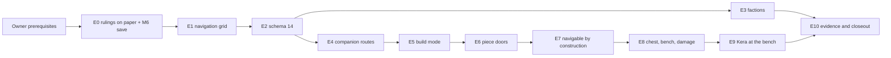

## 10. Implementation slices

This section turns sections 3-9 into eleven vertical slices. Sections 3-9 own every mechanism, name and number used here; this section owns the order, the gates, the STOP conditions and the commit boundaries. Section 11 numbers the acceptance criteria that the slices close, section 12 lists every test with its slice, section 13 owns the runtime proofs, and section 18 owns the order and the owner deadlines.

### Decisions

- Eleven vertical slices, E0-E10. Each ends merged-green and playable (R-1, `docs/ROADMAP.md:15`).
- Presentation ships with the feature it shows. There is no presentation slice.
- One schema bump, 13 → 14, lands in E2. After E2's v14 fixture is committed, schema 14's shape is frozen for M7.
- E2 is the one deliberately horizontal slice. It lands every persisted field empty, required on decode, digested and migrated, before any system writes it.
- The real M6 save is committed at the end of E0, on the M7 branch, while `src/` and `content/` are still `e10d2c4`'s.
- One command table, `CrossingWorkshop.Rows` in `src/Application/Evidence/CrossingWorkshop.cs`, drives the committed start save, the step-group tests and `--build-shots`.
- `--build-shots` grows beat by beat from E1 to E9. The faction beats (E3) and the new-game building beat (E5) go into `--playthrough`.
- Every slice passes one standard gate (§10.3) and the global STOP rules (§10.4).
- A scripted runtime proof STOPs on its first failure. The runs are deterministic, so nothing is re-run to pass.
- No owner question blocks a slice before its latest decision point (section 17). After that point the default stands.
- E10 splits into REQUIRED instrumentation and OPTIONAL instruments. The optional ones are built only when a measurement or the owner's RAZER window calls for them (section 14).
- The owner process prerequisites (§18.1) come before E0's first commit.

### 10.1 Slice overview

| Slice | Name | Size | Depends on | Implements | Owner answer due before it | Closes criteria (section 11) |
|---|---|---|---|---|---|---|
| E0 | The rulings on paper | S | §18.1 prerequisites | section 1's reconciliation; section 7.14's M6 save | Q2 (before commit 2) | 1 |
| E1 | Navigation you can see | L | E0 | section 3: grid, planner, lints, F2 stage "navigation" | - | - |
| E2 | Schema 14, landed once | L | E1 | section 7; section 6.1.9 and 6.1.11 | Q3 | 19 |
| E3 | Factions v1 | L | E2 | section 5; sections 8.13-8.14 | Q5 | 22, 23, 27 |
| E4 | Companion routes and opened doors | M | E2 | sections 3.10-3.11 | - | 5 |
| E5 | Build mode: pads, walls, doorways, roofs | L | E2 and E4 (N-A12 and beat b18 need Nav mode) | sections 4.2-4.8, 4.10-4.11, 4.13 (dismantle), 4.16, 4.18-4.20; 8; 9 | Q1, Q4 | 2, 7, 9, 20, 35 |
| E6 | Piece doors | S | E5 | section 4.9 | - | 3, 10, 11 |
| E7 | Navigable by construction | M | E6 | sections 3.13, 4.17 | - | - |
| E8 | Chest, bench, blows and mending | M | E7 | sections 4.12-4.14 | - | 16, 18, 26 |
| E9 | Kera works at your bench | L | E8 and E4 | sections 3.12, 4.15 | - | 4, 6, 8, 12, 13, 14, 15, 17, 24, 25, 28, 30, 36 |
| E10 | Evidence and closeout | M | E9 and E3 | section 14 (required set); sections 15, 16 | - | 21, 29, 31, 32, 33, 34, 37 |

A criterion closes in the slice after which all its evidence exists; most accumulate evidence across several slices. The E10 closeout table in `docs/M7_STATUS.md` names the final evidence for each.

**Per-slice content.** `LoadAll_Loads_Yaml_Files` gains exactly: E1 +1, E3 +3, E5 +7, E6 +1, E8 +2. That is 14 M7 definitions. The content lint therefore reports 102 → 103 → 106 → 113 → 114 → 116 definitions, with 0 errors every time.

**Per-slice Crossing Workshop counts** (section 4.22; asserted by the step-group tests and `--build-shots`):

| Slice | After step 1: pieces / timber spent / `StructureSequence` | End of the table: intact pieces / timber carried / `StructureSequence` |
|---|---|---|
| E5 | 16 / 24 / 16 | 20 / 15 / 20 |
| E6 | 17 / 25 / 17 | 21 / 14 / 21 |
| E7 | 17 / 25 / 17 | 21 / 11 / 27 |
| E8 | 19 / 31 / 19 | 23 / 0 (2 in chest 2) / 31 |
| E9 | 19 / 31 / 19 | 23 / 0 (2 in chest 2) / 31 |

**`StateSlice` growth.** 18 values today. E1 adds `Navigation`, E2 `Factions`, E5 `Structures` and E9 `NpcErrands`, reaching 22. Each value lands with its owning system, so `RequireEverySliceOwned` (`Simulation.cs:139`) stays green in every slice. In E2 the piece and errand stores exist in `WorldDelta` without a slice. They are reached only by `FromSnapshot` and `TakeSnapshot` until their owners claim them.

### 10.2 The schema-14 bump and the freeze rule

**Where it lands: E2, once.**
- Schema 14's fields are required on decode, and the fixture policy is mechanical (section 7.1). So M7 needs a bump.
- It needs one bump, not one per feature. Each step needs its own frozen shapes, fixture, `expected.json` regeneration and hard-coded step-list edits (`tests/Persistence.Tests/MigrationTests.cs:78`, `:398`, `:428`; `HistoricalFixtureTests.cs:241`). Three bumps would triple that work and leave two intermediate schemas that no shipped build needs.

**Why E2 comes second.**
- Every M7 feature after the grid writes a persisted field:
  - the companion route (E4);
  - the faction ledger (E3);
  - pieces and `structure_seq` (E5);
  - errands (E9).
- A late bump would let those features hold state that a schema-13 save drops. That would break save-then-continue (`CompanionTests.cs:285`) and R-1's autosave, which runs every 300 s (`src/Persistence/SaveStore.cs:41`).
- A feature flag that hid M7 from saves would be worse. The playable build could not show the feature, and both code paths would need their own tests.
- E1 persists nothing: the grid is derived and never saved, and guard G3 lands in E1.

**The carry rule.** A field that is loaded but has no owning system would be dropped by the next save. So E2 makes every new record survive `Start` → `CaptureRecord` / `TakeSnapshot`:
- `CompanionRecord.Route` goes through both companion copy sites (`Companions.cs:135-141`, `:149-155`).
- Pieces, `StructureSequence` and errands live in `WorldDelta` and survive `TakeSnapshot` (`WorldDelta.cs:520`).
- The ledger is seeded by the `RuntimeState` constructor from `player.Factions`, as `Posture` is (`RuntimeState.cs:102`), and captured by `CaptureRecord` (`Simulation.cs:342-351`). E2's `FactionSystem` only claims `StateSlice.Factions`. It has no `Seed` and no handlers until E3.

**The freeze rule.** When E2 commits the v14 fixture, schema 14's shape is final for M7. A later slice that needs another persisted field, or a changed DTO shape, is STOP S2. Guard G12 (`EveryPersistedField_MovesItsDigest`) and the StateDump compares catch a field that a slice forgot to persist.

**Owner answers and the shape.**
- Q3 is the only owner question that can change a schema-14 shape, and its latest decision point is before E2 (§18.6).
- Q1 changes a value range and derived geometry, not the wire shape. `PieceDto.rotation` is an `int`, and its range is checked at apply (section 7.7).

### 10.3 The standard gate (every slice: "merged-green")

Run from the repository root:
1. `dotnet build src/UNNAMED.sln`: 0 errors, and 0 warnings in Presentation (the M6 bar, `docs/M6_STATUS.md:169`).
2. `dotnet test src/UNNAMED.sln`: all green. CI runs the same on `ubuntu-latest` (`.github/workflows/dotnet.yml`); the draft PR's CI is the merged-green signal.
3. The content lint (AGENTS.md command): 0 errors, with the definition count of §10.1.
4. Godot 4.7.2: the headless `--smoke` PASS and the `--quit-after 300` boot check. Both run on ASTRAL; CI has no Godot (`docs/M3_STATUS.md:88`).
5. The slice's own runtime acceptance, plus every scripted run that exists: `--build-shots` with all its landed beats (from E1), and M6's `--playthrough` with verify and a second run, `--ui-shots` and `--delta-shots` (every slice).
6. `docs/M7_STATUS.md` gains the slice's row:
   - commits;
   - test counts per project;
   - the lint definition count;
   - each runtime run with its field counts and its replay hash;
   - the per-slice workshop counts where they apply;
   - any accepted residue.

Every commit inside a slice builds and passes `dotnet test`. The only exception is E2's bump commit, which is atomic by necessity (§10.8). Merging to `main` is the owner's, at the milestone gate.

### 10.4 Global STOP rules (any slice)

On any of these, stop, write the finding into `M7_STATUS`, and report to the owner. Never route around a STOP.

| # | STOP when | Detected by |
|---|---|---|
| S1 | An existing test must change beyond the edits §12.10 lists by name | review of the diff under `tests/` |
| S2 | After E2, a new persisted field or a changed DTO shape is needed | G12; the StateDump compares; review of `SectionCodec.cs` |
| S3 | A Godot type, a clock read (`Stopwatch`, `DateTime.Now`, `DateTimeOffset.UtcNow`) or a wall-clock ID mint is needed in `src/Domain` (outside `EntityId.NewId`), `src/World` or `src/Application` | `OnlyPresentation_MayReferenceGodot`, `AuthorityNeverReadsAClock`, G8 |
| S4 | An older fixture's `expected.json` diff contains anything beyond section 7.12's lines | the E2 review |
| S5 | A scripted runtime proof fails once: a beat over its tick budget, an exception, an in-beat assertion, a verify difference, a second run whose `state_replay.json` differs, or a companion catch-up that the slice cannot name | the run's transcript. The runs are deterministic; a failure is never re-run to pass |
| S6 | An owner answer that arrives before its question's latest decision point contradicts a default the slice builds | §18.6. After the point the default stands, and a late answer is recorded for a later milestone |
| S7 | A CI budget assert fails at its 3× multiple | N-A10, T2 |
| S8 | A DeepSeek-owned path (AGENTS.md: `tools/asset_pipeline/**`, `tools/godot_validate/**`, `docs/WAVE_0_*.md`, `docs/ANIMATION_*.md`, `docs/CANONICAL_BODY_AND_SKELETON.md`, `docs/ASTRAL_HOST.md`, `assets/`), or a file section 9.1 keeps untouched (`src/Presentation/Art/**`, `Audio/**`, `HollowView`, `CraftingView`, `ItemsView`, `NpcsView`), would have to change | review |
| S9 | A part section's rule cannot be implemented as written without inventing a rule, or two sections of this document contradict each other on something the slice needs | the implementer. Report both readings; never pick silently |
| S10 | A number this document states as asserted differs from the implementation: a per-slice count, a refusal order, a reason text, an arrival or crossing bound | the named test |

**Not a STOP.**
- A `[model]` or `[bench]` figure that differs from the measurement, unless it breaks an asserted bound. The measured value is recorded in `M7_STATUS`.
- A waypoint that snags in a scripted run's first green run. That is a script fix, not a design change.
- A later lint (FAC001 in E3; BLD001-BLD009 in E5, E7, E8 and E9) that rejects the current fixture pack. The pack is fixed under 0.2.10 (0.2.11 for a second such slice). The same commit updates `Fixtures.ContentVersion`, `CurrentContentVersion`, `CurrentContentHash`, the probe mirror, the `_aliases.yaml` header and README policy 4. The lint is never relaxed, and no `expected.json` changes (section 7.11).
- A NAV006 refusal of new shipped layout content (the timber stack in E5). The content moves, and the lint stays.

### 10.5 Commit and branch discipline

- Commit messages name the slice and the commit, for example `M7 E5.3: BuildingSystem, the Space switch and SightWalls`. They carry the attribution the owner's convention requires.
- A slice ends with its `M7_STATUS` row and a green draft-PR CI.
- The branch, worktree and draft-PR convention are the ones the owner names in §18.1. The agent merges nothing to `main` and tags nothing. R-1's tag is the owner's, at merge, or the owner waives it (E10).
- The GitHub repository is public, so anything pushed is published. Videos and raw captures stay outside the repository, as M6's did (`docs/M6_STATUS.md:76`).

### 10.6 E0 - The rulings on paper

**Precondition.** The owner has authorized M7 and named the implementing agent, the worktree, the branch and the draft-PR convention (§18.1). No E0 commit exists before that.

**Purpose.** Write owner rulings 1 and 2 and the M7 reconciliation into the normative documents before any code exists. Then no later agent follows WORLD_ARCHITECTURE §11's baked navmesh or RK-14's "needs the engine". E0 also commits one real M6 save while the code is still M6's.

**Code areas.** None under `src/`, `content/` or the test projects' sources. The one-off M6-save writer runs from an uncommitted test file, and its source is copied into the save's README (the v1 precedent, `tests/Persistence.Tests/Fixtures/README.md:97-120`).

**Documents.** Every amended paragraph carries the marker `M7 reconciliation (2026-09-24)`, so the checklist can find it.

| Document | Change |
|---|---|
| `docs/DECISIONS.md` | New dated entries: `## D-13 — Navigation: a domain grid, deterministic and headless (owner ruling 2026-09-24)` (ruling 1: domain-side, deterministic, headless, replayable, derived from authoritative state, rebuilt on building edits, seam-independent; Godot navigation never authoritative) and `## D-14 — Building: one storey (owner ruling 2026-09-24)` (ruling 2: no upper floors, stairs, lifts, climbing, vertical navigation, voxel or structural physics; socket/snap). A dated D-04 note with section 4.18's "Derived identities …" text. A dated D-08 note: quarter turns on a 3 m lattice, pending Q1 |
| `docs/WORLD_ARCHITECTURE.md` | §5: cells never partition movement or navigation. §10: one storey; pieces are rows; navigability is validated, not guaranteed by snapping. §11: the navmesh row (`:435`) leaves the presentation table and becomes a derived domain grid, never saved; the collision row (`:137`) no longer names a navmesh. RK-A2 (`:469`): "to be proven in M7 by a seam-free domain grid" |
| `docs/RISK_REGISTER.md` | RK-14 (`:290`) drops "needs the engine": it is validated by headless tests plus a runtime recording, with likelihood unchanged until E10. RK-06's "navmesh rebuild" becomes "domain grid restamped per footprint change". A new accepted-risk row for one storey |
| `docs/PERSISTENCE.md` §2 | The navigation grid is derived, rebuilt in the `Simulation` constructor and on each footprint change, and never saved. A mover's committed route is mover state, and is saved |
| `docs/SYSTEMS.md` | `:443` (live pathing state): "search state, grids and caches are never persisted; a mover's committed route is mover state, saved with the body it moves". S-25 (`:288`): "Path following state" becomes "persisted route". S-32 (`:356`): "navmesh dirty regions" becomes "navigation dirty rectangles" |
| `docs/ROADMAP.md` M7 (`:278-286`) | The section 1 scope: "navmesh" read as the domain navigation grid; ground pads, one storey; quarter turns (Q1); crime, bounty, pardon and territory gating deferred to Phase 3, with the act log and gate-access sets as the seams (Q2); one work-anchor assignment (Q3); one build area crossing a seam (Q4); straddling required; the entry criterion met inside M7 by E1 and E4 |
| `docs/GAMEPLAY_LOOPS.md` `:282` | The conflict is recorded: property threats and the attack-frequency option are M10's |
| `docs/PHASE1_ASHEN_HOLLOW_PLAYABLE_CONTENT_BIBLE.md` `:1080` | "player settlement building" is superseded for M7 by the one build area (Q4) |
| `docs/PROTOTYPE.md` A-2 (`:110`, `:395`) | A dated note: no `faction_id` field exists or is saved. M7 adds `faction_ref` as static content (section 5.9). E3 writes the as-built text |
| `docs/HUD_INPUT_AND_ACTIONS.md` `:36` | Radials are optional mirrors and never required (ruling 5) |
| `docs/IMPLEMENTATION_PRECEDENCE_AND_DESIGN_STATUS.md` `:156`, `:321` | Cite the 2026-09-24 ruling: the feel test is not an M7 entry blocker |
| `docs/M7_STATUS.md` (new, in the M6 form) | Rulings as applied; the slice table (§10.1); the owner questions with their defaults and latest points; an empty scope ledger; the local-risk table; the E0 checklist with the owner's sign-off line |
| `AGENTS.md` | "Current status": M7 in progress, rulings 1 and 2 recorded. "Where the code is": `tests/Application.Tests/Saves/` holds committed game saves; never edit them |

**The M6 save** (section 7.14):
- It goes to `tests/Application.Tests/Saves/m6_hollow/quick/**`.
- It is written by the one-off writer: `Arena.OpenCreatures(…, keepSpawns: true)`, the `StateDumpTests.Played` waypoints, `door.forge_shed` opened, the flask moved into `container.waystation_chest`, and `SaveStore.Save(SaveSlots.Quick, …)`.
- A `README.md` beside it holds the writer's source, the commit, the manifest's `schema_version` 13, its content hash and its `worldgen_fingerprint`.
- `.gitattributes` gains `tests/Application.Tests/Saves/*/quick/** binary`. It is written before the save files are staged.

**New authoritative data, commands, events, content, persistence, presentation.** None.

**Tests.** None new. The suite stays green and unchanged.

**Runtime acceptance.** The standard gate on the unchanged build.

**The E0 checklist** (run from the repository root; recorded in `M7_STATUS` with the owner's sign-off):

| # | Command | Expected |
|---|---|---|
| 1 | `grep -c "^## D-13 " docs/DECISIONS.md` and `grep -c "^## D-14 " docs/DECISIONS.md` | 1 and 1, each heading dated 2026-09-24 |
| 2 | `grep -c "Derived identities" docs/DECISIONS.md`; `grep -c "quarter turns" docs/DECISIONS.md` | ≥ 1; ≥ 1 |
| 3 | `grep -c "Recast" docs/WORLD_ARCHITECTURE.md` | 0 |
| 4 | `grep -n "RK-A2" docs/WORLD_ARCHITECTURE.md` | the row reads "to be proven in M7 by a seam-free domain grid" and does not say "solved" |
| 5 | `grep -c "needs the engine" docs/RISK_REGISTER.md` | 0 |
| 6 | `grep -c "Navigation grid" docs/PERSISTENCE.md` | ≥ 1 |
| 7 | `grep -c "navmesh dirty regions" docs/SYSTEMS.md`; `grep -c "navigation dirty rectangles" docs/SYSTEMS.md`; `grep -c "Path following state" docs/SYSTEMS.md` | 0; 1; 0 |
| 8 | `sed -n '/^### M7/,/^### M8/p' docs/ROADMAP.md \| grep -c "domain navigation grid"`, and the same with `ground pad` and `deferred` | ≥ 1 each |
| 9 | `grep -l "M7 reconciliation (2026-09-24)" docs/*.md` | exactly: DECISIONS, WORLD_ARCHITECTURE, RISK_REGISTER, PERSISTENCE, SYSTEMS, ROADMAP, GAMEPLAY_LOOPS, the content bible, PROTOTYPE, HUD_INPUT_AND_ACTIONS, IMPLEMENTATION_PRECEDENCE_AND_DESIGN_STATUS |
| 10 | `test -f docs/M7_STATUS.md && grep -c "E0 checklist" docs/M7_STATUS.md` | ≥ 1 |
| 11 | `grep -c "tests/Application.Tests/Saves/" AGENTS.md` | ≥ 1 |
| 12 | `grep -E -c '"schema_version": ?13' tests/Application.Tests/Saves/m6_hollow/quick/manifest.json`; `grep -c "worldgen_fingerprint" tests/Application.Tests/Saves/m6_hollow/README.md` | 1; ≥ 1 |
| 13 | `grep -c "tests/Application.Tests/Saves/\*/quick/\*\* binary" .gitattributes` | 1 |
| 14 | `git diff --stat <E0 base> -- src content ':(glob)tests/**/*.cs'` | empty |

**Non-goals.** No as-built text: DATA_MODEL shapes, PERSISTENCE §5 fields and SYSTEMS S-27/S-32 detail land with their slices. No "solved" or "proven" claims.

**STOP.**
- Any checklist line misses its expected result.
- A ruling contradicts rank-2 text in a way section 1.3 does not resolve.
- The M6-save writer needs a code change.
- Q2 is answered "a minimal stub" before commit 2 (S6).

**Commits.**
1. DECISIONS, WORLD_ARCHITECTURE, RISK_REGISTER, PERSISTENCE §2, SYSTEMS.
2. ROADMAP, GAMEPLAY_LOOPS, the bible note, the PROTOTYPE A-2 note, HUD_INPUT_AND_ACTIONS, IMPLEMENTATION_PRECEDENCE. This commit comes after Q2's latest decision point.
3. `M7_STATUS.md` and AGENTS.md.
4. The M6 save, its README and the `.gitattributes` line.

### 10.7 E1 - Navigation you can see

**Purpose.** The derived, integer, seam-free grid and the planner exist over authored content. The grid is visible in F2 and proven headless. Nothing new is saved.

**Code areas.**
- **Domain, `src/Domain/Spatial/`** (namespace `UNNAMED.Domain.Spatial`, integer only):
  - `NavConfig.cs`, `NavGeometry.cs`, `NavInputs.cs`, `NavTile.cs` and `NavGrid.cs` (`Build`, `With`, `Walkable`, `WindowStamp`, `Digest`);
  - `NavScratch.cs` (lazy, with the generation wrap);
  - `NavSearch.cs` (`NavAgent`, `NavQuery`, `NavOutcome`, `NavPlan`, `Plan`);
  - `NavRoute.cs` (`NavPoint`, `NavRect`, `NavRouteStatus`, `NavRoute` with its validating factories, `Advance`, `ProblemOf`, `AddTo` and value equality);
  - `NavCounters.cs`.
  - `NavFollower.cs` lands in E4 and `NavEditCheck.cs` in E7.
- **Content:**
  - `content/config/navigation.yaml` (section 3.16, `max_expansions: 65536`, the `person` class only);
  - `src/Content/NavigationContent.cs` with `Validate` (NAV001-NAV007) and `Build`, hooked in `ContentLoader.LoadAll` after `QuestContent` (`ContentLoader.cs:195`);
  - the config is optional: when it is absent, `NavConfig.Default` applies.
- **World:**
  - `RuntimeState`: `StateSlice.Navigation`, `Navigation` and `SetNavigation`;
  - `src/World/Runtime/Navigation.cs`: `NavigationSystem` with `Build()`, `View()`, `CurrentInputs()` and `Reachable(...)` (first called in E9). It holds the authoritative scratch and a `NavCounterSink`;
  - `Simulation`: `SimulationSetup.Navigation` (init, default `NavConfig.Default`); `_navigation` composed right after `_crafting`; `_navigation.Build()` after `_effects.Seed` (E5 inserts `_building.Populate()` before it); the get-only `Navigation` view.
- **Application:** `GameSession.Boot` sets `Navigation = NavigationContent.Build(loader)` (`GameSession.cs:88-99`).
- **Presentation:**
  - `Greybox/NavigationOverlay.cs`: person-unwalkable nodes within 24 m, and gates coloured by state;
  - `Ui/StructureDebugPanel.cs`, holding only the navigation block for now;
  - `Main`: the `build_debug` action on F2 (Off → Navigation → Off) and its F1 DEVELOPER row;
  - `BuildShots.cs`, wired like `--delta-shots` (the value list `Main.cs:1045`, the scratch-profile branch `:88-91`, the seed `:103`, one tick a frame `:305`, the input guard `:342`). Until E5 it starts a new game at `Playthrough.Seed`.

**New authoritative data.** None saved. The grid is transient and derived.

**Commands and events.** None. `RoutePlanned` arrives in E4, and `RebuildNavigation` and `NavigationRebuilt` in E5.

**Content.** `config.navigation` (+1 ID). The fixture pack is untouched until E2.

**Persistence.** None.

**Tests.**
- Domain: N-D1, N-D3, N-D4, N-D5 (authored gates), N-D6, N-D9, N-D11, N-D12, N-D13, N-D14, N-D15, N-D16, N-D21, N-D22.
- World: N-W1, N-W2, N-W3; the test helper `TestWorlds.HollowSetup()`, which builds `SimulationSetup` from `content/` for World.Tests (§3.20).
- Application: N-A1; N-A10 (the full build, and every authored protected-point pair).
- Content: N-X2 (+`config.navigation`), N-X3, `NavConfigDefault_IsTheShippedFile`.
- Architecture: N-X1; G3 `PersistenceNeverReferencesTheNavigationGrid`; G4 `PresentationUsesNoGodotNavigation_OutsideTheSpike`; G5 `SystemsNeverSubscribe`; G8 `M7SystemsMintNoWallClockIds` over `Navigation.cs`; G15 `CountersAreNeverRead`; G24 `M7Code_NamesItsComparers` over `Nav*.cs` and `Navigation.cs`; G25 `NavigationGridBytes_AreNeverUnwrapped`; `AuthorityNeverReadsAClock`.

**Runtime acceptance.** The standard gate, plus `--build-shots` beats b01 and b02 (§13.4), exit 0.

**Non-goals.** No follower, mover, edit check, rebuild dispatch or creature pathing. No Godot `Navigation*` type.

**STOP.**
- N-D9 or N-D11 fails. They carry the design's load-bearing claim.
- NAV006 or N-A1 fails on shipped content. Report it; never loosen the margin or the reach-point rule.
- N-A10 on ASTRAL shows any of these (section 3.18):
  - the full build at 20 ms or more;
  - an authored-pair route that is not `Found`;
  - a route over 43,690 expansions;
  - a mean plan of 2 ms or more.

**Commits.**
1. Domain types and Domain tests.
2. Content and lints.
3. Runtime, the World and Application tests, and the guards.
4. Overlay, panel and `--build-shots`.

### 10.8 E2 - Schema 14, landed once

**Purpose.** Every M7 persisted field exists, is required on decode, is digested and is migrated, before any system writes it. A real M6 save loads into this build.

**Code areas.**
- **Domain:**
  - `EntityId.Derived(EntityKind, long ordinal, string tag, string salt)` beside `Create`, with the doc comments on `Create` and `Timestamp` amended (L9);
  - `EntityKind.Piece` (`pce`), appended after `Character`;
  - `src/Domain/Factions/Factions.cs`, **record types only**: `ActKinds`, `KnowledgeSources`, `Identities`, `ActRecord`, `FactionKnowledge`, `FactionStanding`, and `FactionLedger` (`Empty`, `MinPoints`, `MaxPoints`, `OrdinaryFloor`, the `With*` methods, value `Equals`/`GetHashCode`).
- **World:**
  - `WorldDelta`: `PieceRecord`, `NpcErrandRecord` and `NpcErrandPhase`; their stores, the public readers `Piece`, `PiecesIn`, `Pieces`, `StructureSequence`, `NpcErrand` and `NpcErrandsIn`, and the internal mutators (section 6.1.9);
  - `TakeSnapshot`; the `FromSnapshot` order (section 7.7); `TryApplyPiece`, `TryApplyNpcErrand` and the `container.pce_*` clause of `TryApplyContainer`; `EffectiveCellDigest` v2;
  - `PlayerRecord.Factions` with its validation, carried by all seven `With*` methods; player digest v10;
  - `CompanionRecord.Route`, carried at both copy sites;
  - `Simulation.StateDigest` v2;
  - `StateSlice.Factions`, claimed by a claim-only `FactionSystem`, seeded in the `RuntimeState` constructor and read back by `CaptureRecord`.
- **Content:** kind `piece` in `SchemaResolution`, the `piece_ref` suffix in `ContentChecks`, and `pieces` among the known directories.
- **Persistence** (section 7 exactly):
  - `Sections/SchemaV13.cs`;
  - the four repoints (`Migrations.cs:566`, `:701`, `:722`; `Sections/SchemaV12.cs:32`);
  - the new DTOs and `SchemaV13ToV14`;
  - `SaveFormat.SchemaVersion = 14` (`SaveModel.cs:20`);
  - the codec: the `Route` and `RouteDto` helpers, and `Prove`'s label parameter;
  - `DecodeEntitySection` returns a `DeltaSnapshot`;
  - `SaveLoader`: the decode site's `with`; the definition-ID pass's M7 rows (the spill, the errand fix-up, the zero-merge Warning, the `via` Warning, and `ArgumentException` → Blocker); `ProveBaselines`;
  - `SemanticRebase` rewritten with `with`;
  - for G11's test: `<InternalsVisibleTo Include="Persistence.Tests" />` in `src/Persistence/Persistence.csproj`, and `SaveLoader.ResolveDefinitions` (`SaveLoader.cs:206`) changed from private to internal. G11 calls it and the internal `SemanticRebase.Apply` (`BaselineTransitions.cs:31`) from Persistence.Tests.
- **Test data** (section 7.11-7.12):
  - `M2.Probe`'s v14 player and world;
  - the writer pack `Fixtures/content-0.1.7`;
  - `Fixtures/content` 0.2.8 → 0.2.9, with both aliases and `npc.fixture.smith` at (32, 70);
  - `v14/quick`, and the 13 older `expected.json` regenerated in one run;
  - `CanonicalState`, the version constants and the probe mirror.

**New authoritative data.** Every schema-14 field (section 7.2). All of them are empty in live play.

**Commands and events.** None.

**Content.** No shipped definition. The fixture packs only.

**Persistence.** The bump. There is no new section file, and `SaveFormat.Current` and `CheckedFiles` do not change.

**Presentation.** None.

**Tests.**
- `EntityIdDerived_IsStable_AndOrdersLikeItsOrdinal`.
- The guards: G11 `EveryDeltaSnapshotProperty_SurvivesDecodeTheDefinitionPassAndTheRebase`; G12 `EveryPersistedField_MovesItsDigest`; G28 `NavRoute_AndFactionLedger_EqualByValue_AfterADecode`.
- Every section 7 test marked E2 in §12.6.
- `ACompanionRoute_SurvivesPopulateAndCapture` and `TheFactionLedger_SurvivesStartAndCapture`.
- `AnM6Save_LoadsIntoM7_WithNothingBuiltNeutralStandingNoErrandAndNoRoute`, with its E2 rows.
- The permitted edits: `ASaveAndALoad_CompareEqual_FieldByField` (+2 leaves), `WorldDelta_ExposesNoPublicMutation` (+ the six readers as reflection names them), `TheWritersContentIdentity_IsItsFixturePack` (0.1.7), `TheProbesContentMirror_IsTheFixtureContentPack` (0.2.9), the `HistoricalFixtureTests` alias arms and M7 block, and the `MigrationTests` step lists and deconstructions.

**Runtime acceptance.**
- The standard gate. The smoke's save round trip now runs at schema 14.
- `--playthrough`, then `--playthrough-verify`: every beat passes, and `state_diff.txt` shows 0 differences over about 427 fields (section 7.9: 415 + `StructureSequence` + `NextActSeq` + 10 for Tavar's `None` route). The count is recorded; 0 differences is the criterion.
- A second `--playthrough` run gives a byte-identical `state_replay.json`.

**Non-goals.**
- No system writes pieces, errands, routes or acts.
- No `StateDump` piece-chest mask (E8).
- No FAC or BLD lints.
- No transition and no layout fingerprint (L3).

**STOP.**
- S4.
- Any byte of `v1..v13/quick/**` or of `content-0.1.0 … 0.1.6` changes.
- A frozen type's wire shape differs (the v8-v13 fixtures decide).
- `AnM6Save_…` finds `CellsRebased` non-empty, or a worldgen fingerprint that differs from the running one.
- Q3 is answered "move to M10" before E2 starts (S6). E2 then drops `npc_errands` and `NpcErrandRecord` from the shapes, and E9 is replanned (§18.6).

**Commits.**
1. Records, digests, the claim-only `FactionSystem`, G12 and F-E4 (on a test-built `PlayerRecord`). Green, with no save change: no digest is persisted.
2. The freeze and the repoints. Byte-identical.
3. **One commit:** the bump, DTOs, codec, loader, packs, probe, v14 fixture, every expectation, F-E4's v14-fixture-player case, G11 (with the `InternalsVisibleTo` line and the internal `ResolveDefinitions`), G28, and the corrupt, quarantine and definition-pass tests. The fixture-count test is red between these halves, so they cannot be split.
4. The M6-save test's E2 rows.
5. Documents: section 7.16's PERSISTENCE rows, DATA_MODEL §6 rule 1, and the fixture README.

### 10.9 E3 - Factions v1

**Purpose.**
- Acts are recorded.
- A faction learns an act only when the player reports it to a member, and what it learns moves that faction's standing.
- Two gates work: Sel's `notes` reply and Kera's iron billets.
- F6 shows the ledger.
- The generated table proves "the same act moves two factions in opposite directions in a fixture" (`docs/ROADMAP.md:284`).

**Code areas.**
- **Domain:**
  - `Factions.cs` gains `Reaction`, `Relation`, `FactionDefinition`, `StandingTier`, `StandingLadder` (`Keys`, `Default`, `LevelOf`, `StandingTierOf`), `StandingRequirement`, `Learned`, and `FactionRules` (`Learn`, `Compact`, `PointsOf`);
  - `src/Domain/Social/Social.cs`: `NpcDefinition.FactionId`, `ReputationCondition`, `ActDoneCondition`, `ReportActConsequence`, `IDialogueFacts.StandingLevel` and `ActDone`, and two `DialogueRules.Holds` arms;
  - `src/Domain/Items/Items.cs`: `MerchantStock.Requires`;
  - `src/Domain/Quests/Quests.cs:154-155`: the `NotBuilt` reason text only.
- **Content:**
  - `src/Content/FactionContent.cs` (FAC001 `Validate` and `Build`), hooked after `NavigationContent` (E5 inserts `BuildingContent` between them);
  - `SocialContent`: `faction_ref`, the `reputation` and `act_done` arms, `report_act`, and the `add_reputation` refusal;
  - `ItemContent`: `requires`.
- **World:**
  - `src/World/Runtime/Factions.cs`: `FactionSetup` (`IsRelevant`, `ReactorsTo`), `RecordAct`, `ReportAct`, the `FactionSystem` handlers, the three events and the views;
  - `RuntimeState.StandingOf`;
  - `Simulation`: the `RecordAct` and `ReportAct` dispatch arms, and the `Factions` and `Acts` views;
  - `RecordAct` in `CreatureSystem.Die` right after `RecordDeed` (`Creatures.cs:705-706`, with the `if` braced), and in `InteractionSystem.Work` after an accepted `SetWorldFlag` (`Systems.cs:288`);
  - `DialogueSystem`: the `ReportActConsequence` arm; `StandingLevel` and `ActDone` in `DialogueSystem` and `SpeakerFacts`, implemented explicitly;
  - `TradeSystem.Withheld` in `Handle(BuyCommand)` and `View`;
  - the `QuestDebugger.DescribeCondition` arms;
  - the fake at `tests/Domain.Tests/DialogueRulesTests.cs:12`.
- **Application:** `GameSession.Boot` sets `Factions = FactionContent.Build(loader)`.
- **Presentation:**
  - `Ui/FactionDebugPanel.cs` and the `faction_debug` action on F6, with its F1 DEVELOPER row;
  - the HUD log line on every `ReputationChanged` whose source is `reported`;
  - `Playthrough.Record` subscribes to `ActRecorded`, `FactionLearned` and `ReputationChanged`, and gains the faction beats (§13.7);
  - a new `Engage(defId)` helper, because `Defend()` skips sentinels (`Playthrough.cs:614`).
- **Not in E3:** `SightWalls()`. Factions read no sight in M7 (L1), so the helper and its three call sites land in E5 with `Space`.

**New authoritative data.** The ledger, which fills E2's field.

**Commands.** Internal `RecordAct` and `ReportAct`. Changed semantics: `ChooseCommand` (`report_act`) and `BuyCommand` (the billet gate).

**Events.** `ActRecorded`, `FactionLearned`, and `ReputationChanged` with `string? Via`.

**Content.**
- `config.factions`, `faction.ashen_hollow.waystation` and `faction.ashen_hollow.survey` (+3 IDs);
- `faction_ref` on Renn, Kera and Sel;
- Kera's billet stock row, appended last;
- Kera's and Sel's new replies and nodes (DRAFT text), and `report_act` on both of Sel's `tavar_back` replies.

**Persistence.** None new. `AnM6Save_…` gains its E3 rows. The 0.2.10 rule applies if FAC001 rejects the fixture pack.

**Tests.**
- Every section 5 test (§12.4), with `docs/M7_REPUTATION_TABLE.md` generated and committed.
- G2 `PresentationSource_NeverDerivesStanding`.
- G6 `TacticalCode_NeverReadsFactionState`, over `Combat.cs`, `Creatures.cs`, `Companions.cs`, `Magic.cs`, `Navigation.cs`, `src/World/Runtime/Quests.cs` and `src/Domain/Quests/Quests.cs`.
- G8 and G24 extended to `Factions.cs`.
- G5's `AViewThatListensToEverything_SeesExactlyWhatHappened_AndWritesNothing`, extended to the three events.
- G27 `ConstructionAndLoad_PublishNoM7Event`, over the event types that exist so far.
- `DescribeCondition_NamesStandingAndActDone` (section 2.18): F4 gives §5.7.1's wording for both new arms, never the `ToString()` fallback.
- Unchanged: `BuyingAndSelling_MoveCoinAndGoodsExactly_AndRefuseCleanly`.

**Runtime acceptance.**
- The standard gate.
- `--playthrough` with the six faction beats between `follow` and `ward` (§13.7):
  - every beat passes;
  - M6's transcript rows appear in order, with only M7 rows added;
  - verify shows 0 differences over about 500 fields (§13.8);
  - a second run gives a byte-identical `state_replay.json`.
- `--ui-shots` and `--delta-shots` exit 0.

**Non-goals.** The witnessed channel (M9). Crime, bounty, pardon, legal status, territory, war state, decay, rumour, joining, a faction screen, building acts and reputation quest rewards (section 5.20).

**STOP.**
- An existing dialogue, quest or trade test needs an edit (S1).
- Any faction beat fails once (S5). For `m7_armour`, report with the transcript and the owner's two options (§13.7).
- G6 finds a reference in tactical code.
- FAC001 rejects shipped content.

**Commits.**
1. Domain rules and their tests.
2. Content, FAC001 and the content tests (and the 0.2.10 bump, if needed).
3. Runtime hooks, gates, Application tests and guards.
4. The table generator and the committed table.
5. F6, the HUD line and the playthrough beats.
6. As-built documents: SYSTEMS S-27; DATA_MODEL §4.12, §4.13 and §4.15; PROGRESSION §10; PROTOTYPE A-2 as built; the INDEX CRIME row; VERTICAL_SLICE `:95` and `:169` flagged (section 5.18).

### 10.10 E4 - Companion routes and opened doors

**Purpose.** The entry criterion "companions path reliably". Tavar plans when his trail gives him no goal, and he opens authored doors. The M6 companion tests stay green without modification.

**Code areas.**
- **Domain:** `NavFollower.cs` (`NavStepKind`, `NavStep`, `Next`, with trigger 7 as section 3.7.6 defines it).
- **World:**
  - `NavigationSystem.Follow` and the `RoutePlanned` event;
  - the internal `OpenDoor(string DoorKey, string NpcId)`, handled by `InteractionSystem` for authored doors, for companions only until E9;
  - the close refusal (`Systems.cs:266-267`) extended to every `State.Npcs` body and every living creature, for authored doors;
  - `SystemContext.PersonObstacles(npcId)`, moved verbatim from `Companions.cs:570-581`;
  - `CompanionSystem`:
    - Route and Nav modes in `Follow` (section 3.11);
    - an `OpenGate` step dispatches `OpenDoor`, and a refusal adds 1 to `StuckTicks`;
    - `Route` resets at follow_near, Direct, `Order`, downed, `Up`, `CatchUp` and `Fall`;
  - `Simulation`: `Dispatch(OpenDoor)` → `_interaction`; `NavigationView.Movers` gains the companion.
- **Presentation:**
  - the F2 overlay draws route polylines and trail marks, and the panel lists movers and the last `RoutePlanned`;
  - `Playthrough.Record` notes each `RoutePlanned` as one row.

**New authoritative data.** `CompanionRecord.Route` is now written. The field has existed since E2.

**Commands.** Internal `OpenDoor`.

**Events.** `RoutePlanned`, and `DoorToggled` reused with an NPC actor.

**Content, persistence.** None.

**Tests.**
- Domain: N-D2, N-D7, N-D8, N-D10, N-D17, N-D18.
- Application: N-A11; N-A6 part (a), the companion; the authored-door half of `NoDoorCloses_OnAnyBody`; `HisState_RoundTripsThroughASave_FieldByField_AndGoesOnTheSame`, which gains the route assertion.
- G5's view test and G27 gain `RoutePlanned`.
- **Unmodified and green:** C16 `ThroughTheLodgeAndRoundIt_NoSnagHoldsHimFifteenSeconds` (`CompanionTests.cs:119`), `FollowWaitFollow_…` (`:87`), `LeftFarBehind_…` (`:179`), every other `CompanionTests` case, `AScripted200CommandSession_ThroughFrames_EqualsItsReplayThroughTheCommandBus`, and `SixtyCreatures_TickWithinTheBudget`.

**Runtime acceptance.**
- The standard gate.
- `--playthrough`:
  - the `follow` beat has 0 "caught up" rows;
  - the transcript rows up to and including `follow` equal E3's byte for byte, except for added `RoutePlanned` rows;
  - verify shows 0 differences;
  - a second run gives a byte-identical `state_replay.json`.

**Non-goals.** Piece doors (E6), the errand mover (E9), closing doors, the `Recruit` refusal (E9), creature pathing, and a per-tick plan budget.

**STOP.**
- Any existing companion test fails, or needs an edit other than the route assertion §12.10 permits in `HisState_RoundTripsThroughASave_FieldByField_AndGoesOnTheSame`.
- C16 needs a catch-up.
- The `follow` beat catches up.
- A transcript row other than a `RoutePlanned` row differs from E3's.

**Commits.**
1. The follower and Domain tests.
2. `OpenDoor`, the all-bodies close refusal and `PersonObstacles`, with their tests (neutral for the player).
3. Route mode and its tests.
4. Overlay and panel.

### 10.11 E5 - Build mode: pads, walls, doorways, roofs

**Purpose.** "Build a structure" works in the playable build. The player places and takes down pads, walls, doorways and roofs in `build_area.hollow_crossing`, with timber from the authored stack. Collision, sight and the navigation grid follow every edit: "the navmesh updates on placement", as reconciled. Pieces are saved as rows.

**Code areas.**
- **Domain:**
  - `src/Domain/Building/Building.cs`: definitions, `BuildingCatalog`, `BuildingConstants` (with `Problem()` and BLD009's ceilings), `Lattice`, `QuarterTurn`, `BuildingMath`, `PiecePose`, `Snapper`;
  - `src/Domain/Spatial/StructureFootprints.cs`: `TraversalClass`, `NavFootprint` (no `DoorOpen`), `StructureOrder`;
  - `RegionLayout`: `BuildAreaSite`, `BuildAreas`.
- **Content:**
  - `src/Content/BuildingContent.cs` (`Build` → `BuildingSetup`; BLD001-BLD004, BLD006, BLD007, BLD009);
  - WLD015 in `WorldContent`;
  - the validator order after `QuestContent` becomes `NavigationContent`, then `BuildingContent`, then `FactionContent`.
- **World:**
  - `StateSlice.Structures` and its `RuntimeState` wrappers (`PlacePiece`, `SetPiece`, `RemovePiece`, `SetStructureDerived`, `SetStructureAudit`, `SetClosedPieceLeaves`);
  - `src/World/Runtime/Building.cs`: `BuildingSystem` with Place, Dismantle, `Populate`, `Rebuild` and `RemoveCore(Dismantled)`;
  - `src/World/Runtime/BuildingRules.cs`: `PlacementContext` and `Validate`. Checks 1-14 are live; check 15 answers `NotApplicable` for pads and roofs and `NotChecked` otherwise, until E7;
  - `SystemContext.Space` and `StructureFootprints`;
  - `SystemContext.SightWalls()`, which replaces the three copies at `Combat.cs:569-570`, `Companions.cs:597-598` and `Creatures.cs:893`;
  - the `Space` switch at every site of section 6.5.2 (`Systems.cs:140`, `:160`, `:216`; `Creatures.cs:588`, `:623`, `:837`; `Companions.cs:372`, `:398`, `:567`). `Creatures.cs:173` is not switched and gains a one-line comment;
  - `NavigationSystem.Handle(RebuildNavigation, tick)` through `NavGrid.With`, publishing `NavigationRebuilt`; `CurrentInputs()` reads `StructureFootprints`;
  - the internal accessors `NavigationSystem.Scratch` and `NavigationSystem.Counters`, which the command path's `PlacementContext` uses;
  - `InventorySystem.Put`'s merge order (`Items.cs:576`, `:600`) becomes (count desc, `ItemId` ordinal), and check 14 takes stacks by (quality asc, count asc, `ItemId`);
  - `Simulation`:
    - `_building` composed after `_navigation`, which it receives;
    - `_building.Populate()` before `_navigation.Build()`;
    - drain arms for `PlacePieceCommand` and `DismantlePieceCommand`;
    - `Dispatch(RebuildNavigation)` → `_navigation`;
    - the views `Pieces`, `Space`, `StructureRevision`, `StructureAudit`, `StructureFootprints`;
    - `PreviewPlacement` with `_previewScratch`, and its allow-list entry "the placement ghost (M7)".
- **Application:** `src/Application/Evidence/CrossingWorkshop.cs` (`Rows`, `Start()`), beside `StateDump`.
- **Presentation:**
  - `Greybox/StructuresView.cs`: the pad drape, walls, doorways with drawn lintels, roofs, and camera colliders;
  - five `Palette` materials;
  - `Player/BuildMode.cs`:
    - the keys B, 1-7, PageUp/PageDown, R, left mouse, and Z or Delete pressed twice, with Esc precedence;
    - the combat inputs suppressed;
    - the scripted API `Enter()`, `Select(int)` and `ScriptedAim`;
  - `CameraRig.BuildMaxDistance` and `Cap` (the `const MaxDistance` stays);
  - `PlayerController`: `Predict` passes `simulation.Space`, plus the `Place` and `Dismantle` submitters;
  - `Hud.SetBuild`; the F1 BUILDING section (its build rows except Mend and Y);
  - the new `CommandRejected` filter with `Main.Words`;
  - F2 becomes Off → Structures → Structures + Navigation → Off, and the panel gains its structure block;
  - `BuildShots.cs` boots the committed start save through a temporary profile (§13.3), runs the beats, and gains `--build-shots-verify`;
  - `Playthrough` gains the `m7_build` beat.

**New authoritative data.** Piece rows and `StructureSequence`. The fields have existed since E2.

**Commands.** `PlacePieceCommand`, `DismantlePieceCommand`; internal `RebuildNavigation(NavRect Changed, StructureChangeKind Kind, long Revision)`.

**Events.** `PiecePlaced`, `PieceRemoved`, `StructuresChanged`, `NavigationRebuilt`.

**Content.**
- `config.building`, with `damage: { melee: 10 }` and no `navigability_radius_m`;
- `piece.pad.timber`, `piece.wall.timber`, `piece.doorway.timber` and `piece.roof.timber`;
- `item.material.timber` (`no_sell`) and `loot.timber_stack` (80 timber, one-shot). That is +7 IDs;
- in `content/regions/ashen_hollow.yaml`: the container `container.timber_stack` at (84, 118) and the `build_areas` block.

There is no baseline transition, no deadfall and no `M6LayoutFingerprint` (L3).

**Persistence.**
- No shape change.
- `AnM6Save_…` gains its E5 rows.
- The committed start save `tests/Application.Tests/Saves/m7_crossing_start/` is written once, by an env-gated test (`UNNAMED_WRITE_BUILD_START=1`) that shares `CrossingWorkshop.Start()`.
- The 0.2.10 rule applies if a BLD lint rejects the fixture pack.

**Tests.** Every §12 row marked E5. In outline:
- The seven Domain building tests.
- `TheGamePack_BuildsTheCatalogueTheAreaAndTheTimberStack` and `EachBuildingLint_RefusesItsCraftedBadFile` (BLD001-BLD004, BLD006, BLD007, BLD009, WLD015).
- `EachPiece_Places_…` (four rows); `EachPlacementRule_…` (rules 1-14); `EachFootprintChange_SendsExactlyOneRebuild_AndPadsAndRoofsSendNone`; `Preview_EqualsTheCommand_OverFortyPoses` (rules 1-14); `PreviewsInterleaved_ChangeNothing`.
- The collision, prediction, creature and aim tests; `Dismantle_…`; `ForeignPieces_…`; `TheFourCellPad_…`; `Building_RoundTrips…`; `TwoHundredPieces_…`; `ALayoutEditUnderASavedPiece_IsAuditedAndKept` (R-B6, section 15).
- The E5 rows of `CrossingWorkshop_1to3`, `_9`, `_10` and `_0and11`; `TheCommittedBuildStart_…`; `ANewGame_TakesTimber_BuildsAPadAndAWall_AndLoadsEqual`; `ACreatureChasingRoundTheWorkshop_…`.
- N-A7, N-A9, N-A12, and N-A10's one-piece rebuild.
- `Put_MergesIntoTheFullestStackFirst_WhateverTheItemIds`.
- G1, G4 `PresentationUsesNoPhysicsQueries`, G7, G9, G10, G13 and G20 (placement spend and dismantle refund). G6, G8 and G24 gain `Building.cs` and `BuildingRules.cs`.
- `MovementRules_GainsNoMembers`; `EveryM7Action_IsBoundToADirectKey`.
- The allow-list edit to `TheSimulation_ExposesOnlyReadsAndTheCommandPath`, and the E5 event types in G5's view test and G27.

**Runtime acceptance.**
- The standard gate.
- `--build-shots` from the start save (§13.4): beats b02-b06 (the roofs only), b08, b09 (no door), b17 (its E5 rows), b18 and b19:
  - the step-1 counts 16 / 24 / 16 and the end counts 20 / 15 / 20;
  - `--build-shots-verify` v1 and v2 with 0 differences;
  - a second run with a byte-identical `state_replay.json`.
- `--playthrough` with the `m7_build` beat:
  - every row before `m7_build` equals E4's byte for byte (the `Space` switch is neutral while no piece exists);
  - verify shows 0 differences over about 540 fields;
  - a second run is byte-identical.

**Non-goals.** Doors (E6); check 15 (E7); chest, bench, damage and repair (E8); errands (E9); 45° turns; half and window walls; piece art bindings, and any `pieces` section in `art_bindings.json`.

**STOP.**
- A playthrough row before `m7_build` differs from E4's.
- G9 finds a moved creature home.
- `SixtyCreatures_TickWithinTheBudget` fails.
- BLD007 or BLD009 rejects the shipped area. That is owner Q4's content, never a lint to relax.
- A per-slice workshop count differs (S10).
- `AnM6Save_…` finds `CellsRebased` non-empty.
- Q1 or Q4 is answered against the default before E5 starts (S6).

**Commits.**
1. Domain building and its tests.
2. Content: the lints, pieces, timber, the stack container and the area, with the content tests.
3. `BuildingSystem`, the rules, the `Space` switch, `SightWalls()`, the `Put` order, and the guards.
4. The navigation rebuild join and its tests.
5. Build mode and the views.
6. `CrossingWorkshop.cs`, the start save, the beats, `--build-shots-verify` and the playthrough's `m7_build` beat.

### 10.12 E6 - Piece doors

**Purpose.** A door hangs in a doorway and blocks while it is closed. The owner opens it with E, and so does the owner's companion. "Through" becomes a door, not just an opening.

**Code areas.**
- **Content:** `piece.door.timber` (+1 ID); BLD003's door-part rule is active.
- **World:**
  - `OperatePieceDoor(EntityId PieceId, EntityId Operator, string? OperatorNpcId, bool? Open)` and `BuildingRules.CanOperate`, with its owner and owner's-companion clauses (the errand clause lands in E9);
  - `ClosedDoors()` appends the cached closed piece leaves in `StructureOrder`;
  - the `InteractionSystem` `pce_` branch comes first; `Handle(OpenDoor)` routes `pce_` keys to `OperatePieceDoor`;
  - the close refusal covers piece doors;
  - `CurrentInputs()` turns `Door` footprints into gates with `GateKey = PieceId.Value`;
  - a toggle updates only the leaf cache (`SetClosedPieceLeaves`), never the grid and never `StructureSequence`.
- **Presentation:**
  - the hinge in `StructuresView` (section 9.3.3);
  - `FocusOn` covers piece doors; `Describe` names `pce_` keys; `_open` is refilled on `Resync`; the `DoorToggled` handler calls `SetDoor`.

**New authoritative data.** `PieceRecord.DoorOpen` is now written.

**Commands.** `InteractCommand` with a `pce_` target; internal `OperatePieceDoor`.

**Events.** `DoorToggled` with a `pce_` key. Its actor may be Tavar.

**Persistence.** None.

**Tests.**
- `EachPiece_Places_…` gains the door row, and `EachPlacementRule_…` gains the door cases of rules 4 and 7.
- `WallsDoorwaysAndDoors_BlockAndPass` gains doors.
- The piece-door half of `NoDoorCloses_OnAnyBody`.
- `ACompanion_OpensTheOwnersPieceDoor`.
- N-D5, extended: a piece-door toggle leaves `Grid.Digest()` unchanged.
- `EachFootprintChange_…` gains the toggles, which send no rebuild.
- G10 gains the closed leaves.
- `ForeignPieces_…` gains the door.
- G26 `ARefusedDoor_CountsAsStuck_ForBothMovers`, the companion case.
- `CrossingWorkshop_1to3` is completed with the door.
- The view test gains `DoorToggled` with a `pce_` key.

**Runtime acceptance.**
- The standard gate.
- `--build-shots`:
  - b06 hangs the door;
  - b09 is stopped at z ≤ 98 450 mm and opens the door with E;
  - b18 has Tavar pass the open door;
  - the counts are 17 / 25 / 17 and 21 / 14 / 21.

**Non-goals.** Locks; NPCs closing doors; foreign-owner cases beyond the refusal.

**STOP.**
- A toggle rebuilds the grid or changes `StructureSequence`.
- A leaf closes on any body.

**Commits.**
1. Content, authority and tests.
2. Presentation and beats.

### 10.13 E7 - Navigable by construction

**Purpose.** "Placement validation that rejects un-navigable configurations" (`docs/ROADMAP.md:283`). Check 15 is one local, exact check (section 3.13), and any newly sealed walkable pocket is refused (L6). From here on the ghost is green or red, never amber.

**Code areas.**
- **Domain:** `src/Domain/Spatial/NavEditCheck.cs` (`NavPointKind`, `NavProtectedPoint`, `NavEditVerdict`, `Check` with V-N1..V-N4).
- **World:**
  - `NavigationSystem.CheckEdit`, counting `EditChecks`, `EditRefusalsByRule` and `FloodNodes`;
  - `BuildingRules.ProtectedPoints` in section 3.13's order. The errand `WorkAnchor` and errand `Body` points are empty until E9;
  - check 15 in both the command and the preview;
  - `NavVerdict` = {`NotApplicable`, `NotChecked`, `Proven`, `Refused`}.
- **Content:** BLD008 parts (a) and (b), with crafted test packs.
- **Presentation:** the ghost tones with the `Asked` cache (section 8.6) and the status words.

**New authoritative data, commands, events, content, persistence.** None new.

**Tests.**
- N-D19, N-D20.
- N-A13 cases (a) and (b). Case (c) needs a chest and lands in E8.
- `EachPlacementRule_…` gains rule 15; `ADoorlessOneSquareHut_IsRefused`.
- `Preview_EqualsTheCommand_OverFortyPoses` over all 15 rules; `PreviewsInterleaved_ChangeNothing` with navigability asked.
- `EachBuildingLint_…` gains BLD008.
- G7 gains `NavEditCheck.cs`; N-A10 gains the `CheckEdit` budget.
- `CrossingWorkshop_7_TheVestibuleIsRefused`. Until E9 it keys on `Failed == Navigability` and `Rule == "V-N1"`.

**Runtime acceptance.**
- The standard gate.
- `--build-shots` b14: the vestibule is refused, in words, with a red ghost. The counts are 17 / 25 / 17 and 21 / 11 / 27.

**Non-goals.** Labels, `Window`/`Full`, `INavigability`, `Unknown`, and a second graph for non-openers (M9).

**STOP.**
- `CheckEdit`'s worst case exceeds 10 ms on ASTRAL. Apply a section 14 lever only on that measurement.
- BLD008 rejects the shipped area. Change the content, not the lint (Q4).
- Preview/command parity fails anywhere.

**Commits.**
1. The Domain check and tests.
2. BLD008.
3. The command and preview join, with parity and the interleaving test.
4. Presentation and the beat.

### 10.14 E8 - Chest, bench, blows and mending

**Purpose.**
- The storage and crafting placeables.
- Per-piece health under the one explicit damage rule.
- Repair.
- Destruction, with the doorway-takes-door rule and the chest spill.

Together these cover "damage/repair works and is explicit" (`docs/ROADMAP.md:284`).

**Code areas.**
- **Content:** `piece.storage.chest` and `piece.station.anvil` (+2 IDs); BLD005's container and station rules.
- **Domain:** `ContainerSite.InstanceId` and `Owner` (init; null for authored sites).
- **World:**
  - `Items.cs`:
    - `Baseline` is empty for `LootTableId == ""` on a non-merchant;
    - `Materialize` uses `site.InstanceId`;
    - `Check` refuses a non-owner;
    - the C1 clause at `:558` gains `&& site.InstanceId is null`;
    - `Handle(SpillContainer)` and the `ReleaseContainer` wrapper;
  - `SystemContext.FindContainer` appends piece chests; `SystemContext.Stations()`; `Crafting.cs:168` reads `Stations()`, and so does `QuestDebugger.Recipe` (`QuestDebugger.cs:392`, through `_context.Stations()`), so F4 also names piece stations;
  - `Combat.cs`: `FirstStop`, with `Trace` (`:523-545`) rewritten to call it and give the same outputs; the melee hook `DamagePiece(…, 10, "melee")`, which replaces that swing's `AttackMissed`. `CombatSystem.Loose` and `Magic.cs` are untouched (L2);
  - `BuildingSystem`:
    - `Handle(DamagePiece)` and `RepairPieceCommand`;
    - `RemoveCore(Destroyed)`, with the doorway-destroys-its-door rule and the spill;
    - the dismantle refusal "empty the chest first";
  - `StateDump`: the `container.pce_…` replayable mask (`PieceChestKey()`);
  - `Simulation`: the repair drain arm, the `DamagePiece` and `SpillContainer` dispatch arms, the `Stations` view, and `Containers` appending piece chests.
- **Presentation:**
  - chest and bench greybox;
  - the `build_repair` action (T) and its F1 row; the target line; the damage and destruction log lines;
  - `OpenStation` reads `Stations`; `Describe` names `container.pce_…` and `station.pce_…` keys; `KeepContainerInReach` closes the panel of a station that has vanished.

**New authoritative data.** Piece health is written, and piece-chest `ContainerRecord`s (the schema-6 shape) appear.

**Commands.**
- `RepairPieceCommand`;
- `MoveItemCommand` and `TakeAllCommand` on `container.pce_*` keys;
- `CraftCommand` at piece stations;
- internal `DamagePiece` and `SpillContainer`.

**Events.** `PieceDamaged`, `PieceDestroyed`, `PieceRepaired`.

**Persistence.** None new.

**Tests.**
- Every §12 row marked E8: the chest, bench, damage and repair tests; `RepairCost_…`.
- `EachPiece_Places_…` and `ForeignPieces_…` gain their rows; `Dismantle_…` gains the chest refusal; `EveryM7Action_IsBoundToADirectKey` gains `build_repair`.
- `EachBuildingLint_…` gains BLD005 (container and station).
- `EachFootprintChange_…` gains damage and repair (no rebuild) and destroy (one rebuild each; two for a doorway with a door).
- G20 gains the repair spend and the chest store.
- `TwoFreshRuns_WithAPieceChest_ProduceTheSameReplayableDump` (F-E10).
- T10 `BuildingCommands_NeverThrow`.
- N-A13 case (c).
- `CrossingWorkshop_4and8`, with step 1 completed (19 pieces, 31 timber, sequence 19).
- N-A10 gains Kera's three workshop routes.
- The view test and G27 gain the three events.
- Every existing combat and `Aim` test stays unchanged.

**Runtime acceptance.**
- The standard gate.
- `--build-shots` b07, b10, b15, b16 and b17's chest rows. The counts are 19 / 31 / 19 and 23 / 0 / 31.
- `--playthrough`: the `FirstStop` rewrite touches every blow, so the transcript must equal E7's byte for byte. A second run is byte-identical.

**Non-goals.** Shot, formula, creature, fire, raid and off-screen damage; collapse; upgrade tiers; new recipes; beds.

**STOP.**
- Any combat or `Aim` test changes.
- The playthrough transcript differs from E7's.
- T10 throws (the chest-crash class, R-B3).
- Kera's walk-home plan exceeds 6 ms on ASTRAL (section 3.18). Content tuning keeps `max_expansions` at 1.5 × the worst real route or more, within NAV007's 65,536.

**Commits.**
1. The chest and its inventory changes.
2. The bench and stations.
3. The `FirstStop` refactor alone, proven neutral by the combat tests and the playthrough.
4. Damage, repair and destruction.
5. Presentation and the beats.

### 10.15 E9 - Kera works at your bench

**Purpose.** The ROADMAP exit: "assign an NPC to work in it, verify the NPC navigates in, through, and around it — including a structure straddling a cell boundary" (`docs/ROADMAP.md:284`). The Crossing Workshop runs complete.

**Code areas.**
- **Domain:** `NpcDefinition.WorksAt`.
- **Content:** Kera's `works_at: [anvil, forge]`; BLD005's `works_at` check and its 85 m per-axis span.
- **World:**
  - `StateSlice.NpcErrands`, claimed by `NpcSystem`, which becomes `partial`, with its wrappers, including `SetErrandAudit` for the transient `ErrandAudit`;
  - `src/World/Runtime/Errands.cs`: the errand mover (section 3.12). It has no tier gate, never reads `State.Conversation`, and lands exactly;
  - `Handle(BeginWork)` and `Handle(EndWork)`;
  - `BuildingSystem`: `AssignWorkerCommand` and `ReleaseWorkerCommand`, with their refusals in order; refusal 10 uses `NavigationSystem.Reachable`. `RemoveCore` sends `EndWork`;
  - `OpenDoor` is allowed for errand NPCs, and `CanOperate` gains the errand `WorkOwner` clause;
  - `NpcSystem.Populate(companions)`: errand pose placement, the section 4.15 repairs, and the drop of a companion's errand, each with an `ErrandAudit` line (shown in the `StructureAudit` view), written through `SetErrandAudit`; the facing loop skips errand NPCs;
  - `DialogueSystem.Handle(TalkCommand)` refuses a `to_work` or `to_home` NPC; `CompanionSystem.Handle(Recruit)` refuses an NPC that has an errand;
  - `BuildingRules.ProtectedPoints` gains the errand `WorkAnchor` and `Body` points;
  - `NavigationView.Movers` gains errands; the `WorkAssignments` view; the drain arms for assign and release; the dispatch arms for `BeginWork` and `EndWork`.
- **Presentation:**
  - the `work_order` action (Y) with its prompts and toasts (section 8.9), and its F1 row;
  - F2 draws work anchors;
  - `--build-shots` beats b11-b13, b17's Kera rows and b20, plus verify v3; the seam recording (§13.6).

**New authoritative data.** Errands. The field has existed since E2.

**Commands.** `AssignWorkerCommand`, `ReleaseWorkerCommand`; internal `BeginWork`, `EndWork`, and `OpenDoor` sent by `NpcSystem`. Changed semantics: `TalkCommand`.

**Events.** `WorkerAssigned`, `WorkerReleased`, `NpcArrivedAtWork`, `NpcReturnedHome`, and `RoutePlanned` for the errand.

**Content.** One field on Kera. No new definition.

**Persistence.** None new.

**Tests.**
- Every §12 row marked E9: N-A2 (implemented as `CrossingWorkshop_5to6_KeraWalksInThroughAndAround`), N-A3, N-A4, N-A5 and N-A6 part (b).
- The errand and assignment tests; `KerasWorksAt_…`; BLD005's `works_at` rows.
- The Kera rows of `CrossingWorkshop_7` (exact text), `_9`, `_10` and `_0and11`.
- `ABuiltStaffedAndKnownWorld_CompareEqual_FieldByField` (F-E6).
- G18, G21 (two tests), G22 and G23 (two tests); G26's errand case.
- `ForeignPieces_…` and T10 gain assign and release.
- G6, G8 and G24 gain `Errands.cs`; the view test and G27 gain the worker events; `EveryM7Action_…` gains `work_order`.

**Runtime acceptance.**
- The standard gate.
- The full `--build-shots` run, then `--build-shots-verify`:
  - 0 differences and an equal continuation;
  - `NpcReturnedHome` on the same tick as the first run's b20;
  - a second run with a byte-identical `state_replay.json`.
- The seam recording.
- `--playthrough`: a new game never gives Kera an errand, so the transcript equals E8's.

**Non-goals.** Schedules, production, wages, hirelings, a second worker, and NPCs closing doors.

**STOP.**
- Kera moves more than 81 mm in one tick.
- She misses the arrival bound (criterion 14).
- Her route leaves the footprint and re-enters it.
- Save-then-continue diverges.
- Her first route after `WorkerAssigned` is not `Found`, and NAV007's cap of 65,536 cannot cover it at 1.5 × the route.

**Commits.**
1. `works_at` and its lints.
2. The errand record's ownership, the mover, and their tests.
3. Assign and release, with the refusals and tests.
4. The workshop tests completed, with N-A3 and N-A4.
5. Y, the beats, verify and the recording.

### 10.16 E10 - Evidence and closeout

**Purpose.** Measured budgets, the recorded runtime proofs, documents as built, and `M7_STATUS` closed in the M6 form.

**REQUIRED (L4).**

| Item | Where |
|---|---|
| N-A8 `APlacementSession_ReplaysToTheSameState` | `tests/Application.Tests/NavigationTests.cs` |
| N-A10's final ASTRAL evidence: ns per expansion; the walk-home plan; the full build; one rebuild; `CheckEdit` median and worst; memory (tiles 1.22 MiB, lazy scratch about 8.7 MB authoritative and 2.4 MB preview) | logged through `ITestOutputHelper`; copied into `M7_STATUS` |
| T2 `TheCapWorkshop_SixtyCreaturesAndTwoMovers_TickWithinTheBudget` | `tests/Application.Tests/M7BudgetTests.cs` (section 14 owns its setup) |
| `FrameStats` gains `sim_ms`, `ticks` and `save_ms`: a `Stopwatch` around `_session.Frame(...)` in `Main` (`Main.cs:305`), `FrameResult.TicksRun` (`GameSession.cs:43`), and a separately timed `save_ms` when `QuickSave` ran (`Main.cs:930-934`) | `src/Presentation/Perf/FrameStats.cs`, `Main.cs` |
| A `--perf` trial on ASTRAL, unchanged segments | `M7_STATUS` |
| The §14.14 RAZER checklist prepared: `--perf` unchanged, `--spike`, and the budget-test filter | `M7_STATUS` |

**OPTIONAL** (section 14 gives each item's switch-on condition; none is built otherwise):
- `--perf-world` and its generator T11;
- T1 and `docs/M7_COST_TABLE.md`;
- `BuildingCounters` and `FactionCounters`;
- the other `FrameStats` columns;
- T3, T4, T5, T7 and T8 as separate tests (their timing logs fold into N-A10 and T2);
- the 30-minute companion soak T9, which is owed RK-05 work from M6.

**New authoritative data, commands, events, content, persistence.** None.

**Presentation.** `FrameStats` gains `sim_ms`, `ticks` and `save_ms` (section 14.12.2); nothing else.

**Documents.**
- `M7_STATUS`, completed:
  - the parts; the exit criteria one by one (section 11) with their evidence;
  - verification counts; the scope ledger; the local risks;
  - section 5.19's residues and section 6.4's recorded hazards;
  - the stored health of pads and roofs, which no M7 rule reaches (L2);
  - the ASTRAL numbers against section 3.18 and section 14;
  - the planning-tick overrun (a tick that plans Kera's walk home can exceed the 4 ms world-system budget by one plan; the per-tick plan budget stays unbuilt unless RAZER measures a hitch);
  - the SaveTool limit; the RAZER window, owed; R-1's tag or the owner's waiver; the tone-review outcome.
- `RISK_REGISTER`: RK-14's likelihood lowered; RK-06's ceilings; the tier-hysteresis hazard and the companion conversation hold, owed before M9.
- WORLD_ARCHITECTURE RK-A2 becomes "solved in M7".
- DATA_MODEL: the `piece` kind as built, `pce`, `piece_ref`, and derived identities (`:123`).
- SYSTEMS S-32 as built.
- AGENTS.md: status, derived IDs, and the new run modes `--build-shots` and `--build-shots-verify`.
- README: the scripted checks.
- `docs/acceptance/m7/` (the playthrough) and `docs/acceptance/m7_build/` (`--build-shots`): JPEG stills, transcripts, command logs, the state JSON files and the diffs. Videos stay outside the repository.

**Tests.** N-A8, T2, and the final N-A10. `SixtyCreatures_TickWithinTheBudget` stays unmodified.

**Runtime acceptance.** Every mode of section 13 once more on the final commit; the ASTRAL `--perf` trial; the RAZER checklist ready.

**Non-goals.** Section 14's levers, unless a measurement trips one. Any M8 work. Any optional instrument without its switch-on condition.

**STOP.**
- A CI budget assert fails (S7).
- An ASTRAL number misses its section 3.18 or section 14 target. Apply only the lever that measurement names, in section 14's order, and report.
- If the RAZER window is not given, record it as owed. That is the owner's gate, not a merge blocker, as in M6.

**Commits.**
1. N-A8 and T2.
2. The `FrameStats` columns.
3. The documents.
4. The acceptance evidence.

## 11. Exact acceptance criteria

### Decisions

- M7 is accepted when all 37 criteria hold on the final E10 commit. Each one is decided by a named test, a named run, or a command with an expected output. None is decided by "review".
- The numbering is stable: criteria 1-34 keep the numbers the working drafts used, and 35-37 are new.
- Each criterion names the ROADMAP M7 clause or owner ruling it proves.
- Counts of state fields are recorded with a breakdown, never asserted. The criterion is always 0 differences.
- The numbers here are the ones sections 3-7 assert. A mismatch between a number here and a part section is STOP S9, not a choice.

### 11.1 How to read the criteria

- **Clause labels** (`docs/ROADMAP.md:278-286`):
  - **Entry**: `:281`, "NPCs and companions path reliably".
  - **Work-F**: `:282`, the faction and reputation work.
  - **Work-B**: `:283`, the building work.
  - **Exit-a** to **Exit-g**: `:284`, in order: (a) build a structure; (b) assign an NPC to work in it; (c) the NPC navigates in, through and around it, including a structure straddling a cell boundary; (d) save/load preserves every piece with correct ownership and health; (e) damage/repair works and is explicit; (f) the navmesh updates on placement; (g) the same act moves two factions in opposite directions in a fixture.
  - **Proof-1** to **Proof-4**: `:285`, in order: a playable build; a navmesh path test including the straddling-seam case; a structure round trip through save; a reputation fixture table.
- **Rulings:** R1 domain navigation; R2 one storey; R3 separated faction layers with no psychic knowledge; R4 C10 retired; R5 no required radial; R6 no networking; R7 engine-independent authority, dotted definition IDs, ULID-shaped instance IDs and sparse deltas.
- **Evidence** names tests from section 12 and runs from section 13.

### 11.2 The criteria

1. **The rulings and the reconciliation are written.**
   - Check: every line of the E0 checklist (§10.6) shows its expected result, and `M7_STATUS` carries the owner's sign-off of that checklist. `M7_STATUS` names every default that stands in for an owner answer, with its latest decision point.
   - Proves: R1, R2; section 1.2.

2. **No Godot navigation in the authority. The grid is integer-only, derived and never saved.**
   - Evidence: `OnlyPresentation_MayReferenceGodot` (`tests/Architecture.Tests/ArchitectureTests.cs:27`); N-X1 `NavDomain_IsIntegerOnly`; G3 `PersistenceNeverReferencesTheNavigationGrid`; G4 `PresentationUsesNoGodotNavigation_OutsideTheSpike`; N-A7 `TheSeam_SurvivesAReload`.
   - Proves: R1; Exit-f as reconciled.

3. **The grid is a pure function of content and the piece set.** It is byte-equal after any edit order, after repeated edits, and after a load.
   - Evidence: N-D11, N-A9, N-A7, G10 `SpaceOrder_IsAFunctionOfThePieceSet`, and `Building_RoundTripsThroughSave_AndNavigationDerivesIdentically` (grid digest).
   - Proves: R1 ("derived from authoritative state").

4. **"The navmesh updates on placement", as reconciled.**
   - Every committed place, dismantle or destroy of a piece with at least one blocking or door part sends exactly one `RebuildNavigation`: at its drain boundary, or inside the tick for a destroy.
   - Pads and roofs send none.
   - All of them, pads and roofs included, increase `StructureSequence` by exactly one.
   - A destroyed doorway that holds a door sends two, door first.
   - Door toggles, damage that leaves health above 0, repair, assign, release and load send none.
   - Evidence: `EachFootprintChange_SendsExactlyOneRebuild_AndPadsAndRoofsSendNone`; G1 `OnlyBuildingDispatchesRebuildNavigation`; N-A3 (`NavigationRebuilt` at the placement boundary); N-D5 extended (a toggle leaves `Grid.Digest()` unchanged); beats b04-b06.
   - Proves: Exit-f; R1 ("rebuilt on building edits").

5. **Seams are not in the data.**
   - Evidence: N-D9 (a)-(e), N-D10, N-W1.
   - Proves: Exit-c (straddling); Proof-2; RK-14.

6. **Movers replan after edits and take the changed way.**
   - Evidence: N-D7, N-D8, N-A3, N-A4, N-A12, and `CrossingWorkshop_9_ANewWallChangesHerWayHome` (her first route home equals P3, differs from P2, and does not cross the x = 96 000 mm line inside z [98 800, 105 200]).
   - Proves: Exit-c ("around"); R1.

7. **Companions path reliably.**
   - C16 and every other existing `CompanionTests` case pass unmodified; `HisState_RoundTripsThroughASave_FieldByField_AndGoesOnTheSame` changes only by its permitted route assertion (§12.10).
   - N-A11 shows 0 `CompanionCaughtUp` on the script that snags on Phase-1 code.
   - N-A12 passes with 0 catch-ups and no hold longer than 300 ticks.
   - The playthrough's `follow` beat has 0 "caught up" rows.
   - Proves: Entry (met inside M7, section 1.3 row 15); RK-05.

8. **Build a structure.**
   - Workshop step 1 in E8 and later: 19 pieces accepted, exactly 31 timber spent, IDs `EntityId.Derived(Piece, 1..19, "unnamed.piece/v1", owner)` element by element, and `StructureSequence` 19.
   - The per-slice counts of §10.1 hold in every slice.
   - Evidence: `CrossingWorkshop_1to3_BuildRefuseAndWalkIn`, `CrossingWorkshop_4and8_CraftBlowsMendAndSpill`, `CrossingWorkshop_0and11_ReplaysFromTheLog`, beat b07.
   - Proves: Exit-a; Work-B (pieces).

9. **One storey.**
   - `MovementRules` and `Kinematics` gain no public member (`MovementRules_GainsNoMembers`).
   - Every piece part has `ClearanceMm = 0` (BLD003).
   - Pads and roofs have no parts and emit no footprint (`EachPiece_Places_WithItsExactSpendEventsViewAndId`).
   - Proves: R2.

10. **Socket/snap in quarter turns, with 0 mm tolerance.**
    - Evidence: `Lattice_AnchorsAndSlotKeys_ForEverySlotKind`, `QuarterTurn_MapsBoxesAndFacingsExactly`, `Sockets_HaveTheirWorldPositionsAndAxes`, `Snapper_SnapsFixedHalfModuleAndDoorAims`, and placement rules 3, 4, 7 and 8 (including the door cases).
    - Proves: Work-B (socket/snap; free rotation reconciled by Q1).

11. **Overlapping configurations are refused.** Rules 7 (`Slot`), 10 (`Authored`) and 12 (`Bodies`) each refuse with their exact reason and leave `StateDigest` unchanged. Row R41 refuses with "someone is standing there".
    - Evidence: `EachPlacementRule_RefusesWithItsReason_AndLeavesTheDigest`, `CrossingWorkshop_1to3` (R09), `CrossingWorkshop_9` (R41).
    - Proves: Work-B (validation rejects overlapping configurations).

12. **Un-navigable configurations are refused.**
    - V-N1..V-N4 refuse as section 3.13 specifies.
    - Any newly sealed walkable pocket is refused, including a doorless one-square hut ("that would close off a space with no way in; rooms need a doorway").
    - The preview's `(Allowed, Failed, Reason)` equals the command's at equal state.
    - Previews change nothing.
    - Evidence: N-D19, N-D20, N-A13 (cases a and b; c from E8), `ADoorlessOneSquareHut_IsRefused`, `CrossingWorkshop_7_TheVestibuleIsRefused` (from E9: "that would cut Kera Voss's work place off"), `Preview_EqualsTheCommand_OverFortyPoses`, `PreviewsInterleaved_ChangeNothing`.
    - Proves: Work-B (validation rejects un-navigable configurations); R7.

13. **Assign an NPC to work in it.**
    - Kera Voss is assigned in person to the player's anvil bench.
    - The assign refusals 1-10 hold in section 4.15's order, and the release refusals hold in theirs.
    - Release, dismantle and destroy send her home.
    - Evidence: `Assign_RefusesInOrder`, `Release_RefusesInOrder`, `TakingDownTheBench_SendsTheWorkerHome`, `CrossingWorkshop_5to6_KeraWalksInThroughAndAround` (R18).
    - Proves: Exit-b; Q3's default.

14. **In, through, around, straddling.** Between `WorkerAssigned` and `NpcArrivedAtWork`, Kera:
    - sends `DoorToggled(NpcSystem.InstanceIdOf(Kera), "door.forge_shed", true)` and `DoorToggled(…, <the piece door's pce_ value>, true)`;
    - arrives with her body exactly at (100 750, 103 500) and facing exactly 270 000 mdeg, within ⌈1.25 × L / 80⌉ + 40 ticks of `WorkerAssigned`. L is the polyline length in mm from her body through the corners of her first `RoutePlanned` route after `WorkerAssigned` ([model]: 80.45 m, 1,297 ticks);
    - crosses z = 100 000 exactly once inside the footprint union [98 800, 105 200]², from `c_01_00` to `c_01_01`, entering through the doorway at body x ∈ [100 050, 100 950];
    - never leaves the footprint union between entering the opening and arriving;
    - moves at most 81 mm a tick, is `IsClear` against `Space` and her obstacles on every tick, and is placed by nothing but the mover.

    After release she retires exactly at her site pose (61 600, 139 600) facing 300 000 mdeg. Her host-cell sequence is logged, not asserted ([model]: `c_00_01 → c_00_00 → c_01_00 → c_01_01`).
    - Evidence: N-A2 (= `CrossingWorkshop_5to6`), `Kera_WalksToTheBench_ArrivesExactly_AndHomeAgain`, beats b11-b13 and b20, and the seam recording (§13.6).
    - Proves: Exit-c; Proof-2; RK-14.

15. **Save/load keeps every piece with its owner and health.**
    - Evidence:
      - `T01_M7State_RoundTripsEveryField_ByteStable`;
      - the M7 block of `Fixture_LoadsToItsExpectedCurrentState(14)` (a foreign owner, health 150 renamed in `c_00_05`, `door_open` true);
      - `Building_RoundTripsThroughSave_AndNavigationDerivesIdentically`;
      - `TwoHundredPieces_RoundTripAndStayNavigable`;
      - `CrossingWorkshop_10_SaveQuitReloadGoesOnTheSame` (the north wall at 190; `StructureSequence` 31; D1 == D2; 0 `StateDump` differences);
      - `--build-shots-verify` v1 and v2.
    - Proves: Exit-d; Proof-3.

16. **Damage and repair work and are explicit.**
    - There is exactly one named damage source, `melee`, dealing 10, dispatched from one code point (`CombatSystem`'s melee branch). Arrows, formulas and a boar's charge damage no piece.
    - At 0 health the piece is destroyed: a doorway destroys its door first, and a chest spills its stacks with their item IDs kept.
    - Pads and roofs store health that no M7 rule changes.
    - A wall repaired at 170/200 costs exactly 1 timber.
    - Evidence: `DamageRules_OnlyAMeleeBlow_DamagesAPiece`, `ABlowThatHitsACreature_DamagesNoPiece`, `AnAuthoredWall_ShieldsATouchingPiece`, `APieceAtZero_IsDestroyed_AndADoorwayTakesItsDoor`, `ADestroyedChest_SpillsItsStacks_KeepingTheirIds`, `Repair_CostsTheScaledTimber_AndRefusesInOrder`, `CrossingWorkshop_4and8`.
    - Proves: Exit-e.

17. **Ownership** gates dismantle, repair, assign, release, chest access and piece doors. It never gates damage and never feeds standing.
    - Evidence: `ForeignPieces_AreNotYoursToTouch`; G6 over `Building.cs` and `BuildingRules.cs`; G13 `BuildingNeverRecordsAnAct`.
    - Proves: Work-B (ownership); R3.

18. **Storage and one crafting station as placeables.**
    - The chest keeps one `cnt_` through empty-and-refill and across a save.
    - The bench crafts the March Spear until it is taken down.
    - Evidence: `APieceChest_EmptiedAndRefilled_KeepsOneIdentity`, `…_AcrossASave_KeepsOneIdentity`, `AChestWithItems_CannotBeTakenDown`, `APieceAnvil_Crafts_UntilTakenDown`, `CrossingWorkshop_4and8` (R15, R31-R35).
    - Proves: Work-B.

19. **A sparse world delta and one schema step.**
    - The v14 fixture is committed.
    - All 14 fixtures migrate through the commit path.
    - Each older `expected.json` gained only section 7.12's lines.
    - Pieces and errands are proven by their host cell's `baseline_hash`.
    - No section file is added, and `SaveFormat.Current` is unchanged.
    - Evidence: `Fixture_MigratesThroughTheCommitPath_AndReloadsToTheSameState(1..14)`, `EveryShippedSchemaVersion_HasAFixture_AndNoneFromTheFuture`, `PiecesAndErrands_AreProvenByTheirHostCells_AndRebasedByATransition`, and the E2 diff review.
    - Proves: Work-B (sparse world delta, D-05); R7.

20. **An M6 save loads into M7.**
    - `AnM6Save_LoadsIntoM7_WithNothingBuiltNeutralStandingNoErrandAndNoRoute` passes all its rows (section 7.14):
      - one migration step, "schema 13 -> 14:";
      - `CellsRebased`, `CellsMismatched`, `Blockers`, `Loss` and `Aliases` empty;
      - the save's `worldgen_fingerprint` equal to the running one;
      - nothing built, and no errand;
      - Tavar's route `None`;
      - every faction neutral, the billets withheld, and `notes` hidden;
      - `container.timber_stack` at baseline (no record; 80 timber in four stacks);
      - a clean first save.
    - Proves: R-1 continuity; PERSISTENCE §7.4.

21. **Deterministic replay.**
    - Evidence:
      - N-A8 `APlacementSession_ReplaysToTheSameState`;
      - `CrossingWorkshop_0and11_ReplaysFromTheLog` (raw `StateDigest` over the step-1 window, which mints no `itm_`; the replayable dump over the whole table);
      - `FactionActs_ReplayFromTheCommandLog_EndIdentical`;
      - `PreviewsInterleaved_ChangeNothing`;
      - G20 `StackCounts_DoNotDependOnItemIdOrder`; G28;
      - two runs of `--playthrough` and two of `--build-shots` with byte-identical `state_replay.json`.
    - Every raw-digest replay first asserts that the window minted no `itm_` (G8).
    - Proves: R1 ("replayable"); R7.

22. **The same act moves two factions in opposite directions in a fixture.**
    - `docs/M7_REPUTATION_TABLE.md` equals the build.
    - F1 gives the keepers +100 (accepted) and the delvers −100 (wary).
    - On shipped content, P5 leaves the Waystation at +100 and the Survey at 0 after the armour act moved it by −100.
    - Evidence: `ReputationTableTests` (it asserts the signs of F1 and P5 directly), `TheSameKnownAct_MovesTwoFactionsInOppositeDirections`.
    - Proves: Exit-g; Proof-4.

23. **No magically global information.**
    - A faction knows an act only after the player reports it to one of that faction's members (report-only, L1).
    - No report means no knowledge row, and a faction whose member nobody told never updates.
    - A report reaches only the speaker's reacting faction.
    - A companion's kill is not the player's act.
    - `FactionSystem` reads no sight, no NPC body, no facing and no conversation.
    - No witness code exists: no `WitnessRules` type and no `BestWitness` or `IsSettled` member is declared in the Domain or World assemblies, and FAC001 refuses a `witness` block.
    - Evidence: `AFactionThatNeitherSawNorWasTold_DoesNotUpdate` (N1, P3's Survey, F2, F12), `AReport_GoesOnlyToTheSpeakersReactingFaction`, `ACompanionsKill_IsNotThePlayersAct`, `FactionSystem_ReadsNoSightNoBodiesAndNoFacing` (with its reflection clause: no type named `WitnessRules` and no member named `BestWitness` or `IsSettled` is declared in the Domain or World assemblies), `FactionContent_RefusesDataModelFieldsItDoesNotBuild`.
    - Proves: R3.

24. **The layers stay separate.**
    - Personal relationships never follow standing, and standing never follows relationships.
    - Static relations never move standing.
    - Nothing derives legal status, hostility or attack legality.
    - Evidence: `PersonalRelationships_StaySeparateFromStanding`, `FactionRelations_NeverMoveStanding`, G6 `TacticalCode_NeverReadsFactionState` (reflection; never the bare `TierOf`), `TheLadder_HasNoHostilityTier`.
    - Proves: R3; Work-F ("no universal morality meter").

25. **Gating derived from standing.**
    - Sel's `notes` reply opens at the Survey's "accepted" and closes below it.
    - Kera's billets are withheld from `Wares`, and a raw `BuyCommand` is refused with "Kera Voss will not sell you that", until the Waystation reaches "accepted".
    - Evidence: `TheReputationCondition_OpensAndClosesSelsNotes`, `TheBilletGate_HidesTheWare_AndRefusesARawBuyCommand_UntilAccepted`, `KeraAtWork_TradesAtTheBench_AndHerWaresStayHome`, and beats `m7_billet_refused`, `m7_tell_kera`, `m7_tell_sel_tavar` and `m7_tell_sel_armour`.
    - Proves: Work-F (service and dialogue gating). Territory gating is deferred (Q2).

26. **Faction definitions, membership, static relations and reaction tables** exist in content and pass FAC001.
    - Evidence: the FAC001 test set (§12.4), `LoadAll_Loads_Yaml_Files`.
    - Proves: Work-F (definitions, membership graph, attitude relations).

27. **Reputation never converts into power.**
    - Evidence: `AxisIndependence_ReputationByLevel_2x2`, `AxisIndependence_ReputationBySkill_2x2`, `NoContent_TradesCurrencyForStanding`.
    - Proves: Work-F (D-09); `docs/PROGRESSION_AXIS_RECONCILIATION.md:246`.

28. **No core action needs a radial. M7 reasons reach the player in words.**
    - Every M7 action is a named input action on a direct key, listed in F1.
    - No recorded toast or status line in `--build-shots` contains a dotted definition ID or an instance ID.
    - Evidence: `EveryM7Action_IsBoundToADirectKey`; the F1 still of b03; the run assertion of §13.4.
    - Proves: R5.

29. **Presentation observes and submits.**
    - `TheSimulation_ExposesOnlyReadsAndTheCommandPath` gains only `PreviewPlacement`.
    - The ghost's tone comes only from `PreviewPlacement`.
    - Evidence: `PresentationSource_NeverReachesPastThePublicReadAndCommandSurface`; G2 `PresentationSource_NeverDerivesStanding`; G4 `PresentationUsesNoPhysicsQueries`; G25; `Commands_CarryNoCameraState_SoEveryPerspectiveSubmitsTheSameThing`; `Prediction_EqualsAuthority_AcrossANewWall`.
    - Proves: R7; D-11.

30. **Identity.**
    - Definition IDs are dotted (`piece.*`, `faction.*`, `loot.timber_stack`).
    - Runtime `pce_` and piece-chest `cnt_` IDs come from `EntityId.Derived`.
    - M7 systems mint nothing themselves; item IDs are minted only through the existing item commands. Acts use `Seq`.
    - Evidence: G8 `M7SystemsMintNoWallClockIds`, `EntityIdDerived_IsStable_AndOrdersLikeItsOrdinal`, and the D-04 note (criterion 1).
    - Proves: R7.

31. **No networking. No architecture test is weakened.**
    - The command queue stays the only mutation path.
    - The only allow-list addition is `PreviewPlacement`.
    - Every Phase-1 architecture test listed in §12.10 passes unmodified.
    - Proves: R6 (the seam kept); R7.

32. **A playable build.**
    - The smoke passes, and so does the boot check.
    - `--playthrough` with the M7 beats: every beat passes; verify shows 0 differences; a second run gives a byte-identical `state_replay.json`.
    - `--build-shots`: every beat passes; verify shows 0 differences and an equal continuation; a second run is byte-identical.
    - `--ui-shots` and `--delta-shots` exit 0.
    - Proves: Proof-1; R-1 (`docs/ROADMAP.md:15`).

33. **Budgets.** Measured and recorded; not a ROADMAP line.
    - N-A10 is green at its CI multiples (section 3.18).
    - T2 is green at CI < 6 ms mean (3× the 2 ms ASTRAL target).
    - `SixtyCreatures_TickWithinTheBudget` is unmodified and green.
    - The ASTRAL evidence in `M7_STATUS` meets section 3.18's targets:
      - full build < 20 ms;
      - one rebuild < 2 ms;
      - `CheckEdit` median ≤ 2 ms and worst ≤ 10 ms;
      - Kera's walk-home plan ≤ 6 ms;
      - authored pairs all `Found`, with a mean < 2 ms and at most 43,690 expansions;
      - T2's ASTRAL mean ≤ 2 ms.
    - A cap plan (6-9 ms) is logged, and the planning-tick overrun is recorded as accepted residue.
    - `FrameStats` has `sim_ms`, `ticks` and `save_ms`.
    - The RAZER capture is recorded as done or owed.
    - Proves: RK-02, RK-06; L4.

34. **Scope held.**
    - `ObjectiveTypes.NotBuilt` still holds `construct_building` (`src/Domain/Quests/Quests.cs:146`), `faction_reputation` and `faction_state`, and `RewardKinds.NotBuilt` still holds `reputation`.
    - No crime, bounty, pardon, territory, war-state or decay code exists.
    - No optional instrument exists without its section 14 condition recorded as met.
    - The scope ledger in `M7_STATUS` is complete.
    - No M7 criterion depends on C10.
    - Evidence: the existing `NotBuilt` tests unchanged (R-X1); the `M7_STATUS` scope ledger and its optional-instrument trigger rows (§14.13); `grep -rEn "Bounty|Pardon|WarState|StandingDecay|BuildingCounters|FactionCounters" src/` returns nothing unless the ledger records the switch-on condition.
    - Proves: ROADMAP governs when; R3, R4; R-X1.

35. **A new game builds from the world.**
    - `ANewGame_TakesTimber_BuildsAPadAndAWall_AndLoadsEqual`:
      - takes 3 timber from `container.timber_stack` and places a pad and a wall;
      - one `NavigationRebuilt`; `StructureSequence` 2;
      - 77 timber left in the stack, 0 carried;
      - 0 `StateDump` differences after a save and a load.
    - The playthrough beat `m7_build` asserts the same in the windowed build.
    - Proves: Proof-1 (the loop a playtester takes); L8.

36. **Every mover and the ledger continue identically after a save.**
    - Evidence:
      - N-A6 for both movers (equal digests every 50 ticks for 400 ticks);
      - G18 `AnErrand_SavedMidWalk_ContinuesLikeTheUnsavedWorld`;
      - G21 `ATalkWithAWorkingNpc_SavedMidConversation_ContinuesEqual`; G22 `AnErrandFarFromThePlayer_SavedMidWalk_ContinuesEqual`;
      - `SaveThenContinue_EqualsContinue_WithFactions`; `HisState_RoundTripsThroughASave_FieldByField_AndGoesOnTheSame` (with the route);
      - `CrossingWorkshop_10` (W1 and W2 equal after 600 ticks);
      - `--build-shots-verify` v2 and v3 (`NpcReturnedHome` on the same tick as b20).
    - Proves: Exit-d; R7 (authoritative state is complete).

37. **Owner process and evidence are recorded.** `M7_STATUS` records:
    - the authorization and the branch convention (§18.1);
    - each owner question's answer, or its default standing past its latest point;
    - the tone-review outcome;
    - the RAZER window (done or owed);
    - R-1's tag or the owner's waiver.

    `docs/acceptance/m7/` and `docs/acceptance/m7_build/` hold the transcripts, command logs, state JSON files, diffs and stills of the final runs.
    - Proves: R-1; the owner's process rulings.

## 12. Test matrix

### Decisions

- Every test named in sections 2-9, and every planning test, appears exactly once below. Each row gives its project, the slice that adds it, what it proves and its type.
- A test that grows lands in its first slice and gains rows in the later slices listed. The first slice is the one that closes STOP S1 for it.
- The part sections own their tests' specifications. This matrix owns the slice and the type. Where it found a mismatch between part sections, §12.12 records the resolution.
- Types: **unit** (pure Domain), **lint** (a content-lint test in Content.Tests), **integration** (headless `Simulation` or `GameSession` through `Harness`), **persistence** (a save, migration, fixture or `StateDump` compare), **architecture** (reflection or source scan), **runtime** (a Godot run).

### 12.1 Projects and file homes

- **Project abbreviations:** Dom = `tests/Domain.Tests`, Wld = `tests/World.Tests`, App = `tests/Application.Tests`, Per = `tests/Persistence.Tests`, Con = `tests/Content.Tests`, Arc = `tests/Architecture.Tests`, Godot = `src/Presentation`.
- **File homes:**

| Area | Files |
|---|---|
| Navigation | `Dom Spatial/NavigationTests.cs`; `Wld NavigationRuntimeTests.cs`; `App NavigationTests.cs` |
| Building | `Dom Building/BuildingRulesTests.cs`; `App BuildingTests.cs` (placement, doors, collision, chest, bench, damage, repair, G9, G10); `App ErrandTests.cs` (assignment, errands, G21-G23, G26); `App BuildingAcceptanceTests.cs` (the `CrossingWorkshop_*` step groups, the start-save test, the new-game proof); `Con BuildingContentTests.cs` |
| Factions | `Dom Factions/FactionRulesTests.cs`; `App ReputationTableTests.cs`, `ReputationFixture.cs`, `FactionTests.cs`; `Con FactionContentTests.cs` |
| Persistence | `Per RoundTripTests.cs`, `HistoricalFixtureTests.cs`, `MigrationTests.cs`, and `Schema14Tests.cs` (the corrupt, quarantine, row-rejection and definition-pass tests, and G11, G28); `App HistoricalSaveTests.cs`; `App StateDumpTests.cs` |
| Guards | `Arc ArchitectureTests.cs`; `Wld M7DigestTests.cs` (G12); `App DeterminismAndViewTests.cs` (G5's view test, G27); `App ItemTests.cs` (G20, section 2's `Put` test) |
| Budgets | `App M7BudgetTests.cs` (T2, T10); N-A10 in `App NavigationTests.cs` |

- **Rules for all test code:**
  - randomness is a test-local LCG, never `System.Random`;
  - timings are asserted only at 3× the ASTRAL target and logged through `ITestOutputHelper`;
  - a raw-`StateDigest` replay first asserts that the window minted no `itm_` (G8).

### 12.2 Navigation (section 3)

| Test | Proj | Slice | Proves | Type |
|---|---|---|---|---|
| N-D1 `AnOpenField_RoutesStraight` | Dom | E1 | a simple reachable path; expansions bounded | unit |
| N-D2 `AWall_IsRoutedAround_AndWalkedByKinematics` | Dom | E4 | the follower plus `Kinematics` walks a planned detour | unit |
| N-D3 `ADoorway_IsTheWayIn` | Dom | E1 | the route uses the doorway | unit |
| N-D4 `ASealedRoom_IsEnclosed_WithoutAStar` | Dom | E1 | probes decide an enclosure with 0 expansions | unit |
| N-D5 `AClosedDoor_StopsANonOpener_NotAnOpener` | Dom | E1 (+E6 piece-door gate) | gates read at query time; a toggle leaves the grid digest (G14) | unit |
| N-D6 `BodyClasses_ThroughDoors` | Dom | E1 | different body sizes (synthetic classes) | unit |
| N-D7 `APieceAcrossTheRoute_Invalidates` | Dom | E4 | the stamp change forces a `geometry` replan | unit |
| N-D8 `ARemovedPiece_GivesTheShorterRoute` | Dom | E4 | removal is noticed on the next call | unit |
| N-D9 `TheSeam_IsNotARepresentationBoundary` | Dom | E1 | tile and order independence; tile-alone equals full build | unit |
| N-D10 `AStraddlingHut_IsEnteredOnce_AndCrossedTwice` | Dom | E4 | RK-14's "exits and re-enters" never happens | unit |
| N-D11 `RectRebuild_EqualsFullBuild_AlwaysAndBack` | Dom | E1 | a rectangle rebuild equals a full build | unit |
| N-D12 `TheSameQuery_GivesTheSameRoute` | Dom | E1 | deterministic ties | unit |
| N-D13 `TheBudget_EndsASearch_Deterministically` | Dom | E1 | the expansion cap is exact (test config 16,000) | unit |
| N-D14 `TheEnds_Snap_ByDistanceThenIndex` | Dom | E1 | end snapping; `GoalBlocked` | unit |
| N-D15 `IntegerGeometry_EqualsSeparation` | Dom | E1 | the integer predicates equal `Separation` | unit |
| N-D16 `EveryLatticeEdge_IsWalkableByTheBody` | Dom | E1 | the 50 mm soundness margin | unit |
| N-D17 `TheFollower_OpensTheNearestDoorInReach` | Dom | E4 | a geometric door tie-break within reach | unit |
| N-D18 `EachReplanTrigger_FiresOnItsCondition` | Dom | E4 | the 8 triggers, trigger 7, the retry hold | unit |
| N-D19 `EditCheck_Rules` | Dom | E7 | V-N1..V-N4 refusals and acceptances | unit |
| N-D20 `EditCheck_AChestSiteInsideItsOwnBox_IsAReachPoint` | Dom | E7 | V-N3's reach rule for a zero-radius site | unit |
| N-D21 `NavRoute_IsBuiltOnlyThroughValidatingFactories` | Dom | E1 | no invalid route can exist | unit |
| N-D22 `TheScratchGenerationWrap_ClearsAndAnswersTheSame` | Dom | E1 | scratch history never changes a result | unit |
| N-W1 `TileKeys_AreCellKeys` | Wld | E1 | tiles map to cells, including `r_neg1_0` | integration |
| N-W2 `TheNavigationSlice_HasOneOwner_AndBuildingPublishesNothing` | Wld | E1 (+E5) | one owner; construction publishes no `NavigationRebuilt` | integration |
| N-W3 `TwoSimulations_ShareNoNavigationState` | Wld | E1 | no shared grid, scratch or counters (G17) | integration |
| N-A5 `AnUnreachableGoal_LeavesTheNpcWaiting` | Wld | E9 | unreachable holds and retries, never teleports; a lift is picked up | integration |
| N-A1 `TheHollow_EveryProtectedPointIsReachable` | App | E1 (+E5 timber stack) | authored content is navigable; the real door lanes | integration |
| N-A2 `TheAssignedNpc_WalksIntoAHutStraddlingTheSeam_AndHome` | App | E9 | implemented as `CrossingWorkshop_5to6_KeraWalksInThroughAndAround` (§12.3); one test, not two | integration |
| N-A3 `AWallPlacedAcrossTheRoute_IsWalkedAround` | App | E9 | a rebuild at the boundary, then a `geometry` replan round the wall | integration |
| N-A4 `ARemovedWall_OpensTheShorterWay` | App | E9 | removal shortens the route and the arrival | integration |
| N-A6 `MidRoute_SaveLoad_GoesOnTheSame` | App | E4 (a, companion); E9 (b, errand) | save-then-continue for both movers (G15) | persistence |
| N-A7 `TheSeam_SurvivesAReload` | App | E5 | the grid, stamps and plans are equal after a load | persistence |
| N-A8 `APlacementSession_ReplaysToTheSameState` | App | E10 | a full replay of steps 1-9 | integration |
| N-A9 `RepeatedRebuilds_AreIdentical` | App | E5 | 50 place/dismantle cycles return the digest and route | integration |
| N-A10 `Navigation_StaysWithinBudget` | App | E1 (build, pairs); E5 (rebuild); E7 (`CheckEdit`); E8 (Kera's routes); E10 (evidence) | section 3.18's budgets at 3× in CI | integration |
| N-A11 `TheCompanion_OpensTheLodgeDoor_AfterWaitThenFollow` | App | E4 | the entry criterion: the M6 snag is gone | integration |
| N-A12 `TheCompanion_FollowsRoundAPlayerWall` | App | E5 | the companion plans round a placed wall | integration |
| N-A13 `PlacementIsRefused_WhenNavigationWouldBreak` | App | E7 (cases a, b); E8 (case c) | the ROADMAP un-navigable refusal on real content | integration |
| N-X1 `NavDomain_IsIntegerOnly` | Arc | E1 | no float or transcendental in `Nav*.cs` (G16) | architecture |
| N-X2 `LoadAll_Loads_Yaml_Files` | Con | E1 +1, E3 +3, E5 +7, E6 +1, E8 +2 | the exact shipped ID list (14 M7 IDs) | lint |
| N-X3 `NavigationLints_RefuseBadConfigs_AndPassTheGame` | Con | E1 | NAV001-NAV007, with location anchors as reach points | lint |
| `NavConfigDefault_IsTheShippedFile` | Con | E1 | an absent `config.navigation` means the shipped values | lint |
| `HisState_RoundTripsThroughASave_FieldByField_AndGoesOnTheSame` (+ route) | App | E4 | the companion route round-trips by value | persistence |

N-P1..N-P4 are section 7 tests: N-P1 = `Schema13To14_…`, N-P2 = `ASchema14CompanionWithoutARoute_…`, N-P3 = the v14 fixture's routes in `Fixture_LoadsToItsExpectedCurrentState(14)`, N-P4 = the route cases of the corrupt set.

### 12.3 Building (section 4)

| Test | Proj | Slice | Proves | Type |
|---|---|---|---|---|
| `Lattice_AnchorsAndSlotKeys_ForEverySlotKind` | Dom | E5 | the slot rules and keys | unit |
| `QuarterTurn_MapsBoxesAndFacingsExactly` | Dom | E5 | integer rotation | unit |
| `Sockets_HaveTheirWorldPositionsAndAxes` | Dom | E5 | sockets after rotation | unit |
| `Snapper_SnapsFixedHalfModuleAndDoorAims` | Dom | E5 | aim to pose; the geometric door tie-break | unit |
| `Relief_OfTheKnownSquares` | Dom | E5 | 228 mm and 96 mm | unit |
| `RoofSupport_DepthOneOnly` | Dom | E5 | no structural simulation | unit |
| `IntegerOverlap_TouchingIsNotOverlap` | Dom | E5 | overlap maths | unit |
| `RepairCost_RoundsUp_AndRefund_RoundsDown` | Dom | E8 | cost scaling | unit |
| `EntityIdDerived_IsStable_AndOrdersLikeItsOrdinal` | Dom | E2 | replay-stable derived IDs | unit |
| `TheGamePack_BuildsTheCatalogueTheAreaAndTheTimberStack` | Con | E5 (+E6, E8 rows) | shipped pieces, `config.building` (melee only), the area, the 80-timber stack | lint |
| `EachBuildingLint_RefusesItsCraftedBadFile` | Con | E5 (BLD001-004, 006, 007, 009, WLD015); E7 (BLD008); E8 (BLD005 container, station); E9 (BLD005 `works_at`, span) | every lint rejects its crafted bad file | lint |
| `KerasWorksAt_Parses_AndIsRecipeUsed` | Con | E9 | the `works_at` field | lint |
| `EachPiece_Places_WithItsExactSpendEventsViewAndId` | App | E5; E6 (door); E8 (chest, bench) | acceptance, exact spend, events, view, derived ID; pads and roofs have no parts | integration |
| `EachPlacementRule_RefusesWithItsReason_AndLeavesTheDigest` | App | E5 (1-14); E6 (door cases); E7 (15) | all fifteen checks | integration |
| `ADoorlessOneSquareHut_IsRefused` | App | E7 | any newly sealed pocket is refused (L6) | integration |
| `EachFootprintChange_SendsExactlyOneRebuild_AndPadsAndRoofsSendNone` | App | E5; E6 (toggles); E8 (damage, repair, destroy) | criterion 4 | integration |
| `Preview_EqualsTheCommand_OverFortyPoses` | App | E5 (1-14); E7 (15) | preview parity | integration |
| `PreviewsInterleaved_ChangeNothing` | App | E5 (+E7 navigability) | previews never affect outcomes (G7) | integration |
| `WallsDoorwaysAndDoors_BlockAndPass` | App | E5; E6 | collision | integration |
| `NoDoorCloses_OnAnyBody` | App | E4 (authored); E6 (piece) | the all-bodies close refusal | integration |
| `ACompanion_OpensTheOwnersPieceDoor` | App | E6 | `CanOperate` for the owner's companion | integration |
| `Prediction_EqualsAuthority_AcrossANewWall` | App | E5 | prediction reads `Simulation.Space` | integration |
| `Creatures_AreBlockedByPieces` | App | E5 | creature steps use `Space` | integration |
| `Aim_StopsAtAPieceWall` | App | E5 | `SightWalls()` includes placed walls | integration |
| `Dismantle_RefusesInOrder_AndRefundsHalf` | App | E5 (+E8 chest refusal) | dismantle refusals and refunds | integration |
| `ForeignPieces_AreNotYoursToTouch` | App | E5; E6; E8; E9 | ownership gates on a foreign-owned piece | integration |
| `TheFourCellPad_IsHostedByItsAnchor_AndDigestedOnce` | App | E5 | host cell; a straddling row digested once | integration |
| `Building_RoundTripsThroughSave_AndNavigationDerivesIdentically` (F-E7) | App | E5 | rows, sequence, grid digest, `Space` after a load | persistence |
| `TwoHundredPieces_RoundTripAndStayNavigable` (RK-06) | App | E5 | 200 pieces through a content-hash change; ≤ 250 B each; doorway plans equal after a load | persistence |
| `ALayoutEditUnderASavedPiece_IsAuditedAndKept` | App | E5 | R-B6: an authored blocker added under saved pieces and a lowered `health_max` are audited, kept and clamped; no M7 event on load | persistence |
| `APieceChest_EmptiedAndRefilled_KeepsOneIdentity` | App | E8 | the C1 fix | integration |
| `APieceChest_EmptiedAndRefilled_AcrossASave_KeepsOneIdentity` | App | E8 | the C1 fix across a save | persistence |
| `AChestWithItems_CannotBeTakenDown` | App | E8 | the dismantle refusal | integration |
| `ADestroyedChest_SpillsItsStacks_KeepingTheirIds` | App | E8 | no item loss | integration |
| `APieceAnvil_Crafts_UntilTakenDown` | App | E8 | the station piece | integration |
| `DamageRules_OnlyAMeleeBlow_DamagesAPiece` | App | E8 | the one damage source (10) | integration |
| `ABlowThatHitsACreature_DamagesNoPiece` | App | E8 | `FirstStop` runs only when no creature was struck | integration |
| `AnAuthoredWall_ShieldsATouchingPiece` | App | E8 | the shielding rule | integration |
| `APieceAtZero_IsDestroyed_AndADoorwayTakesItsDoor` | App | E8 | destruction; the doorway-door rule | integration |
| `Repair_CostsTheScaledTimber_AndRefusesInOrder` | App | E8 | repair cost and refusals | integration |
| `Assign_RefusesInOrder` | App | E9 | assign refusals 1-10 | integration |
| `Release_RefusesInOrder` | App | E9 | release refusals | integration |
| `Kera_WalksToTheBench_ArrivesExactly_AndHomeAgain` | App | E9 | exact landing, arrival and retirement | integration |
| `AnErrand_OpensDoors_AndNeverClosesThem` | App | E9 | NPCs open and never close | integration |
| `AnErrandNpc_KeepsHerWorkFacing_WhileTalking` | App | E9 | only the mover writes an errand NPC's facing (L5) | integration |
| `AnErrand_SavedMidWalk_ContinuesLikeTheUnsavedWorld` (G18) | App | E9 | save-then-continue for the errand | persistence |
| `TakingDownTheBench_SendsTheWorkerHome` | App | E9 | `EndWork` on dismantle and destroy | integration |
| `KeraAtWork_TradesAtTheBench_AndHerWaresStayHome` | App | E9 | trade reach at the bench; the billet gate there | integration |
| `CrossingWorkshop_1to3_BuildRefuseAndWalkIn` | App | E5 → E6 (door) → E8 (bench, chest) | steps 1-3 | integration |
| `CrossingWorkshop_4and8_CraftBlowsMendAndSpill` | App | E8 | steps 4 and 8 | integration |
| `CrossingWorkshop_5to6_KeraWalksInThroughAndAround` | App | E9 | steps 5-6; N-A2; criterion 14 | integration |
| `CrossingWorkshop_7_TheVestibuleIsRefused` | App | E7 → E9 (exact text) | navigability in the scenario | integration |
| `CrossingWorkshop_9_ANewWallChangesHerWayHome` | App | E5 (R39-R42) → E8 (chest 2) → E9 (P2, P3, her route) | "around" | integration |
| `CrossingWorkshop_10_SaveQuitReloadGoesOnTheSame` | App | E5 → E9 | D1 == D2; 0 differences; movers mid-route | persistence |
| `CrossingWorkshop_0and11_ReplaysFromTheLog` | App | E5 → E9 | the raw-digest step-1 replay; the replayable-dump table replay | integration |
| `TheCommittedBuildStart_IsTheCrossingWorkshopStart` | App | E5 | the committed S0 equals `CrossingWorkshop.Start()` after the definition pass | persistence |
| `ANewGame_TakesTimber_BuildsAPadAndAWall_AndLoadsEqual` (F-E11) | App | E5 | the new-game building loop through a save (L8) | persistence |
| `ACreatureChasingRoundTheWorkshop_NeverOverlapsAPiece` | App | E5 | creatures slide along pieces (R-A7) | integration |

### 12.4 Factions (section 5; all land in E3)

| Test | Proj | Proves | Type |
|---|---|---|---|
| `StandingTierOf_FollowsTheLadder_AtEveryBoundary` | Dom | the ladder at −1000/−999, −100/−99, 99/100, 999/1000 | unit |
| `Learn_AppliesARowOnce_PerFactionPerAct` | Dom | idempotence | unit |
| `Learn_Unidentified_KnowsButMovesNothing` | Dom | U1: an unidentified row moves nothing | unit |
| `Learn_AReportUpgradesUnidentifiedExactlyOnce` | Dom | the identity seam | unit |
| `Learn_WithoutARow_StoresNothing` | Dom | K7 | unit |
| `Learn_ClampsAtTheOrdinaryFloor_AndTheCap` | Dom | −999 and 1000; `Delta` records the clamp | unit |
| `Compact_EvictsTheOldestActFirst` | Dom | eviction by lowest `Seq`; standing untouched | unit |
| `ReputationTableTests` (F1, F2, F4, F5, F8, F10-F14, U1, P1-P5, N1) | App | the ROADMAP proof table equals the build; the signs of F1 and P5 | integration |
| `TheSameKnownAct_MovesTwoFactionsInOppositeDirections` | App | the exit on shipped content through reports | integration |
| `AFactionThatNeitherSawNorWasTold_DoesNotUpdate` | App | no psychic factions | integration |
| `AnUnknownActor_MovesNoStanding_UntilIdentified` | App | F4, from a crafted save | integration |
| `RepeatedReports_ApplyOnce` | App | F5 | integration |
| `DistinctActs_EachApply` | App | F8 | integration |
| `FactionState_ContinuesAcrossASaveAndLoad` | App | 0 `StateDump` differences (F10, and after P5) | persistence |
| `SaveThenContinue_EqualsContinue_WithFactions` | App | `StateDigest` continuity mid-script | persistence |
| `FactionActs_ReplayFromTheCommandLog_EndIdentical` | App | replay reproduces the ledger and events (G5) | integration |
| `TwoFreshRuns_ProduceTheSameReplayableDump` | App | independence from fresh IDs | integration |
| `PersonalRelationships_StaySeparateFromStanding` | App | layer separation (R3) | integration |
| `FactionRelations_NeverMoveStanding` | App | F11 | integration |
| `ACompanionsKill_IsNotThePlayersAct` | App | attribution | integration |
| `TheBilletGate_HidesTheWare_AndRefusesARawBuyCommand_UntilAccepted` | App | the service gate cannot be bypassed | integration |
| `TheReputationCondition_OpensAndClosesSelsNotes` | App | the dialogue gate | integration |
| `ActDone_OffersTheReportOnlyAfterTheAct` | App | reports need an act | integration |
| `AxisIndependence_ReputationByLevel_2x2` | App | no currency crossing | integration |
| `AxisIndependence_ReputationBySkill_2x2` | App | no currency crossing | integration |
| `FactionSystem_ReadsNoSightNoBodiesAndNoFacing` | Arc | report-only is structural; no type named `WitnessRules` and no member named `BestWitness` or `IsSettled` is declared in the Domain or World assemblies (reflection) | architecture |
| `TheLadder_HasNoHostilityTier` | Con | exactly PROGRESSION's 11 tiers | lint |
| `ACompanionCannotBeAMember` | Con | FAC-M2 | lint |
| `AMemberStandsInsideTheSeat` | Con | FAC-M1 | lint |
| `AStandingCondition_NamesTheSpeakersOwnFaction` | Con | R1 | lint |
| `ActDone_OnlyBesideAReportOfTheSameAct` | Con | R3 | lint |
| `AReport_GoesOnlyToTheSpeakersReactingFaction` | Con | R4 | lint |
| `AGate_BelongsToTheTradersFaction` | Con | R5's merchant clause | lint |
| `APlacedPieceReaction_IsRefused` | Con | the reserved building act kinds (G13) | lint |
| `ARespawningCreatureReaction_IsRefused` | Con | FAC-R5 (a) | lint |
| `AReactionToAFlagContentCanReset_IsRefused` | Con | FAC-R5 (b) | lint |
| `NoContent_TradesCurrencyForStanding` | Con | E-7 | lint |
| `FactionContent_RefusesDataModelFieldsItDoesNotBuild` | Con | the closed field set, including `config.factions.witness` | lint |

`LoadAll_Loads_Yaml_Files` gains the three faction IDs in E3 (§12.2, N-X2).

### 12.5 Cross-system guards (section 6)

| Test | Proj | Slice | Proves | Type |
|---|---|---|---|---|
| G1 `OnlyBuildingDispatchesRebuildNavigation` | Arc | E5 | rebuild authority | architecture |
| G2 `PresentationSource_NeverDerivesStanding` | Arc | E3 | presentation never derives a tier | architecture |
| G3 `PersistenceNeverReferencesTheNavigationGrid` | Arc | E1 | the grid is never saved | architecture |
| G4 `PresentationUsesNoGodotNavigation_OutsideTheSpike` | Arc | E1 | ruling 1 in presentation | architecture |
| G4 `PresentationUsesNoPhysicsQueries` | Arc | E5 | placement never depends on engine physics | architecture |
| G5 `SystemsNeverSubscribe` | Arc | E1 | cross-system work is synchronous | architecture |
| G5 `AViewThatListensToEverything_SeesExactlyWhatHappened_AndWritesNothing` (extended) | App | E3, E4, E5, E6, E8, E9 (each adds its event types) | views of every M7 event write nothing | integration |
| G6 `TacticalCode_NeverReadsFactionState` | Arc | E3 (+E5 `Building*.cs`; +E9 `Errands.cs`) | reflection: no tactical, movement, building or quest type references faction state | architecture |
| G7 `PlacementRules_AreReadOnly` | Arc | E5 (+E7 `NavEditCheck.cs`) | the shared validator cannot write | architecture |
| G8 `M7SystemsMintNoWallClockIds` | Arc | E1 (+E3, E5, E9 files) | M7 systems mint nothing | architecture |
| G9 `CreatureHomes_DoNotDependOnPlacedPieces` | App | E5 | an injected piece over a spawn sample moves no home; `Populate` reads `Setup.Layout.Space` | integration |
| G10 `SpaceOrder_IsAFunctionOfThePieceSet` | App | E5 (+E6 closed leaves) | geometric projections equal for two placement orders | integration |
| G11 `EveryDeltaSnapshotProperty_SurvivesDecodeTheDefinitionPassAndTheRebase` | Per | E2 | no hand-listed copy drops a property | persistence |
| G12 `EveryPersistedField_MovesItsDigest` | Wld | E2 | complete digests; its only exemptions, named explicitly, are the proof stamps `PieceRecord.BaselineHash` and `NpcErrandRecord.BaselineHash` | unit |
| G13 `BuildingNeverRecordsAnAct` | Arc | E5 | no items-for-standing | architecture |
| G15 `CountersAreNeverRead` | Arc | E1 | `NavCounters` feed views only | architecture |
| G20 `StackCounts_DoNotDependOnItemIdOrder` | App | E5 (spend, refund); E8 (repair, chest store) | stack choice is independent of ID order | integration |
| G21 `ATalkWithAWalkingErrandNpc_IsRefused_FromItsSavedPhase` | App | E9 | the refusal reads the persisted phase | integration |
| G21 `ATalkWithAWorkingNpc_SavedMidConversation_ContinuesEqual` | App | E9 | errands never read the conversation | persistence |
| G22 `AnErrandFarFromThePlayer_SavedMidWalk_ContinuesEqual` | App | E9 | no dependence on unsaved tier hysteresis | persistence |
| G23 `ARecruitOfAnNpcWithAnErrand_IsRefused` | App | E9 | never both a companion and an errand | integration |
| G23 `AnErrandOfACompanion_IsDroppedOnLoad_AndReported` | App | E9 | a crafted save loads with one mover and an audit line | persistence |
| G24 `M7Code_NamesItsComparers` | Arc | E1 (+each slice's files) | every sorted collection is ordinal | architecture |
| G25 `NavigationGridBytes_AreNeverUnwrapped` | Arc | E1 | nothing reaches the grid's backing bytes | architecture |
| G26 `ARefusedDoor_CountsAsStuck_ForBothMovers` | App | E6 (companion); E9 (errand) | a refused `OpenDoor` adds 1 to `StuckTicks`: a stuck replan at 20 ticks and at most one `OpenDoor` per tick for both movers; "Blocked" at `blocked_view_s` for the errand; the companion's snag catch-up at 80 ticks | integration |
| G27 `ConstructionAndLoad_PublishNoM7Event` | App | E3 (+E4, E5, E8, E9 types) | a new game and a load publish no M7 event | integration |
| G28 `NavRoute_AndFactionLedger_EqualByValue_AfterADecode` | Per | E2 | value equality composes through the records | persistence |

G14 is N-D5, G16 is N-X1, G17 is N-W3, G18 is `AnErrand_SavedMidWalk_…`, and G19 is covered by G6.

### 12.6 Persistence (section 7; all land in E2 unless stated)

| Test | Proj | Slice | Proves | Type |
|---|---|---|---|---|
| `T01_M7State_RoundTripsEveryField_ByteStable` (F-E1) | Per | E2 | every schema-14 field round-trips byte-stable | persistence |
| `Fixture_LoadsToItsExpectedCurrentState` (14, with the M7 block) | Per | E2 | v14's values and older fixtures' empty M7 defaults | persistence |
| `Fixture_MigratesThroughTheCommitPath_AndReloadsToTheSameState` (1..14) | Per | E2 | all 14 fixtures migrate | persistence |
| `EveryPlayerRecordInitProperty_SurvivesEveryWithMethod` (F-E4) | Per | E2 | the `With*` trap | persistence |
| `Schema13To14_GivesNothingBuiltNoLedgerAndNoRoutes` | Per | E2 | the step's defaults; no reconstruction | persistence |
| `ASchema14PlayerWithoutFactions_IsCorrupt_NotDefaulted` | Per | E2 | a missing or invalid ledger is corruption | persistence |
| `ASchema14CompanionWithoutARoute_IsCorrupt_NotDefaulted` | Per | E2 | route decode, with the status, corner and watch cases | persistence |
| `ASchema14EntitiesSectionWithoutPiecesSeqOrErrands_IsCorrupt_NotDefaulted` | Per | E2 | each required entities key | persistence |
| `AnErrandWithoutARoute_IsCorrupt_NotDefaulted` | Per | E2 | every errand carries a valid route | persistence |
| `AQuarantinedEntitiesSection_LosesStructuresErrandsAndChestsTogether_AndSaysSo` | Per | E2 | whole-section quarantine, reported | persistence |
| `AnInvalidPieceRow_IsRejectedAlone` | Per | E2 | row rejection | persistence |
| `AnInvalidErrandRow_IsRejectedAlone` | Per | E2 | row rejection, including `work_owner` (no bad-route case: a bad route is a decode failure) | persistence |
| `APieceChestWithoutItsPiece_IsRejected` | Per | E2 | the chest clause's presence check | persistence |
| `APieceChestWithTheWrongIdentity_IsRejected` | Per | E2 | the chest clause's identity check | persistence |
| `ACellsQuarantine_LeavesPiecesAndErrandsWhole` | Per | E2 | section independence | persistence |
| `PiecesAndErrands_GoThroughTheDefinitionPass_RenamesRemovalsSpillsAndMerges` | Per | E2 | section 7.10 with the spill and the errand fix-up | persistence |
| `TheFactionLedger_GoesThroughTheDefinitionPass_RenamesMergesAndRemovals` | Per | E2 | section 7.10 for the ledger | persistence |
| `TwoFactionsMergedWithOppositeStanding_LoadNeutral_WithAWarning` | Per | E2 | a zero merge drops the row with a Warning | persistence |
| `AnUnmappedVia_IsABlocker` | Per | E2 | an unresolved `via` blocks | persistence |
| `ASpilledChestItemWithARenamedDefinition_LandsRenamed` | Per | E2 | the spill keeps item IDs and resolved definitions | persistence |
| `ADefinitionPassThatBreaksARecord_IsABlocker_NotACrash` | Per | E2 | an `ArgumentException` becomes a Blocker | persistence |
| `PiecesAndErrands_AreProvenByTheirHostCells_AndRebasedByATransition` | Per | E2 | baseline proof and rebase | persistence |
| `TheWritersContentIdentity_IsItsFixturePack` (edited: 0.1.7) | Per | E2 | the writer's identity | persistence |
| `TheProbesContentMirror_IsTheFixtureContentPack` (edited: 0.2.9; 0.2.10 if bumped) | Per | E2 | the probe mirror | persistence |
| The `MigrationTests` step-list edits (section 7.12) | Per | E2 | chain integrity through 14 | persistence |
| `ACompanionRoute_SurvivesPopulateAndCapture` | App | E2 | both companion copy sites carry `Route` | integration |
| `TheFactionLedger_SurvivesStartAndCapture` | App | E2 | the seed and capture carry the ledger | integration |
| `AnM6Save_LoadsIntoM7_WithNothingBuiltNeutralStandingNoErrandAndNoRoute` | App | E2 (+E3, E5 rows) | a real M6 save loads with no transition | persistence |
| `ASaveAndALoad_CompareEqual_FieldByField` (existing; +2 leaves) | App | E2 | M7 leaves in the dump | persistence |
| `ABuiltStaffedAndKnownWorld_CompareEqual_FieldByField` (F-E6) | App | E9 | the whole M7 state through `GameSession`, ≥ 265 leaves beyond a new game | persistence |
| `TwoFreshRuns_WithAPieceChest_ProduceTheSameReplayableDump` (F-E10) | App | E8 | the `container.pce_…` mask | persistence |

F-E11 is `ANewGame_TakesTimber_BuildsAPadAndAWall_AndLoadsEqual` (§12.3).

### 12.7 UI, content and section 2

| Test | Proj | Slice | Proves | Type |
|---|---|---|---|---|
| `EveryM7Action_IsBoundToADirectKey` | Arc | E5 (+E8 `build_repair`, +E9 `work_order`) | ruling 5: every M7 action on a direct key | architecture |
| `DescribeCondition_NamesStandingAndActDone` | App | E3 | F4's `DescribeCondition` gives §5.7.1's wording for a `reputation` and an `act_done` condition, never the `ToString()` fallback (section 2.18) | integration |
| `Put_MergesIntoTheFullestStackFirst_WhateverTheItemIds` | App | E5 | the `Put` order change (section 2.18) | integration |
| `EveryItem_CanBeGotInAFreshSession` (unchanged) | App | E5 | timber is reachable in a fresh session through the stack | integration |
| `EveryCreatureAndNode_StandsInTheRegion` (unchanged) | App | E5 | no node is added | integration |
| `BuyingAndSelling_MoveCoinAndGoodsExactly_AndRefuseCleanly` (unchanged) | App | E3 | Kera's existing wares and refs are intact at neutral | integration |

### 12.8 Planning, performance and instrumentation (required)

| Test | Proj | Slice | Proves | Type |
|---|---|---|---|---|
| `AuthorityNeverReadsAClock` | Arc | E1 | STOP S3: no `Stopwatch`, `DateTime.Now`, `DateTime.UtcNow`, `DateTimeOffset.Now`, `DateTimeOffset.UtcNow` or `Environment.TickCount` in `src/World` or `src/Application`, and none in `src/Domain` outside `EntityId.NewId` (`EntityId.cs:52`) | architecture |
| `MovementRules_GainsNoMembers` | Arc | E5 | ruling 2: `MovementRules`' public members and `Kinematics`' public static methods equal the `e10d2c4` lists | architecture |
| T2 `TheCapWorkshop_SixtyCreaturesAndTwoMovers_TickWithinTheBudget` | App | E10 | a tick with a full build area and the 60-creature crowd moved to x ≥ 120 m: CI mean < 6 ms (3× the 2 ms ASTRAL target); ASTRAL evidence ≤ 2 ms. Section 14 owns the setup | integration |
| T10 `BuildingCommands_NeverThrow` | App | E8 (+E9 assign, release) | R-B3: 5 seeds × 500 LCG commands, with saves and loads, never throw, and the replay equals the run. Section 14 owns it | integration |
| `SixtyCreatures_TickWithinTheBudget` (`CreatureTests.cs:526`, unmodified) | App | every slice | no creature-tick regression | integration |

### 12.9 Runtime proofs (section 13)

| Run | Where | Slice | Proves | Type |
|---|---|---|---|---|
| `--smoke`, `--quit-after 300` | Godot headless, ASTRAL | every slice | boot and the save round trip | runtime |
| `--build-shots <dir>` (beats b01-b20, and the run assertions of §13.4) | Godot windowed, ASTRAL | E1 → E9 | navigation, building and the assignment in the playable build | runtime |
| `--build-shots-verify <dir>` (v1-v3) | Godot windowed, ASTRAL | E5 → E9 | the field compare and save-then-continue at run time | runtime |
| a second `--build-shots` run | Godot windowed, ASTRAL | E5 → E9 | a byte-identical `state_replay.json` | runtime |
| the seam recording (b11-b13) | Godot windowed, ASTRAL; video outside the repository | E9 | RK-14's runtime recording of an asserted run | runtime |
| `--playthrough` with the M7 beats, `--playthrough-verify`, and a second run | Godot windowed, ASTRAL | every slice; M7 beats from E3 (faction) and E5 (`m7_build`) | the M6 route unchanged, plus the faction proof and a new-game build | runtime |
| `--ui-shots`, `--delta-shots` | Godot windowed, ASTRAL | every slice | no Phase-1 presentation regression | runtime |
| `--perf` trial | Godot windowed, ASTRAL | E10 | the unchanged capture with M7 code | runtime |
| the RAZER capture (§14.14) | RAZER, in the owner's window | owed | the Phase-1 gate and M7's CPU ratio | runtime |

### 12.10 Existing tests: the only permitted edits, and the must-stay-green set

**Edited by name (the only Phase-1 test edits; anything else is STOP S1):**
- `LoadAll_Loads_Yaml_Files`: the new IDs, per slice.
- `TheSimulation_ExposesOnlyReadsAndTheCommandPath`: + `PreviewPlacement` (E5).
- `WorldDelta_ExposesNoPublicMutation`: + `Piece`, `PiecesIn`, `get_Pieces`, `get_StructureSequence`, `NpcErrand`, `NpcErrandsIn` (E2).
- `AViewThatListensToEverything_SeesExactlyWhatHappened_AndWritesNothing`: the M7 event types (E3-E9).
- The `MigrationTests` step lists and tuple deconstructions (E2).
- `TheWritersContentIdentity_IsItsFixturePack` and `TheProbesContentMirror_IsTheFixtureContentPack` (E2; the latter again on a 0.2.10 bump).
- The `HistoricalFixtureTests` alias arms and M7 block; `CanonicalState` (E2).
- `ASaveAndALoad_CompareEqual_FieldByField`: the leaf count (E2).
- `HisState_RoundTripsThroughASave_FieldByField_AndGoesOnTheSame`: the route assertion (E4).
- The `Facts` fake in `tests/Domain.Tests/DialogueRulesTests.cs:12` (E3).
- `KnownDirectories_Is_Closed_Set` may gain `pieces` (E2). It asserts `Contains` only, so it stays green either way.

**Must stay green, unmodified:**
- `ThroughTheLodgeAndRoundIt_NoSnagHoldsHimFifteenSeconds` (C16) and every other `CompanionTests` case (`HisState_…` gains only its route assertion, above);
- `JumpAndCrouchTests`, `CreatureTests` (including `SixtyCreatures_TickWithinTheBudget` and `ADodgedCharge_RunsTheBoarIntoTheRock_AndStunsIt`), `FoldscarTests`, `BehaviourMatrixTests`, and every combat and `Aim` test;
- `StateDumpTests` apart from the leaf count;
- `AScripted200CommandSession_ThroughFrames_EqualsItsReplayThroughTheCommandBus`, `SavingIsNotAnEvent_AndLoadingPublishesNothing`, `EveryStateSlice_HasExactlyOneOwningSystem`, `Commands_CarryNoCameraState_SoEveryPerspectiveSubmitsTheSameThing`, and `TheSameScript_PlaysTheSameGame_WhateverTheFreshIdsAre`;
- `SplittingAndMerging_WithinTheInventory` and `BuyingAndSelling_MoveCoinAndGoodsExactly_AndRefuseCleanly`;
- `KinematicsTests`, `TerrainGridTests` and `TierRulesTests`;
- `EveryShippedSchemaVersion_HasAFixture_AndNoneFromTheFuture`, `TheProductionChain_HasOneStepPerVersion_InOrder`, and the kill-mid-migration probe test;
- `OnlyPresentation_MayReferenceGodot`, `TheWorldStateWriter_IsNotVisibleOutsideDomain`, `ApplicationAndPersistence_CannotWriteAuthoritativeState`, `StateAssemblies_HoldNoStaticMutableState`, `ViewsAndEvents_HaveNoPublicSetters`, `PresentationSource_NeverReachesPastThePublicReadAndCommandSurface`, and `TheRegistry_OwnsIdentityOnly_AndDependsOnNothingButDomain`.

### 12.11 Optional instruments (not required; section 14 gives each item's switch-on condition)

| Test or instrument | Proj | Built only when |
|---|---|---|
| T1 `M7CostTable_MatchesTheBuild` → `docs/M7_COST_TABLE.md` | App | section 14's condition |
| T3 `APlacementBurst_StaysWithinTheCommandBudget`, T4 `AnEditThatReplansBothMovers_StaysWithinTheTickBudget`, T5 `PreviewPlacement_StaysWithinTheFrameBudget`, T7 `SaveAndLoad_WithTheCapWorkshop_StayInsideTheirBudgets`, T8 `FactionActs_AtTheLogCap_StayCheap` | App | a measurement in N-A10 or T2 calls for a separate test; otherwise their timings are logged by N-A10 and T2 |
| T9 `TheCompanion_Soak` (N-A14) | App | owed RK-05 work from M6; the owner's call |
| T11 `PerfWorld_IsBuiltThroughCommands` and `--perf-world` | App, Godot | the RAZER window, or a measurement |
| `BuildingCounters`, `FactionCounters`, the other `FrameStats` columns | World, Godot | a measurement |

### 12.12 Name reconciliation

The part sections disagreed, or the working drafts used names the rulings retired. This matrix uses the resolution on the right.

| Found | Resolution |
|---|---|
| Section 4 names the new-game building proof `ANewGame_TakesTimber_BuildsAPadAndAWall_AndLoadsEqual`; section 7 names it `ANewGame_BuildsFromTheTimberStack_AndComparesEqualAfterALoad` (F-E11) | One test, section 4's name (section 4 owns the scenario and its file), with evidence label F-E11. Section 7 adopts the name |
| E's `TierOf_…`, `Compact_EvictsTheOldestSettledActFirst`, `RepeatedReportsAndWitnesses_ApplyOnce` | `StandingTierOf_…`, `Compact_EvictsTheOldestActFirst`, `RepeatedReports_ApplyOnce` (section 5) |
| E's `BestWitness_*`, `APlacedWall_HidesAnActFromAWitness`, fixture rows F3, F6, F7, F9 (F7's K7 case is covered by `Learn_WithoutARow_StoresNothing`) | M9 (not in M7) |
| E's `TheM6LayoutFingerprint_…`, `AnM6LayoutSave_…ThroughTheDeadfallTransition`, `TheGamePack_…AndTheDeadfall` | the first two are dropped (L3); the third is `TheGamePack_…AndTheTimberStack` |
| E's `DamageRules_MeleeShotAndFormula_DealTheirAmounts` | `DamageRules_OnlyAMeleeBlow_DamagesAPiece` (L2) |
| E's `AnErrandNpc_FacesHerWork_OrTheCharacterWhileTalking` | `AnErrandNpc_KeepsHerWorkFacing_WhileTalking` (L5) |
| E's `AnUnmappedWitness_IsABlocker` | `AnUnmappedVia_IsABlocker` (L1) |
| Section 6's G26 description ("Blocked" for both movers) | "Blocked" for the errand only; the companion's catch-up fires at 80 ticks first (section 3.10) |
| N-A2 listed as a second test | one test: `CrossingWorkshop_5to6_KeraWalksInThroughAndAround` |

## 13. Runtime proof plan

### Decisions

- **Two windowed proofs carry M7.**
  - `--build-shots` proves navigation, building and the assignment, beat by beat, over the Crossing Workshop command table.
  - `--playthrough` keeps M6's path and gains the faction beats (E3) and one new-game building beat (E5).
- **`--build-shots` start.** From E5, `--build-shots` starts from the committed start save `tests/Application.Tests/Saves/m7_crossing_start/`. It copies the save into a temporary profile and never writes back to the repository.
- **Shared rows.** The beats and the headless step-group tests consume the same rows (`CrossingWorkshop.Rows`). Each consumer records its own absolute ticks.
- **Verify and second run.** Every windowed proof has a verify relaunch and a second run:
  - the verify run compares the dumps field by field;
  - the second run must give a byte-identical `state_replay.json`.
- **Failure.** A beat fails on its tick budget, an exception, or an in-beat assertion. The first failure is STOP S5; nothing is re-run to pass.
- **Where the proofs run.**
  - Headless proofs run in CI and on ASTRAL.
  - Godot proofs run on ASTRAL.
  - The RAZER capture is the owner's window, and is owed.
- **Evidence.** Stills, transcripts, command logs and dumps are committed under `docs/acceptance/m7/` and `docs/acceptance/m7_build/`. Videos stay outside the repository.

### 13.1 The modes

| Mode | New in | Starts from | Proves |
|---|---|---|---|
| `--build-shots <dir>` | E1 | E1-E4: a new game at `Playthrough.Seed`. From E5: the committed start save S0 | navigation, building and the assignment in the playable build |
| `--build-shots-verify <dir>` | E5 | the `quick` save that `--build-shots` wrote into `<dir>/profile` | the field compare, and save-then-continue at run time |
| `--playthrough <dir>`, `--playthrough-verify <dir>` | M6; M7 beats from E3 and E5 | a new game at `Playthrough.Seed` | the M6 path unchanged, plus the faction proof and a new-game build |
| `--ui-shots`, `--delta-shots`, `--smoke`, `--quit-after 300` | M6 | unchanged | no Phase-1 regression |
| `--perf` | M3 | unchanged | the ASTRAL trial in E10; the RAZER gate (owed) |

### 13.2 What runs where

| Proof | Where | When |
|---|---|---|
| `dotnet test src/UNNAMED.sln`, including N-A10 and T2 at 3× | CI (`ubuntu-latest`) and ASTRAL | every commit; CI on the draft PR is the merged-green signal |
| The content lint | ASTRAL | every slice |
| `--smoke`, `--quit-after 300` | Godot headless, ASTRAL (CI has no Godot) | every slice |
| `--build-shots` (+ verify, + a second run) | Godot windowed, ASTRAL | `--build-shots` from E1 with every landed beat; its verify and second run from E5 |
| `--playthrough` (+ verify, + a second run) | Godot windowed, ASTRAL | every slice; the M7 beats from E3 and E5 |
| `--ui-shots`, `--delta-shots` | Godot windowed, ASTRAL | every slice |
| The seam recording | Godot windowed, ASTRAL; the video kept outside the repository | E9, and again on the final commit in E10 |
| ASTRAL budget evidence (N-A10's and T2's logs) | ASTRAL | E1, E5, E7, E8, E10 |
| `--perf` trial | ASTRAL | E10 |
| The RAZER capture: `--perf` unchanged, `--spike`, and `dotnet test src/UNNAMED.sln --filter "FullyQualifiedName~M7BudgetTests\|FullyQualifiedName~SixtyCreatures_TickWithinTheBudget\|FullyQualifiedName~Navigation_StaysWithinBudget" --logger "console;verbosity=detailed"`; plus `--perf --perf-world` only if section 14's condition built it | RAZER, in the owner's window | owed; recorded in `M7_STATUS` as done or owed |

All evidence replays run on one operating system (ASTRAL, Windows). `FirstStop` and `FacingTowards` are floating-point paths that are deterministic on one machine only (section 6.4).

### 13.3 `--build-shots`: start, profile, wiring

**The start save S0** is `CrossingWorkshop.Start()` (section 4.22):
- a new character at (100.5, 94.5) facing 0;
- world seed `Playthrough.Seed` (`Playthrough.cs:38`) at tick 0;
- 45 `item.material.timber` in standard stacks of 20, 20 and 5, one `item.material.iron_ingot` and one `item.material.ash_haft`;
- `recipe.smithing.march_spear` known;
- Tavar Orr recruited, ordered to wait, at (100.5, 108.5) facing 180°.

The env-gated test (`UNNAMED_WRITE_BUILD_START=1`) writes it once in E5 to `tests/Application.Tests/Saves/m7_crossing_start/quick/**`. `.gitattributes` already treats that path as binary (E0). `TheCommittedBuildStart_IsTheCrossingWorkshopStart` compares the committed save with the builder after the definition pass, never byte for byte, because later slices change `content_hash`.

**The temporary profile.**
- `--build-shots <dir>` uses the profile `<dir>/profile`, the playthrough's shape (`Main.cs:88`).
- From E5, before `GameSession.Boot`, it deletes `<dir>/profile/quick` if present and copies `tests/Application.Tests/Saves/m7_crossing_start/quick/` into it. The repository is found through `Home()` (`Main.cs:321-323`). If the source is missing, the run exits 2 and names the path.
- It then boots, calls `NewGame("Wanderer", Playthrough.Seed)` and `Load(SaveSlots.Quick)`.
- The committed save is never opened for writing.
- `--build-shots-verify <dir>` reuses `<dir>/profile` without copying, and loads `quick`, which then holds b19's save.

**Wiring.** Like `--playthrough`:
- the value list (`Main.cs:1045`);
- the profile branch (`:88-91`);
- the seed (`:103`);
- one tick a frame at the tick rate (`:199-209`, `:305`);
- the input guard (`:342`).

`ReadInput` and `_UnhandledInput` do not run, so no beat presses a key.
- **Submitting.** Beats submit through the `PlayerController` submitters: `Place`, `Dismantle`, `Repair`, `Assign`, `Release`, and the existing interact, attack, craft, item-move and order calls. Build-mode views are driven through `BuildMode.Enter()`, `Select(int)` and `ScriptedAim` (section 8.17). The commands are exactly the ones the keys send (G4).
- **Poses.** Each row's pose follows section 4.22's notation: run legs to 300 mm, the final pose to 50 mm, then one idle frame facing the stated degrees. Test-side rows (R38, and R43's read-only plan P3) are asserted only headless. The windowed run reads Kera's route from `Simulation.Navigation.Movers` instead.

**Files written to `<dir>`:**
- `transcript.md`: every beat and event with its tick. It includes one row per `RoutePlanned`, `NavigationRebuilt` and `DoorToggled`, and one row per change of Kera's host cell (tick, x, z, from → to);
- `commands.tsv`: tick, row ID and command;
- `state_saved.json`, `state_replay.json` and `state_continued.json`;
- in verify: `state_loaded.json` and `state_diff.txt`;
- one JPEG per still.

### 13.4 `--build-shots` beats

Coordinates are metres for poses and millimetres for anchors, as in section 4.22's rows. The Slice column is where each beat is added; a run executes every beat whose slice has landed. Budgets are upper bounds in ticks; the first green run records the actual ticks.

| Beat | Slice | Rows | Does | Asserts | Budget | Still |
|---|---|---|---|---|---|---|
| b01_grid_smithy | E1 (E1-E4 only) | - | New game; spawn (30, 158) f90; legs (40, 140) → (47, 139) → (51.8, 139); @(51.8, 142.0) f90; F2 stage "navigation" | 4 tiles in `Navigation.Grid`; the nodes of the smithy walls drawn unwalkable; the `door.forge_shed` gate drawn closed (red). From E5 these gate assertions move to b11 | 1,500 | yes |
| b02_grid_corner | E1 | - | E1-E4: legs (51.8, 136.0) → (62.0, 130.0) → (80.0, 118.0) → (90.0, 112.0) → (96.0, 96.0); @(100.0, 96.0) f0. From E5: at S0 (100.5, 94.5) f0, no walk; F2 stage 2 | walkable nodes drawn on both sides of x = 100 m and z = 100 m within 3 m of the corner; no gap or duplicated row at either seam | 3,000 (E1-E4); 60 | yes |
| b03_build_mode | E5 | R00-R01 | S0 loaded; @(102.0, 102.0) f0; `BuildMode.Enter()`, `Select(1)`, `ScriptedAim = (100 500, 100 500)`; F1 opened for one still | the area outline shown; the pad ghost Allowed (green) over square (33, 33); the status line "Timber Pad: can be built here - 1 Rough Timber (45 carried)"; F1 lists the BUILDING section | 300 | yes, plus the F1 still |
| b04_pads | E5 | R02 | four pads | seq 1-4; pad (33, 33) hosted in `c_01_01`; no `NavigationRebuilt` | 60 | - |
| b05_edges | E5 | R03-R04 | the doorway and seven walls | seq 5-12; exactly 8 `NavigationRebuilt` | 120 | yes, at 9 m (`CameraRig.Cap`) |
| b06_roofs_and_door | E5 (door E6) | R05-R06 | four roofs; the door from E6 | roofs seq 13-16 with no rebuild; the door seq 17, one rebuild, placed closed | 120 | yes |
| b07_bench_and_chest | E8 | R07-R08 | bench, then chest | step-1 totals: 19 pieces, `StructureSequence` 19, 31 timber spent, IDs `Derived(Piece, 1..19)` | 60 | yes |
| b08_overlap_refused | E5 | R09 | `Place(wall, 100500, 99000, 0)` | refused `Slot`, "a Timber Doorway already stands there"; the ghost Refused with the same words; the toast in words; `StateDigest` unchanged | 60 | yes |
| b09_door_and_inside | E5 (door rows E6) | R10-R14 | E6+: open, then close from outside; walk north for 40 ticks; E6+: open; `Aim(270000, 20000)` from (100.5, 101.0) | E6+: body z ≤ 98 450 on every tick of the walk and ≥ 98 400 at its end. E5: z > 99 200 at the end. `Aim` stops at x ∈ [99 200, 99 210] with `OnCreature` false | 600 | yes, under the roof |
| b10_craft_at_home | E8 | R15 | `CraftCommand(recipe.smithing.march_spear)` at (100.6, 102.4) f315 | accepted, 1.36 m from the bench site, no authored anvil in reach | 300 | - |
| b11_assign | E9 | R16-R20 | close the piece door; walk to the smithy; open `door.forge_shed`; assign Kera from (60.0, 140.2) f110; close the door; walk to the vantage (108.0, 95.0) f270 | `WorkerAssigned`; F2 shows `door.forge_shed` red before R17's open and green after; the player's body is never within 1,000 mm (centre to centre) of Kera's body between `WorkerAssigned` and `NpcArrivedAtWork` | 6,000 | - |
| b12_kera_walks | E9 | R21 (first part) | F2 stage 2; frames until her body enters the doorway opening | `DoorToggled(Kera's ID, door.forge_shed, true)` and `DoorToggled(Kera's ID, <piece door>, true)`; host-cell rows logged; z = 100 000 crossed exactly once inside [98 800, 105 200]²; she never leaves the footprint union after entering; ≤ 81 mm and `IsClear` every tick | the arrival bound | when her body z ∈ [98 600, 99 400] |
| b13_kera_at_work | E9 | R21 (end) | frames until `NpcArrivedAtWork` | body exactly (100 750, 103 500), facing exactly 270 000, within ⌈1.25 × L / 80⌉ + 40 ticks of `WorkerAssigned` (L from her first `RoutePlanned` route) | included in b12's cap | yes, through the doorway |
| b14_vestibule | E7 (exact words E9) | R22-R25 | from (100.5, 94.5): pad; two walls; the vestibule wall at (100500, 96000) r0; take down the walls, then the pad | the vestibule refused, `Navigability`, V-N1 (from E9: "that would cut Kera Voss's work place off"); the ghost Refused with the same words; refunds 1, 1, 0 | 600 | yes, the red ghost |
| b15_blows_and_mending | E8 | R26-R29 | round the east side; @(100.5, 105.8) f180; 3 blows; T; 1 blow | 3 × `PieceDamaged` (`melee`); the north wall at 170; `PieceRepaired(170, 200)` for 1 timber; 190 after the fourth blow; the target line "Timber Wall 190/200 - [T] mend   [Z] take down" | 600 | yes, the target line |
| b16_chest_cycle_and_spill | E8 | R30-R35 | in by the doorway to (103.5, 102.9) f0; store 2, take all, store 2; 10 blows; pick up | the record materialises with the derived `cnt_` and keeps it empty after `TakeAll`; one `cnt_` throughout; the tenth blow publishes `PieceDestroyed`; 2 timber at (103.5, 104.4) with the item ID unchanged; picked up | 800 | yes, the spilled stack |
| b17_route_west | E5 (chest rows E8; Kera rows E9) | R36-R44 | chest 2 (E8); the west pads and walls; `Place(wall, 96000, 103500, 1)` from (96.0, 103.5) refused, then from (97.5, 103.5) accepted; release Kera (E9); 300 ticks (E9) | "someone is standing there"; the x = 96 line runs z 98.8-105.2; E9: `WorkerReleased(released)`; her first route after release crosses no part of the x = 96 000 line inside z [98 800, 105 200]; after 300 ticks her body is outside [98 800, 105 200]² | 1,500 | yes, F2 stage 2 |
| b18_companion_in | E5 | R45 | @(102.0, 102.0) f0; `OrderCompanionCommand(player, Tavar, Follow)` | Nav mode plans: a `RoutePlanned` for Tavar | 400 | yes, F2 stage 2 |
| b19_save | E5 | R46 | 100 ticks after the order: save to `quick`; write `state_saved.json` and `state_replay.json`; continue 600 ticks; write `state_continued.json` and the `StateDigest` | at the save: Tavar's route `Active`; (E9) Kera `to_home`. After 600 ticks: Tavar inside [99 200, 104 800]², having passed the doorway opening; 0 `CompanionCaughtUp` in the whole run | 800 | - |
| b20_kera_home | E9 | R47 | frames until `NpcReturnedHome` | Kera exactly at (61 600, 139 600) facing 300 000; the errand retired; the tick recorded for v3 | 3,000 | yes |

**Run-level assertions** (every beat, every frame):
- **Words only.** No recorded toast or status line contains a dotted definition ID (section 8.7's `DottedId` pattern) or an instance ID (`[a-z]{3}_[0-9A-Z]{26}`).
- **The camera respects walls.** The camera's eye never lies strictly inside the box of a piece's part.
- **The counts hold.** Each slice's end counts of §10.1 hold after b19's rows.

### 13.5 `--build-shots-verify` and the second run

| Beat | Slice | Does | Asserts |
|---|---|---|---|
| v1_loaded | E5 | load `quick`; write `state_loaded.json` and `state_diff.txt` | 0 differences against `state_saved.json`; the field count is recorded |
| v2_continued | E5 | 600 ticks | 0 differences against `state_continued.json`; the `StateDigest` equals b19's logged digest |
| v3_kera_home | E9 | frames until `NpcReturnedHome` | the same tick as b20, and the same pose |

A second `--build-shots` run into a fresh `<dir>` gives a `state_replay.json` that is byte-identical to the first run's. The recorded M7 evidence names its SHA-256.

### 13.6 The seam recording (RK-14's runtime recording)

- **What.** Beats b11-b13 of the E9 `--build-shots` run, with F2 stage 2 on: grid quads, gates, Kera's route polyline and the counters. It is recorded as video at 1920x1080 and 20 fps in real time, as M6's runs were, and kept outside the repository.
- **The transcript adds:**
  - one row per change of Kera's host cell;
  - one row per `RoutePlanned` and `DoorToggled`.

  Her host-cell sequence is logged, never asserted ([model]: `c_00_01 → c_00_00 → c_01_00 → c_01_01`, by the west side).
- **What fails the run.** Any breach of criterion 14 inside b12-b13. The recording is evidence of an asserted run, not of a watched one.
- **Headless twins.** N-A2 (`CrossingWorkshop_5to6`) for the scene; N-D9 and N-D10 for the pure seam claims.

### 13.7 `--playthrough`: the M7 beats

**Where they go.** The six faction beats (E3) go between `follow` (`Playthrough.cs:213`) and `ward` (`:214`). The new-game building beat `m7_build` (E5) follows them.
- The last faction beat and `m7_build` each end at (48, 137), where `follow` ends.
- So `ward` still leaves Health and Strain unrested at the save (§33), and the verify beats (`:220-230`) start where M6's did.
- `HomeWithTavar` crosses (100, 100) before any piece exists, and no later leg enters the build area except `m7_build`'s own.

**New legs.** Every leg added here is checked against `Setup.Layout.Space` when it is written, as section 5.6.4 requires. A snag in the first green run is a script fix.

**Recording.**
- `Record()` (`Playthrough.cs:534-573`) subscribes to `ActRecorded`, `FactionLearned`, `ReputationChanged` (E3), `RoutePlanned` (E4), and `PiecePlaced` and `NavigationRebuilt` (E5).
- The `heart` beat therefore gains one row: act 1, `switch_set world.foldscar.steadied`.

**The armour fight helper.** `Defend()` skips sentinels (`Playthrough.cs:614`). The beat therefore uses a new helper, `Engage(defId)`: `Defend()`'s body with the target fixed to that definition and no role filter. Tavar is ordered to wait before the fight.

| Beat | Slice | Budget | Does | Asserts | Still |
|---|---|---|---|---|---|
| `m7_wait` | E3 | 60 | `Order(CompanionOrder.Wait)` where `follow` ended | Tavar `wait` | - |
| `m7_billet_refused` | E3 | 1,500 | legs (51.8, 139) → (51.8, 142); `Door("door.forge_shed")`; `Walk(IntoTheSmithy)`; walk to (60.3, 140.3); a raw `BuyCommand(player, Kera, <billet ref>, 1)`. The ref is computed from the stock rows as section 5.7.2 says, never hard-coded | refused with "Kera Voss will not sell you that"; the billet row is absent from `Wares(Kera)` | - |
| `m7_armour` | E3 | 6,000 | from the smithy door, `HomeToTheSmithy` reversed to (54, 74); then a new leg, `ToTheArmour`, to the point 1.8 m behind the sentinel along its facing, read from `Simulation.Creatures`; `Engage(creature.construct.animated_armour)`. `ToTheArmour` is authored in E3 and checked against `Setup.Layout.Space` when written | `CreatureKilled` by the character; `ActRecorded` seq 2 `creature_killed creature.construct.animated_armour`; no `FactionLearned`; the character alive | `22_armour_down` |
| `m7_tell_kera` | E3 | 6,000 | `HomeToTheSmithy`'s tail from (54, 74) → (60, 90) → (63, 98) → (64, 112) → (58, 134) → (51.8, 136) → (51.8, 142); `Door("door.forge_shed")`; `Walk(IntoTheSmithy)`; `Converse(Kera, "armour", "back")` (her `greet` was visited in the `kera` beat); `BuyCommand` for one billet | `ReputationChanged(Waystation, 0, 100, neutral, accepted, 2, reported, Kera)`; the billet listed and bought for 20 coin (Quest 1's 25 pays for it); Kera's respect and trust unchanged; the Survey unchanged | `23_billets` |
| `m7_tell_sel_tavar` | E3 | 1,500 | `Walk(OutToSel)`; `Converse(Sel, "tavar_back", "back")` in `again` (`sel_arien.yaml:57-65`; her `greet` was visited in the `sel` beat) | `ReputationChanged(Survey, 0, 100, neutral, accepted, 1, reported, Sel)`; Sel's trust moved only by the authored `brought_tavar_back` (+5); `notes` is among `again`'s replies after `back` | `24_notes_offered` |
| `m7_tell_sel_armour` | E3 | 1,500 | `Converse(Sel, "armour", "back")`; F6 on for the still, then off; legs (62, 130) → (48, 137) | `ReputationChanged(Survey, 100, 0, accepted, neutral, 2, reported, Sel)`; `notes` absent from `again`; the HUD log line exactly "The Survey: neutral (-100), told to Sel Arien"; Sel's trust unchanged | `25_factions_f6` |
| `m7_build` | E5 | 1,500 | legs (62, 130) → (80, 118); @(84.0, 116.6) f0; `MoveItemCommand("container.timber_stack#00", In(container.timber_stack) → Carried, 3)`; @(88.5, 116.0) f180; `Place(pad, 88500, 112500, 0)`, `Place(wall, 87000, 112500, 1)`; legs (80, 118) → (62, 130) → (48, 137) | two `PiecePlaced`; one `NavigationRebuilt` (the wall); `StructureSequence` 2; 77 timber left in the stack's record; 0 timber carried | `26_first_build` |

**The unchanged relaunch.** The verify beats run as before. `loaded` writes `state_diff.txt` (§13.8).

**Criteria for the run.**
- M6's transcript rows appear in order, with only M7 rows added.
- No death happens before the `death` verify beat.
- Verify shows 0 differences.
- A second run gives a byte-identical `state_replay.json`.

**If `m7_armour` fails** (a death or the budget): STOP on the first failure; the run is deterministic. Report to the owner with the transcript, with two options:
- tune the beat, for example with a mending stop before the fight;
- drop the kill from the playthrough. The playthrough then keeps `m7_tell_sel_tavar` (the heart act opens the gate), and P1-P5 stay proven headless by `ReputationTableTests` and `TheSameKnownAct_…` on shipped dialogue and gates.

### 13.8 The StateDump field compares

`StateDump.Compare` counts one leaf per scalar, per missing key and per array-length mismatch (`src/Application/StateDump.cs:49-89`). Counts are recorded with their breakdown and never rounded. The criterion is always 0 differences.

| Run | Compares | Expected leaves (estimate, recorded when measured) | Criterion |
|---|---|---|---|
| `ASaveAndALoad_CompareEqual_FieldByField` | save vs load, new game | the existing count + 2 | 0 differences |
| `ANewGame_TakesTimber_BuildsAPadAndAWall_AndLoadsEqual` | before the save vs after the load | as measured | 0 differences |
| `ABuiltStaffedAndKnownWorld_CompareEqual_FieldByField` | the workshop at step 6 plus the P5 ledger | ≥ 265 beyond a new game (190 pieces + 20 errand + 8 chest + 10 route + 37 ledger) | 0 differences |
| `CrossingWorkshop_10_SaveQuitReloadGoesOnTheSame` | W1 vs W2 after 600 ticks; save vs load | as measured | 0 differences; D1 == D2 |
| `FactionState_ContinuesAcrossASaveAndLoad` | F10, and after P5 | as measured | 0 differences |
| `AnM6Save_…` | a save and a reload after the migration | as measured | 0 differences |
| `--playthrough-verify` | `state_saved.json` vs `state_loaded.json` | E2: about 427 (415 + `StructureSequence` + `NextActSeq` + 10 for Tavar's `None` route). E3-E4: about 500 (+37 for the ledger, about 28 for Kera's materialised wares record, the bought billet, and a few dialogue-memory and relationship rows). E5 on: about 540 (+20 for the two pieces, +20 for the timber stack's record) | 0 differences |
| `--build-shots-verify` | saved vs loaded; continued vs continued after the load | recorded | 0 and 0 |

### 13.9 Evidence and where it goes

| Folder | Contents |
|---|---|
| `docs/acceptance/m7/` | the final `--playthrough` and verify runs: `transcript.md`, `commands.tsv`, the state JSON files, `state_diff.txt`, one JPEG per still, and the second run's `state_replay.json` SHA-256 |
| `docs/acceptance/m7_build/` | the final `--build-shots` and verify runs: the same file set, plus the host-cell and route rows |
| Outside the repository (ASTRAL, beside M6's `acceptance_final`) | the videos of both runs and the seam recording; raw RAZER captures |
| `docs/M7_STATUS.md` | the numbers: field counts with breakdown, replay hashes, ASTRAL budgets, the RAZER pass lines or "owed" |

### 13.10 The RAZER window (owed)

- The owner provides a clean window; the agent terminates nothing.
- In one sitting it captures:
  - the unchanged `--perf` (the Phase-1 gate with M7 code and no pieces);
  - `--spike`;
  - the budget-test filter of §13.2, which gives the ASTRAL:RAZER CPU ratio.
- `--perf --perf-world` is captured only if section 14's condition built it.
- The pass lines are section 14's.
- Without the window, `M7_STATUS` records it as owed. That is the owner's gate, not a merge blocker, as in M6.

## 18. Recommended implementation order

### Decisions

- The owner process prerequisites come first. No M7 commit exists before them.
- The critical path is E0 → E1 → E2 → E4 → E5 → E6 → E7 → E8 → E9 → E10.
- E3 (factions) is the only slice off the critical path. It needs only E2.
- The recommended single-agent sequence is E0, E1, E2, E3, E4, E5, E6, E7, E8, E9, E10.
- Each owner question has a latest decision point. Before it, an answer that contradicts the default is STOP S6 and a replan. After it, the default stands and a late answer is recorded for a later milestone.
- No question blocks work before its point.

### 18.1 Owner process prerequisites (before E0)

| Item | Why | Needed by |
|---|---|---|
| Authorize M7 | `docs/M6_STATUS.md:187`: "M7 is not authorized, and no M7 work begins" | E0's first commit |
| Name the implementing agent, the worktree, the branch and the draft-PR convention | AGENTS.md scopes Claude to `G:\UNNAMED_CLAUDE` on `claude/phase1` "through M6" | E0's first commit |
| Q2's answer, or its default (defer crime, bounty, pardon and territory gating) | E0 commit 2 writes the ROADMAP reconciliation | E0 commit 2 |
| Schedule the owed RAZER window | Phase-1 evidence is still owed; M7 adds structures and navigation load | ideally before E10; a baseline capture of `e10d2c4` first is optional |
| Tone review of the new dialogue lines | All M7 text is DRAFT; it ships as written unless the owner objects | before E10 |
| R-1's tagged build | No git tag exists; the agent tags nothing | at the M7 merge: tag, or waive |
| The feel test | Deferred by the 2026-09-24 ruling; not an M7 entry blocker | unchanged |

### 18.2 Dependency graph

### 18.3 The critical path

E0 → E1 → E2 → E4 → E5 → E6 → E7 → E8 → E9 → E10. The large slices on it are E1, E2, E5 and E9.

Why each edge exists:
- **E0 → E1.** No code before the rulings are on paper. The M6 save is written while the code is still M6's.
- **E1 → E2.** E2's records hold `NavRoute`, which E1 lands with its validating factories.
- **E2 → E4.** The companion route is persisted.
- **E4 → E5.** N-A12 and beat b18 assert Tavar's Nav-mode plan round placed walls.
- **E5 → E6 → E7 → E8.** Doors need doorways. Check 15 needs doors for V-N4. Chests and benches need check 15, because they are solids with protected points.
- **E8 → E9.** The errand needs the bench and its work anchor.

### 18.4 What can run in parallel

- **E3 (factions)** needs only E2. It touches:
  - `Social.cs` (dialogue, trade);
  - the `Die` hook in `Creatures.cs`;
  - `InteractionSystem.Work` in `Systems.cs`;
  - `QuestDebugger.cs`;
  - the Domain `Social.cs`, `Items.cs` and `Quests.cs`;
  - content, and the playthrough.

  Its overlaps with the building slices are the braced `if` in `Creatures.cs` (E5 edits other lines of that file), `InteractionSystem` in `Systems.cs` (E4-E6), `Social.cs` (E9), the `ContentLoader` hook order (E5) and new arms in `Simulation.Dispatch`; each is additive. It can land anywhere between E2 and E10.
- **Inside slices:**
  - each slice's Domain commit can be written ahead of its runtime commit (E1.1, E3.1, E5.1, E7.1);
  - the E0 document review can overlap E1's Domain commit, but E1 does not close before the E0 checklist is signed;
  - T2 and T10 can be drafted from E5, and land in E10 and E8.
- **Presentation** inside E5 (commit 5) can proceed beside E5's commits 3-4 once `PreviewPlacement`'s signature is fixed.

### 18.5 Recommended single-agent sequence

E0, E1, E2, E3, E4, E5, E6, E7, E8, E9, E10.
- **E3 early:** the second exit criterion ("the same act moves two factions") turns green early, and the faction beats get the playthrough's exposure for six slices.
- **E4 before E5:** the companion-regression risk, the highest-impact behaviour risk, gets the playthrough's exposure before any building exists and before E9 leans on the follower.
- **E10 last:** it measures the final code.

### 18.6 Owner decisions and their latest points

| Question (section 17) | Default the design builds | Latest decision point | If answered against the default before the point | If answered after the point |
|---|---|---|---|---|
| Q2 crime, bounty, pardon, territory gating | defer beyond M7; the act log and gate-access sets are the seams | before E0 commit 2 (the ROADMAP text) | STOP S6; the owner and the design lead scope a new slice before E1 | the default stands; recorded for Phase 3 |
| Q3 "assign an NPC to work in it" | Kera Voss at the player's anvil bench, as a persisted errand | before E2 starts | E2 drops `npc_errands` and `NpcErrandRecord`; E9 is replaced by a test-only mover proof (N-A2's assertions on a harness-driven mover over `NavFollower.Next` and `Kinematics.Step`, persisting nothing); criteria 13 and 36's errand parts move to M10 in `M7_STATUS` | the default stands: `npc_errands` stays in schema 14 and E9 is built; the answer is recorded for M10 |
| Q5 the faction pair, the proof act, the gates | the Waystation and the Survey; the armour kill (+100 / −100); gates at "accepted"; report-only | before E3 starts | E3's content, dialogue, table and playthrough beats change; the code is unchanged unless a new act kind is asked for (then STOP S9) | the default stands; renames arrive later through `_aliases.yaml` |
| Q1 rotation granularity | quarter turns on a 3 m lattice | before E5 starts | STOP S6: 45° or free rotation changes the collision core (section 17); replan with the owner | the default stands; oriented footprints are recorded as the section 3.19 seam |
| Q4 where the player may build | one area, `build_area.hollow_crossing` (87-114 m) | before E5 starts | STOP S6: "anywhere legal" needs a global flood or a portal layer; replan with the owner | the default stands; wider areas later are data within BLD008 and BLD009 |

Every default and every answer is recorded in `M7_STATUS` when it takes effect.

### 18.7 First actions for the implementing agent

1. Confirm that the §18.1 authorization and branch convention are recorded. Stop if they are not.
2. Land E0's commits 1 and 3 (commit 2 after Q2's point), then write the M6 save as commit 4 before any code change. Run the E0 checklist and request the owner's sign-off.
3. Start E1's Domain commit. Ask the owner for Q3 before E2 starts, Q5 before E3, and Q1 and Q4 before E5, each only as a reminder: the defaults stand at each point.
4. After each slice: the standard gate, the `M7_STATUS` row, a green draft-PR CI. Then the next slice.

### Not in M7 (sections 10-13 and 18)

| Item the working drafts planned | Belongs to |
|---|---|
| A renewable timber node (`resource.wood.deadfall`, `node.wood.deadfall`), its baseline transition, `M6LayoutFingerprint`, and the tests `TheM6LayoutFingerprint_IsTodaysLayoutWithoutTheDeadfall` and `AnM6LayoutSave_LoadsOntoM7s_ThroughTheDeadfallTransition` | the milestone that wants renewable timber (M9 or later) |
| The witnessed channel's tests: `BestWitness_IdentifiedBeatsUnidentified_ThenNearer_ThenLowerNpcId`, `BestWitness_RangeFacingAndWallsHideTheActor`, `APlacedWall_HidesAnActFromAWitness` (and its closed-piece-door row), `AWitnessJustAfterAConversation_LearnsTheSameAfterASaveAndLoad`, and fixture rows F3, F6, F7, F9 (F7's K7 case is covered by `Learn_WithoutARow_StoresNothing`) | M9 |
| Shot and formula piece damage, and their criterion-16 rows | M9, if its building needs them |
| The E3 `SightWalls()` refactor for faction witnessing | not needed: factions read no sight in M7; the helper lands in E5 for combat, creatures and companions |
| "Fails in 2 of 3 runs" fallbacks | replaced by STOP on the first failure (S5) |
| The scratch worktree at `e10d2c4` for the M6 save | dropped; the save is written on the M7 branch at the end of E0 |
| Q1 and Q3 as gates on E2's merge | replaced by latest decision points (§18.6) |
| `--perf-world`, T11, T1 and `docs/M7_COST_TABLE.md`, `BuildingCounters`, `FactionCounters`, the other `FrameStats` columns, T3, T4, T5, T7 and T8 as separate tests | optional in M7; built only on section 14's switch-on conditions |
| T9 `TheCompanion_Soak` (N-A14) | owed RK-05 work from M6; optional in M7 |
| A per-tick plan budget | M9/M10 schedules, or earlier only if the RAZER window measures a hitch |
| The compass hint to the build area | dropped (L9) |

### Tests owned by sections 10-13 and 18

| Test | Project | What it proves |
|---|---|---|
| `AuthorityNeverReadsAClock` | Architecture.Tests | STOP S3: no clock read in `src/World` or `src/Application`, and none in `src/Domain` outside `EntityId.NewId` |
| `MovementRules_GainsNoMembers` | Architecture.Tests | Ruling 2 (criterion 9): `MovementRules` and `Kinematics` gain no public member |
| `--build-shots` (beats b01-b20 and the run-level assertions of §13.4) | Godot runtime | Navigation, building and the assignment in the playable build (criteria 4, 8, 11, 12, 14, 16, 28, 32) |
| `--build-shots-verify` (v1-v3) and the second `--build-shots` run | Godot runtime | Field-by-field save and load, save-then-continue, and replay at run time (criteria 15, 21, 36) |
| The seam recording (b11-b13) | Godot runtime | RK-14's runtime recording of an asserted run (criterion 14) |
| `--playthrough` beats `m7_wait`, `m7_billet_refused`, `m7_armour`, `m7_tell_kera`, `m7_tell_sel_tavar`, `m7_tell_sel_armour`, `m7_build`, with verify and a second run | Godot runtime | The faction proof and a new-game build in the playable build (criteria 22, 25, 32, 35) |
